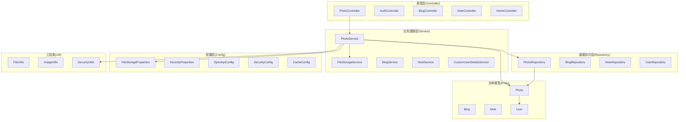
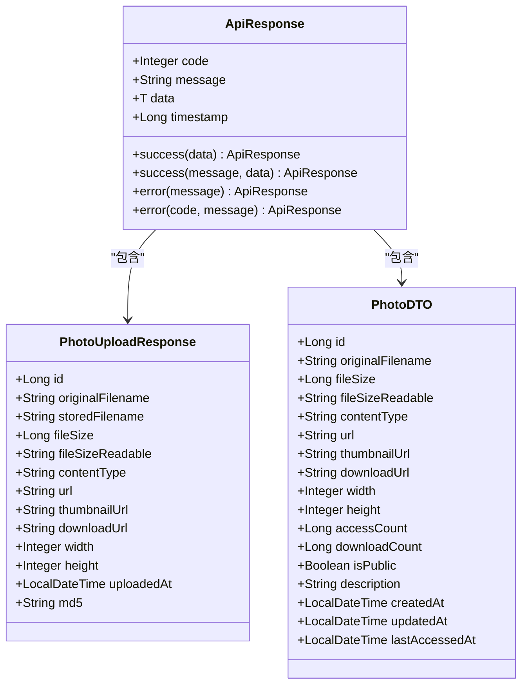
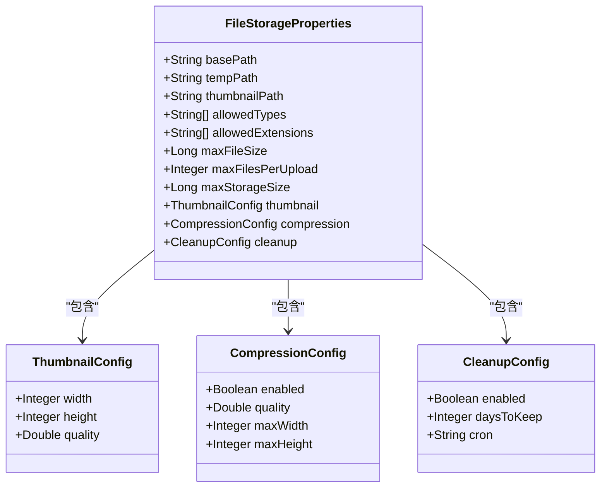
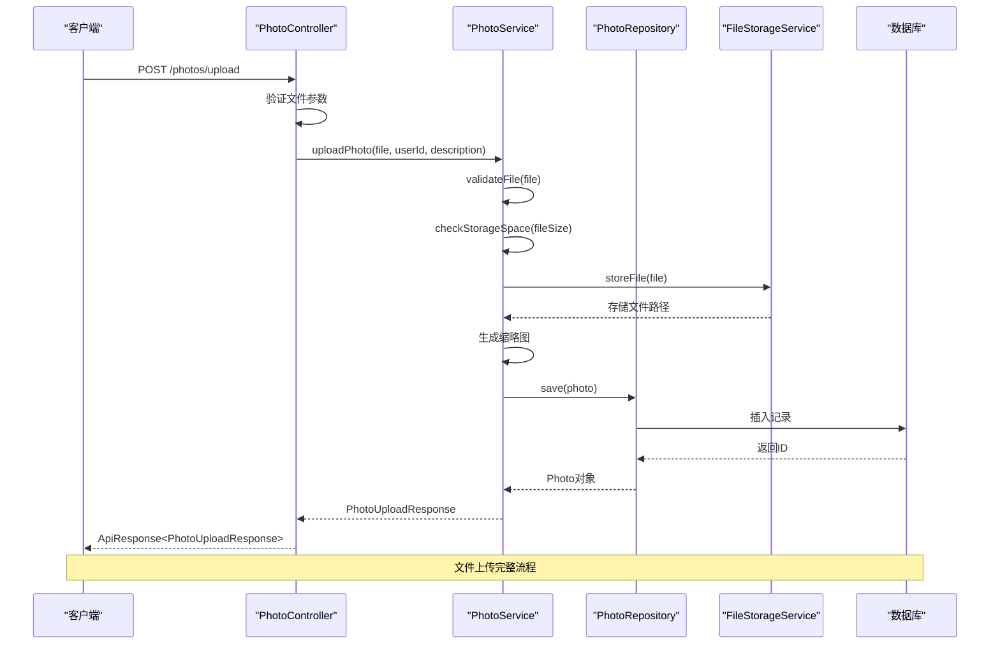
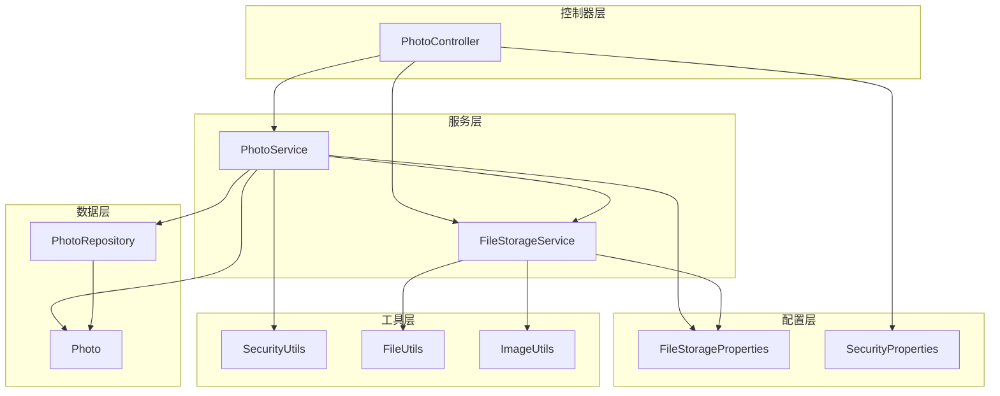
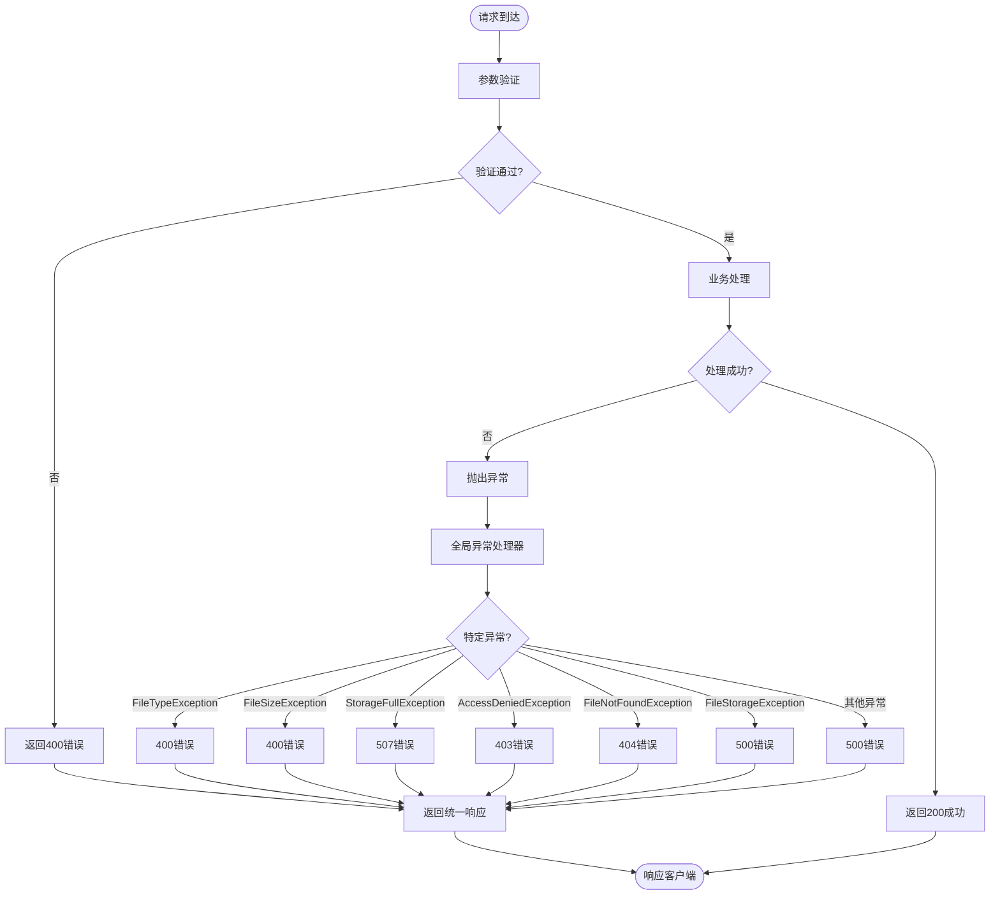

# API接口文档

<cite>
**本文档引用的文件**
- [PhotoController.java](file://src/main/java/com/photo/controller/PhotoController.java)
- [PhotoService.java](file://src/main/java/com/photo/service/PhotoService.java)
- [PhotoDTO.java](file://src/main/java/com/photo/dto/PhotoDTO.java)
- [PhotoUploadResponse.java](file://src/main/java/com/photo/dto/PhotoUploadResponse.java)
- [ApiResponse.java](file://src/main/java/com/photo/dto/ApiResponse.java)
- [FileStorageProperties.java](file://src/main/java/com/photo/config/FileStorageProperties.java)
- [SecurityProperties.java](file://src/main/java/com/photo/config/SecurityProperties.java)
- [StorageInfo.java](file://src/main/java/com/photo/dto/StorageInfo.java)
- [GlobalExceptionHandler.java](file://src/main/java/com/photo/exception/GlobalExceptionHandler.java)
- [application.yml](file://src/main/resources/application.yml)
- [Photo.java](file://src/main/java/com/photo/entity/Photo.java)
- [SecurityUtils.java](file://src/main/java/com/photo/util/SecurityUtils.java)
- [API_DOCUMENTATION.md](file://API_DOCUMENTATION.md)
- [README.md](file://README.md)
- [PhotoControllerTest.java](file://src/test/java/com/photo/controller/PhotoControllerTest.java)
</cite>

## 目录
1. [简介](#简介)
2. [项目结构](#项目结构)
3. [核心组件](#核心组件)
4. [架构概览](#架构概览)
5. [详细接口说明](#详细接口说明)
6. [依赖关系分析](#依赖关系分析)
7. [性能考虑](#性能考虑)
8. [故障排除指南](#故障排除指南)
9. [结论](#结论)
10. [附录](#附录)

## 简介

照片上传下载系统是一个基于Spring Boot 3.2.0开发的企业级照片管理平台，提供完整的文件管理功能，包括上传、下载、在线预览、断点续传等。系统采用RESTful API设计，支持标准的响应格式和全局异常处理机制。

## 项目结构

系统采用经典的三层架构设计，主要包含以下模块：



**图表来源**
- [PhotoController.java](file://src/main/java/com/photo/controller/PhotoController.java#L30-L34)
- [PhotoService.java](file://src/main/java/com/photo/service/PhotoService.java#L34-L36)
- [FileStorageProperties.java](file://src/main/java/com/photo/config/FileStorageProperties.java#L12-L15)
- [SecurityProperties.java](file://src/main/java/com/photo/config/SecurityProperties.java#L12-L15)

**章节来源**
- [PhotoController.java](file://src/main/java/com/photo/controller/PhotoController.java#L1-L316)
- [PhotoService.java](file://src/main/java/com/photo/service/PhotoService.java#L1-L385)
- [application.yml](file://src/main/resources/application.yml#L1-L190)

## 核心组件

### 统一响应格式

系统采用统一的API响应格式，确保所有接口返回一致的数据结构：



**图表来源**
- [ApiResponse.java](file://src/main/java/com/photo/dto/ApiResponse.java#L10-L62)
- [PhotoUploadResponse.java](file://src/main/java/com/photo/dto/PhotoUploadResponse.java#L10-L83)
- [PhotoDTO.java](file://src/main/java/com/photo/dto/PhotoDTO.java#L10-L103)

### 文件存储配置

系统支持灵活的文件存储配置，包括文件类型限制、大小限制、压缩设置等：



**图表来源**
- [FileStorageProperties.java](file://src/main/java/com/photo/config/FileStorageProperties.java#L12-L93)

**章节来源**
- [ApiResponse.java](file://src/main/java/com/photo/dto/ApiResponse.java#L1-L63)
- [FileStorageProperties.java](file://src/main/java/com/photo/config/FileStorageProperties.java#L1-L94)

## 架构概览

系统采用分层架构设计，各层职责明确，耦合度低：



**图表来源**
- [PhotoController.java](file://src/main/java/com/photo/controller/PhotoController.java#L48-L61)
- [PhotoService.java](file://src/main/java/com/photo/service/PhotoService.java#L50-L111)

**章节来源**
- [PhotoController.java](file://src/main/java/com/photo/controller/PhotoController.java#L1-L316)
- [PhotoService.java](file://src/main/java/com/photo/service/PhotoService.java#L1-L385)

## 详细接口说明

### 1. 上传单个照片

**接口地址**: `POST /photos/upload`

**请求类型**: `multipart/form-data`

**请求参数**:
| 参数名 | 类型 | 必填 | 说明 |
|--------|------|------|------|
| file | File | 是 | 图片文件 |
| userId | String | 否 | 用户ID，默认为"guest" |
| description | String | 否 | 照片描述 |

**文件限制**:
- 支持格式：JPG, JPEG, PNG, GIF, BMP, WEBP
- 最大大小：10MB

**成功响应示例**:
```json
{
  "code": 200,
  "message": "上传成功",
  "data": {
    "id": 1,
    "originalFilename": "photo.jpg",
    "storedFilename": "abc123def456.jpg",
    "fileSize": 1024000,
    "fileSizeReadable": "1.00 MB",
    "contentType": "image/jpeg",
    "url": "/api/photos/view/abc123def456.jpg",
    "thumbnailUrl": "/api/photos/thumbnail/abc123def456.jpg",
    "downloadUrl": "/api/photos/download/abc123def456.jpg",
    "width": 1920,
    "height": 1080,
    "uploadedAt": "2024-01-01T12:00:00",
    "md5": "abc123def456"
  },
  "timestamp": 1704110400000
}
```

**cURL示例**:
```bash
curl -X POST http://localhost:8080/api/photos/upload \
  -F "file=@/path/to/photo.jpg" \
  -F "userId=user123" \
  -F "description=我的照片"
```

**章节来源**
- [PhotoController.java](file://src/main/java/com/photo/controller/PhotoController.java#L48-L61)
- [PhotoService.java](file://src/main/java/com/photo/service/PhotoService.java#L50-L111)

### 2. 批量上传照片

**接口地址**: `POST /photos/upload/batch`

**请求类型**: `multipart/form-data`

**请求参数**:
| 参数名 | 类型 | 必填 | 说明 |
|--------|------|------|------|
| files | File[] | 是 | 图片文件数组（最多10个） |
| userId | String | 否 | 用户ID，默认为"guest" |
| description | String | 否 | 照片描述 |

**成功响应示例**:
```json
{
  "code": 200,
  "message": "批量上传成功",
  "data": [
    {
      "id": 1,
      "originalFilename": "photo1.jpg",
      "storedFilename": "abc123def456.jpg",
      "fileSize": 1024000,
      "fileSizeReadable": "1.00 MB",
      "contentType": "image/jpeg",
      "url": "/api/photos/view/abc123def456.jpg",
      "thumbnailUrl": "/api/photos/thumbnail/abc123def456.jpg",
      "downloadUrl": "/api/photos/download/abc123def456.jpg",
      "width": 1920,
      "height": 1080,
      "uploadedAt": "2024-01-01T12:00:00",
      "md5": "abc123def456"
    },
    {
      "id": 2,
      "originalFilename": "photo2.jpg",
      "storedFilename": "xyz789uvw012.jpg",
      "fileSize": 2048000,
      "fileSizeReadable": "2.00 MB",
      "contentType": "image/jpeg",
      "url": "/api/photos/view/xyz789uvw012.jpg",
      "thumbnailUrl": "/api/photos/thumbnail/xyz789uvw012.jpg",
      "downloadUrl": "/api/photos/download/xyz789uvw012.jpg",
      "width": 1920,
      "height": 1080,
      "uploadedAt": "2024-01-01T12:00:00",
      "md5": "xyz789uvw012"
    }
  ],
  "timestamp": 1704110400000
}
```

**cURL示例**:
```bash
curl -X POST http://localhost:8080/api/photos/upload/batch \
  -F "files=@/path/to/photo1.jpg" \
  -F "files=@/path/to/photo2.jpg" \
  -F "userId=user123"
```

**章节来源**
- [PhotoController.java](file://src/main/java/com/photo/controller/PhotoController.java#L66-L79)
- [PhotoService.java](file://src/main/java/com/photo/service/PhotoService.java#L116-L136)

### 3. 在线预览照片

**接口地址**: `GET /photos/view/{filename}`

**请求参数**:
| 参数名 | 类型 | 必填 | 说明 |
|--------|------|------|------|
| filename | String | 是 | 文件名（路径参数） |

**响应**: 直接返回图片二进制流

**响应头**:
- `Content-Type`: image/jpeg (或其他图片类型)
- `Cache-Control`: max-age=3600

**示例**:
```
http://localhost:8080/api/photos/view/abc123def456.jpg
```

**章节来源**
- [PhotoController.java](file://src/main/java/com/photo/controller/PhotoController.java#L84-L117)

### 4. 查看缩略图

**接口地址**: `GET /photos/thumbnail/{filename}`

**请求参数**:
| 参数名 | 类型 | 必填 | 说明 |
|--------|------|------|------|
| filename | String | 是 | 文件名（路径参数） |

**响应**: 返回缩略图二进制流（200x200像素）

**示例**:
```
http://localhost:8080/api/photos/thumbnail/abc123def456.jpg
```

**章节来源**
- [PhotoController.java](file://src/main/java/com/photo/controller/PhotoController.java#L122-L144)

### 5. 下载照片

**接口地址**: `GET /photos/download/{filename}`

**请求参数**:
| 参数名 | 类型 | 必填 | 说明 |
|--------|------|------|------|
| filename | String | 是 | 文件名（路径参数） |

**响应**: 返回文件下载流

**响应头**:
- `Content-Type`: application/octet-stream
- `Content-Disposition`: attachment; filename="original_filename.jpg"

**示例**:
```
http://localhost:8080/api/photos/download/abc123def456.jpg
```

**章节来源**
- [PhotoController.java](file://src/main/java/com/photo/controller/PhotoController.java#L149-L179)

### 6. 断点续传下载

**接口地址**: `GET /photos/download/range/{filename}`

**请求参数**:
| 参数名 | 类型 | 必填 | 说明 |
|--------|------|------|------|
| filename | String | 是 | 文件名（路径参数） |

**请求头**:
| 参数名 | 类型 | 必填 | 说明 |
|--------|------|------|------|
| Range | String | 否 | 字节范围，如 "bytes=0-1023" |

**响应**: 返回指定范围的文件内容

**响应头**:
- `Content-Range`: bytes 0-1023/10240
- `Accept-Ranges`: bytes

**HTTP状态码**: 206 (Partial Content)

**cURL示例**:
```bash
curl -H "Range: bytes=0-1023" \
  http://localhost:8080/api/photos/download/range/abc123def456.jpg
```

**章节来源**
- [PhotoController.java](file://src/main/java/com/photo/controller/PhotoController.java#L184-L225)

### 7. 获取照片信息

**接口地址**: `GET /photos/{id}`

**请求参数**:
| 参数名 | 类型 | 必填 | 说明 |
|--------|------|------|------|
| id | Long | 是 | 照片ID（路径参数） |

**成功响应示例**:
```json
{
  "code": 200,
  "message": "操作成功",
  "data": {
    "id": 1,
    "originalFilename": "photo.jpg",
    "fileSize": 1024000,
    "fileSizeReadable": "1.00 MB",
    "contentType": "image/jpeg",
    "url": "/api/photos/view/abc123def456.jpg",
    "thumbnailUrl": "/api/photos/thumbnail/abc123def456.jpg",
    "downloadUrl": "/api/photos/download/abc123def456.jpg",
    "width": 1920,
    "height": 1080,
    "accessCount": 10,
    "downloadCount": 5,
    "isPublic": true,
    "description": "我的照片",
    "createdAt": "2024-01-01T12:00:00",
    "updatedAt": "2024-01-01T12:00:00",
    "lastAccessedAt": "2024-01-01T13:00:00"
  },
  "timestamp": 1704110400000
}
```

**章节来源**
- [PhotoController.java](file://src/main/java/com/photo/controller/PhotoController.java#L230-L237)
- [PhotoService.java](file://src/main/java/com/photo/service/PhotoService.java#L141-L151)

### 8. 获取用户照片列表

**接口地址**: `GET /photos/user/{userId}`

**请求参数**:
| 参数名 | 类型 | 必填 | 说明 |
|--------|------|------|------|
| userId | String | 是 | 用户ID（路径参数） |
| page | Integer | 否 | 页码，从0开始，默认0 |
| size | Integer | 否 | 每页数量，默认20 |

**成功响应示例**:
```json
{
  "code": 200,
  "message": "操作成功",
  "data": {
    "content": [...],
    "pageable": {...},
    "totalPages": 5,
    "totalElements": 100,
    "size": 20,
    "number": 0
  },
  "timestamp": 1704110400000
}
```

**章节来源**
- [PhotoController.java](file://src/main/java/com/photo/controller/PhotoController.java#L242-L251)
- [PhotoService.java](file://src/main/java/com/photo/service/PhotoService.java#L165-L169)

### 9. 获取公开照片列表

**接口地址**: `GET /photos/public`

**请求参数**:
| 参数名 | 类型 | 必填 | 说明 |
|--------|------|------|------|
| page | Integer | 否 | 页码，从0开始，默认0 |
| size | Integer | 否 | 每页数量，默认20 |

**成功响应示例**: 同上

**章节来源**
- [PhotoController.java](file://src/main/java/com/photo/controller/PhotoController.java#L256-L264)
- [PhotoService.java](file://src/main/java/com/photo/service/PhotoService.java#L174-L178)

### 10. 搜索照片

**接口地址**: `GET /photos/search`

**请求参数**:
| 参数名 | 类型 | 必填 | 说明 |
|--------|------|------|------|
| keyword | String | 是 | 搜索关键词 |
| page | Integer | 否 | 页码，从0开始，默认0 |
| size | Integer | 否 | 每页数量，默认20 |

**成功响应示例**: 同上

**示例**:
```
http://localhost:8080/api/photos/search?keyword=vacation&page=0&size=10
```

**章节来源**
- [PhotoController.java](file://src/main/java/com/photo/controller/PhotoController.java#L269-L278)
- [PhotoService.java](file://src/main/java/com/photo/service/PhotoService.java#L183-L187)

### 11. 删除照片（软删除）

**接口地址**: `DELETE /photos/{id}`

**请求参数**:
| 参数名 | 类型 | 必填 | 说明 |
|--------|------|------|------|
| id | Long | 是 | 照片ID（路径参数） |
| userId | String | 是 | 用户ID（查询参数） |

**成功响应示例**:
```json
{
  "code": 200,
  "message": "删除成功",
  "data": null,
  "timestamp": 1704110400000
}
```

**cURL示例**:
```bash
curl -X DELETE "http://localhost:8080/api/photos/1?userId=user123"
```

**章节来源**
- [PhotoController.java](file://src/main/java/com/photo/controller/PhotoController.java#L283-L291)
- [PhotoService.java](file://src/main/java/com/photo/service/PhotoService.java#L192-L205)

### 12. 永久删除照片

**接口地址**: `DELETE /photos/{id}/permanent`

**请求参数**:
| 参数名 | 类型 | 必填 | 说明 |
|--------|------|------|------|
| id | Long | 是 | 照片ID（路径参数） |
| userId | String | 是 | 用户ID（查询参数） |

**成功响应示例**:
```json
{
  "code": 200,
  "message": "永久删除成功",
  "data": null,
  "timestamp": 1704110400000
}
```

**章节来源**
- [PhotoController.java](file://src/main/java/com/photo/controller/PhotoController.java#L296-L304)
- [PhotoService.java](file://src/main/java/com/photo/service/PhotoService.java#L209-L234)

### 13. 获取存储空间信息

**接口地址**: `GET /photos/storage/info`

**成功响应示例**:
```json
{
  "code": 200,
  "message": "操作成功",
  "data": {
    "usedSpace": 1024000000,
    "usedSpaceReadable": "976.56 MB",
    "totalSpace": 10737418240,
    "totalSpaceReadable": "10.00 GB",
    "freeSpace": 9713418240,
    "freeSpaceReadable": "9.05 GB",
    "usagePercentage": 9.54,
    "totalFiles": 150
  },
  "timestamp": 1704110400000
}
```

**章节来源**
- [PhotoController.java](file://src/main/java/com/photo/controller/PhotoController.java#L309-L314)
- [PhotoService.java](file://src/main/java/com/photo/service/PhotoService.java#L255-L271)

## 依赖关系分析

系统各组件之间的依赖关系如下：



**图表来源**
- [PhotoController.java](file://src/main/java/com/photo/controller/PhotoController.java#L36-L43)
- [PhotoService.java](file://src/main/java/com/photo/service/PhotoService.java#L38-L45)

**章节来源**
- [PhotoController.java](file://src/main/java/com/photo/controller/PhotoController.java#L1-L316)
- [PhotoService.java](file://src/main/java/com/photo/service/PhotoService.java#L1-L385)

## 性能考虑

### 缓存策略

系统采用多层缓存机制来提升性能：

1. **Caffeine缓存**: 缓存照片元数据，减少数据库查询
2. **浏览器缓存**: 图片预览和缩略图设置合理的缓存头
3. **CDN缓存**: 生产环境建议使用CDN加速静态资源

### 性能优化措施

1. **图片压缩**: 自动压缩大尺寸图片，支持配置压缩质量
2. **缩略图生成**: 自动生成200x200像素缩略图
3. **断点续传**: 支持Range请求，适合大文件下载
4. **数据库索引**: 对常用查询字段建立索引优化查询性能

### 存储管理

1. **定期清理**: 支持定时清理过期文件，默认保留30天
2. **存储监控**: 提供存储空间使用情况统计
3. **容量限制**: 支持配置最大存储容量

**章节来源**
- [FileStorageProperties.java](file://src/main/java/com/photo/config/FileStorageProperties.java#L72-L93)
- [PhotoService.java](file://src/main/java/com/photo/service/PhotoService.java#L276-L299)

## 故障排除指南

### 常见错误码说明

| 错误码 | 说明 | 示例消息 |
|--------|------|----------|
| 400 | 请求参数错误 | "不支持的文件类型: text/plain" |
| 400 | 文件大小超限 | "文件大小不能超过 10.00 MB" |
| 403 | 访问被拒绝 | "无权删除该照片" |
| 403 | 非法访问来源 | "非法访问来源" |
| 404 | 资源不存在 | "照片不存在: 123" |
| 500 | 服务器内部错误 | "文件存储失败" |
| 507 | 存储空间不足 | "存储空间不足" |

### 异常处理机制

系统采用全局异常处理器统一处理各种异常情况：



**图表来源**
- [GlobalExceptionHandler.java](file://src/main/java/com/photo/exception/GlobalExceptionHandler.java#L26-L138)

**章节来源**
- [GlobalExceptionHandler.java](file://src/main/java/com/photo/exception/GlobalExceptionHandler.java#L1-L140)

### 安全考虑

1. **文件类型验证**: 使用Apache Tika进行MIME类型检测，不仅依赖文件扩展名
2. **文件大小限制**: 单文件最大10MB，可在配置文件中调整
3. **防盗链**: 可配置允许的Referer域名列表
4. **XSS防护**: 对所有输入进行HTML转义
5. **路径遍历防护**: 严格验证文件名，防止目录遍历攻击
6. **访问权限控制**: 私有照片仅所有者可访问

**章节来源**
- [SecurityUtils.java](file://src/main/java/com/photo/util/SecurityUtils.java#L18-L167)
- [PhotoController.java](file://src/main/java/com/photo/controller/PhotoController.java#L92-L97)

## 结论

本照片上传下载系统提供了完整的企业级文件管理解决方案，具有以下特点：

1. **完整的功能覆盖**: 支持上传、下载、预览、搜索、删除等核心功能
2. **高性能设计**: 采用多层缓存、图片压缩、断点续传等优化技术
3. **安全性保障**: 多重安全防护机制，包括文件类型验证、防盗链、XSS防护等
4. **易扩展性**: 基于Spring Boot框架，易于二次开发和功能扩展
5. **标准化接口**: RESTful API设计，统一响应格式，便于客户端集成

系统适用于需要照片管理功能的各种应用场景，如相册系统、图片分享平台、企业内部文件管理系统等。

## 附录

### API测试工具推荐

1. **Postman**: 功能全面的API测试工具
2. **curl**: 命令行测试工具，适合自动化脚本
3. **Swagger UI**: 内置的API文档和测试界面
4. **JMeter**: 性能测试工具

### 客户端实现最佳实践

1. **错误处理**: 始终检查HTTP状态码和响应数据
2. **进度显示**: 对于大文件上传，提供上传进度反馈
3. **断点续传**: 对于大文件下载，实现断点续传功能
4. **缓存策略**: 合理使用浏览器缓存和应用缓存
5. **安全考虑**: 对用户输入进行验证和清理

### 部署建议

1. **生产环境配置**: 修改默认安全配置，使用专业对象存储服务
2. **监控告警**: 设置存储空间使用监控和告警
3. **备份策略**: 定期备份数据库和上传文件
4. **性能调优**: 根据实际负载调整服务器配置

**章节来源**
- [README.md](file://README.md#L1-L265)
- [API_DOCUMENTATION.md](file://API_DOCUMENTATION.md#L1-L509)