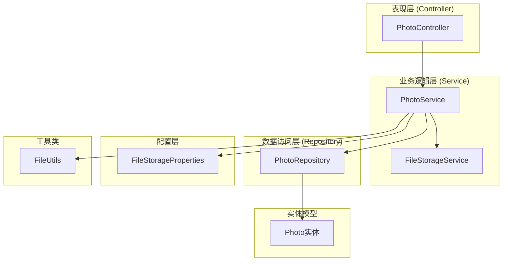
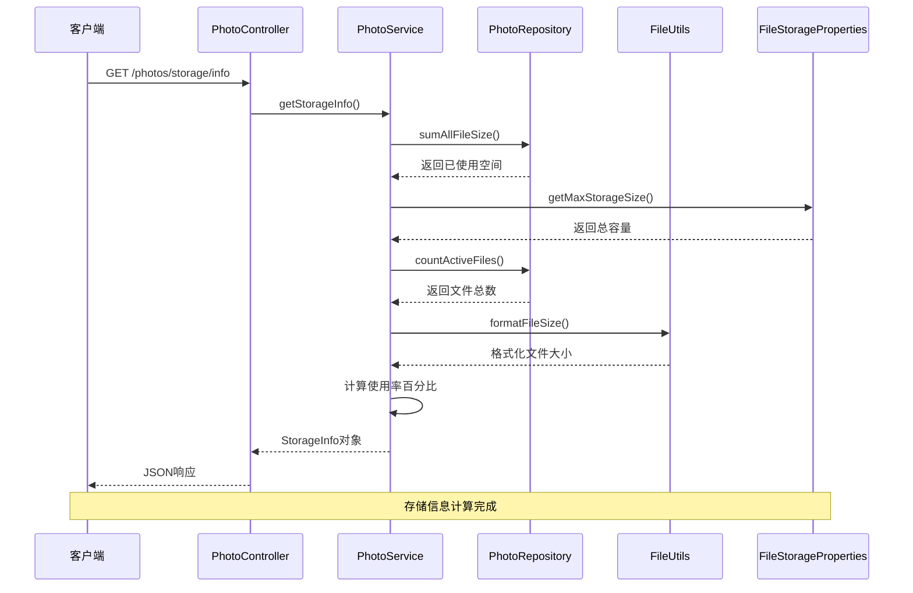
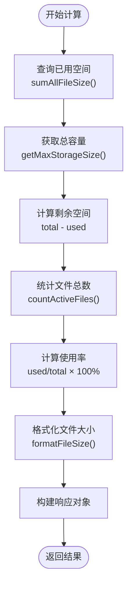
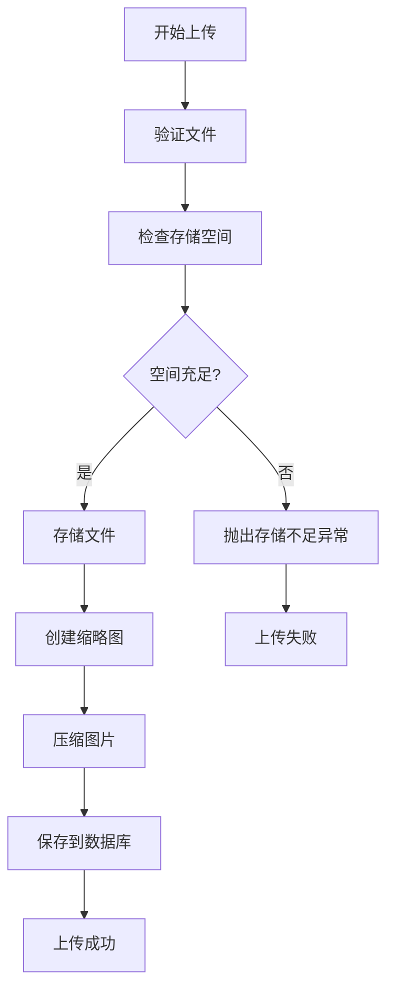
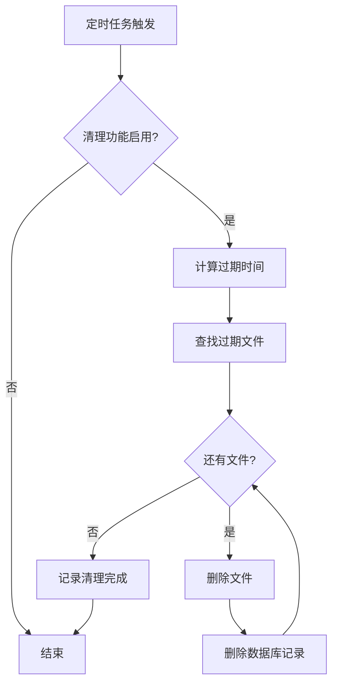
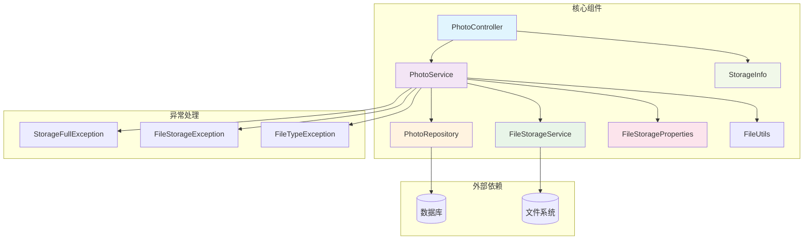

# 存储管理接口

<cite>
**本文档引用的文件**
- [PhotoController.java](file://src/main/java/com/photo/controller/PhotoController.java)
- [StorageInfo.java](file://src/main/java/com/photo/dto/StorageInfo.java)
- [PhotoService.java](file://src/main/java/com/photo/service/PhotoService.java)
- [FileStorageService.java](file://src/main/java/com/photo/service/FileStorageService.java)
- [FileStorageProperties.java](file://src/main/java/com/photo/config/FileStorageProperties.java)
- [PhotoRepository.java](file://src/main/java/com/photo/repository/PhotoRepository.java)
- [FileUtils.java](file://src/main/java/com/photo/util/FileUtils.java)
- [StorageFullException.java](file://src/main/java/com/photo/exception/StorageFullException.java)
- [application.yml](file://src/main/resources/application.yml)
- [README.md](file://README.md)
</cite>

## 目录
1. [简介](#简介)
2. [项目结构](#项目结构)
3. [核心组件](#核心组件)
4. [架构概览](#架构概览)
5. [详细组件分析](#详细组件分析)
6. [依赖关系分析](#依赖关系分析)
7. [性能考虑](#性能考虑)
8. [故障排除指南](#故障排除指南)
9. [结论](#结论)

## 简介

本文档详细说明了照片上传系统中的存储管理接口，特别是 `GET /photos/storage/info` 接口的功能和用途。该接口提供了完整的存储空间监控功能，包括已用空间、总空间、可用空间、使用率统计等关键指标。

系统采用基于Spring Boot的企业级架构，实现了完整的文件管理功能，包括上传、下载、在线预览、断点续传等特性。存储管理模块通过数据库层面的文件大小统计和配置文件中的容量限制，为用户提供实时的存储空间使用情况。

## 项目结构

照片上传系统采用标准的MVC架构模式，主要分为以下几个层次：

**图表来源**
- [PhotoController.java](file://src/main/java/com/photo/controller/PhotoController.java#L30-L316)
- [PhotoService.java](file://src/main/java/com/photo/service/PhotoService.java#L34-L385)
- [FileStorageService.java](file://src/main/java/com/photo/service/FileStorageService.java#L22-L300)
- [PhotoRepository.java](file://src/main/java/com/photo/repository/PhotoRepository.java#L19-L112)

**章节来源**
- [PhotoController.java](file://src/main/java/com/photo/controller/PhotoController.java#L30-L316)
- [PhotoService.java](file://src/main/java/com/photo/service/PhotoService.java#L34-L385)

## 核心组件

### 存储信息数据传输对象 (StorageInfo)

存储信息通过专门的数据传输对象进行封装，提供完整的存储空间统计信息：

| 字段名称 | 类型 | 描述 | 单位 |
|---------|------|------|------|
| usedSpace | Long | 已使用空间 | 字节 |
| usedSpaceReadable | String | 已使用空间(可读格式) | B/KB/MB/GB |
| totalSpace | Long | 总空间 | 字节 |
| totalSpaceReadable | String | 总空间(可读格式) | B/KB/MB/GB |
| freeSpace | Long | 剩余空间 | 字节 |
| freeSpaceReadable | String | 剩余空间(可读格式) | B/KB/MB/GB |
| usagePercentage | Double | 使用百分比 | 百分比 |
| totalFiles | Long | 文件总数 | 个数 |

**章节来源**
- [StorageInfo.java](file://src/main/java/com/photo/dto/StorageInfo.java#L15-L56)

### 存储配置属性 (FileStorageProperties)

系统通过配置文件定义存储相关的各项参数：

| 配置项 | 默认值 | 描述 |
|--------|--------|------|
| file.storage.base-path | ./uploads | 文件存储根目录 |
| file.storage.temp-path | ./uploads/temp | 临时文件目录 |
| file.storage.thumbnail-path | ./uploads/thumbnails | 缩略图目录 |
| file.storage.max-file-size | 10485760 (10MB) | 最大文件大小 |
| file.storage.max-storage-size | 10737418240 (10GB) | 最大存储容量 |
| file.storage.cleanup.enabled | true | 是否启用定期清理 |
| file.storage.cleanup.days-to-keep | 30 | 保留天数 |
| file.storage.cleanup.cron | "0 0 2 * * ?" | 定时任务执行时间 |

**章节来源**
- [FileStorageProperties.java](file://src/main/java/com/photo/config/FileStorageProperties.java#L15-L94)
- [application.yml](file://src/main/resources/application.yml#L69-L118)

## 架构概览

存储管理接口的完整架构流程如下：

**图表来源**
- [PhotoController.java](file://src/main/java/com/photo/controller/PhotoController.java#L307-L314)
- [PhotoService.java](file://src/main/java/com/photo/service/PhotoService.java#L255-L271)
- [PhotoRepository.java](file://src/main/java/com/photo/repository/PhotoRepository.java#L57-L58)
- [FileUtils.java](file://src/main/java/com/photo/util/FileUtils.java#L142-L152)

## 详细组件分析

### GET /photos/storage/info 接口实现

#### 接口规范

| 属性 | 详情 |
|------|------|
| 方法 | GET |
| 路径 | /photos/storage/info |
| 功能 | 查询存储空间使用情况 |
| 权限 | 无需认证 |
| 响应类型 | ApiResponse<StorageInfo> |

#### 存储信息计算逻辑

存储信息的计算过程遵循以下步骤：

1. **已用空间统计**：通过数据库查询所有未删除文件的大小总和
2. **总空间获取**：从配置中读取最大存储容量限制
3. **剩余空间计算**：总空间 - 已用空间
4. **使用率计算**：(已用空间 / 总空间) × 100%
5. **文件总数统计**：统计所有未删除文件的数量

**图表来源**
- [PhotoService.java](file://src/main/java/com/photo/service/PhotoService.java#L255-L271)
- [PhotoRepository.java](file://src/main/java/com/photo/repository/PhotoRepository.java#L57-L64)
- [FileUtils.java](file://src/main/java/com/photo/util/FileUtils.java#L142-L152)

#### 存储空间监控实现原理

系统通过三层机制确保存储监控的准确性和实时性：

1. **数据库层面统计**：使用JPA查询聚合函数精确统计文件大小
2. **配置层面限制**：通过配置文件统一管理存储容量限制
3. **工具层面格式化**：提供人性化的时间和大小格式化功能

**章节来源**
- [PhotoService.java](file://src/main/java/com/photo/service/PhotoService.java#L255-L271)
- [PhotoRepository.java](file://src/main/java/com/photo/repository/PhotoRepository.java#L57-L64)

### 存储空间不足处理机制

系统实现了完善的存储空间不足预防和处理机制：

#### 上传前检查

**图表来源**
- [PhotoService.java](file://src/main/java/com/photo/service/PhotoService.java#L50-L111)
- [PhotoService.java](file://src/main/java/com/photo/service/PhotoService.java#L329-L336)

#### 异常处理策略

当存储空间不足时，系统会抛出 `StorageFullException` 异常，客户端需要捕获并处理此异常：

| 异常类型 | 触发条件 | 处理建议 |
|----------|----------|----------|
| StorageFullException | 已用空间 + 新文件大小 > 总容量 | 提示用户清理空间或升级容量 |
| FileSizeException | 单个文件超过最大限制 | 提示用户选择更小的文件 |
| FileStorageException | 文件存储操作失败 | 重试上传或检查磁盘空间 |

**章节来源**
- [StorageFullException.java](file://src/main/java/com/photo/exception/StorageFullException.java#L6-L15)
- [PhotoService.java](file://src/main/java/com/photo/service/PhotoService.java#L329-L336)

### 定期清理机制

系统提供了自动化的存储空间清理功能：

#### 清理策略

| 参数 | 默认值 | 说明 |
|------|--------|------|
| 启用状态 | true | 是否启用定期清理 |
| 保留天数 | 30天 | 文件保留期限 |
| 执行时间 | 每日凌晨2点 | Cron表达式配置 |

#### 清理流程

**图表来源**
- [PhotoService.java](file://src/main/java/com/photo/service/PhotoService.java#L276-L299)
- [PhotoRepository.java](file://src/main/java/com/photo/repository/PhotoRepository.java#L68-L70)

**章节来源**
- [PhotoService.java](file://src/main/java/com/photo/service/PhotoService.java#L276-L299)
- [FileStorageProperties.java](file://src/main/java/com/photo/config/FileStorageProperties.java#L88-L92)

## 依赖关系分析

存储管理模块的依赖关系如下：

**图表来源**
- [PhotoController.java](file://src/main/java/com/photo/controller/PhotoController.java#L34-L44)
- [PhotoService.java](file://src/main/java/com/photo/service/PhotoService.java#L36-L46)
- [PhotoRepository.java](file://src/main/java/com/photo/repository/PhotoRepository.java#L20-L21)

**章节来源**
- [PhotoController.java](file://src/main/java/com/photo/controller/PhotoController.java#L34-L44)
- [PhotoService.java](file://src/main/java/com/photo/service/PhotoService.java#L36-L46)

## 性能考虑

### 存储监控性能优化

1. **数据库查询优化**：使用聚合查询一次性获取所需统计信息
2. **缓存策略**：利用Spring缓存注解减少重复查询
3. **格式化优化**：提供高效的文件大小格式化算法

### 存储容量规划建议

基于系统默认配置，建议的容量规划如下：

| 使用场景 | 建议容量 | 说明 |
|----------|----------|------|
| 开发测试环境 | 1-5GB | 适合小规模测试 |
| 小型企业 | 10-50GB | 支持中等规模用户 |
| 中型企业 | 100-500GB | 支持大规模用户群体 |
| 大型企业 | 1TB以上 | 支持海量用户和文件 |

### 监控指标和告警阈值

建议设置以下监控指标和告警阈值：

| 指标类型 | 正常阈值 | 警告阈值 | 危险阈值 | 处理建议 |
|----------|----------|----------|----------|----------|
| 使用率 | <70% | 70-80% | >80% | 预警通知 |
| 剩余空间 | >1GB | 500MB-1GB | <500MB | 提醒清理 |
| 文件数量 | <10万 | 8万-10万 | >10万 | 检查存储策略 |
| 系统响应时间 | <1秒 | 1-3秒 | >3秒 | 优化数据库 |

**章节来源**
- [application.yml](file://src/main/resources/application.yml#L173-L182)

## 故障排除指南

### 常见问题及解决方案

#### 存储空间监控不准确

**问题现象**：存储使用率与实际不符

**可能原因**：
1. 数据库文件大小统计不准确
2. 缓存导致的数据延迟
3. 文件系统权限问题

**解决方法**：
1. 检查数据库连接和权限
2. 清理应用缓存
3. 验证文件系统写入权限

#### 存储空间不足异常

**问题现象**：上传文件时报存储空间不足

**解决方法**：
1. 清理过期文件
2. 升级存储容量配置
3. 优化文件压缩设置

#### 定期清理功能异常

**问题现象**：过期文件未被清理

**解决方法**：
1. 检查定时任务配置
2. 验证Cron表达式语法
3. 查看清理日志输出

**章节来源**
- [PhotoService.java](file://src/main/java/com/photo/service/PhotoService.java#L276-L299)
- [StorageFullException.java](file://src/main/java/com/photo/exception/StorageFullException.java#L6-L15)

## 结论

存储管理接口为照片上传系统提供了完整的存储空间监控能力。通过数据库层面的精确统计、配置文件的灵活设置以及完善的异常处理机制，系统能够有效管理存储资源并为用户提供准确的存储状态信息。

建议在生产环境中：
1. 根据实际业务需求调整存储容量配置
2. 设置合适的监控告警阈值
3. 定期维护和清理存储空间
4. 考虑使用专业的对象存储服务替代本地存储

该接口的设计充分体现了企业级应用对存储管理的需求，为系统的稳定运行和用户体验提供了重要保障。