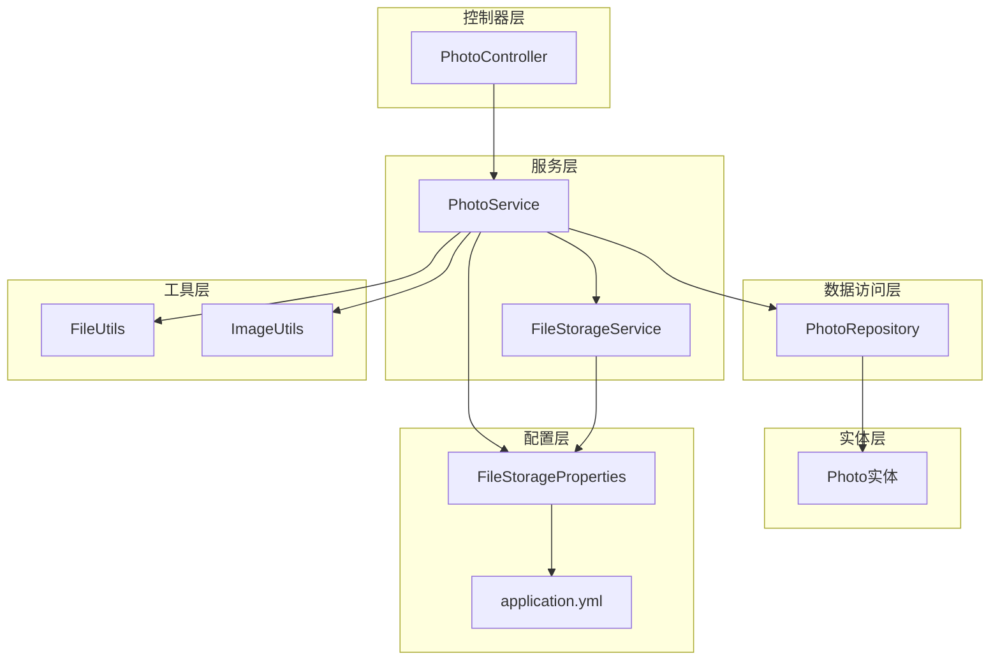
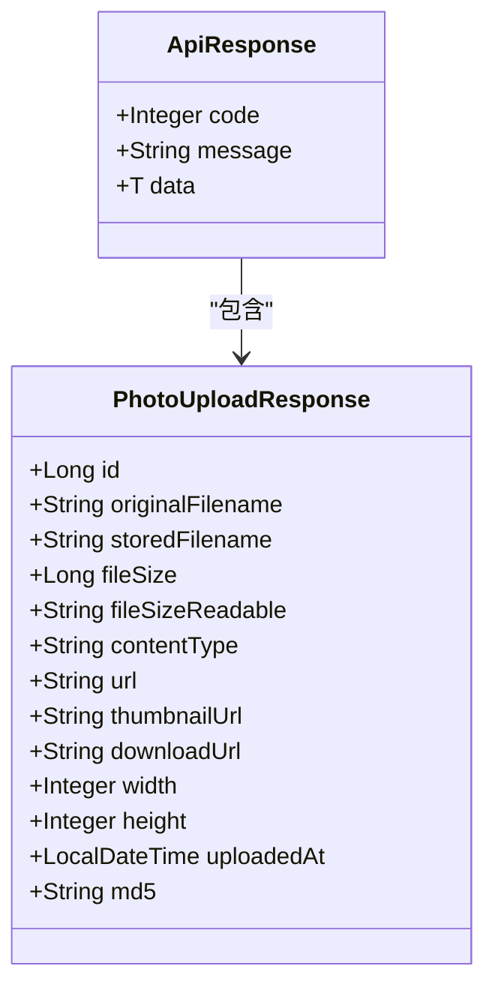
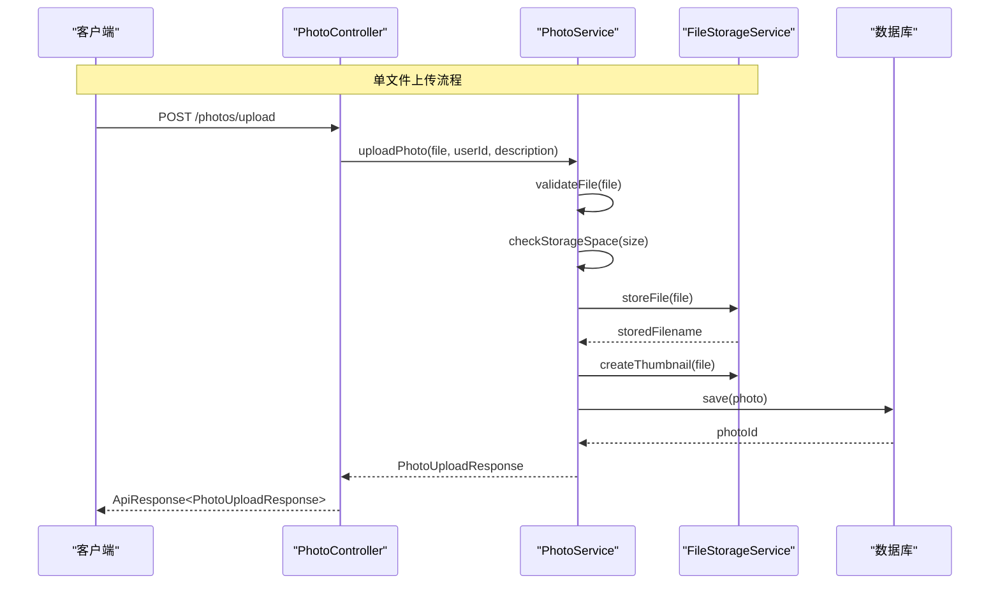
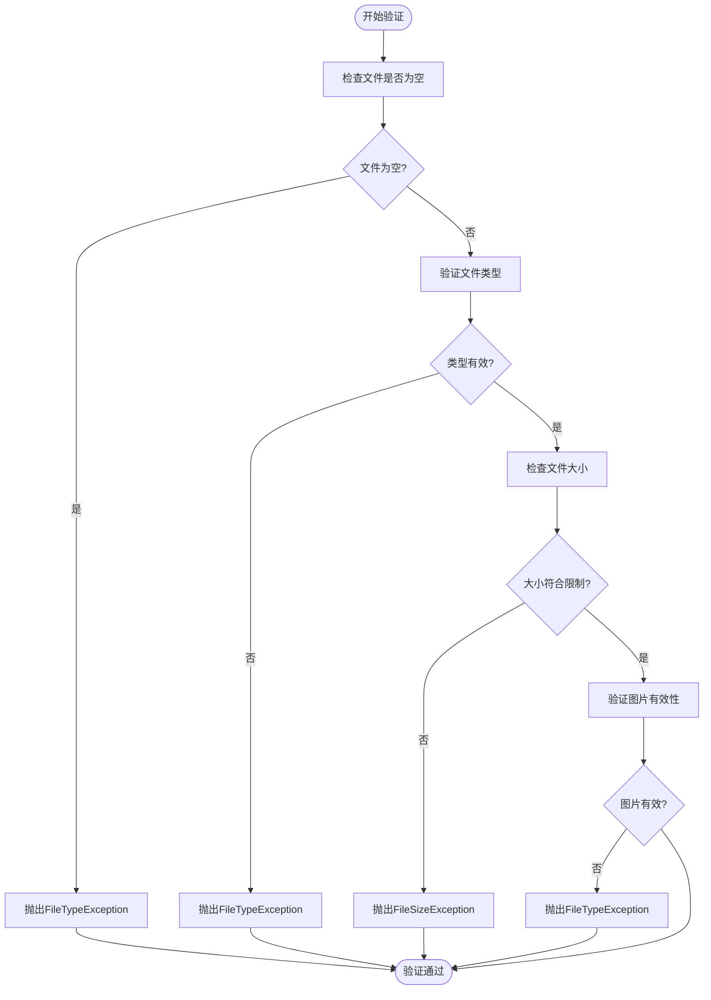
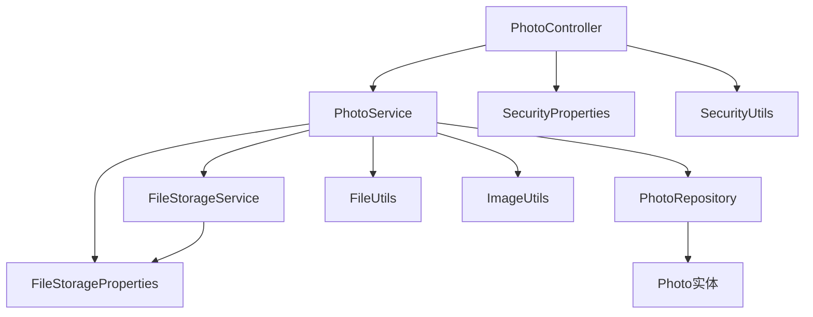
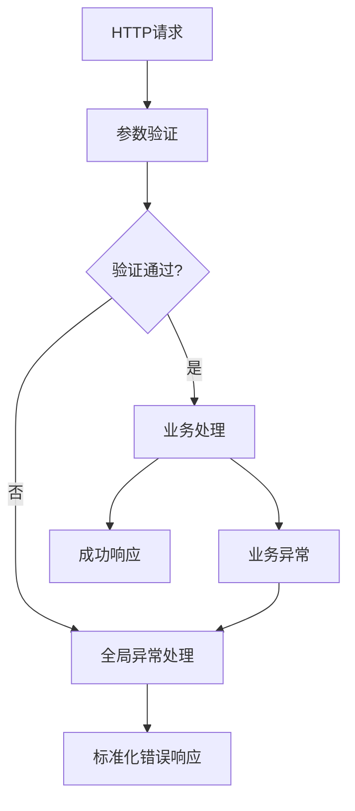

# 文件上传接口

<cite>
**本文档引用的文件**
- [PhotoController.java](file://src/main/java/com/photo/controller/PhotoController.java)
- [PhotoService.java](file://src/main/java/com/photo/service/PhotoService.java)
- [FileStorageService.java](file://src/main/java/com/photo/service/FileStorageService.java)
- [PhotoUploadResponse.java](file://src/main/java/com/photo/dto/PhotoUploadResponse.java)
- [PhotoDTO.java](file://src/main/java/com/photo/dto/PhotoDTO.java)
- [FileStorageProperties.java](file://src/main/java/com/photo/config/FileStorageProperties.java)
- [FileUtils.java](file://src/main/java/com/photo/util/FileUtils.java)
- [ImageUtils.java](file://src/main/java/com/photo/util/ImageUtils.java)
- [application.yml](file://src/main/resources/application.yml)
- [GlobalExceptionHandler.java](file://src/main/java/com/photo/exception/GlobalExceptionHandler.java)
- [Photo.java](file://src/main/java/com/photo/entity/Photo.java)
- [PhotoControllerTest.java](file://src/test/java/com/photo/controller/PhotoControllerTest.java)
- [README.md](file://README.md)
</cite>

## 目录
1. [简介](#简介)
2. [项目结构](#项目结构)
3. [核心组件](#核心组件)
4. [架构概览](#架构概览)
5. [详细组件分析](#详细组件分析)
6. [依赖关系分析](#依赖关系分析)
7. [性能考虑](#性能考虑)
8. [故障排除指南](#故障排除指南)
9. [结论](#结论)
10. [附录](#附录)

## 简介

本项目是一个基于Spring Boot 3.2.0开发的企业级照片上传下载系统，提供完整的文件管理功能。本文档专注于文件上传接口的详细实现，包括单文件上传和批量上传两个核心接口。

系统支持多种文件操作功能：
- 单文件上传和批量上传
- 文件类型验证（仅支持图片格式）
- 文件大小限制（最大10MB）
- 自动生成唯一文件名（UUID）
- MD5去重检测
- 自动缩略图生成
- 图片压缩功能
- 防盗链保护
- 存储空间监控

## 项目结构

项目采用标准的Spring Boot分层架构，主要包含以下模块：



**图表来源**
- [PhotoController.java](file://src/main/java/com/photo/controller/PhotoController.java#L30-L34)
- [PhotoService.java](file://src/main/java/com/photo/service/PhotoService.java#L34-L36)
- [FileStorageService.java](file://src/main/java/com/photo/service/FileStorageService.java#L22-L24)

**章节来源**
- [PhotoController.java](file://src/main/java/com/photo/controller/PhotoController.java#L1-L316)
- [PhotoService.java](file://src/main/java/com/photo/service/PhotoService.java#L1-L385)
- [FileStorageService.java](file://src/main/java/com/photo/service/FileStorageService.java#L1-L300)

## 核心组件

### 接口概述

系统提供两个核心文件上传接口：

1. **单文件上传接口**: `POST /photos/upload`
2. **批量上传接口**: `POST /photos/upload/batch`

### 请求参数规范

#### 单文件上传参数
| 参数名 | 类型 | 必填 | 默认值 | 说明 |
|--------|------|------|--------|------|
| file | MultipartFile | 是 | - | 要上传的图片文件 |
| userId | String | 否 | guest | 用户标识符 |
| description | String | 否 | null | 文件描述信息 |

#### 批量上传参数
| 参数名 | 类型 | 必填 | 默认值 | 说明 |
|--------|------|------|--------|------|
| files | MultipartFile[] | 是 | - | 图片文件数组 |
| userId | String | 否 | guest | 用户标识符 |
| description | String | 否 | null | 文件描述信息 |

### 响应格式

系统统一使用标准响应格式：



**图表来源**
- [PhotoUploadResponse.java](file://src/main/java/com/photo/dto/PhotoUploadResponse.java#L13-L83)

**章节来源**
- [PhotoUploadResponse.java](file://src/main/java/com/photo/dto/PhotoUploadResponse.java#L1-L84)
- [PhotoDTO.java](file://src/main/java/com/photo/dto/PhotoDTO.java#L1-L104)

## 架构概览

系统采用经典的三层架构模式，通过依赖注入实现松耦合设计：



**图表来源**
- [PhotoController.java](file://src/main/java/com/photo/controller/PhotoController.java#L48-L61)
- [PhotoService.java](file://src/main/java/com/photo/service/PhotoService.java#L50-L111)
- [FileStorageService.java](file://src/main/java/com/photo/service/FileStorageService.java#L59-L95)

**章节来源**
- [PhotoController.java](file://src/main/java/com/photo/controller/PhotoController.java#L45-L79)
- [PhotoService.java](file://src/main/java/com/photo/service/PhotoService.java#L48-L136)

## 详细组件分析

### PhotoController - 控制器层

PhotoController负责处理HTTP请求和响应，是系统的入口点。

#### 关键方法实现

**单文件上传方法** (`uploadPhoto`)
- 接收MultipartFile类型的文件参数
- 验证请求参数的有效性
- 调用PhotoService处理业务逻辑
- 返回标准化的响应格式

**批量上传方法** (`uploadPhotos`)
- 支持多文件同时上传
- 限制单次上传文件数量（默认10个）
- 逐个处理每个文件并收集结果

#### 安全防护机制

控制器实现了多重安全防护：
- 防盗链检查（Referer验证）
- IP地址记录
- 参数验证和过滤

**章节来源**
- [PhotoController.java](file://src/main/java/com/photo/controller/PhotoController.java#L46-L79)

### PhotoService - 服务层

PhotoService是核心业务逻辑的实现者，负责文件验证、存储和数据库操作。

#### 文件验证流程



**图表来源**
- [PhotoService.java](file://src/main/java/com/photo/service/PhotoService.java#L304-L324)

#### 存储策略

1. **去重检测**: 使用MD5算法检测重复文件
2. **唯一文件名**: 生成UUID确保文件名唯一性
3. **目录结构**: 分离存储主文件、缩略图和临时文件
4. **压缩优化**: 可选的图片压缩功能
5. **缩略图生成**: 自动生成固定尺寸的缩略图

#### 数据库操作

- 使用事务保证数据一致性
- 支持软删除机制
- 提供缓存优化
- 定期清理过期文件

**章节来源**
- [PhotoService.java](file://src/main/java/com/photo/service/PhotoService.java#L50-L136)
- [PhotoService.java](file://src/main/java/com/photo/service/PhotoService.java#L304-L336)

### FileStorageService - 存储层

FileStorageService负责文件的实际存储操作。

#### 目录管理

系统维护三个独立的存储目录：
- **基础目录** (`./uploads`): 存储原始文件
- **缩略图目录** (`./uploads/thumbnails`): 存储缩略图
- **临时目录** (`./uploads/temp`): 存储临时文件

#### 文件操作

1. **文件存储**: 安全地复制文件到指定位置
2. **文件读取**: 支持完整文件和部分文件读取
3. **文件删除**: 支持软删除和硬删除
4. **缩略图管理**: 自动生成和管理缩略图

**章节来源**
- [FileStorageService.java](file://src/main/java/com/photo/service/FileStorageService.java#L36-L54)
- [FileStorageService.java](file://src/main/java/com/photo/service/FileStorageService.java#L59-L95)

### 配置管理

系统通过FileStorageProperties集中管理所有配置：

#### 核心配置项

| 配置项 | 默认值 | 说明 |
|--------|--------|------|
| file.storage.base-path | ./uploads | 基础存储目录 |
| file.storage.max-file-size | 10MB | 单文件最大大小 |
| file.storage.max-storage-size | 10GB | 总存储空间限制 |
| file.storage.max-files-per-upload | 10 | 单次上传最大文件数 |
| file.storage.thumbnail.width | 200 | 缩略图宽度 |
| file.storage.thumbnail.height | 200 | 缩略图高度 |
| file.storage.compression.enabled | true | 是否启用压缩 |
| file.storage.cleanup.enabled | true | 是否启用清理功能 |

**章节来源**
- [FileStorageProperties.java](file://src/main/java/com/photo/config/FileStorageProperties.java#L15-L93)
- [application.yml](file://src/main/resources/application.yml#L69-L118)

## 依赖关系分析

系统采用清晰的依赖层次结构：



**图表来源**
- [PhotoController.java](file://src/main/java/com/photo/controller/PhotoController.java#L36-L43)
- [PhotoService.java](file://src/main/java/com/photo/service/PhotoService.java#L38-L45)

### 关键依赖关系

1. **控制器依赖服务层**: PhotoController完全依赖PhotoService进行业务处理
2. **服务层依赖存储层**: PhotoService通过FileStorageService进行文件操作
3. **配置驱动**: 所有存储相关的配置都通过FileStorageProperties统一管理
4. **工具类支持**: FileUtils和ImageUtils提供底层文件处理能力

**章节来源**
- [PhotoController.java](file://src/main/java/com/photo/controller/PhotoController.java#L1-L316)
- [PhotoService.java](file://src/main/java/com/photo/service/PhotoService.java#L1-L385)

## 性能考虑

### 缓存策略

系统实现了多层次的缓存机制：
- **Caffeine缓存**: 用于照片信息的快速访问
- **文件系统缓存**: 操作系统级别的文件缓存
- **浏览器缓存**: 通过HTTP头部控制缓存策略

### 并发处理

- **线程安全**: 所有服务类都是无状态的，支持并发访问
- **事务管理**: 使用@Transactional注解确保数据一致性
- **资源管理**: 正确关闭文件流和数据库连接

### 性能优化

1. **异步处理**: 支持大文件的异步上传
2. **流式处理**: 使用流式I/O减少内存占用
3. **压缩优化**: 可选的图片压缩减少存储空间
4. **索引优化**: 数据库表建立适当的索引提高查询性能

## 故障排除指南

### 常见错误类型

系统定义了多种异常类型来处理不同的错误场景：

| 异常类型 | HTTP状态码 | 错误原因 | 解决方案 |
|----------|------------|----------|----------|
| FileTypeException | 400 | 文件类型不支持 | 检查文件扩展名和MIME类型 |
| FileSizeException | 400 | 文件大小超限 | 减少文件大小或调整配置 |
| StorageFullException | 507 | 存储空间不足 | 清理存储空间或增加配额 |
| FileStorageException | 500 | 文件存储失败 | 检查磁盘空间和权限 |
| AccessDeniedException | 403 | 权限不足 | 验证用户身份和权限 |

### 错误处理机制



**图表来源**
- [GlobalExceptionHandler.java](file://src/main/java/com/photo/exception/GlobalExceptionHandler.java#L22-L138)

### 调试和日志

系统提供了详细的日志记录：
- **请求日志**: 记录所有HTTP请求的详细信息
- **错误日志**: 记录异常堆栈和上下文信息
- **性能日志**: 记录关键操作的执行时间和资源使用

**章节来源**
- [GlobalExceptionHandler.java](file://src/main/java/com/photo/exception/GlobalExceptionHandler.java#L1-L140)

## 结论

本文件上传接口系统具有以下特点：

1. **功能完整**: 提供了从文件上传到存储管理的完整解决方案
2. **安全可靠**: 实现了多层安全防护和异常处理机制
3. **性能优化**: 采用缓存、压缩和流式处理等技术优化性能
4. **易于扩展**: 清晰的架构设计便于功能扩展和维护
5. **配置灵活**: 通过配置文件实现灵活的参数调整

系统适用于企业级应用场景，能够满足高并发、大数据量的文件上传需求。

## 附录

### API使用示例

#### cURL示例

**单文件上传**
```bash
curl -X POST http://localhost:8080/photos/upload \
  -F "file=@/path/to/image.jpg" \
  -F "userId=user123" \
  -F "description=测试图片"
```

**批量上传**
```bash
curl -X POST http://localhost:8080/photos/upload/batch \
  -F "files=@/path/to/image1.jpg" \
  -F "files=@/path/to/image2.png" \
  -F "userId=user123"
```

#### JavaScript示例

**单文件上传**
```javascript
const formData = new FormData();
formData.append('file', fileInput.files[0]);
formData.append('userId', 'user123');
formData.append('description', '测试图片');

fetch('/photos/upload', {
  method: 'POST',
  body: formData
});
```

**批量上传**
```javascript
const formData = new FormData();
selectedFiles.forEach(file => {
  formData.append('files', file);
});
formData.append('userId', 'user123');

fetch('/photos/upload/batch', {
  method: 'POST',
  body: formData
});
```

#### Python示例

**单文件上传**
```python
import requests

files = {
    'file': open('image.jpg', 'rb'),
    'userId': 'user123',
    'description': '测试图片'
}

response = requests.post('http://localhost:8080/photos/upload', files=files)
```

**批量上传**
```python
import requests

files = [
    ('files', open('image1.jpg', 'rb')),
    ('files', open('image2.png', 'rb'))
]
data = {
    'userId': 'user123'
}

response = requests.post('http://localhost:8080/photos/upload/batch', files=files, data=data)
```

### 配置参考

#### 文件存储配置
```yaml
file:
  storage:
    base-path: ./uploads
    temp-path: ./uploads/temp
    thumbnail-path: ./uploads/thumbnails
    max-file-size: 10485760  # 10MB
    max-storage-size: 10737418240  # 10GB
    max-files-per-upload: 10
```

#### 安全配置
```yaml
security:
  referer:
    enabled: true
    allowed-domains:
      - localhost
      - 127.0.0.1
  cors:
    enabled: true
    allowed-origins:
      - http://localhost:3000
      - http://localhost:8080
```

**章节来源**
- [README.md](file://README.md#L105-L200)
- [application.yml](file://src/main/resources/application.yml#L69-L145)