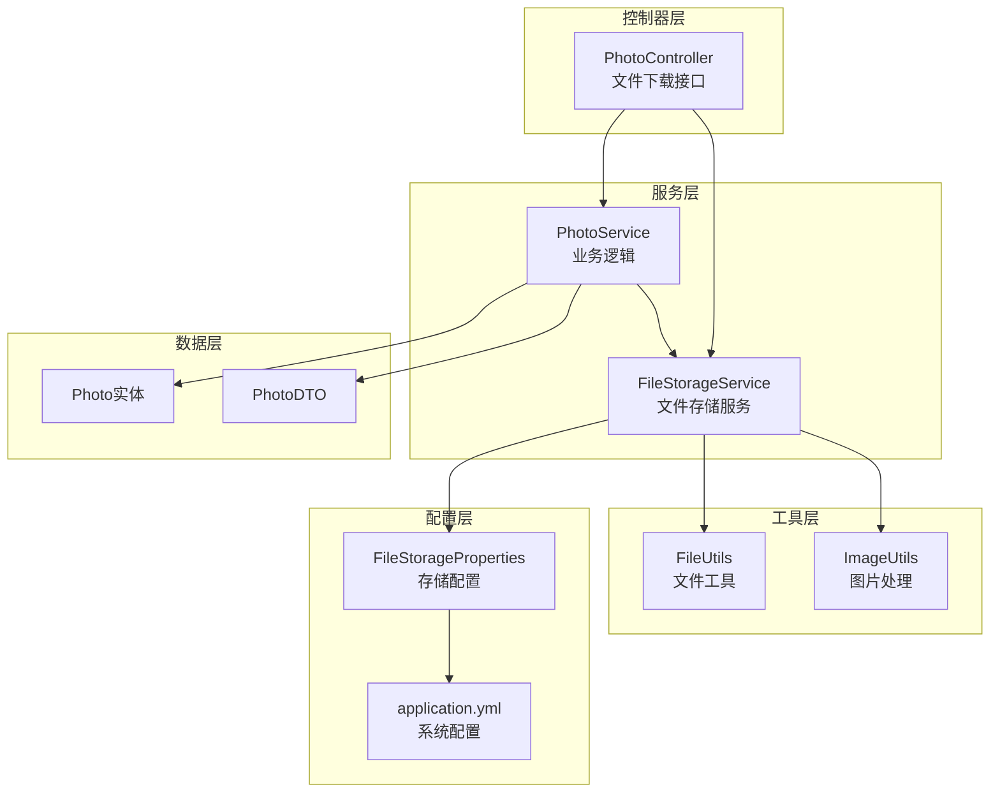
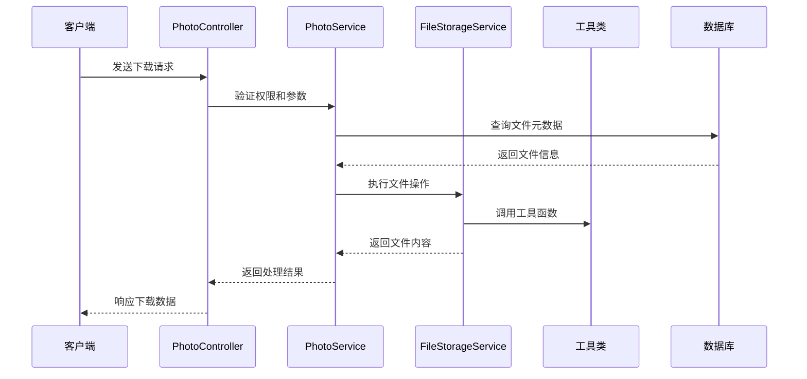
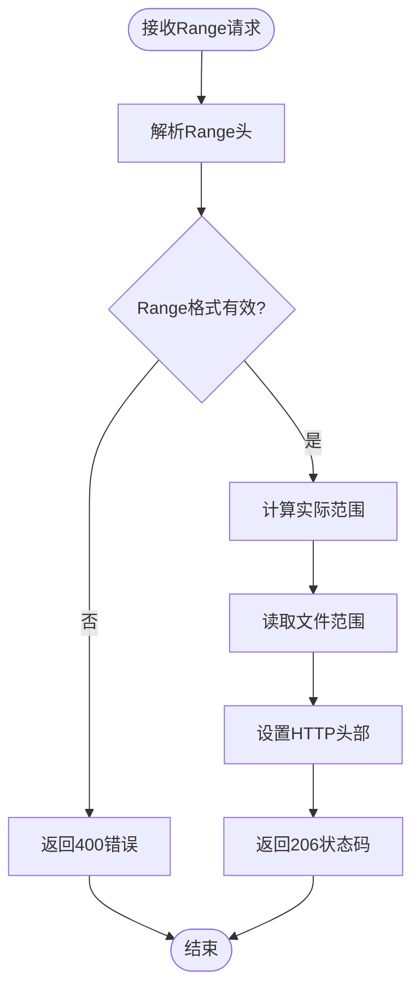
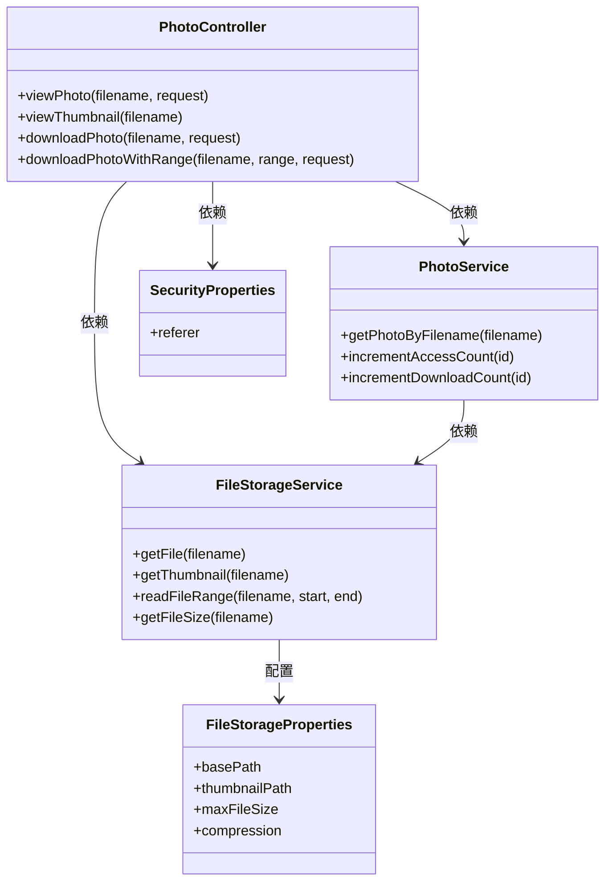

# 文件下载接口

<cite>
**本文档引用的文件**
- [PhotoController.java](file://src/main/java/com/photo/controller/PhotoController.java)
- [FileStorageService.java](file://src/main/java/com/photo/service/FileStorageService.java)
- [PhotoService.java](file://src/main/java/com/photo/service/PhotoService.java)
- [FileUtils.java](file://src/main/java/com/photo/util/FileUtils.java)
- [ImageUtils.java](file://src/main/java/com/photo/util/ImageUtils.java)
- [FileStorageProperties.java](file://src/main/java/com/photo/config/FileStorageProperties.java)
- [application.yml](file://src/main/resources/application.yml)
- [Photo.java](file://src/main/java/com/photo/entity/Photo.java)
- [PhotoDTO.java](file://src/main/java/com/photo/dto/PhotoDTO.java)
- [PhotoControllerTest.java](file://src/test/java/com/photo/controller/PhotoControllerTest.java)
</cite>

## 目录
1. [简介](#简介)
2. [项目结构](#项目结构)
3. [核心组件](#核心组件)
4. [架构概览](#架构概览)
5. [详细组件分析](#详细组件分析)
6. [依赖关系分析](#依赖关系分析)
7. [性能考虑](#性能考虑)
8. [故障排除指南](#故障排除指南)
9. [结论](#结论)

## 简介

本文档详细介绍了照片管理系统中的文件下载接口，包括四个核心下载相关接口：在线预览、缩略图查看、普通下载和断点续传下载。这些接口提供了完整的文件访问解决方案，支持防盗链保护、缓存优化和高性能的文件传输。

## 项目结构

照片管理系统采用标准的Spring Boot三层架构设计，文件下载功能主要集中在控制器层和存储服务层：

**图表来源**
- [PhotoController.java](file://src/main/java/com/photo/controller/PhotoController.java#L30-L316)
- [FileStorageService.java](file://src/main/java/com/photo/service/FileStorageService.java#L22-L300)
- [PhotoService.java](file://src/main/java/com/photo/service/PhotoService.java#L34-L385)

**章节来源**
- [PhotoController.java](file://src/main/java/com/photo/controller/PhotoController.java#L1-L316)
- [application.yml](file://src/main/resources/application.yml#L1-L190)

## 核心组件

### PhotoController - 主要下载控制器

PhotoController是文件下载功能的核心控制器，负责处理所有与文件下载相关的HTTP请求。它实现了四个主要的下载接口，并集成了安全验证和性能优化功能。

### FileStorageService - 文件存储服务

FileStorageService提供底层文件操作功能，包括文件读取、缩略图生成、文件范围读取等核心功能。它是所有下载操作的基础支撑。

### PhotoService - 业务逻辑服务

PhotoService处理照片相关的业务逻辑，包括文件元数据管理、访问统计、存储空间检查等功能，为下载接口提供完整的业务支持。

**章节来源**
- [PhotoController.java](file://src/main/java/com/photo/controller/PhotoController.java#L30-L316)
- [FileStorageService.java](file://src/main/java/com/photo/service/FileStorageService.java#L22-L300)
- [PhotoService.java](file://src/main/java/com/photo/service/PhotoService.java#L34-L385)

## 架构概览

文件下载系统的整体架构采用分层设计，确保了高内聚低耦合的特性：

**图表来源**
- [PhotoController.java](file://src/main/java/com/photo/controller/PhotoController.java#L84-L225)
- [PhotoService.java](file://src/main/java/com/photo/service/PhotoService.java#L155-L160)
- [FileStorageService.java](file://src/main/java/com/photo/service/FileStorageService.java#L99-L141)

## 详细组件分析

### 在线预览接口 - GET /photos/view/{filename}

在线预览接口允许用户直接在浏览器中查看图片文件，无需下载到本地设备。

#### 接口定义

| 属性 | 详情 |
|------|------|
| 方法 | GET |
| 路径 | `/photos/view/{filename}` |
| 功能 | 在线预览照片文件 |
| 权限 | 无需认证（受防盗链保护） |

#### 请求参数

| 参数名 | 类型 | 必需 | 描述 | 示例 |
|--------|------|------|------|------|
| filename | 路径参数 | 是 | 文件存储名称（UUID格式） | abc123def456.jpg |
| Authorization | 请求头 | 否 | 认证令牌（可选） | Bearer token |

#### 响应格式

**成功响应 (200 OK)**：
- Content-Type: 根据文件类型自动设置
- Cache-Control: max-age=3600（1小时缓存）
- Content-Length: 文件大小
- 响应体: 图片二进制数据

**错误响应**：
- 404 Not Found: 文件不存在
- 500 Internal Server Error: 服务器内部错误

#### HTTP头部设置

| 头部名称 | 值 | 描述 |
|----------|-----|------|
| Content-Type | 自动检测 | 基于文件MIME类型 |
| Cache-Control | max-age=3600 | 1小时缓存策略 |
| Content-Disposition | inline | 内联显示，不强制下载 |

#### 使用场景

- 相册浏览页面
- 图片预览功能
- 社交媒体分享
- 实时图片展示

#### 安全特性

- **防盗链保护**: 通过Referer验证防止跨站访问
- **文件存在性检查**: 确保文件真实存在
- **访问统计**: 自动增加访问次数

**章节来源**
- [PhotoController.java](file://src/main/java/com/photo/controller/PhotoController.java#L84-L117)
- [PhotoService.java](file://src/main/java/com/photo/service/PhotoService.java#L155-L160)

### 缩略图查看接口 - GET /photos/thumbnail/{filename}

缩略图接口提供小尺寸图片版本，适用于列表展示和快速预览场景。

#### 接口定义

| 属性 | 详情 |
|------|------|
| 方法 | GET |
| 路径 | `/photos/thumbnail/{filename}` |
| 功能 | 获取照片缩略图 |
| 权限 | 无需认证 |

#### 请求参数

| 参数名 | 类型 | 必需 | 描述 | 示例 |
|--------|------|------|------|------|
| filename | 路径参数 | 是 | 文件存储名称 | abc123def456.jpg |

#### 响应格式

**成功响应 (200 OK)**：
- Content-Type: image/jpeg
- Cache-Control: max-age=7200（2小时缓存）
- Content-Length: 缩略图大小
- 响应体: JPEG格式缩略图二进制数据

**错误响应**：
- 404 Not Found: 缩略图不存在或原始文件不存在
- 500 Internal Server Error: 服务器内部错误

#### HTTP头部设置

| 头部名称 | 值 | 描述 |
|----------|-----|------|
| Content-Type | image/jpeg | 固定JPEG格式 |
| Cache-Control | max-age=7200 | 2小时缓存策略 |

#### 使用场景

- 相册缩略图列表
- 搜索结果预览
- 社交媒体动态预览
- 快速加载场景

#### 性能优化

- **固定尺寸**: 200x200像素，统一规格
- **高质量压缩**: 80%质量保证视觉效果
- **长缓存策略**: 减少重复请求

**章节来源**
- [PhotoController.java](file://src/main/java/com/photo/controller/PhotoController.java#L122-L144)
- [FileStorageService.java](file://src/main/java/com/photo/service/FileStorageService.java#L125-L141)

### 普通下载接口 - GET /photos/download/{filename}

普通下载接口提供标准的文件下载功能，适合需要完整质量文件的场景。

#### 接口定义

| 属性 | 详情 |
|------|------|
| 方法 | GET |
| 路径 | `/photos/download/{filename}` |
| 功能 | 下载原图文件 |
| 权限 | 无需认证 |

#### 请求参数

| 参数名 | 类型 | 必需 | 描述 | 示例 |
|--------|------|------|------|------|
| filename | 路径参数 | 是 | 文件存储名称 | abc123def456.jpg |

#### 响应格式

**成功响应 (200 OK)**：
- Content-Type: application/octet-stream
- Content-Disposition: attachment; filename*=UTF-8''原文件名
- Content-Length: 原始文件大小
- 响应体: 原始图片二进制数据

**错误响应**：
- 404 Not Found: 文件不存在
- 500 Internal Server Error: 服务器内部错误

#### HTTP头部设置

| 头部名称 | 值 | 描述 |
|----------|-----|------|
| Content-Type | application/octet-stream | 二进制流格式 |
| Content-Disposition | attachment | 强制下载模式 |
| filename | 原始文件名 | 使用UTF-8编码的文件名 |

#### 使用场景

- 高质量图片下载
- 设计素材获取
- 图片备份
- 专业用途

#### 功能特性

- **文件名保护**: 使用UTF-8编码避免中文乱码
- **下载统计**: 自动增加下载次数
- **原文件保持**: 不进行任何格式转换

**章节来源**
- [PhotoController.java](file://src/main/java/com/photo/controller/PhotoController.java#L149-L179)
- [PhotoService.java](file://src/main/java/com/photo/service/PhotoService.java#L247-L250)

### 断点续传下载接口 - GET /photos/download/range/{filename}

断点续传接口支持HTTP Range请求，允许大文件的分块下载和续传。

#### 接口定义

| 属性 | 详情 |
|------|------|
| 方法 | GET |
| 路径 | `/photos/download/range/{filename}` |
| 功能 | 支持Range请求的文件下载 |
| 权限 | 无需认证 |

#### 请求参数

| 参数名 | 类型 | 必需 | 描述 | 示例 |
|--------|------|------|------|------|
| filename | 路径参数 | 是 | 文件存储名称 | abc123def456.jpg |
| Range | 请求头 | 否 | HTTP Range请求头 | bytes=0-1048575 |

#### Range请求格式

支持的标准Range格式：
- `bytes=0-1048575`: 第1-1048576字节
- `bytes=1048576-`: 从第1048577字节开始到文件末尾
- `bytes=-1048576`: 文件末尾最后1048576字节

#### 响应格式

**完整文件下载 (200 OK)**：
- Content-Type: 原始文件MIME类型
- Content-Length: 文件总大小
- 响应体: 完整文件数据

**部分文件下载 (206 Partial Content)**：
- Content-Type: 原始文件MIME类型
- Content-Length: 请求范围大小
- Content-Range: bytes start-end/fileSize
- Accept-Ranges: bytes
- 响应体: 指定范围的文件数据

#### HTTP头部设置

| 头部名称 | 值 | 描述 |
|----------|-----|------|
| Content-Type | 原始文件类型 | 保持文件原有MIME类型 |
| Content-Length | 范围大小 | 当前响应的数据长度 |
| Content-Range | bytes start-end/fileSize | 返回的字节范围 |
| Accept-Ranges | bytes | 支持范围请求 |

#### 使用场景

- 大文件下载（>10MB）
- 网络不稳定环境
- 移动设备下载
- 断点续传应用

#### 技术实现

**图表来源**
- [PhotoController.java](file://src/main/java/com/photo/controller/PhotoController.java#L184-L225)
- [FileStorageService.java](file://src/main/java/com/photo/service/FileStorageService.java#L229-L257)

**章节来源**
- [PhotoController.java](file://src/main/java/com/photo/controller/PhotoController.java#L184-L225)
- [FileStorageService.java](file://src/main/java/com/photo/service/FileStorageService.java#L229-L257)

## 依赖关系分析

文件下载接口的依赖关系体现了清晰的分层架构：

**图表来源**
- [PhotoController.java](file://src/main/java/com/photo/controller/PhotoController.java#L30-L316)
- [PhotoService.java](file://src/main/java/com/photo/service/PhotoService.java#L34-L385)
- [FileStorageService.java](file://src/main/java/com/photo/service/FileStorageService.java#L22-L300)
- [FileStorageProperties.java](file://src/main/java/com/photo/config/FileStorageProperties.java#L12-L94)

### 关键依赖特性

1. **松耦合设计**: 控制器仅依赖服务接口，便于测试和维护
2. **配置驱动**: 通过配置文件控制存储路径和行为
3. **异常隔离**: 各层独立处理异常，避免传播到上层
4. **缓存集成**: 利用Spring缓存机制提升性能

**章节来源**
- [PhotoController.java](file://src/main/java/com/photo/controller/PhotoController.java#L30-L316)
- [PhotoService.java](file://src/main/java/com/photo/service/PhotoService.java#L34-L385)
- [FileStorageService.java](file://src/main/java/com/photo/service/FileStorageService.java#L22-L300)

## 性能考虑

### 缓存策略

系统实现了多层级的缓存优化：

| 缓存级别 | 缓存对象 | 过期时间 | 目的 |
|----------|----------|----------|------|
| 应用级缓存 | 照片元数据 | 1小时 | 减少数据库查询 |
| 浏览器缓存 | 在线预览 | 1小时 | 减少服务器负载 |
| 浏览器缓存 | 缩略图 | 2小时 | 提升列表加载速度 |
| 文件系统缓存 | 磁盘I/O | 操作系统管理 | 优化文件读取 |

### 存储优化

- **异步缩略图生成**: 避免阻塞主请求流程
- **文件压缩**: 默认启用质量压缩减少存储空间
- **尺寸限制**: 1920x1080最大分辨率防止超大文件
- **MD5去重**: 相同内容的文件只存储一份

### 并发处理

- **连接池配置**: Tomcat最大连接数10000
- **线程池配置**: 最大200个工作线程
- **文件锁机制**: 防止并发读写冲突
- **内存管理**: 使用随机访问文件避免大文件内存占用

## 故障排除指南

### 常见问题及解决方案

#### 1. 文件不存在错误

**症状**: 返回404 Not Found
**原因**: 
- 文件名错误或已被删除
- 文件路径配置不正确
- 缩略图生成失败

**解决方案**:
- 验证文件名格式（UUID）
- 检查文件存储路径
- 重新生成缩略图

#### 2. 访问权限问题

**症状**: 返回403 Forbidden
**原因**:
- 防盗链规则阻止
- 文件被标记为私有
- 用户权限不足

**解决方案**:
- 配置允许的Referer域名
- 检查文件公开状态
- 验证用户身份

#### 3. 文件过大问题

**症状**: 下载缓慢或超时
**原因**:
- 单文件超过10MB限制
- 网络带宽不足
- 服务器资源限制

**解决方案**:
- 使用断点续传接口
- 优化网络连接
- 调整服务器配置

#### 4. 缓存问题

**症状**: 显示旧版本文件
**原因**:
- 浏览器缓存未更新
- 应用级缓存过期
- CDN缓存

**解决方案**:
- 清除浏览器缓存
- 等待缓存自然过期
- 强制刷新缓存

### 调试建议

1. **启用详细日志**: 设置日志级别为DEBUG
2. **监控指标**: 使用Actuator监控系统状态
3. **性能分析**: 分析慢查询和高延迟请求
4. **错误追踪**: 使用异常处理器捕获和记录错误

**章节来源**
- [PhotoController.java](file://src/main/java/com/photo/controller/PhotoController.java#L93-L97)
- [application.yml](file://src/main/resources/application.yml#L146-L160)

## 结论

文件下载接口系统提供了完整、高效、安全的文件访问解决方案。通过精心设计的分层架构、完善的缓存策略和robust的错误处理机制，系统能够满足各种文件下载场景的需求。

### 主要优势

1. **功能完整**: 支持在线预览、缩略图、普通下载和断点续传
2. **性能优秀**: 多级缓存和优化的文件处理机制
3. **安全可靠**: 防盗链保护和严格的文件验证
4. **易于扩展**: 模块化设计便于功能扩展和维护

### 最佳实践建议

1. **合理选择接口**: 根据使用场景选择合适的下载方式
2. **配置优化**: 根据实际需求调整缓存和存储配置
3. **监控维护**: 建立完善的监控和维护机制
4. **安全加固**: 定期审查和更新安全配置

这个系统为照片管理应用提供了坚实的文件下载基础，能够支持从个人相册到企业级应用的各种使用场景。