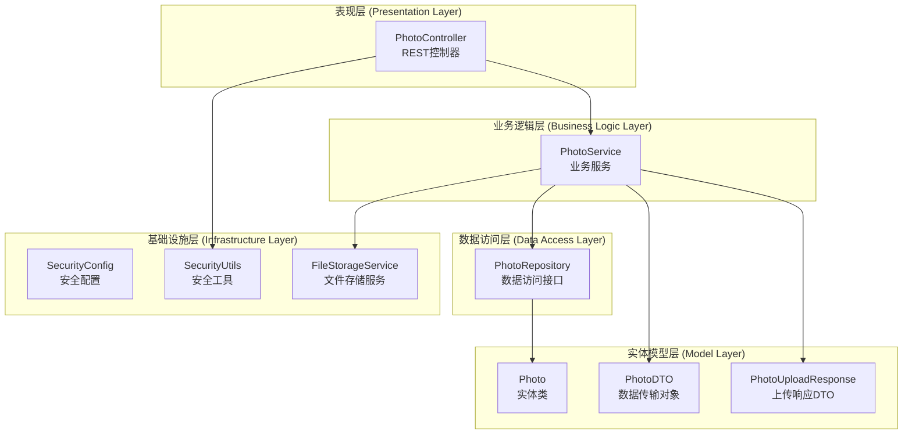
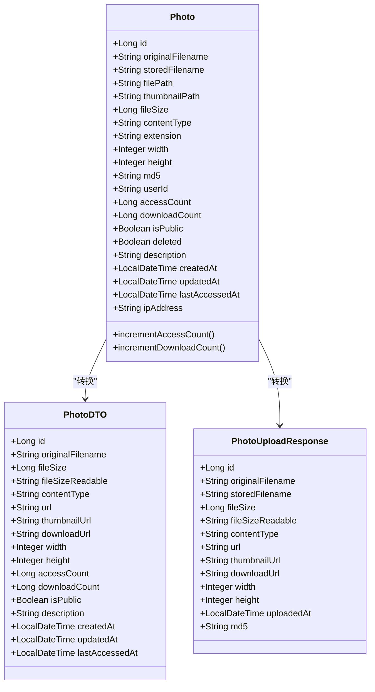
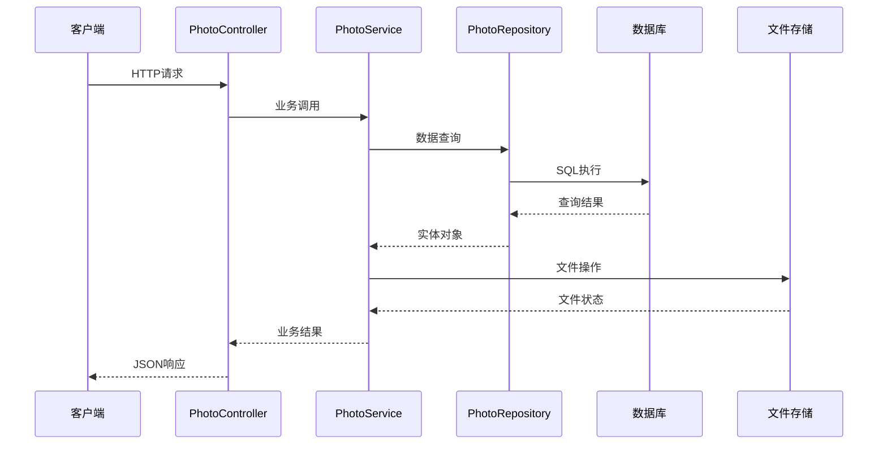
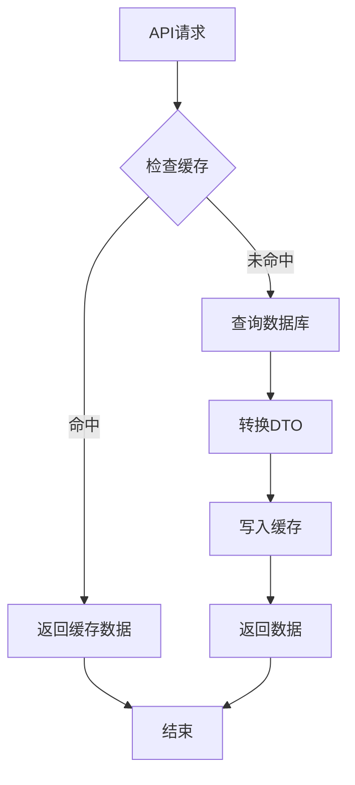
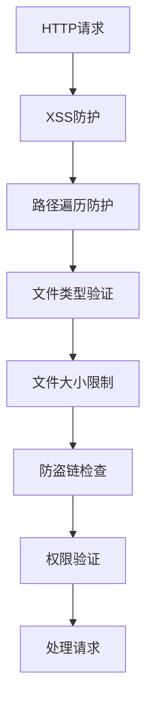

# 照片管理接口

<cite>
**本文档引用的文件**
- [PhotoController.java](file://src/main/java/com/photo/controller/PhotoController.java)
- [PhotoService.java](file://src/main/java/com/photo/service/PhotoService.java)
- [Photo.java](file://src/main/java/com/photo/entity/Photo.java)
- [PhotoRepository.java](file://src/main/java/com/photo/repository/PhotoRepository.java)
- [PhotoDTO.java](file://src/main/java/com/photo/dto/PhotoDTO.java)
- [PhotoUploadResponse.java](file://src/main/java/com/photo/dto/PhotoUploadResponse.java)
- [application.yml](file://src/main/resources/application.yml)
- [SecurityConfig.java](file://src/main/java/com/photo/config/SecurityConfig.java)
- [SecurityUtils.java](file://src/main/java/com/photo/util/SecurityUtils.java)
- [PhotoControllerTest.java](file://src/test/java/com/photo/controller/PhotoControllerTest.java)
- [API_DOCUMENTATION.md](file://API_DOCUMENTATION.md)
- [README.md](file://README.md)
</cite>

## 目录
1. [简介](#简介)
2. [项目结构](#项目结构)
3. [核心组件](#核心组件)
4. [架构概览](#架构概览)
5. [详细接口分析](#详细接口分析)
6. [依赖关系分析](#依赖关系分析)
7. [性能考虑](#性能考虑)
8. [故障排除指南](#故障排除指南)
9. [结论](#结论)

## 简介

照片管理接口是基于Spring Boot开发的企业级照片上传下载系统的核心模块，提供完整的照片生命周期管理功能。该系统支持照片的上传、下载、在线预览、断点续传、列表查询、搜索和删除操作，具备完善的权限控制、安全防护和性能优化机制。

## 项目结构

该项目采用标准的Spring Boot分层架构设计，主要包含以下层次：



**图表来源**
- [PhotoController.java](file://src/main/java/com/photo/controller/PhotoController.java#L30-L316)
- [PhotoService.java](file://src/main/java/com/photo/service/PhotoService.java#L34-L385)
- [PhotoRepository.java](file://src/main/java/com/photo/repository/PhotoRepository.java#L19-L112)

**章节来源**
- [PhotoController.java](file://src/main/java/com/photo/controller/PhotoController.java#L1-L316)
- [PhotoService.java](file://src/main/java/com/photo/service/PhotoService.java#L1-L385)
- [PhotoRepository.java](file://src/main/java/com/photo/repository/PhotoRepository.java#L1-L112)

## 核心组件

### 照片实体模型

照片实体类定义了完整的照片元数据结构，包括文件基本信息、访问统计、权限控制等属性：



**图表来源**
- [Photo.java](file://src/main/java/com/photo/entity/Photo.java#L27-L174)
- [PhotoDTO.java](file://src/main/java/com/photo/dto/PhotoDTO.java#L17-L104)
- [PhotoUploadResponse.java](file://src/main/java/com/photo/dto/PhotoUploadResponse.java#L17-L84)

### 接口控制器

PhotoController提供了完整的照片管理REST API接口，采用Swagger注解进行API文档化：

**章节来源**
- [PhotoController.java](file://src/main/java/com/photo/controller/PhotoController.java#L27-L316)

## 架构概览

系统采用经典的三层架构模式，结合Spring Boot的自动配置特性：



**图表来源**
- [PhotoController.java](file://src/main/java/com/photo/controller/PhotoController.java#L48-L316)
- [PhotoService.java](file://src/main/java/com/photo/service/PhotoService.java#L50-L385)
- [PhotoRepository.java](file://src/main/java/com/photo/repository/PhotoRepository.java#L20-L112)

## 详细接口分析

### GET /photos/{id} - 获取单个照片信息

**接口功能**: 根据照片ID获取详细信息，支持缓存机制

**请求参数**:
- `id` (路径参数): 照片ID，必须为正整数

**响应数据**:
- `id`: 照片ID
- `originalFilename`: 原始文件名
- `fileSize`: 文件大小（字节）
- `fileSizeReadable`: 文件大小（可读格式）
- `contentType`: MIME类型
- `url`: 在线预览URL
- `thumbnailUrl`: 缩略图URL
- `downloadUrl`: 下载URL
- `width`: 图片宽度
- `height`: 图片高度
- `accessCount`: 访问次数
- `downloadCount`: 下载次数
- `isPublic`: 是否公开
- `description`: 描述信息
- `createdAt`: 创建时间
- `updatedAt`: 更新时间
- `lastAccessedAt`: 最后访问时间

**使用示例**:
```bash
curl -X GET "http://localhost:8080/api/photos/1"
```

**章节来源**
- [PhotoController.java](file://src/main/java/com/photo/controller/PhotoController.java#L230-L237)
- [PhotoService.java](file://src/main/java/com/photo/service/PhotoService.java#L141-L151)

### GET /photos/user/{userId} - 获取用户照片列表

**接口功能**: 分页查询指定用户的照片列表

**请求参数**:
- `userId` (路径参数): 用户ID，必须为字符串
- `page` (查询参数): 页码，从0开始，默认0
- `size` (查询参数): 每页数量，默认20，最大100

**排序规则**: 按创建时间降序排列

**响应数据**: 分页结果，包含内容数组和分页信息

**使用示例**:
```bash
curl -X GET "http://localhost:8080/api/photos/user/user123?page=0&size=20"
```

**章节来源**
- [PhotoController.java](file://src/main/java/com/photo/controller/PhotoController.java#L242-L251)
- [PhotoService.java](file://src/main/java/com/photo/service/PhotoService.java#L165-L169)

### GET /photos/public - 获取公开照片列表

**接口功能**: 分页查询所有公开的照片

**请求参数**:
- `page` (查询参数): 页码，从0开始，默认0
- `size` (查询参数): 每页数量，默认20，最大100

**排序规则**: 按创建时间降序排列

**使用示例**:
```bash
curl -X GET "http://localhost:8080/api/photos/public?page=0&size=20"
```

**章节来源**
- [PhotoController.java](file://src/main/java/com/photo/controller/PhotoController.java#L256-L264)
- [PhotoService.java](file://src/main/java/com/photo/service/PhotoService.java#L174-L178)

### GET /photos/search - 搜索照片

**接口功能**: 根据文件名关键词搜索照片

**请求参数**:
- `keyword` (查询参数): 搜索关键词，必须为字符串
- `page` (查询参数): 页码，从0开始，默认0
- `size` (查询参数): 每页数量，默认20，最大100

**搜索规则**: 支持模糊匹配，按创建时间降序排列

**使用示例**:
```bash
curl -X GET "http://localhost:8080/api/photos/search?keyword=vacation&page=0&size=20"
```

**章节来源**
- [PhotoController.java](file://src/main/java/com/photo/controller/PhotoController.java#L269-L278)
- [PhotoService.java](file://src/main/java/com/photo/service/PhotoService.java#L183-L187)

### DELETE /photos/{id} - 软删除照片

**接口功能**: 软删除指定照片，不会立即删除文件

**请求参数**:
- `id` (路径参数): 照片ID，必须为正整数
- `userId` (查询参数): 用户ID，必须为字符串

**权限控制**: 
- 仅照片所有者可以删除
- 删除操作会更新数据库标记但保留文件

**使用示例**:
```bash
curl -X DELETE "http://localhost:8080/api/photos/1?userId=user123"
```

**章节来源**
- [PhotoController.java](file://src/main/java/com/photo/controller/PhotoController.java#L283-L291)
- [PhotoService.java](file://src/main/java/com/photo/service/PhotoService.java#L192-L205)

### DELETE /photos/{id}/permanent - 永久删除照片

**接口功能**: 物理删除指定照片及其文件

**请求参数**:
- `id` (路径参数): 照片ID，必须为正整数
- `userId` (查询参数): 用户ID，必须为字符串

**权限控制**: 
- 仅照片所有者可以永久删除
- 删除操作会同时删除文件和数据库记录

**使用示例**:
```bash
curl -X DELETE "http://localhost:8080/api/photos/1/permanent?userId=user123"
```

**章节来源**
- [PhotoController.java](file://src/main/java/com/photo/controller/PhotoController.java#L296-L304)
- [PhotoService.java](file://src/main/java/com/photo/service/PhotoService.java#L210-L234)

### GET /photos/storage/info - 获取存储空间信息

**接口功能**: 查询存储空间使用情况

**响应数据**:
- `usedSpace`: 已使用空间（字节）
- `usedSpaceReadable`: 已使用空间（可读格式）
- `totalSpace`: 总空间（字节）
- `totalSpaceReadable`: 总空间（可读格式）
- `freeSpace`: 剩余空间（字节）
- `freeSpaceReadable`: 剩余空间（可读格式）
- `usagePercentage`: 使用率百分比
- `totalFiles`: 文件总数

**使用示例**:
```bash
curl -X GET "http://localhost:8080/api/photos/storage/info"
```

**章节来源**
- [PhotoController.java](file://src/main/java/com/photo/controller/PhotoController.java#L309-L314)
- [PhotoService.java](file://src/main/java/com/photo/service/PhotoService.java#L255-L271)

## 依赖关系分析

### 数据库设计

系统使用MySQL数据库存储照片元数据，包含以下关键表结构：

```mermaid
erDiagram
PHOTOS {
bigint id PK
varchar originalFilename
varchar storedFilename UK
varchar filePath
varchar thumbnailPath
bigint fileSize
varchar contentType
varchar extension
int width
int height
varchar md5 UK
varchar userId
bigint accessCount
bigint downloadCount
boolean isPublic
boolean deleted
varchar description
datetime createdAt
datetime updatedAt
datetime lastAccessedAt
varchar ipAddress
}
INDEXES {
idx_original_filename
idx_created_at
idx_user_id
}
PHOTOS ||--o{ INDEXES : has
```

**图表来源**
- [Photo.java](file://src/main/java/com/photo/entity/Photo.java#L18-L27)
- [PhotoRepository.java](file://src/main/java/com/photo/repository/PhotoRepository.java#L20-L112)

### 缓存策略

系统采用Caffeine缓存机制优化性能：



**图表来源**
- [PhotoService.java](file://src/main/java/com/photo/service/PhotoService.java#L141-L151)
- [application.yml](file://src/main/resources/application.yml#L50-L55)

**章节来源**
- [PhotoRepository.java](file://src/main/java/com/photo/repository/PhotoRepository.java#L1-L112)
- [PhotoService.java](file://src/main/java/com/photo/service/PhotoService.java#L1-L385)

## 性能考虑

### 缓存机制
- **缓存类型**: Caffeine本地缓存
- **缓存策略**: 写入后失效，读取时缓存
- **缓存大小**: 最大1000条记录，过期时间3600秒
- **缓存键**: 照片ID和文件名

### 文件处理优化
- **图片压缩**: 自动压缩大尺寸图片至1920x1080
- **缩略图生成**: 自动生成200x200像素缩略图
- **断点续传**: 支持Range请求的大文件下载
- **并发处理**: 支持多文件批量上传

### 存储管理
- **存储限制**: 默认10GB存储空间
- **定期清理**: 每天凌晨2点清理30天前的文件
- **空间监控**: 实时统计存储使用情况

**章节来源**
- [application.yml](file://src/main/resources/application.yml#L70-L118)
- [PhotoService.java](file://src/main/java/com/photo/service/PhotoService.java#L276-L299)

## 故障排除指南

### 常见错误及解决方案

| 错误码 | 错误类型 | 可能原因 | 解决方案 |
|--------|----------|----------|----------|
| 400 | 文件类型错误 | 不支持的文件格式 | 确认文件为JPG/PNG/GIF等图片格式 |
| 400 | 文件大小超限 | 文件超过10MB限制 | 压缩图片或分割文件 |
| 403 | 权限不足 | 非文件所有者尝试删除 | 确保userId参数正确 |
| 404 | 资源不存在 | 照片ID无效或已被删除 | 检查照片是否存在 |
| 507 | 存储空间不足 | 超出10GB存储限制 | 清理旧文件或升级存储 |

### 安全防护措施

系统实现了多层次的安全防护：



**图表来源**
- [SecurityUtils.java](file://src/main/java/com/photo/util/SecurityUtils.java#L18-L167)
- [PhotoController.java](file://src/main/java/com/photo/controller/PhotoController.java#L93-L97)

**章节来源**
- [SecurityUtils.java](file://src/main/java/com/photo/util/SecurityUtils.java#L1-L167)
- [SecurityConfig.java](file://src/main/java/com/photo/config/SecurityConfig.java#L37-L58)

## 结论

照片管理接口提供了完整的企业级照片管理解决方案，具有以下特点：

### 核心优势
- **完整的API覆盖**: 支持照片的全生命周期管理
- **高性能设计**: 缓存机制和优化的文件处理
- **安全可靠**: 多层安全防护和权限控制
- **易于扩展**: 清晰的架构设计便于功能扩展

### 技术特色
- 基于Spring Boot的现代化开发框架
- 完善的异常处理和错误码体系
- 详细的API文档和测试用例
- 生产就绪的配置和部署方案

### 适用场景
- 个人照片管理应用
- 企业内部相册系统
- 社交媒体平台的图片服务
- 在线教育平台的课件管理

该系统为企业提供了稳定可靠的照片管理基础设施，可根据具体需求进行定制和扩展。