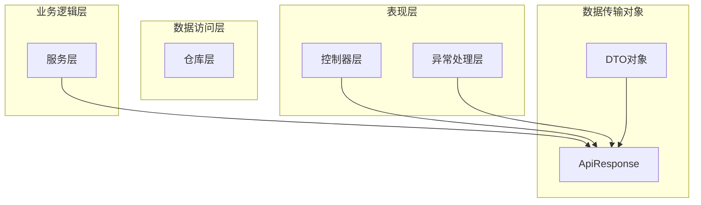
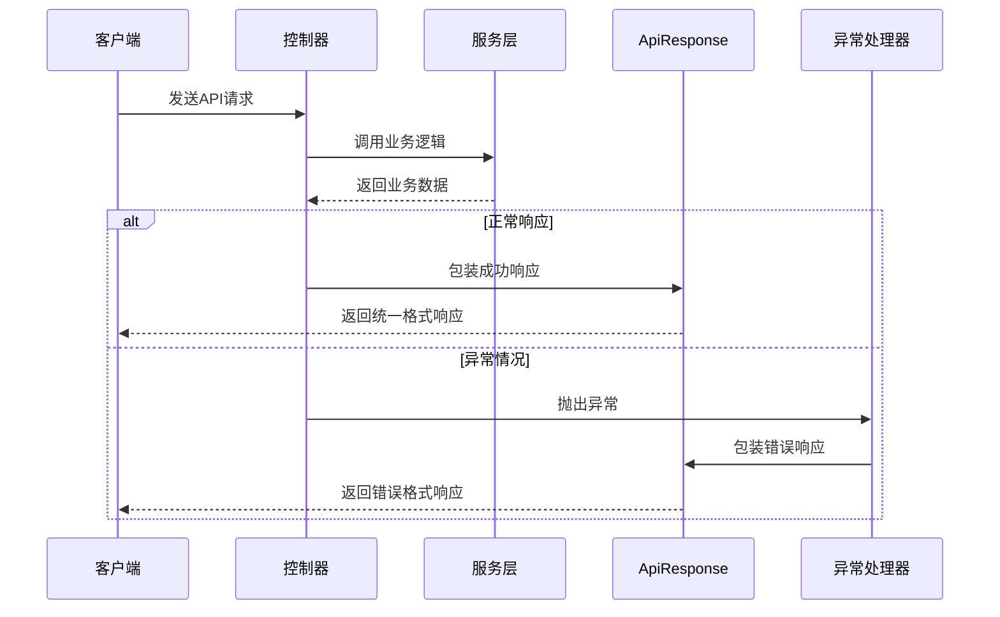
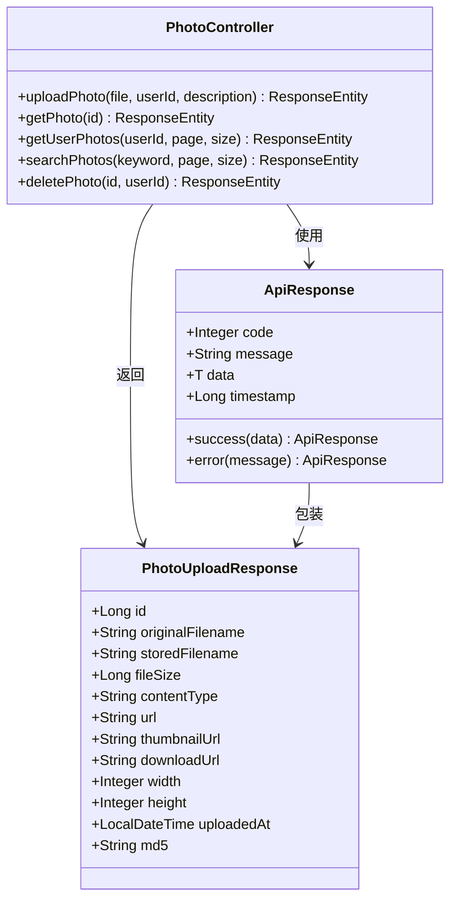
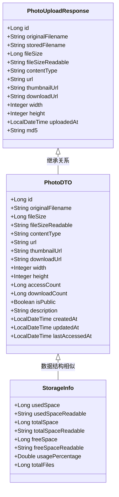
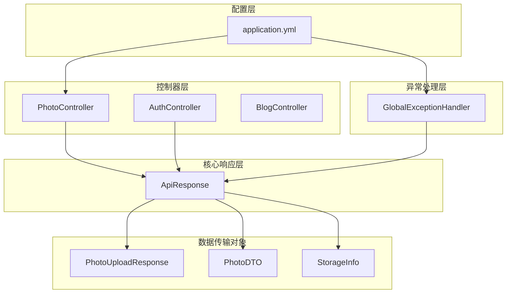

# 统一响应格式

<cite>
**本文档引用的文件**
- [ApiResponse.java](file://src/main/java/com/photo/dto/ApiResponse.java)
- [PhotoController.java](file://src/main/java/com/photo/controller/PhotoController.java)
- [AuthController.java](file://src/main/java/com/photo/controller/AuthController.java)
- [GlobalExceptionHandler.java](file://src/main/java/com/photo/exception/GlobalExceptionHandler.java)
- [PhotoUploadResponse.java](file://src/main/java/com/photo/dto/PhotoUploadResponse.java)
- [StorageInfo.java](file://src/main/java/com/photo/dto/StorageInfo.java)
- [PhotoDTO.java](file://src/main/java/com/photo/dto/PhotoDTO.java)
- [application.yml](file://src/main/resources/application.yml)
- [PhotoControllerTest.java](file://src/test/java/com/photo/controller/PhotoControllerTest.java)
- [README.md](file://README.md)
</cite>

## 目录
1. [简介](#简介)
2. [项目结构](#项目结构)
3. [核心组件](#核心组件)
4. [架构概览](#架构概览)
5. [详细组件分析](#详细组件分析)
6. [依赖关系分析](#依赖关系分析)
7. [性能考虑](#性能考虑)
8. [故障排除指南](#故障排除指南)
9. [结论](#结论)
10. [附录](#附录)

## 简介

本项目采用统一的API响应格式设计，通过ApiResponse DTO为所有REST API接口提供标准化的响应结构。该设计确保了前后端交互的一致性，简化了客户端的响应处理逻辑，并提供了清晰的状态码语义。

统一响应格式的核心优势包括：
- **一致性**: 所有API返回相同的数据结构
- **可预测性**: 标准化的状态码和消息格式
- **可扩展性**: 支持泛型数据类型的灵活响应
- **易用性**: 简化的客户端解析逻辑

## 项目结构

项目采用标准的Spring Boot三层架构模式，统一响应格式贯穿整个应用层：



**图表来源**
- [PhotoController.java](file://src/main/java/com/photo/controller/PhotoController.java#L1-L316)
- [AuthController.java](file://src/main/java/com/photo/controller/AuthController.java#L1-L111)
- [GlobalExceptionHandler.java](file://src/main/java/com/photo/exception/GlobalExceptionHandler.java#L1-L140)

**章节来源**
- [PhotoController.java](file://src/main/java/com/photo/controller/PhotoController.java#L1-L316)
- [AuthController.java](file://src/main/java/com/photo/controller/AuthController.java#L1-L111)
- [GlobalExceptionHandler.java](file://src/main/java/com/photo/exception/GlobalExceptionHandler.java#L1-L140)

## 核心组件

### ApiResponse DTO 设计

ApiResponse是整个统一响应格式的核心组件，采用泛型设计支持任意数据类型的响应包装。

#### 字段定义

| 字段名 | 类型 | 必填 | 描述 | 默认值 |
|--------|------|------|------|--------|
| code | Integer | 是 | 响应状态码 | - |
| message | String | 是 | 响应消息文本 | - |
| data | T | 否 | 响应数据内容 | null |
| timestamp | Long | 是 | 时间戳（毫秒） | 当前时间 |

#### 构造方法

ApiResponse提供了四种构造方法以满足不同场景的需求：

1. **成功响应（默认消息）**: `ApiResponse.success(data)`
2. **成功响应（自定义消息）**: `ApiResponse.success(message, data)`
3. **错误响应（默认错误码）**: `ApiResponse.error(message)`
4. **错误响应（自定义错误码）**: `ApiResponse.error(code, message)`

**章节来源**
- [ApiResponse.java](file://src/main/java/com/photo/dto/ApiResponse.java#L1-L63)

## 架构概览

统一响应格式在整个应用中的工作流程如下：



**图表来源**
- [PhotoController.java](file://src/main/java/com/photo/controller/PhotoController.java#L48-L80)
- [GlobalExceptionHandler.java](file://src/main/java/com/photo/exception/GlobalExceptionHandler.java#L26-L98)

## 详细组件分析

### API控制器中的响应使用

#### 照片管理控制器响应

PhotoController展示了ApiResponse在REST API中的典型使用方式：



**图表来源**
- [PhotoController.java](file://src/main/java/com/photo/controller/PhotoController.java#L48-L314)
- [ApiResponse.java](file://src/main/java/com/photo/dto/ApiResponse.java#L13-L61)
- [PhotoUploadResponse.java](file://src/main/java/com/photo/dto/PhotoUploadResponse.java#L17-L83)

#### 认证控制器响应

AuthController展示了用户认证场景下的响应格式：

| 方法 | 请求类型 | 响应数据类型 | 状态码示例 |
|------|----------|-------------|------------|
| login | POST /auth/login | Map<String, String> | 200/401 |
| logout | POST /auth/logout | String | 200 |
| register | POST /auth/register | String | 200/400/500 |

**章节来源**
- [AuthController.java](file://src/main/java/com/photo/controller/AuthController.java#L47-L109)

### 异常处理中的统一响应

全局异常处理器确保所有异常都转换为统一的响应格式：

```mermaid
flowchart TD
Start([异常发生]) --> CheckType{检查异常类型}
CheckType --> |文件类型错误| FileType[FileTypeException]
CheckType --> |文件大小错误| FileSize[FileSizeException]
CheckType --> |文件存储错误| FileStorage[FileStorageException]
CheckType --> |文件未找到| FileNotFound[FileNotFoundException]
CheckType --> |存储空间不足| StorageFull[StorageFullException]
CheckType --> |访问拒绝| AccessDenied[AccessDeniedException]
CheckType --> |参数校验失败| Validation[MethodArgumentNotValidException]
CheckType --> |其他异常| Other[Exception]
FileType --> Wrap1[ApiResponse.error(400)]
FileSize --> Wrap2[ApiResponse.error(400)]
FileStorage --> Wrap3[ApiResponse.error(500)]
FileNotFound --> Wrap4[ApiResponse.error(404)]
StorageFull --> Wrap5[ApiResponse.error(507)]
AccessDenied --> Wrap6[ApiResponse.error(403)]
Validation --> Wrap7[ApiResponse.error(400)]
Other --> Wrap8[ApiResponse.error(500)]
Wrap1 --> End([返回统一响应])
Wrap2 --> End
Wrap3 --> End
Wrap4 --> End
Wrap5 --> End
Wrap6 --> End
Wrap7 --> End
Wrap8 --> End
```

**图表来源**
- [GlobalExceptionHandler.java](file://src/main/java/com/photo/exception/GlobalExceptionHandler.java#L26-L138)

**章节来源**
- [GlobalExceptionHandler.java](file://src/main/java/com/photo/exception/GlobalExceptionHandler.java#L1-L140)

### 数据传输对象设计

#### 响应数据模型

项目中使用了多种DTO来承载具体的响应数据：



**图表来源**
- [PhotoUploadResponse.java](file://src/main/java/com/photo/dto/PhotoUploadResponse.java#L17-L83)
- [PhotoDTO.java](file://src/main/java/com/photo/dto/PhotoDTO.java#L17-L103)
- [StorageInfo.java](file://src/main/java/com/photo/dto/StorageInfo.java#L15-L56)

**章节来源**
- [PhotoUploadResponse.java](file://src/main/java/com/photo/dto/PhotoUploadResponse.java#L1-L84)
- [PhotoDTO.java](file://src/main/java/com/photo/dto/PhotoDTO.java#L1-L104)
- [StorageInfo.java](file://src/main/java/com/photo/dto/StorageInfo.java#L1-L57)

## 依赖关系分析

统一响应格式在整个系统中的依赖关系如下：



**图表来源**
- [PhotoController.java](file://src/main/java/com/photo/controller/PhotoController.java#L1-L316)
- [AuthController.java](file://src/main/java/com/photo/controller/AuthController.java#L1-L111)
- [GlobalExceptionHandler.java](file://src/main/java/com/photo/exception/GlobalExceptionHandler.java#L1-L140)
- [application.yml](file://src/main/resources/application.yml#L1-L190)

**章节来源**
- [PhotoController.java](file://src/main/java/com/photo/controller/PhotoController.java#L1-L316)
- [AuthController.java](file://src/main/java/com/photo/controller/AuthController.java#L1-L111)
- [GlobalExceptionHandler.java](file://src/main/java/com/photo/exception/GlobalExceptionHandler.java#L1-L140)
- [application.yml](file://src/main/resources/application.yml#L1-L190)

## 性能考虑

### 时间戳处理

统一响应格式中的timestamp字段采用毫秒级时间戳，确保了精确的时间记录和跨时区兼容性。

### 泛型设计优势

ApiResponse的泛型设计减少了类型转换开销，提高了序列化效率。

### 内存优化

- 避免不必要的对象创建
- 合理使用null值减少内存占用
- 支持流式响应处理

## 故障排除指南

### 常见问题诊断

#### 响应格式不一致

**症状**: 部分API返回的数据结构不一致
**解决方案**: 
1. 检查是否正确使用ApiResponse包装
2. 确认所有控制器方法都返回ResponseEntity<ApiResponse<T>>
3. 验证异常处理器的配置

#### 状态码映射错误

**症状**: HTTP状态码与业务状态码不匹配
**解决方案**:
1. 检查异常处理器中的HttpStatus映射
2. 确认业务逻辑中的状态码设置
3. 验证客户端对不同状态码的处理

#### 时间戳异常

**症状**: 响应中的时间戳格式不正确
**解决方案**:
1. 确认System.currentTimeMillis()的使用
2. 检查时区配置
3. 验证JSON序列化配置

**章节来源**
- [GlobalExceptionHandler.java](file://src/main/java/com/photo/exception/GlobalExceptionHandler.java#L26-L138)

## 结论

统一响应格式设计为整个照片管理系统提供了标准化的API交互体验。通过ApiResponse DTO的泛型设计和严格的字段规范，确保了系统的可维护性和扩展性。

该设计的主要优势包括：
- **一致性**: 所有API响应格式完全统一
- **可预测性**: 标准化的状态码和消息格式
- **可扩展性**: 支持任意数据类型的灵活响应
- **易用性**: 简化的客户端解析逻辑
- **可靠性**: 全局异常处理确保错误响应的一致性

## 附录

### API响应格式规范

#### 成功响应格式

```json
{
  "code": 200,
  "message": "操作成功",
  "data": {},
  "timestamp": 1640995200000
}
```

#### 错误响应格式

```json
{
  "code": 404,
  "message": "文件未找到",
  "data": null,
  "timestamp": 1640995200000
}
```

### 状态码对照表

| 状态码 | 含义 | 使用场景 | HTTP状态码 |
|--------|------|----------|------------|
| 200 | 操作成功 | 所有成功的业务操作 | 200 OK |
| 400 | 参数错误/业务逻辑错误 | 参数校验失败、业务规则违反 | 400 Bad Request |
| 401 | 未授权 | 用户认证失败 | 401 Unauthorized |
| 403 | 禁止访问 | 权限不足、访问被拒绝 | 403 Forbidden |
| 404 | 资源不存在 | 文件未找到、用户不存在 | 404 Not Found |
| 500 | 系统内部错误 | 未捕获的异常、系统故障 | 500 Internal Server Error |
| 507 | 存储空间不足 | 磁盘空间不足、配额超限 | 507 Insufficient Storage |

### 客户端解析最佳实践

#### JavaScript客户端示例

```javascript
// 基础响应解析
function parseApiResponse(response) {
    if (response.code === 200) {
        return {
            success: true,
            data: response.data,
            message: response.message
        };
    } else {
        return {
            success: false,
            error: response.message,
            code: response.code
        };
    }
}

// 错误处理
function handleErrorResponse(errorResponse) {
    switch (errorResponse.code) {
        case 401:
            // 重新登录
            redirectToLogin();
            break;
        case 403:
            // 权限不足提示
            showMessage('权限不足');
            break;
        case 404:
            // 资源不存在
            showMessage('资源不存在');
            break;
        default:
            // 其他错误
            showMessage(errorResponse.message || '操作失败');
    }
}
```

#### Java客户端示例

```java
// 响应封装类
public class ApiResult<T> {
    private Integer code;
    private String message;
    private T data;
    private Long timestamp;
    
    // getter和setter方法
}

// 响应解析
public <T> ApiResult<T> parseResponse(ResponseEntity<ApiResponse<T>> response) {
    ApiResponse<T> apiResponse = response.getBody();
    if (apiResponse == null) {
        throw new RuntimeException("响应为空");
    }
    
    ApiResult<T> result = new ApiResult<>();
    result.setCode(apiResponse.getCode());
    result.setMessage(apiResponse.getMessage());
    result.setData(apiResponse.getData());
    result.setTimestamp(apiResponse.getTimestamp());
    
    return result;
}
```

### 扩展建议

#### 自定义字段扩展

如果需要扩展响应格式，建议添加到ApiResponse类中：

```java
public class ApiResponse<T> {
    // 现有字段...
    
    // 新增字段
    private String requestId;        // 请求ID
    private String traceId;          // 跟踪ID
    private Map<String, Object> meta; // 元数据
}
```

#### 版本控制

建议在响应格式中加入版本信息：

```java
public class ApiResponse<T> {
    private Integer code;
    private String message;
    private T data;
    private Long timestamp;
    private String version; // 响应版本
}
```

#### 国际化支持

为message字段提供国际化支持：

```java
public class ApiResponse<T> {
    private Integer code;
    private String message;        // 本地化消息
    private String messageKey;     // 消息键
    private Map<String, String> messageParams; // 消息参数
    private T data;
    private Long timestamp;
}
```

**章节来源**
- [PhotoControllerTest.java](file://src/test/java/com/photo/controller/PhotoControllerTest.java#L84-L172)
- [README.md](file://README.md#L105-L168)