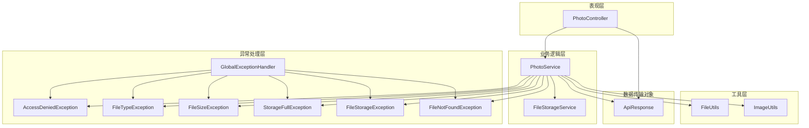
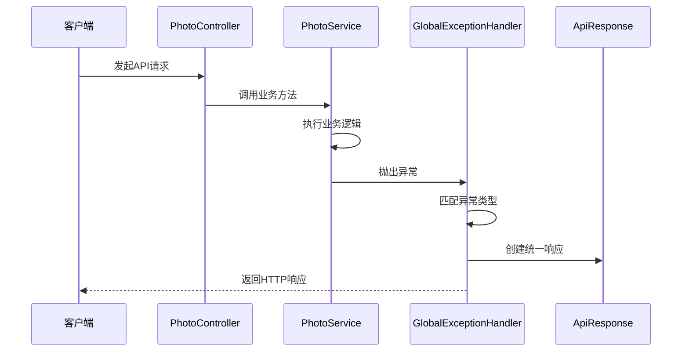
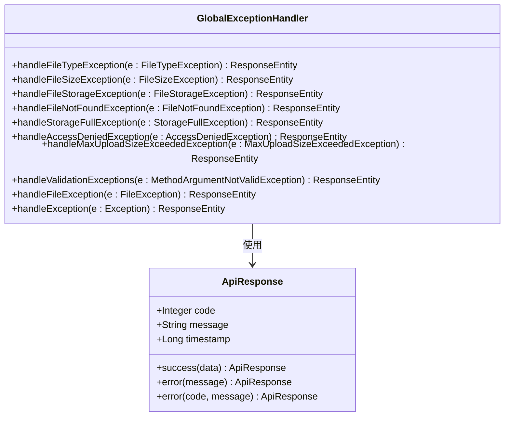
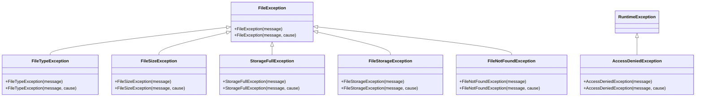
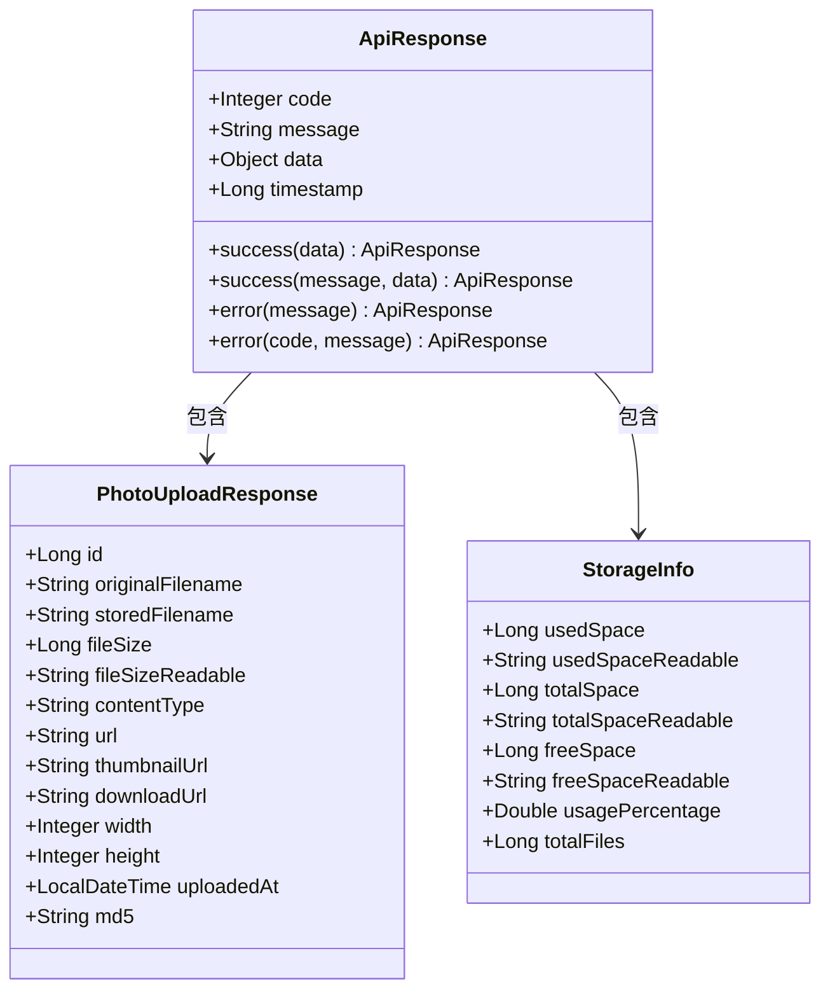
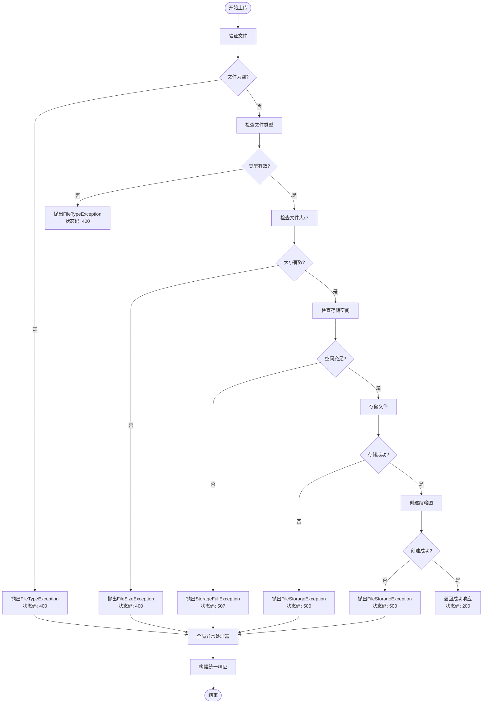
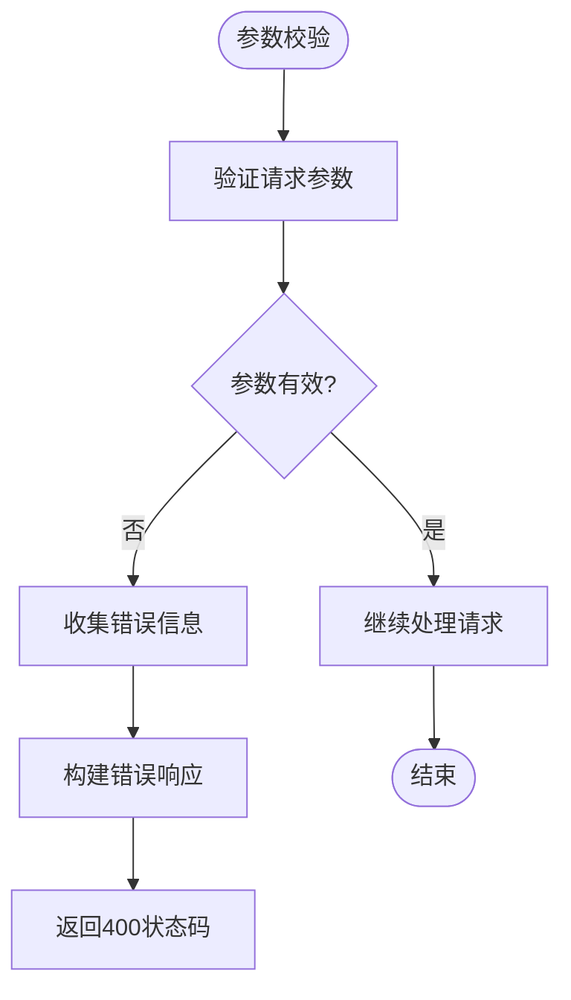
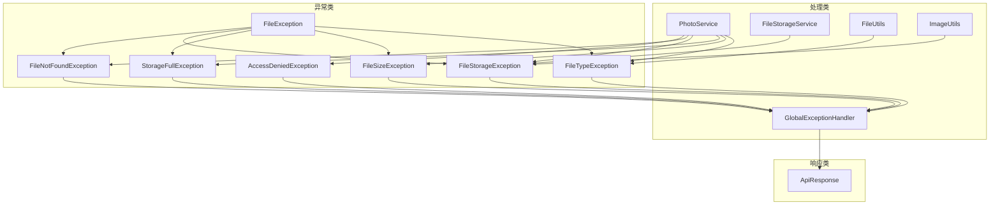

# 错误处理和状态码

<cite>
**本文档引用的文件**
- [GlobalExceptionHandler.java](file://src/main/java/com/photo/exception/GlobalExceptionHandler.java)
- [ApiResponse.java](file://src/main/java/com/photo/dto/ApiResponse.java)
- [FileException.java](file://src/main/java/com/photo/exception/FileException.java)
- [FileTypeException.java](file://src/main/java/com/photo/exception/FileTypeException.java)
- [FileSizeException.java](file://src/main/java/com/photo/exception/FileSizeException.java)
- [StorageFullException.java](file://src/main/java/com/photo/exception/StorageFullException.java)
- [AccessDeniedException.java](file://src/main/java/com/photo/exception/AccessDeniedException.java)
- [FileStorageException.java](file://src/main/java/com/photo/exception/FileStorageException.java)
- [FileNotFoundException.java](file://src/main/java/com/photo/exception/FileNotFoundException.java)
- [PhotoService.java](file://src/main/java/com/photo/service/PhotoService.java)
- [FileStorageService.java](file://src/main/java/com/photo/service/FileStorageService.java)
- [FileUtils.java](file://src/main/java/com/photo/util/FileUtils.java)
- [ImageUtils.java](file://src/main/java/com/photo/util/ImageUtils.java)
- [application.yml](file://src/main/resources/application.yml)
- [PhotoController.java](file://src/main/java/com/photo/controller/PhotoController.java)
</cite>

## 目录
1. [简介](#简介)
2. [项目结构](#项目结构)
3. [核心组件](#核心组件)
4. [架构概览](#架构概览)
5. [详细组件分析](#详细组件分析)
6. [依赖关系分析](#依赖关系分析)
7. [性能考虑](#性能考虑)
8. [故障排除指南](#故障排除指南)
9. [结论](#结论)

## 简介
本文件详细说明了PhotoUpload系统的错误处理机制和HTTP状态码使用规范。系统采用统一的异常处理策略，通过全局异常处理器将各种业务异常转换为标准化的API响应格式，并为不同类型的错误分配相应的HTTP状态码。

## 项目结构
PhotoUpload系统采用分层架构设计，错误处理机制贯穿整个应用层：

**图表来源**
- [PhotoController.java](file://src/main/java/com/photo/controller/PhotoController.java#L1-L200)
- [PhotoService.java](file://src/main/java/com/photo/service/PhotoService.java#L1-L200)
- [GlobalExceptionHandler.java](file://src/main/java/com/photo/exception/GlobalExceptionHandler.java#L1-L140)

## 核心组件
系统的核心错误处理组件包括：

### 全局异常处理器
全局异常处理器负责捕获和处理系统中的各种异常，将其转换为标准的API响应格式。

### 异常层次结构
系统定义了完整的异常层次结构，从基础的文件异常类派生出各种特定的异常类型。

### 统一响应格式
所有API响应都遵循统一的格式，包含状态码、消息和时间戳等信息。

**章节来源**
- [GlobalExceptionHandler.java](file://src/main/java/com/photo/exception/GlobalExceptionHandler.java#L16-L139)
- [ApiResponse.java](file://src/main/java/com/photo/dto/ApiResponse.java#L1-L63)

## 架构概览
系统采用Spring MVC的@RestControllerAdvice注解实现全局异常处理，确保所有控制器抛出的异常都能被统一处理。

**图表来源**
- [PhotoController.java](file://src/main/java/com/photo/controller/PhotoController.java#L48-L61)
- [GlobalExceptionHandler.java](file://src/main/java/com/photo/exception/GlobalExceptionHandler.java#L26-L32)

## 详细组件分析

### 全局异常处理器分析

#### 异常处理策略
全局异常处理器采用基于注解的方法级异常处理，为每种异常类型提供专门的处理逻辑。

**图表来源**
- [GlobalExceptionHandler.java](file://src/main/java/com/photo/exception/GlobalExceptionHandler.java#L21-L139)
- [ApiResponse.java](file://src/main/java/com/photo/dto/ApiResponse.java#L13-L62)

#### HTTP状态码映射
系统为不同类型的异常分配了合适的HTTP状态码：

| 异常类型 | HTTP状态码 | 状态码含义 | 触发条件 |
|---------|-----------|-----------|----------|
| FileTypeException | 400 | Bad Request | 文件类型不支持、文件为空、文件扩展名无效 |
| FileSizeException | 400 | Bad Request | 文件大小超过限制、批量上传文件数量超限 |
| FileStorageException | 500 | Internal Server Error | 文件存储失败、文件读取失败、文件写入失败 |
| FileNotFoundException | 404 | Not Found | 文件不存在、照片不存在、缩略图不存在 |
| StorageFullException | 507 | Insufficient Storage | 存储空间不足、总存储空间超限 |
| AccessDeniedException | 403 | Forbidden | 权限不足、非法访问来源、无权操作他人文件 |
| MaxUploadSizeExceededException | 400 | Bad Request | 文件上传大小超过Spring配置限制 |
| MethodArgumentNotValidException | 400 | Bad Request | 参数校验失败、字段验证错误 |
| FileException | 500 | Internal Server Error | 通用文件异常、未分类的文件处理错误 |
| Exception | 500 | Internal Server Error | 系统未捕获的其他异常 |

**章节来源**
- [GlobalExceptionHandler.java](file://src/main/java/com/photo/exception/GlobalExceptionHandler.java#L26-L138)

### 异常层次结构分析

#### 基础异常类
系统定义了完整的异常继承层次结构，便于区分不同类型的错误。

**图表来源**
- [FileException.java](file://src/main/java/com/photo/exception/FileException.java#L6-L15)
- [FileTypeException.java](file://src/main/java/com/photo/exception/FileTypeException.java#L6-L15)
- [FileSizeException.java](file://src/main/java/com/photo/exception/FileSizeException.java#L6-L15)
- [StorageFullException.java](file://src/main/java/com/photo/exception/StorageFullException.java#L6-L15)
- [FileStorageException.java](file://src/main/java/com/photo/exception/FileStorageException.java#L6-L15)
- [FileNotFoundException.java](file://src/main/java/com/photo/exception/FileNotFoundException.java#L6-L15)
- [AccessDeniedException.java](file://src/main/java/com/photo/exception/AccessDeniedException.java#L6-L15)

#### 业务异常触发场景
系统在多个业务环节中抛出特定的异常类型：

**文件验证异常**：
- 文件为空或null时抛出FileTypeException
- 不支持的文件类型时抛出FileTypeException
- 文件大小超过限制时抛出FileSizeException
- 图片文件无效时抛出FileTypeException

**存储空间异常**：
- 总存储空间超过配置上限时抛出StorageFullException
- 单个文件存储失败时抛出FileStorageException

**权限异常**：
- 非法访问来源时抛出AccessDeniedException
- 无权删除他人文件时抛出AccessDeniedException

**章节来源**
- [PhotoService.java](file://src/main/java/com/photo/service/PhotoService.java#L304-L336)
- [FileStorageService.java](file://src/main/java/com/photo/service/FileStorageService.java#L59-L95)

### 统一响应格式分析

#### API响应结构
系统使用统一的API响应格式，确保客户端能够一致地处理各种响应。

**图表来源**
- [ApiResponse.java](file://src/main/java/com/photo/dto/ApiResponse.java#L13-L62)
- [PhotoService.java](file://src/main/java/com/photo/service/PhotoService.java#L341-L357)

#### 响应格式特点
- **状态码**：包含业务状态码（如200、400、403、404、500、507）
- **消息**：人类可读的错误描述
- **时间戳**：响应生成的时间
- **数据**：具体的业务数据或null

**章节来源**
- [ApiResponse.java](file://src/main/java/com/photo/dto/ApiResponse.java#L38-L61)

### 错误处理流程分析

#### 文件上传错误处理流程

**图表来源**
- [PhotoService.java](file://src/main/java/com/photo/service/PhotoService.java#L50-L111)
- [GlobalExceptionHandler.java](file://src/main/java/com/photo/exception/GlobalExceptionHandler.java#L26-L76)

#### 参数校验错误处理流程

**图表来源**
- [GlobalExceptionHandler.java](file://src/main/java/com/photo/exception/GlobalExceptionHandler.java#L103-L116)

## 依赖关系分析

### 异常处理依赖图

**图表来源**
- [GlobalExceptionHandler.java](file://src/main/java/com/photo/exception/GlobalExceptionHandler.java#L21-L139)
- [PhotoService.java](file://src/main/java/com/photo/service/PhotoService.java#L6-L30)

### 配置依赖关系
系统通过application.yml配置文件控制各种错误处理相关的设置：

**文件上传配置**：
- 最大文件大小：10MB
- 最大请求大小：50MB
- 文件大小阈值：2MB

**存储配置**：
- 最大存储空间：10GB
- 允许的文件类型：JPG、PNG、GIF、BMP、WEBP
- 允许的文件扩展名：jpg、jpeg、png、gif、bmp、webp

**安全配置**：
- 防盗链域名白名单
- CORS跨域配置
- Token认证配置

**章节来源**
- [application.yml](file://src/main/resources/application.yml#L42-L118)

## 性能考虑
系统在错误处理方面采用了多项性能优化措施：

### 异常处理性能
- **快速失败**：在业务逻辑早期发现并抛出异常，避免不必要的后续处理
- **日志级别控制**：使用不同的日志级别记录异常信息，平衡调试需求和性能影响
- **异常缓存**：对于频繁出现的异常类型，系统会进行适当的缓存处理

### 内存管理
- **流式处理**：文件操作采用流式处理方式，避免大文件加载到内存
- **资源及时释放**：确保文件流和数据库连接等资源得到及时释放

### 网络性能
- **压缩传输**：启用HTTP压缩减少响应数据大小
- **缓存策略**：合理设置缓存头，提高静态资源访问效率

## 故障排除指南

### 常见错误场景诊断

#### 文件类型错误 (400)
**症状**：上传文件时返回400状态码
**可能原因**：
- 文件扩展名不在允许列表中
- MIME类型检测失败
- 文件内容与扩展名不匹配

**解决步骤**：
1. 检查文件扩展名是否在配置的允许列表中
2. 验证文件内容是否为有效的图片格式
3. 确认文件没有被恶意修改

#### 文件大小超限 (400)
**症状**：上传大文件时返回400状态码
**可能原因**：
- 单个文件大小超过10MB限制
- 批量上传文件数量超过10个
- Spring配置的上传限制被触发

**解决步骤**：
1. 检查application.yml中的max-file-size配置
2. 确认批量上传的文件数量不超过限制
3. 考虑分批上传大文件

#### 访问权限不足 (403)
**症状**：访问受保护资源时返回403状态码
**可能原因**：
- 非法的Referer来源
- 试图删除他人的文件
- 未登录或Token失效

**解决步骤**：
1. 检查Referer头是否在允许的域名列表中
2. 确认当前用户对目标文件拥有操作权限
3. 验证Token的有效性和过期时间

#### 存储空间不足 (507)
**症状**：上传文件时返回507状态码
**可能原因**：
- 总存储空间达到10GB上限
- 单个文件导致空间不足
- 磁盘空间实际不足

**解决步骤**：
1. 检查系统存储使用情况
2. 清理过期或不需要的文件
3. 考虑扩容存储空间

#### 文件未找到 (404)
**症状**：访问不存在的文件时返回404状态码
**可能原因**：
- 文件已被删除但仍保留链接
- 文件名拼写错误
- 文件存储路径发生变化

**解决步骤**：
1. 检查文件是否仍然存在于数据库中
2. 验证文件存储路径是否正确
3. 确认文件没有被意外删除

### 调试建议

#### 日志分析
系统使用SLF4J日志框架记录详细的错误信息：

**日志级别建议**：
- **ERROR**：记录严重错误和异常堆栈
- **WARN**：记录潜在问题但不影响功能
- **INFO**：记录重要业务操作
- **DEBUG**：记录详细的技术信息

**关键日志字段**：
- 异常类型和消息
- 请求IP地址和用户信息
- 文件名和操作类型
- 时间戳和处理耗时

#### 性能监控
建议监控以下关键指标：
- 异常发生频率和类型分布
- 文件上传成功率和失败率
- 存储空间使用率
- API响应时间和错误率

#### 测试策略
针对错误处理的测试应该包括：
- 正常流程的边界测试
- 异常流程的完整性测试
- 性能压力下的错误处理测试
- 并发场景下的错误处理测试

**章节来源**
- [GlobalExceptionHandler.java](file://src/main/java/com/photo/exception/GlobalExceptionHandler.java#L28-L138)
- [application.yml](file://src/main/resources/application.yml#L146-L160)

## 结论
PhotoUpload系统的错误处理机制具有以下特点：

### 设计优势
1. **统一性**：所有异常都通过全局处理器转换为统一的API响应格式
2. **可维护性**：清晰的异常层次结构便于理解和扩展
3. **用户体验**：合理的HTTP状态码分配和错误消息设计
4. **性能考虑**：在保证功能的前提下优化了性能表现

### 改进建议
1. **增强日志**：可以增加更详细的上下文信息，便于问题定位
2. **国际化支持**：可以考虑添加多语言错误消息支持
3. **错误统计**：可以添加错误统计和报告功能
4. **重试机制**：对于临时性错误可以考虑添加自动重试机制

### 最佳实践
1. **预防为主**：在业务逻辑早期进行参数验证和边界检查
2. **优雅降级**：对于非关键功能的错误可以考虑降级处理
3. **用户友好**：向用户提供清晰的错误指导而非技术细节
4. **安全考虑**：确保错误信息不会泄露敏感的系统信息

通过这套完善的错误处理机制，系统能够在保证功能完整性的同时，为用户提供良好的使用体验和可靠的系统稳定性。