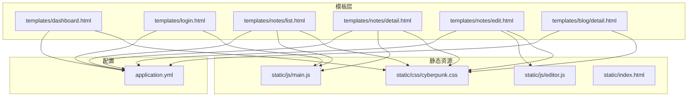
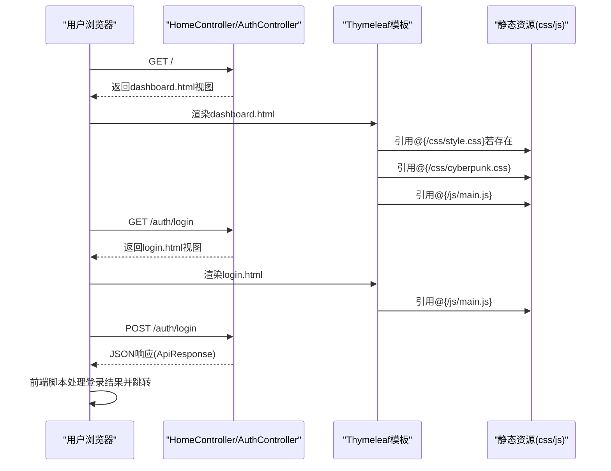
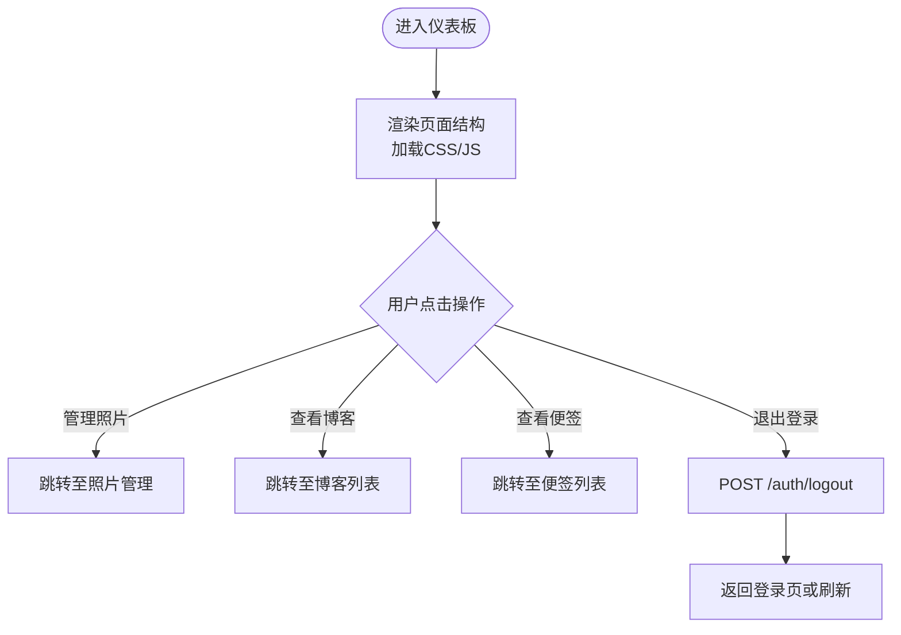
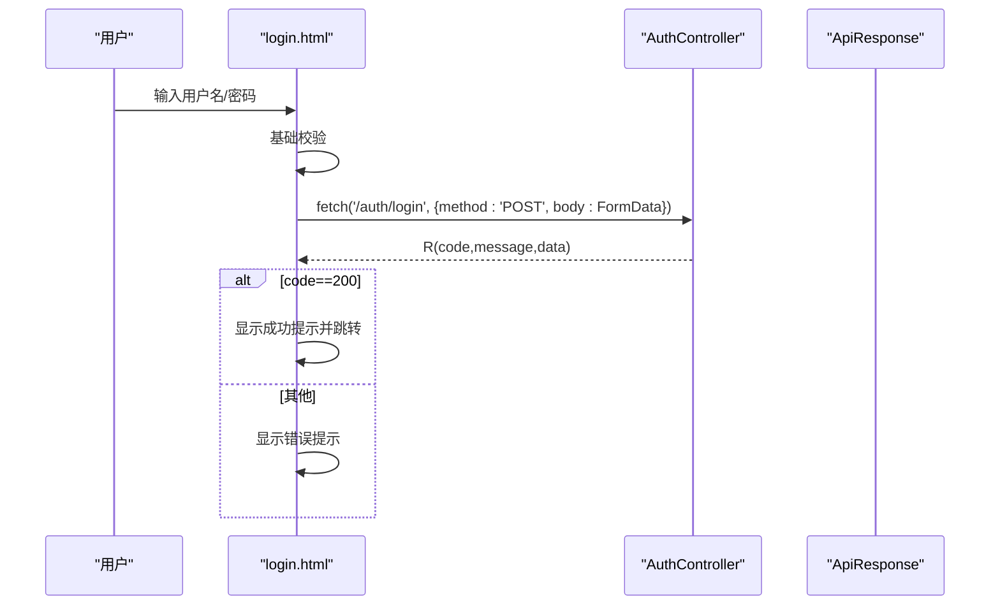
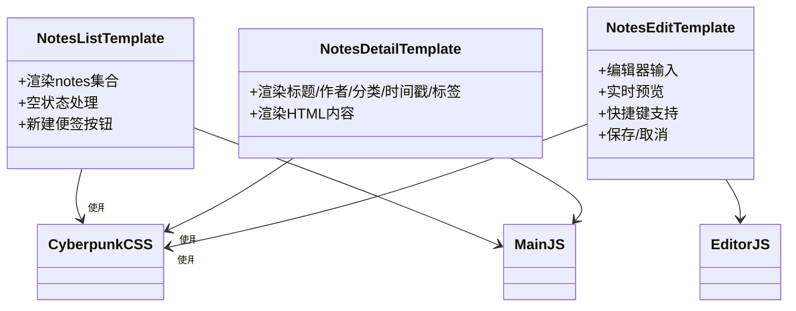
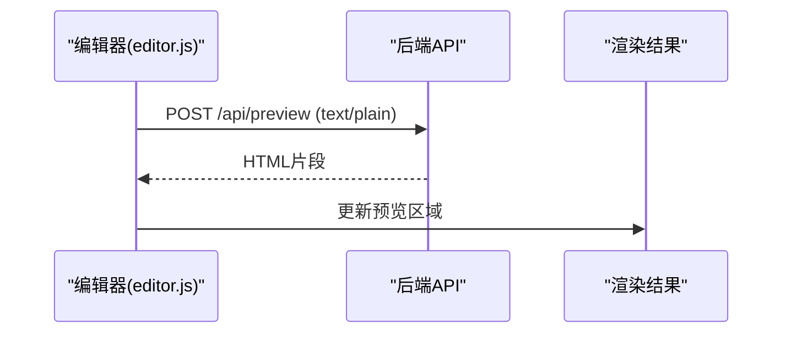
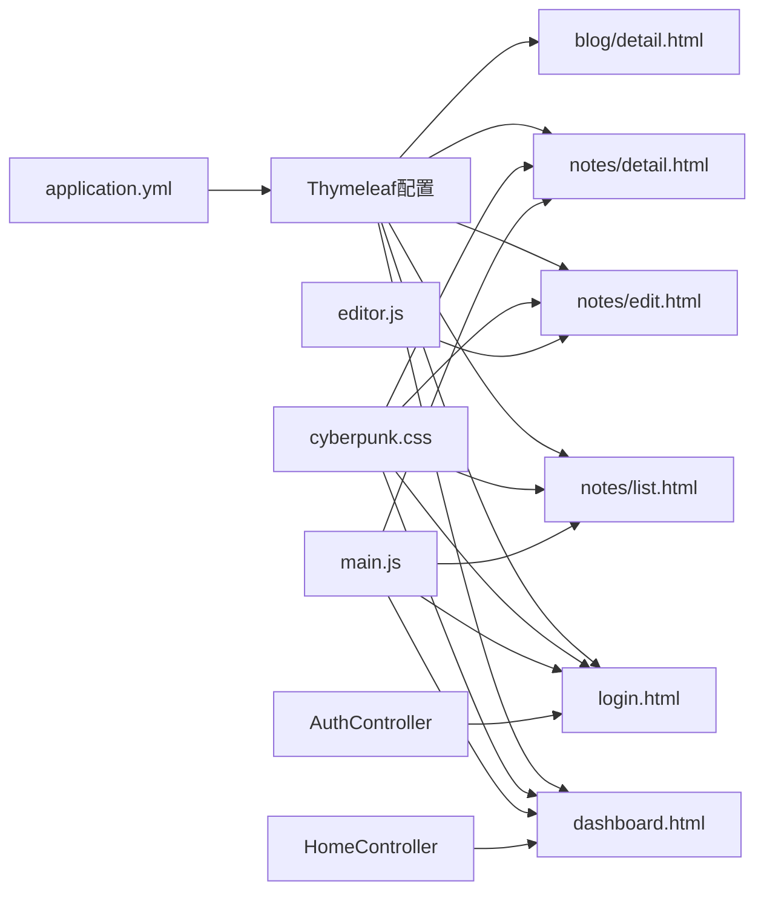

# 前端模板系统

<cite>
**本文引用的文件**
- [dashboard.html](file://src/main/resources/templates/dashboard.html)
- [login.html](file://src/main/resources/templates/login.html)
- [cyberpunk.css](file://src/main/resources/static/css/cyberpunk.css)
- [main.js](file://src/main/resources/static/js/main.js)
- [editor.js](file://src/main/resources/static/js/editor.js)
- [application.yml](file://src/main/resources/application.yml)
- [HomeController.java](file://src/main/java/com/photo/controller/HomeController.java)
- [AuthController.java](file://src/main/java/com/photo/controller/AuthController.java)
- [FileStorageService.java](file://src/main/java/com/photo/service/FileStorageService.java)
- [detail.html](file://src/main/resources/templates/blog/detail.html)
- [list.html](file://src/main/resources/templates/notes/list.html)
- [detail.html](file://src/main/resources/templates/notes/detail.html)
- [edit.html](file://src/main/resources/templates/notes/edit.html)
- [index.html](file://src/main/resources/static/index.html)
- [API_DOCUMENTATION.md](file://API_DOCUMENTATION.md)
</cite>

## 目录
1. [简介](#简介)
2. [项目结构](#项目结构)
3. [核心组件](#核心组件)
4. [架构总览](#架构总览)
5. [详细组件分析](#详细组件分析)
6. [依赖关系分析](#依赖关系分析)
7. [性能考量](#性能考量)
8. [故障排查指南](#故障排查指南)
9. [结论](#结论)
10. [附录](#附录)

## 简介
本文件面向前端开发者，系统化介绍照片上传下载系统的前端模板体系与页面布局设计。重点覆盖：
- Thymeleaf模板的使用方法与页面布局
- 主要页面模板（仪表板、登录页、便签列表/详情/编辑）的结构与功能
- 静态资源（CSS、JavaScript）的组织与管理
- 前端组件的使用示例与自定义方法
- 响应式设计与浏览器兼容性
- 前端与后端API的集成方式与数据绑定
- 前端开发最佳实践与性能优化建议

## 项目结构
前端模板系统位于Spring Boot项目的resources目录下，采用Thymeleaf模板引擎渲染HTML页面，静态资源通过classpath:/static提供。核心目录与文件如下：
- 模板文件：src/main/resources/templates
- 静态资源：src/main/resources/static
- 配置文件：src/main/resources/application.yml

图表来源
- [dashboard.html](file://src/main/resources/templates/dashboard.html#L1-L172)
- [login.html](file://src/main/resources/templates/login.html#L1-L447)
- [cyberpunk.css](file://src/main/resources/static/css/cyberpunk.css#L1-L629)
- [main.js](file://src/main/resources/static/js/main.js#L1-L80)
- [editor.js](file://src/main/resources/static/js/editor.js#L1-L207)
- [application.yml](file://src/main/resources/application.yml#L56-L62)

章节来源
- [dashboard.html](file://src/main/resources/templates/dashboard.html#L1-L172)
- [login.html](file://src/main/resources/templates/login.html#L1-L447)
- [cyberpunk.css](file://src/main/resources/static/css/cyberpunk.css#L1-L629)
- [main.js](file://src/main/resources/static/js/main.js#L1-L80)
- [editor.js](file://src/main/resources/static/js/editor.js#L1-L207)
- [application.yml](file://src/main/resources/application.yml#L56-L62)

## 核心组件
- 模板引擎：Thymeleaf，模板前缀与后缀在配置中定义，启用UTF-8编码，禁用模板缓存便于开发调试。
- 页面布局：采用语义化的HTML结构，配合CSS Grid/Flexbox实现响应式布局。
- 静态资源：CSS按主题风格组织，JS按功能模块拆分，模板通过th:href/th:src动态绑定资源路径。
- 数据绑定：Thymeleaf表达式用于读取后端传递的模型数据（如note.title、blog.htmlContent等），并支持条件渲染与循环展示。
- 前端交互：登录页使用原生fetch进行异步提交；便签编辑器支持实时预览与快捷键；通用交互由main.js提供。

章节来源
- [application.yml](file://src/main/resources/application.yml#L56-L62)
- [dashboard.html](file://src/main/resources/templates/dashboard.html#L1-L172)
- [login.html](file://src/main/resources/templates/login.html#L1-L447)
- [cyberpunk.css](file://src/main/resources/static/css/cyberpunk.css#L1-L629)
- [main.js](file://src/main/resources/static/js/main.js#L1-L80)
- [editor.js](file://src/main/resources/static/js/editor.js#L1-L207)

## 架构总览
前端模板系统与后端控制器的交互关系如下：

图表来源
- [HomeController.java](file://src/main/java/com/photo/controller/HomeController.java#L10-L26)
- [AuthController.java](file://src/main/java/com/photo/controller/AuthController.java#L39-L90)
- [dashboard.html](file://src/main/resources/templates/dashboard.html#L7-L7)
- [login.html](file://src/main/resources/templates/login.html#L1-L447)
- [main.js](file://src/main/resources/static/js/main.js#L1-L80)

## 详细组件分析

### 仪表板页面（dashboard.html）
- 结构要点
  - 使用内联样式与外部CSS结合，强调卡片式布局与渐变背景。
  - 提供“管理照片/查看博客/查看便签/退出登录”等入口。
- 数据绑定
  - 该模板未直接使用Thymeleaf数据绑定，适合展示性页面。
- 响应式
  - 采用CSS Grid实现卡片自适应排列。

图表来源
- [dashboard.html](file://src/main/resources/templates/dashboard.html#L138-L169)

章节来源
- [dashboard.html](file://src/main/resources/templates/dashboard.html#L1-L172)

### 登录页（login.html）
- 功能特性
  - 支持登录/注册双标签页切换。
  - 表单基础校验与错误提示。
  - 异步登录/注册，基于fetch提交FormData到后端。
  - 加载动画与提示消息。
- 数据绑定
  - 未直接绑定后端模型数据，纯前端交互。
- API集成
  - 登录：POST /auth/login
  - 注册：POST /auth/register
  - 成功后根据返回的redirectUrl跳转。

图表来源
- [login.html](file://src/main/resources/templates/login.html#L332-L378)
- [AuthController.java](file://src/main/java/com/photo/controller/AuthController.java#L47-L80)

章节来源
- [login.html](file://src/main/resources/templates/login.html#L1-L447)
- [AuthController.java](file://src/main/java/com/photo/controller/AuthController.java#L1-L111)

### 便签系统模板族（list/detail/edit）
- 列表页（list.html）
  - 使用赛博朋克主题CSS，网格布局展示便签卡片。
  - 支持空状态提示与“新建便签”按钮。
  - 通过Thymeleaf遍历notes集合，绑定title/contentPreview/createdTime等。
- 详情页（detail.html）
  - 展示便签标题、作者、分类、时间戳、标签等元信息。
  - 使用th:utext渲染已渲染的HTML内容，避免二次转义。
- 编辑页（edit.html）
  - 双面板编辑器：左侧编辑区，右侧实时预览区。
  - 支持Markdown快捷键（加粗、斜体、链接、列表、代码块等）。
  - 通过fetch调用后端API进行Markdown渲染预览。

图表来源
- [list.html](file://src/main/resources/templates/notes/list.html#L1-L63)
- [detail.html](file://src/main/resources/templates/notes/detail.html#L1-L67)
- [edit.html](file://src/main/resources/templates/notes/edit.html#L1-L88)
- [cyberpunk.css](file://src/main/resources/static/css/cyberpunk.css#L1-L629)
- [main.js](file://src/main/resources/static/js/main.js#L1-L80)
- [editor.js](file://src/main/resources/static/js/editor.js#L1-L207)

章节来源
- [list.html](file://src/main/resources/templates/notes/list.html#L1-L63)
- [detail.html](file://src/main/resources/templates/notes/detail.html#L1-L67)
- [edit.html](file://src/main/resources/templates/notes/edit.html#L1-L88)
- [cyberpunk.css](file://src/main/resources/static/css/cyberpunk.css#L1-L629)
- [main.js](file://src/main/resources/static/js/main.js#L1-L80)
- [editor.js](file://src/main/resources/static/js/editor.js#L1-L207)

### 博客详情页（blog/detail.html）
- 特点
  - 使用赛博朋克主题CSS，渲染博客标题、作者、分类、时间戳、标签等。
  - 通过th:utext输出已渲染的HTML内容，确保Markdown正确显示。
  - 提供返回列表、编辑、删除等操作按钮。
- 数据绑定
  - 使用Thymeleaf表达式读取blog.title、blog.htmlContent、blog.tags等。

章节来源
- [detail.html](file://src/main/resources/templates/blog/detail.html#L1-L153)
- [cyberpunk.css](file://src/main/resources/static/css/cyberpunk.css#L1-L629)

### 静态资源组织与管理
- CSS
  - cyberpunk.css：主题样式，包含赛博朋克风格的配色、动画、网格布局、响应式规则等。
  - dashboard.html中使用了内联style与外部CSS结合的方式。
- JavaScript
  - main.js：通用交互（自动隐藏消息、按钮波纹效果、确认删除、加载动画）。
  - editor.js：编辑器交互（实时预览、快捷键、Markdown插入、防抖优化）。
- 资源路径
  - 模板通过th:href/th:src动态绑定静态资源路径，避免硬编码。

章节来源
- [cyberpunk.css](file://src/main/resources/static/css/cyberpunk.css#L1-L629)
- [main.js](file://src/main/resources/static/js/main.js#L1-L80)
- [editor.js](file://src/main/resources/static/js/editor.js#L1-L207)
- [dashboard.html](file://src/main/resources/templates/dashboard.html#L7-L7)
- [login.html](file://src/main/resources/templates/login.html#L1-L447)

### 前端与后端API集成
- 登录/注册
  - 前端通过fetch提交FormData到后端，后端返回统一响应格式（ApiResponse）。
- Markdown预览
  - 编辑器通过fetch将Markdown文本发送到后端API进行渲染，再回显到预览区域。
- 文件上传（测试页面）
  - index.html展示了批量上传的前端实现，包含进度条与错误处理。

图表来源
- [editor.js](file://src/main/resources/static/js/editor.js#L56-L79)
- [API_DOCUMENTATION.md](file://API_DOCUMENTATION.md#L1-L168)

章节来源
- [login.html](file://src/main/resources/templates/login.html#L356-L378)
- [AuthController.java](file://src/main/java/com/photo/controller/AuthController.java#L47-L90)
- [editor.js](file://src/main/resources/static/js/editor.js#L56-L79)
- [API_DOCUMENTATION.md](file://API_DOCUMENTATION.md#L1-L168)

## 依赖关系分析
- 模板与静态资源
  - dashboard/login/notes/blog模板均依赖cyberpunk.css与main.js。
  - 编辑页额外依赖editor.js。
- 模板与配置
  - Thymeleaf模板前缀/后缀/编码在application.yml中集中配置。
- 模板与控制器
  - HomeController返回dashboard视图；AuthController提供登录页与登录/注册/注销接口。

图表来源
- [application.yml](file://src/main/resources/application.yml#L56-L62)
- [dashboard.html](file://src/main/resources/templates/dashboard.html#L1-L172)
- [login.html](file://src/main/resources/templates/login.html#L1-L447)
- [list.html](file://src/main/resources/templates/notes/list.html#L1-L63)
- [detail.html](file://src/main/resources/templates/notes/detail.html#L1-L67)
- [edit.html](file://src/main/resources/templates/notes/edit.html#L1-L88)
- [HomeController.java](file://src/main/java/com/photo/controller/HomeController.java#L10-L26)
- [AuthController.java](file://src/main/java/com/photo/controller/AuthController.java#L39-L90)

章节来源
- [application.yml](file://src/main/resources/application.yml#L56-L62)
- [HomeController.java](file://src/main/java/com/photo/controller/HomeController.java#L10-L26)
- [AuthController.java](file://src/main/java/com/photo/controller/AuthController.java#L39-L90)

## 性能考量
- 模板缓存
  - 开发阶段禁用Thymeleaf模板缓存，便于迭代；生产环境建议开启以提升性能。
- 资源加载
  - 使用CSS Grid/Flexbox减少复杂布局计算；合理拆分JS模块，按需加载。
- 预览优化
  - 编辑器使用防抖（300ms）优化实时预览性能。
- 压缩与缓存
  - 服务器启用Gzip压缩与静态资源缓存策略（见application.yml）。

章节来源
- [application.yml](file://src/main/resources/application.yml#L62-L62)
- [application.yml](file://src/main/resources/application.yml#L164-L166)
- [editor.js](file://src/main/resources/static/js/editor.js#L18-L24)

## 故障排查指南
- 登录失败
  - 检查用户名/密码是否正确；查看前端提示与后端返回的错误信息。
  - 确认后端接口是否正常（/auth/login）。
- 编辑器预览异常
  - 检查网络请求是否成功（/api/preview）；确认后端Markdown渲染服务可用。
- 资源路径问题
  - 确认th:href/th:src路径正确；检查静态资源是否部署到classpath:/static。
- 响应式布局异常
  - 检查CSS媒体查询是否生效；确认viewport meta标签存在。

章节来源
- [login.html](file://src/main/resources/templates/login.html#L332-L443)
- [editor.js](file://src/main/resources/static/js/editor.js#L56-L79)
- [cyberpunk.css](file://src/main/resources/static/css/cyberpunk.css#L575-L607)

## 结论
本前端模板系统以Thymeleaf为核心，结合赛博朋克风格的主题CSS与模块化的JavaScript，实现了从登录认证到内容管理的完整前端体验。通过清晰的模板分层、规范的静态资源组织与前后端API协同，既保证了开发效率，也为后续扩展提供了良好基础。

## 附录

### 前端组件使用示例与自定义方法
- 消息提示
  - 使用message类与自动隐藏逻辑，可在任意页面复用。
- 波纹按钮
  - 通过main.js为所有.btn元素添加点击波纹效果。
- 编辑器快捷键
  - 支持Ctrl+S保存、Ctrl+Esc取消、Ctrl+B/Ctrl+I/Ctrl+K等常用Markdown快捷键。
- 实时预览
  - 编辑器通过防抖优化预览性能，建议在长文档场景下保持默认阈值。

章节来源
- [main.js](file://src/main/resources/static/js/main.js#L17-L80)
- [editor.js](file://src/main/resources/static/js/editor.js#L84-L148)

### 响应式设计与浏览器兼容性
- 响应式
  - 使用CSS Grid与Flexbox实现自适应布局；在移动端适配了导航、编辑器与预览面板。
- 兼容性
  - 使用标准CSS属性与现代浏览器特性；必要时可通过polyfill增强旧版浏览器支持。

章节来源
- [cyberpunk.css](file://src/main/resources/static/css/cyberpunk.css#L575-L607)

### 前端开发最佳实践
- 模板分离关注点：结构（HTML）、样式（CSS）、行为（JS）清晰划分。
- 数据绑定优先：尽量使用Thymeleaf表达式绑定后端数据，减少前端拼装。
- 错误处理：统一提示与日志记录，避免静默失败。
- 性能优化：按需加载、防抖、缓存与压缩策略相结合。

### 前端与后端API集成参考
- 登录/注册：/auth/login、/auth/register、/auth/logout
- Markdown预览：/api/preview
- 文件上传（测试页面）：/api/photos/upload、/api/photos/upload/batch

章节来源
- [AuthController.java](file://src/main/java/com/photo/controller/AuthController.java#L47-L109)
- [editor.js](file://src/main/resources/static/js/editor.js#L56-L79)
- [API_DOCUMENTATION.md](file://API_DOCUMENTATION.md#L105-L168)