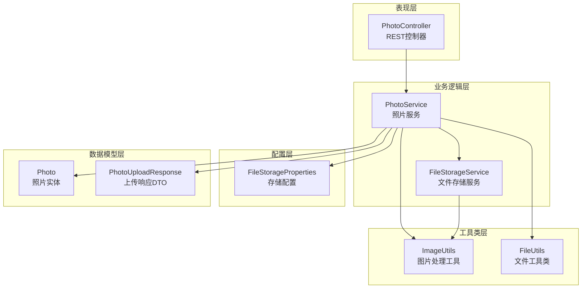
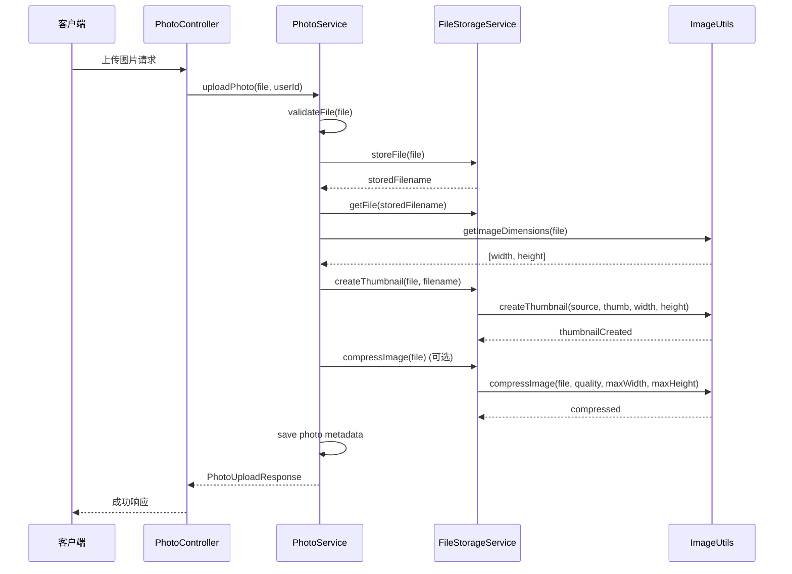
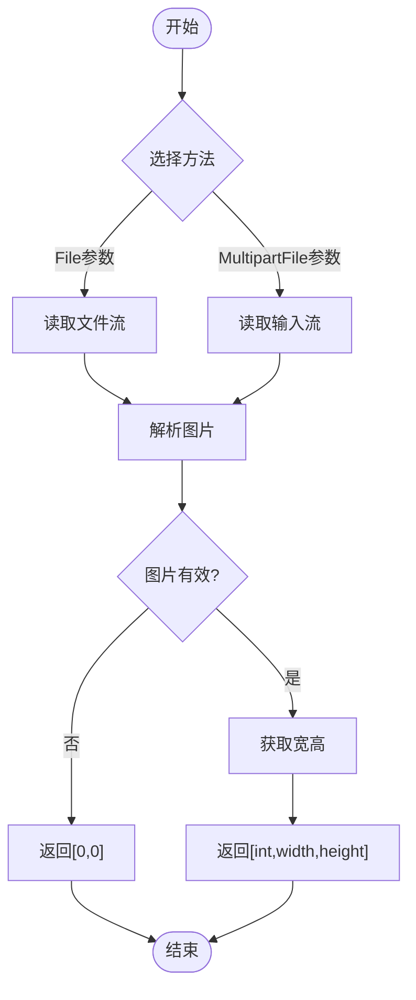
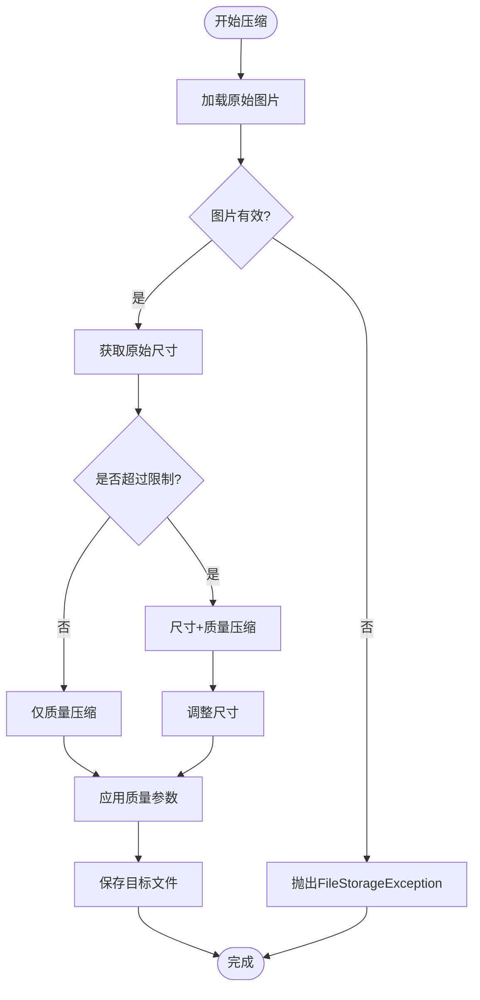
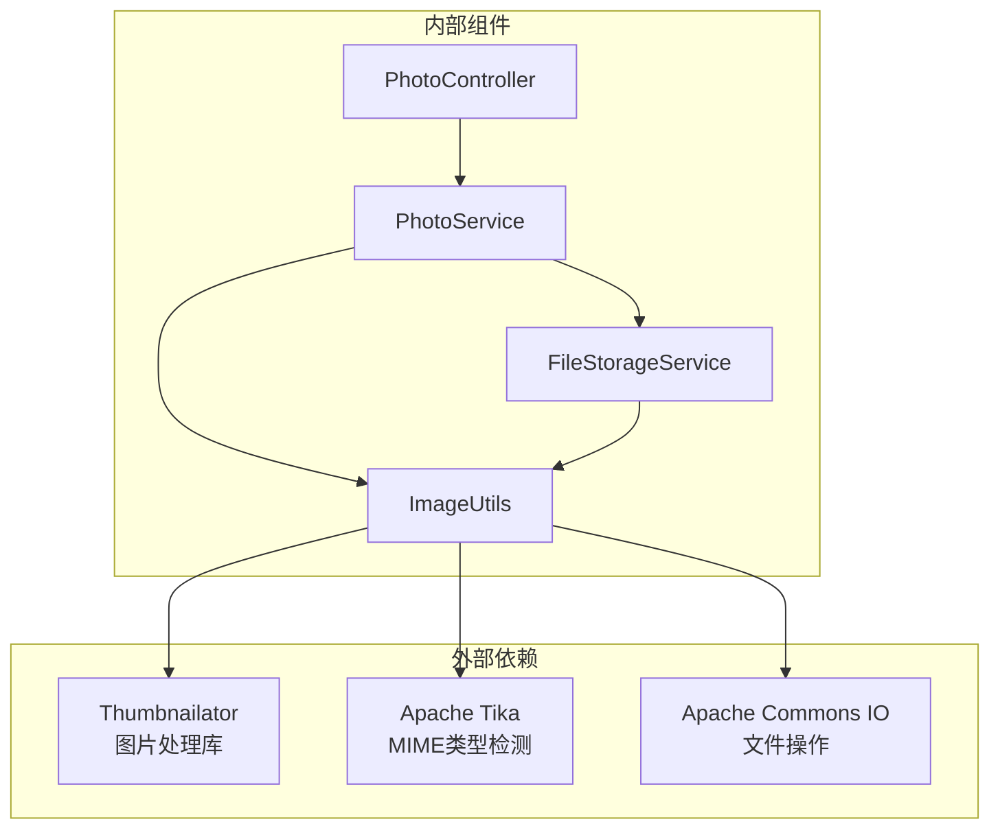
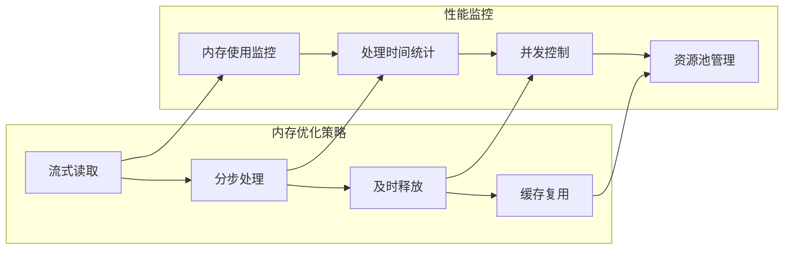
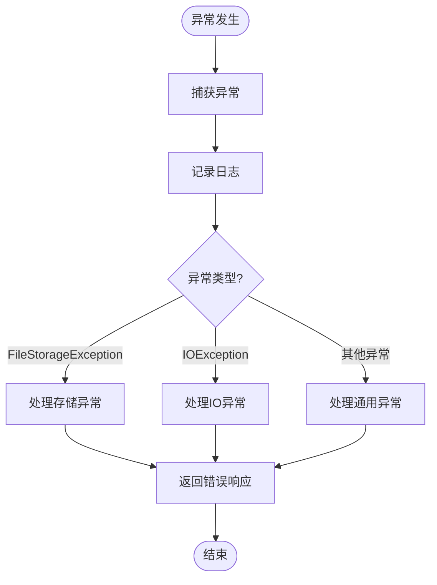

# 图片处理工具

<cite>
**本文档引用的文件**
- [ImageUtils.java](file://src/main/java/com/photo/util/ImageUtils.java)
- [FileStorageService.java](file://src/main/java/com/photo/service/FileStorageService.java)
- [PhotoService.java](file://src/main/java/com/photo/service/PhotoService.java)
- [PhotoController.java](file://src/main/java/com/photo/controller/PhotoController.java)
- [FileStorageProperties.java](file://src/main/java/com/photo/config/FileStorageProperties.java)
- [FileUtils.java](file://src/main/java/com/photo/util/FileUtils.java)
- [Photo.java](file://src/main/java/com/photo/entity/Photo.java)
- [PhotoUploadResponse.java](file://src/main/java/com/photo/dto/PhotoUploadResponse.java)
- [application.yml](file://src/main/resources/application.yml)
- [README.md](file://README.md)
</cite>

## 目录
1. [简介](#简介)
2. [项目结构](#项目结构)
3. [核心组件](#核心组件)
4. [架构概览](#架构概览)
5. [详细组件分析](#详细组件分析)
6. [依赖关系分析](#依赖关系分析)
7. [性能考虑](#性能考虑)
8. [故障排除指南](#故障排除指南)
9. [结论](#结论)
10. [附录](#附录)

## 简介

本文档详细介绍照片上传系统中的图片处理工具，重点分析ImageUtils类的功能和使用方法。该系统基于Spring Boot开发，提供了完整的图片上传、处理、存储和管理功能，包括图片压缩、缩略图生成、格式转换等核心能力。

系统采用分层架构设计，包含控制器层、服务层、数据访问层和工具类层，确保了良好的代码组织和可维护性。

## 项目结构

项目采用标准的Spring Boot项目结构，主要分为以下层次：

**图表来源**
- [PhotoController.java](file://src/main/java/com/photo/controller/PhotoController.java#L30-L316)
- [PhotoService.java](file://src/main/java/com/photo/service/PhotoService.java#L34-L385)
- [FileStorageService.java](file://src/main/java/com/photo/service/FileStorageService.java#L22-L300)
- [ImageUtils.java](file://src/main/java/com/photo/util/ImageUtils.java#L15-L182)

**章节来源**
- [README.md](file://README.md#L214-L252)

## 核心组件

### ImageUtils类概述

ImageUtils是系统的核心图片处理工具类，提供了完整的图片处理能力，包括：

- **图片尺寸获取**：支持从文件和MultipartFile获取图片尺寸
- **缩略图生成**：自动创建缩略图，支持尺寸和质量控制
- **图片压缩**：智能压缩算法，支持质量控制和尺寸限制
- **图片验证**：验证图片文件的有效性和格式
- **图片旋转**：支持角度旋转功能
- **水印添加**：支持透明度控制的水印功能

### 主要功能特性

| 功能类别 | 方法数量 | 支持特性 |
|---------|---------|----------|
| 图片处理 | 8个核心方法 | 尺寸获取、压缩、缩略图、旋转、水印 |
| 文件验证 | 2个方法 | 图片有效性检查、MIME类型验证 |
| 错误处理 | 内置异常 | FileStorageException统一异常处理 |

**章节来源**
- [ImageUtils.java](file://src/main/java/com/photo/util/ImageUtils.java#L15-L182)

## 架构概览

系统采用典型的三层架构模式，图片处理功能贯穿整个处理流程：

**图表来源**
- [PhotoController.java](file://src/main/java/com/photo/controller/PhotoController.java#L48-L61)
- [PhotoService.java](file://src/main/java/com/photo/service/PhotoService.java#L50-L111)
- [FileStorageService.java](file://src/main/java/com/photo/service/FileStorageService.java#L146-L183)

## 详细组件分析

### ImageUtils类详细分析

#### 图片尺寸获取功能

ImageUtils提供了两种图片尺寸获取方式：

**图表来源**
- [ImageUtils.java](file://src/main/java/com/photo/util/ImageUtils.java#L21-L48)

#### 缩略图生成功能

缩略图生成功能具有以下特点：

- **智能尺寸调整**：自动保持纵横比
- **质量控制**：默认输出质量0.8
- **尺寸限制**：可配置的宽高限制
- **异常处理**：统一的FileStorageException处理

#### 图片压缩功能

图片压缩采用智能算法：

**图表来源**
- [ImageUtils.java](file://src/main/java/com/photo/util/ImageUtils.java#L70-L99)

#### 图片验证功能

图片验证确保文件的有效性：

- **MIME类型检测**：使用Apache Tika进行准确的MIME类型识别
- **扩展名验证**：支持jpg、jpeg、png、gif、bmp、webp格式
- **文件完整性检查**：验证图片文件的完整性和可读性

**章节来源**
- [ImageUtils.java](file://src/main/java/com/photo/util/ImageUtils.java#L15-L182)

### 集成使用示例

#### 基础使用场景

1. **单文件上传预处理**
   - 使用`ImageUtils.getImageDimensions()`获取图片尺寸
   - 调用`ImageUtils.createThumbnail()`生成缩略图
   - 可选调用`ImageUtils.compressImage()`进行压缩

2. **批量上传处理**
   - 循环处理每个文件
   - 并发处理多个文件以提高效率
   - 统一的错误处理机制

3. **在线预览优化**
   - 优先使用缩略图进行快速加载
   - 原图按需加载，支持懒加载
   - 缓存策略优化用户体验

#### 高级应用场景

1. **照片墙展示**
   - 统一的缩略图尺寸规格
   - 自适应布局和响应式设计
   - 懒加载和预加载结合

2. **社交分享优化**
   - 不同平台的图片规格适配
   - 自动化的格式转换
   - 水印功能支持版权保护

3. **存储优化策略**
   - 分层存储：原图、缩略图、压缩图
   - 生命周期管理：定期清理过期文件
   - 空间监控：实时存储使用情况

**章节来源**
- [PhotoService.java](file://src/main/java/com/photo/service/PhotoService.java#L50-L136)
- [FileStorageService.java](file://src/main/java/com/photo/service/FileStorageService.java#L146-L183)

## 依赖关系分析

### 核心依赖关系

**图表来源**
- [ImageUtils.java](file://src/main/java/com/photo/util/ImageUtils.java#L5-L6)
- [FileUtils.java](file://src/main/java/com/photo/util/FileUtils.java#L21-L29)

### 配置依赖

系统配置通过FileStorageProperties集中管理：

| 配置项 | 默认值 | 用途 |
|--------|--------|------|
| base-path | ./uploads | 原图存储根目录 |
| thumbnail-path | ./uploads/thumbnails | 缩略图存储目录 |
| max-file-size | 10MB | 单文件最大大小 |
| max-storage-size | 10GB | 总存储容量限制 |
| thumbnail.width | 200px | 缩略图宽度 |
| thumbnail.height | 200px | 缩略图高度 |
| compression.quality | 0.85 | 压缩质量 |
| compression.max-width | 1920px | 最大宽度 |
| compression.max-height | 1080px | 最大高度 |

**章节来源**
- [FileStorageProperties.java](file://src/main/java/com/photo/config/FileStorageProperties.java#L15-L94)
- [application.yml](file://src/main/resources/application.yml#L69-L118)

## 性能考虑

### 内存管理策略

1. **流式处理**
   - 使用InputStream进行流式读取，避免大文件内存溢出
   - 及时关闭资源，使用try-with-resources语句

2. **分步处理**
   - 图片处理采用分步策略，减少内存峰值
   - 临时文件使用完成后及时清理

3. **缓存优化**
   - 缩略图缓存减少重复计算
   - Caffeine缓存机制提升查询性能

### 处理流程优化

### 并发处理建议

1. **异步处理**
   - 大文件压缩采用异步处理
   - 批量上传支持并发处理

2. **队列管理**
   - 图片处理任务队列
   - 优先级调度机制

3. **资源限制**
   - 最大并发数控制
   - 超时机制防止长时间占用

## 故障排除指南

### 常见问题及解决方案

| 问题类型 | 症状 | 可能原因 | 解决方案 |
|----------|------|----------|----------|
| 图片无法读取 | 抛出IOException | 文件损坏或格式不支持 | 使用isValidImage()验证文件 |
| 压缩失败 | FileStorageException | 内存不足或磁盘空间不足 | 检查系统资源和存储空间 |
| 缩略图尺寸异常 | 比例失真 | 参数配置错误 | 检查thumbnail配置参数 |
| 性能问题 | 处理缓慢 | 内存泄漏或并发过高 | 优化内存使用和并发控制 |

### 错误处理机制

系统采用统一的异常处理机制：

**图表来源**
- [ImageUtils.java](file://src/main/java/com/photo/util/ImageUtils.java#L28-L31)
- [ImageUtils.java](file://src/main/java/com/photo/util/ImageUtils.java#L95-L98)

### 调试和监控

1. **日志监控**
   - DEBUG级别记录详细处理过程
   - ERROR级别记录异常信息
   - INFO级别记录关键操作

2. **性能指标**
   - 处理时间统计
   - 内存使用监控
   - 并发数跟踪

**章节来源**
- [ImageUtils.java](file://src/main/java/com/photo/util/ImageUtils.java#L28-L31)
- [ImageUtils.java](file://src/main/java/com/photo/util/ImageUtils.java#L95-L98)

## 结论

ImageUtils类作为照片上传系统的核心组件，提供了完整的图片处理能力。通过合理的架构设计和优化策略，系统能够高效地处理各种图片相关的业务需求。

主要优势包括：
- **功能完整**：涵盖图片处理的所有核心功能
- **性能优化**：采用流式处理和缓存机制
- **易于使用**：简洁的API设计和完善的错误处理
- **可扩展性**：模块化设计便于功能扩展

建议在实际使用中：
1. 根据业务需求调整配置参数
2. 实施适当的监控和告警机制
3. 定期清理过期文件和缓存
4. 考虑使用分布式存储提升扩展性

## 附录

### API参考

#### 图片处理方法

| 方法名 | 参数 | 返回值 | 描述 |
|--------|------|--------|------|
| getImageDimensions(File) | File | int[] | 获取图片尺寸 |
| getImageDimensions(MultipartFile) | MultipartFile | int[] | 获取图片尺寸 |
| createThumbnail(File, File, int, int) | 源文件, 目标文件, 宽度, 高度 | void | 创建缩略图 |
| compressImage(File, File, double, int, int) | 源文件, 目标文件, 质量, 最大宽, 最大高 | void | 压缩图片 |
| compressImage(File, double, int, int) | 文件, 质量, 最大宽, 最大高 | void | 覆盖原文件压缩 |
| isValidImage(File) | File | boolean | 验证图片有效性 |
| isValidImage(MultipartFile) | MultipartFile | boolean | 验证图片有效性 |
| rotateImage(File, File, double) | 源文件, 目标文件, 角度 | void | 旋转图片 |
| addWatermark(File, File, File, float) | 源文件, 水印文件, 目标文件, 透明度 | void | 添加水印 |

#### 配置参数

| 配置项 | 类型 | 默认值 | 描述 |
|--------|------|--------|------|
| file.storage.base-path | String | ./uploads | 原图存储路径 |
| file.storage.thumbnail-path | String | ./uploads/thumbnails | 缩略图存储路径 |
| file.storage.max-file-size | Long | 10485760 | 最大文件大小(字节) |
| file.storage.max-storage-size | Long | 10737418240 | 最大存储容量(字节) |
| file.storage.thumbnail.width | Integer | 200 | 缩略图宽度(px) |
| file.storage.thumbnail.height | Integer | 200 | 缩略图高度(px) |
| file.storage.thumbnail.quality | Double | 0.8 | 缩略图质量 |
| file.storage.compression.enabled | Boolean | true | 是否启用压缩 |
| file.storage.compression.quality | Double | 0.85 | 压缩质量 |
| file.storage.compression.max-width | Integer | 1920 | 最大宽度(px) |
| file.storage.compression.max-height | Integer | 1080 | 最大高度(px) |

### 最佳实践

1. **性能优化**
   - 使用流式处理避免内存溢出
   - 合理设置压缩参数平衡质量和性能
   - 实施缓存策略提升响应速度

2. **安全性考虑**
   - 严格验证文件类型和大小
   - 防止路径遍历攻击
   - 实施访问权限控制

3. **可维护性**
   - 统一的异常处理机制
   - 详细的日志记录
   - 清晰的配置管理