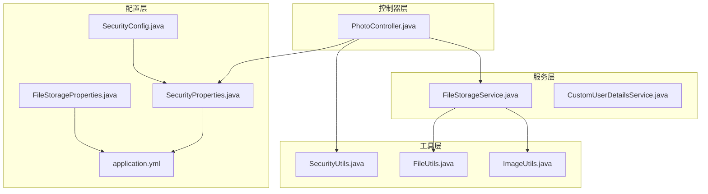
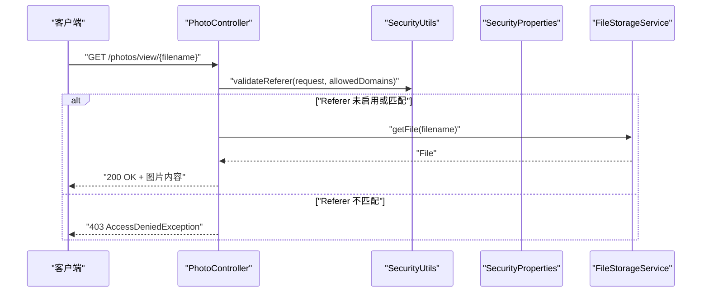
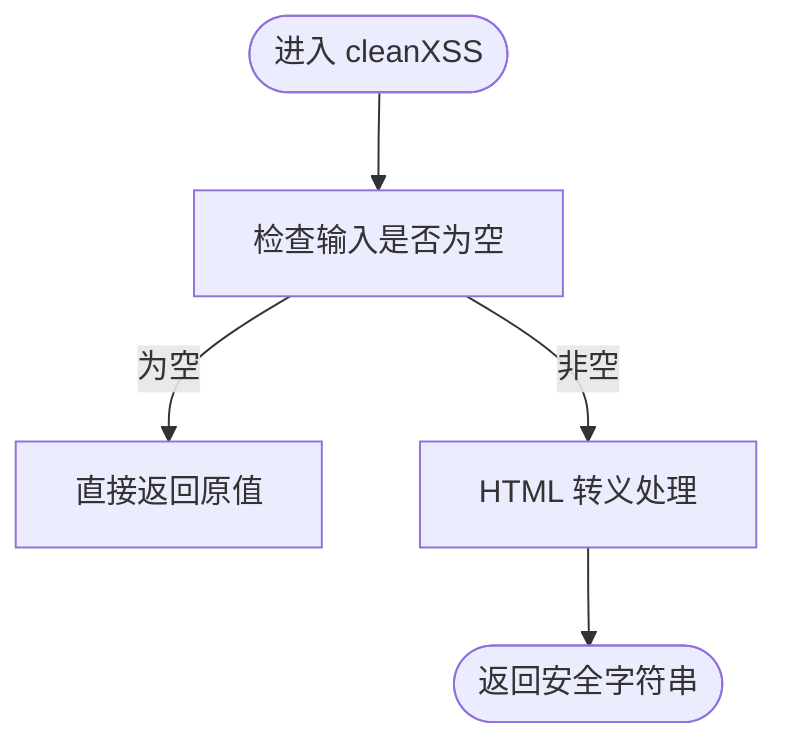
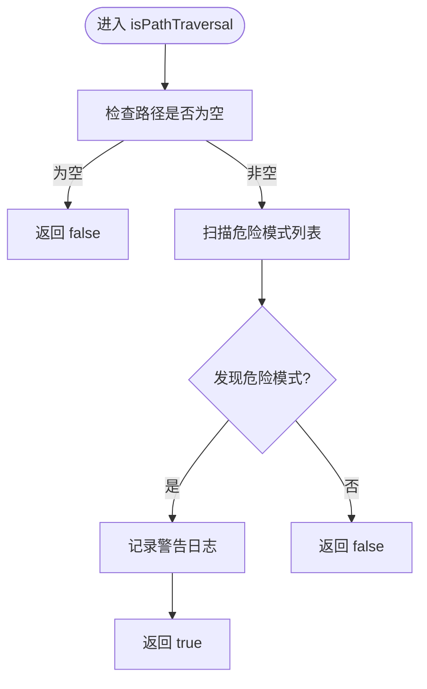
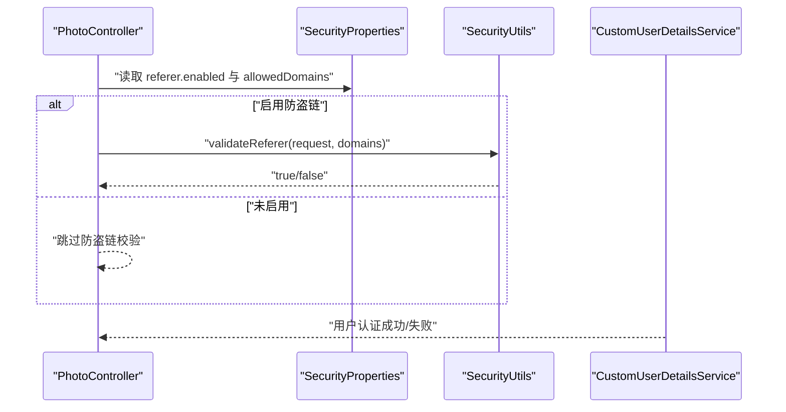
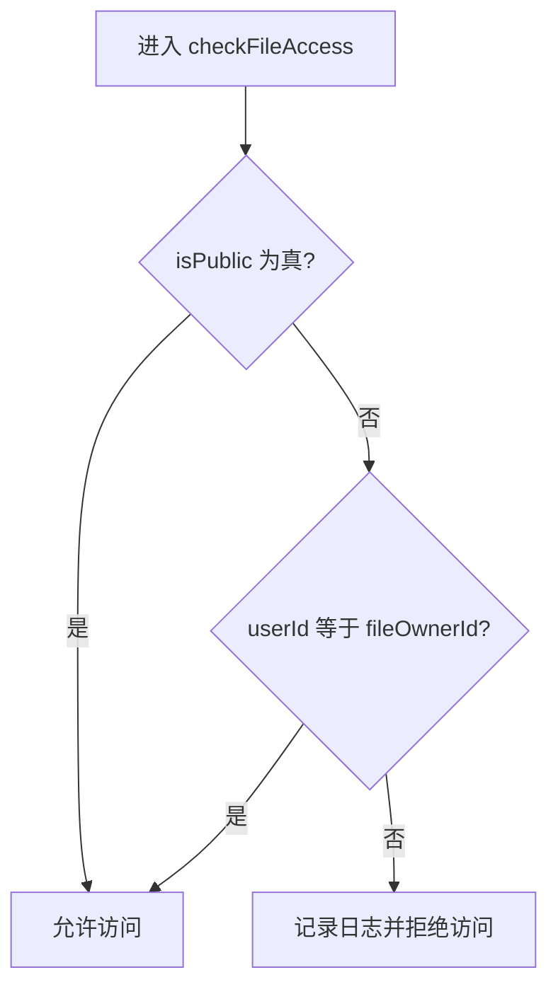
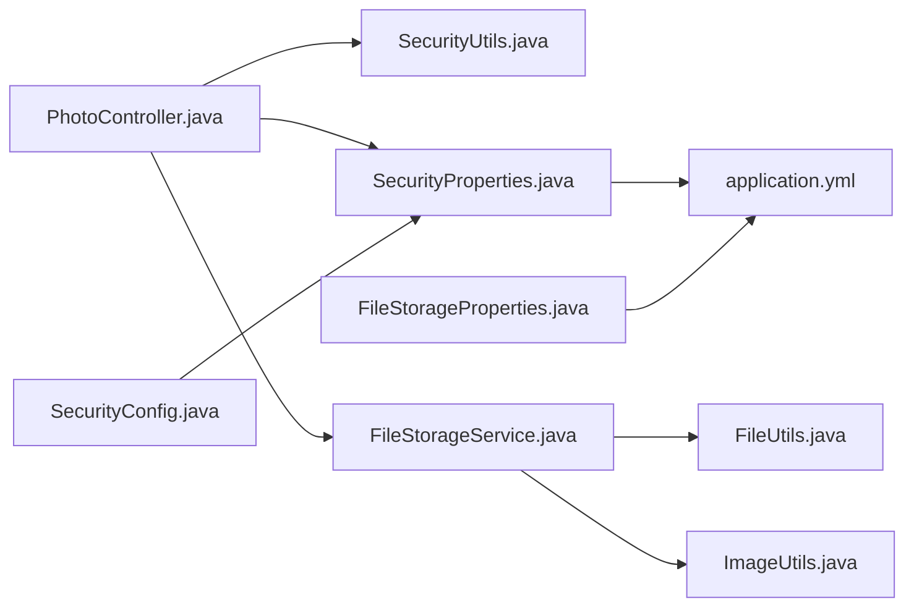

# 安全工具

<cite>
**本文引用的文件**
- [SecurityUtils.java](file://src/main/java/com/photo/util/SecurityUtils.java)
- [SecurityUtilsTest.java](file://src/test/java/com/photo/util/SecurityUtilsTest.java)
- [SecurityConfig.java](file://src/main/java/com/photo/config/SecurityConfig.java)
- [SecurityProperties.java](file://src/main/java/com/photo/config/SecurityProperties.java)
- [FileStorageService.java](file://src/main/java/com/photo/service/FileStorageService.java)
- [FileUtils.java](file://src/main/java/com/photo/util/FileUtils.java)
- [PhotoController.java](file://src/main/java/com/photo/controller/PhotoController.java)
- [FileStorageProperties.java](file://src/main/java/com/photo/config/FileStorageProperties.java)
- [application.yml](file://src/main/resources/application.yml)
- [AccessDeniedException.java](file://src/main/java/com/photo/exception/AccessDeniedException.java)
- [ImageUtils.java](file://src/main/java/com/photo/util/ImageUtils.java)
- [CustomUserDetailsService.java](file://src/main/java/com/photo/service/CustomUserDetailsService.java)
</cite>

## 目录
1. [简介](#简介)
2. [项目结构](#项目结构)
3. [核心组件](#核心组件)
4. [架构总览](#架构总览)
5. [详细组件分析](#详细组件分析)
6. [依赖关系分析](#依赖关系分析)
7. [性能考量](#性能考量)
8. [故障排查指南](#故障排查指南)
9. [结论](#结论)
10. [附录](#附录)

## 简介
本文件系统性梳理并文档化项目中的安全工具，重点围绕 SecurityUtils 类的安全防护能力展开，涵盖以下方面：
- XSS 防护：输入验证、输出编码、脚本过滤
- 路径遍历攻击防护：文件路径验证、目录访问控制、安全文件名处理
- 权限验证：用户身份验证、访问控制、会话管理
- 实战应用：文件上传、下载、管理操作中的安全验证场景
- 配置选项与扩展：安全配置项、自定义扩展方法
- 参考与集成：实用的安全防护函数清单与集成指南

## 项目结构
项目采用分层架构，安全工具位于 util 层，控制器层在需要时调用安全工具进行防护；配置层提供安全策略参数；服务层负责业务逻辑与文件存储。

图表来源
- [SecurityUtils.java](file://src/main/java/com/photo/util/SecurityUtils.java#L1-L167)
- [SecurityConfig.java](file://src/main/java/com/photo/config/SecurityConfig.java#L1-L99)
- [SecurityProperties.java](file://src/main/java/com/photo/config/SecurityProperties.java#L1-L53)
- [FileStorageService.java](file://src/main/java/com/photo/service/FileStorageService.java#L1-L300)
- [FileUtils.java](file://src/main/java/com/photo/util/FileUtils.java#L1-L178)
- [PhotoController.java](file://src/main/java/com/photo/controller/PhotoController.java#L1-L316)
- [FileStorageProperties.java](file://src/main/java/com/photo/config/FileStorageProperties.java#L1-L94)
- [application.yml](file://src/main/resources/application.yml#L1-L190)

章节来源
- [SecurityUtils.java](file://src/main/java/com/photo/util/SecurityUtils.java#L1-L167)
- [PhotoController.java](file://src/main/java/com/photo/controller/PhotoController.java#L1-L316)

## 核心组件
本节聚焦 SecurityUtils 的核心安全能力与使用方式，并结合控制器与配置层展示如何在实际业务中落地。

- XSS 防护
  - 输入验证：对空值进行快速短路，避免无意义处理
  - 输出编码：使用 HTML 转义工具对潜在危险字符进行编码
  - 脚本过滤：提供 SQL 注入清洗示例（仅作演示，生产建议使用参数化查询）
- 路径遍历攻击防护
  - 路径检测：识别常见路径遍历模式（如 ..、./、%2e%2e 等），记录日志并返回阻断
  - 文件名安全：提供安全文件名清洗与合法性校验
- 权限验证
  - Referer 防盗链：基于白名单域名匹配，未设置时默认放行
  - User-Agent 校验：对缺失 UA 的请求进行告警
  - Token 生成与校验：提供简单 Token 生成与长度校验（生产建议使用 JWT）
  - IP 获取：多代理场景下提取真实客户端 IP
- 文件访问控制
  - 公开/私有文件区分：公开文件可访问，私有文件需所有者或管理员授权
  - 与控制器结合：在资源访问接口中进行权限判定

章节来源
- [SecurityUtils.java](file://src/main/java/com/photo/util/SecurityUtils.java#L17-L165)
- [SecurityUtilsTest.java](file://src/test/java/com/photo/util/SecurityUtilsTest.java#L1-L162)
- [PhotoController.java](file://src/main/java/com/photo/controller/PhotoController.java#L84-L117)
- [FileUtils.java](file://src/main/java/com/photo/util/FileUtils.java#L155-L176)

## 架构总览
SecurityUtils 作为横切关注点，被控制器层在关键入口处调用，配合 Spring Security 配置与安全属性完成端到端防护。

图表来源
- [PhotoController.java](file://src/main/java/com/photo/controller/PhotoController.java#L84-L117)
- [SecurityUtils.java](file://src/main/java/com/photo/util/SecurityUtils.java#L62-L79)
- [SecurityProperties.java](file://src/main/java/com/photo/config/SecurityProperties.java#L18-L36)

## 详细组件分析

### XSS 防护流程
XSS 防护通过输入验证与输出编码实现，确保用户输入在渲染到页面前被安全处理。

图表来源
- [SecurityUtils.java](file://src/main/java/com/photo/util/SecurityUtils.java#L20-L25)

章节来源
- [SecurityUtils.java](file://src/main/java/com/photo/util/SecurityUtils.java#L17-L25)
- [SecurityUtilsTest.java](file://src/test/java/com/photo/util/SecurityUtilsTest.java#L17-L28)

### 路径遍历攻击防护
路径遍历检测通过识别常见危险模式，阻断潜在攻击并记录日志。

图表来源
- [SecurityUtils.java](file://src/main/java/com/photo/util/SecurityUtils.java#L133-L147)

章节来源
- [SecurityUtils.java](file://src/main/java/com/photo/util/SecurityUtils.java#L130-L147)
- [SecurityUtilsTest.java](file://src/test/java/com/photo/util/SecurityUtilsTest.java#L98-L107)
- [FileUtils.java](file://src/main/java/com/photo/util/FileUtils.java#L155-L176)

### 权限验证与会话管理
- Referer 防盗链：在控制器中按需启用，基于白名单域名匹配
- IP 获取：多代理场景下优先从标准头部提取真实 IP
- Token：提供生成与校验（生产建议升级为 JWT）
- 用户认证：基于 Spring Security 的自定义用户详情服务

图表来源
- [PhotoController.java](file://src/main/java/com/photo/controller/PhotoController.java#L92-L97)
- [SecurityUtils.java](file://src/main/java/com/photo/util/SecurityUtils.java#L62-L79)
- [SecurityProperties.java](file://src/main/java/com/photo/config/SecurityProperties.java#L18-L36)
- [CustomUserDetailsService.java](file://src/main/java/com/photo/service/CustomUserDetailsService.java#L27-L41)

章节来源
- [SecurityUtils.java](file://src/main/java/com/photo/util/SecurityUtils.java#L62-L95)
- [SecurityConfig.java](file://src/main/java/com/photo/config/SecurityConfig.java#L36-L58)
- [SecurityProperties.java](file://src/main/java/com/photo/config/SecurityProperties.java#L18-L51)

### 文件访问控制与控制器集成
- 公开/私有文件：通过布尔标志区分访问权限
- 控制器侧：在资源访问接口中调用权限判定
- 异常处理：非法来源触发访问拒绝异常

图表来源
- [SecurityUtils.java](file://src/main/java/com/photo/util/SecurityUtils.java#L152-L165)

章节来源
- [SecurityUtils.java](file://src/main/java/com/photo/util/SecurityUtils.java#L150-L165)
- [PhotoController.java](file://src/main/java/com/photo/controller/PhotoController.java#L92-L97)
- [AccessDeniedException.java](file://src/main/java/com/photo/exception/AccessDeniedException.java#L1-L16)

## 依赖关系分析
SecurityUtils 与控制器、配置、服务层存在明确的依赖关系，形成“控制器-工具-配置-服务”的调用链。

图表来源
- [PhotoController.java](file://src/main/java/com/photo/controller/PhotoController.java#L1-L316)
- [SecurityUtils.java](file://src/main/java/com/photo/util/SecurityUtils.java#L1-L167)
- [SecurityConfig.java](file://src/main/java/com/photo/config/SecurityConfig.java#L1-L99)
- [SecurityProperties.java](file://src/main/java/com/photo/config/SecurityProperties.java#L1-L53)
- [FileStorageService.java](file://src/main/java/com/photo/service/FileStorageService.java#L1-L300)
- [FileUtils.java](file://src/main/java/com/photo/util/FileUtils.java#L1-L178)
- [ImageUtils.java](file://src/main/java/com/photo/util/ImageUtils.java#L1-L182)
- [FileStorageProperties.java](file://src/main/java/com/photo/config/FileStorageProperties.java#L1-L94)
- [application.yml](file://src/main/resources/application.yml#L1-L190)

章节来源
- [PhotoController.java](file://src/main/java/com/photo/controller/PhotoController.java#L1-L316)
- [SecurityUtils.java](file://src/main/java/com/photo/util/SecurityUtils.java#L1-L167)
- [SecurityConfig.java](file://src/main/java/com/photo/config/SecurityConfig.java#L1-L99)

## 性能考量
- XSS 清洗：HTML 转义为 O(n) 操作，对小文本影响可忽略；建议在高频渲染前统一处理
- 路径遍历检测：扫描固定模式列表，复杂度低；建议在文件名解析阶段尽早执行
- Referer 校验：字符串匹配成本低；建议缓存白名单域名集合
- IP 提取：遍历少量头部字段，性能开销极小
- 文件访问控制：内存判断，几乎无额外开销
- 生产建议：对高并发场景，建议在网关层或过滤器中集中处理 Referer、UA、IP 等通用安全检查，减少重复计算

## 故障排查指南
- XSS 清洗未生效
  - 检查输入是否为空，空值会被直接返回
  - 确认输出渲染是否再次解码
  - 参考路径：[SecurityUtils.java](file://src/main/java/com/photo/util/SecurityUtils.java#L20-L25)
- 路径遍历攻击被误报
  - 确认文件名是否包含危险模式
  - 使用安全文件名清洗函数
  - 参考路径：[FileUtils.java](file://src/main/java/com/photo/util/FileUtils.java#L155-L176)
- 防盗链误拦截
  - 检查 allowed-domains 是否包含当前域名
  - 确认 Referer 头部是否正确传递
  - 参考路径：[SecurityProperties.java](file://src/main/java/com/photo/config/SecurityProperties.java#L18-L36)
- 访问被拒绝
  - 检查用户是否已登录且账户状态正常
  - 确认资源是否为公开资源或具备访问权限
  - 参考路径：[AccessDeniedException.java](file://src/main/java/com/photo/exception/AccessDeniedException.java#L1-L16)
- Token 校验失败
  - 确认 Token 长度与格式
  - 生产建议：升级为 JWT 并使用签名验证
  - 参考路径：[SecurityUtils.java](file://src/main/java/com/photo/util/SecurityUtils.java#L108-L111)

章节来源
- [SecurityUtils.java](file://src/main/java/com/photo/util/SecurityUtils.java#L20-L111)
- [FileUtils.java](file://src/main/java/com/photo/util/FileUtils.java#L155-L176)
- [SecurityProperties.java](file://src/main/java/com/photo/config/SecurityProperties.java#L18-L36)
- [AccessDeniedException.java](file://src/main/java/com/photo/exception/AccessDeniedException.java#L1-L16)

## 结论
SecurityUtils 提供了基础而关键的安全能力，覆盖 XSS、路径遍历、防盗链、IP 获取、Token 管理与文件访问控制等场景。结合 Spring Security 配置与控制器层的集成，可在上传、下载、管理等操作中构建完整的安全防线。建议在生产环境中进一步强化认证与授权机制（如引入 JWT）、完善日志审计与告警策略，并持续评估与优化安全策略。

## 附录

### 安全工具函数参考（路径定位）
- XSS 清洗：[SecurityUtils.cleanXSS](file://src/main/java/com/photo/util/SecurityUtils.java#L20-L25)
- 路径遍历检测：[SecurityUtils.isPathTraversal](file://src/main/java/com/photo/util/SecurityUtils.java#L133-L147)
- 防盗链校验：[SecurityUtils.validateReferer](file://src/main/java/com/photo/util/SecurityUtils.java#L62-L79)
- IP 获取：[SecurityUtils.getClientIpAddress](file://src/main/java/com/photo/util/SecurityUtils.java#L30-L57)
- Token 生成/校验：[SecurityUtils.generateToken](file://src/main/java/com/photo/util/SecurityUtils.java#L100-L111)
- 文件访问控制：[SecurityUtils.checkFileAccess](file://src/main/java/com/photo/util/SecurityUtils.java#L152-L165)
- SQL 注入清洗（示例）：[SecurityUtils.cleanSQLInjection](file://src/main/java/com/photo/util/SecurityUtils.java#L116-L128)

### 配置项与扩展
- 安全配置（application.yml）
  - 防盗链开关与域名白名单：[application.yml](file://src/main/resources/application.yml#L120-L127)
  - Token 密钥与过期时间：[application.yml](file://src/main/resources/application.yml#L127-L131)
  - CORS 开关与允许项：[application.yml](file://src/main/resources/application.yml#L131-L144)
- 安全属性模型
  - Referer/Token/CORS 配置类：[SecurityProperties.java](file://src/main/java/com/photo/config/SecurityProperties.java#L18-L51)
- 文件存储与安全
  - 文件名校验与清洗：[FileUtils.java](file://src/main/java/com/photo/util/FileUtils.java#L155-L176)
  - 存储路径规范化与安全写入：[FileStorageService.java](file://src/main/java/com/photo/service/FileStorageService.java#L75-L82)

### 最佳实践与使用示例（路径指引）
- 在控制器中启用防盗链
  - 示例路径：[PhotoController.viewPhoto](file://src/main/java/com/photo/controller/PhotoController.java#L92-L97)
- 文件上传安全
  - 文件名校验与唯一化：[FileStorageService.storeFile](file://src/main/java/com/photo/service/FileStorageService.java#L60-L64)
  - MIME 类型与扩展名双重校验：[FileUtils.validateFileType](file://src/main/java/com/photo/util/FileUtils.java#L84-L102)
- 文件下载安全
  - 断点续传 Range 解析与边界校验：[PhotoController.downloadPhotoWithRange](file://src/main/java/com/photo/controller/PhotoController.java#L184-L225)
- 权限验证集成
  - 用户认证与授权：[CustomUserDetailsService.loadUserByUsername](file://src/main/java/com/photo/service/CustomUserDetailsService.java#L27-L41)
  - 会话上下文：[SecurityConfig.filterChain](file://src/main/java/com/photo/config/SecurityConfig.java#L36-L58)