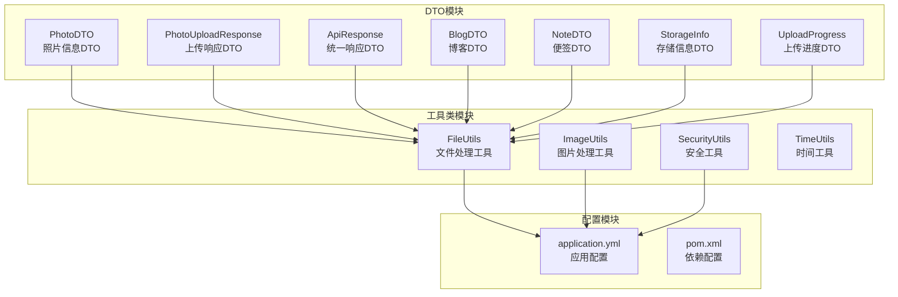
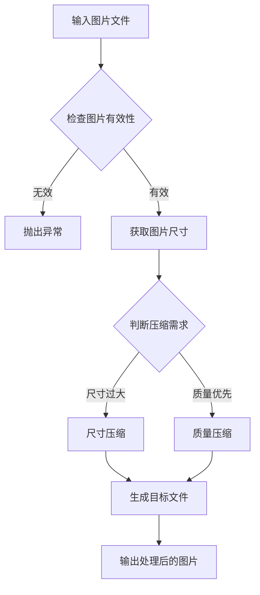
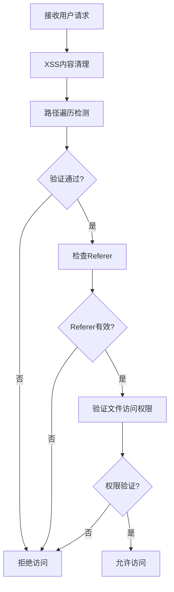
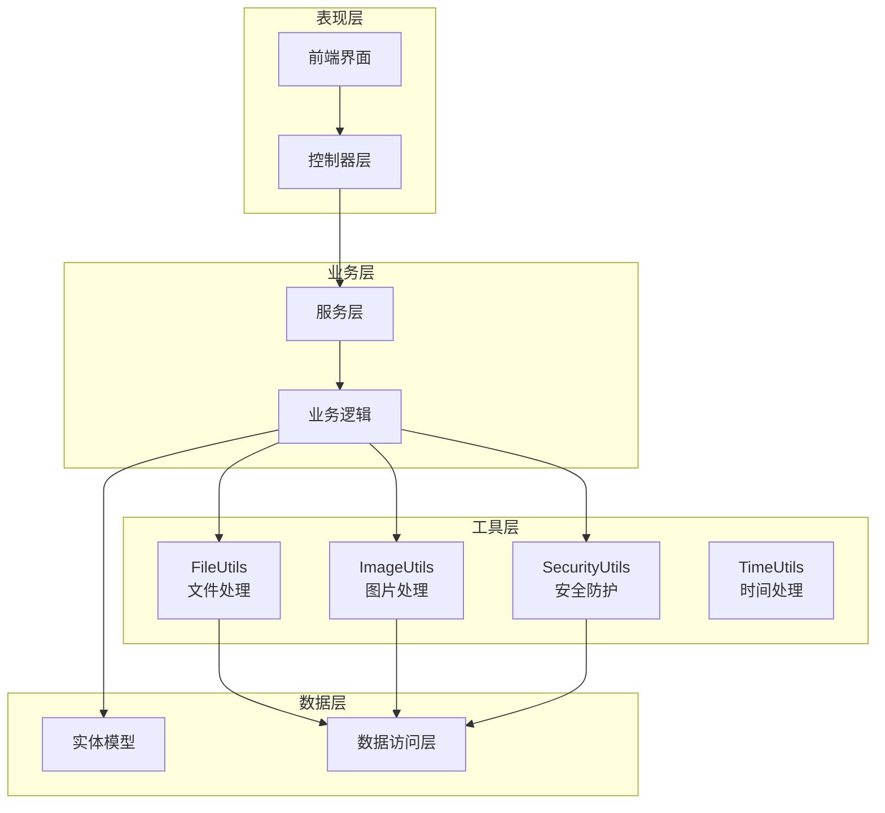
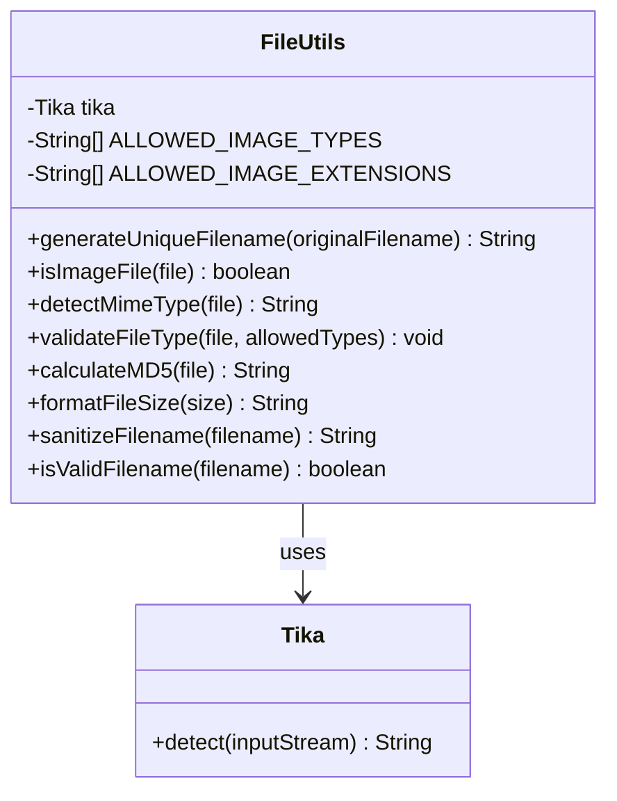
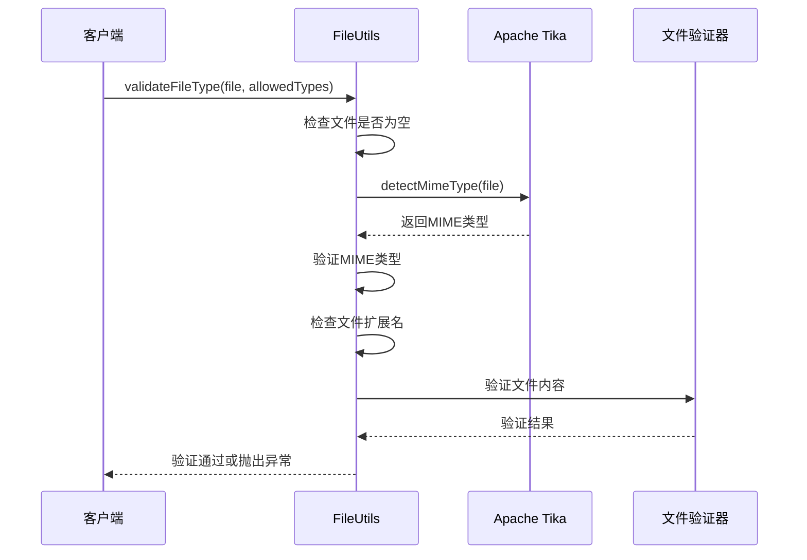
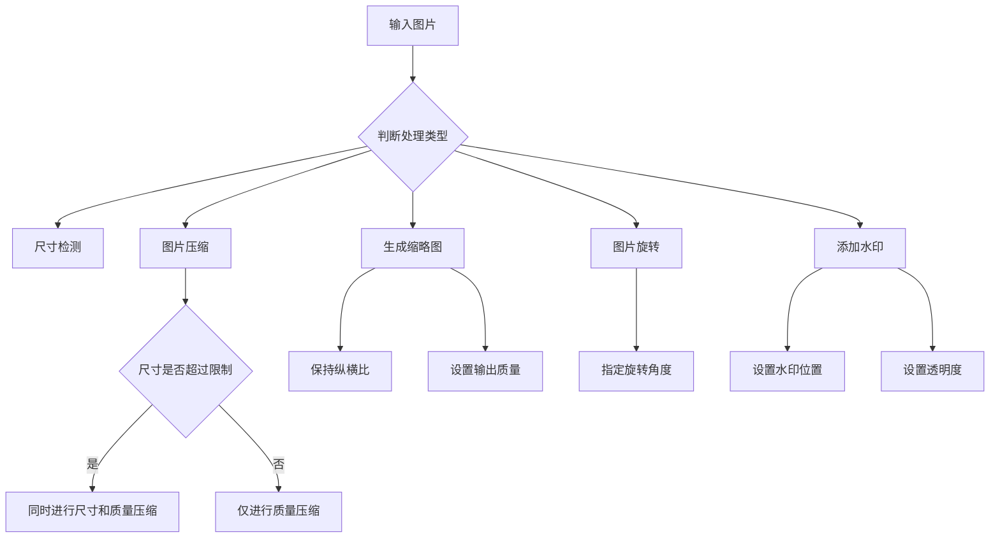
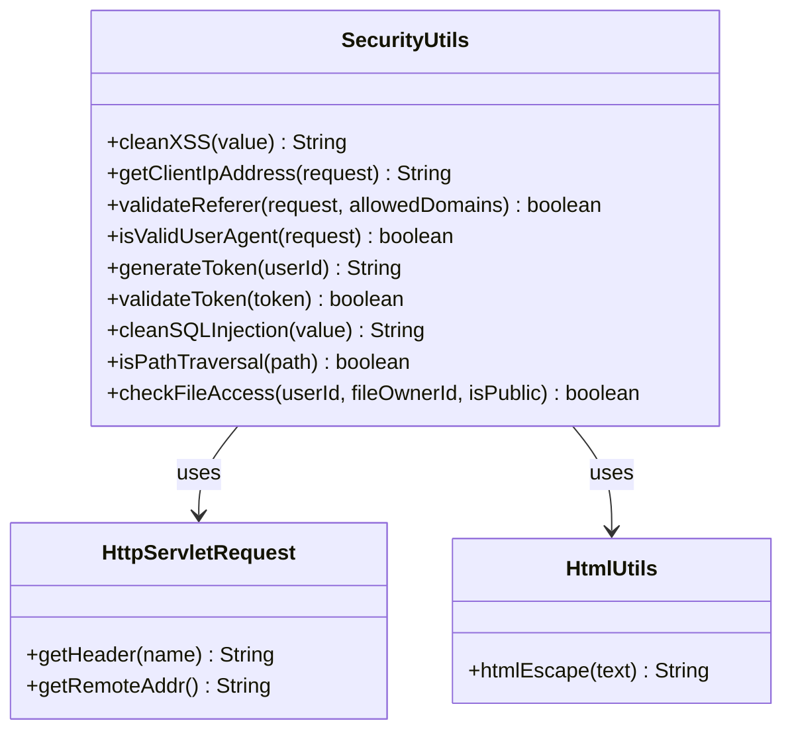
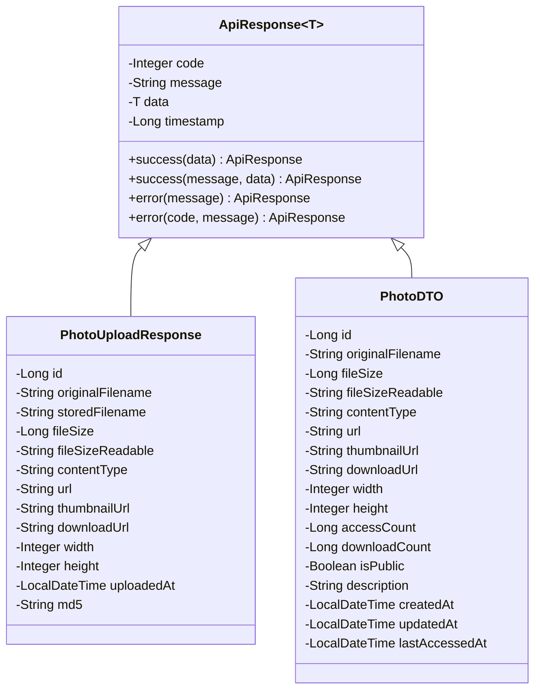
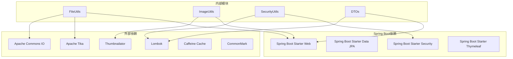

# 工具类和辅助功能

<cite>
**本文档引用的文件**
- [FileUtils.java](file://src/main/java/com/photo/util/FileUtils.java)
- [ImageUtils.java](file://src/main/java/com/photo/util/ImageUtils.java)
- [SecurityUtils.java](file://src/main/java/com/photo/util/SecurityUtils.java)
- [PhotoDTO.java](file://src/main/java/com/photo/dto/PhotoDTO.java)
- [PhotoUploadResponse.java](file://src/main/java/com/photo/dto/PhotoUploadResponse.java)
- [ApiResponse.java](file://src/main/java/com/photo/dto/ApiResponse.java)
- [BlogDTO.java](file://src/main/java/com/photo/dto/BlogDTO.java)
- [NoteDTO.java](file://src/main/java/com/photo/dto/NoteDTO.java)
- [StorageInfo.java](file://src/main/java/com/photo/dto/StorageInfo.java)
- [UploadProgress.java](file://src/main/java/com/photo/dto/UploadProgress.java)
- [FileUtilsTest.java](file://src/test/java/com/photo/util/FileUtilsTest.java)
- [SecurityUtilsTest.java](file://src/test/java/com/photo/util/SecurityUtilsTest.java)
- [application.yml](file://src/main/resources/application.yml)
- [pom.xml](file://pom.xml)
</cite>

## 目录
1. [简介](#简介)
2. [项目结构](#项目结构)
3. [核心组件](#核心组件)
4. [架构概览](#架构概览)
5. [详细组件分析](#详细组件分析)
6. [依赖关系分析](#依赖关系分析)
7. [性能考虑](#性能考虑)
8. [故障排除指南](#故障排除指南)
9. [结论](#结论)
10. [附录](#附录)

## 简介

本文件详细介绍了照片上传下载系统中的工具类和辅助功能模块。该系统采用Spring Boot框架构建，提供了完整的文件处理、图片处理和安全防护功能。本文档重点分析以下核心工具类：

- **文件处理工具**：负责文件验证、安全处理、路径管理和格式转换
- **图片处理工具**：提供图片压缩、缩略图生成、格式转换等图像处理能力
- **安全工具**：实现XSS防护、路径遍历防护、权限验证等安全功能
- **数据传输对象(DTO)**：设计统一的数据传输格式，便于前后端交互

## 项目结构

系统采用标准的Spring Boot项目结构，工具类主要位于`src/main/java/com/photo/util/`目录下，DTO对象位于`src/main/java/com/photo/dto/`目录下。



**图表来源**
- [FileUtils.java](file://src/main/java/com/photo/util/FileUtils.java#L1-L178)
- [ImageUtils.java](file://src/main/java/com/photo/util/ImageUtils.java#L1-L182)
- [SecurityUtils.java](file://src/main/java/com/photo/util/SecurityUtils.java#L1-L167)

**章节来源**
- [application.yml](file://src/main/resources/application.yml#L1-L190)
- [pom.xml](file://pom.xml#L1-L169)

## 核心组件

### 文件处理工具 (FileUtils)

FileUtils类提供了完整的文件处理功能，包括文件验证、安全处理、路径管理和格式转换等核心能力。

#### 主要功能特性

1. **文件类型验证**：支持多种图片格式的MIME类型检测
2. **文件名安全处理**：防止路径遍历攻击的安全文件名清理
3. **文件格式化**：提供人类可读的文件大小格式化
4. **MD5校验**：支持文件内容的MD5哈希计算

#### 关键方法概览

- `generateUniqueFilename()`: 生成唯一文件名
- `isImageFile()`: 验证是否为图片文件
- `detectMimeType()`: 检测文件MIME类型
- `calculateMD5()`: 计算文件MD5值
- `formatFileSize()`: 格式化文件大小
- `sanitizeFilename()`: 清理文件名安全性

**章节来源**
- [FileUtils.java](file://src/main/java/com/photo/util/FileUtils.java#L16-L178)

### 图片处理工具 (ImageUtils)

ImageUtils类专注于图片处理功能，提供了丰富的图像处理能力，包括尺寸获取、压缩、缩略图生成、旋转和水印添加等。

#### 支持的图片处理功能

1. **尺寸检测**：获取图片的宽度和高度
2. **图片压缩**：支持质量压缩和尺寸压缩
3. **缩略图生成**：按指定尺寸生成缩略图
4. **图片旋转**：支持任意角度的图片旋转
5. **水印添加**：支持透明度控制的水印效果

#### 图片处理流程



**图表来源**
- [ImageUtils.java](file://src/main/java/com/photo/util/ImageUtils.java#L70-L99)

**章节来源**
- [ImageUtils.java](file://src/main/java/com/photo/util/ImageUtils.java#L12-L182)

### 安全工具 (SecurityUtils)

SecurityUtils类实现了多层次的安全防护机制，包括XSS防护、路径遍历防护、权限验证和访问控制等功能。

#### 安全防护特性

1. **XSS防护**：HTML内容转义，防止跨站脚本攻击
2. **路径遍历防护**：检测和阻止路径遍历攻击
3. **Referer防盗链**：域名白名单验证
4. **IP地址获取**：支持多层代理的IP地址解析
5. **文件访问权限**：基于用户身份的文件访问控制

#### 安全验证流程



**图表来源**
- [SecurityUtils.java](file://src/main/java/com/photo/util/SecurityUtils.java#L13-L167)

**章节来源**
- [SecurityUtils.java](file://src/main/java/com/photo/util/SecurityUtils.java#L11-L167)

### 数据传输对象 (DTO)

系统提供了多种DTO类，用于规范前后端数据传输格式，确保数据的一致性和完整性。

#### DTO类设计原则

1. **单一职责**：每个DTO专注于特定业务领域的数据传输
2. **数据封装**：提供统一的数据结构和访问接口
3. **类型安全**：使用强类型定义，避免运行时类型错误
4. **可扩展性**：支持未来功能的扩展和修改

#### 主要DTO类

- **PhotoDTO**：照片信息的标准传输格式
- **PhotoUploadResponse**：文件上传响应的标准格式
- **ApiResponse**：统一API响应格式
- **BlogDTO**：博客内容的传输格式
- **NoteDTO**：便签内容的传输格式
- **StorageInfo**：存储空间信息的传输格式
- **UploadProgress**：文件上传进度的传输格式

**章节来源**
- [PhotoDTO.java](file://src/main/java/com/photo/dto/PhotoDTO.java#L10-L104)
- [PhotoUploadResponse.java](file://src/main/java/com/photo/dto/PhotoUploadResponse.java#L10-L84)
- [ApiResponse.java](file://src/main/java/com/photo/dto/ApiResponse.java#L7-L63)

## 架构概览

系统采用分层架构设计，工具类作为支撑层为上层业务逻辑提供基础功能。



**图表来源**
- [FileUtils.java](file://src/main/java/com/photo/util/FileUtils.java#L19-L178)
- [ImageUtils.java](file://src/main/java/com/photo/util/ImageUtils.java#L15-L182)
- [SecurityUtils.java](file://src/main/java/com/photo/util/SecurityUtils.java#L14-L167)

## 详细组件分析

### FileUtils组件详细分析

FileUtils类实现了文件处理的核心功能，具有以下特点：

#### 文件验证机制



**图表来源**
- [FileUtils.java](file://src/main/java/com/photo/util/FileUtils.java#L19-L178)

#### 文件类型验证流程



**图表来源**
- [FileUtils.java](file://src/main/java/com/photo/util/FileUtils.java#L84-L102)

**章节来源**
- [FileUtils.java](file://src/main/java/com/photo/util/FileUtils.java#L23-L102)

### ImageUtils组件详细分析

ImageUtils类提供了专业的图片处理功能，支持多种图像处理算法。

#### 图片处理算法



**图表来源**
- [ImageUtils.java](file://src/main/java/com/photo/util/ImageUtils.java#L70-L180)

**章节来源**
- [ImageUtils.java](file://src/main/java/com/photo/util/ImageUtils.java#L18-L180)

### SecurityUtils组件详细分析

SecurityUtils类实现了多层次的安全防护机制，确保系统的安全性。

#### 安全防护策略



**图表来源**
- [SecurityUtils.java](file://src/main/java/com/photo/util/SecurityUtils.java#L14-L167)

**章节来源**
- [SecurityUtils.java](file://src/main/java/com/photo/util/SecurityUtils.java#L17-L167)

### DTO组件详细分析

系统提供了完整的DTO体系，确保数据传输的一致性和安全性。

#### DTO设计模式



**图表来源**
- [ApiResponse.java](file://src/main/java/com/photo/dto/ApiResponse.java#L13-L62)
- [PhotoDTO.java](file://src/main/java/com/photo/dto/PhotoDTO.java#L17-L103)
- [PhotoUploadResponse.java](file://src/main/java/com/photo/dto/PhotoUploadResponse.java#L17-L83)

**章节来源**
- [PhotoDTO.java](file://src/main/java/com/photo/dto/PhotoDTO.java#L10-L104)
- [PhotoUploadResponse.java](file://src/main/java/com/photo/dto/PhotoUploadResponse.java#L10-L84)
- [ApiResponse.java](file://src/main/java/com/photo/dto/ApiResponse.java#L7-L63)

## 依赖关系分析

系统依赖关系清晰，各模块职责明确，耦合度适中。



**图表来源**
- [pom.xml](file://pom.xml#L30-L150)

### 外部依赖分析

系统使用了多个成熟的开源库来增强功能：

1. **Apache Commons IO**：提供文件和流的通用操作
2. **Apache Tika**：用于文件类型自动检测
3. **Thumbnailator**：专业图片压缩和处理库
4. **Lombok**：简化Java代码，减少样板代码
5. **Caffeine**：高性能本地缓存

**章节来源**
- [pom.xml](file://pom.xml#L21-L28)
- [pom.xml](file://pom.xml#L88-L120)

## 性能考虑

系统在设计时充分考虑了性能优化，采用了多种性能提升策略：

### 缓存策略

- **本地缓存**：使用Caffeine实现高性能本地缓存
- **图片缓存**：缩略图和处理后的图片缓存
- **配置缓存**：文件类型配置和安全配置缓存

### 异步处理

- **文件上传异步**：支持多文件并发上传
- **图片处理异步**：后台处理图片压缩和缩略图生成
- **清理任务异步**：定期清理过期文件的任务

### 内存管理

- **流式处理**：大文件采用流式处理，避免内存溢出
- **临时文件管理**：合理管理临时文件生命周期
- **连接池配置**：数据库连接池和线程池优化

## 故障排除指南

### 常见问题及解决方案

#### 文件处理相关问题

1. **文件类型检测失败**
   - 检查文件是否损坏
   - 验证文件头信息
   - 确认Tika依赖版本

2. **文件名安全问题**
   - 检查文件名是否包含特殊字符
   - 验证路径遍历攻击
   - 确认文件系统权限

#### 图片处理相关问题

1. **图片压缩失败**
   - 检查图片格式是否受支持
   - 验证磁盘空间
   - 确认临时文件目录权限

2. **缩略图生成异常**
   - 检查目标尺寸参数
   - 验证输出目录权限
   - 确认内存充足

#### 安全相关问题

1. **XSS防护失效**
   - 检查输入数据是否正确清理
   - 验证安全配置
   - 确认依赖库版本

2. **路径遍历攻击**
   - 检查路径验证逻辑
   - 验证文件访问权限
   - 确认安全策略配置

**章节来源**
- [FileUtilsTest.java](file://src/test/java/com/photo/util/FileUtilsTest.java#L13-L98)
- [SecurityUtilsTest.java](file://src/test/java/com/photo/util/SecurityUtilsTest.java#L17-L162)

## 结论

该照片上传下载系统通过精心设计的工具类和辅助功能，提供了完整、安全、高效的文件处理解决方案。系统的主要优势包括：

1. **功能完整性**：涵盖了文件处理、图片处理、安全防护等核心功能
2. **安全性保障**：实现了多层次的安全防护机制
3. **性能优化**：采用了多种性能优化策略
4. **易于扩展**：模块化设计便于功能扩展和维护

建议在实际使用中：
- 根据具体需求调整配置参数
- 定期更新安全策略
- 监控系统性能指标
- 完善错误处理机制

## 附录

### 使用示例和最佳实践

#### 文件处理最佳实践

1. **文件上传流程**
   ```java
   // 1. 验证文件类型
   FileUtils.validateFileType(file, allowedTypes);
   
   // 2. 生成唯一文件名
   String uniqueName = FileUtils.generateUniqueFilename(originalFilename);
   
   // 3. 计算MD5值
   String md5 = FileUtils.calculateMD5(file);
   
   // 4. 保存文件
   saveFile(uniqueName, file);
   ```

2. **图片处理流程**
   ```java
   // 1. 验证图片有效性
   if (!ImageUtils.isValidImage(file)) {
       throw new FileStorageException("无效的图片文件");
   }
   
   // 2. 获取图片尺寸
   int[] dimensions = ImageUtils.getImageDimensions(file);
   
   // 3. 压缩图片
   ImageUtils.compressImage(file, targetFile, quality, maxWidth, maxHeight);
   
   // 4. 生成缩略图
   ImageUtils.createThumbnail(file, thumbFile, thumbWidth, thumbHeight);
   ```

#### 安全使用指南

1. **XSS防护**
   ```java
   // 对用户输入进行XSS清理
   String cleanInput = SecurityUtils.cleanXSS(userInput);
   ```

2. **文件访问控制**
   ```java
   // 验证文件访问权限
   if (!SecurityUtils.checkFileAccess(userId, ownerId, isPublic)) {
       throw new AccessDeniedException("无权访问此文件");
   }
   ```

#### 配置扩展

1. **自定义文件类型**
   ```yaml
   file:
     storage:
       allowed-types:
         - image/jpeg
         - image/png
         - image/webp
         - application/pdf  # 新增PDF支持
       allowed-extensions:
         - jpg
         - png
         - webp
         - pdf  # 新增PDF扩展名
   ```

2. **性能调优配置**
   ```yaml
   spring:
     servlet:
       multipart:
         max-file-size: 50MB    # 增加文件大小限制
         max-request-size: 200MB # 增加请求大小限制
   ```

### 扩展方法和自定义配置

#### 自定义工具类扩展

1. **添加新的文件格式支持**
   ```java
   // 在FileUtils中添加新的MIME类型
   private static final List<String> ALLOWED_IMAGE_TYPES = Arrays.asList(
       "image/jpeg", "image/jpg", "image/png", 
       "image/gif", "image/bmp", "image/webp",
       "image/heic"  // 新增HEIC格式
   );
   ```

2. **扩展图片处理功能**
   ```java
   // 添加图片滤镜功能
   public static void applyFilter(File sourceFile, File targetFile, FilterType filter) {
       // 实现滤镜处理逻辑
   }
   ```

#### 自定义配置选项

1. **存储配置扩展**
   ```yaml
   file:
     storage:
       # 自定义存储策略
       storage-strategy: distributed  # 分布式存储
       backup-enabled: true           # 启用备份
       retention-period: 365          # 保留365天
   ```

2. **安全配置扩展**
   ```yaml
   security:
     # 自定义安全策略
     rate-limiting:
       enabled: true
       requests-per-minute: 100
     audit-logging:
       enabled: true
       log-level: INFO
   ```