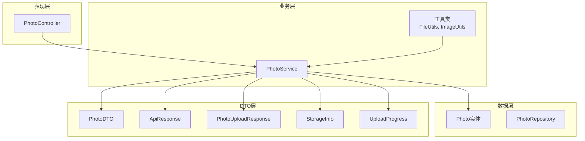
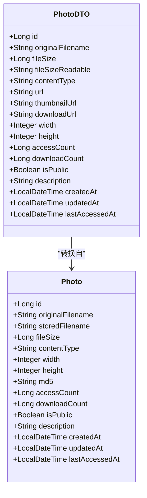
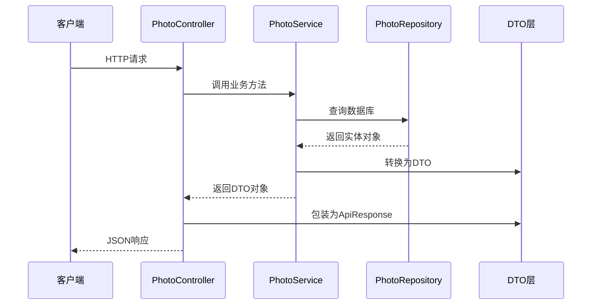
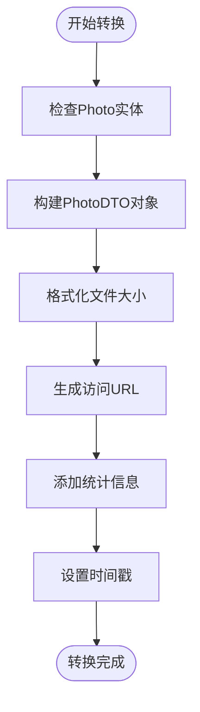
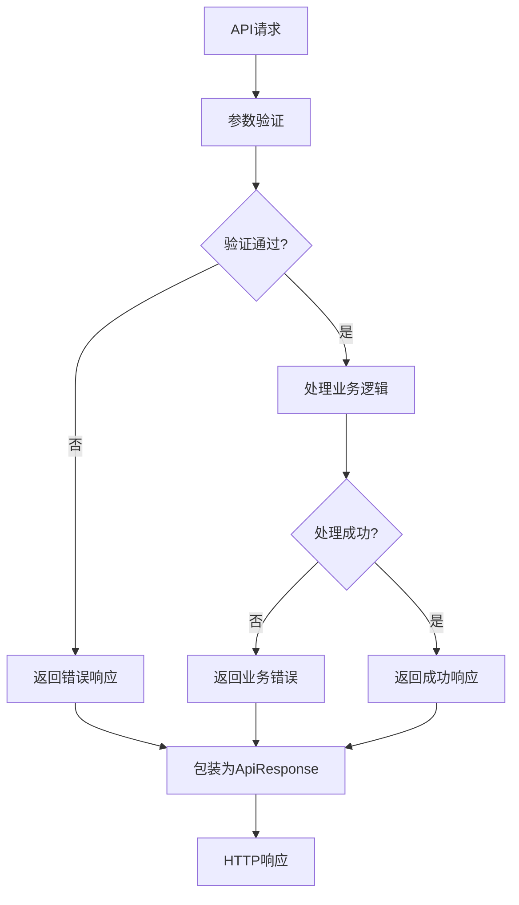
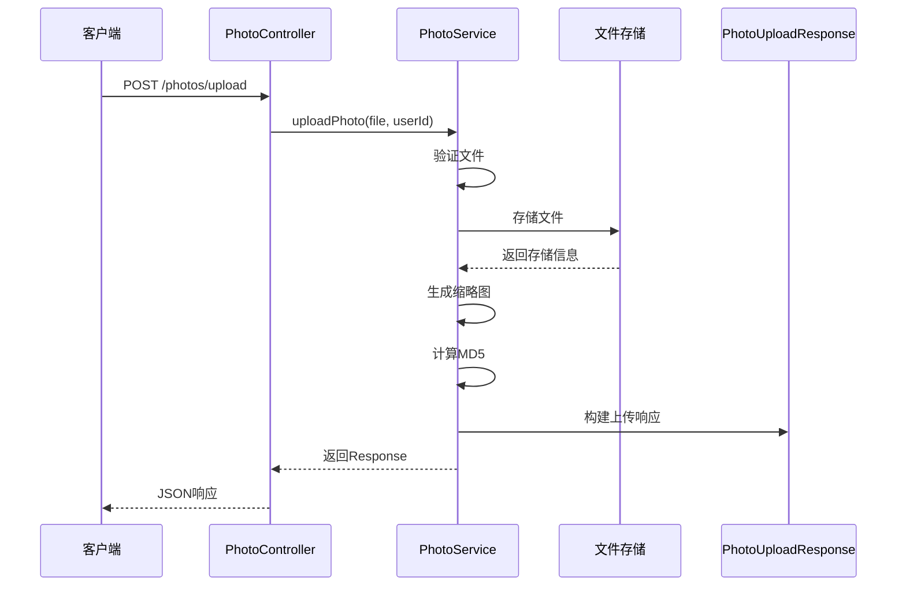
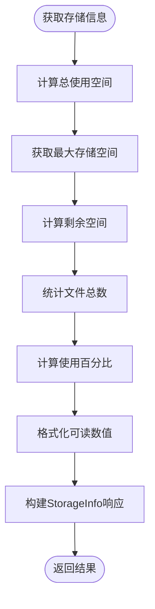
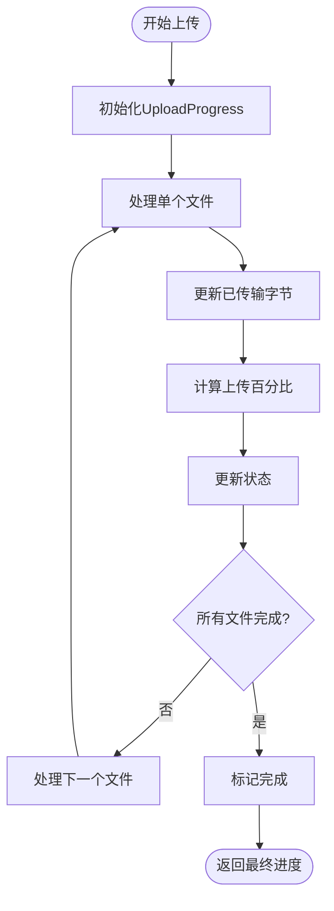
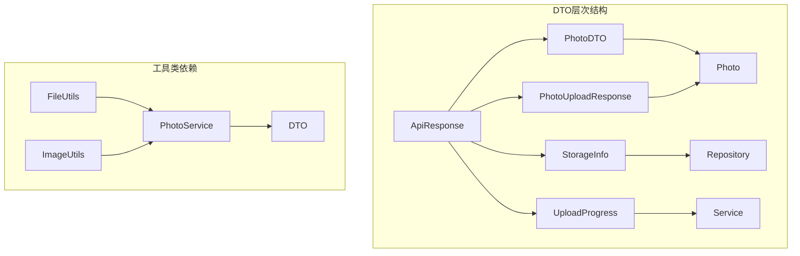

# 数据传输对象

<cite>
**本文档引用的文件**
- [PhotoDTO.java](file://src/main/java/com/photo/dto/PhotoDTO.java)
- [ApiResponse.java](file://src/main/java/com/photo/dto/ApiResponse.java)
- [PhotoUploadResponse.java](file://src/main/java/com/photo/dto/PhotoUploadResponse.java)
- [StorageInfo.java](file://src/main/java/com/photo/dto/StorageInfo.java)
- [UploadProgress.java](file://src/main/java/com/photo/dto/UploadProgress.java)
- [Photo.java](file://src/main/java/com/photo/entity/Photo.java)
- [PhotoController.java](file://src/main/java/com/photo/controller/PhotoController.java)
- [PhotoService.java](file://src/main/java/com/photo/service/PhotoService.java)
- [FileUtils.java](file://src/main/java/com/photo/util/FileUtils.java)
- [ImageUtils.java](file://src/main/java/com/photo/util/ImageUtils.java)
- [PhotoControllerTest.java](file://src/test/java/com/photo/controller/PhotoControllerTest.java)
- [PhotoServiceTest.java](file://src/test/java/com/photo/service/PhotoServiceTest.java)
</cite>

## 目录
1. [简介](#简介)
2. [项目结构](#项目结构)
3. [核心组件](#核心组件)
4. [架构概览](#架构概览)
5. [详细组件分析](#详细组件分析)
6. [依赖关系分析](#依赖关系分析)
7. [性能考虑](#性能考虑)
8. [故障排除指南](#故障排除指南)
9. [结论](#结论)
10. [附录](#附录)

## 简介

本文件详细介绍项目中的数据传输对象（DTO）设计与实现，涵盖以下核心DTO类：
- PhotoDTO：照片信息的数据传输对象
- ApiResponse：统一API响应格式
- PhotoUploadResponse：照片上传响应结构
- StorageInfo：存储信息模型
- UploadProgress：上传进度模型

这些DTO类在系统中承担着数据封装、接口标准化和前后端通信的关键作用，确保了系统的可维护性和扩展性。

## 项目结构

项目采用标准的Spring Boot三层架构，DTO层位于业务层与表现层之间，负责数据的序列化和反序列化。



**图表来源**
- [PhotoController.java](file://src/main/java/com/photo/controller/PhotoController.java#L1-L316)
- [PhotoService.java](file://src/main/java/com/photo/service/PhotoService.java#L1-L385)
- [PhotoDTO.java](file://src/main/java/com/photo/dto/PhotoDTO.java#L1-L104)
- [ApiResponse.java](file://src/main/java/com/photo/dto/ApiResponse.java#L1-L63)

**章节来源**
- [PhotoController.java](file://src/main/java/com/photo/controller/PhotoController.java#L1-L316)
- [PhotoService.java](file://src/main/java/com/photo/service/PhotoService.java#L1-L385)

## 核心组件

### PhotoDTO：照片信息数据传输对象

PhotoDTO是系统中最复杂的数据传输对象，用于封装照片的完整信息，支持前后端的数据交换。

#### 设计目的
- 封装照片的元数据信息
- 提供统一的数据格式用于API响应
- 支持缓存机制优化性能
- 包含完整的文件信息和访问统计

#### 结构特点
- **标识信息**：id、originalFilename
- **文件属性**：fileSize、fileSizeReadable、contentType、extension
- **媒体信息**：width、height、md5
- **访问统计**：accessCount、downloadCount、lastAccessedAt
- **可见性控制**：isPublic、description
- **时间戳**：createdAt、updatedAt

#### 关联关系


**图表来源**
- [PhotoDTO.java](file://src/main/java/com/photo/dto/PhotoDTO.java#L1-L104)
- [Photo.java](file://src/main/java/com/photo/entity/Photo.java#L1-L174)

**章节来源**
- [PhotoDTO.java](file://src/main/java/com/photo/dto/PhotoDTO.java#L1-L104)
- [Photo.java](file://src/main/java/com/photo/entity/Photo.java#L1-L174)

### ApiResponse：统一API响应格式

ApiResponse提供了标准化的API响应结构，确保所有HTTP响应具有一致的格式。

#### 设计目的
- 统一API响应格式
- 提供错误处理机制
- 支持泛型数据类型
- 包含时间戳便于调试

#### 核心结构
- **响应码**：code（默认200表示成功）
- **消息**：message（操作结果描述）
- **数据**：data（泛型数据内容）
- **时间戳**：timestamp（响应时间）

#### 静态工厂方法
- `success(data)`：成功响应，code=200
- `success(message, data)`：自定义成功消息
- `error(message)`：服务器错误，code=500
- `error(code, message)`：自定义错误码和消息

**章节来源**
- [ApiResponse.java](file://src/main/java/com/photo/dto/ApiResponse.java#L1-L63)

### PhotoUploadResponse：照片上传响应

PhotoUploadResponse专门用于照片上传后的响应数据封装。

#### 设计目的
- 提供上传完成后的详细信息
- 包含文件访问链接
- 支持批量上传场景

#### 关键字段
- **文件标识**：id、originalFilename、storedFilename
- **文件信息**：fileSize、fileSizeReadable、contentType、extension
- **访问链接**：url、thumbnailUrl、downloadUrl
- **元数据**：width、height、uploadedAt、md5

**章节来源**
- [PhotoUploadResponse.java](file://src/main/java/com/photo/dto/PhotoUploadResponse.java#L1-L84)

### StorageInfo：存储信息模型

StorageInfo用于封装存储空间的统计信息，为系统监控和管理提供数据支持。

#### 设计目的
- 提供存储空间使用情况统计
- 支持容量管理和告警
- 便于前端展示存储状态

#### 统计指标
- **空间使用**：usedSpace、usedSpaceReadable、usagePercentage
- **容量信息**：totalSpace、totalSpaceReadable、freeSpace、freeSpaceReadable
- **文件统计**：totalFiles

**章节来源**
- [StorageInfo.java](file://src/main/java/com/photo/dto/StorageInfo.java#L1-L57)

### UploadProgress：上传进度模型

UploadProgress用于实时跟踪文件上传进度，提供用户友好的反馈。

#### 设计目的
- 实时显示上传进度
- 支持多文件上传场景
- 提供状态变更通知

#### 进度信息
- **字节级进度**：bytesRead、totalBytes、percentage
- **文件级进度**：currentFileIndex、totalFiles
- **状态管理**：status（uploading、completed、failed）、message

**章节来源**
- [UploadProgress.java](file://src/main/java/com/photo/dto/UploadProgress.java#L1-L52)

## 架构概览

系统采用分层架构，DTO层作为数据传输的桥梁，连接表现层和业务层。



**图表来源**
- [PhotoController.java](file://src/main/java/com/photo/controller/PhotoController.java#L48-L61)
- [PhotoService.java](file://src/main/java/com/photo/service/PhotoService.java#L141-L151)
- [ApiResponse.java](file://src/main/java/com/photo/dto/ApiResponse.java#L38-L61)

## 详细组件分析

### PhotoDTO详细分析

#### 字段设计原则
- **可读性优先**：提供fileSizeReadable等人类可读格式
- **完整性**：包含文件访问所需的所有URL
- **统计信息**：集成访问和下载计数器
- **时间追踪**：记录最后访问时间

#### 转换流程


**图表来源**
- [PhotoService.java](file://src/main/java/com/photo/service/PhotoService.java#L362-L382)
- [FileUtils.java](file://src/main/java/com/photo/util/FileUtils.java#L142-L152)

**章节来源**
- [PhotoDTO.java](file://src/main/java/com/photo/dto/PhotoDTO.java#L1-L104)
- [PhotoService.java](file://src/main/java/com/photo/service/PhotoService.java#L362-L382)

### ApiResponse统一响应机制

#### 错误处理策略


**图表来源**
- [PhotoController.java](file://src/main/java/com/photo/controller/PhotoController.java#L50-L61)
- [PhotoService.java](file://src/main/java/com/photo/service/PhotoService.java#L107-L110)

#### 响应格式规范
- **成功响应**：code=200，message="操作成功"
- **自定义成功**：支持自定义成功消息
- **错误响应**：默认code=500，支持自定义错误码
- **时间戳**：自动记录响应时间

**章节来源**
- [ApiResponse.java](file://src/main/java/com/photo/dto/ApiResponse.java#L38-L61)
- [PhotoController.java](file://src/main/java/com/photo/controller/PhotoController.java#L50-L61)

### PhotoUploadResponse上传响应

#### 上传流程跟踪


**图表来源**
- [PhotoController.java](file://src/main/java/com/photo/controller/PhotoController.java#L48-L61)
- [PhotoService.java](file://src/main/java/com/photo/service/PhotoService.java#L50-L111)

**章节来源**
- [PhotoUploadResponse.java](file://src/main/java/com/photo/dto/PhotoUploadResponse.java#L1-L84)
- [PhotoService.java](file://src/main/java/com/photo/service/PhotoService.java#L50-L111)

### StorageInfo存储统计

#### 统计算法


**图表来源**
- [PhotoService.java](file://src/main/java/com/photo/service/PhotoService.java#L254-L271)
- [FileUtils.java](file://src/main/java/com/photo/util/FileUtils.java#L142-L152)

**章节来源**
- [StorageInfo.java](file://src/main/java/com/photo/dto/StorageInfo.java#L1-L57)
- [PhotoService.java](file://src/main/java/com/photo/service/PhotoService.java#L254-L271)

### UploadProgress进度跟踪

#### 进度计算逻辑


**图表来源**
- [UploadProgress.java](file://src/main/java/com/photo/dto/UploadProgress.java#L1-L52)

**章节来源**
- [UploadProgress.java](file://src/main/java/com/photo/dto/UploadProgress.java#L1-L52)

## 依赖关系分析

### DTO间依赖关系



**图表来源**
- [PhotoService.java](file://src/main/java/com/photo/service/PhotoService.java#L341-L382)
- [FileUtils.java](file://src/main/java/com/photo/util/FileUtils.java#L1-L178)
- [ImageUtils.java](file://src/main/java/com/photo/util/ImageUtils.java#L1-L182)

### 控制器集成

#### API端点与DTO映射
```mermaid
graph LR
subgraph "API端点"
Upload[POST /photos/upload]
BatchUpload[POST /photos/upload/batch]
GetPhoto[GET /photos/{id}]
GetUserPhotos[GET /photos/user/{userId}]
GetPublicPhotos[GET /photos/public]
SearchPhotos[GET /photos/search]
GetStorage[GET /photos/storage/info]
end
subgraph "DTO响应"
Upload --> UploadResponse[PhotoUploadResponse]
BatchUpload --> UploadResponseList[List<PhotoUploadResponse>]
GetPhoto --> PhotoDTO
GetUserPhotos --> PhotoDTOPage[Page<PhotoDTO>]
GetPublicPhotos --> PhotoDTOPage
SearchPhotos --> PhotoDTOPage
GetStorage --> StorageInfo
end
ApiResponse --> UploadResponse
ApiResponse --> PhotoDTO
ApiResponse --> StorageInfo
```

**图表来源**
- [PhotoController.java](file://src/main/java/com/photo/controller/PhotoController.java#L48-L314)

**章节来源**
- [PhotoController.java](file://src/main/java/com/photo/controller/PhotoController.java#L48-L314)

## 性能考虑

### 缓存策略
- **PhotoDTO缓存**：使用`@Cacheable`注解缓存照片信息，减少数据库查询
- **缓存失效**：删除操作时使用`@CacheEvict`清除相关缓存
- **缓存键设计**：基于照片ID的简单键值，提高缓存命中率

### 序列化优化
- **Lombok注解**：使用`@Data`、`@Builder`等注解减少样板代码
- **字段选择**：仅传输必要的字段，避免过度序列化
- **时间格式**：使用LocalDateTime保持时区一致性

### 内存管理
- **流式处理**：大文件上传使用流式处理避免内存溢出
- **批量操作**：支持批量上传减少网络往返
- **资源释放**：及时关闭文件流和数据库连接

## 故障排除指南

### 常见问题诊断

#### DTO转换错误
- **症状**：JSON序列化失败或字段缺失
- **原因**：缺少getter/setter方法或字段类型不匹配
- **解决方案**：确保使用Lombok注解正确生成访问器

#### API响应格式异常
- **症状**：客户端收到非预期的响应结构
- **原因**：ApiResponse使用不当或静态工厂方法调用错误
- **解决方案**：检查ApiResponse的静态工厂方法调用

#### 存储信息不准确
- **症状**：StorageInfo显示的使用量与实际不符
- **原因**：数据库统计查询错误或缓存未更新
- **解决方案**：检查Repository查询方法和缓存配置

**章节来源**
- [PhotoServiceTest.java](file://src/test/java/com/photo/service/PhotoServiceTest.java#L172-L186)
- [PhotoControllerTest.java](file://src/test/java/com/photo/controller/PhotoControllerTest.java#L84-L106)

## 结论

本项目的数据传输对象设计体现了以下优秀实践：

1. **清晰的职责分离**：每个DTO都有明确的设计目的和使用场景
2. **标准化的响应格式**：统一的ApiResponse确保了API的一致性
3. **完善的错误处理**：丰富的异常类型和错误响应机制
4. **性能优化考虑**：缓存策略和内存管理的综合考虑
5. **可扩展性设计**：模块化的架构便于功能扩展

这些DTO类不仅满足了当前的功能需求，还为未来的功能扩展和系统演进奠定了坚实的基础。

## 附录

### 使用示例

#### API响应使用
```java
// 成功响应
return ResponseEntity.ok(ApiResponse.success(photoDTO));

// 自定义消息
return ResponseEntity.ok(ApiResponse.success("上传成功", response));

// 错误响应
return ResponseEntity.status(404).body(ApiResponse.error("照片不存在"));
```

#### DTO转换示例
```java
// 单个转换
PhotoDTO dto = convertToDTO(photo);

// 批量转换
Page<PhotoDTO> dtoPage = photos.map(this::convertToDTO);
```

#### 测试用例参考
- [PhotoControllerTest.java](file://src/test/java/com/photo/controller/PhotoControllerTest.java#L84-L106)
- [PhotoServiceTest.java](file://src/test/java/com/photo/service/PhotoServiceTest.java#L172-L186)