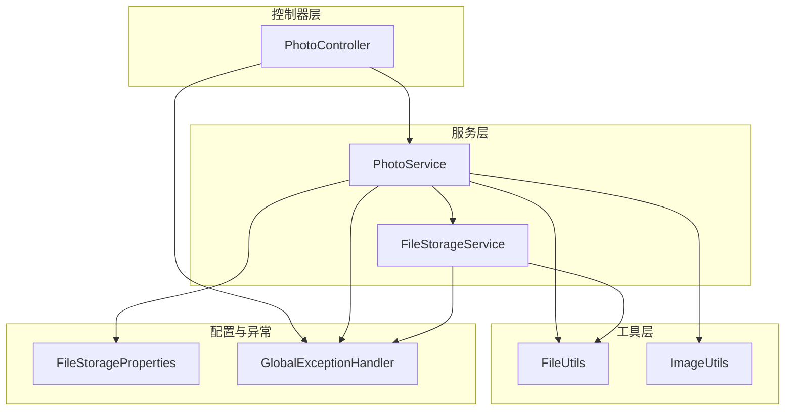
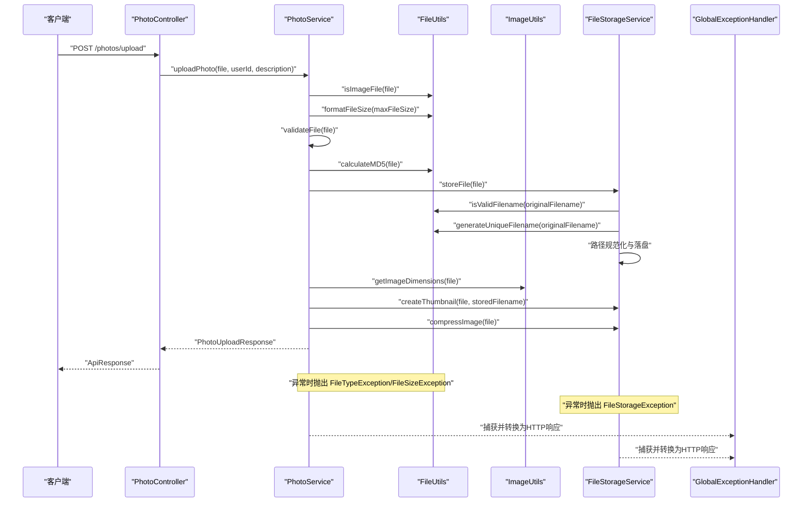
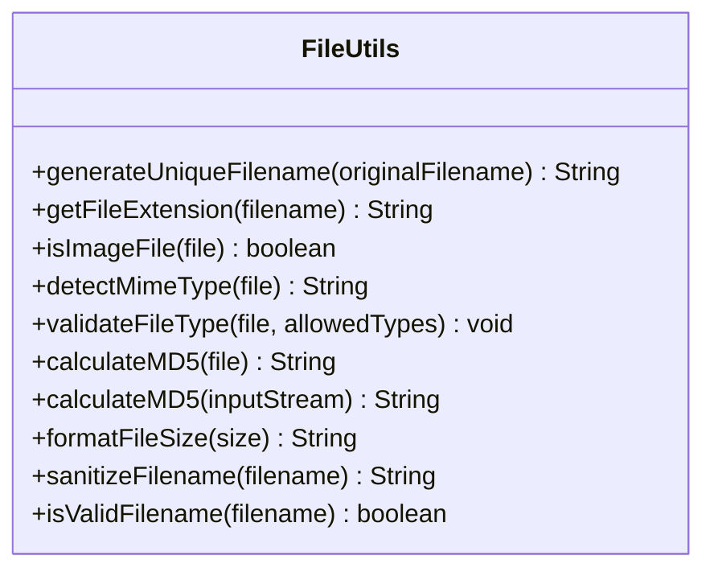
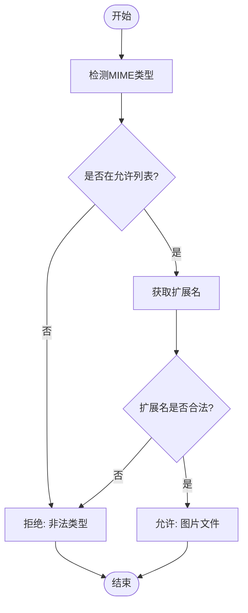
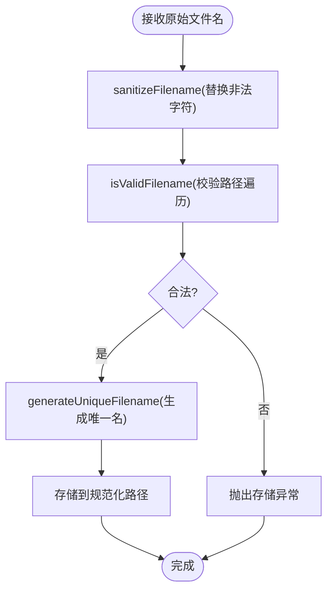
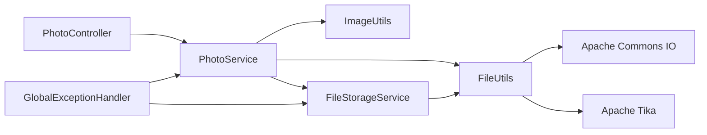

# 文件处理工具

<cite>
**本文引用的文件**
- [FileUtils.java](file://src/main/java/com/photo/util/FileUtils.java)
- [FileUtilsTest.java](file://src/test/java/com/photo/util/FileUtilsTest.java)
- [FileStorageService.java](file://src/main/java/com/photo/service/FileStorageService.java)
- [PhotoService.java](file://src/main/java/com/photo/service/PhotoService.java)
- [PhotoController.java](file://src/main/java/com/photo/controller/PhotoController.java)
- [FileStorageProperties.java](file://src/main/java/com/photo/config/FileStorageProperties.java)
- [application.yml](file://src/main/resources/application.yml)
- [ImageUtils.java](file://src/main/java/com/photo/util/ImageUtils.java)
- [FileTypeException.java](file://src/main/java/com/photo/exception/FileTypeException.java)
- [FileSizeException.java](file://src/main/java/com/photo/exception/FileSizeException.java)
- [FileException.java](file://src/main/java/com/photo/exception/FileException.java)
- [GlobalExceptionHandler.java](file://src/main/java/com/photo/exception/GlobalExceptionHandler.java)
- [README.md](file://README.md)
</cite>

## 目录
1. [简介](#简介)
2. [项目结构](#项目结构)
3. [核心组件](#核心组件)
4. [架构总览](#架构总览)
5. [详细组件分析](#详细组件分析)
6. [依赖关系分析](#依赖关系分析)
7. [性能考量](#性能考量)
8. [故障排查指南](#故障排查指南)
9. [结论](#结论)
10. [附录](#附录)

## 简介
本文件处理工具围绕 FileUtils 类展开，系统性介绍其在文件类型验证、文件安全处理、文件操作工具等方面的能力，并结合项目中文件上传、下载、存储的实际场景，给出使用示例、最佳实践、异常处理机制与集成指南。工具基于 Spring Boot 项目，采用 Apache Tika 进行 MIME 类型检测，结合扩展名与路径规范化策略，确保文件处理的安全性与可靠性。

## 项目结构
- 工具类位于 util 包，提供文件类型判断、MIME 检测、唯一文件名生成、MD5 计算、文件大小格式化、文件名清理与合法性校验等能力。
- 服务层在上传流程中调用 FileUtils 进行文件类型与安全校验，并在存储层进行路径规范化与文件落盘。
- 控制器层提供上传、下载、断点续传、在线预览等接口，配合全局异常处理器统一处理各类文件相关异常。

图表来源
- [PhotoController.java](file://src/main/java/com/photo/controller/PhotoController.java#L1-L316)
- [PhotoService.java](file://src/main/java/com/photo/service/PhotoService.java#L1-L385)
- [FileStorageService.java](file://src/main/java/com/photo/service/FileStorageService.java#L1-L300)
- [FileUtils.java](file://src/main/java/com/photo/util/FileUtils.java#L1-L178)
- [ImageUtils.java](file://src/main/java/com/photo/util/ImageUtils.java#L1-L182)
- [FileStorageProperties.java](file://src/main/java/com/photo/config/FileStorageProperties.java#L1-L94)
- [GlobalExceptionHandler.java](file://src/main/java/com/photo/exception/GlobalExceptionHandler.java#L1-L140)

章节来源
- [README.md](file://README.md#L1-L265)

## 核心组件
- 文件类型验证：支持 MIME 类型检测与扩展名双重校验，限定图片格式（JPG、PNG、GIF、BMP、WEBP），并提供通用类型校验方法。
- 文件安全处理：提供文件名清理与合法性校验，防止路径遍历攻击；存储时对目标路径进行规范化与边界检查。
- 文件操作工具：生成唯一文件名（UUID）、计算 MD5 值（支持 MultipartFile 与 InputStream）、格式化文件大小（B/KB/MB/GB）。
- 异常处理：定义文件相关异常基类与具体异常类型，配合全局异常处理器统一返回标准响应。

章节来源
- [FileUtils.java](file://src/main/java/com/photo/util/FileUtils.java#L1-L178)
- [FileStorageService.java](file://src/main/java/com/photo/service/FileStorageService.java#L1-L300)
- [PhotoService.java](file://src/main/java/com/photo/service/PhotoService.java#L1-L385)
- [GlobalExceptionHandler.java](file://src/main/java/com/photo/exception/GlobalExceptionHandler.java#L1-L140)

## 架构总览
下图展示文件上传流程中各组件的交互顺序，重点体现 FileUtils 的参与环节与异常传播路径。

图表来源
- [PhotoController.java](file://src/main/java/com/photo/controller/PhotoController.java#L48-L61)
- [PhotoService.java](file://src/main/java/com/photo/service/PhotoService.java#L50-L111)
- [FileUtils.java](file://src/main/java/com/photo/util/FileUtils.java#L56-L102)
- [FileStorageService.java](file://src/main/java/com/photo/service/FileStorageService.java#L59-L95)
- [ImageUtils.java](file://src/main/java/com/photo/util/ImageUtils.java#L21-L48)
- [GlobalExceptionHandler.java](file://src/main/java/com/photo/exception/GlobalExceptionHandler.java#L26-L54)

## 详细组件分析

### FileUtils 类详解
- 支持的图片 MIME 类型与扩展名：JPG/JPEG、PNG、GIF、BMP、WEBP。
- 关键方法：
  - 生成唯一文件名：基于原始扩展名与 UUID，避免冲突。
  - 获取文件扩展名：统一转小写，便于比较。
  - 图片文件验证：先检测 MIME 类型，再校验扩展名，任一不满足即判定非图片。
  - MIME 类型检测：使用 Apache Tika，从 MultipartFile 输入流检测。
  - 通用类型校验：支持自定义允许的 MIME 类型列表，同时校验扩展名。
  - MD5 计算：支持 MultipartFile 与 InputStream 两种输入，返回 32 位十六进制字符串。
  - 文件大小格式化：按 B/KB/MB/GB 输出人类可读格式。
  - 文件名清理：移除非法字符，替换为下划线，降低注入风险。
  - 文件名合法性校验：禁止包含路径遍历与路径分隔符。

图表来源
- [FileUtils.java](file://src/main/java/com/photo/util/FileUtils.java#L19-L178)

章节来源
- [FileUtils.java](file://src/main/java/com/photo/util/FileUtils.java#L24-L178)
- [FileUtilsTest.java](file://src/test/java/com/photo/util/FileUtilsTest.java#L1-L98)

### 文件类型验证流程
- 双重校验：MIME 类型 + 扩展名，确保准确性与鲁棒性。
- 使用场景：上传前严格校验，避免非图片文件进入系统。
- 自定义类型：通过 validateFileType 方法传入允许的 MIME 列表，实现灵活的类型白名单。

图表来源
- [FileUtils.java](file://src/main/java/com/photo/util/FileUtils.java#L56-L102)

章节来源
- [FileUtils.java](file://src/main/java/com/photo/util/FileUtils.java#L56-L102)

### 文件安全处理
- 路径遍历防护：在存储前对文件名进行合法性校验，禁止包含路径遍历与路径分隔符。
- 文件名清理：将非法字符替换为下划线，降低注入与跨站风险。
- 路径规范化：存储时对目标路径进行 normalize 与绝对路径校验，确保文件只能写入指定目录。

图表来源
- [FileUtils.java](file://src/main/java/com/photo/util/FileUtils.java#L157-L176)
- [FileStorageService.java](file://src/main/java/com/photo/service/FileStorageService.java#L60-L82)

章节来源
- [FileUtils.java](file://src/main/java/com/photo/util/FileUtils.java#L157-L176)
- [FileStorageService.java](file://src/main/java/com/photo/service/FileStorageService.java#L60-L82)

### 文件操作工具
- 唯一文件名生成：保留原始扩展名，结合 UUID，保证文件名唯一且可识别类型。
- MD5 计算：支持直接计算与流式计算，用于去重与完整性校验。
- 文件大小格式化：自动选择合适单位并保留两位小数，提升用户体验。

章节来源
- [FileUtils.java](file://src/main/java/com/photo/util/FileUtils.java#L41-L152)

### 在上传、下载、存储中的应用
- 上传流程：
  - PhotoService 在上传前调用 FileUtils 进行类型与大小校验，并计算 MD5。
  - FileStorageService 存储文件时使用 FileUtils 的文件名合法性与唯一名生成。
  - ImageUtils 获取图片尺寸并生成缩略图，必要时进行压缩。
- 下载与预览：
  - PhotoController 提供在线预览与下载接口，设置合适的 Content-Type 与缓存策略。
  - 断点续传通过 Range 请求头解析，FileStorageService 提供按范围读取能力。
- 存储管理：
  - FileStorageProperties 定义存储根目录、缩略图与压缩参数，支持定期清理任务。

章节来源
- [PhotoService.java](file://src/main/java/com/photo/service/PhotoService.java#L50-L111)
- [FileStorageService.java](file://src/main/java/com/photo/service/FileStorageService.java#L59-L257)
- [PhotoController.java](file://src/main/java/com/photo/controller/PhotoController.java#L84-L225)
- [FileStorageProperties.java](file://src/main/java/com/photo/config/FileStorageProperties.java#L1-L94)

## 依赖关系分析
- FileUtils 依赖：
  - Apache Commons IO：用于扩展名提取。
  - Apache Tika：用于 MIME 类型检测。
  - Spring Web Multipart：用于 MultipartFile 处理。
- PhotoService 与 FileStorageService 依赖 FileUtils 进行安全与格式化处理。
- ImageUtils 与 Thumbnailator 结合，提供图片处理能力。
- GlobalExceptionHandler 将文件相关异常映射为标准 HTTP 响应。

图表来源
- [FileUtils.java](file://src/main/java/com/photo/util/FileUtils.java#L3-L6)
- [PhotoService.java](file://src/main/java/com/photo/service/PhotoService.java#L1-L30)
- [FileStorageService.java](file://src/main/java/com/photo/service/FileStorageService.java#L1-L18)
- [ImageUtils.java](file://src/main/java/com/photo/util/ImageUtils.java#L1-L11)
- [GlobalExceptionHandler.java](file://src/main/java/com/photo/exception/GlobalExceptionHandler.java#L1-L15)

章节来源
- [FileUtils.java](file://src/main/java/com/photo/util/FileUtils.java#L1-L178)
- [PhotoService.java](file://src/main/java/com/photo/service/PhotoService.java#L1-L385)
- [FileStorageService.java](file://src/main/java/com/photo/service/FileStorageService.java#L1-L300)
- [ImageUtils.java](file://src/main/java/com/photo/util/ImageUtils.java#L1-L182)
- [GlobalExceptionHandler.java](file://src/main/java/com/photo/exception/GlobalExceptionHandler.java#L1-L140)

## 性能考量
- MD5 计算：MultipartFile 直接读取会占用内存，建议在大文件场景使用流式计算以降低内存峰值。
- MIME 检测：Tika 从输入流检测，注意关闭流与异常处理，避免资源泄漏。
- 文件存储：批量上传时逐个校验与存储，建议在服务层增加并发控制与队列化处理。
- 缩略图与压缩：开启压缩可能带来 CPU 开销，建议根据业务需求调整质量与尺寸阈值。

## 故障排查指南
- 常见异常与处理：
  - FileTypeException：文件类型不被允许或检测失败，检查 MIME 与扩展名是否匹配。
  - FileSizeException：文件大小超过限制，检查配置项与前端上传大小限制。
  - FileStorageException：存储失败或路径越界，检查目录权限与路径规范化逻辑。
  - StorageFullException：存储空间不足，监控存储使用并清理过期文件。
  - AccessDeniedException：防盗链或权限不足，检查 Referer 白名单与用户权限。
- 排查步骤：
  - 检查日志输出，定位异常发生的具体方法与参数。
  - 使用单元测试验证 FileUtils 的关键方法行为（如唯一文件名、MD5、文件名清理）。
  - 在生产环境启用监控与告警，关注存储空间与上传成功率。

章节来源
- [GlobalExceptionHandler.java](file://src/main/java/com/photo/exception/GlobalExceptionHandler.java#L26-L98)
- [FileUtilsTest.java](file://src/test/java/com/photo/util/FileUtilsTest.java#L1-L98)
- [PhotoService.java](file://src/main/java/com/photo/service/PhotoService.java#L304-L336)

## 结论
FileUtils 作为文件处理的核心工具类，在类型验证、安全处理与基础操作方面提供了完备的能力。结合 PhotoService、FileStorageService 与 PhotoController 的协作，实现了从上传、存储到下载的完整闭环。通过合理的异常处理与配置管理，系统在安全性与可用性之间取得了良好平衡。建议在生产环境中进一步完善对象存储集成、监控告警与自动化运维策略。

## 附录

### 使用示例与最佳实践
- 上传前校验：
  - 使用 isImageFile 或 validateFileType 对上传文件进行类型与扩展名校验。
  - 使用 formatFileSize 将最大文件大小转换为可读格式提示用户。
- 唯一文件名与去重：
  - 使用 generateUniqueFilename 生成稳定可读的存储文件名。
  - 使用 calculateMD5 进行重复文件检测，避免冗余存储。
- 安全处理：
  - 使用 sanitizeFilename 与 isValidFilename 防止路径遍历与非法字符。
  - 存储时对路径进行规范化与边界检查，确保文件写入受控目录。
- 下载与预览：
  - 在下载接口中设置正确的 Content-Type 与缓存策略。
  - 断点续传需正确解析 Range 头并返回 206 Partial Content。

章节来源
- [FileUtils.java](file://src/main/java/com/photo/util/FileUtils.java#L41-L176)
- [PhotoService.java](file://src/main/java/com/photo/service/PhotoService.java#L50-L111)
- [FileStorageService.java](file://src/main/java/com/photo/service/FileStorageService.java#L59-L257)
- [PhotoController.java](file://src/main/java/com/photo/controller/PhotoController.java#L84-L225)

### 配置参考
- 文件存储根目录、缩略图与压缩参数、最大文件大小与存储容量等均通过 FileStorageProperties 与 application.yml 配置。
- 建议根据业务规模调整最大文件大小、存储容量与压缩质量，平衡存储成本与用户体验。

章节来源
- [FileStorageProperties.java](file://src/main/java/com/photo/config/FileStorageProperties.java#L1-L94)
- [application.yml](file://src/main/resources/application.yml#L69-L118)