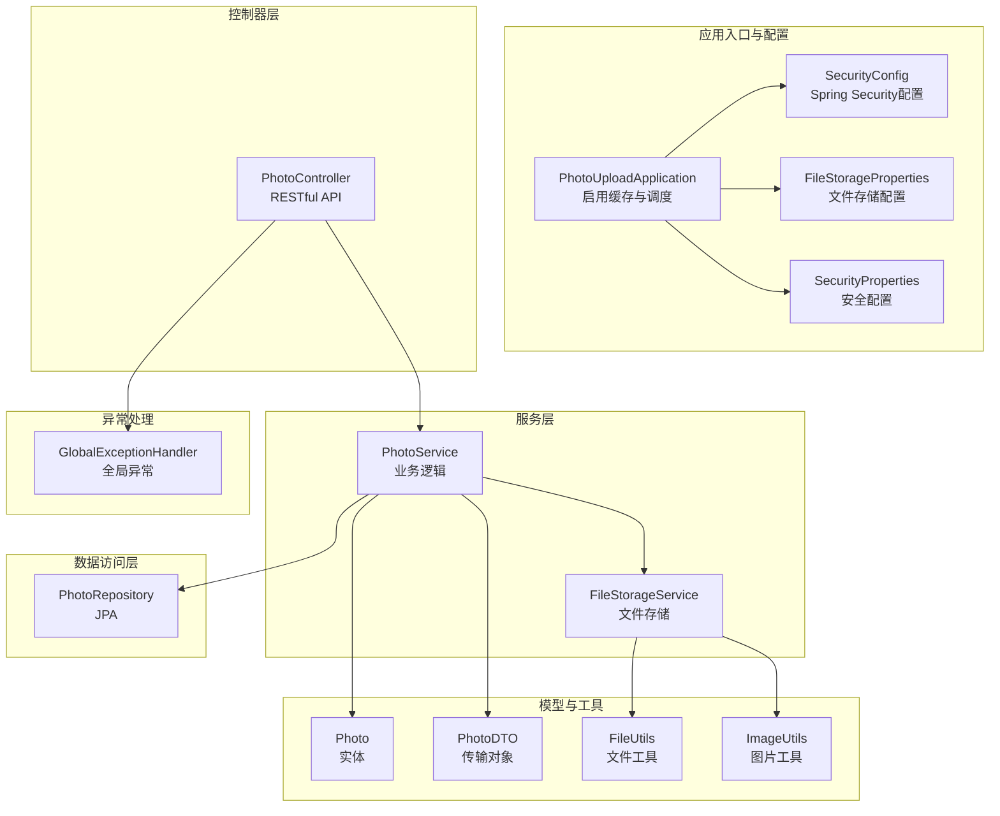
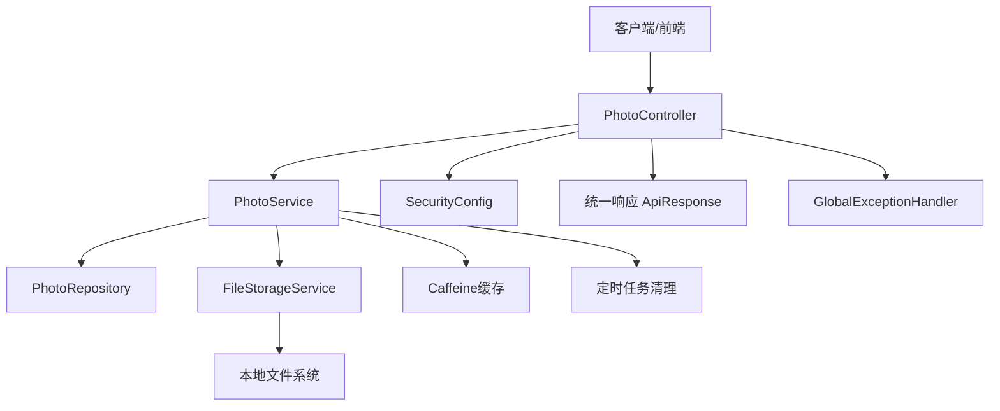
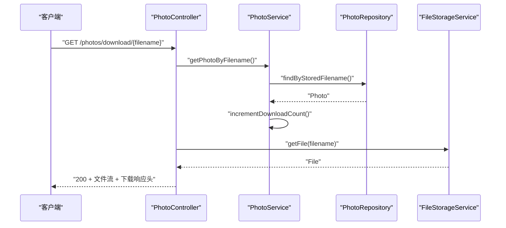
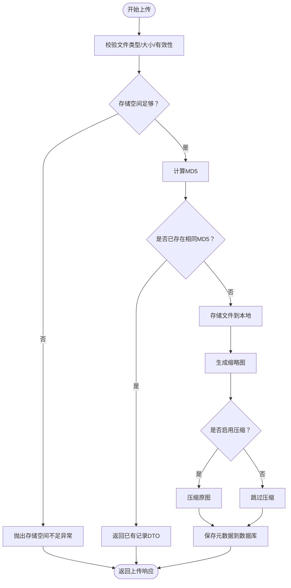
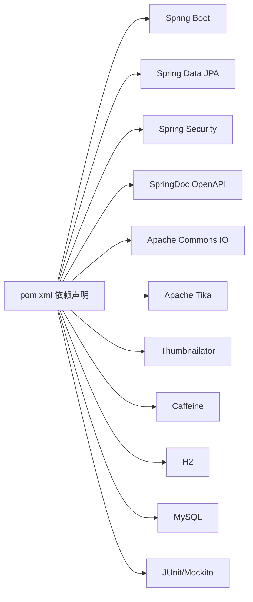

# 开发指南

<cite>
**本文引用的文件**
- [README.md](file://README.md)
- [API_DOCUMENTATION.md](file://API_DOCUMENTATION.md)
- [PROJECT_SUMMARY.md](file://PROJECT_SUMMARY.md)
- [LOGIN_GUIDE.md](file://LOGIN_GUIDE.md)
- [pom.xml](file://pom.xml)
- [application.yml](file://src/main/resources/application.yml)
- [PhotoUploadApplication.java](file://src/main/java/com/photo/PhotoUploadApplication.java)
- [PhotoController.java](file://src/main/java/com/photo/controller/PhotoController.java)
- [FileStorageService.java](file://src/main/java/com/photo/service/FileStorageService.java)
- [PhotoService.java](file://src/main/java/com/photo/service/PhotoService.java)
- [PhotoRepository.java](file://src/main/java/com/photo/repository/PhotoRepository.java)
- [Photo.java](file://src/main/java/com/photo/entity/Photo.java)
- [PhotoDTO.java](file://src/main/java/com/photo/dto/PhotoDTO.java)
- [FileStorageProperties.java](file://src/main/java/com/photo/config/FileStorageProperties.java)
- [SecurityProperties.java](file://src/main/java/com/photo/config/SecurityProperties.java)
- [SecurityConfig.java](file://src/main/java/com/photo/config/SecurityConfig.java)
- [FileUtils.java](file://src/main/java/com/photo/util/FileUtils.java)
- [ImageUtils.java](file://src/main/java/com/photo/util/ImageUtils.java)
- [GlobalExceptionHandler.java](file://src/main/java/com/photo/exception/GlobalExceptionHandler.java)
- [PhotoControllerTest.java](file://src/test/java/com/photo/controller/PhotoControllerTest.java)
</cite>

## 目录
1. [简介](#简介)
2. [项目结构](#项目结构)
3. [核心组件](#核心组件)
4. [架构总览](#架构总览)
5. [详细组件分析](#详细组件分析)
6. [依赖分析](#依赖分析)
7. [性能考虑](#性能考虑)
8. [故障排查指南](#故障排查指南)
9. [结论](#结论)
10. [附录](#附录)

## 简介
本开发指南面向参与“照片上传下载系统”项目的团队成员，提供从环境搭建、代码规范、Git 工作流、构建与发布到安全加固与性能优化的完整开发规范与协作流程。项目基于 Spring Boot 3.2.0，提供上传、下载、在线预览、断点续传、缩略图、缓存、安全防护与统一异常处理等能力。

## 项目结构
项目采用标准的 Spring Boot 分层架构，主要模块包括：
- 应用入口与配置：PhotoUploadApplication、配置类（SecurityConfig、FileStorageProperties、SecurityProperties）
- 控制器层：PhotoController 提供 RESTful API
- 服务层：PhotoService、FileStorageService 实现业务逻辑与文件存储
- 数据访问层：PhotoRepository（JPA）
- 实体与DTO：Photo、PhotoDTO
- 工具类：FileUtils、ImageUtils
- 异常体系：全局异常处理器 GlobalExceptionHandler
- 测试：PhotoControllerTest 等

图表来源
- [PhotoUploadApplication.java](file://src/main/java/com/photo/PhotoUploadApplication.java#L1-L20)
- [SecurityConfig.java](file://src/main/java/com/photo/config/SecurityConfig.java#L1-L99)
- [FileStorageProperties.java](file://src/main/java/com/photo/config/FileStorageProperties.java#L1-L94)
- [SecurityProperties.java](file://src/main/java/com/photo/config/SecurityProperties.java#L1-L53)
- [PhotoController.java](file://src/main/java/com/photo/controller/PhotoController.java#L1-L316)
- [PhotoService.java](file://src/main/java/com/photo/service/PhotoService.java#L1-L385)
- [FileStorageService.java](file://src/main/java/com/photo/service/FileStorageService.java#L1-L300)
- [PhotoRepository.java](file://src/main/java/com/photo/repository/PhotoRepository.java#L1-L112)
- [Photo.java](file://src/main/java/com/photo/entity/Photo.java#L1-L174)
- [PhotoDTO.java](file://src/main/java/com/photo/dto/PhotoDTO.java#L1-L104)
- [FileUtils.java](file://src/main/java/com/photo/util/FileUtils.java#L1-L178)
- [ImageUtils.java](file://src/main/java/com/photo/util/ImageUtils.java#L1-L182)
- [GlobalExceptionHandler.java](file://src/main/java/com/photo/exception/GlobalExceptionHandler.java#L1-L140)

章节来源
- [README.md](file://README.md#L214-L252)
- [PROJECT_SUMMARY.md](file://PROJECT_SUMMARY.md#L84-L157)

## 核心组件
- 应用入口与启动：PhotoUploadApplication 启用缓存与定时任务，便于后续清理与缓存策略生效。
- 控制器：PhotoController 提供 13 个 API，涵盖上传、下载、预览、缩略图、分页查询、删除、存储信息等。
- 服务层：
  - PhotoService：负责文件校验、MD5 去重、缩略图生成、压缩、缓存、访问/下载计数、存储清理等。
  - FileStorageService：负责文件存储、读取、范围读取、缩略图生成、压缩、删除等。
- 数据访问：PhotoRepository 提供 JPA 查询与更新，含软删除、计数、热门/最新排序、过期清理等。
- 配置：
  - FileStorageProperties：集中管理文件存储路径、类型、大小、压缩、清理等配置。
  - SecurityProperties：防盗链、CORS、Token 等安全配置。
  - SecurityConfig：Spring Security 的 CSRF 关闭、CORS、表单登录、登出、权限规则等。
- 工具类：
  - FileUtils：文件类型检测（扩展名+MIME）、MD5、文件名清洗、大小格式化。
  - ImageUtils：图片尺寸获取、缩略图生成、压缩、旋转、水印等。
- 异常处理：GlobalExceptionHandler 统一处理各类异常，返回标准 ApiResponse。

章节来源
- [PhotoUploadApplication.java](file://src/main/java/com/photo/PhotoUploadApplication.java#L1-L20)
- [PhotoController.java](file://src/main/java/com/photo/controller/PhotoController.java#L1-L316)
- [PhotoService.java](file://src/main/java/com/photo/service/PhotoService.java#L1-L385)
- [FileStorageService.java](file://src/main/java/com/photo/service/FileStorageService.java#L1-L300)
- [PhotoRepository.java](file://src/main/java/com/photo/repository/PhotoRepository.java#L1-L112)
- [FileStorageProperties.java](file://src/main/java/com/photo/config/FileStorageProperties.java#L1-L94)
- [SecurityProperties.java](file://src/main/java/com/photo/config/SecurityProperties.java#L1-L53)
- [SecurityConfig.java](file://src/main/java/com/photo/config/SecurityConfig.java#L1-L99)
- [FileUtils.java](file://src/main/java/com/photo/util/FileUtils.java#L1-L178)
- [ImageUtils.java](file://src/main/java/com/photo/util/ImageUtils.java#L1-L182)
- [GlobalExceptionHandler.java](file://src/main/java/com/photo/exception/GlobalExceptionHandler.java#L1-L140)

## 架构总览
系统采用经典的三层架构（Controller → Service → Repository），结合 Spring Security 进行访问控制，Caffeine 缓存提升热点数据访问性能，定时任务定期清理过期文件，统一异常处理保证对外响应一致性。

图表来源
- [PhotoController.java](file://src/main/java/com/photo/controller/PhotoController.java#L1-L316)
- [PhotoService.java](file://src/main/java/com/photo/service/PhotoService.java#L1-L385)
- [FileStorageService.java](file://src/main/java/com/photo/service/FileStorageService.java#L1-L300)
- [PhotoRepository.java](file://src/main/java/com/photo/repository/PhotoRepository.java#L1-L112)
- [SecurityConfig.java](file://src/main/java/com/photo/config/SecurityConfig.java#L1-L99)
- [GlobalExceptionHandler.java](file://src/main/java/com/photo/exception/GlobalExceptionHandler.java#L1-L140)

## 详细组件分析

### 控制器层：PhotoController
- 职责：接收 HTTP 请求，调用服务层处理，返回统一 ApiResponse。
- 关键点：
  - 防盗链校验（Referer）在预览与下载接口中启用。
  - Range 请求支持断点续传下载。
  - 统一日志记录请求参数与客户端 IP。
  - 访问/下载计数在服务层原子更新。

图表来源
- [PhotoController.java](file://src/main/java/com/photo/controller/PhotoController.java#L149-L179)
- [PhotoService.java](file://src/main/java/com/photo/service/PhotoService.java#L155-L250)
- [PhotoRepository.java](file://src/main/java/com/photo/repository/PhotoRepository.java#L23-L46)
- [FileStorageService.java](file://src/main/java/com/photo/service/FileStorageService.java#L100-L114)

章节来源
- [PhotoController.java](file://src/main/java/com/photo/controller/PhotoController.java#L1-L316)

### 服务层：PhotoService
- 职责：业务编排，文件校验、MD5 去重、缩略图生成、压缩、缓存、访问/下载计数、存储清理。
- 关键点：
  - 事务边界：上传、删除、计数等涉及数据库与文件系统变更的操作均在事务内执行。
  - 缓存：热点查询使用 @Cacheable/@CacheEvict。
  - 定时清理：@Scheduled 触发清理过期文件。
  - 存储空间检查：上传前汇总已用空间与文件大小比较。

图表来源
- [PhotoService.java](file://src/main/java/com/photo/service/PhotoService.java#L50-L136)
- [FileStorageService.java](file://src/main/java/com/photo/service/FileStorageService.java#L59-L95)
- [FileUtils.java](file://src/main/java/com/photo/util/FileUtils.java#L107-L119)
- [ImageUtils.java](file://src/main/java/com/photo/util/ImageUtils.java#L53-L65)

章节来源
- [PhotoService.java](file://src/main/java/com/photo/service/PhotoService.java#L1-L385)

### 文件存储层：FileStorageService
- 职责：文件系统读写、范围读取、缩略图生成、压缩、删除、路径解析与安全校验。
- 关键点：
  - 目录初始化与安全路径解析，防止目录穿越。
  - 范围读取支持断点续传。
  - 缩略图与压缩均通过 ImageUtils 完成。

章节来源
- [FileStorageService.java](file://src/main/java/com/photo/service/FileStorageService.java#L1-L300)
- [ImageUtils.java](file://src/main/java/com/photo/util/ImageUtils.java#L1-L182)

### 数据访问层：PhotoRepository
- 职责：JPA 查询与更新，含软删除、计数、热门/最新排序、过期清理等。
- 关键点：
  - 软删除：通过标记 deleted 字段实现。
  - 统计聚合：sumAllFileSize、countActiveFiles 等。
  - 分页查询：按创建时间倒序、按访问次数倒序等。

章节来源
- [PhotoRepository.java](file://src/main/java/com/photo/repository/PhotoRepository.java#L1-L112)

### 安全配置：SecurityConfig 与 SecurityProperties
- 职责：Spring Security 配置、CORS、表单登录、登出、CSRF 关闭、防盗链 Referer 校验。
- 关键点：
  - 公开路径与需认证路径区分。
  - CORS 配置来源于 SecurityProperties。
  - 防盗链 Referer 校验在控制器中使用。

章节来源
- [SecurityConfig.java](file://src/main/java/com/photo/config/SecurityConfig.java#L1-L99)
- [SecurityProperties.java](file://src/main/java/com/photo/config/SecurityProperties.java#L1-L53)
- [PhotoController.java](file://src/main/java/com/photo/controller/PhotoController.java#L92-L97)

### 工具类：FileUtils 与 ImageUtils
- 职责：文件类型检测（扩展名+MIME）、MD5、文件名清洗、图片尺寸获取、缩略图与压缩。
- 关键点：
  - 使用 Apache Tika 进行 MIME 类型检测。
  - 缩略图与压缩使用 Thumbnailator。

章节来源
- [FileUtils.java](file://src/main/java/com/photo/util/FileUtils.java#L1-L178)
- [ImageUtils.java](file://src/main/java/com/photo/util/ImageUtils.java#L1-L182)

### 异常处理：GlobalExceptionHandler
- 职责：统一捕获并返回标准 ApiResponse，包含状态码与错误信息。
- 关键点：
  - 区分业务异常与系统异常。
  - 参数校验异常统一映射。

章节来源
- [GlobalExceptionHandler.java](file://src/main/java/com/photo/exception/GlobalExceptionHandler.java#L1-L140)

## 依赖分析
- 核心框架：Spring Boot 3.2.0、Spring Data JPA、Spring Security、SpringDoc OpenAPI。
- 文件处理：Apache Commons IO、Apache Tika、Thumbnailator。
- 缓存：Caffeine。
- 数据库：H2（开发）/ MySQL（生产）。
- 测试：JUnit 5、Mockito、Spring Boot Test。

图表来源
- [pom.xml](file://pom.xml#L1-L169)

章节来源
- [pom.xml](file://pom.xml#L1-L169)
- [PROJECT_SUMMARY.md](file://PROJECT_SUMMARY.md#L238-L251)

## 性能考虑
- 缓存：Caffeine 缓存热点照片元数据，减少数据库访问。
- 图片处理：自动压缩与缩略图生成，降低带宽与存储压力。
- HTTP 缓存：预览接口设置 Cache-Control，减少重复请求。
- 数据库索引：对常用查询字段建立索引，优化分页与搜索。
- 断点续传：Range 请求支持大文件下载，提升可靠性与效率。

章节来源
- [application.yml](file://src/main/resources/application.yml#L50-L54)
- [PhotoService.java](file://src/main/java/com/photo/service/PhotoService.java#L141-L151)
- [PhotoController.java](file://src/main/java/com/photo/controller/PhotoController.java#L106-L112)

## 故障排查指南
- 常见异常与处理：
  - 文件类型/大小异常：检查 FileUtils 与 PhotoService 的校验逻辑。
  - 存储空间不足：检查存储上限与已用空间统计。
  - 文件未找到：确认文件名与存储路径，检查软删除状态。
  - 防盗链拒绝：核对 SecurityProperties 中的 allowed-domains。
- 日志定位：控制器与服务层均记录关键信息，优先查看日志输出。
- 单元测试：通过 PhotoControllerTest 验证接口行为，确保回归质量。

章节来源
- [GlobalExceptionHandler.java](file://src/main/java/com/photo/exception/GlobalExceptionHandler.java#L1-L140)
- [PhotoControllerTest.java](file://src/test/java/com/photo/controller/PhotoControllerTest.java#L1-L174)
- [FileUtils.java](file://src/main/java/com/photo/util/FileUtils.java#L84-L102)
- [PhotoService.java](file://src/main/java/com/photo/service/PhotoService.java#L304-L336)

## 结论
本指南提供了从环境搭建到开发协作、从性能优化到安全加固的完整规范。建议团队在日常开发中遵循统一的代码风格、测试策略与提交规范，持续完善文档与自动化流程，保障系统的稳定性与可维护性。

## 附录

### 开发环境搭建与IDE配置
- 环境要求：JDK 17+、Maven 3.6+、MySQL 5.7+（生产）。
- 配置数据库：编辑 application.yml，设置数据源与方言。
- 运行方式：mvn spring-boot:run 或打包后 java -jar。
- 访问地址：应用主页、Swagger 文档、H2 控制台。

章节来源
- [README.md](file://README.md#L69-L103)
- [application.yml](file://src/main/resources/application.yml#L1-L190)

### 代码规范与注释标准
- 命名约定：类名使用帕斯卡命名，方法与变量使用驼峰命名；包名小写。
- 注释规范：类与公共方法提供中文注释，说明职责、参数、返回值与异常。
- 统一响应：所有接口返回 ApiResponse 格式，便于前端消费与监控。

章节来源
- [API_DOCUMENTATION.md](file://API_DOCUMENTATION.md#L9-L20)
- [PhotoController.java](file://src/main/java/com/photo/controller/PhotoController.java#L1-L316)

### Git 工作流程与分支管理
- 分支策略：主分支保护，功能开发在 feature/*，修复在 hotfix/*，发布在 release/*。
- 提交规范：简短清晰的提交信息，关联 Issue 编号。
- 代码审查：PR 至 develop 进行评审，合并前确保通过测试与静态检查。

（本节为通用流程建议，不直接分析具体文件）

### 构建、打包与发布
- 构建命令：mvn clean package。
- 运行方式：mvn spring-boot:run 或 java -jar target/*.jar。
- 发布建议：CI/CD 自动化构建、测试、打包与部署。

章节来源
- [README.md](file://README.md#L85-L98)
- [pom.xml](file://pom.xml#L152-L167)

### 依赖管理与版本控制
- 依赖声明集中在 pom.xml，版本由 spring-boot-starter-parent 统一管理。
- 配置外部化：application.yml 管理数据库、缓存、文件存储、安全等配置。
- 冲突解决：升级依赖时先运行 mvn dependency:resolve，避免版本冲突。

章节来源
- [pom.xml](file://pom.xml#L1-L169)
- [application.yml](file://src/main/resources/application.yml#L1-L190)

### 新功能开发模板与最佳实践
- 模板步骤：
  1) 在 controller 层新增接口，返回 ApiResponse。
  2) 在 service 层实现业务逻辑，必要时使用缓存与事务。
  3) 在 repository 层新增查询方法（如有需要）。
  4) 在 dto 层新增传输对象（如有需要）。
  5) 编写单元测试覆盖正常与异常场景。
  6) 更新 API 文档与配置说明。
- 最佳实践：
  - 优先使用 DTO 与分页查询。
  - 严格校验输入参数与文件类型。
  - 使用统一异常处理与日志记录。
  - 对热点数据使用缓存，对大文件使用范围读取。

章节来源
- [PhotoController.java](file://src/main/java/com/photo/controller/PhotoController.java#L1-L316)
- [PhotoService.java](file://src/main/java/com/photo/service/PhotoService.java#L1-L385)
- [PhotoRepository.java](file://src/main/java/com/photo/repository/PhotoRepository.java#L1-L112)
- [API_DOCUMENTATION.md](file://API_DOCUMENTATION.md#L32-L509)

### 代码重构、性能优化与安全加固
- 重构建议：拆分复杂方法、消除重复代码、引入策略模式处理多类型文件。
- 性能优化：启用缓存、图片压缩、索引优化、断点续传、HTTP 压缩。
- 安全加固：启用 HTTPS、配置真实数据库、使用专业对象存储、完善鉴权与审计日志。

章节来源
- [SecurityConfig.java](file://src/main/java/com/photo/config/SecurityConfig.java#L1-L99)
- [application.yml](file://src/main/resources/application.yml#L120-L190)
- [PROJECT_SUMMARY.md](file://PROJECT_SUMMARY.md#L366-L377)