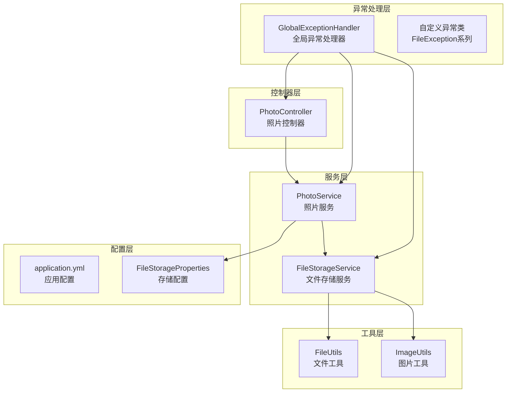
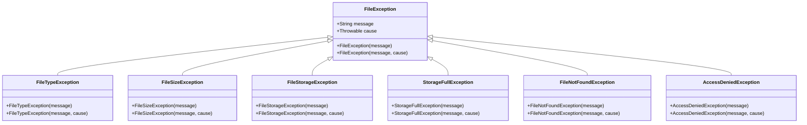
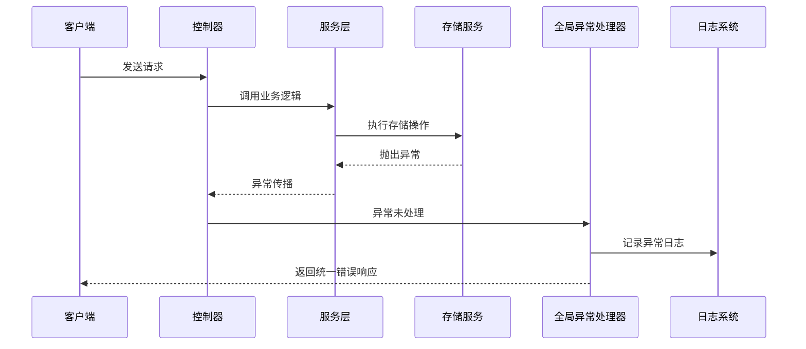
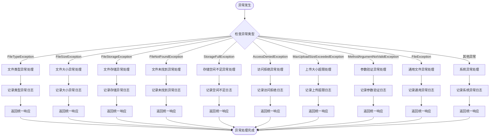
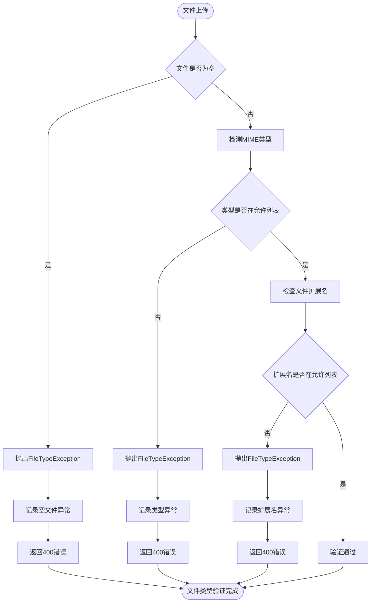
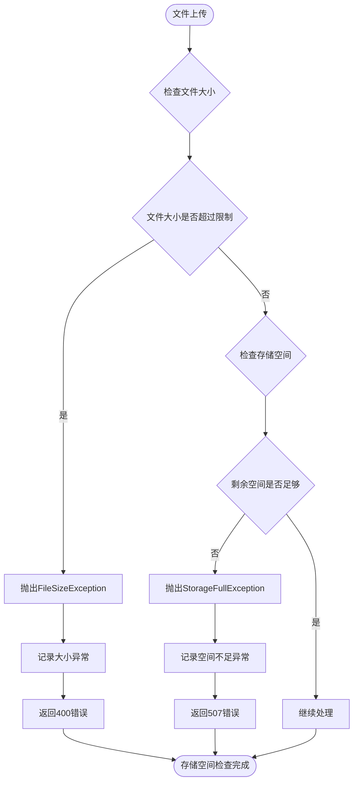
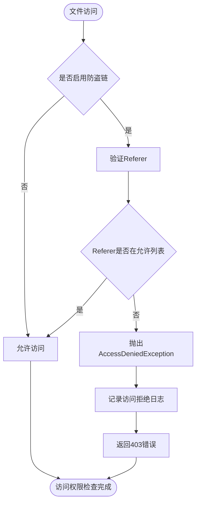
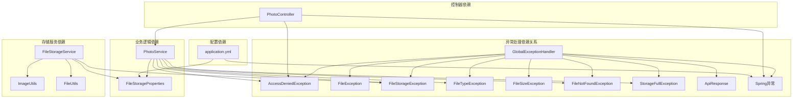

# 异常处理机制

<cite>
**本文档引用的文件**
- [GlobalExceptionHandler.java](file://src/main/java/com/photo/exception/GlobalExceptionHandler.java)
- [FileException.java](file://src/main/java/com/photo/exception/FileException.java)
- [AccessDeniedException.java](file://src/main/java/com/photo/exception/AccessDeniedException.java)
- [StorageFullException.java](file://src/main/java/com/photo/exception/StorageFullException.java)
- [FileStorageException.java](file://src/main/java/com/photo/exception/FileStorageException.java)
- [FileSizeException.java](file://src/main/java/com/photo/exception/FileSizeException.java)
- [FileTypeException.java](file://src/main/java/com/photo/exception/FileTypeException.java)
- [FileNotFoundException.java](file://src/main/java/com/photo/exception/FileNotFoundException.java)
- [ApiResponse.java](file://src/main/java/com/photo/dto/ApiResponse.java)
- [application.yml](file://src/main/resources/application.yml)
- [FileStorageService.java](file://src/main/java/com/photo/service/FileStorageService.java)
- [PhotoController.java](file://src/main/java/com/photo/controller/PhotoController.java)
- [FileUtils.java](file://src/main/java/com/photo/util/FileUtils.java)
- [ImageUtils.java](file://src/main/java/com/photo/util/ImageUtils.java)
- [FileStorageProperties.java](file://src/main/java/com/photo/config/FileStorageProperties.java)
- [PhotoService.java](file://src/main/java/com/photo/service/PhotoService.java)
</cite>

## 目录
1. [简介](#简介)
2. [项目结构](#项目结构)
3. [核心组件](#核心组件)
4. [架构概览](#架构概览)
5. [详细组件分析](#详细组件分析)
6. [依赖关系分析](#依赖关系分析)
7. [性能考虑](#性能考虑)
8. [故障排除指南](#故障排除指南)
9. [结论](#结论)
10. [附录](#附录)

## 简介

本文件详细介绍了照片上传下载系统的异常处理机制，包括全局异常处理器的工作原理、自定义异常类型的分类体系、错误码定义和统一响应格式。系统采用Spring Boot的@RestControllerAdvice注解实现全局异常处理，通过统一的ApiResponse格式向客户端返回标准化的错误信息。

## 项目结构

照片上传下载系统的异常处理架构主要分布在以下模块中：



**图表来源**
- [GlobalExceptionHandler.java](file://src/main/java/com/photo/exception/GlobalExceptionHandler.java#L1-L140)
- [PhotoController.java](file://src/main/java/com/photo/controller/PhotoController.java#L1-L316)
- [PhotoService.java](file://src/main/java/com/photo/service/PhotoService.java#L1-L200)

**章节来源**
- [GlobalExceptionHandler.java](file://src/main/java/com/photo/exception/GlobalExceptionHandler.java#L1-L140)
- [PhotoController.java](file://src/main/java/com/photo/controller/PhotoController.java#L1-L316)

## 核心组件

### 全局异常处理器

全局异常处理器是整个异常处理系统的核心，负责捕获和处理应用程序中的各种异常。它使用@RestControllerAdvice注解实现全局拦截，确保所有控制器抛出的异常都能被统一处理。

#### 主要功能特性

1. **异常类型覆盖**：处理所有自定义异常类型和Spring框架标准异常
2. **统一响应格式**：使用ApiResponse统一输出错误信息
3. **日志记录**：详细的异常日志记录，便于问题追踪
4. **状态码映射**：根据异常类型映射到相应的HTTP状态码

#### 异常映射策略

| 异常类型 | HTTP状态码 | 错误码 | 描述 |
|---------|-----------|-------|------|
| FileTypeException | 400 | 400 | 文件类型不支持 |
| FileSizeException | 400 | 400 | 文件大小超限 |
| FileStorageException | 500 | 500 | 文件存储失败 |
| FileNotFoundException | 404 | 404 | 文件未找到 |
| StorageFullException | 507 | 507 | 存储空间不足 |
| AccessDeniedException | 403 | 403 | 访问权限不足 |
| MaxUploadSizeExceededException | 400 | 400 | 文件上传超限 |
| MethodArgumentNotValidException | 400 | 400 | 参数验证失败 |
| FileException | 500 | 500 | 通用文件异常 |
| Exception | 500 | 500 | 系统未知错误 |

**章节来源**
- [GlobalExceptionHandler.java](file://src/main/java/com/photo/exception/GlobalExceptionHandler.java#L26-L138)

### 自定义异常类型

系统定义了完整的异常类型层次结构，基于FileException基类构建，实现了异常的分类管理和统一处理。

#### 异常层次结构



**图表来源**
- [FileException.java](file://src/main/java/com/photo/exception/FileException.java#L1-L16)
- [FileTypeException.java](file://src/main/java/com/photo/exception/FileTypeException.java#L1-L16)
- [FileSizeException.java](file://src/main/java/com/photo/exception/FileSizeException.java#L1-L16)
- [FileStorageException.java](file://src/main/java/com/photo/exception/FileStorageException.java#L1-L16)
- [StorageFullException.java](file://src/main/java/com/photo/exception/StorageFullException.java#L1-L16)
- [AccessDeniedException.java](file://src/main/java/com/photo/exception/AccessDeniedException.java#L1-L16)
- [FileNotFoundException.java](file://src/main/java/com/photo/exception/FileNotFoundException.java#L1-L16)

**章节来源**
- [FileException.java](file://src/main/java/com/photo/exception/FileException.java#L1-L16)
- [FileTypeException.java](file://src/main/java/com/photo/exception/FileTypeException.java#L1-L16)
- [FileSizeException.java](file://src/main/java/com/photo/exception/FileSizeException.java#L1-L16)
- [FileStorageException.java](file://src/main/java/com/photo/exception/FileStorageException.java#L1-L16)
- [StorageFullException.java](file://src/main/java/com/photo/exception/StorageFullException.java#L1-L16)
- [AccessDeniedException.java](file://src/main/java/com/photo/exception/AccessDeniedException.java#L1-L16)
- [FileNotFoundException.java](file://src/main/java/com/photo/exception/FileNotFoundException.java#L1-L16)

### 统一响应格式

系统使用ApiResponse作为统一的响应格式，确保所有接口返回一致的数据结构。

#### 响应格式定义

| 字段名 | 类型 | 必填 | 描述 |
|--------|------|------|------|
| code | Integer | 是 | 响应码 |
| message | String | 是 | 响应消息 |
| data | T | 否 | 响应数据 |
| timestamp | Long | 是 | 时间戳 |

#### 响应方法

1. **success(data)**: 成功响应，code=200
2. **success(message, data)**: 成功响应，可自定义消息
3. **error(message)**: 失败响应，默认code=500
4. **error(code, message)**: 失败响应，可自定义错误码

**章节来源**
- [ApiResponse.java](file://src/main/java/com/photo/dto/ApiResponse.java#L1-L63)

## 架构概览

照片上传下载系统的异常处理架构采用分层设计，实现了异常的分类管理、统一处理和标准化响应。



**图表来源**
- [PhotoController.java](file://src/main/java/com/photo/controller/PhotoController.java#L48-L61)
- [PhotoService.java](file://src/main/java/com/photo/service/PhotoService.java#L50-L111)
- [GlobalExceptionHandler.java](file://src/main/java/com/photo/exception/GlobalExceptionHandler.java#L26-L54)

## 详细组件分析

### 全局异常处理器工作原理

全局异常处理器通过@RestControllerAdvice注解实现，自动拦截所有控制器抛出的异常，并根据异常类型进行相应的处理。

#### 处理流程



**图表来源**
- [GlobalExceptionHandler.java](file://src/main/java/com/photo/exception/GlobalExceptionHandler.java#L26-L138)

#### 异常处理策略

1. **精确匹配优先**：优先处理具体的异常类型
2. **继承关系处理**：FileException基类异常按通用规则处理
3. **参数验证**：MethodArgumentNotValidException提取字段级错误
4. **上传限制**：MaxUploadSizeExceededException专门处理文件大小限制
5. **系统兜底**：Exception作为最后的异常处理保障

**章节来源**
- [GlobalExceptionHandler.java](file://src/main/java/com/photo/exception/GlobalExceptionHandler.java#L26-L138)

### 文件类型验证异常处理

文件类型验证是异常处理的重要组成部分，系统通过FileUtils类进行严格的文件类型检查。

#### 文件类型验证流程



**图表来源**
- [FileUtils.java](file://src/main/java/com/photo/util/FileUtils.java#L84-L102)

#### 支持的文件类型

系统支持以下图片格式：
- JPEG/JPG: image/jpeg
- PNG: image/png  
- GIF: image/gif
- BMP: image/bmp
- WebP: image/webp

**章节来源**
- [FileUtils.java](file://src/main/java/com/photo/util/FileUtils.java#L24-L36)
- [FileUtils.java](file://src/main/java/com/photo/util/FileUtils.java#L84-L102)

### 存储空间管理异常处理

存储空间管理涉及文件大小限制、存储容量监控和空间不足处理。

#### 存储空间检查流程



**图表来源**
- [PhotoService.java](file://src/main/java/com/photo/service/PhotoService.java#L57-L58)
- [FileStorageProperties.java](file://src/main/java/com/photo/config/FileStorageProperties.java#L64-L65)

#### 配置参数

系统通过application.yml配置存储相关参数：

| 配置项 | 默认值 | 描述 |
|--------|--------|------|
| file.storage.max-file-size | 10485760 | 最大文件大小(字节) |
| file.storage.max-files-per-upload | 10 | 单次上传最大文件数 |
| file.storage.max-storage-size | 10737418240 | 最大存储容量(字节) |
| spring.servlet.multipart.max-file-size | 10MB | Spring上传文件大小限制 |
| spring.servlet.multipart.max-request-size | 50MB | Spring请求总大小限制 |

**章节来源**
- [application.yml](file://src/main/resources/application.yml#L94-L97)
- [application.yml](file://src/main/resources/application.yml#L46-L47)
- [FileStorageProperties.java](file://src/main/java/com/photo/config/FileStorageProperties.java#L44-L45)

### 访问权限异常处理

系统实现了防盗链和访问权限控制，防止未授权访问。

#### 防盗链检查流程



**图表来源**
- [PhotoController.java](file://src/main/java/com/photo/controller/PhotoController.java#L92-L97)

#### 安全配置

系统支持以下安全配置：

| 配置项 | 默认值 | 描述 |
|--------|--------|------|
| security.referer.enabled | true | 是否启用防盗链 |
| security.referer.allowed-domains | localhost, 127.0.0.1 | 允许的域名列表 |
| security.token.secret | your-secret-key-change-this-in-production | JWT密钥 |
| security.token.expiration | 86400 | Token过期时间(秒) |

**章节来源**
- [application.yml](file://src/main/resources/application.yml#L122-L127)
- [application.yml](file://src/main/resources/application.yml#L128-L130)

## 依赖关系分析

异常处理机制的依赖关系体现了清晰的分层架构和职责分离。



**图表来源**
- [GlobalExceptionHandler.java](file://src/main/java/com/photo/exception/GlobalExceptionHandler.java#L1-L140)
- [PhotoService.java](file://src/main/java/com/photo/service/PhotoService.java#L1-L200)
- [FileStorageService.java](file://src/main/java/com/photo/service/FileStorageService.java#L1-L300)

### 关键依赖特性

1. **低耦合高内聚**：异常处理器独立于具体业务逻辑
2. **继承关系清晰**：所有异常都继承自FileException基类
3. **配置驱动**：存储参数通过配置文件集中管理
4. **日志集成**：统一的日志记录和监控集成

**章节来源**
- [GlobalExceptionHandler.java](file://src/main/java/com/photo/exception/GlobalExceptionHandler.java#L1-L140)
- [PhotoService.java](file://src/main/java/com/photo/service/PhotoService.java#L1-L200)

## 性能考虑

异常处理机制在保证系统稳定性的同时，也考虑了性能优化：

### 性能优化策略

1. **异常类型快速判断**：使用精确的异常类型匹配，避免不必要的处理开销
2. **日志级别控制**：区分不同级别的异常日志，减少不必要的日志写入
3. **缓存友好设计**：异常处理不影响业务逻辑的缓存机制
4. **异步日志处理**：重要异常采用异步日志记录，避免阻塞主线程

### 监控指标

系统集成了Actuator监控，可以监控异常处理的性能指标：

- 异常处理次数统计
- 不同异常类型的分布
- 异常处理耗时分析
- 错误率监控

**章节来源**
- [application.yml](file://src/main/resources/application.yml#L174-L182)

## 故障排除指南

### 常见异常诊断

#### 文件类型错误

**症状**：上传图片时返回400错误，提示文件类型不支持

**诊断步骤**：
1. 检查文件的实际MIME类型
2. 验证文件扩展名是否在允许列表中
3. 确认文件是否被正确识别

**解决方案**：
- 使用支持的图片格式(JPG/PNG/GIF/BMP/WebP)
- 确保文件扩展名与实际格式一致
- 检查文件是否损坏

#### 文件大小超限

**症状**：上传文件时返回400错误，提示文件大小超过限制

**诊断步骤**：
1. 检查文件大小是否超过配置限制
2. 验证单次上传文件数量限制
3. 确认请求总大小是否超限

**解决方案**：
- 减小单个文件大小
- 分批上传多个文件
- 调整配置参数(谨慎操作)

#### 存储空间不足

**症状**：上传文件时返回507错误，提示存储空间不足

**诊断步骤**：
1. 检查当前存储使用情况
2. 验证最大存储容量配置
3. 确认是否有文件清理机制

**解决方案**：
- 清理不需要的文件
- 增加存储容量配置
- 实施定期清理策略

#### 访问权限错误

**症状**：访问文件时返回403错误，提示访问被拒绝

**诊断步骤**：
1. 检查Referer头部是否在允许列表
2. 验证防盗链配置
3. 确认访问来源是否合法

**解决方案**：
- 配置正确的允许域名
- 检查代理服务器设置
- 验证CDN配置

### 调试技巧

1. **启用详细日志**：在开发环境中启用DEBUG级别日志
2. **使用Swagger**：通过Swagger UI测试异常场景
3. **单元测试**：编写针对异常场景的单元测试
4. **监控告警**：设置异常处理的监控告警

**章节来源**
- [GlobalExceptionHandler.java](file://src/main/java/com/photo/exception/GlobalExceptionHandler.java#L28-L138)

## 结论

照片上传下载系统的异常处理机制通过分层设计和统一处理策略，实现了异常的分类管理、标准化响应和完善的监控体系。系统的主要优势包括：

1. **完整的异常分类**：基于继承关系的异常层次结构
2. **统一的处理策略**：全局异常处理器实现标准化处理
3. **灵活的配置管理**：通过配置文件集中管理异常行为
4. **完善的监控集成**：日志记录和监控指标的完整覆盖

该异常处理机制为开发者提供了清晰的扩展指南，可以根据具体需求添加新的异常类型和处理逻辑。

## 附录

### 错误码对照表

| 错误码 | 异常类型 | 描述 | HTTP状态码 |
|--------|----------|------|------------|
| 400 | FileTypeException | 文件类型不支持 | 400 |
| 400 | FileSizeException | 文件大小超限 | 400 |
| 400 | MaxUploadSizeExceededException | 上传文件大小超限 | 400 |
| 400 | MethodArgumentNotValidException | 参数验证失败 | 400 |
| 403 | AccessDeniedException | 访问权限不足 | 403 |
| 404 | FileNotFoundException | 文件未找到 | 404 |
| 500 | FileStorageException | 文件存储失败 | 500 |
| 500 | FileException | 通用文件异常 | 500 |
| 500 | Exception | 系统未知错误 | 500 |
| 507 | StorageFullException | 存储空间不足 | 507 |

### 扩展指南

#### 添加新的异常类型

1. 创建新的异常类，继承自FileException或其子类
2. 在GlobalExceptionHandler中添加对应的异常处理器
3. 在ApiResponse中定义相应的错误码
4. 更新配置文件中的相关参数

#### 自定义异常处理器

```java
@ExceptionHandler(自定义异常类.class)
public ResponseEntity<ApiResponse<自定义数据类型>> handleCustomException(自定义异常类 e) {
    // 自定义处理逻辑
    return ResponseEntity
            .status(自定义状态码)
            .body(ApiResponse.error(自定义错误码, e.getMessage()));
}
```

#### 日志记录最佳实践

1. 使用结构化日志格式
2. 区分不同级别的异常日志
3. 避免在日志中记录敏感信息
4. 设置合理的日志轮转策略