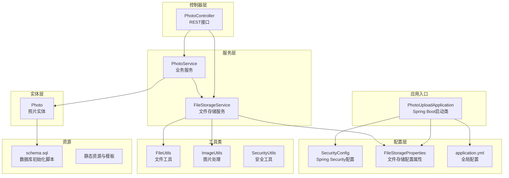
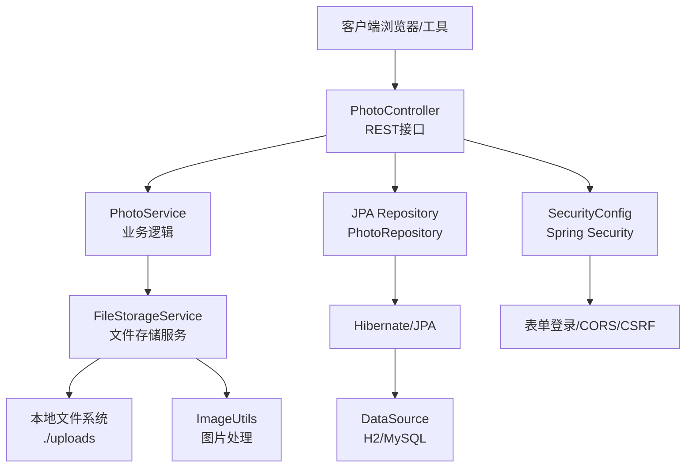
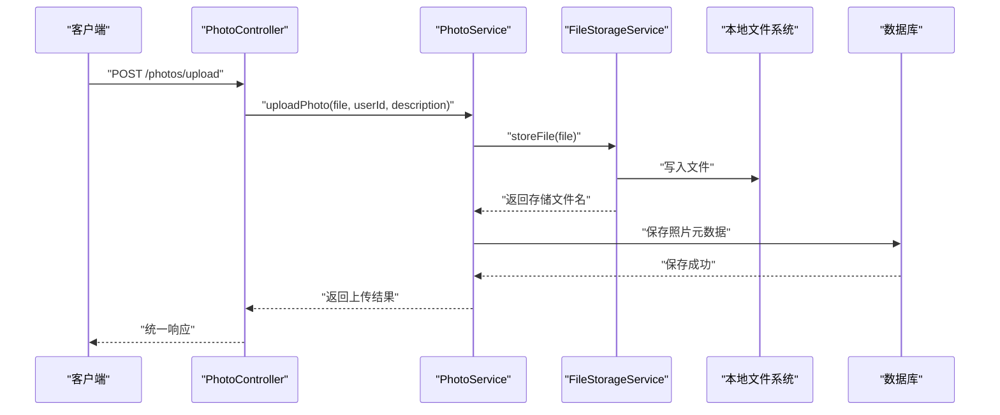
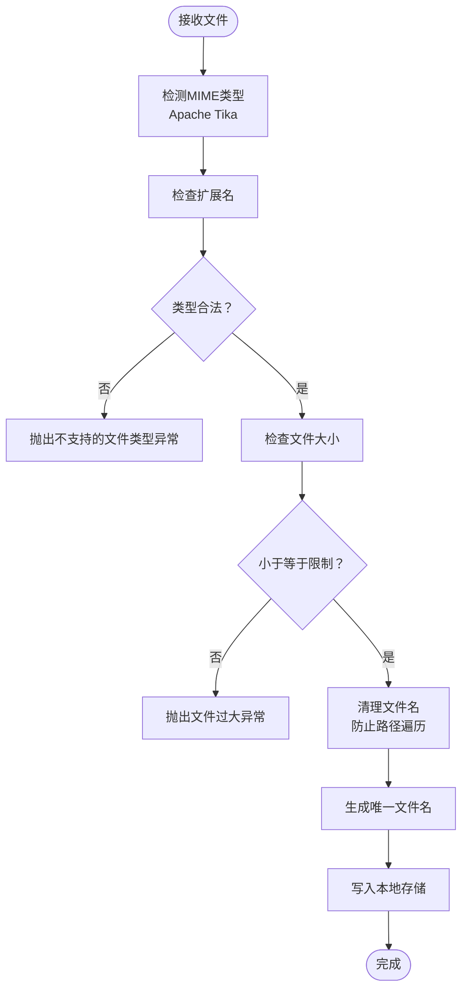
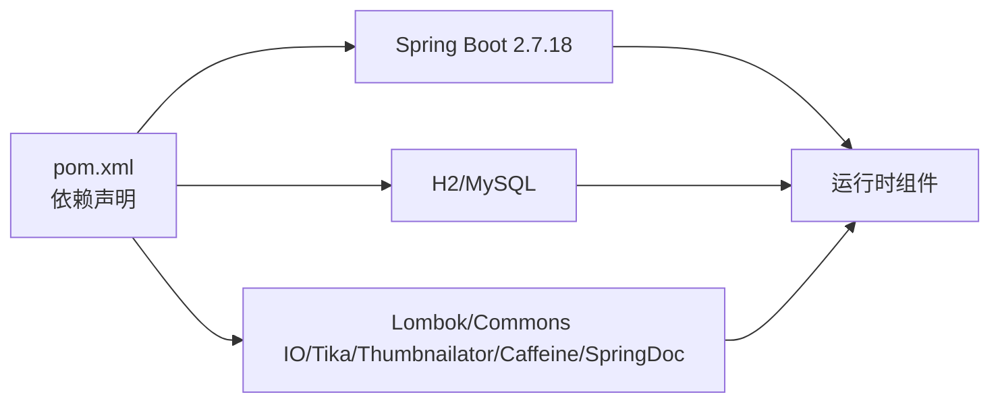

# 快速开始

<cite>
**本文引用的文件**
- [pom.xml](file://pom.xml)
- [application.yml](file://src/main/resources/application.yml)
- [schema.sql](file://src/main/resources/schema.sql)
- [PhotoUploadApplication.java](file://src/main/java/com/photo/PhotoUploadApplication.java)
- [PhotoController.java](file://src/main/java/com/photo/controller/PhotoController.java)
- [FileStorageProperties.java](file://src/main/java/com/photo/config/FileStorageProperties.java)
- [SecurityConfig.java](file://src/main/java/com/photo/config/SecurityConfig.java)
- [FileStorageService.java](file://src/main/java/com/photo/service/FileStorageService.java)
- [FileUtils.java](file://src/main/java/com/photo/util/FileUtils.java)
- [Photo.java](file://src/main/java/com/photo/entity/Photo.java)
- [README.md](file://README.md)
- [API_DOCUMENTATION.md](file://API_DOCUMENTATION.md)
- [start.sh](file://start.sh)
- [application-test.yml](file://src/test/resources/application-test.yml)
</cite>

## 目录
1. [简介](#简介)
2. [项目结构](#项目结构)
3. [核心组件](#核心组件)
4. [架构总览](#架构总览)
5. [详细组件分析](#详细组件分析)
6. [依赖关系分析](#依赖关系分析)
7. [性能注意事项](#性能注意事项)
8. [故障排查指南](#故障排查指南)
9. [结论](#结论)
10. [附录](#附录)

## 简介
本指南面向希望在30分钟内完成照片上传下载系统的搭建与运行的开发者。项目基于Spring Boot构建，提供完整的文件上传、下载、在线预览、断点续传、缩略图生成、存储空间管理等功能。你将学会：
- 环境准备（JDK 17+、Maven 3.6+、MySQL 5.7+ 或使用内置H2）
- 数据库与文件存储配置
- 多种启动方式（Maven运行、打包后JAR运行、Shell脚本）
- 访问应用界面、API文档与H2控制台
- 常见问题排查与解决方案
- 实际命令行示例与配置模板

## 项目结构
项目采用标准的Spring Boot多模块结构，主要代码位于src/main/java/com/photo下，资源位于src/main/resources。核心模块包括：
- 配置层：数据库、安全、文件存储、OpenAPI等配置
- 控制器层：REST接口，提供上传、下载、预览、搜索等能力
- 服务层：业务逻辑与文件存储服务
- 实体层：JPA实体映射数据库表
- 工具类：文件类型检测、图片处理、安全工具等

图表来源
- [PhotoUploadApplication.java](file://src/main/java/com/photo/PhotoUploadApplication.java#L1-L20)
- [SecurityConfig.java](file://src/main/java/com/photo/config/SecurityConfig.java#L1-L99)
- [FileStorageProperties.java](file://src/main/java/com/photo/config/FileStorageProperties.java#L1-L94)
- [application.yml](file://src/main/resources/application.yml#L1-L190)
- [PhotoController.java](file://src/main/java/com/photo/controller/PhotoController.java#L1-L316)
- [FileStorageService.java](file://src/main/java/com/photo/service/FileStorageService.java#L1-L200)
- [FileUtils.java](file://src/main/java/com/photo/util/FileUtils.java#L1-L178)
- [Photo.java](file://src/main/java/com/photo/entity/Photo.java#L1-L174)
- [schema.sql](file://src/main/resources/schema.sql#L1-L144)

章节来源
- [README.md](file://README.md#L214-L252)

## 核心组件
- Spring Boot启动类：负责应用启动与组件扫描
- REST控制器：提供上传、下载、预览、搜索、删除等接口
- 文件存储服务：负责文件写入、缩略图生成、压缩、清理等
- 安全配置：CORS、CSRF禁用、表单登录、密码编码器
- 文件存储配置：基础路径、允许类型、大小限制、缩略图与压缩参数、清理策略
- 数据库初始化：H2内存或文件数据库初始化脚本

章节来源
- [PhotoUploadApplication.java](file://src/main/java/com/photo/PhotoUploadApplication.java#L1-L20)
- [PhotoController.java](file://src/main/java/com/photo/controller/PhotoController.java#L1-L316)
- [FileStorageService.java](file://src/main/java/com/photo/service/FileStorageService.java#L1-L200)
- [SecurityConfig.java](file://src/main/java/com/photo/config/SecurityConfig.java#L1-L99)
- [FileStorageProperties.java](file://src/main/java/com/photo/config/FileStorageProperties.java#L1-L94)
- [schema.sql](file://src/main/resources/schema.sql#L1-L144)

## 架构总览
系统采用经典的三层架构：表现层（控制器）、业务层（服务）、持久层（JPA实体）。文件存储与图片处理由专用服务负责；安全策略通过Spring Security统一管理；API文档通过SpringDoc OpenAPI提供。

图表来源
- [PhotoController.java](file://src/main/java/com/photo/controller/PhotoController.java#L1-L316)
- [FileStorageService.java](file://src/main/java/com/photo/service/FileStorageService.java#L1-L200)
- [SecurityConfig.java](file://src/main/java/com/photo/config/SecurityConfig.java#L1-L99)
- [application.yml](file://src/main/resources/application.yml#L1-L190)

## 详细组件分析

### 启动与运行方式
- 直接运行（推荐新手）：使用Maven插件直接启动
  - 命令：mvn spring-boot:run
  - 优点：无需打包，热更新友好
- 打包运行：先编译再运行JAR
  - 命令：mvn clean package；java -jar target/photo-upload-system-1.0.0.jar
- Shell脚本：一键检查环境并启动
  - 命令：./start.sh
  - 会自动检查Java版本、Maven可用性、编译并启动

章节来源
- [README.md](file://README.md#L85-L98)
- [start.sh](file://start.sh#L1-L59)
- [pom.xml](file://pom.xml#L152-L167)

### 数据库与文件存储配置
- 数据库选择
  - 开发环境默认使用H2（文件型），配置在application.yml中
  - 生产环境可切换为MySQL，需在application.yml中取消注释相应配置并填写连接信息
- 文件存储路径
  - 基础路径、临时目录、缩略图目录、允许类型、最大文件大小、最大上传数量、缩略图与压缩参数、存储上限、定期清理策略等均在application.yml中集中配置
- 数据库初始化
  - 项目自带schema.sql，首次启动时会自动执行DDL初始化

章节来源
- [application.yml](file://src/main/resources/application.yml#L1-L190)
- [schema.sql](file://src/main/resources/schema.sql#L1-L144)

### 接口与访问
- 应用主页：http://localhost:8080/api
- API文档：http://localhost:8080/api/swagger-ui.html
- H2控制台：http://localhost:8080/api/h2-console
- API参考：详见API文档与Swagger界面

章节来源
- [README.md](file://README.md#L100-L103)
- [API_DOCUMENTATION.md](file://API_DOCUMENTATION.md#L496-L508)
- [application.yml](file://src/main/resources/application.yml#L36-L40)

### 上传与下载流程
- 上传单个/批量：接收multipart文件，校验类型与大小，生成唯一文件名，写入本地存储，生成缩略图与压缩图，记录元数据
- 在线预览：防盗链校验后返回原图二进制流
- 下载与断点续传：支持Range请求，返回部分或完整内容
- 删除：软删除与永久删除两种模式

图表来源
- [PhotoController.java](file://src/main/java/com/photo/controller/PhotoController.java#L48-L61)
- [FileStorageService.java](file://src/main/java/com/photo/service/FileStorageService.java#L59-L95)
- [Photo.java](file://src/main/java/com/photo/entity/Photo.java#L1-L174)

### 文件类型与安全校验
- 文件类型检测：使用Apache Tika进行MIME类型检测，结合扩展名校验
- 文件名安全：移除路径分隔符与危险字符，防止路径遍历
- 防盗链：可配置允许的Referer域名列表
- XSS与CORS：统一在SecurityConfig中配置

图表来源
- [FileUtils.java](file://src/main/java/com/photo/util/FileUtils.java#L56-L102)
- [FileStorageService.java](file://src/main/java/com/photo/service/FileStorageService.java#L59-L95)

章节来源
- [FileUtils.java](file://src/main/java/com/photo/util/FileUtils.java#L1-L178)
- [SecurityConfig.java](file://src/main/java/com/photo/config/SecurityConfig.java#L1-L99)

## 依赖关系分析
- 构建与运行
  - Maven父工程：spring-boot-starter-parent 2.7.18
  - Java版本：属性中声明为8，但实际项目使用JDK 17+（建议在本地IDE中设置JDK 17+）
  - Spring Boot起步依赖：Web、JPA、Validation、Thymeleaf、Security、Cache、DevTools等
  - 数据库：H2（开发）与MySQL（可选）
  - 第三方库：Lombok、Commons IO、Thumbnailator、Tika、CommonMark、Caffeine、SpringDoc OpenAPI
- 运行时依赖
  - H2控制台启用，可通过/ h2-console访问
  - 文件上传大小、请求大小、阈值等Servlet配置
  - 缓存使用Caffeine，日志输出至文件

图表来源
- [pom.xml](file://pom.xml#L1-L169)
- [application.yml](file://src/main/resources/application.yml#L6-L11)

章节来源
- [pom.xml](file://pom.xml#L1-L169)
- [application.yml](file://src/main/resources/application.yml#L1-L190)

## 性能注意事项
- 图片压缩与缩略图：自动压缩大图，生成200x200缩略图，降低带宽与存储压力
- 缓存：Caffeine缓存照片元数据，减少数据库查询
- 断点续传：支持Range请求，提升大文件下载体验
- 数据库索引：对常用查询字段建立索引，提高检索效率
- Tomcat线程池与压缩：合理配置最大连接数、线程数与压缩MIME类型

章节来源
- [application.yml](file://src/main/resources/application.yml#L161-L172)
- [FileStorageProperties.java](file://src/main/java/com/photo/config/FileStorageProperties.java#L72-L92)

## 故障排查指南
- 启动失败（端口占用）
  - 现象：端口8080被占用
  - 处理：修改server.port或释放端口
  - 参考：application.yml中的server.port配置
- 数据库连接失败
  - 现象：H2或MySQL连接异常
  - 处理：确认application.yml中datasource配置正确；如使用MySQL，确保数据库已创建且账号密码正确
- 文件存储目录不可写
  - 现象：启动时报无法创建存储目录
  - 处理：检查file.storage.base-path指向的目录是否存在且具备写权限
- 文件类型不被识别
  - 现象：提示不支持的文件类型
  - 处理：确认文件扩展名与MIME类型在允许列表中；必要时调整application.yml中的allowed-types与allowed-extensions
- 防盗链拦截
  - 现象：预览或下载被拒绝
  - 处理：在security.referer.allowed-domains中添加允许的域名
- API文档无法访问
  - 现象：/swagger-ui.html或/api-docs返回404
  - 处理：确认springdoc配置与匹配策略一致；检查application.yml中springdoc.api-docs.path与springdoc.swagger-ui.path

章节来源
- [application.yml](file://src/main/resources/application.yml#L1-L190)
- [SecurityConfig.java](file://src/main/java/com/photo/config/SecurityConfig.java#L37-L58)
- [FileStorageService.java](file://src/main/java/com/photo/service/FileStorageService.java#L36-L54)

## 结论
通过本指南，你可以在30分钟内完成环境准备、数据库与文件存储配置、应用启动与基本验证。系统提供了完善的上传、下载、预览、断点续传、缩略图与压缩、安全与性能优化等能力。建议在生产环境中：
- 使用MySQL并配置高可用
- 将文件存储迁移到对象存储（如OSS/S3）
- 调整安全配置（Token密钥、CORS、Referer等）
- 监控存储空间与访问指标

## 附录

### 环境要求与安装
- JDK 17+（建议使用JDK 17或更高版本）
- Maven 3.6+
- MySQL 5.7+（生产环境可选）

章节来源
- [README.md](file://README.md#L69-L72)

### 数据库连接配置（MySQL）
- 在application.yml中取消注释MySQL相关配置并填写连接信息
- 示例模板（请勿直接复制，仅作参考）：
  - spring.datasource.url: jdbc:mysql://localhost:3306/photo_db?useUnicode=true&characterEncoding=utf8&useSSL=false&serverTimezone=Asia/Shanghai
  - spring.datasource.username: root
  - spring.datasource.password: root
  - spring.jpa.properties.hibernate.dialect: org.hibernate.dialect.MySQLDialect

章节来源
- [application.yml](file://src/main/resources/application.yml#L13-L28)

### 文件存储路径设置
- 基础路径、临时目录、缩略图目录、允许类型、最大文件大小、最大上传数量、缩略图与压缩参数、存储上限、定期清理策略
- 示例模板（请勿直接复制，仅作参考）：
  - file.storage.base-path: ./uploads
  - file.storage.allowed-types: [image/jpeg, image/png, ...]
  - file.storage.max-file-size: 10485760
  - file.storage.thumbnail.width: 200
  - file.storage.compression.enabled: true
  - file.storage.cleanup.enabled: true

章节来源
- [application.yml](file://src/main/resources/application.yml#L69-L117)
- [FileStorageProperties.java](file://src/main/java/com/photo/config/FileStorageProperties.java#L1-L94)

### 启动方式与命令
- Maven直接运行：mvn spring-boot:run
- 打包后运行：mvn clean package；java -jar target/photo-upload-system-1.0.0.jar
- Shell脚本：./start.sh（自动检查环境并启动）

章节来源
- [README.md](file://README.md#L85-L98)
- [start.sh](file://start.sh#L1-L59)

### 访问应用与文档
- 应用主页：http://localhost:8080/api
- API文档：http://localhost:8080/api/swagger-ui.html
- H2控制台：http://localhost:8080/api/h2-console

章节来源
- [README.md](file://README.md#L100-L103)
- [API_DOCUMENTATION.md](file://API_DOCUMENTATION.md#L496-L508)
- [application.yml](file://src/main/resources/application.yml#L36-L40)

### API参考（部分）
- 上传单个照片：POST /api/photos/upload
- 批量上传：POST /api/photos/upload/batch
- 在线预览：GET /api/photos/view/{filename}
- 下载：GET /api/photos/download/{filename}
- 断点续传：GET /api/photos/download/range/{filename}（支持Range头）
- 获取照片信息：GET /api/photos/{id}
- 查询公开照片：GET /api/photos/public?page=&size=
- 搜索照片：GET /api/photos/search?keyword=&page=&size=
- 删除照片：DELETE /api/photos/{id}?userId=
- 获取存储信息：GET /api/photos/storage/info

章节来源
- [API_DOCUMENTATION.md](file://API_DOCUMENTATION.md#L34-L404)