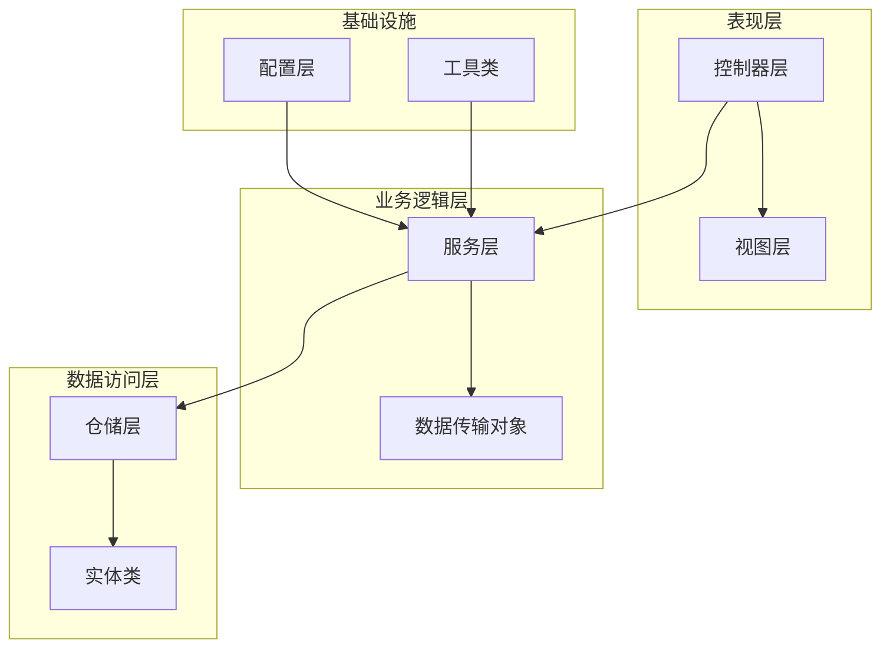
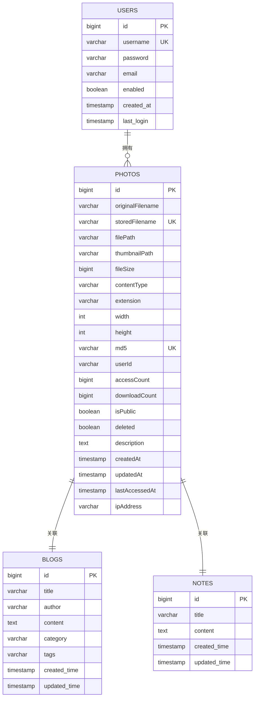
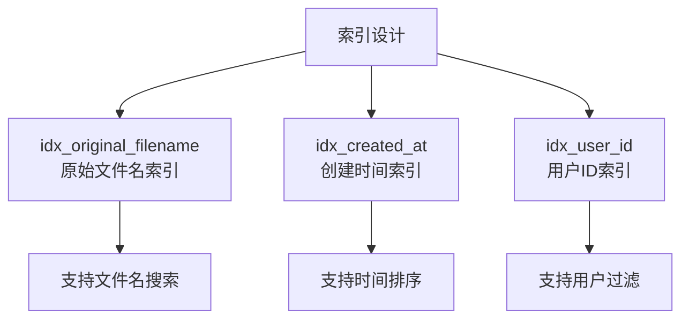
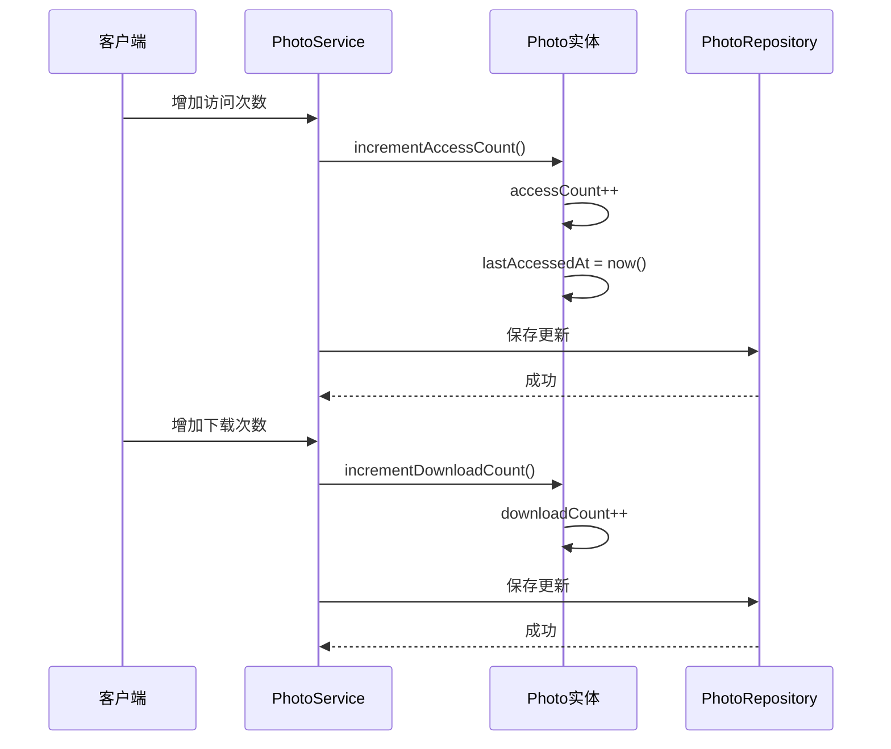
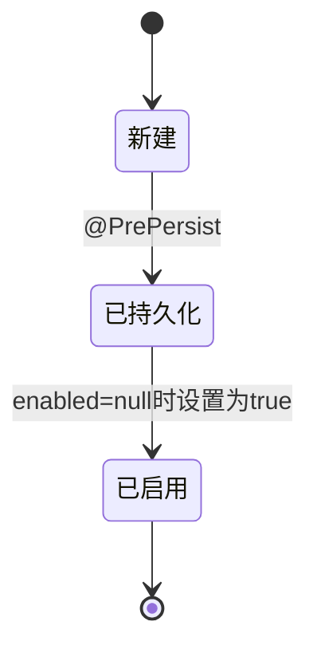
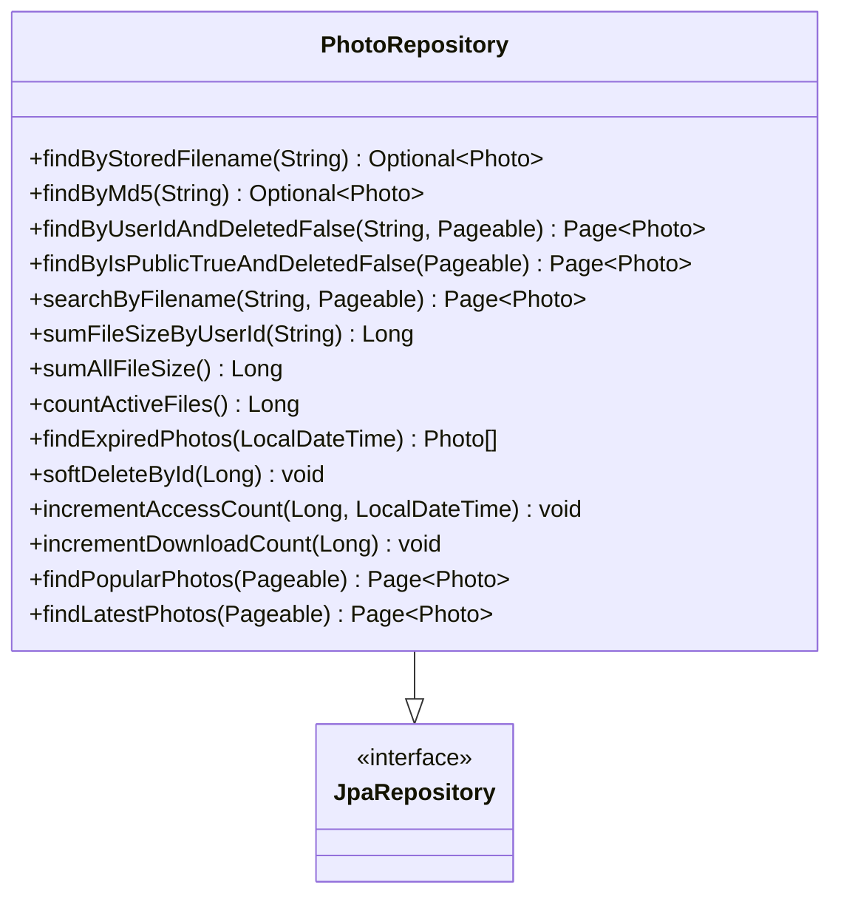
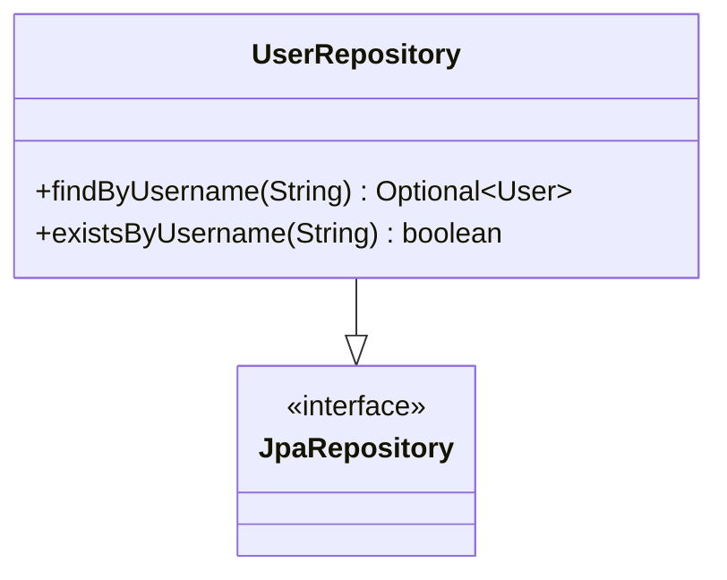
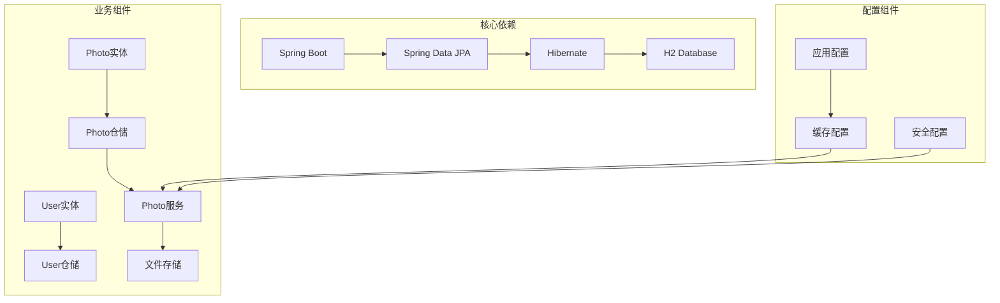
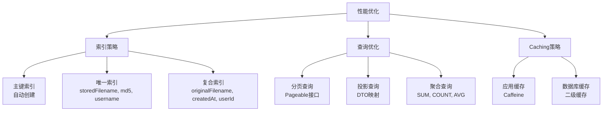
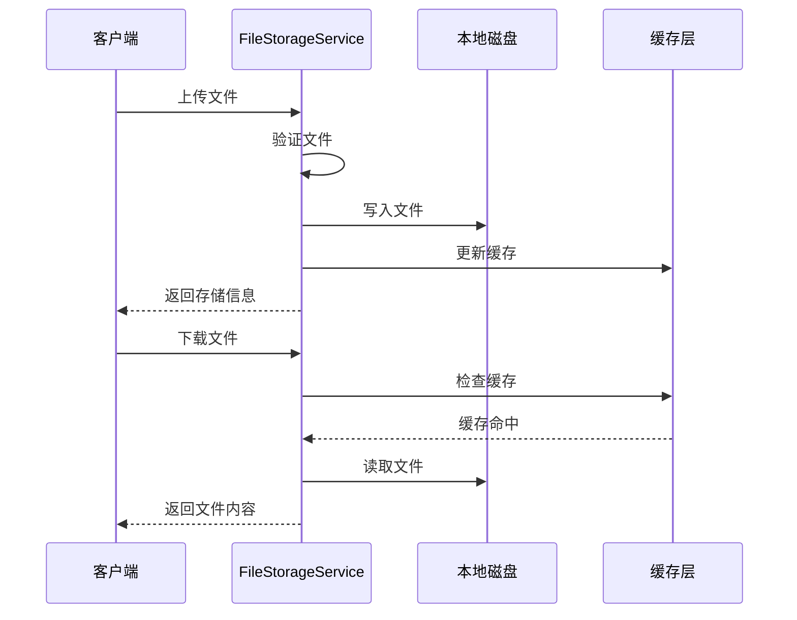

# 数据模型设计

<cite>
**本文档引用的文件**
- [Photo.java](file://src/main/java/com/photo/entity/Photo.java)
- [User.java](file://src/main/java/com/photo/entity/User.java)
- [Blog.java](file://src/main/java/com/photo/entity/Blog.java)
- [Note.java](file://src/main/java/com/photo/entity/Note.java)
- [PhotoRepository.java](file://src/main/java/com/photo/repository/PhotoRepository.java)
- [UserRepository.java](file://src/main/java/com/photo/repository/UserRepository.java)
- [PhotoDTO.java](file://src/main/java/com/photo/dto/PhotoDTO.java)
- [FileStorageService.java](file://src/main/java/com/photo/service/FileStorageService.java)
- [DataInitializer.java](file://src/main/java/com/photo/config/DataInitializer.java)
- [application.yml](file://src/main/resources/application.yml)
- [schema.sql](file://src/main/resources/schema.sql)
</cite>

## 目录
1. [简介](#简介)
2. [项目结构](#项目结构)
3. [核心组件](#核心组件)
4. [架构概览](#架构概览)
5. [详细组件分析](#详细组件分析)
6. [依赖关系分析](#依赖关系分析)
7. [性能考虑](#性能考虑)
8. [故障排除指南](#故障排除指南)
9. [结论](#结论)
10. [附录](#附录)

## 简介

本文件详细描述了照片上传下载系统的数据模型设计，涵盖实体类的字段定义、数据类型、约束条件和业务含义。系统采用Spring Boot + Spring Data JPA + Hibernate的技术栈，实现了完整的照片管理功能，包括上传、下载、在线预览、断点续传等特性。

## 项目结构

照片上传下载系统采用标准的三层架构设计，主要包含以下层次：

**图表来源**
- [Photo.java](file://src/main/java/com/photo/entity/Photo.java#L1-L174)
- [User.java](file://src/main/java/com/photo/entity/User.java#L1-L100)
- [PhotoRepository.java](file://src/main/java/com/photo/repository/PhotoRepository.java#L1-L112)

**章节来源**
- [Photo.java](file://src/main/java/com/photo/entity/Photo.java#L1-L174)
- [User.java](file://src/main/java/com/photo/entity/User.java#L1-L100)
- [PhotoRepository.java](file://src/main/java/com/photo/repository/PhotoRepository.java#L1-L112)

## 核心组件

### 实体模型概述

系统包含四个核心实体类，每个实体都遵循JPA规范，使用Hibernate作为ORM实现：

| 实体名称 | 表名 | 主要用途 | 关键特性 |
|---------|------|----------|----------|
| Photo | photos | 照片元数据管理 | 文件存储、访问统计、权限控制 |
| User | users | 用户身份管理 | 认证授权、状态管理 |
| Blog | blogs | 博客内容管理 | 分类标签、时间戳 |
| Note | notes | 便签内容管理 | Markdown支持、实时预览 |

**章节来源**
- [Photo.java](file://src/main/java/com/photo/entity/Photo.java#L17-L27)
- [User.java](file://src/main/java/com/photo/entity/User.java#L9-L11)
- [Blog.java](file://src/main/java/com/photo/entity/Blog.java#L16-L24)
- [Note.java](file://src/main/java/com/photo/entity/Note.java#L16-L23)

## 架构概览

系统采用分层架构，各层职责明确，耦合度低：

**图表来源**
- [Photo.java](file://src/main/java/com/photo/entity/Photo.java#L32-L98)
- [User.java](file://src/main/java/com/photo/entity/User.java#L13-L27)

**章节来源**
- [Photo.java](file://src/main/java/com/photo/entity/Photo.java#L1-L174)
- [User.java](file://src/main/java/com/photo/entity/User.java#L1-L100)

## 详细组件分析

### Photo实体类详细分析

Photo实体类是整个系统的核心，负责管理照片的所有元数据信息。

#### 字段定义与约束

| 字段名称 | 数据类型 | 约束条件 | 业务含义 | 默认值 |
|---------|----------|----------|----------|--------|
| id | Long | 主键, 自增 | 照片唯一标识 | null |
| originalFilename | String | 非空, 长度500 | 原始文件名 | null |
| storedFilename | String | 非空, 唯一, 长度100 | 存储文件名(UUID) | null |
| filePath | String | 非空, 长度1000 | 文件存储路径 | null |
| thumbnailPath | String | 长度1000 | 缩略图路径 | null |
| fileSize | Long | 非空 | 文件大小(字节) | null |
| contentType | String | 非空, 长度100 | 文件MIME类型 | null |
| extension | String | 非空, 长度20 | 文件扩展名 | null |
| width | Integer | 可空 | 图片宽度 | null |
| height | Integer | 可空 | 图片高度 | null |
| md5 | String | 长度32, 唯一 | 文件MD5值(去重) | null |
| userId | String | 非空 | 上传用户ID | null |
| accessCount | Long | 非空, 默认0 | 访问次数 | 0 |
| downloadCount | Long | 非空, 默认0 | 下载次数 | 0 |
| isPublic | Boolean | 非空, 默认true | 是否公开 | true |
| deleted | Boolean | 非空, 默认false | 是否已删除(软删除) | false |
| description | String | 长度1000 | 备注信息 | null |
| createdAt | LocalDateTime | 非空, 不可更新 | 创建时间 | 当前时间 |
| updatedAt | LocalDateTime | 非空 | 更新时间 | 当前时间 |
| lastAccessedAt | LocalDateTime | 可空 | 最后访问时间 | null |
| ipAddress | String | 长度50 | IP地址 | null |

#### 索引设计

系统为Photo表建立了三个关键索引：

**图表来源**
- [Photo.java](file://src/main/java/com/photo/entity/Photo.java#L18-L22)

#### 业务方法

Photo实体提供了两个重要的业务方法：

**图表来源**
- [Photo.java](file://src/main/java/com/photo/entity/Photo.java#L162-L172)

**章节来源**
- [Photo.java](file://src/main/java/com/photo/entity/Photo.java#L13-L174)

### User实体类详细分析

User实体类负责用户身份管理和认证授权。

#### 字段定义与约束

| 字段名称 | 数据类型 | 约束条件 | 业务含义 | 默认值 |
|---------|----------|----------|----------|--------|
| id | Long | 主键, 自增 | 用户唯一标识 | null |
| username | String | 非空, 唯一, 长度50 | 用户名 | null |
| password | String | 非空 | 密码 | null |
| email | String | 长度100 | 邮箱地址 | null |
| enabled | Boolean | 默认true | 用户状态 | true |
| createdAt | LocalDateTime | 可空 | 创建时间 | null |
| lastLogin | LocalDateTime | 可空 | 最后登录时间 | null |

#### 生命周期回调

User实体使用`@PrePersist`注解实现自动时间戳管理：

**图表来源**
- [User.java](file://src/main/java/com/photo/entity/User.java#L35-L41)

**章节来源**
- [User.java](file://src/main/java/com/photo/entity/User.java#L1-L100)

### Blog实体类详细分析

Blog实体类用于博客内容管理，支持Markdown格式的内容编辑。

#### 字段定义与约束

| 字段名称 | 数据类型 | 约束条件 | 业务含义 | 默认值 |
|---------|----------|----------|----------|--------|
| id | Long | 主键, 自增 | 博客唯一标识 | null |
| title | String | 非空, 长度300 | 博客标题 | null |
| author | String | 非空, 长度100 | 博客作者 | null |
| content | String | TEXT类型 | 博客内容(Markdown) | null |
| category | String | 长度50 | 博客分类 | null |
| tags | String | 长度200 | 博客标签 | null |
| createdTime | LocalDateTime | 非空, 不可更新 | 创建时间 | 当前时间 |
| updatedTime | LocalDateTime | 非空 | 更新时间 | 当前时间 |

#### 索引设计

为优化查询性能，Blog表建立了两个索引：

- `idx_blog_created_time`: 支持按创建时间排序查询
- `idx_blog_author`: 支持按作者过滤查询

**章节来源**
- [Blog.java](file://src/main/java/com/photo/entity/Blog.java#L16-L77)

### Note实体类详细分析

Note实体类用于便签内容管理，提供Markdown格式支持和实时预览功能。

#### 字段定义与约束

| 字段名称 | 数据类型 | 约束条件 | 业务含义 | 默认值 |
|---------|----------|----------|----------|--------|
| id | Long | 主键, 自增 | 便签唯一标识 | null |
| title | String | 非空, 长度200 | 便签标题 | null |
| content | String | TEXT类型 | 便签内容(Markdown) | null |
| createdTime | LocalDateTime | 非空, 不可更新 | 创建时间 | 当前时间 |
| updatedTime | LocalDateTime | 非空 | 更新时间 | 当前时间 |

#### 索引设计

Note表建立了`idx_created_time`索引，支持按创建时间排序查询。

**章节来源**
- [Note.java](file://src/main/java/com/photo/entity/Note.java#L16-L58)

### Repository层详细分析

Repository层提供了数据访问接口，支持复杂查询和聚合操作。

#### PhotoRepository核心方法

PhotoRepository继承JpaRepository，提供了丰富的查询方法：

**图表来源**
- [PhotoRepository.java](file://src/main/java/com/photo/repository/PhotoRepository.java#L19-L111)

#### UserRepository核心方法

UserRepository提供了用户管理的基础查询功能：

**图表来源**
- [UserRepository.java](file://src/main/java/com/photo/repository/UserRepository.java#L12-L24)

**章节来源**
- [PhotoRepository.java](file://src/main/java/com/photo/repository/PhotoRepository.java#L1-L112)
- [UserRepository.java](file://src/main/java/com/photo/repository/UserRepository.java#L1-L25)

### DTO层详细分析

PhotoDTO用于数据传输，提供了对外暴露的简化数据结构。

#### 字段映射关系

| DTO字段 | 实体字段 | 用途 |
|---------|----------|------|
| id | id | 照片ID |
| originalFilename | originalFilename | 原始文件名 |
| fileSize | fileSize | 文件大小 |
| fileSizeReadable | fileSize | 可读格式文件大小 |
| contentType | contentType | 文件类型 |
| url | filePath | 文件URL |
| thumbnailUrl | thumbnailPath | 缩略图URL |
| downloadUrl | storedFilename | 下载URL |
| width | width | 图片宽度 |
| height | height | 图片高度 |
| accessCount | accessCount | 访问次数 |
| downloadCount | downloadCount | 下载次数 |
| isPublic | isPublic | 是否公开 |
| description | description | 描述 |
| createdAt | createdAt | 创建时间 |
| updatedAt | updatedAt | 更新时间 |
| lastAccessedAt | lastAccessedAt | 最后访问时间 |

**章节来源**
- [PhotoDTO.java](file://src/main/java/com/photo/dto/PhotoDTO.java#L1-L104)

## 依赖关系分析

系统采用模块化设计，各组件间依赖关系清晰：

**图表来源**
- [Photo.java](file://src/main/java/com/photo/entity/Photo.java#L3-L9)
- [User.java](file://src/main/java/com/photo/entity/User.java#L3-L4)

**章节来源**
- [Photo.java](file://src/main/java/com/photo/entity/Photo.java#L1-L174)
- [User.java](file://src/main/java/com/photo/entity/User.java#L1-L100)

## 性能考虑

### 数据库性能优化

#### 索引策略

系统采用了多层次的索引策略：

#### 缓存策略

系统实现了多级缓存机制：

- **应用层缓存**: 使用Caffeine实现本地缓存，支持最大容量1000，过期时间3600秒
- **数据库缓存**: 启用Hibernate二级缓存
- **HTTP缓存**: 支持浏览器缓存控制

### 存储性能优化

#### 文件存储策略

**图表来源**
- [FileStorageService.java](file://src/main/java/com/photo/service/FileStorageService.java#L59-L95)

**章节来源**
- [application.yml](file://src/main/resources/application.yml#L50-L55)
- [FileStorageService.java](file://src/main/java/com/photo/service/FileStorageService.java#L1-L200)

## 故障排除指南

### 常见问题及解决方案

#### 数据库连接问题

**问题**: 应用启动时报数据库连接错误
**解决方案**: 
1. 检查`application.yml`中的数据库配置
2. 确认数据库服务正常运行
3. 验证用户名和密码正确性

#### 文件存储权限问题

**问题**: 文件上传失败，提示权限不足
**解决方案**:
1. 检查`uploads`目录的写入权限
2. 确认磁盘空间充足
3. 验证存储路径配置正确

#### 缓存失效问题

**问题**: 缓存数据不同步
**解决方案**:
1. 检查Caffeine配置参数
2. 验证缓存更新策略
3. 确认缓存键设计合理

**章节来源**
- [DataInitializer.java](file://src/main/java/com/photo/config/DataInitializer.java#L28-L55)

## 结论

本数据模型设计充分考虑了照片上传下载系统的业务需求，采用了标准化的分层架构和最佳实践。通过合理的实体设计、索引策略和缓存机制，系统能够高效地处理大量照片数据的存储和检索需求。

主要特点包括：
- **清晰的实体关系**: 明确的主键、外键设计
- **完善的索引策略**: 支持高频查询场景
- **灵活的缓存机制**: 提升系统性能
- **安全的存储方案**: 防止路径遍历和文件类型攻击
- **可扩展的架构**: 支持未来功能扩展

## 附录

### 数据库初始化脚本

系统提供了完整的数据库初始化脚本，包含用户表、便签表、博客表的创建和示例数据插入。

### 配置文件详解

系统配置文件涵盖了数据库连接、文件存储、缓存、安全等各个方面，支持开发和生产环境的不同需求。

### 迁移策略

系统支持多种数据库迁移策略，包括：
- **DDL自动创建**: 开发环境推荐
- **Flyway/Migration**: 生产环境推荐
- **手动脚本**: 灵活的迁移方案