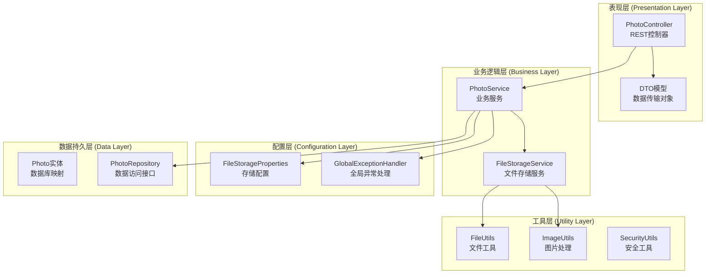
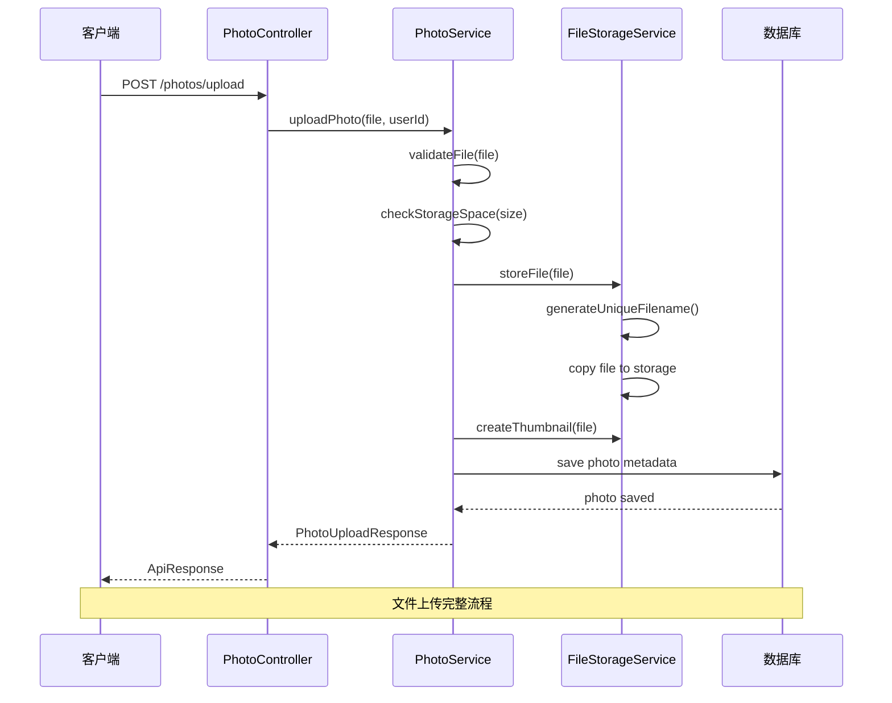
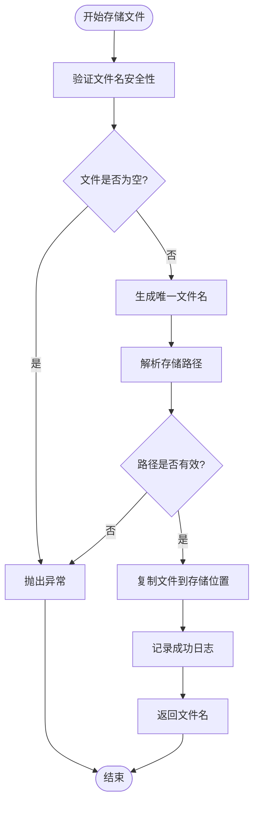
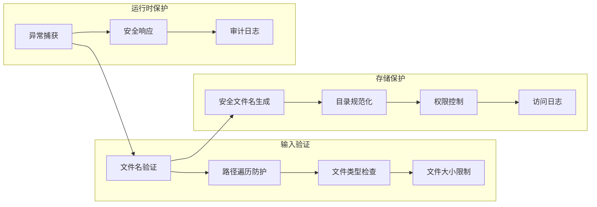
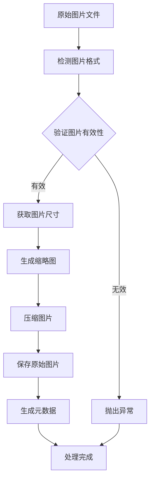
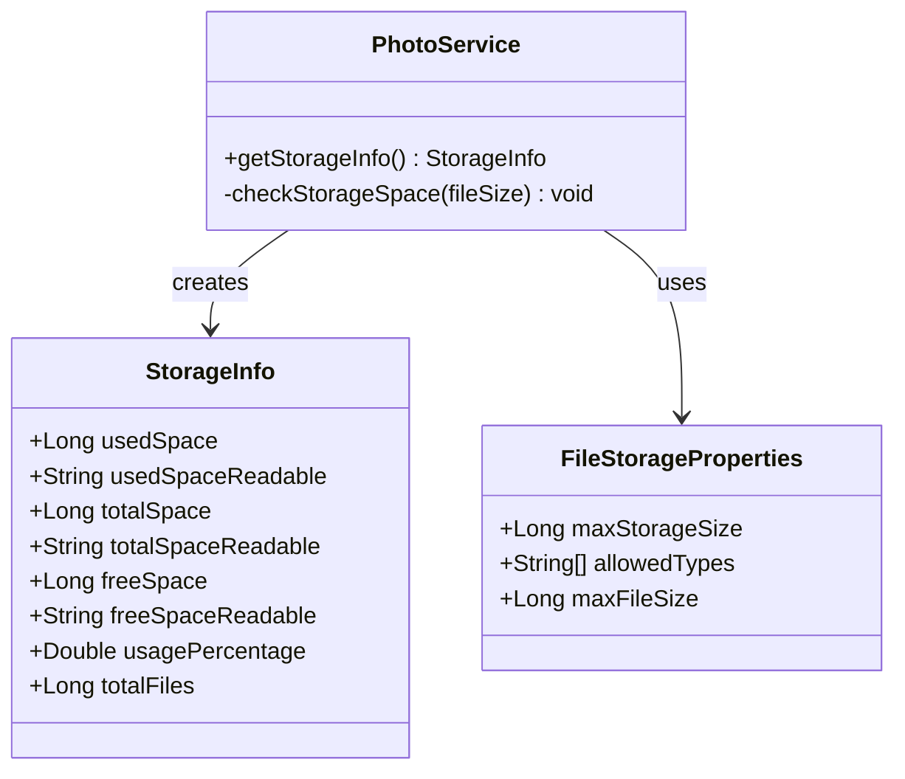
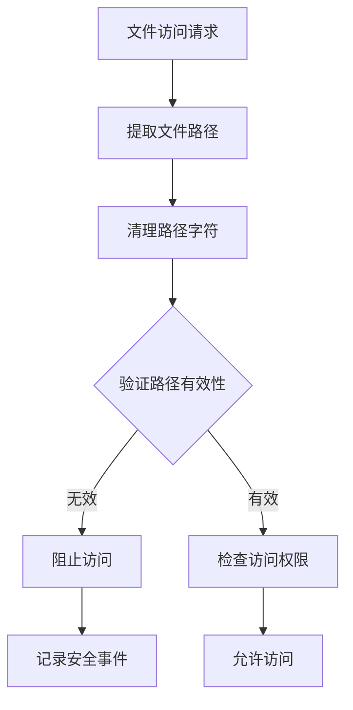
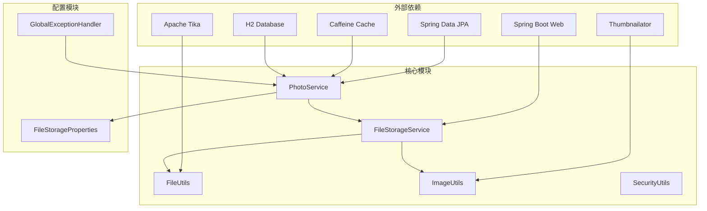

# 存储管理系统

<cite>
**本文档引用的文件**
- [FileStorageService.java](file://src/main/java/com/photo/service/FileStorageService.java)
- [FileUtils.java](file://src/main/java/com/photo/util/FileUtils.java)
- [FileStorageProperties.java](file://src/main/java/com/photo/config/FileStorageProperties.java)
- [StorageInfo.java](file://src/main/java/com/photo/dto/StorageInfo.java)
- [ImageUtils.java](file://src/main/java/com/photo/util/ImageUtils.java)
- [PhotoService.java](file://src/main/java/com/photo/service/PhotoService.java)
- [PhotoController.java](file://src/main/java/com/photo/controller/PhotoController.java)
- [application.yml](file://src/main/resources/application.yml)
- [GlobalExceptionHandler.java](file://src/main/java/com/photo/exception/GlobalExceptionHandler.java)
- [SecurityUtils.java](file://src/main/java/com/photo/util/SecurityUtils.java)
- [pom.xml](file://pom.xml)
- [schema.sql](file://src/main/resources/schema.sql)
</cite>

## 目录
1. [简介](#简介)
2. [项目结构](#项目结构)
3. [核心组件](#核心组件)
4. [架构概览](#架构概览)
5. [详细组件分析](#详细组件分析)
6. [依赖关系分析](#依赖关系分析)
7. [性能考虑](#性能考虑)
8. [故障排除指南](#故障排除指南)
9. [结论](#结论)
10. [附录](#附录)

## 简介

存储管理系统是一个基于Spring Boot构建的完整文件存储解决方案，专注于照片上传、管理和检索功能。该系统提供了安全的文件存储机制、智能的文件处理能力、完善的监控和管理功能，以及强大的安全防护措施。

系统的核心特性包括：
- 安全的文件存储和访问控制
- 智能的文件类型验证和防护
- 自动化的缩略图生成和图片压缩
- 分布式的存储空间监控
- 定时清理和维护机制
- 完善的异常处理和日志记录

## 项目结构

存储管理系统采用标准的Spring Boot项目结构，主要分为以下几个层次：

**图表来源**
- [PhotoController.java](file://src/main/java/com/photo/controller/PhotoController.java#L1-L316)
- [PhotoService.java](file://src/main/java/com/photo/service/PhotoService.java#L1-L385)
- [FileStorageService.java](file://src/main/java/com/photo/service/FileStorageService.java#L1-L300)

**章节来源**
- [PhotoController.java](file://src/main/java/com/photo/controller/PhotoController.java#L1-L316)
- [PhotoService.java](file://src/main/java/com/photo/service/PhotoService.java#L1-L385)
- [FileStorageService.java](file://src/main/java/com/photo/service/FileStorageService.java#L1-L300)

## 核心组件

### 文件存储服务 (FileStorageService)

文件存储服务是整个系统的核心组件，负责处理所有文件相关的操作。它提供了完整的文件生命周期管理功能：

- **文件存储**: 安全地存储上传的文件，生成唯一文件名
- **文件检索**: 提供文件的查找、读取和访问功能
- **文件管理**: 支持文件删除、清理和状态管理
- **缩略图处理**: 自动生成和管理缩略图
- **图片优化**: 提供图片压缩和格式转换功能

### 文件工具类 (FileUtils)

文件工具类提供了文件处理的核心功能，包括：
- 文件类型验证和检测
- 安全的文件名生成和清理
- 文件大小格式化
- MD5哈希计算用于重复文件检测

### 图片处理工具 (ImageUtils)

专门处理图片相关的功能：
- 图片尺寸获取和验证
- 缩略图生成和压缩
- 图片格式转换和质量控制
- 高级图片处理功能如水印添加

### 存储配置 (FileStorageProperties)

集中管理所有存储相关的配置：
- 存储路径配置
- 文件类型和大小限制
- 图片压缩参数
- 定时清理策略
- 存储容量限制

**章节来源**
- [FileStorageService.java](file://src/main/java/com/photo/service/FileStorageService.java#L1-L300)
- [FileUtils.java](file://src/main/java/com/photo/util/FileUtils.java#L1-L178)
- [ImageUtils.java](file://src/main/java/com/photo/util/ImageUtils.java#L1-L182)
- [FileStorageProperties.java](file://src/main/java/com/photo/config/FileStorageProperties.java#L1-L94)

## 架构概览

系统采用分层架构设计，确保了良好的关注点分离和可维护性：

**图表来源**
- [PhotoController.java](file://src/main/java/com/photo/controller/PhotoController.java#L48-L61)
- [PhotoService.java](file://src/main/java/com/photo/service/PhotoService.java#L50-L111)
- [FileStorageService.java](file://src/main/java/com/photo/service/FileStorageService.java#L59-L95)

系统架构的关键特点：
- **RESTful API设计**: 提供清晰的HTTP接口
- **事务管理**: 确保文件操作的一致性
- **缓存机制**: 使用Caffeine提升性能
- **异常处理**: 全局异常处理确保系统稳定性
- **安全防护**: 多层安全验证和防护机制

## 详细组件分析

### 文件存储服务详解

文件存储服务实现了完整的文件管理功能，包括安全的文件操作和智能的存储策略：

#### 文件存储流程

**图表来源**
- [FileStorageService.java](file://src/main/java/com/photo/service/FileStorageService.java#L59-L95)

#### 文件类型验证机制

系统采用多层文件类型验证确保安全性：

1. **MIME类型检测**: 使用Apache Tika进行准确的文件类型识别
2. **扩展名验证**: 检查文件扩展名的有效性
3. **内容验证**: 通过文件内容特征确认文件类型
4. **白名单控制**: 仅允许配置的文件类型

#### 安全防护措施

**图表来源**
- [FileUtils.java](file://src/main/java/com/photo/util/FileUtils.java#L168-L176)
- [SecurityUtils.java](file://src/main/java/com/photo/util/SecurityUtils.java#L133-L147)

**章节来源**
- [FileStorageService.java](file://src/main/java/com/photo/service/FileStorageService.java#L1-L300)
- [FileUtils.java](file://src/main/java/com/photo/util/FileUtils.java#L1-L178)
- [SecurityUtils.java](file://src/main/java/com/photo/util/SecurityUtils.java#L1-L167)

### 图片处理功能

系统提供了全面的图片处理能力，支持多种图片格式和处理需求：

#### 图片处理流水线

**图表来源**
- [ImageUtils.java](file://src/main/java/com/photo/util/ImageUtils.java#L53-L99)
- [PhotoService.java](file://src/main/java/com/photo/service/PhotoService.java#L78-L84)

#### 图片压缩策略

系统采用智能的图片压缩算法：
- **尺寸压缩**: 按最大宽度和高度限制调整图片尺寸
- **质量压缩**: 控制图片质量以平衡文件大小和视觉效果
- **格式优化**: 选择最适合的图片格式和编码参数
- **渐进式处理**: 支持原文件覆盖和临时文件处理

**章节来源**
- [ImageUtils.java](file://src/main/java/com/photo/util/ImageUtils.java#L1-L182)
- [PhotoService.java](file://src/main/java/com/photo/service/PhotoService.java#L1-L385)

### 存储空间监控

系统提供了完整的存储空间监控和管理功能：

#### 存储信息模型

**图表来源**
- [StorageInfo.java](file://src/main/java/com/photo/dto/StorageInfo.java#L1-L57)
- [PhotoService.java](file://src/main/java/com/photo/service/PhotoService.java#L254-L271)
- [FileStorageProperties.java](file://src/main/java/com/photo/config/FileStorageProperties.java#L64-L65)

#### 定时清理机制

系统实现了自动化的存储清理功能：
- **定时任务**: 基于Cron表达式的定期执行
- **过期检测**: 自动识别和清理过期文件
- **批量删除**: 高效处理大量文件的清理
- **日志记录**: 完整的清理过程审计

**章节来源**
- [PhotoService.java](file://src/main/java/com/photo/service/PhotoService.java#L276-L299)
- [StorageInfo.java](file://src/main/java/com/photo/dto/StorageInfo.java#L1-L57)

### 文件安全机制

系统实施了多层次的安全防护措施：

#### 路径遍历防护

**图表来源**
- [SecurityUtils.java](file://src/main/java/com/photo/util/SecurityUtils.java#L133-L147)
- [FileUtils.java](file://src/main/java/com/photo/util/FileUtils.java#L157-L163)

#### 防盗链机制

系统提供了灵活的防盗链配置：
- **Referer验证**: 检查请求来源域名
- **白名单控制**: 仅允许配置的域名访问
- **动态配置**: 支持运行时修改防盗链规则
- **日志记录**: 记录所有非法访问尝试

**章节来源**
- [SecurityUtils.java](file://src/main/java/com/photo/util/SecurityUtils.java#L62-L79)
- [PhotoController.java](file://src/main/java/com/photo/controller/PhotoController.java#L92-L97)

## 依赖关系分析

系统采用了模块化的依赖设计，确保了良好的可维护性和扩展性：

**图表来源**
- [pom.xml](file://pom.xml#L30-L150)
- [PhotoService.java](file://src/main/java/com/photo/service/PhotoService.java#L1-L36)

### 核心依赖说明

| 依赖名称 | 版本 | 用途 | 关键特性 |
|---------|------|------|----------|
| Spring Boot | 2.7.18 | 核心框架 | 自动配置、依赖注入 |
| Apache Tika | 2.9.1 | 文件类型检测 | 准确的MIME类型识别 |
| Thumbnailator | 0.4.19 | 图片处理 | 缩略图生成、压缩 |
| Caffeine | - | 缓存管理 | 高性能本地缓存 |
| H2 Database | - | 开发数据库 | 内嵌数据库支持 |

**章节来源**
- [pom.xml](file://pom.xml#L1-L169)

## 性能考虑

系统在设计时充分考虑了性能优化：

### 缓存策略

- **结果缓存**: 使用Caffeine缓存照片元数据
- **配置缓存**: 缓存存储配置信息
- **图片缓存**: 缓存常用图片的处理结果

### 异步处理

- **定时任务**: 使用@Scheduled注解处理后台任务
- **异步上传**: 支持大文件的异步处理
- **批量操作**: 优化批量文件处理性能

### 资源管理

- **连接池**: 数据库连接池配置
- **内存管理**: 大文件处理的内存优化
- **并发控制**: 线程安全的文件操作

## 故障排除指南

### 常见问题及解决方案

#### 文件上传失败

**问题**: 文件上传过程中出现异常
**可能原因**:
- 存储空间不足
- 文件类型不被允许
- 文件大小超出限制
- 权限问题

**解决步骤**:
1. 检查存储空间使用情况
2. 验证文件类型配置
3. 确认文件大小限制
4. 检查存储目录权限

#### 图片处理异常

**问题**: 图片处理失败或质量不佳
**可能原因**:
- 图片格式不支持
- 内存不足
- 配置参数不当

**解决步骤**:
1. 检查支持的图片格式
2. 增加系统内存
3. 调整压缩参数
4. 查看详细错误日志

#### 性能问题

**问题**: 系统响应缓慢
**可能原因**:
- 缓存未生效
- 数据库查询优化不足
- 并发访问过高

**解决步骤**:
1. 检查缓存配置
2. 优化数据库索引
3. 调整线程池配置
4. 实施负载均衡

**章节来源**
- [GlobalExceptionHandler.java](file://src/main/java/com/photo/exception/GlobalExceptionHandler.java#L1-L140)
- [PhotoService.java](file://src/main/java/com/photo/service/PhotoService.java#L276-L299)

## 结论

存储管理系统是一个功能完整、安全可靠的文件存储解决方案。系统通过精心设计的架构、完善的防护机制和高效的性能优化，为用户提供了一流的文件管理体验。

### 主要优势

1. **安全性**: 多层安全防护确保文件和系统的安全
2. **可靠性**: 完善的异常处理和监控机制
3. **可扩展性**: 模块化设计支持功能扩展
4. **易用性**: 清晰的API和详细的文档
5. **性能**: 优化的架构和缓存策略

### 未来发展方向

- **分布式存储**: 支持云存储和分布式文件系统
- **智能压缩**: 更先进的压缩算法和质量控制
- **AI集成**: 图片识别和智能分类功能
- **监控增强**: 更详细的性能监控和告警机制

## 附录

### 配置参考

#### 存储配置选项

| 配置项 | 默认值 | 说明 |
|--------|--------|------|
| file.storage.base-path | ./uploads | 基础存储目录 |
| file.storage.max-file-size | 10MB | 单文件最大大小 |
| file.storage.max-storage-size | 10GB | 总存储容量限制 |
| file.storage.thumbnail.width | 200px | 缩略图宽度 |
| file.storage.thumbnail.height | 200px | 缩略图高度 |
| file.storage.compression.enabled | true | 是否启用压缩 |

#### API端点

| 方法 | 路径 | 功能 |
|------|------|------|
| POST | /photos/upload | 上传单个文件 |
| POST | /photos/upload/batch | 批量上传文件 |
| GET | /photos/view/{filename} | 在线预览文件 |
| GET | /photos/download/{filename} | 下载文件 |
| GET | /photos/storage/info | 获取存储信息 |

### 开发指南

#### 新增文件类型支持

1. 在配置文件中添加新的MIME类型
2. 更新FileUtils中的允许类型列表
3. 测试文件类型检测功能
4. 验证文件上传和处理流程

#### 自定义存储策略

1. 扩展FileStorageService类
2. 实现自定义的文件命名策略
3. 添加新的文件处理功能
4. 更新相关的测试用例

**章节来源**
- [application.yml](file://src/main/resources/application.yml#L69-L118)
- [PhotoController.java](file://src/main/java/com/photo/controller/PhotoController.java#L48-L314)