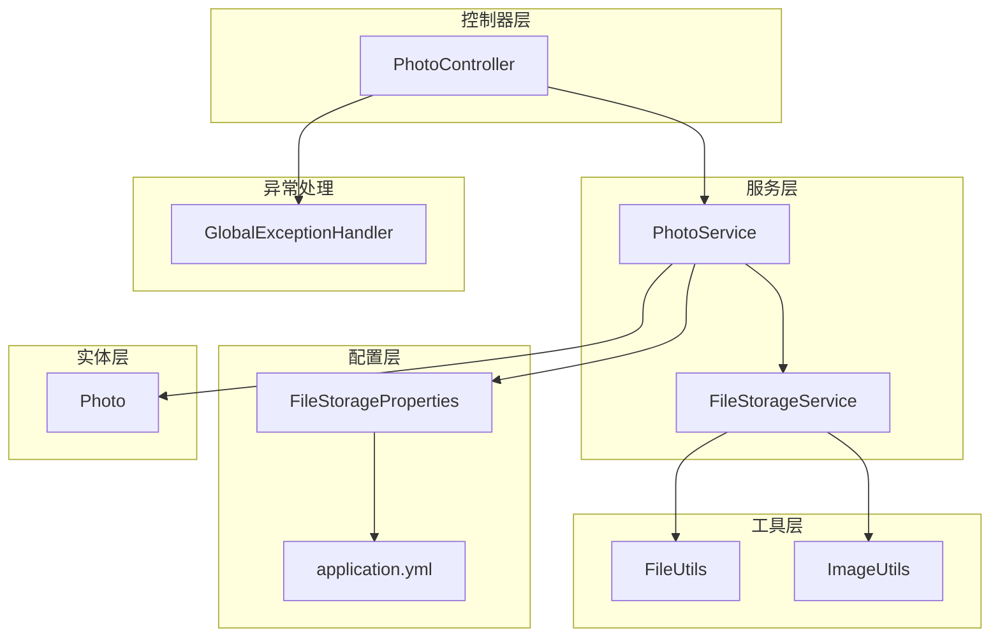
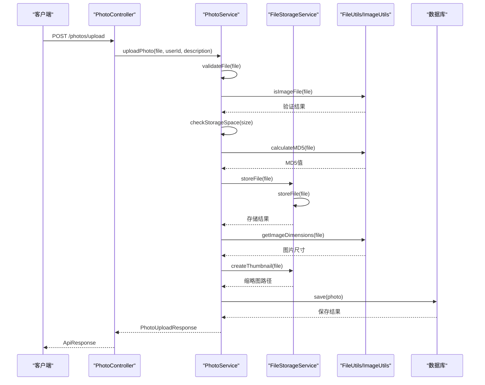
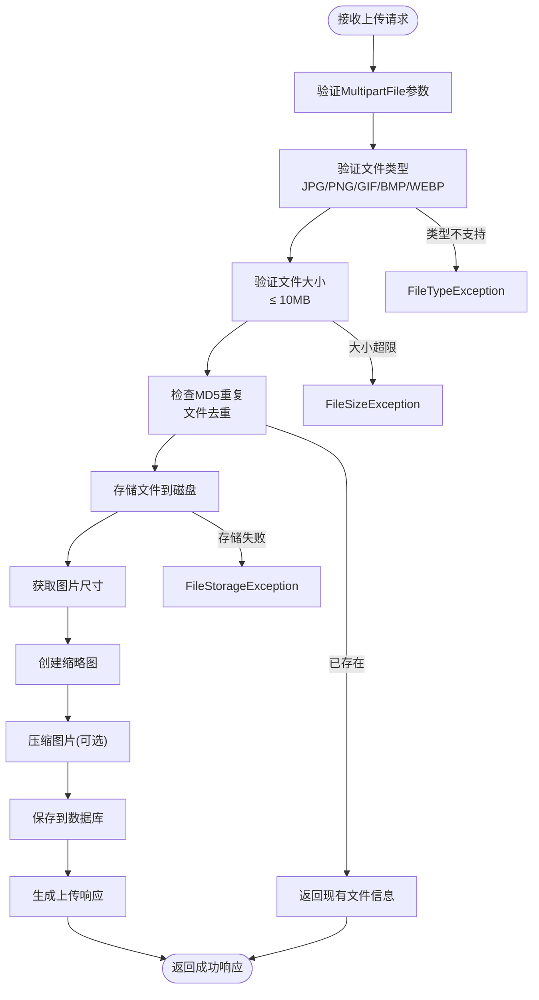
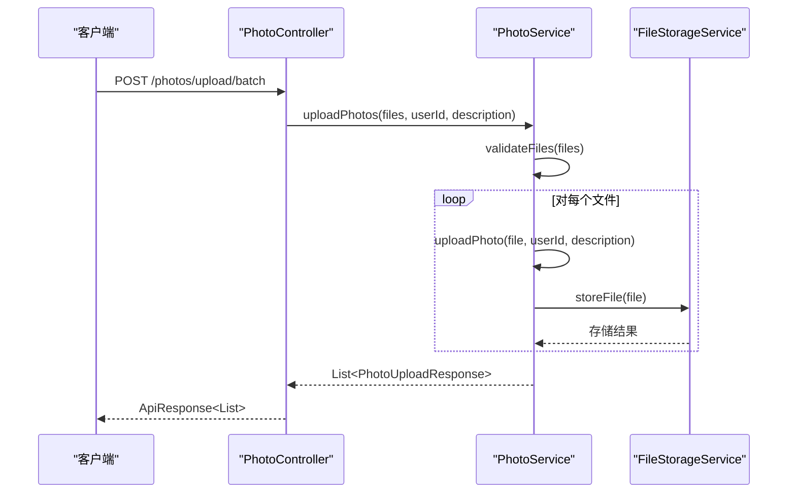
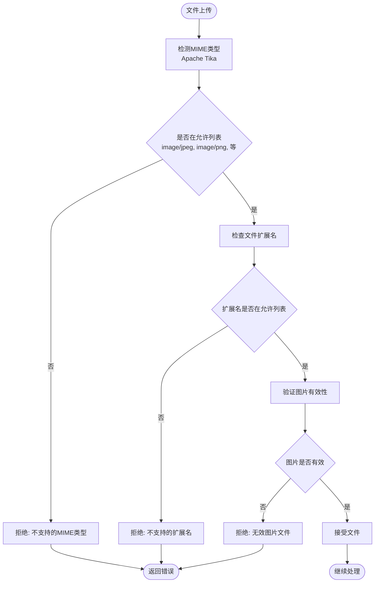
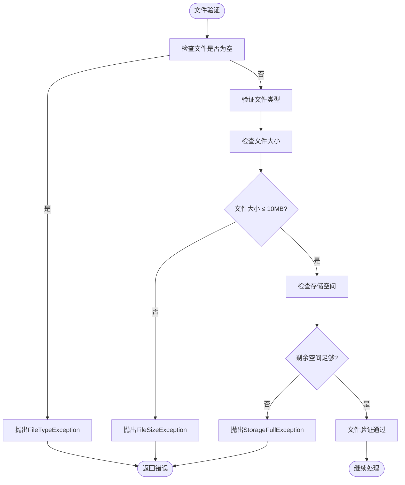
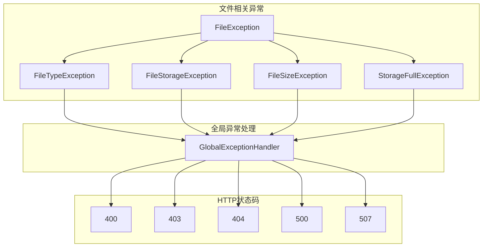
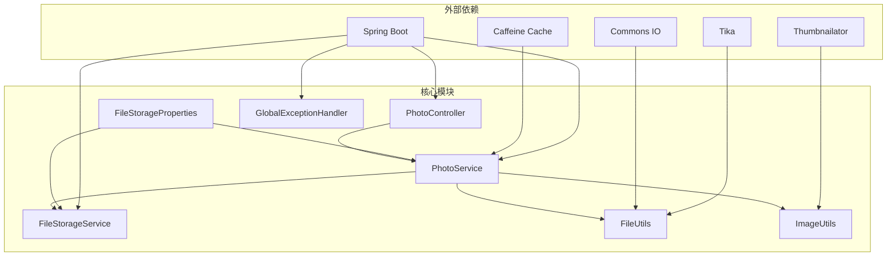
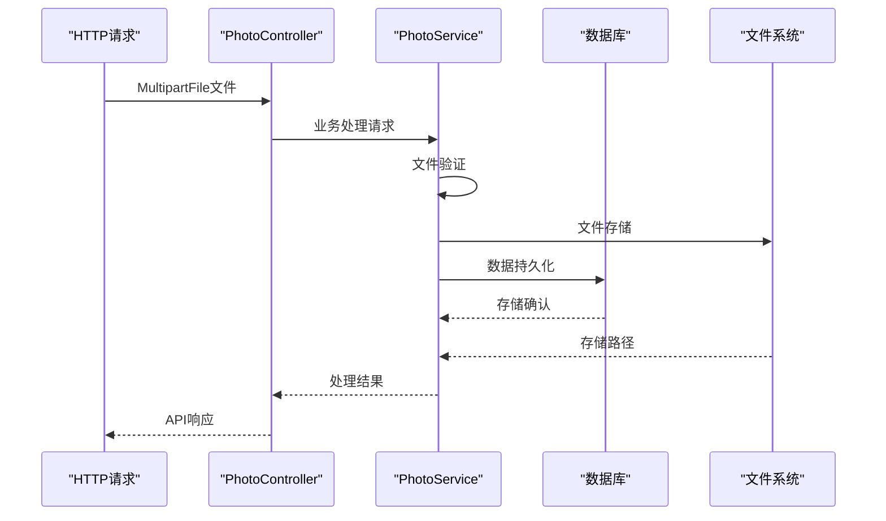
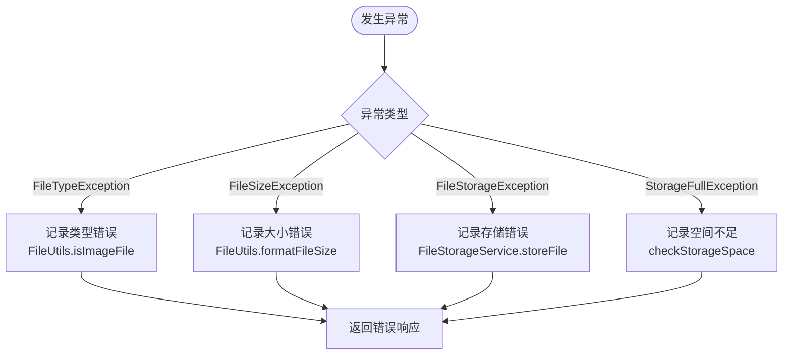

# 文件上传系统

<cite>
**本文档引用的文件**
- [PhotoController.java](file://src/main/java/com/photo/controller/PhotoController.java)
- [PhotoService.java](file://src/main/java/com/photo/service/PhotoService.java)
- [FileStorageService.java](file://src/main/java/com/photo/service/FileStorageService.java)
- [FileUtils.java](file://src/main/java/com/photo/util/FileUtils.java)
- [ImageUtils.java](file://src/main/java/com/photo/util/ImageUtils.java)
- [PhotoUploadResponse.java](file://src/main/java/com/photo/dto/PhotoUploadResponse.java)
- [FileStorageProperties.java](file://src/main/java/com/photo/config/FileStorageProperties.java)
- [GlobalExceptionHandler.java](file://src/main/java/com/photo/exception/GlobalExceptionHandler.java)
- [application.yml](file://src/main/resources/application.yml)
- [Photo.java](file://src/main/java/com/photo/entity/Photo.java)
- [ApiResponse.java](file://src/main/java/com/photo/dto/ApiResponse.java)
- [PhotoControllerTest.java](file://src/test/java/com/photo/controller/PhotoControllerTest.java)
- [pom.xml](file://pom.xml)
</cite>

## 目录
1. [简介](#简介)
2. [项目结构](#项目结构)
3. [核心组件](#核心组件)
4. [架构概览](#架构概览)
5. [详细组件分析](#详细组件分析)
6. [依赖关系分析](#依赖关系分析)
7. [性能考虑](#性能考虑)
8. [故障排除指南](#故障排除指南)
9. [结论](#结论)
10. [附录](#附录)

## 简介
本文件上传系统是一个基于Spring Boot构建的完整照片管理平台，支持单文件上传和批量上传功能。系统实现了严格的安全检查机制，包括文件类型验证、文件大小限制、防盗链保护和路径遍历防护。系统采用MultipartFile参数处理，支持JPG、PNG、GIF、BMP、WEBP等多种图片格式，最大文件大小限制为10MB。

## 项目结构
系统采用标准的Spring Boot分层架构，主要包含以下模块：



**图表来源**
- [PhotoController.java](file://src/main/java/com/photo/controller/PhotoController.java#L30-L316)
- [PhotoService.java](file://src/main/java/com/photo/service/PhotoService.java#L34-L385)
- [FileStorageService.java](file://src/main/java/com/photo/service/FileStorageService.java#L22-L300)

**章节来源**
- [PhotoController.java](file://src/main/java/com/photo/controller/PhotoController.java#L1-L316)
- [PhotoService.java](file://src/main/java/com/photo/service/PhotoService.java#L1-L385)
- [FileStorageService.java](file://src/main/java/com/photo/service/FileStorageService.java#L1-L300)

## 核心组件
系统的核心组件包括控制器、服务层、存储服务、工具类和配置管理，每个组件都有明确的职责分工：

### 控制器层
- **PhotoController**: 提供RESTful API接口，处理HTTP请求和响应
- 支持单文件上传、批量上传、文件预览、缩略图查看、文件下载等功能

### 服务层
- **PhotoService**: 核心业务逻辑处理，包括文件验证、存储管理和业务规则
- **FileStorageService**: 文件存储和管理，包括文件复制、路径验证和文件操作

### 工具层
- **FileUtils**: 文件工具类，负责文件类型检测、MD5计算、文件名清理
- **ImageUtils**: 图片处理工具，支持图片尺寸获取、缩略图创建、图片压缩

### 配置层
- **FileStorageProperties**: 文件存储配置，管理存储路径、大小限制、压缩设置
- **application.yml**: 应用程序配置文件，定义系统运行参数

**章节来源**
- [PhotoController.java](file://src/main/java/com/photo/controller/PhotoController.java#L27-L316)
- [PhotoService.java](file://src/main/java/com/photo/service/PhotoService.java#L31-L385)
- [FileStorageService.java](file://src/main/java/com/photo/service/FileStorageService.java#L19-L300)

## 架构概览
系统采用分层架构设计，确保关注点分离和代码可维护性：



**图表来源**
- [PhotoController.java](file://src/main/java/com/photo/controller/PhotoController.java#L48-L61)
- [PhotoService.java](file://src/main/java/com/photo/service/PhotoService.java#L50-L111)
- [FileStorageService.java](file://src/main/java/com/photo/service/FileStorageService.java#L59-L95)

## 详细组件分析

### 单文件上传实现
单文件上传是系统的核心功能，实现了完整的文件处理流程：

#### 请求处理流程


**图表来源**
- [PhotoService.java](file://src/main/java/com/photo/service/PhotoService.java#L50-L111)
- [FileUtils.java](file://src/main/java/com/photo/util/FileUtils.java#L55-L70)
- [FileStorageService.java](file://src/main/java/com/photo/service/FileStorageService.java#L59-L95)

#### 关键实现细节
1. **MultipartFile参数处理**: 使用`@RequestParam("file") MultipartFile file`接收文件参数
2. **文件类型验证**: 通过MIME类型检测和扩展名验证双重保障
3. **文件大小限制**: 配置文件中设置最大10MB限制
4. **文件去重机制**: 基于MD5哈希值的重复文件检测
5. **存储路径优化**: 使用UUID生成唯一文件名，避免冲突

**章节来源**
- [PhotoController.java](file://src/main/java/com/photo/controller/PhotoController.java#L48-L61)
- [PhotoService.java](file://src/main/java/com/photo/service/PhotoService.java#L50-L111)
- [FileUtils.java](file://src/main/java/com/photo/util/FileUtils.java#L55-L102)

### 批量上传实现
批量上传功能支持一次性上传多个文件，提供了更好的用户体验：

#### 批量处理流程


**图表来源**
- [PhotoController.java](file://src/main/java/com/photo/controller/PhotoController.java#L66-L79)
- [PhotoService.java](file://src/main/java/com/photo/service/PhotoService.java#L115-L136)

#### 批量上传特性
- **文件数量限制**: 最多支持10个文件同时上传
- **错误处理**: 单个文件上传失败不影响其他文件处理
- **事务管理**: 整体操作在事务中执行，保证数据一致性

**章节来源**
- [PhotoController.java](file://src/main/java/com/photo/controller/PhotoController.java#L66-L79)
- [PhotoService.java](file://src/main/java/com/photo/service/PhotoService.java#L115-L136)

### 文件类型验证机制
系统实现了多层次的文件类型验证，确保只有合法的图片文件能够被上传：

#### 验证流程


**图表来源**
- [FileUtils.java](file://src/main/java/com/photo/util/FileUtils.java#L55-L102)
- [ImageUtils.java](file://src/main/java/com/photo/util/ImageUtils.java#L127-L147)

#### 支持的文件格式
- **JPG/JPEG**: `image/jpeg`
- **PNG**: `image/png`
- **GIF**: `image/gif`
- **BMP**: `image/bmp`
- **WEBP**: `image/webp`

**章节来源**
- [FileUtils.java](file://src/main/java/com/photo/util/FileUtils.java#L24-L36)
- [FileUtils.java](file://src/main/java/com/photo/util/FileUtils.java#L55-L102)
- [application.yml](file://src/main/resources/application.yml#L78-L93)

### 文件大小限制实现
系统通过多层机制确保文件大小符合要求：

#### 大小限制配置
- **应用级限制**: Spring Boot配置文件中设置最大文件大小为10MB
- **业务级限制**: 自定义业务逻辑中设置最大存储空间为10GB
- **单次上传限制**: 最多支持10个文件同时上传

#### 大小验证流程


**图表来源**
- [PhotoService.java](file://src/main/java/com/photo/service/PhotoService.java#L304-L336)
- [application.yml](file://src/main/resources/application.yml#L94-L95)

**章节来源**
- [PhotoService.java](file://src/main/java/com/photo/service/PhotoService.java#L304-L336)
- [FileStorageProperties.java](file://src/main/java/com/photo/config/FileStorageProperties.java#L44-L45)
- [application.yml](file://src/main/resources/application.yml#L46-L47)

### 安全检查机制
系统实现了全面的安全防护措施：

#### 防盗链机制
```mermaid
flowchart TD
Request([文件访问请求]) --> CheckReferer["检查Referer头部"]
CheckReferer --> RefererEnabled{"防盗链开关启用?"}
RefererEnabled --> |否| AllowAccess["允许访问"]
RefererEnabled --> |是| ValidateDomain["验证域名白名单"]
ValidateDomain --> DomainAllowed{"域名在白名单中?"}
DomainAllowed --> |是| AllowAccess
DomainAllowed --> |否| DenyAccess["拒绝访问<br/>AccessDeniedException"]
AllowAccess --> LogAccess["记录访问日志"]
DenyAccess --> End([返回403)]
LogAccess --> End2([返回200)]
```

**图表来源**
- [PhotoController.java](file://src/main/java/com/photo/controller/PhotoController.java#L92-L97)

#### 路径遍历防护
系统通过多种方式防止路径遍历攻击：
- **文件名清理**: 使用`FileUtils.sanitizeFilename()`清理特殊字符
- **路径规范化**: 使用`Path.normalize()`确保路径安全
- **目录限制**: 严格限制文件只能存储在指定目录内

**章节来源**
- [PhotoController.java](file://src/main/java/com/photo/controller/PhotoController.java#L92-L97)
- [FileUtils.java](file://src/main/java/com/photo/util/FileUtils.java#L155-L176)
- [FileStorageService.java](file://src/main/java/com/photo/service/FileStorageService.java#L75-L82)

### 异常处理机制
系统实现了完善的异常处理机制，提供清晰的错误响应：

#### 异常分类处理


**图表来源**
- [GlobalExceptionHandler.java](file://src/main/java/com/photo/exception/GlobalExceptionHandler.java#L23-L138)

#### 错误响应格式
系统使用统一的API响应格式：
- **成功响应**: `{"code": 200, "message": "操作成功", "data": {...}, "timestamp": 1234567890}`
- **错误响应**: `{"code": 400, "message": "错误信息", "data": null, "timestamp": 1234567890}`

**章节来源**
- [GlobalExceptionHandler.java](file://src/main/java/com/photo/exception/GlobalExceptionHandler.java#L23-L138)
- [ApiResponse.java](file://src/main/java/com/photo/dto/ApiResponse.java#L10-L63)

## 依赖关系分析

### 核心依赖关系
系统的主要依赖关系如下：



**图表来源**
- [pom.xml](file://pom.xml#L30-L150)
- [PhotoController.java](file://src/main/java/com/photo/controller/PhotoController.java#L1-L316)

### 数据流分析
系统的数据流从HTTP请求到数据库存储的完整流程：



**图表来源**
- [PhotoService.java](file://src/main/java/com/photo/service/PhotoService.java#L50-L111)
- [FileStorageService.java](file://src/main/java/com/photo/service/FileStorageService.java#L59-L95)

**章节来源**
- [pom.xml](file://pom.xml#L30-L150)
- [PhotoService.java](file://src/main/java/com/photo/service/PhotoService.java#L50-L111)

## 性能考虑

### 文件去重优化
系统实现了基于MD5的文件去重机制，有效减少存储空间占用：

#### MD5计算流程
```mermaid
flowchart TD
Start([文件上传]) --> CalculateMD5["计算文件MD5哈希值"]
CalculateMD5 --> CheckDB["查询数据库是否已存在"]
CheckDB --> Exists{"文件已存在?"}
Exists --> |是| ReturnExisting["直接返回现有文件信息"]
Exists --> |否| ContinueProcess["继续文件处理流程"]
ReturnExisting --> End([节省存储空间])
ContinueProcess --> End2([正常处理)]
```

**图表来源**
- [PhotoService.java](file://src/main/java/com/photo/service/PhotoService.java#L60-L68)
- [FileUtils.java](file://src/main/java/com/photo/util/FileUtils.java#L107-L119)

### 存储路径优化
系统通过多种方式优化文件存储性能：

#### 存储策略优化
- **UUID文件名**: 使用随机UUID作为文件名，避免文件名冲突
- **目录结构**: 将文件按日期或用户ID组织，便于管理和查找
- **缓存机制**: 使用Caffeine缓存热点数据，减少数据库查询

#### 图片处理优化
- **异步处理**: 缩略图创建和图片压缩采用异步方式
- **质量控制**: 支持自定义压缩质量和尺寸限制
- **内存管理**: 合理控制图片加载和处理的内存使用

**章节来源**
- [FileUtils.java](file://src/main/java/com/photo/util/FileUtils.java#L41-L44)
- [FileStorageProperties.java](file://src/main/java/com/photo/config/FileStorageProperties.java#L72-L92)
- [application.yml](file://src/main/resources/application.yml#L50-L54)

### 性能监控
系统集成了Actuator监控功能，可以实时监控系统性能：

#### 监控指标
- **健康检查**: 系统运行状态监控
- **指标收集**: CPU、内存、磁盘使用率
- **日志分析**: 访问日志和错误日志分析

**章节来源**
- [application.yml](file://src/main/resources/application.yml#L174-L182)

## 故障排除指南

### 常见问题诊断
系统提供了详细的错误处理和日志记录机制：

#### 文件上传失败排查
1. **检查文件类型**: 确认文件扩展名和MIME类型在允许列表中
2. **验证文件大小**: 确认文件大小不超过10MB限制
3. **检查存储空间**: 确认剩余存储空间充足
4. **查看日志文件**: 分析系统日志定位具体错误原因

#### 异常处理流程


**图表来源**
- [GlobalExceptionHandler.java](file://src/main/java/com/photo/exception/GlobalExceptionHandler.java#L26-L76)

### 调试建议
1. **启用详细日志**: 在开发环境中启用DEBUG级别日志
2. **使用测试工具**: 利用Postman或curl进行API测试
3. **单元测试**: 运行现有的单元测试验证功能正确性
4. **性能测试**: 使用JMeter进行压力测试评估系统性能

**章节来源**
- [GlobalExceptionHandler.java](file://src/main/java/com/photo/exception/GlobalExceptionHandler.java#L26-L138)
- [PhotoControllerTest.java](file://src/test/java/com/photo/controller/PhotoControllerTest.java#L83-L173)

## 结论
本文件上传系统是一个功能完整、安全可靠的图片管理平台。系统通过多层验证机制确保文件安全性，通过文件去重和缓存优化提升性能，通过完善的异常处理提供良好的用户体验。系统的设计充分考虑了可扩展性和可维护性，为后续的功能扩展奠定了坚实基础。

## 附录

### API接口文档
系统提供完整的RESTful API接口：

#### 单文件上传
- **URL**: `POST /photos/upload`
- **参数**: `file`(MultipartFile), `userId`(String), `description`(String)
- **响应**: `ApiResponse<PhotoUploadResponse>`

#### 批量上传
- **URL**: `POST /photos/upload/batch`
- **参数**: `files`(MultipartFile[]), `userId`(String), `description`(String)
- **响应**: `ApiResponse<List<PhotoUploadResponse>>`

#### 文件预览
- **URL**: `GET /photos/view/{filename}`
- **参数**: `filename`(String)
- **响应**: `ResponseEntity<byte[]>`

#### 缩略图查看
- **URL**: `GET /photos/thumbnail/{filename}`
- **参数**: `filename`(String)
- **响应**: `ResponseEntity<byte[]>`

#### 文件下载
- **URL**: `GET /photos/download/{filename}`
- **参数**: `filename`(String)
- **响应**: `ResponseEntity<byte[]>`

### 配置参考
系统的关键配置项：

#### 文件存储配置
```yaml
file:
  storage:
    base-path: ./uploads          # 基础存储目录
    temp-path: ./uploads/temp     # 临时文件目录
    thumbnail-path: ./uploads/thumbnails  # 缩略图目录
    max-file-size: 10485760       # 最大文件大小(字节)
    max-storage-size: 10737418240  # 最大存储空间(字节)
    max-files-per-upload: 10      # 最大文件数
```

#### 安全配置
```yaml
security:
  referer:
    enabled: true                 # 启用防盗链
    allowed-domains:              # 允许的域名
      - localhost
      - 127.0.0.1
```

**章节来源**
- [application.yml](file://src/main/resources/application.yml#L69-L145)
- [PhotoController.java](file://src/main/java/com/photo/controller/PhotoController.java#L48-L117)