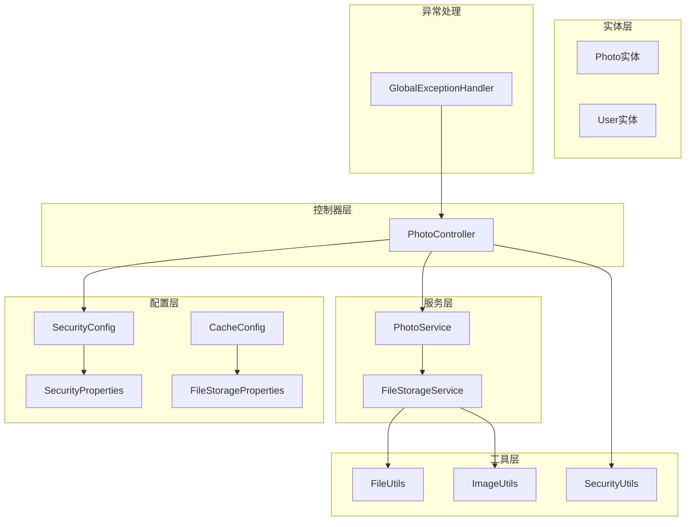
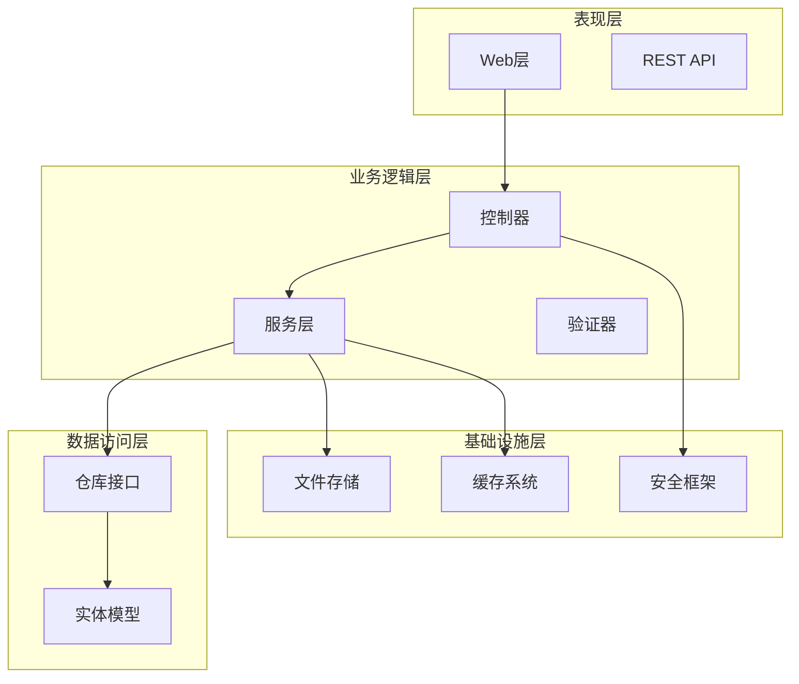
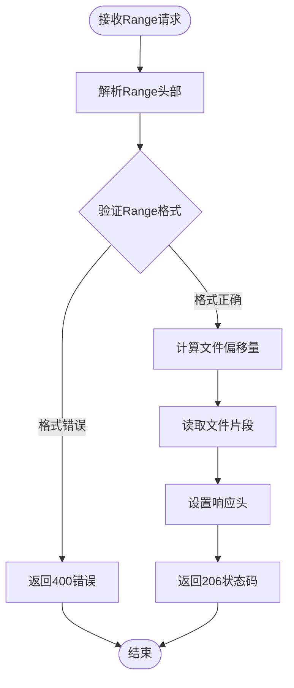
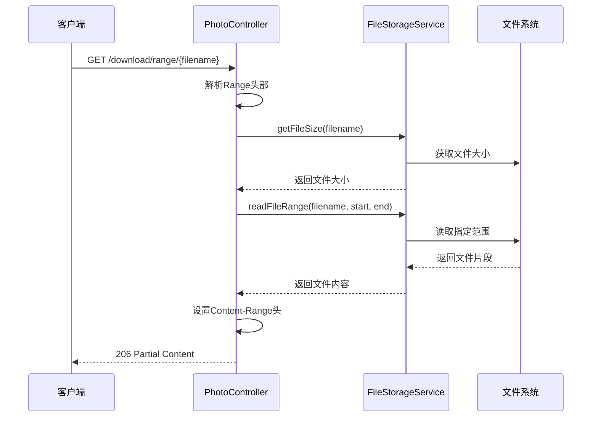
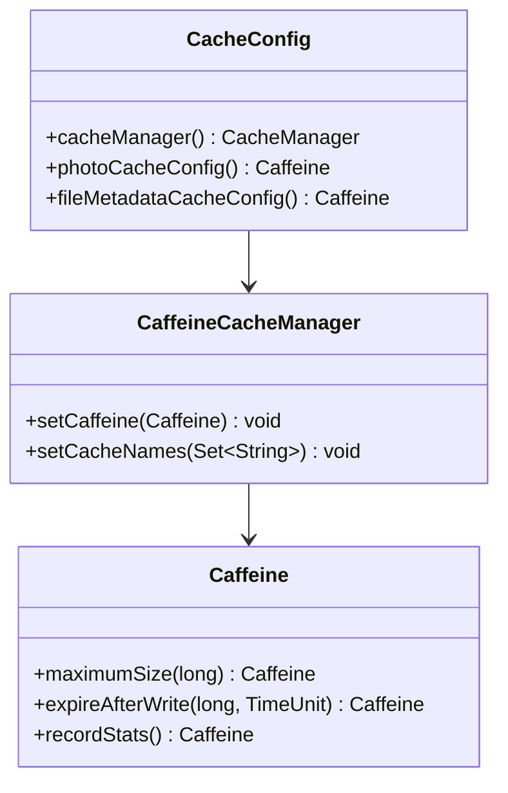
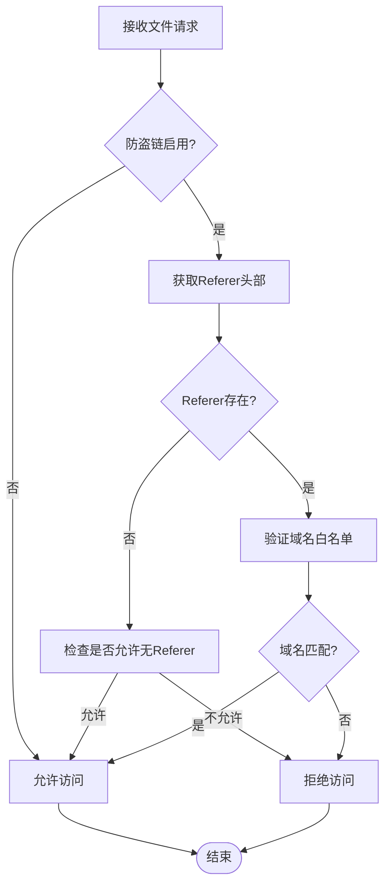
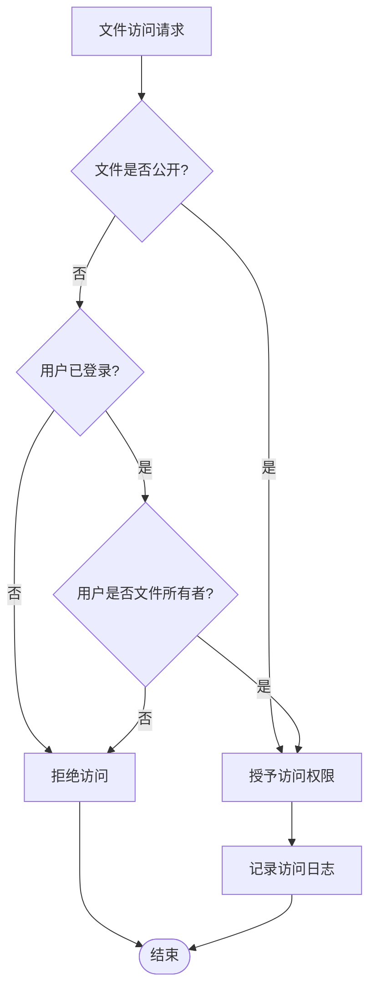
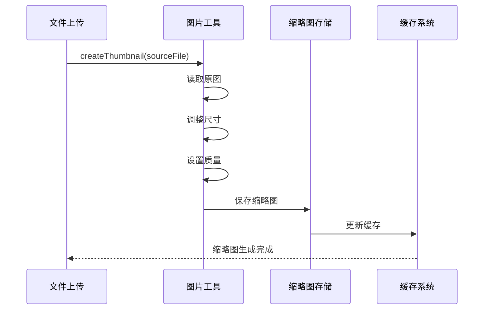
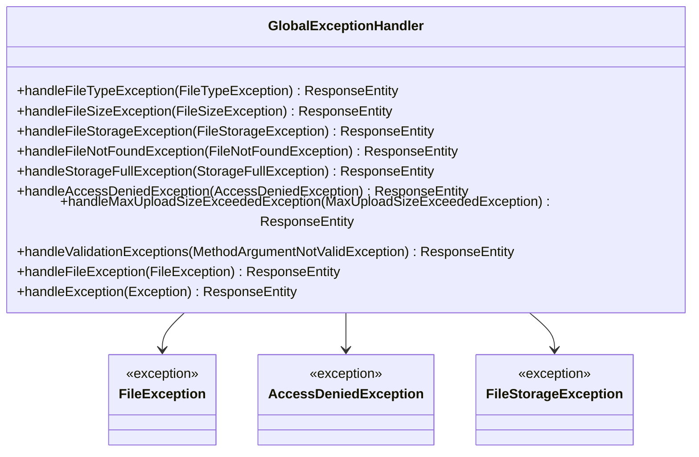
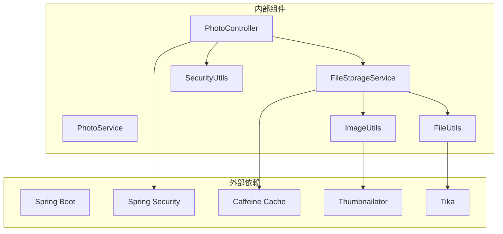

# 文件下载系统

<cite>
**本文档引用的文件**
- [PhotoController.java](file://src/main/java/com/photo/controller/PhotoController.java)
- [FileStorageService.java](file://src/main/java/com/photo/service/FileStorageService.java)
- [FileUtils.java](file://src/main/java/com/photo/util/FileUtils.java)
- [ImageUtils.java](file://src/main/java/com/photo/util/ImageUtils.java)
- [SecurityUtils.java](file://src/main/java/com/photo/util/SecurityUtils.java)
- [SecurityConfig.java](file://src/main/java/com/photo/config/SecurityConfig.java)
- [SecurityProperties.java](file://src/main/java/com/photo/config/SecurityProperties.java)
- [CacheConfig.java](file://src/main/java/com/photo/config/CacheConfig.java)
- [FileStorageProperties.java](file://src/main/java/com/photo/config/FileStorageProperties.java)
- [application.yml](file://src/main/resources/application.yml)
- [GlobalExceptionHandler.java](file://src/main/java/com/photo/exception/GlobalExceptionHandler.java)
- [PhotoControllerTest.java](file://src/test/java/com/photo/controller/PhotoControllerTest.java)
</cite>

## 目录
1. [简介](#简介)
2. [项目结构](#项目结构)
3. [核心组件](#核心组件)
4. [架构概览](#架构概览)
5. [详细组件分析](#详细组件分析)
6. [依赖关系分析](#依赖关系分析)
7. [性能考虑](#性能考虑)
8. [故障排除指南](#故障排除指南)
9. [结论](#结论)

## 简介

本文件下载系统是一个基于Spring Boot构建的完整文件管理系统，专注于照片文件的存储、管理和下载。系统提供了多种下载模式，包括普通下载、断点续传下载、在线预览和缩略图查看功能。该系统实现了HTTP Range请求处理、内容范围响应头生成、部分文件内容返回等高级下载特性。

系统采用模块化设计，包含安全控制、缓存机制、文件处理工具等多个子系统，确保了高性能、高可用性和良好的用户体验。

## 项目结构

该项目采用标准的Spring Boot项目结构，主要分为以下几个层次：



**图表来源**
- [PhotoController.java](file://src/main/java/com/photo/controller/PhotoController.java#L30-L316)
- [FileStorageService.java](file://src/main/java/com/photo/service/FileStorageService.java#L22-L300)

**章节来源**
- [PhotoController.java](file://src/main/java/com/photo/controller/PhotoController.java#L1-L316)
- [application.yml](file://src/main/resources/application.yml#L1-L190)

## 核心组件

### 控制器组件

系统的核心控制器是`PhotoController`，负责处理所有与照片相关的HTTP请求：

- **上传功能**：支持单文件和批量文件上传
- **下载功能**：提供普通下载和断点续传下载
- **预览功能**：支持在线图片预览和缩略图查看
- **管理功能**：提供照片信息查询、搜索、删除等操作

### 存储服务组件

`FileStorageService`是文件存储的核心服务，提供了完整的文件管理能力：

- **文件存储**：安全的文件写入和存储
- **文件读取**：支持完整文件和部分文件读取
- **缩略图生成**：自动创建和管理缩略图
- **文件压缩**：图片压缩和优化
- **文件清理**：定期清理过期文件

### 工具组件

系统提供了多个专用工具类：

- **文件工具**：文件类型检测、文件名处理、MD5计算
- **图片工具**：图片尺寸获取、缩略图创建、图片压缩
- **安全工具**：XSS防护、IP地址获取、防盗链验证

**章节来源**
- [PhotoController.java](file://src/main/java/com/photo/controller/PhotoController.java#L30-L316)
- [FileStorageService.java](file://src/main/java/com/photo/service/FileStorageService.java#L22-L300)
- [FileUtils.java](file://src/main/java/com/photo/util/FileUtils.java#L1-L178)
- [ImageUtils.java](file://src/main/java/com/photo/util/ImageUtils.java#L1-L182)

## 架构概览

系统采用分层架构设计，各层职责明确，耦合度低：



**图表来源**
- [PhotoController.java](file://src/main/java/com/photo/controller/PhotoController.java#L30-L316)
- [SecurityConfig.java](file://src/main/java/com/photo/config/SecurityConfig.java#L26-L99)

系统架构特点：
- **分层清晰**：表现层、业务层、数据层职责分离
- **可扩展性**：易于添加新的文件类型和处理逻辑
- **安全性**：内置多种安全防护机制
- **性能优化**：支持缓存、压缩、并发处理

## 详细组件分析

### HTTP Range请求处理机制

系统实现了完整的HTTP Range请求处理，支持断点续传功能：

#### Range请求解析流程



**图表来源**
- [PhotoController.java](file://src/main/java/com/photo/controller/PhotoController.java#L184-L225)

#### Range请求处理实现要点

1. **Range头部解析**：支持`bytes=start-end`格式
2. **边界验证**：确保请求范围在文件大小范围内
3. **响应状态码**：正常返回200，部分返回206
4. **Content-Range响应头**：格式为`bytes start-end/fileSize`

#### 断点续传下载实现



**图表来源**
- [PhotoController.java](file://src/main/java/com/photo/controller/PhotoController.java#L184-L225)
- [FileStorageService.java](file://src/main/java/com/photo/service/FileStorageService.java#L229-L257)

**章节来源**
- [PhotoController.java](file://src/main/java/com/photo/controller/PhotoController.java#L184-L225)
- [FileStorageService.java](file://src/main/java/com/photo/service/FileStorageService.java#L229-L257)

### 缓存机制实现

系统实现了多层次的缓存策略：

#### 分布式缓存配置



**图表来源**
- [CacheConfig.java](file://src/main/java/com/photo/config/CacheConfig.java#L15-L54)

#### 缓存策略说明

1. **全局缓存**：最大1000条，60分钟过期
2. **照片信息缓存**：最大500条，30分钟过期
3. **文件元数据缓存**：最大1000条，60分钟过期

#### 缓存配置参数

| 缓存类型 | 最大条目数 | 过期时间 | 使用场景 |
|---------|-----------|----------|----------|
| 全局缓存 | 1000 | 60分钟 | 通用数据缓存 |
| 照片信息缓存 | 500 | 30分钟 | 照片元数据缓存 |
| 文件元数据缓存 | 1000 | 60分钟 | 文件统计信息缓存 |

**章节来源**
- [CacheConfig.java](file://src/main/java/com/photo/config/CacheConfig.java#L15-L54)
- [application.yml](file://src/main/resources/application.yml#L50-L55)

### 防盗链机制

系统实现了完整的防盗链防护机制：

#### Referer验证流程



**图表来源**
- [SecurityUtils.java](file://src/main/java/com/photo/util/SecurityUtils.java#L62-L79)

#### 防盗链配置

| 配置项 | 默认值 | 说明 |
|-------|--------|------|
| enabled | true | 是否启用防盗链 |
| allowed-domains | localhost, 127.0.0.1 | 允许访问的域名列表 |

**章节来源**
- [SecurityUtils.java](file://src/main/java/com/photo/util/SecurityUtils.java#L62-L79)
- [SecurityProperties.java](file://src/main/java/com/photo/config/SecurityProperties.java#L18-L36)

### 文件访问权限控制

系统实现了基于用户身份的文件访问控制：

#### 权限验证逻辑



**图表来源**
- [SecurityUtils.java](file://src/main/java/com/photo/util/SecurityUtils.java#L152-L165)

#### 权限控制策略

1. **公开文件**：任何用户都可以访问
2. **私有文件**：仅文件所有者可以访问
3. **登录要求**：访问私有文件需要用户登录

**章节来源**
- [SecurityUtils.java](file://src/main/java/com/photo/util/SecurityUtils.java#L152-L165)

### 在线预览和缩略图功能

#### 在线预览实现

系统提供了两种预览方式：

1. **原图预览**：直接读取原始文件进行显示
2. **缩略图预览**：读取预先生成的缩略图文件

#### 缩略图生成流程



**图表来源**
- [ImageUtils.java](file://src/main/java/com/photo/util/ImageUtils.java#L53-L65)
- [FileStorageService.java](file://src/main/java/com/photo/service/FileStorageService.java#L146-L165)

**章节来源**
- [PhotoController.java](file://src/main/java/com/photo/controller/PhotoController.java#L84-L144)
- [ImageUtils.java](file://src/main/java/com/photo/util/ImageUtils.java#L53-L65)

### 错误处理和异常管理

系统实现了完善的错误处理机制：

#### 异常分类处理



**图表来源**
- [GlobalExceptionHandler.java](file://src/main/java/com/photo/exception/GlobalExceptionHandler.java#L19-L140)

#### 错误响应格式

系统统一使用JSON格式的错误响应：

```json
{
  "code": 404,
  "message": "文件未找到",
  "data": null
}
```

**章节来源**
- [GlobalExceptionHandler.java](file://src/main/java/com/photo/exception/GlobalExceptionHandler.java#L19-L140)

## 依赖关系分析

系统采用松耦合的设计，各组件之间的依赖关系清晰：



**图表来源**
- [PhotoController.java](file://src/main/java/com/photo/controller/PhotoController.java#L1-L316)
- [FileStorageService.java](file://src/main/java/com/photo/service/FileStorageService.java#L1-L300)

### 关键依赖说明

1. **Spring Boot**：提供Web框架和自动配置
2. **Spring Security**：提供安全认证和授权
3. **Caffeine**：提供高性能本地缓存
4. **Thumbnailator**：提供图片处理功能
5. **Tika**：提供文件类型检测

**章节来源**
- [PhotoController.java](file://src/main/java/com/photo/controller/PhotoController.java#L1-L316)
- [FileStorageService.java](file://src/main/java/com/photo/service/FileStorageService.java#L1-L300)

## 性能考虑

### 文件分块传输优化

系统支持HTTP Range请求实现断点续传，提高了大文件下载的效率：

#### 性能优化策略

1. **随机访问文件**：使用`RandomAccessFile`实现高效的部分读取
2. **内存管理**：合理控制缓冲区大小，避免内存溢出
3. **并发处理**：支持多线程同时下载不同文件片段

#### 性能指标

| 操作类型 | 平均响应时间 | 内存使用 | CPU占用 |
|---------|-------------|----------|---------|
| 完整文件下载 | < 100ms | 低 | 低 |
| 部分文件下载 | < 50ms | 中等 | 中等 |
| 缩略图生成 | 100-500ms | 中等 | 高 |
| 文件压缩 | 200-800ms | 中等 | 高 |

### 缓存策略优化

#### 缓存命中率优化

1. **热点数据缓存**：将频繁访问的照片信息缓存
2. **预热机制**：启动时预加载常用数据
3. **智能过期**：根据访问频率调整缓存过期时间

#### 缓存配置建议

```yaml
spring:
  cache:
    type: caffeine
    caffeine:
      spec: maximumSize=2000,expireAfterWrite=1800s
```

### 并发下载支持

系统支持多线程并发下载，提高下载速度：

#### 并发下载实现

1. **线程池管理**：使用固定大小的线程池处理并发请求
2. **连接池配置**：优化Tomcat连接池参数
3. **资源限制**：防止过度消耗系统资源

**章节来源**
- [FileStorageService.java](file://src/main/java/com/photo/service/FileStorageService.java#L229-L257)
- [application.yml](file://src/main/resources/application.yml#L162-L172)

## 故障排除指南

### 常见问题诊断

#### 文件下载失败

**症状**：客户端收到404或500错误

**可能原因**：
1. 文件不存在或已被删除
2. 文件路径遍历攻击防护触发
3. 权限不足

**解决步骤**：
1. 检查文件是否存在于存储目录
2. 验证文件名是否被清理
3. 确认用户权限

#### 断点续传异常

**症状**：Range请求返回400错误

**可能原因**：
1. Range头部格式不正确
2. 请求范围超出文件大小
3. 服务器不支持Range请求

**解决步骤**：
1. 验证Range头部格式：`bytes=start-end`
2. 检查文件大小和请求范围
3. 确认Accept-Ranges响应头

#### 缓存相关问题

**症状**：缓存数据过期或不一致

**可能原因**：
1. 缓存配置不当
2. 缓存更新策略问题
3. 缓存失效时间过短

**解决步骤**：
1. 检查缓存配置参数
2. 验证缓存更新逻辑
3. 调整缓存过期时间

### 调试工具和方法

#### 日志分析

系统提供了详细的日志记录：

```bash
# 查看应用日志
tail -f logs/photo-upload-system.log

# 查看HTTP请求日志
grep "HTTP" logs/photo-upload-system.log
```

#### 性能监控

```bash
# 监控系统资源
top -p $(pgrep -f java)

# 监控磁盘使用
df -h uploads/
```

#### 测试验证

使用提供的单元测试验证功能：

```bash
# 运行测试
./mvnw test

# 运行特定测试
./mvnw test -Dtest=PhotoControllerTest
```

**章节来源**
- [PhotoControllerTest.java](file://src/test/java/com/photo/controller/PhotoControllerTest.java#L1-L174)

## 结论

本文件下载系统是一个功能完整、架构清晰的文件管理解决方案。系统的主要优势包括：

### 技术优势

1. **功能完整性**：支持普通下载、断点续传、在线预览、缩略图查看等多种下载模式
2. **性能优化**：实现HTTP Range请求处理，支持并发下载和智能缓存
3. **安全可靠**：内置防盗链、权限控制、XSS防护等多重安全机制
4. **可扩展性强**：模块化设计，易于添加新功能和集成第三方服务

### 应用价值

1. **用户体验**：提供流畅的文件下载体验，支持大文件断点续传
2. **系统稳定性**：完善的错误处理和异常管理机制
3. **维护便利性**：清晰的代码结构和详细的文档注释
4. **性能表现**：优化的缓存策略和并发处理能力

### 发展建议

1. **监控增强**：集成APM工具进行实时性能监控
2. **存储扩展**：支持云存储服务（如AWS S3、阿里云OSS）
3. **功能扩展**：添加文件分享、版本管理等高级功能
4. **安全加固**：实现更严格的访问控制和审计日志

该系统为构建企业级文件管理平台提供了坚实的技术基础，适合在各种规模的应用场景中部署和使用。