# 核心功能模块

<cite>
**本文引用的文件**
- [PhotoController.java](file://src/main/java/com/photo/controller/PhotoController.java)
- [PhotoService.java](file://src/main/java/com/photo/service/PhotoService.java)
- [FileStorageService.java](file://src/main/java/com/photo/service/FileStorageService.java)
- [Photo.java](file://src/main/java/com/photo/entity/Photo.java)
- [PhotoRepository.java](file://src/main/java/com/photo/repository/PhotoRepository.java)
- [FileStorageProperties.java](file://src/main/java/com/photo/config/FileStorageProperties.java)
- [FileUtils.java](file://src/main/java/com/photo/util/FileUtils.java)
- [ImageUtils.java](file://src/main/java/com/photo/util/ImageUtils.java)
- [application.yml](file://src/main/resources/application.yml)
- [PhotoUploadResponse.java](file://src/main/java/com/photo/dto/PhotoUploadResponse.java)
- [GlobalExceptionHandler.java](file://src/main/java/com/photo/exception/GlobalExceptionHandler.java)
- [PhotoControllerTest.java](file://src/test/java/com/photo/controller/PhotoControllerTest.java)
- [pom.xml](file://pom.xml)
</cite>

## 目录
1. [简介](#简介)
2. [项目结构](#项目结构)
3. [核心组件](#核心组件)
4. [架构概览](#架构概览)
5. [详细组件分析](#详细组件分析)
6. [依赖关系分析](#依赖关系分析)
7. [性能考虑](#性能考虑)
8. [故障排除指南](#故障排除指南)
9. [结论](#结论)
10. [附录](#附录)

## 简介
本项目是一个基于Spring Boot构建的照片上传下载系统，提供了完整的文件管理功能。系统采用分层架构设计，包含文件上传系统、文件下载系统、照片管理服务等核心模块。主要特性包括：
- 单文件和批量文件上传
- 类型验证和大小限制
- 断点续传下载
- 在线预览和缩略图生成
- 照片管理和数据持久化
- 存储空间管理和定期清理
- 安全防盗链和权限控制

## 项目结构
项目采用标准的Spring Boot多模块结构，按照功能域进行组织：

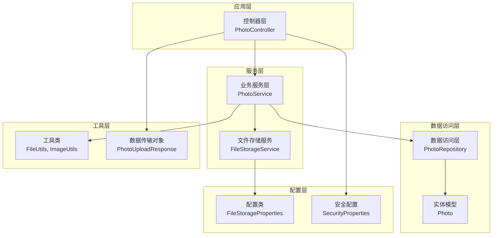

**图表来源**
- [PhotoController.java](file://src/main/java/com/photo/controller/PhotoController.java#L30-L316)
- [PhotoService.java](file://src/main/java/com/photo/service/PhotoService.java#L34-L385)
- [FileStorageService.java](file://src/main/java/com/photo/service/FileStorageService.java#L22-L300)

**章节来源**
- [PhotoController.java](file://src/main/java/com/photo/controller/PhotoController.java#L1-L316)
- [PhotoService.java](file://src/main/java/com/photo/service/PhotoService.java#L1-L385)
- [FileStorageService.java](file://src/main/java/com/photo/service/FileStorageService.java#L1-L300)

## 核心组件
系统由以下核心组件构成：

### 控制器层
- **PhotoController**: 提供RESTful API接口，处理HTTP请求和响应
- **全局异常处理器**: 统一处理各种业务异常和系统异常

### 服务层
- **PhotoService**: 核心业务逻辑处理，包含上传、下载、查询等功能
- **FileStorageService**: 文件存储和管理，负责文件的读写操作

### 数据访问层
- **PhotoRepository**: 数据访问接口，提供数据库操作方法
- **Photo实体**: ORM映射实体，定义照片数据结构

### 工具和配置
- **FileStorageProperties**: 文件存储配置管理
- **FileUtils**: 文件操作工具类
- **ImageUtils**: 图像处理工具类

**章节来源**
- [PhotoController.java](file://src/main/java/com/photo/controller/PhotoController.java#L30-L316)
- [PhotoService.java](file://src/main/java/com/photo/service/PhotoService.java#L34-L385)
- [FileStorageService.java](file://src/main/java/com/photo/service/FileStorageService.java#L22-L300)
- [PhotoRepository.java](file://src/main/java/com/photo/repository/PhotoRepository.java#L19-L112)

## 架构概览
系统采用经典的三层架构模式，结合Spring Boot的依赖注入和AOP特性：

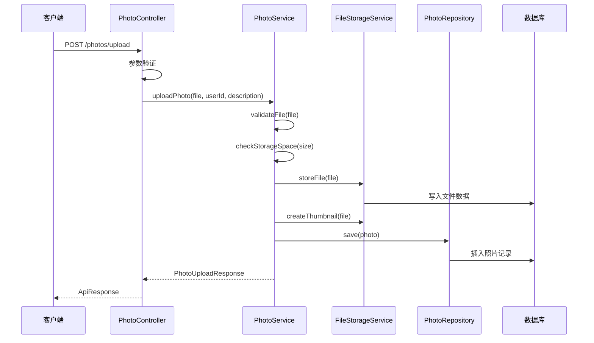

**图表来源**
- [PhotoController.java](file://src/main/java/com/photo/controller/PhotoController.java#L48-L61)
- [PhotoService.java](file://src/main/java/com/photo/service/PhotoService.java#L50-L111)
- [FileStorageService.java](file://src/main/java/com/photo/service/FileStorageService.java#L59-L95)

系统架构特点：
- **分层清晰**: 控制器、服务、数据访问层职责明确
- **依赖注入**: 使用Spring容器管理组件生命周期
- **事务管理**: 关键业务操作使用@Transactional注解
- **缓存机制**: 使用@EnableCaching和@Cacheable实现缓存
- **异常处理**: 全局异常处理器统一处理错误

## 详细组件分析

### 文件上传系统

#### 单文件上传流程
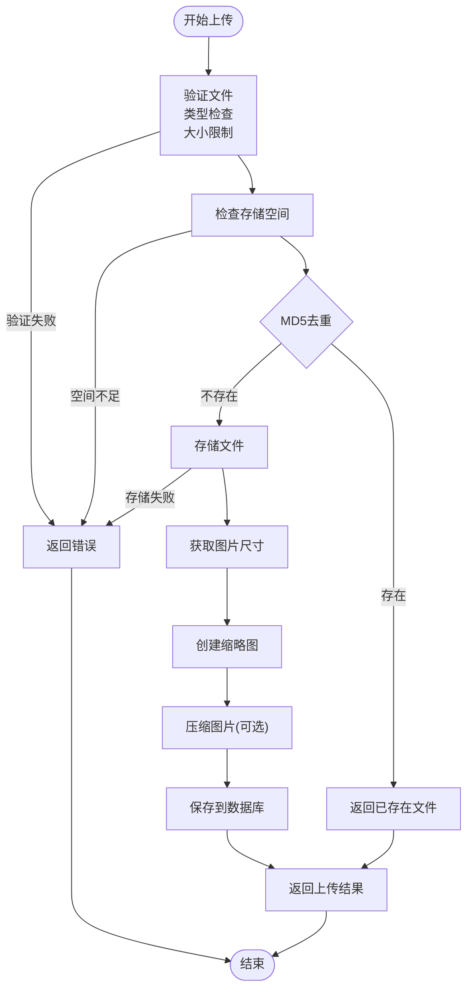

**图表来源**
- [PhotoService.java](file://src/main/java/com/photo/service/PhotoService.java#L50-L111)
- [FileStorageService.java](file://src/main/java/com/photo/service/FileStorageService.java#L59-L95)

#### 批量上传实现
批量上传支持最多10个文件同时上传，采用循环处理方式：

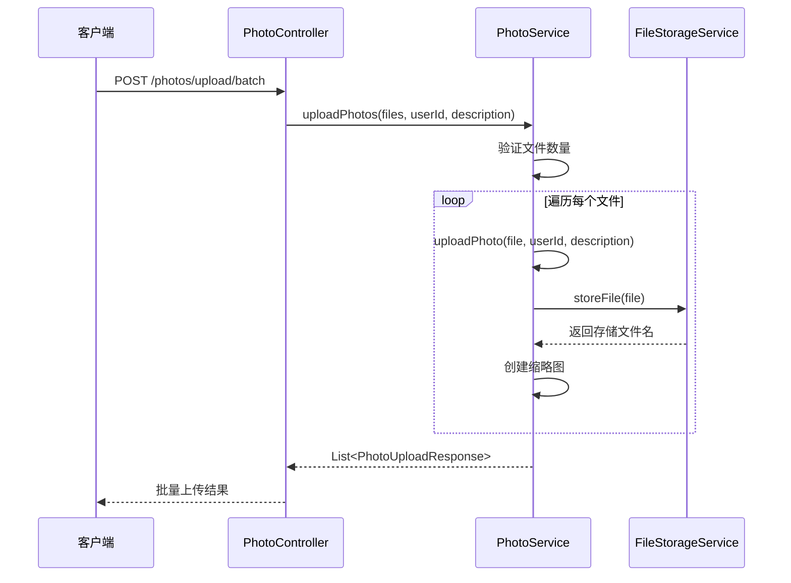

**图表来源**
- [PhotoController.java](file://src/main/java/com/photo/controller/PhotoController.java#L66-L79)
- [PhotoService.java](file://src/main/java/com/photo/service/PhotoService.java#L116-L136)

#### 文件验证机制
系统实现了多层次的文件验证：

| 验证类型 | 验证规则 | 实现方式 |
|---------|---------|----------|
| 文件类型 | 支持JPG、PNG、GIF、BMP、WEBP | FileUtils.isImageFile() |
| 文件大小 | 最大10MB | FileStorageProperties.maxFileSize |
| 文件扩展名 | 白名单验证 | ALLOWED_IMAGE_EXTENSIONS |
| 图片有效性 | 使用ImageIO验证 | ImageUtils.isValidImage() |
| 文件名安全 | 防止路径遍历攻击 | FileUtils.isValidFilename() |

**章节来源**
- [PhotoService.java](file://src/main/java/com/photo/service/PhotoService.java#L302-L336)
- [FileUtils.java](file://src/main/java/com/photo/util/FileUtils.java#L54-L102)
- [ImageUtils.java](file://src/main/java/com/photo/util/ImageUtils.java#L127-L147)

### 文件下载系统

#### 普通下载实现
普通下载支持完整的文件传输，包含缓存控制和文件名处理：

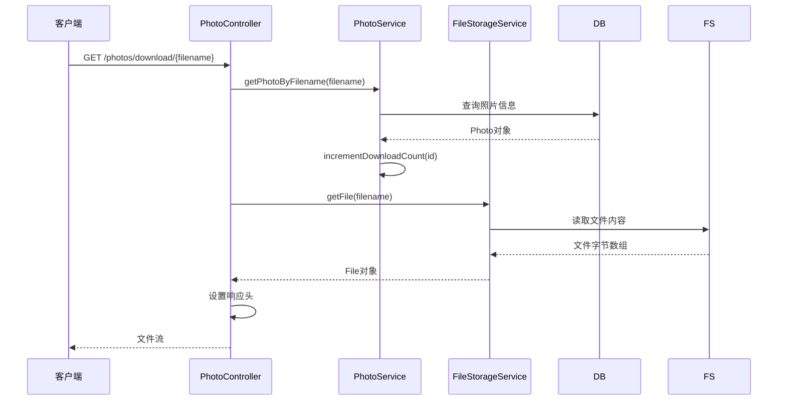

**图表来源**
- [PhotoController.java](file://src/main/java/com/photo/controller/PhotoController.java#L149-L179)
- [PhotoService.java](file://src/main/java/com/photo/service/PhotoService.java#L155-L160)

#### 断点续传下载
断点续传支持HTTP Range请求，实现大文件的高效下载：

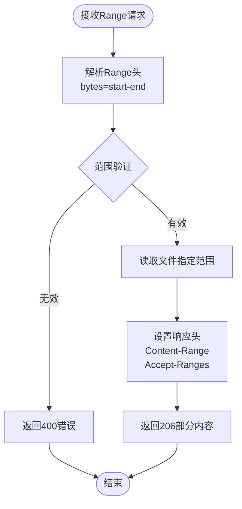

**图表来源**
- [PhotoController.java](file://src/main/java/com/photo/controller/PhotoController.java#L184-L225)

#### 在线预览功能
在线预览支持直接在浏览器中显示图片，包含防盗链保护：

| 功能特性 | 实现方式 | 配置参数 |
|---------|---------|----------|
| 防盗链检查 | SecurityUtils.validateReferer() | security.referer.allowed-domains |
| 缓存控制 | CacheControl.maxAge() | 1小时缓存 |
| MIME类型设置 | MediaType.parseMediaType() | 自动识别 |
| 访问统计 | incrementAccessCount() | 访问次数+1 |

**章节来源**
- [PhotoController.java](file://src/main/java/com/photo/controller/PhotoController.java#L84-L117)
- [PhotoService.java](file://src/main/java/com/photo/service/PhotoService.java#L238-L242)

### 照片管理服务

#### 数据模型设计
照片实体包含完整的元数据信息：

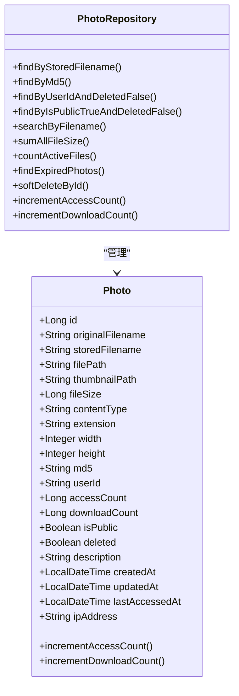

**图表来源**
- [Photo.java](file://src/main/java/com/photo/entity/Photo.java#L27-L174)
- [PhotoRepository.java](file://src/main/java/com/photo/repository/PhotoRepository.java#L20-L112)

#### 业务逻辑实现
照片管理服务提供完整的CRUD操作和高级功能：

| 功能类别 | 方法名称 | 描述 |
|---------|---------|------|
| 基础操作 | uploadPhoto(), uploadPhotos() | 文件上传和批量上传 |
| 查询操作 | getPhoto(), getUserPhotos(), getPublicPhotos() | 照片查询和分页 |
| 搜索功能 | searchPhotos() | 关键词搜索 |
| 删除操作 | deletePhoto(), permanentlyDeletePhoto() | 软删除和硬删除 |
| 统计功能 | getStorageInfo() | 存储空间统计 |
| 清理功能 | cleanupExpiredFiles() | 定期清理过期文件 |

**章节来源**
- [PhotoService.java](file://src/main/java/com/photo/service/PhotoService.java#L141-L271)

### 文件存储系统

#### 存储架构设计
系统采用分层存储架构，支持多种文件类型和处理方式：

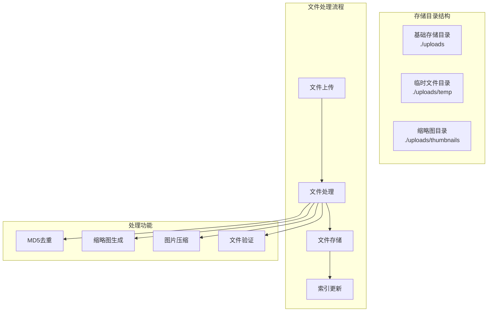

**图表来源**
- [FileStorageProperties.java](file://src/main/java/com/photo/config/FileStorageProperties.java#L15-L94)
- [FileStorageService.java](file://src/main/java/com/photo/service/FileStorageService.java#L36-L54)

#### 文件操作实现
文件存储服务提供完整的文件管理功能：

| 操作类型 | 方法名称 | 功能描述 |
|---------|---------|----------|
| 文件存储 | storeFile() | 存储上传文件 |
| 文件读取 | getFile(), readFileContent() | 读取文件内容 |
| 文件删除 | deleteFile(), deleteAll() | 删除文件 |
| 范围读取 | readFileRange() | 支持断点续传 |
| 缩略图 | createThumbnail(), getThumbnail() | 缩略图生成和获取 |
| 压缩处理 | compressImage() | 图片压缩 |

**章节来源**
- [FileStorageService.java](file://src/main/java/com/photo/service/FileStorageService.java#L59-L279)

## 依赖关系分析

### 组件依赖图
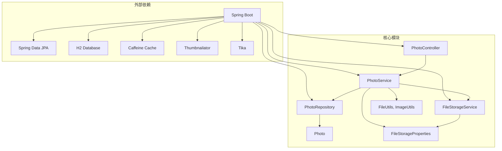

**图表来源**
- [pom.xml](file://pom.xml#L30-L150)

### 数据流分析
系统中的主要数据流向：

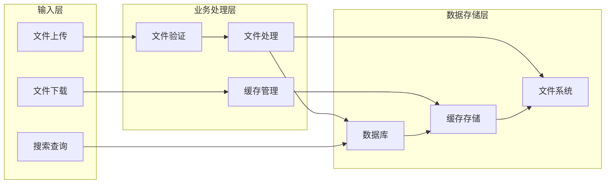

**章节来源**
- [PhotoController.java](file://src/main/java/com/photo/controller/PhotoController.java#L1-L316)
- [PhotoService.java](file://src/main/java/com/photo/service/PhotoService.java#L1-L385)

## 性能考虑

### 缓存策略
系统实现了多层次的缓存机制：

| 缓存类型 | 缓存位置 | 过期时间 | 缓存键 |
|---------|---------|---------|--------|
| 照片详情 | 本地缓存 | 1小时 | photos:{id} |
| 照片列表 | 本地缓存 | 30秒 | photos:user:{userId} |
| 公开列表 | 本地缓存 | 1分钟 | photos:public |
| 存储信息 | 本地缓存 | 5分钟 | storage:info |

### 性能优化措施

#### 1. 异步处理
- 批量上传采用异步处理，避免阻塞主线程
- 缩略图生成和图片压缩在后台异步执行
- 定期清理任务使用定时调度器

#### 2. 连接池配置
- Tomcat连接池最大连接数：10000
- 最大线程数：200
- 最小空闲线程：10

#### 3. 文件处理优化
- 使用RandomAccessFile实现断点续传
- 图片压缩采用临时文件机制
- 缩略图生成使用Thumbnailator库

#### 4. 数据库优化
- 照片表建立多个索引：originalFilename、createdAt、userId
- 使用分页查询避免大数据集加载
- 缓存常用查询结果

**章节来源**
- [application.yml](file://src/main/resources/application.yml#L162-L172)
- [PhotoService.java](file://src/main/java/com/photo/service/PhotoService.java#L141-L178)

## 故障排除指南

### 常见问题及解决方案

#### 1. 文件上传失败
**问题症状**: 上传过程中出现500错误或文件未保存

**可能原因**:
- 存储空间不足
- 文件类型不被允许
- 文件大小超过限制
- 权限不足导致文件写入失败

**解决步骤**:
1. 检查存储空间使用情况
2. 验证文件类型和扩展名
3. 确认文件大小限制
4. 检查文件系统权限

#### 2. 下载失败
**问题症状**: 下载过程中断或文件损坏

**可能原因**:
- 断点续传Range解析错误
- 文件被删除或移动
- 网络连接中断

**解决步骤**:
1. 检查Range请求格式
2. 验证文件存在性
3. 重新发起完整下载

#### 3. 缓存问题
**问题症状**: 照片信息显示不正确或延迟更新

**解决步骤**:
1. 清理缓存：`@CacheEvict(value = "photos", key = "#id")`
2. 检查缓存配置
3. 重启应用以刷新缓存

### 错误处理机制

系统提供完善的异常处理机制：

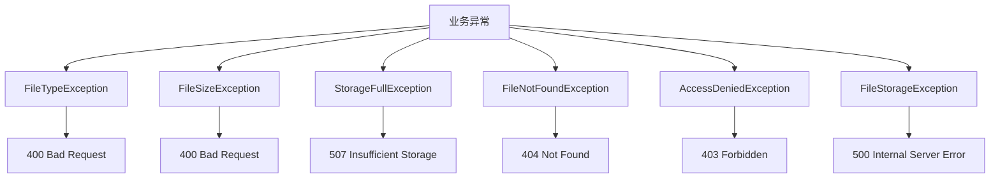

**图表来源**
- [GlobalExceptionHandler.java](file://src/main/java/com/photo/exception/GlobalExceptionHandler.java#L23-L138)

**章节来源**
- [GlobalExceptionHandler.java](file://src/main/java/com/photo/exception/GlobalExceptionHandler.java#L1-L140)

## 结论
本照片上传下载系统采用现代化的Spring Boot技术栈，实现了完整的文件管理功能。系统具有以下优势：

1. **架构清晰**: 分层设计合理，职责分离明确
2. **功能完整**: 支持上传、下载、预览、搜索等核心功能
3. **性能优秀**: 多层次缓存和优化策略
4. **安全可靠**: 多重验证和异常处理机制
5. **易于扩展**: 模块化设计便于功能扩展

系统适用于中小型项目的照片管理需求，可根据实际需要进行定制和扩展。

## 附录

### API接口说明

#### 文件上传接口
| 接口 | 方法 | URL | 功能 |
|------|------|-----|------|
| 单文件上传 | POST | `/photos/upload` | 上传单个照片文件 |
| 批量上传 | POST | `/photos/upload/batch` | 上传多个照片文件 |

#### 文件下载接口
| 接口 | 方法 | URL | 功能 |
|------|------|-----|------|
| 在线预览 | GET | `/photos/view/{filename}` | 在线预览照片 |
| 查看缩略图 | GET | `/photos/thumbnail/{filename}` | 获取缩略图 |
| 普通下载 | GET | `/photos/download/{filename}` | 下载原图文件 |
| 断点续传 | GET | `/photos/download/range/{filename}` | 支持Range请求的下载 |

#### 照片管理接口
| 接口 | 方法 | URL | 功能 |
|------|------|-----|------|
| 获取照片 | GET | `/photos/{id}` | 根据ID获取照片信息 |
| 用户照片 | GET | `/photos/user/{userId}` | 获取用户照片列表 |
| 公开照片 | GET | `/photos/public` | 获取公开照片列表 |
| 搜索照片 | GET | `/photos/search` | 根据关键词搜索照片 |
| 删除照片 | DELETE | `/photos/{id}` | 软删除照片 |
| 永久删除 | DELETE | `/photos/{id}/permanent` | 物理删除照片 |
| 存储信息 | GET | `/photos/storage/info` | 获取存储空间信息 |

### 配置参数说明

#### 文件存储配置
| 参数名 | 默认值 | 描述 |
|-------|--------|------|
| file.storage.base-path | `./uploads` | 基础存储目录 |
| file.storage.max-file-size | `10485760` | 最大文件大小(字节) |
| file.storage.max-storage-size | `10737418240` | 最大存储空间(字节) |
| file.storage.max-files-per-upload | `10` | 单次最大上传文件数 |
| file.storage.thumbnail.width | `200` | 缩略图宽度 |
| file.storage.thumbnail.height | `200` | 缩略图高度 |
| file.storage.compression.enabled | `true` | 是否启用压缩 |
| file.storage.compression.quality | `0.85` | 压缩质量 |
| file.storage.compression.max-width | `1920` | 最大宽度 |
| file.storage.compression.max-height | `1080` | 最大高度 |

#### 安全配置
| 参数名 | 默认值 | 描述 |
|-------|--------|------|
| security.referer.enabled | `true` | 是否启用防盗链 |
| security.token.secret | `your-secret-key-change-this-in-production` | Token密钥 |
| security.token.expiration | `86400` | Token过期时间(秒) |
| security.cors.enabled | `true` | 是否启用CORS |

### 开发和部署建议

#### 开发环境配置
1. 使用H2内存数据库进行开发测试
2. 配置日志级别为DEBUG便于调试
3. 启用Spring Boot DevTools实现热部署

#### 生产环境配置
1. 切换到MySQL数据库
2. 配置生产环境专用的存储目录
3. 设置合理的缓存和连接池参数
4. 配置SSL证书和HTTPS
5. 设置监控和日志收集

#### 性能调优建议
1. 根据业务量调整Tomcat线程池参数
2. 优化数据库索引和查询语句
3. 调整缓存策略和过期时间
4. 监控存储空间使用情况
5. 定期清理过期文件和临时文件