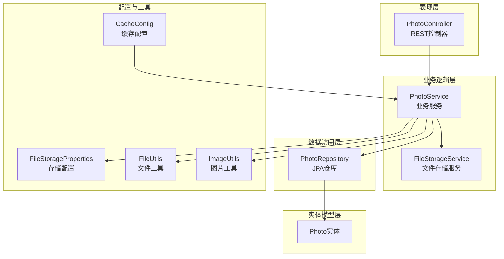
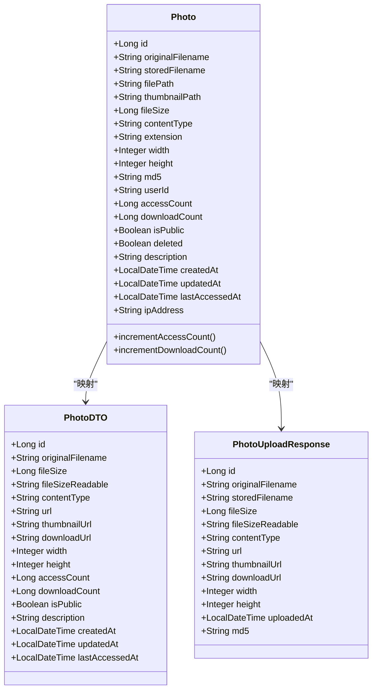
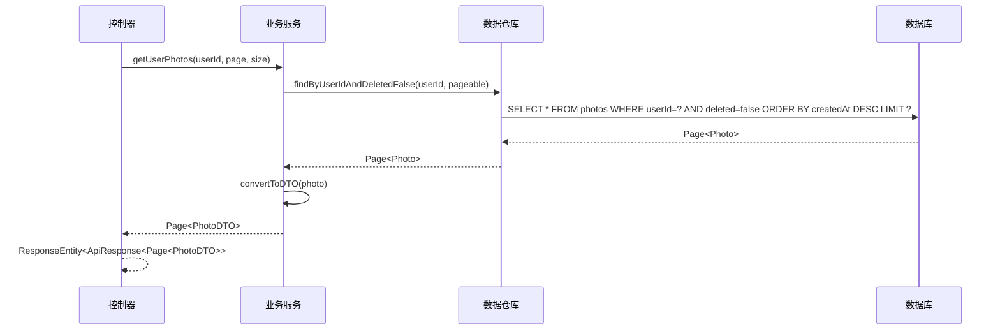
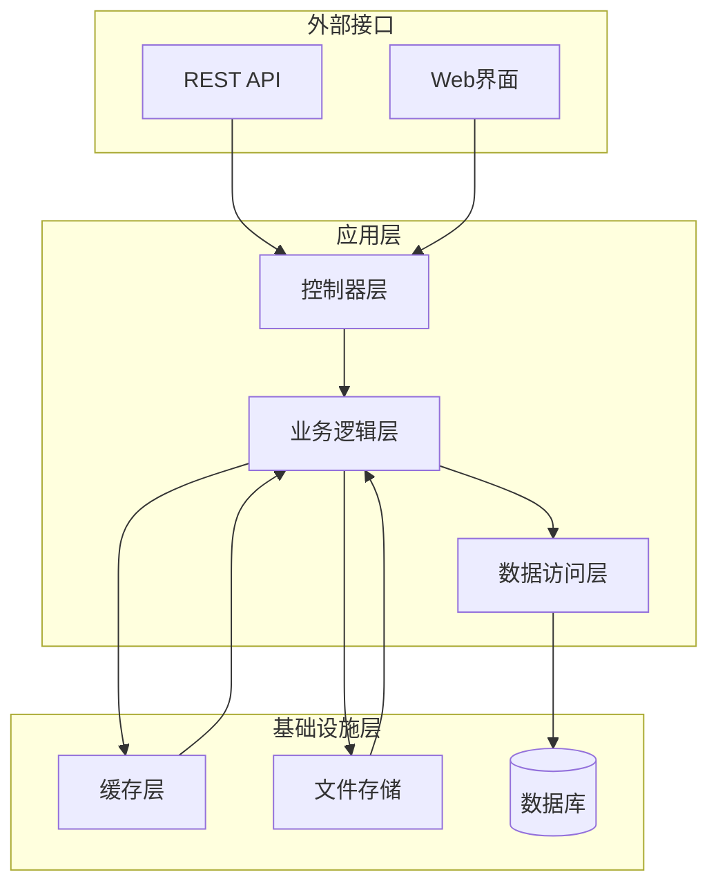
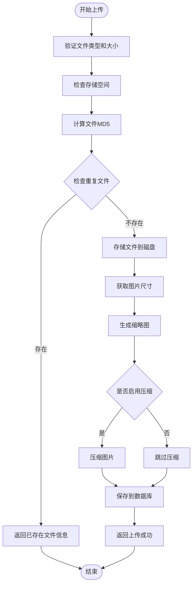
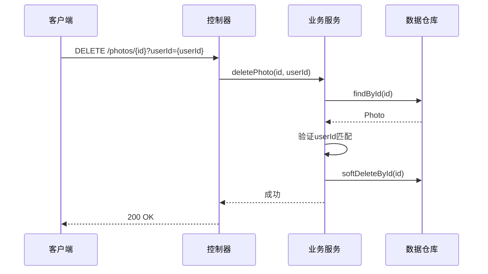
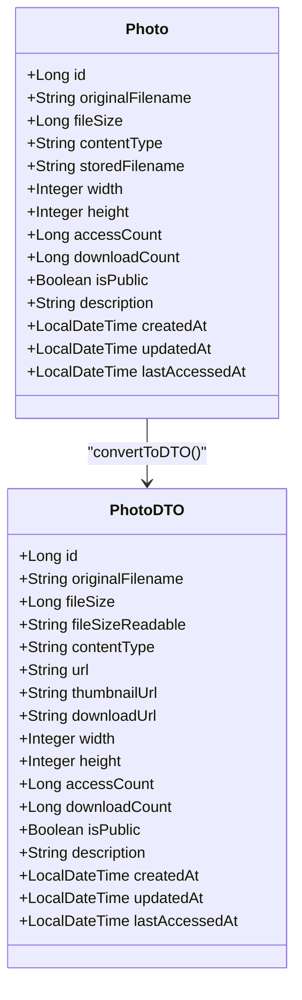
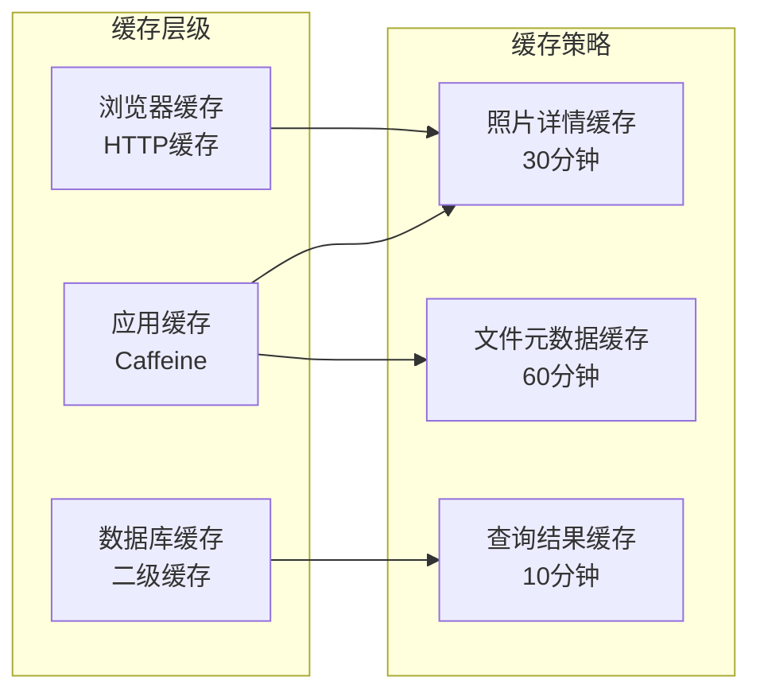
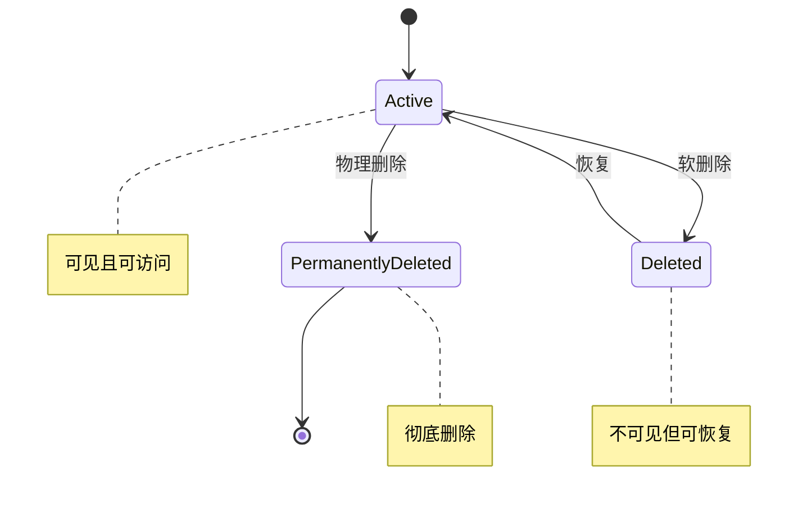
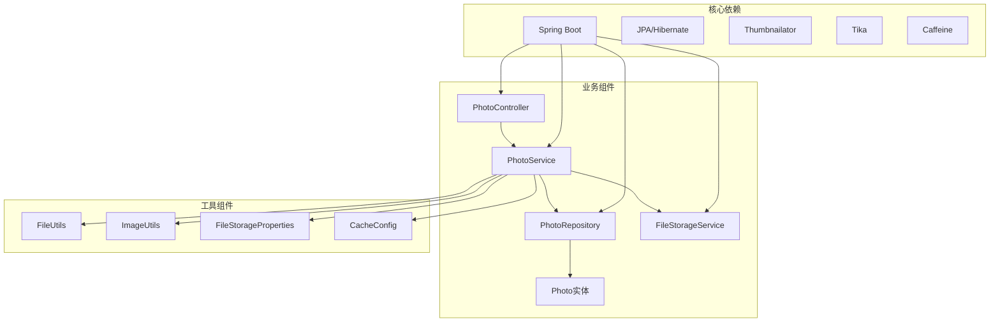

# 照片管理服务

<cite>
**本文引用的文件**
- [Photo.java](file://src/main/java/com/photo/entity/Photo.java)
- [PhotoService.java](file://src/main/java/com/photo/service/PhotoService.java)
- [PhotoRepository.java](file://src/main/java/com/photo/repository/PhotoRepository.java)
- [PhotoController.java](file://src/main/java/com/photo/controller/PhotoController.java)
- [PhotoDTO.java](file://src/main/java/com/photo/dto/PhotoDTO.java)
- [PhotoUploadResponse.java](file://src/main/java/com/photo/dto/PhotoUploadResponse.java)
- [CacheConfig.java](file://src/main/java/com/photo/config/CacheConfig.java)
- [FileStorageProperties.java](file://src/main/java/com/photo/config/FileStorageProperties.java)
- [FileStorageService.java](file://src/main/java/com/photo/service/FileStorageService.java)
- [FileUtils.java](file://src/main/java/com/photo/util/FileUtils.java)
- [ImageUtils.java](file://src/main/java/com/photo/util/ImageUtils.java)
- [application.yml](file://src/main/resources/application.yml)
- [PhotoServiceTest.java](file://src/test/java/com/photo/service/PhotoServiceTest.java)
- [pom.xml](file://pom.xml)
</cite>

## 目录
1. [简介](#简介)
2. [项目结构](#项目结构)
3. [核心组件](#核心组件)
4. [架构概览](#架构概览)
5. [详细组件分析](#详细组件分析)
6. [依赖分析](#依赖分析)
7. [性能考虑](#性能考虑)
8. [故障排除指南](#故障排除指南)
9. [结论](#结论)
10. [附录](#附录)

## 简介
本项目是一个基于Spring Boot的完整照片管理服务，提供了照片上传、存储、检索、下载、缩略图生成、访问统计等核心功能。系统采用分层架构设计，包含控制器层、业务逻辑层、数据访问层和工具层，支持分布式部署和高并发场景。

## 项目结构
项目采用标准的Spring Boot多模块结构，主要分为以下层次：

**图表来源**
- [PhotoController.java](file://src/main/java/com/photo/controller/PhotoController.java#L30-L316)
- [PhotoService.java](file://src/main/java/com/photo/service/PhotoService.java#L34-L385)
- [PhotoRepository.java](file://src/main/java/com/photo/repository/PhotoRepository.java#L19-L112)

**章节来源**
- [PhotoController.java](file://src/main/java/com/photo/controller/PhotoController.java#L30-L316)
- [PhotoService.java](file://src/main/java/com/photo/service/PhotoService.java#L34-L385)
- [PhotoRepository.java](file://src/main/java/com/photo/repository/PhotoRepository.java#L19-L112)

## 核心组件
系统的核心组件包括照片实体模型、业务服务、数据访问层和控制器层，每个组件都有明确的职责分工和清晰的接口定义。

### 照片实体模型设计
照片实体采用JPA注解进行映射，支持完整的照片元数据存储和业务规则实现：

**图表来源**
- [Photo.java](file://src/main/java/com/photo/entity/Photo.java#L27-L174)
- [PhotoDTO.java](file://src/main/java/com/photo/dto/PhotoDTO.java#L17-L104)
- [PhotoUploadResponse.java](file://src/main/java/com/photo/dto/PhotoUploadResponse.java#L17-L84)

### 数据访问层实现
数据访问层基于Spring Data JPA，提供丰富的查询方法和分页支持：

**图表来源**
- [PhotoService.java](file://src/main/java/com/photo/service/PhotoService.java#L164-L169)
- [PhotoRepository.java](file://src/main/java/com/photo/repository/PhotoRepository.java#L34-L35)

**章节来源**
- [Photo.java](file://src/main/java/com/photo/entity/Photo.java#L17-L174)
- [PhotoDTO.java](file://src/main/java/com/photo/dto/PhotoDTO.java#L17-L104)
- [PhotoUploadResponse.java](file://src/main/java/com/photo/dto/PhotoUploadResponse.java#L17-L84)

## 架构概览
系统采用经典的三层架构模式，结合Spring Boot的自动配置特性，实现了高度模块化的业务逻辑。

**图表来源**
- [PhotoController.java](file://src/main/java/com/photo/controller/PhotoController.java#L30-L316)
- [PhotoService.java](file://src/main/java/com/photo/service/PhotoService.java#L34-L385)
- [CacheConfig.java](file://src/main/java/com/photo/config/CacheConfig.java#L15-L54)

## 详细组件分析

### 照片实体模型详解
照片实体设计充分考虑了业务需求和性能优化：

#### 字段定义与约束
- **主键标识**: 使用自增策略确保唯一性
- **文件元数据**: 包含原始文件名、存储文件名、文件路径、MIME类型等
- **图片属性**: 宽度、高度、MD5值用于去重和尺寸管理
- **访问统计**: 访问次数、下载次数、最后访问时间
- **状态管理**: 公开状态、软删除标记、IP地址记录
- **索引优化**: 为常用查询字段建立数据库索引

#### 关系映射与数据约束
实体通过JPA注解实现与数据库表的映射，支持复杂的查询操作和事务管理。

**章节来源**
- [Photo.java](file://src/main/java/com/photo/entity/Photo.java#L17-L174)

### 业务逻辑层实现
业务逻辑层是系统的核心，负责处理复杂的业务规则和工作流程。

#### 照片上传流程

**图表来源**
- [PhotoService.java](file://src/main/java/com/photo/service/PhotoService.java#L50-L111)
- [FileStorageService.java](file://src/main/java/com/photo/service/FileStorageService.java#L58-L95)

#### 权限验证机制
系统实现了严格的权限控制，确保用户只能操作自己的照片资源：

**图表来源**
- [PhotoService.java](file://src/main/java/com/photo/service/PhotoService.java#L192-L205)
- [PhotoController.java](file://src/main/java/com/photo/controller/PhotoController.java#L283-L291)

**章节来源**
- [PhotoService.java](file://src/main/java/com/photo/service/PhotoService.java#L34-L385)

### 数据访问层实现
数据访问层基于Spring Data JPA，提供了丰富的查询方法和分页支持。

#### 查询方法设计
- **基础查询**: 支持按ID、文件名、用户ID等条件查询
- **分页查询**: 提供用户照片列表、公开照片列表、搜索结果等分页查询
- **聚合查询**: 支持统计文件总数、总大小、活跃文件数量
- **高级查询**: 支持模糊搜索、过期文件清理、热门照片排序

#### 分页查询优化
系统采用合理的分页策略：
- 默认每页20条记录
- 按创建时间倒序排列
- 使用数据库索引优化查询性能
- 支持自定义页码和大小参数

**章节来源**
- [PhotoRepository.java](file://src/main/java/com/photo/repository/PhotoRepository.java#L19-L112)

### DTO转换机制
系统采用DTO模式实现数据传输层的解耦和安全控制。

#### 实体到DTO映射

**图表来源**
- [PhotoService.java](file://src/main/java/com/photo/service/PhotoService.java#L362-L382)

#### 字段过滤与数据序列化
- **字段选择**: 只暴露必要的业务字段，隐藏内部实现细节
- **格式化输出**: 文件大小转换为可读格式
- **URL生成**: 动态生成访问链接，支持CDN集成
- **时间戳处理**: 统一时间格式化输出

**章节来源**
- [PhotoDTO.java](file://src/main/java/com/photo/dto/PhotoDTO.java#L17-L104)
- [PhotoUploadResponse.java](file://src/main/java/com/photo/dto/PhotoUploadResponse.java#L17-L84)

### 缓存策略应用
系统采用多级缓存策略提升性能和用户体验。

#### 缓存配置

**图表来源**
- [CacheConfig.java](file://src/main/java/com/photo/config/CacheConfig.java#L15-L54)
- [PhotoService.java](file://src/main/java/com/photo/service/PhotoService.java#L141-L151)

#### 缓存应用场景
- **照片详情缓存**: 减少重复查询数据库的压力
- **文件元数据缓存**: 提升文件操作的响应速度
- **查询结果缓存**: 优化热门查询的性能表现

**章节来源**
- [CacheConfig.java](file://src/main/java/com/photo/config/CacheConfig.java#L15-L54)

### 业务规则实现
系统实现了完善的业务规则，确保数据的一致性和完整性。

#### 软删除机制

**图表来源**
- [PhotoService.java](file://src/main/java/com/photo/service/PhotoService.java#L192-L234)
- [PhotoRepository.java](file://src/main/java/com/photo/repository/PhotoRepository.java#L74-L84)

#### 访问统计与下载统计
- **访问统计**: 自动记录每次访问的时间和IP地址
- **下载统计**: 独立的下载计数器，支持断点续传
- **热门内容**: 基于访问次数的热门照片排序

**章节来源**
- [Photo.java](file://src/main/java/com/photo/entity/Photo.java#L162-L172)
- [PhotoService.java](file://src/main/java/com/photo/service/PhotoService.java#L238-L250)

## 依赖分析
系统采用模块化设计，各组件之间的依赖关系清晰明确。

**图表来源**
- [pom.xml](file://pom.xml#L30-L150)
- [PhotoService.java](file://src/main/java/com/photo/service/PhotoService.java#L34-L385)

### 外部依赖关系
- **Spring Boot生态**: 提供完整的Web、数据访问、安全框架支持
- **图片处理库**: 支持多种图片格式的压缩、缩放、水印等功能
- **缓存框架**: Caffeine提供高性能的本地缓存解决方案
- **文件检测工具**: Apache Tika用于准确识别文件类型

**章节来源**
- [pom.xml](file://pom.xml#L30-L150)

## 性能考虑
系统在设计时充分考虑了性能优化，采用了多种技术和策略来提升整体性能。

### 数据库性能优化
- **索引策略**: 为常用查询字段建立复合索引
- **查询优化**: 使用原生SQL和JPQL优化复杂查询
- **连接池**: 配置合理的数据库连接池参数
- **事务管理**: 合理的事务边界设计避免长事务

### 缓存策略优化
- **多级缓存**: 应用层缓存 + 浏览器缓存 + CDN缓存
- **缓存失效**: 基于LRU算法的智能缓存淘汰
- **热点数据**: 对热门照片设置更长的缓存时间
- **缓存穿透防护**: 对不存在的数据也进行缓存

### 文件存储优化
- **异步处理**: 文件上传和处理采用异步方式
- **流式传输**: 大文件采用流式读取减少内存占用
- **压缩存储**: 支持图片压缩减少存储空间
- **CDN集成**: 支持CDN加速静态资源访问

## 故障排除指南
系统提供了完善的错误处理机制和日志记录，便于问题诊断和解决。

### 常见问题及解决方案

#### 文件上传失败
**问题症状**: 上传过程中出现异常或文件丢失
**可能原因**:
- 存储空间不足
- 文件类型不被支持
- 磁盘权限问题
- 网络中断

**解决方案**:
1. 检查存储空间配置和实际使用情况
2. 验证文件类型白名单设置
3. 确认文件存储目录权限
4. 检查网络连接稳定性

#### 照片访问异常
**问题症状**: 照片无法正常显示或下载
**可能原因**:
- 文件路径错误
- 缓存数据过期
- 权限验证失败
- 缩略图生成失败

**解决方案**:
1. 检查文件存储路径配置
2. 清理相关缓存数据
3. 验证用户权限和照片状态
4. 重新生成缩略图文件

#### 性能问题
**问题症状**: 系统响应缓慢或内存占用过高
**可能原因**:
- 缓存配置不当
- 数据库查询效率低
- 文件处理耗时过长
- 并发访问过高

**解决方案**:
1. 调整缓存大小和过期时间
2. 优化数据库查询语句
3. 调整文件处理参数
4. 增加服务器资源或负载均衡

**章节来源**
- [PhotoService.java](file://src/main/java/com/photo/service/PhotoService.java#L304-L336)
- [FileStorageService.java](file://src/main/java/com/photo/service/FileStorageService.java#L58-L95)

## 结论
本照片管理服务采用现代化的Spring Boot技术栈，实现了完整的照片管理功能。系统具有以下特点：

1. **模块化设计**: 清晰的分层架构便于维护和扩展
2. **高性能实现**: 多级缓存、异步处理、数据库优化
3. **安全性保障**: 权限验证、文件类型检测、防盗链保护
4. **可扩展性**: 插件化设计支持功能扩展和第三方集成
5. **易用性**: 完善的API文档和错误处理机制

系统适用于中小型项目的照片管理需求，也可作为大型相册系统的参考实现。

## 附录

### API接口规范
系统提供RESTful API接口，支持完整的照片管理功能：

#### 照片管理接口
- `POST /photos/upload` - 单文件上传
- `POST /photos/upload/batch` - 批量上传
- `GET /photos/view/{filename}` - 在线预览
- `GET /photos/download/{filename}` - 下载文件
- `GET /photos/download/range/{filename}` - 断点续传
- `GET /photos/{id}` - 获取照片详情
- `GET /photos/user/{userId}` - 用户照片列表
- `GET /photos/public` - 公开照片列表
- `GET /photos/search` - 搜索照片
- `DELETE /photos/{id}` - 软删除
- `DELETE /photos/{id}/permanent` - 物理删除
- `GET /photos/storage/info` - 存储空间信息

#### 配置参数说明
系统支持丰富的配置选项，可通过`application.yml`进行定制：

- **存储配置**: 文件存储路径、大小限制、类型限制
- **缓存配置**: 缓存大小、过期时间、缓存策略
- **安全配置**: 防盗链域名、CORS配置、Token设置
- **定时任务**: 清理过期文件的调度策略

**章节来源**
- [PhotoController.java](file://src/main/java/com/photo/controller/PhotoController.java#L46-L316)
- [application.yml](file://src/main/resources/application.yml#L69-L190)