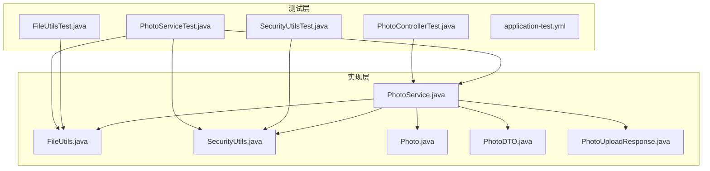
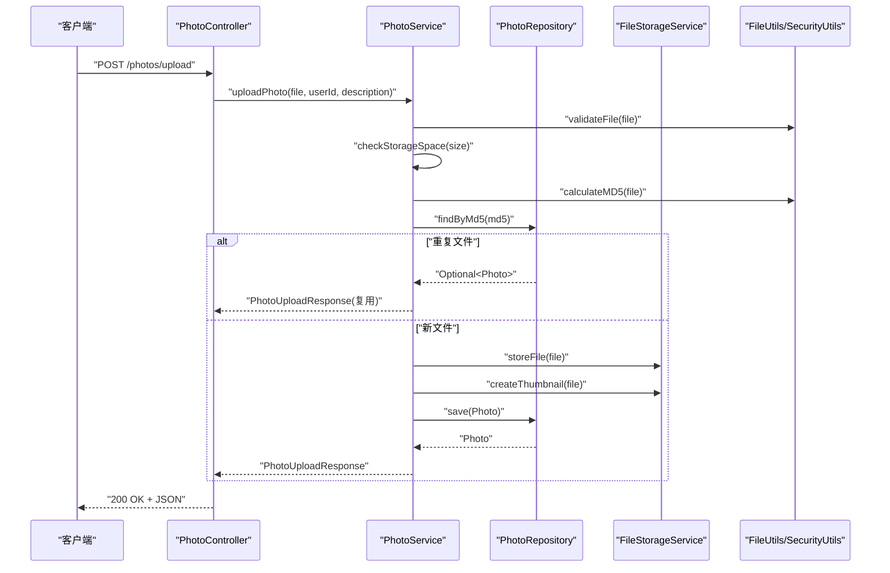
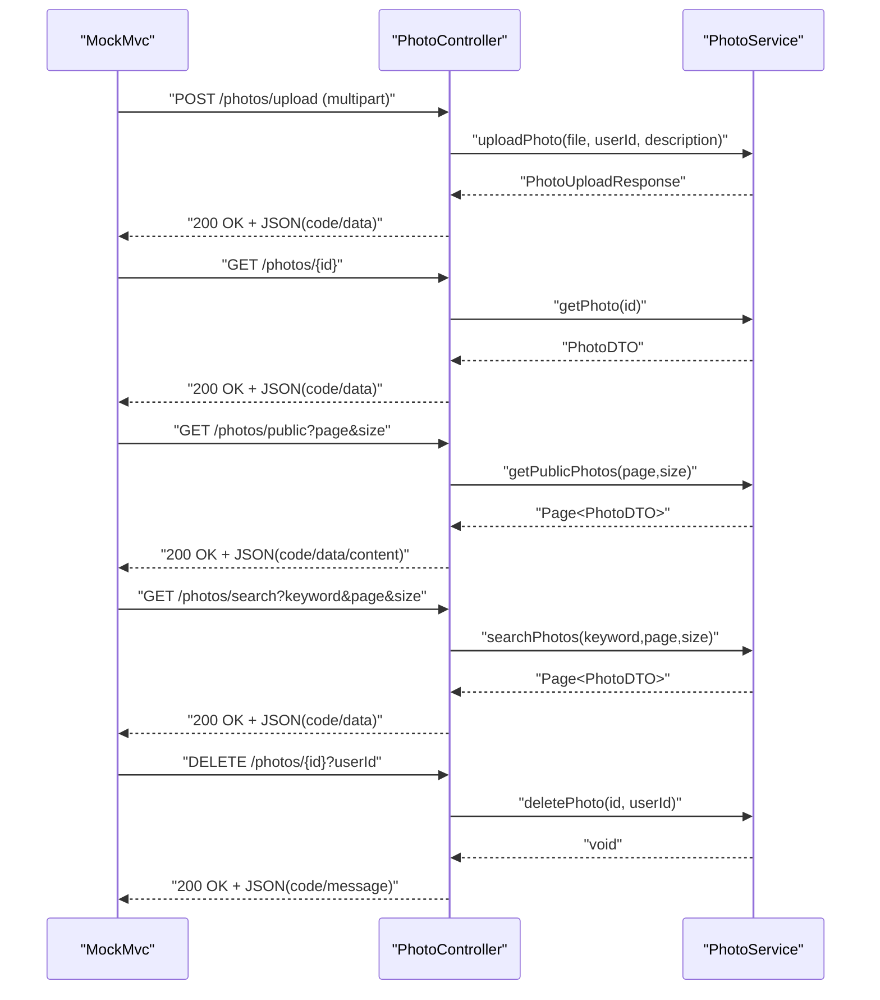
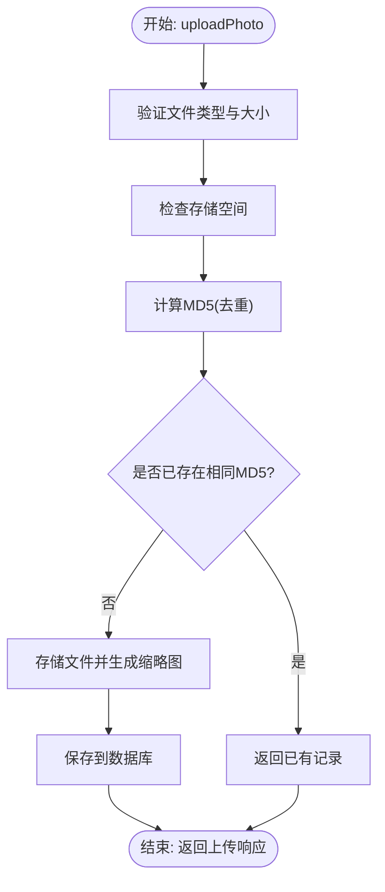
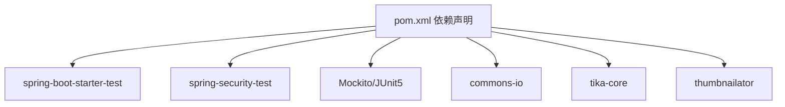

# 单元测试

<cite>
**本文引用的文件**
- [PhotoControllerTest.java](file://src/test/java/com/photo/controller/PhotoControllerTest.java)
- [PhotoServiceTest.java](file://src/test/java/com/photo/service/PhotoServiceTest.java)
- [FileUtilsTest.java](file://src/test/java/com/photo/util/FileUtilsTest.java)
- [SecurityUtilsTest.java](file://src/test/java/com/photo/util/SecurityUtilsTest.java)
- [application-test.yml](file://src/test/resources/application-test.yml)
- [FileUtils.java](file://src/main/java/com/photo/util/FileUtils.java)
- [SecurityUtils.java](file://src/main/java/com/photo/util/SecurityUtils.java)
- [PhotoService.java](file://src/main/java/com/photo/service/PhotoService.java)
- [Photo.java](file://src/main/java/com/photo/entity/Photo.java)
- [PhotoDTO.java](file://src/main/java/com/photo/dto/PhotoDTO.java)
- [PhotoUploadResponse.java](file://src/main/java/com/photo/dto/PhotoUploadResponse.java)
- [pom.xml](file://pom.xml)
</cite>

## 目录
1. [简介](#简介)
2. [项目结构](#项目结构)
3. [核心组件](#核心组件)
4. [架构总览](#架构总览)
5. [详细组件分析](#详细组件分析)
6. [依赖关系分析](#依赖关系分析)
7. [性能考量](#性能考量)
8. [故障排查指南](#故障排查指南)
9. [结论](#结论)
10. [附录](#附录)

## 简介
本文件聚焦于照片上传下载系统中的单元测试实现，覆盖控制器层（PhotoControllerTest）、服务层（PhotoServiceTest）与工具类（FileUtilsTest、SecurityUtilsTest）。文档详细说明：
- 控制器层测试：基于MockMvc的HTTP请求模拟、响应断言、参数校验与Mock对象使用
- 服务层测试：业务流程验证、边界条件与异常场景、仓储与存储服务交互
- 工具类测试：文件名生成、扩展名提取、大小格式化、文件名清洗与合法性校验、MD5计算
- 测试最佳实践：测试数据准备、Mock策略、断言方法、覆盖率要求与评估
- 测试执行方法与示例定位

## 项目结构
测试相关目录与文件组织如下：
- 控制器测试：src/test/java/com/photo/controller/PhotoControllerTest.java
- 服务测试：src/test/java/com/photo/service/PhotoServiceTest.java
- 工具类测试：src/test/java/com/photo/util/FileUtilsTest.java、SecurityUtilsTest.java
- 测试资源：src/test/resources/application-test.yml
- 核心实现：工具类、服务、实体与DTO位于src/main/java/com/photo下

图表来源
- [PhotoControllerTest.java](file://src/test/java/com/photo/controller/PhotoControllerTest.java#L1-L174)
- [PhotoServiceTest.java](file://src/test/java/com/photo/service/PhotoServiceTest.java#L1-L210)
- [FileUtilsTest.java](file://src/test/java/com/photo/util/FileUtilsTest.java#L1-L98)
- [SecurityUtilsTest.java](file://src/test/java/com/photo/util/SecurityUtilsTest.java#L1-L162)
- [application-test.yml](file://src/test/resources/application-test.yml#L1-L75)
- [FileUtils.java](file://src/main/java/com/photo/util/FileUtils.java#L1-L178)
- [SecurityUtils.java](file://src/main/java/com/photo/util/SecurityUtils.java#L1-L167)
- [PhotoService.java](file://src/main/java/com/photo/service/PhotoService.java#L1-L385)
- [Photo.java](file://src/main/java/com/photo/entity/Photo.java#L1-L174)
- [PhotoDTO.java](file://src/main/java/com/photo/dto/PhotoDTO.java#L1-L104)
- [PhotoUploadResponse.java](file://src/main/java/com/photo/dto/PhotoUploadResponse.java#L1-L84)

章节来源
- [PhotoControllerTest.java](file://src/test/java/com/photo/controller/PhotoControllerTest.java#L1-L174)
- [PhotoServiceTest.java](file://src/test/java/com/photo/service/PhotoServiceTest.java#L1-L210)
- [FileUtilsTest.java](file://src/test/java/com/photo/util/FileUtilsTest.java#L1-L98)
- [SecurityUtilsTest.java](file://src/test/java/com/photo/util/SecurityUtilsTest.java#L1-L162)
- [application-test.yml](file://src/test/resources/application-test.yml#L1-L75)

## 核心组件
- 控制器层测试（PhotoControllerTest）
  - 使用@WebMvcTest加载控制器上下文，结合MockMvc进行HTTP请求模拟
  - 通过@MockBean注入PhotoService、FileStorageService、SecurityProperties，隔离外部依赖
  - 断言响应状态码、JSON字段值与业务逻辑调用次数
- 服务层测试（PhotoServiceTest）
  - 使用@ExtendWith(MockitoExtension.class)启用Mockito
  - @Mock/@InjectMocks分别注入仓储、存储服务与被测服务
  - 验证正常流程、异常场景（文件类型、存储空间、权限）与边界条件
- 工具类测试（FileUtilsTest、SecurityUtilsTest）
  - FileUtils：唯一文件名生成、扩展名提取、大小格式化、文件名清洗与合法性、MD5计算
  - SecurityUtils：XSS清理、IP解析、Referer校验、路径遍历检测、文件访问控制、Token生成与校验

章节来源
- [PhotoControllerTest.java](file://src/test/java/com/photo/controller/PhotoControllerTest.java#L34-L81)
- [PhotoServiceTest.java](file://src/test/java/com/photo/service/PhotoServiceTest.java#L28-L79)
- [FileUtilsTest.java](file://src/test/java/com/photo/util/FileUtilsTest.java#L11-L98)
- [SecurityUtilsTest.java](file://src/test/java/com/photo/util/SecurityUtilsTest.java#L15-L162)

## 架构总览
控制器层通过Spring MVC接收请求，调用服务层；服务层协调仓储与存储服务，同时进行文件类型与大小校验、存储空间检查、缓存与事务管理；工具类提供文件与安全相关能力。

图表来源
- [PhotoControllerTest.java](file://src/test/java/com/photo/controller/PhotoControllerTest.java#L83-L106)
- [PhotoService.java](file://src/main/java/com/photo/service/PhotoService.java#L50-L111)
- [FileUtils.java](file://src/main/java/com/photo/util/FileUtils.java#L56-L102)
- [PhotoServiceTest.java](file://src/test/java/com/photo/service/PhotoServiceTest.java#L82-L98)

## 详细组件分析

### 控制器层测试（PhotoControllerTest）
- 测试目标
  - 验证上传、查询、分页查询、搜索、删除等接口的HTTP行为与响应结构
  - 确保控制器正确转发参数给服务层并返回统一的API响应结构
- 关键点
  - 使用MockMvc进行multipart上传、GET/DELETE请求模拟
  - 使用JsonPath断言响应体字段（如code、data、message）
  - 使用verify断言服务层调用次数与参数匹配
  - 使用@MockBean隔离真实依赖，确保测试独立性
- 示例定位
  - 上传成功：[PhotoControllerTest.java](file://src/test/java/com/photo/controller/PhotoControllerTest.java#L83-L106)
  - 查询详情：[PhotoControllerTest.java](file://src/test/java/com/photo/controller/PhotoControllerTest.java#L108-L121)
  - 分页查询公开照片：[PhotoControllerTest.java](file://src/test/java/com/photo/controller/PhotoControllerTest.java#L123-L139)
  - 搜索：[PhotoControllerTest.java](file://src/test/java/com/photo/controller/PhotoControllerTest.java#L141-L157)
  - 删除：[PhotoControllerTest.java](file://src/test/java/com/photo/controller/PhotoControllerTest.java#L159-L172)

图表来源
- [PhotoControllerTest.java](file://src/test/java/com/photo/controller/PhotoControllerTest.java#L83-L172)
- [PhotoService.java](file://src/main/java/com/photo/service/PhotoService.java#L140-L205)

章节来源
- [PhotoControllerTest.java](file://src/test/java/com/photo/controller/PhotoControllerTest.java#L34-L172)

### 服务层测试（PhotoServiceTest）
- 测试目标
  - 验证上传流程（含去重、存储、缩略图、压缩、数据库持久化）
  - 验证查询、删除、存储信息统计与权限校验
  - 验证异常场景（文件类型、存储空间不足、权限不足、文件不存在）
- 关键点
  - 使用MockMultipartFile构造测试文件
  - 通过when/then设置仓储与存储服务行为
  - 使用assertThrows验证异常抛出
  - 使用verify验证仓储调用（如软删除）
- 示例定位
  - 上传成功（含MD5去重与仓储保存）：[PhotoServiceTest.java](file://src/test/java/com/photo/service/PhotoServiceTest.java#L82-L98)
  - 查询不存在抛出异常：[PhotoServiceTest.java](file://src/test/java/com/photo/service/PhotoServiceTest.java#L133-L142)
  - 删除成功与权限校验：[PhotoServiceTest.java](file://src/test/java/com/photo/service/PhotoServiceTest.java#L144-L169)
  - 存储信息统计：[PhotoServiceTest.java](file://src/test/java/com/photo/service/PhotoServiceTest.java#L171-L186)

图表来源
- [PhotoServiceTest.java](file://src/test/java/com/photo/service/PhotoServiceTest.java#L82-L98)
- [PhotoService.java](file://src/main/java/com/photo/service/PhotoService.java#L50-L111)

章节来源
- [PhotoServiceTest.java](file://src/test/java/com/photo/service/PhotoServiceTest.java#L28-L209)
- [PhotoService.java](file://src/main/java/com/photo/service/PhotoService.java#L304-L336)

### 工具类测试（FileUtilsTest）
- 测试目标
  - 验证文件名唯一性、扩展名提取、大小格式化、文件名清洗与合法性、MD5计算
- 关键点
  - 使用MockMultipartFile构造测试输入
  - 断言输出格式与长度（如MD5长度为32）
  - 验证路径遍历与HTML标签的清洗效果
- 示例定位
  - 唯一文件名生成：[FileUtilsTest.java](file://src/test/java/com/photo/util/FileUtilsTest.java#L14-L24)
  - 扩展名提取：[FileUtilsTest.java](file://src/test/java/com/photo/util/FileUtilsTest.java#L27-L37)
  - 大小格式化：[FileUtilsTest.java](file://src/test/java/com/photo/util/FileUtilsTest.java#L40-L52)
  - 文件名清洗与合法性：[FileUtilsTest.java](file://src/test/java/com/photo/util/FileUtilsTest.java#L54-L78)
  - MD5计算：[FileUtilsTest.java](file://src/test/java/com/photo/util/FileUtilsTest.java#L80-L96)

章节来源
- [FileUtilsTest.java](file://src/test/java/com/photo/util/FileUtilsTest.java#L11-L98)
- [FileUtils.java](file://src/main/java/com/photo/util/FileUtils.java#L41-L176)

### 安全工具类测试（SecurityUtilsTest）
- 测试目标
  - 验证XSS清理、IP解析、Referer校验、路径遍历检测、文件访问控制、Token生成与校验
- 关键点
  - 使用MockHttpServletRequest构造请求头与远程地址
  - 断言返回值与日志行为（如路径遍历告警）
- 示例定位
  - XSS清理：[SecurityUtilsTest.java](file://src/test/java/com/photo/util/SecurityUtilsTest.java#L18-L28)
  - IP解析（含X-Forwarded-For）：[SecurityUtilsTest.java](file://src/test/java/com/photo/util/SecurityUtilsTest.java#L31-L55)
  - Referer校验：[SecurityUtilsTest.java](file://src/test/java/com/photo/util/SecurityUtilsTest.java#L58-L96)
  - 路径遍历检测：[SecurityUtilsTest.java](file://src/test/java/com/photo/util/SecurityUtilsTest.java#L99-L107)
  - 文件访问控制：[SecurityUtilsTest.java](file://src/test/java/com/photo/util/SecurityUtilsTest.java#L110-L134)
  - Token生成与校验：[SecurityUtilsTest.java](file://src/test/java/com/photo/util/SecurityUtilsTest.java#L137-L160)

章节来源
- [SecurityUtilsTest.java](file://src/test/java/com/photo/util/SecurityUtilsTest.java#L15-L162)
- [SecurityUtils.java](file://src/main/java/com/photo/util/SecurityUtils.java#L20-L165)

## 依赖关系分析
- 测试框架与工具
  - Spring Boot Starter Test、Mockito、JUnit 5、MockMultipartFile、MockHttpServletRequest
- 第三方库
  - Apache Commons IO、Apache Tika、Thumbnailator、Caffeine Cache
- 测试配置
  - application-test.yml启用内存数据库、JPA DDL自动建表、多部分上传限制、文件存储路径与安全配置

图表来源
- [pom.xml](file://pom.xml#L122-L149)

章节来源
- [pom.xml](file://pom.xml#L1-L169)
- [application-test.yml](file://src/test/resources/application-test.yml#L1-L75)

## 性能考量
- 测试执行建议
  - 使用内存数据库（H2）与轻量级缓存（Caffeine）提升测试速度
  - 合理设置multipart大小限制，避免大文件影响测试性能
  - 将耗时操作（如文件存储、缩略图生成）通过Mock隔离
- 覆盖率建议
  - 控制器层：接口路径覆盖、参数校验分支、异常分支
  - 服务层：上传流程主干、去重、存储空间检查、权限校验、异常分支
  - 工具类：边界值、非法输入、特殊字符处理
- 评估标准
  - 行覆盖率≥80%，分支覆盖率≥70%
  - 对关键业务路径（上传、删除、权限校验）达到100%分支覆盖

## 故障排查指南
- 常见问题
  - 上传接口返回错误：检查文件类型与大小限制、存储空间是否充足、MD5计算是否成功
  - 权限异常：确认userId与文件所属用户一致，检查SecurityUtils的访问控制逻辑
  - 响应结构不符：核对PhotoUploadResponse与PhotoDTO字段映射，确保控制器返回统一结构
- 排查步骤
  - 在application-test.yml中开启show-sql与调试日志
  - 使用MockMvc的perform与andExpect逐步定位失败点
  - 对工具类方法增加日志输出，验证输入与输出
- 相关定位
  - 控制器响应断言：[PhotoControllerTest.java](file://src/test/java/com/photo/controller/PhotoControllerTest.java#L96-L106)
  - 服务层异常抛出：[PhotoServiceTest.java](file://src/test/java/com/photo/service/PhotoServiceTest.java#L139-L142)
  - 工具类MD5计算：[FileUtilsTest.java](file://src/test/java/com/photo/util/FileUtilsTest.java#L90-L96)

章节来源
- [PhotoControllerTest.java](file://src/test/java/com/photo/controller/PhotoControllerTest.java#L83-L172)
- [PhotoServiceTest.java](file://src/test/java/com/photo/service/PhotoServiceTest.java#L100-L169)
- [FileUtilsTest.java](file://src/test/java/com/photo/util/FileUtilsTest.java#L80-L96)

## 结论
本测试体系围绕控制器、服务与工具类三个层面构建，采用Mock隔离外部依赖，结合MockMvc与JUnit 5实现端到端的HTTP行为验证与业务逻辑断言。通过合理的测试数据准备、Mock策略与断言方法，能够有效保障上传下载功能的稳定性与安全性。建议持续完善边界条件与异常场景覆盖，配合覆盖率指标持续优化测试质量。

## 附录
- 测试执行方法
  - Maven命令：mvn test
  - IDE运行：直接运行各测试类的@Test方法
- 测试数据准备
  - 使用MockMultipartFile构造图片文件输入
  - 使用MockHttpServletRequest构造HTTP请求头与远程地址
  - 使用@MockBean/@Mock/@InjectMocks按需注入依赖
- 断言方法
  - MockMvc：status、jsonPath
  - JUnit：assertThat、assertThrows、assertNotNull、assertEquals、assertTrue、assertFalse
- 覆盖率要求
  - 行覆盖率≥80%，分支覆盖率≥70%，关键路径100%