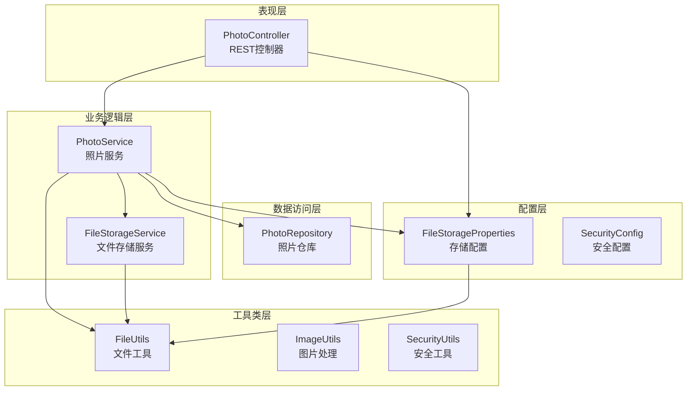
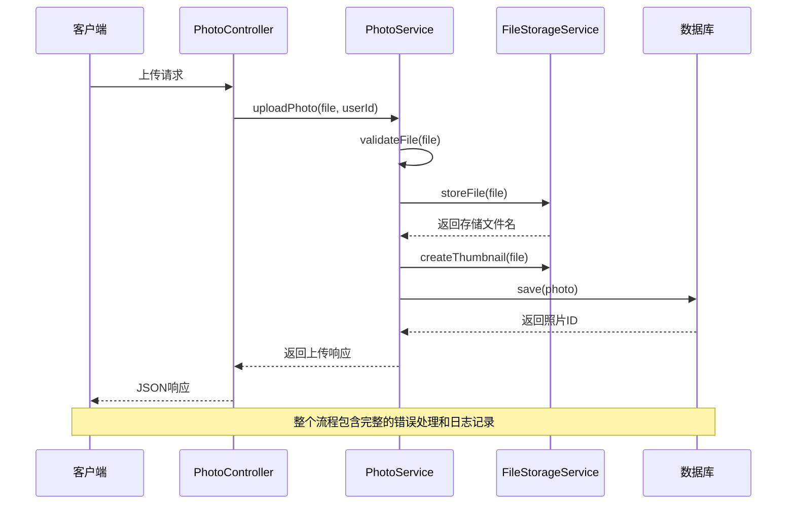
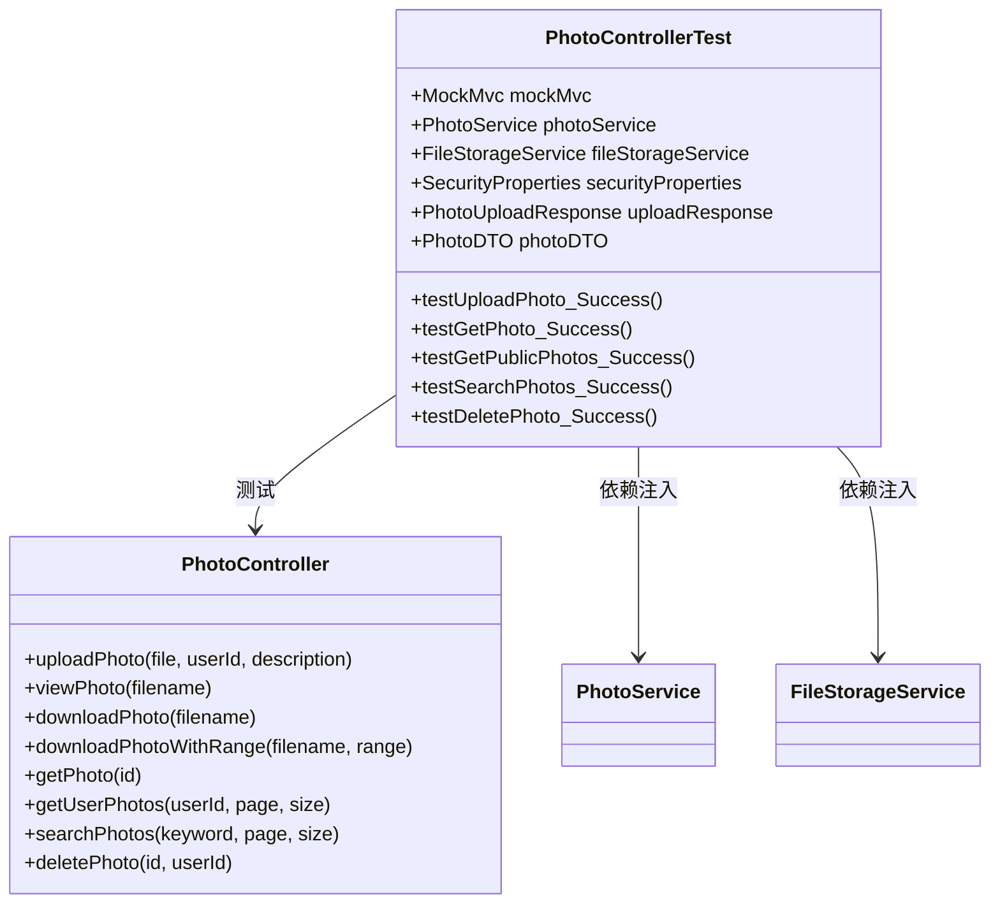
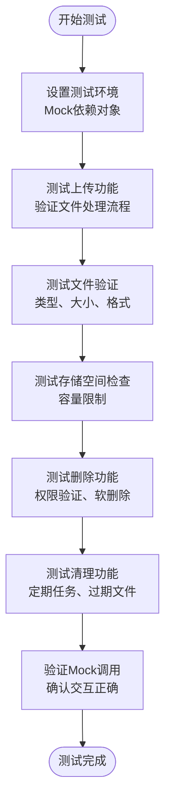
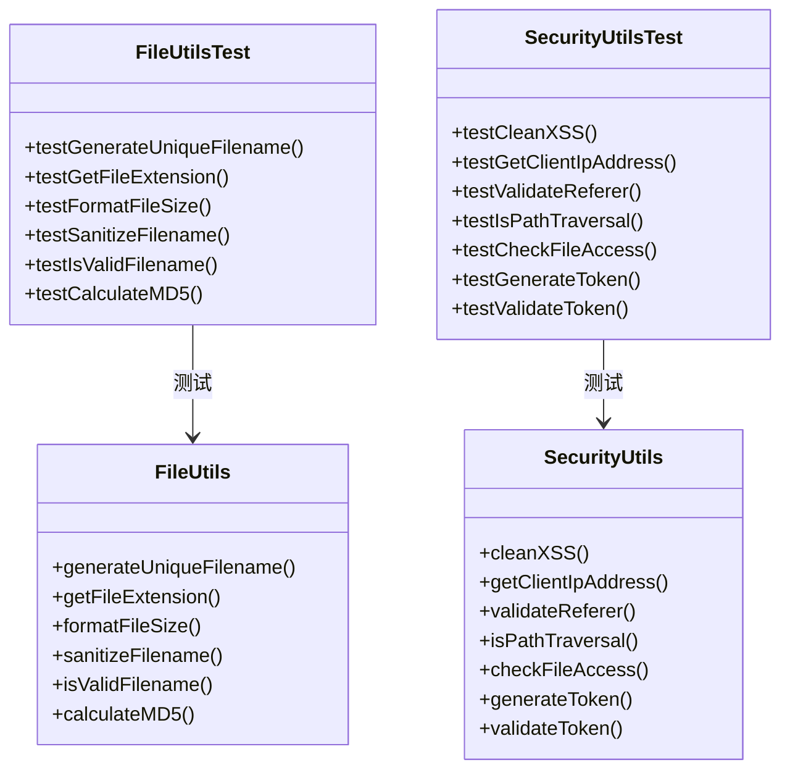
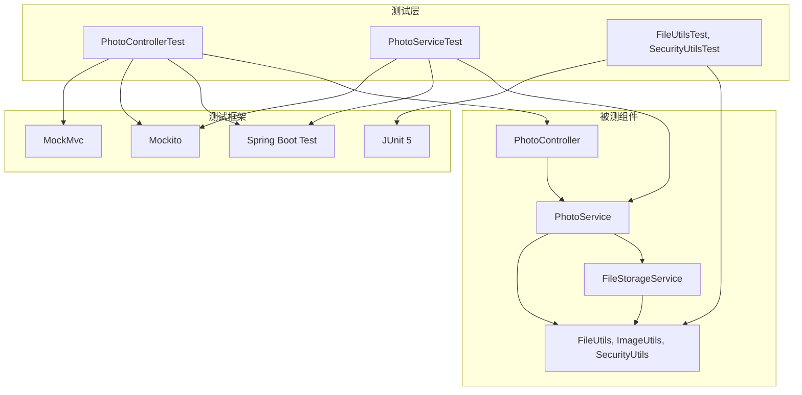

# 测试策略

<cite>
**本文档引用的文件**
- [PhotoUploadApplication.java](file://src/main/java/com/photo/PhotoUploadApplication.java)
- [PhotoController.java](file://src/main/java/com/photo/controller/PhotoController.java)
- [PhotoService.java](file://src/main/java/com/photo/service/PhotoService.java)
- [FileStorageService.java](file://src/main/java/com/photo/service/FileStorageService.java)
- [PhotoControllerTest.java](file://src/test/java/com/photo/controller/PhotoControllerTest.java)
- [PhotoServiceTest.java](file://src/test/java/com/photo/service/PhotoServiceTest.java)
- [FileUtilsTest.java](file://src/test/java/com/photo/util/FileUtilsTest.java)
- [SecurityUtilsTest.java](file://src/test/java/com/photo/util/SecurityUtilsTest.java)
- [application.yml](file://src/main/resources/application.yml)
- [application-test.yml](file://src/test/resources/application-test.yml)
- [FileStorageProperties.java](file://src/main/java/com/photo/config/FileStorageProperties.java)
- [FileUtils.java](file://src/main/java/com/photo/util/FileUtils.java)
- [ImageUtils.java](file://src/main/java/com/photo/util/ImageUtils.java)
- [pom.xml](file://pom.xml)
- [README.md](file://README.md)
</cite>

## 目录
1. [引言](#引言)
2. [项目结构](#项目结构)
3. [核心组件](#核心组件)
4. [架构概览](#架构概览)
5. [详细组件分析](#详细组件分析)
6. [依赖关系分析](#依赖关系分析)
7. [性能考虑](#性能考虑)
8. [故障排除指南](#故障排除指南)
9. [结论](#结论)
10. [附录](#附录)

## 引言

本测试策略文档针对照片上传下载系统进行全面的测试架构设计和实施方法说明。该系统基于Spring Boot开发，提供完整的文件管理功能，包括上传、下载、在线预览、断点续传等核心功能。

系统采用分层架构设计，包含控制器层、服务层、数据访问层和工具类层，每个层次都有相应的测试策略和最佳实践。本文档将详细介绍单元测试、集成测试的设计原则和实现方式，涵盖控制器测试、服务层测试、工具类测试的具体示例。

## 项目结构

照片上传下载系统采用标准的Spring Boot项目结构，主要分为以下层次：

**图表来源**
- [PhotoController.java](file://src/main/java/com/photo/controller/PhotoController.java#L1-L316)
- [PhotoService.java](file://src/main/java/com/photo/service/PhotoService.java#L1-L385)
- [FileStorageService.java](file://src/main/java/com/photo/service/FileStorageService.java#L1-L300)
- [FileStorageProperties.java](file://src/main/java/com/photo/config/FileStorageProperties.java#L1-L94)

**章节来源**
- [PhotoUploadApplication.java](file://src/main/java/com/photo/PhotoUploadApplication.java#L1-L20)
- [README.md](file://README.md#L214-L252)

## 核心组件

### 控制器层
- **PhotoController**: 提供RESTful API接口，处理HTTP请求和响应
- 支持单文件上传、批量上传、在线预览、下载、断点续传等功能
- 实现防盗链检查和访问权限控制

### 服务层
- **PhotoService**: 核心业务逻辑处理，包括文件验证、存储空间检查、数据库操作
- **FileStorageService**: 文件存储管理，包括文件读写、缩略图生成、压缩等功能

### 工具类层
- **FileUtils**: 文件操作工具，包括MD5计算、文件名处理、大小格式化
- **ImageUtils**: 图片处理工具，包括尺寸获取、缩略图创建、图片压缩
- **SecurityUtils**: 安全工具，包括XSS防护、IP地址获取、Referer验证

**章节来源**
- [PhotoController.java](file://src/main/java/com/photo/controller/PhotoController.java#L27-L316)
- [PhotoService.java](file://src/main/java/com/photo/service/PhotoService.java#L31-L385)
- [FileStorageService.java](file://src/main/java/com/photo/service/FileStorageService.java#L19-L300)

## 架构概览

系统采用分层架构，各层职责明确，便于测试和维护：

**图表来源**
- [PhotoController.java](file://src/main/java/com/photo/controller/PhotoController.java#L48-L61)
- [PhotoService.java](file://src/main/java/com/photo/service/PhotoService.java#L50-L111)
- [FileStorageService.java](file://src/main/java/com/photo/service/FileStorageService.java#L59-L95)

## 详细组件分析

### 控制器测试策略

#### PhotoControllerTest 设计原则

控制器测试采用Spring MVC Test框架，专注于HTTP层的测试：

**图表来源**
- [PhotoControllerTest.java](file://src/test/java/com/photo/controller/PhotoControllerTest.java#L34-L174)
- [PhotoController.java](file://src/main/java/com/photo/controller/PhotoController.java#L48-L316)

#### 控制器测试场景

1. **上传功能测试**
   - 成功上传单个文件
   - 批量上传多个文件
   - 错误文件类型处理
   - 文件大小限制验证

2. **查询功能测试**
   - 获取单个照片信息
   - 获取用户照片列表
   - 获取公开照片列表
   - 搜索功能测试

3. **删除功能测试**
   - 成功删除照片
   - 权限验证测试
   - 软删除和硬删除测试

**章节来源**
- [PhotoControllerTest.java](file://src/test/java/com/photo/controller/PhotoControllerTest.java#L83-L173)

### 服务层测试策略

#### PhotoServiceTest 设计原则

服务层测试采用Mockito框架，专注于业务逻辑的单元测试：

**图表来源**
- [PhotoServiceTest.java](file://src/test/java/com/photo/service/PhotoServiceTest.java#L28-L210)

#### 服务层测试场景

1. **文件上传测试**
   - 成功上传流程验证
   - 文件重复检测测试
   - MD5去重功能测试
   - 图片尺寸获取测试

2. **存储管理测试**
   - 存储空间检查测试
   - 存储信息统计测试
   - 定期清理功能测试

3. **权限控制测试**
   - 用户权限验证
   - 文件访问控制
   - 删除权限检查

**章节来源**
- [PhotoServiceTest.java](file://src/test/java/com/photo/service/PhotoServiceTest.java#L81-L208)

### 工具类测试策略

#### FileUtilsTest 和 SecurityUtilsTest 设计原则

工具类测试专注于独立功能模块的验证：

**图表来源**
- [FileUtilsTest.java](file://src/test/java/com/photo/util/FileUtilsTest.java#L11-L98)
- [SecurityUtilsTest.java](file://src/test/java/com/photo/util/SecurityUtilsTest.java#L15-L162)

#### 工具类测试场景

1. **文件工具测试**
   - 唯一文件名生成测试
   - 文件扩展名提取测试
   - 文件大小格式化测试
   - 文件名安全处理测试
   - MD5哈希计算测试

2. **安全工具测试**
   - XSS攻击防护测试
   - IP地址获取测试
   - Referer验证测试
   - 路径遍历攻击防护测试
   - 文件访问权限测试
   - Token生成和验证测试

**章节来源**
- [FileUtilsTest.java](file://src/test/java/com/photo/util/FileUtilsTest.java#L13-L96)
- [SecurityUtilsTest.java](file://src/test/java/com/photo/util/SecurityUtilsTest.java#L17-L160)

## 依赖关系分析

系统测试架构中的依赖关系如下：

**图表来源**
- [PhotoControllerTest.java](file://src/test/java/com/photo/controller/PhotoControllerTest.java#L34-L35)
- [PhotoServiceTest.java](file://src/test/java/com/photo/service/PhotoServiceTest.java#L28-L41)
- [FileUtilsTest.java](file://src/test/java/com/photo/util/FileUtilsTest.java#L11-L11)
- [SecurityUtilsTest.java](file://src/test/java/com/photo/util/SecurityUtilsTest.java#L15-L15)

**章节来源**
- [pom.xml](file://pom.xml#L122-L134)

## 性能考虑

### 测试性能优化策略

1. **测试隔离性**
   - 使用Mock对象隔离外部依赖
   - 避免真实数据库和文件系统操作
   - 使用内存数据库进行集成测试

2. **测试执行效率**
   - 并行执行独立的测试用例
   - 减少测试间的依赖关系
   - 使用适当的测试数据复用

3. **资源管理**
   - 及时清理测试产生的临时文件
   - 合理管理测试数据库连接
   - 控制测试日志输出级别

### 性能测试场景

1. **高并发上传测试**
   - 模拟多用户同时上传文件
   - 测试存储服务的并发处理能力
   - 验证数据库连接池的使用

2. **大文件处理测试**
   - 测试大文件的分块上传
   - 验证内存使用情况
   - 测试断点续传功能

3. **缓存性能测试**
   - 验证Caffeine缓存的效果
   - 测试缓存命中率
   - 验证缓存失效机制

## 故障排除指南

### 常见测试问题及解决方案

#### 1. 测试环境配置问题

**问题**: 测试数据库连接失败
**解决方案**: 
- 检查application-test.yml配置
- 确认H2数据库驱动版本兼容性
- 验证数据库URL和凭据设置

**章节来源**
- [application-test.yml](file://src/test/resources/application-test.yml#L6-L16)

#### 2. Mock对象配置问题

**问题**: Mock对象无法正确模拟行为
**解决方案**:
- 检查@MockBean注解的正确使用
- 验证Mock对象的作用域
- 确认测试方法中的参数匹配

**章节来源**
- [PhotoControllerTest.java](file://src/test/java/com/photo/controller/PhotoControllerTest.java#L40-L47)

#### 3. 文件上传测试问题

**问题**: 文件上传测试失败
**解决方案**:
- 确认MultipartFile对象的正确创建
- 检查文件大小和类型限制
- 验证存储路径的可写权限

**章节来源**
- [PhotoServiceTest.java](file://src/test/java/com/photo/service/PhotoServiceTest.java#L49-L54)

#### 4. 缓存测试问题

**问题**: 缓存相关的测试不稳定
**解决方案**:
- 使用@DirtiesContext注解确保缓存重置
- 验证缓存配置的正确性
- 检查@Cacheable和@CacheEvict注解的使用

**章节来源**
- [PhotoService.java](file://src/main/java/com/photo/service/PhotoService.java#L141-L151)

### 调试技巧

1. **日志调试**
   - 启用DEBUG级别的日志输出
   - 使用@TestPropertySource配置日志级别
   - 分析测试执行过程中的日志信息

2. **断点调试**
   - 在关键业务逻辑处设置断点
   - 检查变量状态和方法调用栈
   - 验证业务逻辑的正确性

3. **性能分析**
   - 使用JVM性能分析工具
   - 监控内存使用情况
   - 分析测试执行时间

## 结论

本测试策略文档为照片上传下载系统提供了全面的测试架构设计和实施指导。通过分层测试策略，包括控制器测试、服务层测试和工具类测试，确保了系统的功能完整性、性能稳定性和安全性。

测试策略的关键要点包括：
- 明确的分层测试架构
- 完善的测试场景覆盖
- 有效的错误处理和异常测试
- 性能和安全性的专项测试
- 自动化测试和持续集成的支持

建议在实际项目中根据具体需求调整测试策略，增加更多的集成测试和端到端测试，以确保系统的完整性和可靠性。

## 附录

### 测试配置参考

#### 开发环境配置
- 数据库：H2嵌入式数据库
- 文件存储：本地文件系统
- 缓存：Caffeine内存缓存
- 日志：控制台和文件输出

#### 测试环境配置
- 数据库：H2内存数据库
- 文件存储：临时目录
- 缓存：禁用缓存
- 日志：INFO级别

**章节来源**
- [application.yml](file://src/main/resources/application.yml#L69-L118)
- [application-test.yml](file://src/test/resources/application-test.yml#L23-L51)

### 测试工具和依赖

系统测试使用的主要工具和依赖包括：
- Spring Boot Test：测试框架基础
- Mockito：Mock对象创建和验证
- JUnit 5：测试执行和断言
- H2 Database：内存数据库测试
- Spring Security Test：安全测试支持

**章节来源**
- [pom.xml](file://pom.xml#L122-L134)