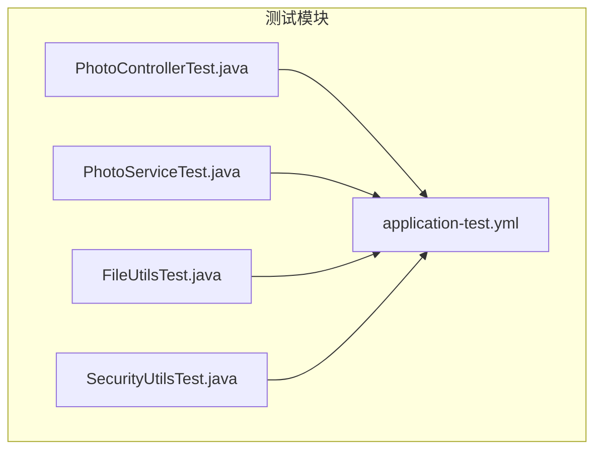
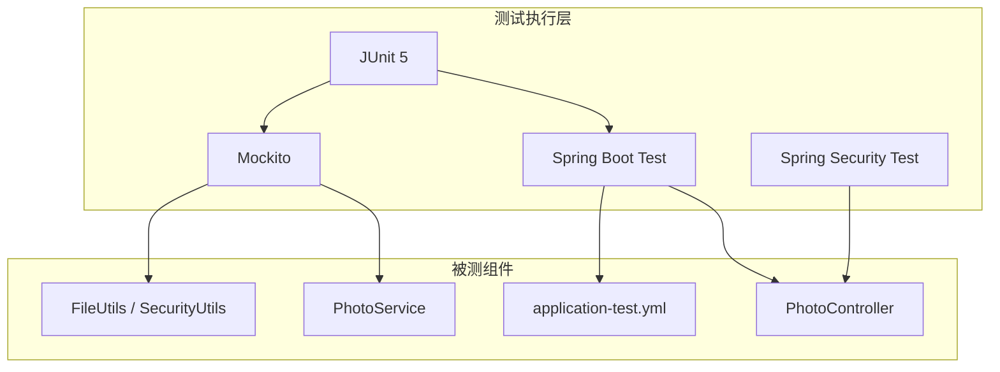
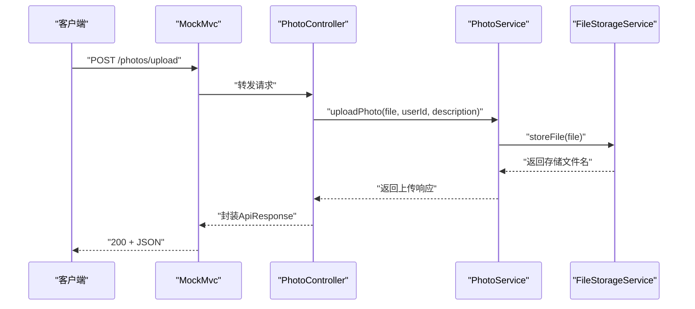
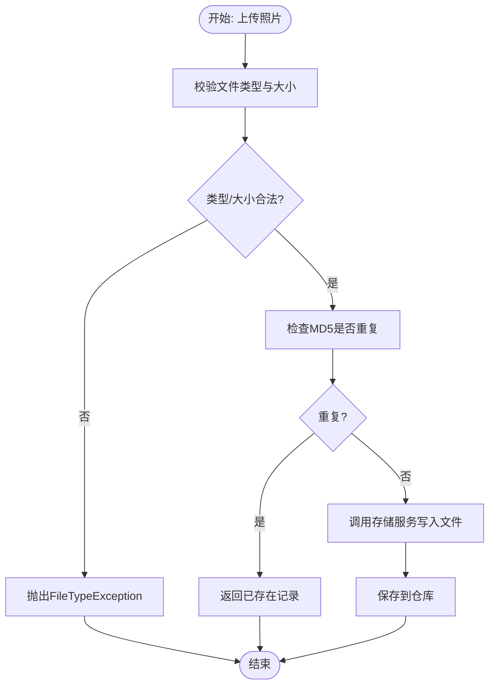
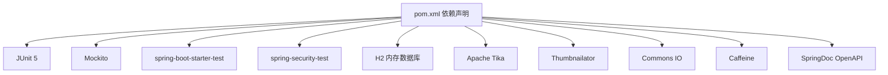

# 测试管理

<cite>
**本文引用的文件**
- [pom.xml](file://pom.xml)
- [PhotoControllerTest.java](file://src/test/java/com/photo/controller/PhotoControllerTest.java)
- [PhotoServiceTest.java](file://src/test/java/com/photo/service/PhotoServiceTest.java)
- [FileUtilsTest.java](file://src/test/java/com/photo/util/FileUtilsTest.java)
- [SecurityUtilsTest.java](file://src/test/java/com/photo/util/SecurityUtilsTest.java)
- [application-test.yml](file://src/test/resources/application-test.yml)
- [README.md](file://README.md)
- [PROJECT_SUMMARY.md](file://PROJECT_SUMMARY.md)
- [API_DOCUMENTATION.md](file://API_DOCUMENTATION.md)
- [.gitignore](file://.gitignore)
</cite>

## 目录
1. [简介](#简介)
2. [项目结构](#项目结构)
3. [核心组件](#核心组件)
4. [架构总览](#架构总览)
5. [详细组件分析](#详细组件分析)
6. [依赖关系分析](#依赖关系分析)
7. [性能考量](#性能考量)
8. [故障排查指南](#故障排查指南)
9. [结论](#结论)
10. [附录](#附录)

## 简介
本文件面向“照片上传下载系统”的测试管理体系，系统化梳理测试框架、测试组织结构、依赖配置、测试报告与覆盖率统计、自动化集成方案、测试数据与环境管理、问题排查与调试技巧，以及测试团队协作流程。目标是帮助测试工程师与开发人员高效落地测试策略，确保系统质量与稳定性。

## 项目结构
测试相关代码集中在 src/test 目录下，按层次划分如下：
- controller 层测试：PhotoControllerTest.java
- service 层测试：PhotoServiceTest.java
- util 工具类测试：FileUtilsTest.java、SecurityUtilsTest.java
- 测试资源：application-test.yml（测试环境配置）

图表来源
- [PhotoControllerTest.java](file://src/test/java/com/photo/controller/PhotoControllerTest.java#L1-L174)
- [PhotoServiceTest.java](file://src/test/java/com/photo/service/PhotoServiceTest.java#L1-L210)
- [FileUtilsTest.java](file://src/test/java/com/photo/util/FileUtilsTest.java#L1-L98)
- [SecurityUtilsTest.java](file://src/test/java/com/photo/util/SecurityUtilsTest.java#L1-L162)
- [application-test.yml](file://src/test/resources/application-test.yml#L1-L75)

章节来源
- [PhotoControllerTest.java](file://src/test/java/com/photo/controller/PhotoControllerTest.java#L1-L174)
- [PhotoServiceTest.java](file://src/test/java/com/photo/service/PhotoServiceTest.java#L1-L210)
- [FileUtilsTest.java](file://src/test/java/com/photo/util/FileUtilsTest.java#L1-L98)
- [SecurityUtilsTest.java](file://src/test/java/com/photo/util/SecurityUtilsTest.java#L1-L162)
- [application-test.yml](file://src/test/resources/application-test.yml#L1-L75)

## 核心组件
- 测试框架与工具
  - JUnit 5：用于单元测试与断言
  - Mockito：用于模拟依赖与桩件
  - Spring Boot Test：用于Web层与集成测试
  - Spring Security Test：用于安全场景测试
- 测试环境配置
  - application-test.yml：H2内存数据库、文件存储路径、安全与CORS配置等
- 测试覆盖率与报告
  - 项目文档提供了使用 JaCoCo 生成覆盖率报告的命令

章节来源
- [pom.xml](file://pom.xml#L122-L134)
- [application-test.yml](file://src/test/resources/application-test.yml#L1-L75)
- [PROJECT_SUMMARY.md](file://PROJECT_SUMMARY.md#L231-L234)

## 架构总览
测试体系围绕“分层测试”展开：
- 控制器层：通过 WebMvcTest 与 MockMvc 验证HTTP接口行为
- 服务层：通过 Mockito 注入依赖，验证业务逻辑与边界条件
- 工具类层：对独立工具方法进行单元测试，覆盖边界与异常场景
- 配置层：测试环境配置隔离，确保测试可重复与可维护

图表来源
- [PhotoControllerTest.java](file://src/test/java/com/photo/controller/PhotoControllerTest.java#L13-L35)
- [PhotoServiceTest.java](file://src/test/java/com/photo/service/PhotoServiceTest.java#L28-L41)
- [application-test.yml](file://src/test/resources/application-test.yml#L1-L75)

## 详细组件分析

### 控制器层测试：PhotoControllerTest
- 测试目标
  - 验证上传、查询、搜索、删除等接口的HTTP行为与响应结构
  - 使用 @WebMvcTest 与 MockMvc 进行轻量级Web层测试
  - 使用 @MockBean 替换真实依赖，聚焦控制器逻辑
- 关键测试点
  - 上传成功：构造MockMultipartFile，校验响应码与数据字段
  - 查询与分页：校验分页结果与JSON路径
  - 搜索与删除：校验参数传递与业务调用
- 断言与期望
  - 使用 MockMvc 的 perform +andExpect 验证状态码与JSON路径
  - 使用 verify 校验服务层调用次数与参数

图表来源
- [PhotoControllerTest.java](file://src/test/java/com/photo/controller/PhotoControllerTest.java#L83-L106)

章节来源
- [PhotoControllerTest.java](file://src/test/java/com/photo/controller/PhotoControllerTest.java#L1-L174)

### 服务层测试：PhotoServiceTest
- 测试目标
  - 验证上传、查询、删除、存储空间检查等核心业务逻辑
  - 使用 @ExtendWith(MockitoExtension.class) 与 @Mock/@InjectMocks
- 关键测试点
  - 上传成功：MD5去重、存储上限检查、仓库保存
  - 异常场景：文件类型异常、存储空间不足、资源不存在
  - 权限与访问控制：删除权限校验
- 断言与期望
  - 使用 assertThrows 验证异常抛出
  - 使用 verify 校验仓库与存储服务调用

图表来源
- [PhotoServiceTest.java](file://src/test/java/com/photo/service/PhotoServiceTest.java#L82-L98)

章节来源
- [PhotoServiceTest.java](file://src/test/java/com/photo/service/PhotoServiceTest.java#L1-L210)

### 工具类测试：FileUtilsTest
- 测试目标
  - 文件名生成、扩展名提取、大小格式化、文件名清洗、合法性校验、MD5计算
- 关键测试点
  - 唯一文件名生成：两次生成不同且扩展名一致
  - 文件名清洗：防止路径遍历与XSS字符
  - MD5计算：返回32位十六进制字符串

章节来源
- [FileUtilsTest.java](file://src/test/java/com/photo/util/FileUtilsTest.java#L1-L98)

### 工具类测试：SecurityUtilsTest
- 测试目标
  - XSS清洗、IP解析、Referer校验、路径遍历检测、访问权限判断、Token生成与校验
- 关键测试点
  - IP解析优先级：X-Forwarded-For > RemoteAddr
  - Referer白名单校验
  - Token长度与内容校验

章节来源
- [SecurityUtilsTest.java](file://src/test/java/com/photo/util/SecurityUtilsTest.java#L1-L162)

## 依赖关系分析
- 测试框架与工具
  - JUnit 5、Mockito、Spring Boot Starter Test、Spring Security Test
- 文件与图片处理
  - Commons IO、Thumbnailator、Apache Tika
- 缓存与文档
  - Caffeine、SpringDoc OpenAPI
- 测试环境
  - H2内存数据库、CORS与安全配置

图表来源
- [pom.xml](file://pom.xml#L30-L149)

章节来源
- [pom.xml](file://pom.xml#L1-L169)

## 性能考量
- 测试执行效率
  - 使用 @WebMvcTest 与 @MockBean 减少启动成本，提升控制器测试速度
  - 使用 H2 内存数据库，避免磁盘IO，提高服务层测试吞吐
- 覆盖率与质量度量
  - 项目文档提供使用 JaCoCo 生成覆盖率报告的命令，便于持续改进
- 并发与边界
  - 工具类测试覆盖异常与边界场景，有助于发现潜在并发问题

章节来源
- [PROJECT_SUMMARY.md](file://PROJECT_SUMMARY.md#L231-L234)
- [application-test.yml](file://src/test/resources/application-test.yml#L6-L16)

## 故障排查指南
- 常见问题定位
  - 控制器测试失败：检查 MockMvc 请求参数、路径变量与JSON断言路径
  - 服务层异常：核对异常类型与抛出条件，确认仓库与存储服务行为
  - 工具类异常：关注输入合法性、路径遍历与XSS字符
- 调试技巧
  - 在 application-test.yml 中开启 show-sql 与日志级别，观察SQL与业务日志
  - 使用断点与单步调试，结合Mockito.verify验证调用链
- 环境隔离
  - 测试与开发环境分离，避免共享数据库与文件系统导致的副作用

章节来源
- [application-test.yml](file://src/test/resources/application-test.yml#L12-L16)
- [README.md](file://README.md#L202-L212)

## 结论
本测试管理体系以分层测试为核心，结合 JUnit 5、Mockito、Spring Boot Test 与 Spring Security Test，构建了覆盖控制器、服务与工具类的完整测试矩阵。配合 H2 内存数据库与明确的测试配置，实现了高效率、可重复的测试执行。通过 JaCoCo 覆盖率与质量度量，持续改进测试质量；通过清晰的故障排查与调试流程，保障问题快速定位与修复。

## 附录

### 测试报告与覆盖率
- 生成覆盖率报告
  - 使用命令：mvn clean test jacoco:report
- 质量度量指标
  - 覆盖率阈值建议：语句覆盖率、分支覆盖率、行覆盖率、类覆盖率
  - 持续集成中可结合 SonarQube 或 GitHub Actions 进行质量门禁

章节来源
- [PROJECT_SUMMARY.md](file://PROJECT_SUMMARY.md#L231-L234)

### 测试自动化与持续集成
- 建议流程
  - 本地提交前执行 mvn test 与 mvn verify
  - CI流水线：拉取代码 → 依赖安装 → 执行测试 → 生成覆盖率报告 → 质量门禁
- 集成点
  - GitHub Actions/CI平台：配置Maven步骤与覆盖率收集
  - 代码扫描：结合 SpotBugs、Checkstyle、PMD等静态分析

章节来源
- [README.md](file://README.md#L202-L212)

### 测试数据与环境管理
- 测试数据
  - 使用 MockMultipartFile 与 MockHttpServletRequest 构造测试数据
  - 工具类测试使用固定输入与预期输出，保证可重复性
- 测试环境
  - application-test.yml 配置H2内存数据库、文件存储路径、CORS与安全策略
  - .gitignore 忽略上传目录与覆盖率报告目录，避免污染版本库

章节来源
- [application-test.yml](file://src/test/resources/application-test.yml#L1-L75)
- [.gitignore](file://.gitignore#L12-L14)
- [.gitignore](file://.gitignore#L36-L38)

### API参考与测试对照
- API接口列表与响应格式详见 API 文档，测试用例可据此编写断言与期望

章节来源
- [API_DOCUMENTATION.md](file://API_DOCUMENTATION.md#L1-L509)