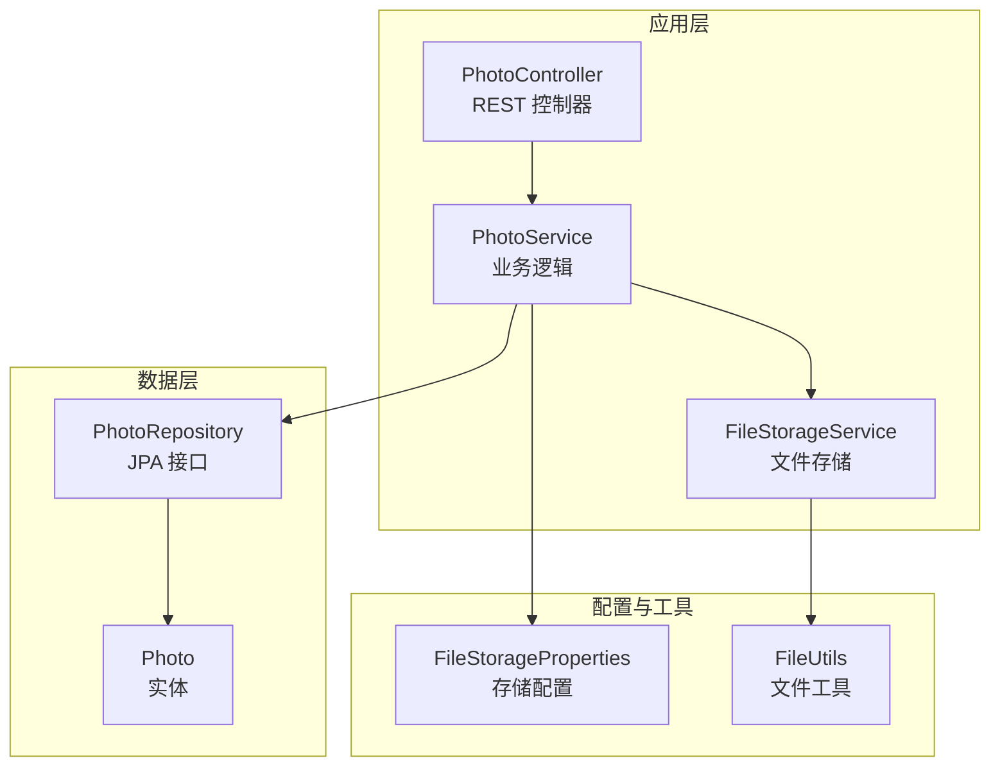
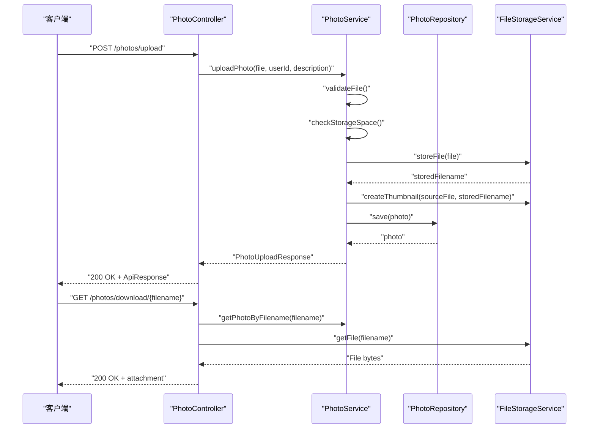
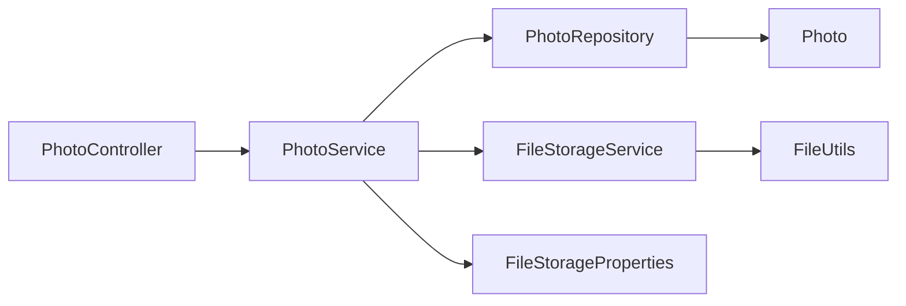

# 集成测试

<cite>
**本文引用的文件**
- [application.yml](file://src/main/resources/application.yml)
- [application-test.yml](file://src/test/resources/application-test.yml)
- [PhotoController.java](file://src/main/java/com/photo/controller/PhotoController.java)
- [PhotoService.java](file://src/main/java/com/photo/service/PhotoService.java)
- [FileStorageService.java](file://src/main/java/com/photo/service/FileStorageService.java)
- [PhotoRepository.java](file://src/main/java/com/photo/repository/PhotoRepository.java)
- [Photo.java](file://src/main/java/com/photo/entity/Photo.java)
- [FileUtils.java](file://src/main/java/com/photo/util/FileUtils.java)
- [FileStorageProperties.java](file://src/main/java/com/photo/config/FileStorageProperties.java)
- [PhotoControllerTest.java](file://src/test/java/com/photo/controller/PhotoControllerTest.java)
- [pom.xml](file://pom.xml)
- [schema.sql](file://src/main/resources/schema.sql)
</cite>

## 目录
1. [简介](#简介)
2. [项目结构](#项目结构)
3. [核心组件](#核心组件)
4. [架构概览](#架构概览)
5. [详细组件分析](#详细组件分析)
6. [依赖关系分析](#依赖关系分析)
7. [性能考虑](#性能考虑)
8. [故障排查指南](#故障排查指南)
9. [结论](#结论)
10. [附录](#附录)

## 简介
本文件面向照片上传下载系统的集成测试，提供从环境配置、测试策略、端到端场景设计到测试数据管理与隔离的完整方案。重点覆盖：
- 测试环境配置与搭建（application-test.yml 的关键项）
- 端到端上传/下载流程与 API 集成测试场景
- 测试数据生成与清理策略
- 测试数据库与数据隔离
- 与生产环境差异与注意事项
- 执行流程与结果验证方法

## 项目结构
系统采用 Spring Boot 分层架构，核心模块包括控制器、服务层、数据访问层、实体与工具类。测试主要集中在控制器层与服务层，结合 H2 内存数据库进行集成测试。

图表来源
- [PhotoController.java](file://src/main/java/com/photo/controller/PhotoController.java#L30-L316)
- [PhotoService.java](file://src/main/java/com/photo/service/PhotoService.java#L34-L385)
- [FileStorageService.java](file://src/main/java/com/photo/service/FileStorageService.java#L22-L300)
- [PhotoRepository.java](file://src/main/java/com/photo/repository/PhotoRepository.java#L19-L112)
- [Photo.java](file://src/main/java/com/photo/entity/Photo.java#L17-L174)
- [FileStorageProperties.java](file://src/main/java/com/photo/config/FileStorageProperties.java#L12-L94)
- [FileUtils.java](file://src/main/java/com/photo/util/FileUtils.java#L19-L178)

章节来源
- [PhotoController.java](file://src/main/java/com/photo/controller/PhotoController.java#L30-L316)
- [PhotoService.java](file://src/main/java/com/photo/service/PhotoService.java#L34-L385)
- [FileStorageService.java](file://src/main/java/com/photo/service/FileStorageService.java#L22-L300)
- [PhotoRepository.java](file://src/main/java/com/photo/repository/PhotoRepository.java#L19-L112)
- [Photo.java](file://src/main/java/com/photo/entity/Photo.java#L17-L174)
- [FileStorageProperties.java](file://src/main/java/com/photo/config/FileStorageProperties.java#L12-L94)
- [FileUtils.java](file://src/main/java/com/photo/util/FileUtils.java#L19-L178)

## 核心组件
- 控制器层：提供上传、下载、预览、缩略图、分页查询、搜索、删除等 REST 接口，负责参数校验、防盗链、缓存控制与响应封装。
- 服务层：实现业务规则（文件校验、去重、存储空间检查、访问/下载计数、存储信息统计、定时清理）。
- 存储层：基于文件系统与缩略图生成库，支持断点续传、压缩、缩略图、删除与范围读取。
- 数据访问层：基于 JPA 提供照片元数据的增删改查、统计与索引。
- 实体与配置：定义照片元数据模型与文件存储配置（类型、大小、缩略图、压缩、清理策略）。
- 工具类：文件名校验、MIME 类型检测、MD5 计算、文件大小格式化等。

章节来源
- [PhotoController.java](file://src/main/java/com/photo/controller/PhotoController.java#L48-L316)
- [PhotoService.java](file://src/main/java/com/photo/service/PhotoService.java#L50-L385)
- [FileStorageService.java](file://src/main/java/com/photo/service/FileStorageService.java#L59-L300)
- [PhotoRepository.java](file://src/main/java/com/photo/repository/PhotoRepository.java#L20-L112)
- [Photo.java](file://src/main/java/com/photo/entity/Photo.java#L27-L174)
- [FileStorageProperties.java](file://src/main/java/com/photo/config/FileStorageProperties.java#L14-L94)
- [FileUtils.java](file://src/main/java/com/photo/util/FileUtils.java#L41-L178)

## 架构概览
下图展示上传/下载端到端流程的关键步骤与组件交互。

图表来源
- [PhotoController.java](file://src/main/java/com/photo/controller/PhotoController.java#L48-L179)
- [PhotoService.java](file://src/main/java/com/photo/service/PhotoService.java#L50-L136)
- [FileStorageService.java](file://src/main/java/com/photo/service/FileStorageService.java#L59-L114)
- [PhotoRepository.java](file://src/main/java/com/photo/repository/PhotoRepository.java#L24-L46)

## 详细组件分析

### 测试环境配置与搭建
- 测试配置文件 application-test.yml 使用内存数据库（H2 内存库），自动建表与销毁，适合快速集成测试。
- 关键配置要点：
  - 数据源：内存数据库，驱动与连接信息简洁，便于 CI/CD 自动化。
  - JPA：DDL 自动建表/销毁，SQL 初始化模式。
  - Servlet：multipart 启用与大小限制，适配上传测试。
  - 文件存储：独立的测试上传目录，禁用定时清理，关闭压缩以提升稳定性。
  - 安全：禁用 referer 校验，便于本地测试；token 密钥与过期时间可自定义。
  - 日志：针对 com.photo 包输出调试日志，便于定位问题。

章节来源
- [application-test.yml](file://src/test/resources/application-test.yml#L6-L75)
- [application.yml](file://src/main/resources/application.yml#L6-L118)

### 端到端测试场景设计
- 上传流程测试
  - 单文件上传：构造 MockMultipartFile，调用 /photos/upload，断言响应状态码与数据字段。
  - 批量上传：构造多个文件，断言批量响应与异常处理。
  - 错误场景：空文件、超限文件、非图片类型、存储空间不足、重复文件（MD5 去重）。
- 下载与预览流程测试
  - 在线预览：/photos/view/{filename}，验证防盗链与缓存控制。
  - 下载：/photos/download/{filename}，验证附件头与文件内容。
  - 断点续传：/photos/download/range/{filename}，解析 Range 请求并返回部分数据。
  - 缩略图：/photos/thumbnail/{filename}，验证缩略图生成与返回。
- 查询与管理测试
  - 获取照片详情：/photos/{id}
  - 用户照片列表：/photos/user/{userId}
  - 公开照片列表：/photos/public
  - 搜索：/photos/search
  - 删除与永久删除：软删除与物理删除，验证权限与文件清理。

章节来源
- [PhotoControllerTest.java](file://src/test/java/com/photo/controller/PhotoControllerTest.java#L83-L173)
- [PhotoController.java](file://src/main/java/com/photo/controller/PhotoController.java#L48-L316)

### 测试数据准备与管理策略
- 测试数据生成
  - 使用 MockMultipartFile 构造测试文件，模拟真实上传场景。
  - 使用 DTO 对象（PhotoUploadResponse、PhotoDTO）模拟服务层返回值。
- 测试数据清理
  - 测试结束后，确保删除测试上传目录（./test-uploads）及其子目录，避免磁盘占用。
  - 若使用 H2 内存库，测试生命周期内自动建表/销毁，无需手动清理数据库。
- 数据隔离
  - 测试使用独立的存储根目录与数据库，避免与开发/生产环境冲突。
  - 禁用压缩与定时清理，保证测试一致性与可重复性。

章节来源
- [PhotoControllerTest.java](file://src/test/java/com/photo/controller/PhotoControllerTest.java#L52-L81)
- [application-test.yml](file://src/test/resources/application-test.yml#L23-L51)
- [FileStorageService.java](file://src/main/java/com/photo/service/FileStorageService.java#L283-L298)

### 测试数据库使用与数据隔离
- 测试数据库
  - H2 内存库（jdbc:h2:mem:testdb），自动建表/销毁，适合集成测试。
  - DDL 自动建表与 SQL 初始化模式，确保测试前具备所需表结构。
- 数据隔离
  - 每个测试用例运行在独立的内存数据库实例中，互不干扰。
  - 如需跨用例共享数据，可在测试类中使用 @BeforeEach 初始化固定数据集。

章节来源
- [application-test.yml](file://src/test/resources/application-test.yml#L6-L22)
- [schema.sql](file://src/main/resources/schema.sql#L1-L144)

### 测试环境与生产环境差异
- 数据库
  - 生产：可选 MySQL 或 H2 文件数据库；测试：H2 内存库。
  - 生产启用 SQL 初始化与方言配置；测试保持简化。
- 文件存储
  - 生产：本地文件系统，启用压缩与定时清理；测试：禁用压缩与清理，使用独立目录。
- 安全
  - 生产：启用 referer 校验与 CORS；测试：禁用 referer 校验，便于本地联调。
- 日志与监控
  - 生产：更严格的日志级别与监控暴露；测试：开启 com.photo 包调试日志。

章节来源
- [application.yml](file://src/main/resources/application.yml#L6-L118)
- [application-test.yml](file://src/test/resources/application-test.yml#L6-L75)

### 执行流程与结果验证
- 执行流程
  - Maven 运行测试：mvn test
  - 使用 @WebMvcTest 注解加载控制器层上下文，配合 @MockBean 注入服务层依赖。
- 结果验证
  - 使用 MockMvc 断言 HTTP 状态码、JSON 字段与分页数据结构。
  - 使用 verify 断言服务层方法被正确调用且参数匹配。

章节来源
- [PhotoControllerTest.java](file://src/test/java/com/photo/controller/PhotoControllerTest.java#L34-L173)
- [pom.xml](file://pom.xml#L122-L134)

## 依赖关系分析
- 控制器依赖服务层与安全配置，服务层依赖存储服务与仓库层，存储服务依赖配置与工具类。
- 依赖耦合度低，便于单元测试与集成测试分离。

图表来源
- [PhotoController.java](file://src/main/java/com/photo/controller/PhotoController.java#L36-L43)
- [PhotoService.java](file://src/main/java/com/photo/service/PhotoService.java#L38-L45)
- [FileStorageService.java](file://src/main/java/com/photo/service/FileStorageService.java#L26-L27)
- [FileStorageProperties.java](file://src/main/java/com/photo/config/FileStorageProperties.java#L14-L14)
- [PhotoRepository.java](file://src/main/java/com/photo/repository/PhotoRepository.java#L20-L20)
- [Photo.java](file://src/main/java/com/photo/entity/Photo.java#L27-L27)

## 性能考虑
- 上传性能
  - 合理设置 multipart 最大文件与请求大小，避免内存溢出。
  - 压缩与缩略图生成会增加 CPU 开销，测试阶段建议关闭压缩以提升稳定性。
- 下载性能
  - 断点续传与范围读取减少带宽消耗，提高大文件传输效率。
  - 缓存控制头设置有助于浏览器缓存与 CDN 加速。
- 存储与清理
  - 定时清理策略在生产环境启用，测试环境禁用以避免影响测试数据。

章节来源
- [application.yml](file://src/main/resources/application.yml#L42-L49)
- [application-test.yml](file://src/test/resources/application-test.yml#L43-L48)
- [PhotoService.java](file://src/main/java/com/photo/service/PhotoService.java#L275-L299)

## 故障排查指南
- 上传失败
  - 检查文件类型与扩展名是否在允许列表中；确认文件大小未超过限制。
  - 校验存储空间是否充足；查看 MD5 去重逻辑是否命中已有记录。
- 下载/预览失败
  - 确认文件存在且未被删除；检查防盗链配置与来源域名。
  - 断点续传 Range 解析错误时，检查 Range 头格式与边界处理。
- 数据库相关
  - H2 内存库重启后数据丢失属预期行为；如需持久化，请切换至文件数据库或外部数据库。
- 存储目录问题
  - 确保存储根目录可写；测试结束后清理目录，避免磁盘占用。

章节来源
- [FileUtils.java](file://src/main/java/com/photo/util/FileUtils.java#L56-L102)
- [PhotoService.java](file://src/main/java/com/photo/service/PhotoService.java#L304-L336)
- [FileStorageService.java](file://src/main/java/com/photo/service/FileStorageService.java#L100-L141)
- [PhotoController.java](file://src/main/java/com/photo/controller/PhotoController.java#L92-L97)

## 结论
本集成测试方案以 H2 内存数据库与独立存储目录为核心，结合控制器层与服务层的端到端场景，覆盖上传、下载、预览、缩略图、查询与管理等关键流程。通过合理的配置隔离与数据清理策略，确保测试的稳定性与可重复性。建议在持续集成环境中启用自动化测试，逐步完善异常与边界场景的覆盖。

## 附录
- 测试执行命令：mvn test
- 关键配置参考：
  - 应用配置：[application.yml](file://src/main/resources/application.yml#L6-L118)
  - 测试配置：[application-test.yml](file://src/test/resources/application-test.yml#L6-L75)
  - 存储配置：[FileStorageProperties.java](file://src/main/java/com/photo/config/FileStorageProperties.java#L14-L94)
  - 数据库初始化：[schema.sql](file://src/main/resources/schema.sql#L1-L144)