# Controller层设计

<cite>
**本文档引用的文件**
- [PhotoUploadApplication.java](file://src/main/java/com/photo/PhotoUploadApplication.java)
- [AuthController.java](file://src/main/java/com/photo/controller/AuthController.java)
- [BlogController.java](file://src/main/java/com/photo/controller/BlogController.java)
- [HomeController.java](file://src/main/java/com/photo/controller/HomeController.java)
- [NoteController.java](file://src/main/java/com/photo/controller/NoteController.java)
- [PhotoController.java](file://src/main/java/com/photo/controller/PhotoController.java)
- [ApiResponse.java](file://src/main/java/com/photo/dto/ApiResponse.java)
- [GlobalExceptionHandler.java](file://src/main/java/com/photo/exception/GlobalExceptionHandler.java)
- [application.yml](file://src/main/resources/application.yml)
- [SecurityConfig.java](file://src/main/java/com/photo/config/SecurityConfig.java)
- [CustomUserDetailsService.java](file://src/main/java/com/photo/service/CustomUserDetailsService.java)
- [User.java](file://src/main/java/com/photo/entity/User.java)
- [PhotoDTO.java](file://src/main/java/com/photo/dto/PhotoDTO.java)
</cite>

## 目录
1. [引言](#引言)
2. [项目结构](#项目结构)
3. [核心组件](#核心组件)
4. [架构概览](#架构概览)
5. [详细组件分析](#详细组件分析)
6. [依赖关系分析](#依赖关系分析)
7. [性能考虑](#性能考虑)
8. [故障排除指南](#故障排除指南)
9. [结论](#结论)

## 引言

本文件详细阐述了基于Spring MVC的控制器层架构设计，涵盖了认证、博客、主页、笔记和照片管理五大核心控制器的功能职责、HTTP请求映射、参数绑定、请求验证、响应封装等关键实现机制。该系统采用统一的响应封装策略和全局异常处理机制，确保了API的一致性和可靠性。

## 项目结构

该项目采用标准的Spring Boot项目结构，控制器层位于`src/main/java/com/photo/controller/`目录下，包含以下五个主要控制器：

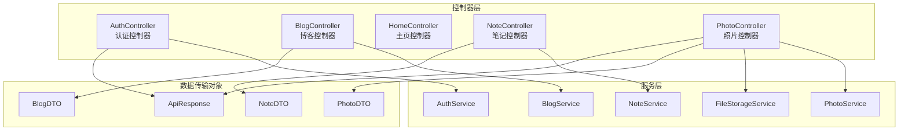

**图表来源**
- [AuthController.java](file://src/main/java/com/photo/controller/AuthController.java#L23-L25)
- [BlogController.java](file://src/main/java/com/photo/controller/BlogController.java#L18-L22)
- [NoteController.java](file://src/main/java/com/photo/controller/NoteController.java#L18-L22)
- [PhotoController.java](file://src/main/java/com/photo/controller/PhotoController.java#L30-L34)

**章节来源**
- [PhotoUploadApplication.java](file://src/main/java/com/photo/PhotoUploadApplication.java#L8-L14)
- [application.yml](file://src/main/resources/application.yml#L1-L190)

## 核心组件

### 控制器层架构模式

系统采用分层架构设计，每个控制器都有明确的职责边界：

1. **AuthController**: 负责用户认证相关接口
2. **BlogController**: 处理博客功能的所有HTTP请求
3. **HomeController**: 提供主页服务
4. **NoteController**: 管理笔记系统
5. **PhotoController**: 作为核心控制器处理照片上传下载

### 统一响应封装机制

所有REST控制器都使用统一的响应封装策略：

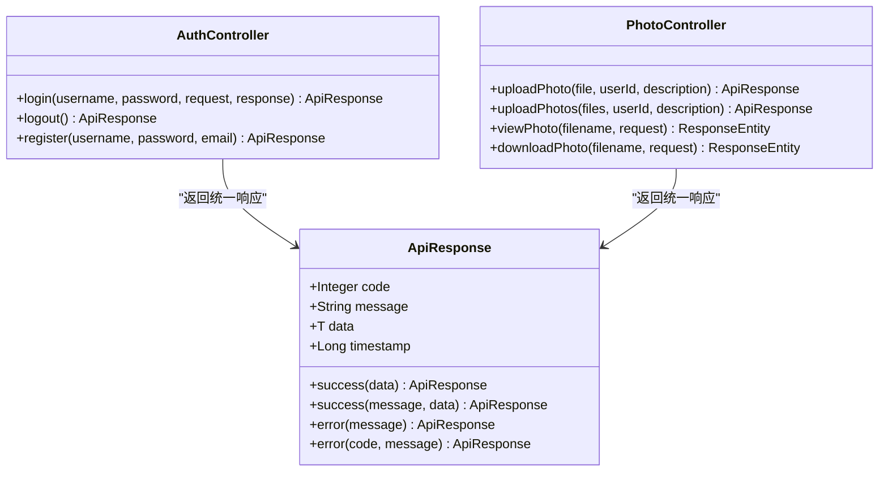

**图表来源**
- [ApiResponse.java](file://src/main/java/com/photo/dto/ApiResponse.java#L10-L62)
- [AuthController.java](file://src/main/java/com/photo/controller/AuthController.java#L47-L80)
- [PhotoController.java](file://src/main/java/com/photo/controller/PhotoController.java#L48-L61)

**章节来源**
- [ApiResponse.java](file://src/main/java/com/photo/dto/ApiResponse.java#L1-L63)
- [AuthController.java](file://src/main/java/com/photo/controller/AuthController.java#L1-L111)
- [PhotoController.java](file://src/main/java/com/photo/controller/PhotoController.java#L1-L316)

## 架构概览

### 控制器层整体架构

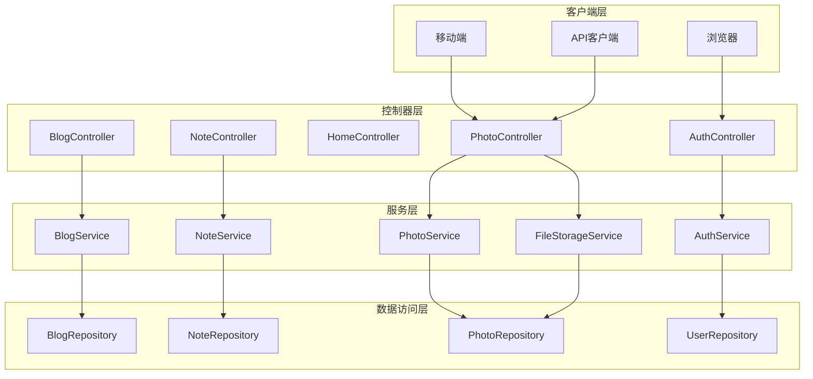

**图表来源**
- [AuthController.java](file://src/main/java/com/photo/controller/AuthController.java#L23-L35)
- [PhotoController.java](file://src/main/java/com/photo/controller/PhotoController.java#L30-L44)

### 请求处理流程

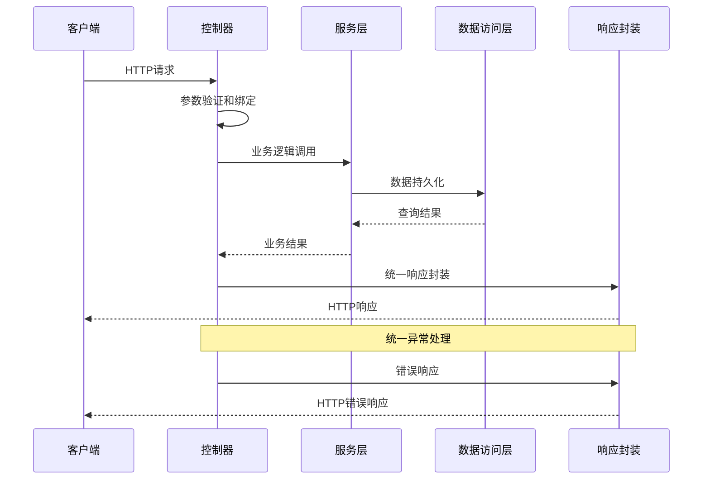

**图表来源**
- [GlobalExceptionHandler.java](file://src/main/java/com/photo/exception/GlobalExceptionHandler.java#L21-L139)
- [ApiResponse.java](file://src/main/java/com/photo/dto/ApiResponse.java#L38-L61)

## 详细组件分析

### AuthController - 认证控制器

#### 功能职责
AuthController专门负责用户认证相关接口，包括登录、注销、注册等功能。

#### HTTP请求映射

| 方法 | URL路径 | HTTP方法 | 功能描述 |
|------|---------|----------|----------|
| loginPage | `/auth/login` | GET | 显示登录页面 |
| login | `/auth/login` | POST | 处理登录请求 |
| logout | `/auth/logout` | POST | 注销登录 |
| register | `/auth/register` | POST | 注册新用户 |

#### 参数绑定与验证

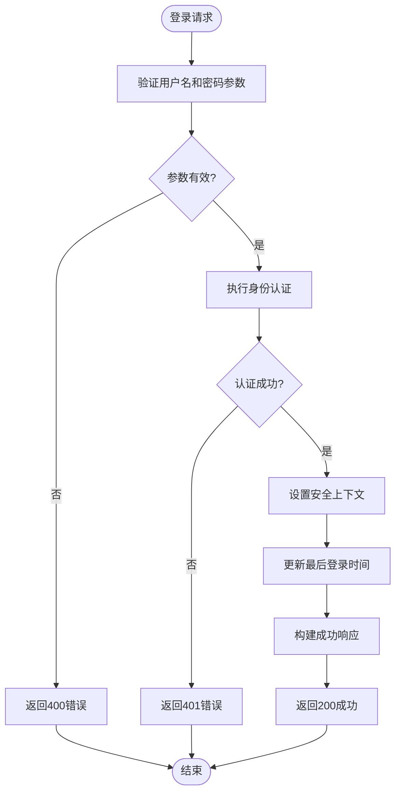

**图表来源**
- [AuthController.java](file://src/main/java/com/photo/controller/AuthController.java#L47-L80)

#### 认证流程实现

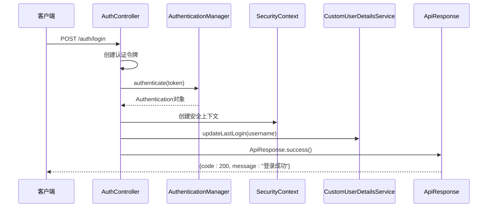

**图表来源**
- [AuthController.java](file://src/main/java/com/photo/controller/AuthController.java#L54-L76)
- [CustomUserDetailsService.java](file://src/main/java/com/photo/service/CustomUserDetailsService.java#L63-L68)

**章节来源**
- [AuthController.java](file://src/main/java/com/photo/controller/AuthController.java#L1-L111)
- [CustomUserDetailsService.java](file://src/main/java/com/photo/service/CustomUserDetailsService.java#L1-L70)

### BlogController - 博客控制器

#### 功能职责
BlogController处理博客相关的所有HTTP请求，包括列表展示、详情查看、创建、更新、删除等操作。

#### HTTP请求映射

| 方法 | URL路径 | HTTP方法 | 功能描述 |
|------|---------|----------|----------|
| listBlogs | `/blogs` | GET | 博客列表页面 |
| showCreateForm | `/blogs/new` | GET | 显示新建博客表单 |
| createBlog | `/blogs` | POST | 创建博客 |
| showBlog | `/blogs/{id}` | GET | 博客详情页面 |
| showEditForm | `/blogs/{id}/edit` | GET | 显示编辑博客表单 |
| updateBlog | `/blogs/{id}` | POST | 更新博客 |
| deleteBlog | `/blogs/{id}/delete` | POST | 删除博客 |

#### 页面渲染与重定向

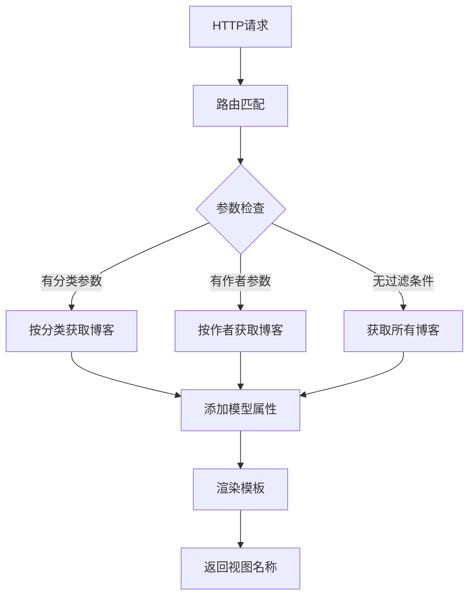

**图表来源**
- [BlogController.java](file://src/main/java/com/photo/controller/BlogController.java#L30-L51)

#### CRUD操作流程

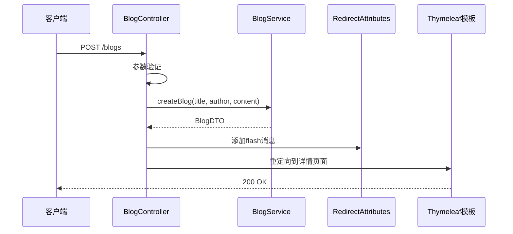

**图表来源**
- [BlogController.java](file://src/main/java/com/photo/controller/BlogController.java#L69-L87)

**章节来源**
- [BlogController.java](file://src/main/java/com/photo/controller/BlogController.java#L1-L173)

### HomeController - 主页控制器

#### 功能职责
HomeController提供主页服务，处理用户登录后的仪表板页面。

#### HTTP请求映射

| 方法 | URL路径 | HTTP方法 | 功能描述 |
|------|---------|----------|----------|
| home | `/` | GET | 主页 - 重定向到仪表板 |
| dashboard | `/dashboard` | GET | 仪表板页面 |

**章节来源**
- [HomeController.java](file://src/main/java/com/photo/controller/HomeController.java#L1-L27)

### NoteController - 笔记控制器

#### 功能职责
NoteController管理笔记系统，提供笔记的CRUD操作和Markdown预览功能。

#### HTTP请求映射

| 方法 | URL路径 | HTTP方法 | 功能描述 |
|------|---------|----------|----------|
| listNotes | `/` | GET | 便签列表首页 |
| showCreateForm | `/notes/new` | GET | 显示新建便签表单 |
| createNote | `/notes` | POST | 创建便签 |
| showNote | `/notes/{id}` | GET | 便签详情页面 |
| showEditForm | `/notes/{id}/edit` | GET | 显示编辑便签表单 |
| updateNote | `/notes/{id}` | POST | 更新便签 |
| deleteNote | `/notes/{id}/delete` | POST | 删除便签 |
| previewMarkdown | `/api/preview` | POST | Markdown预览API |

#### Markdown预览API

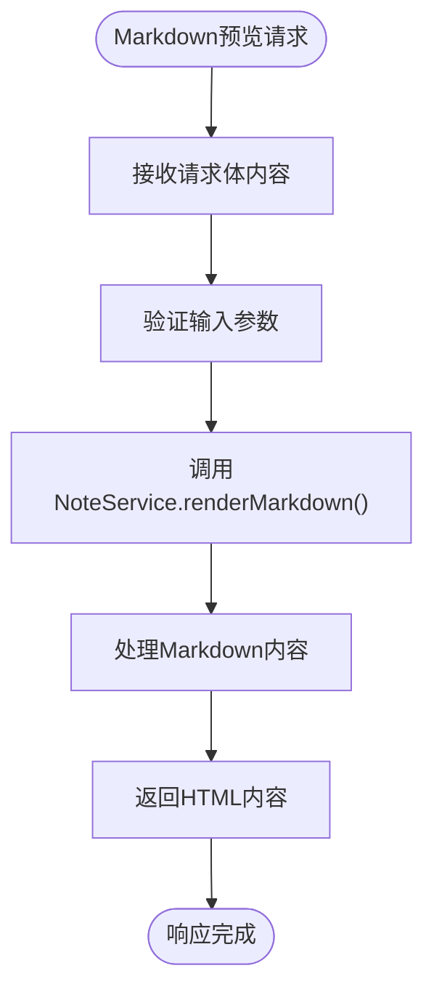

**图表来源**
- [NoteController.java](file://src/main/java/com/photo/controller/NoteController.java#L155-L160)

**章节来源**
- [NoteController.java](file://src/main/java/com/photo/controller/NoteController.java#L1-L162)

### PhotoController - 照片控制器

#### 功能职责
PhotoController作为核心控制器处理照片上传下载，提供完整的照片管理功能。

#### HTTP请求映射

| 方法 | URL路径 | HTTP方法 | 功能描述 |
|------|---------|----------|----------|
| uploadPhoto | `/photos/upload` | POST | 上传单个照片 |
| uploadPhotos | `/photos/upload/batch` | POST | 批量上传照片 |
| viewPhoto | `/photos/view/{filename:.+}` | GET | 在线预览照片 |
| viewThumbnail | `/photos/thumbnail/{filename:.+}` | GET | 查看缩略图 |
| downloadPhoto | `/photos/download/{filename:.+}` | GET | 下载照片 |
| downloadPhotoWithRange | `/photos/download/range/{filename:.+}` | GET | 断点续传下载 |
| getPhoto | `/photos/{id}` | GET | 获取照片信息 |
| getUserPhotos | `/photos/user/{userId}` | GET | 获取用户的照片列表 |
| getPublicPhotos | `/photos/public` | GET | 获取公开照片列表 |
| searchPhotos | `/photos/search` | GET | 搜索照片 |
| deletePhoto | `/photos/{id}` | DELETE | 删除照片 |
| permanentlyDeletePhoto | `/photos/{id}/permanent` | DELETE | 永久删除照片 |
| getStorageInfo | `/photos/storage/info` | GET | 获取存储空间信息 |

#### 文件上传处理流程

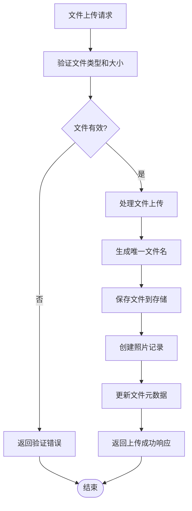

**图表来源**
- [PhotoController.java](file://src/main/java/com/photo/controller/PhotoController.java#L48-L61)

#### 断点续传下载实现

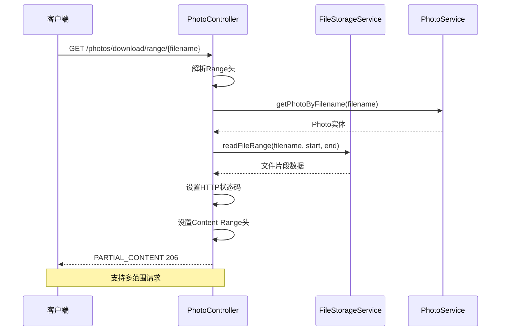

**图表来源**
- [PhotoController.java](file://src/main/java/com/photo/controller/PhotoController.java#L184-L225)

**章节来源**
- [PhotoController.java](file://src/main/java/com/photo/controller/PhotoController.java#L1-L316)

## 依赖关系分析

### 控制器间依赖关系

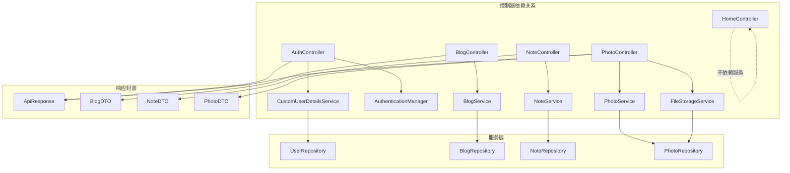

**图表来源**
- [AuthController.java](file://src/main/java/com/photo/controller/AuthController.java#L27-L34)
- [PhotoController.java](file://src/main/java/com/photo/controller/PhotoController.java#L36-L43)

### 统一异常处理机制

系统采用全局异常处理器统一处理各种异常情况：

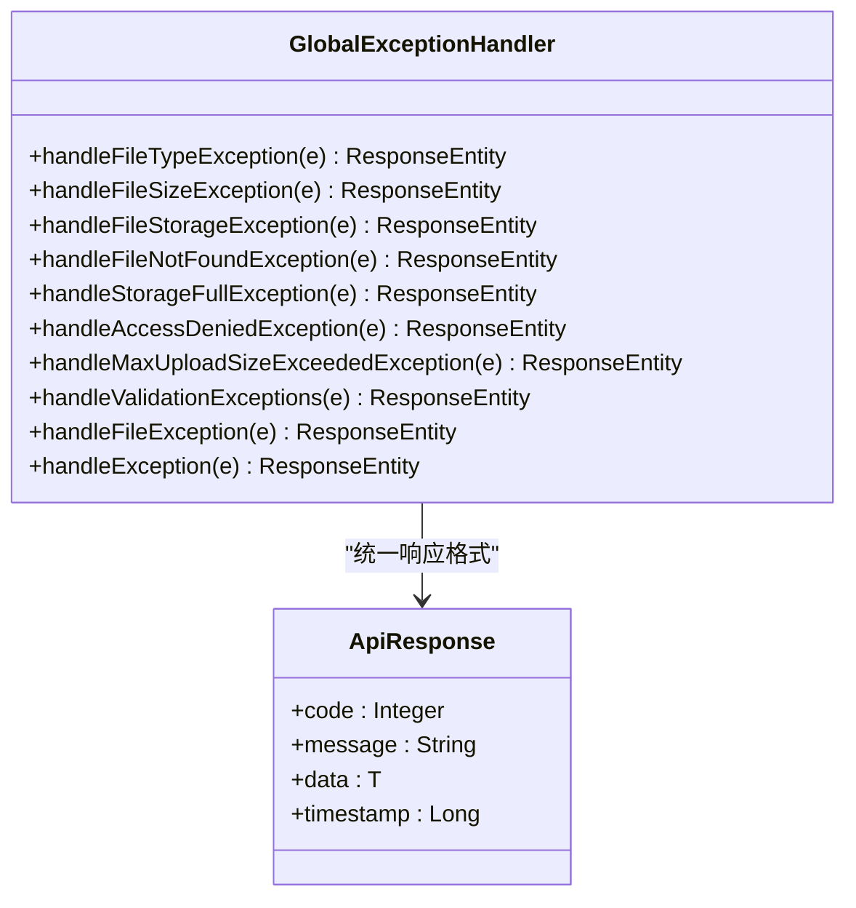

**图表来源**
- [GlobalExceptionHandler.java](file://src/main/java/com/photo/exception/GlobalExceptionHandler.java#L21-L139)
- [ApiResponse.java](file://src/main/java/com/photo/dto/ApiResponse.java#L13-L33)

**章节来源**
- [GlobalExceptionHandler.java](file://src/main/java/com/photo/exception/GlobalExceptionHandler.java#L1-L140)

## 性能考虑

### 缓存策略

系统启用了Caffeine缓存机制，配置如下：
- 缓存大小：1000个条目
- 过期时间：3600秒
- 缓存类型：本地缓存

### 文件存储优化

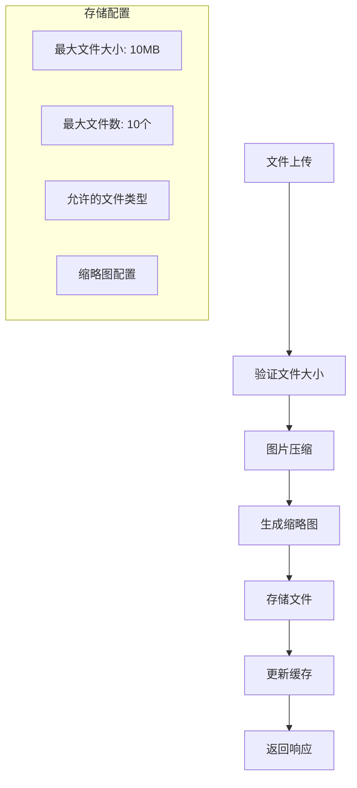

**图表来源**
- [application.yml](file://src/main/resources/application.yml#L94-L117)

### 安全配置

系统实现了多层次的安全防护：
- CSRF防护：禁用CSRF保护
- CORS配置：灵活的跨域资源共享
- 防盗链：基于Referer的访问控制
- 文件上传限制：防止恶意文件上传

**章节来源**
- [application.yml](file://src/main/resources/application.yml#L50-L145)
- [SecurityConfig.java](file://src/main/java/com/photo/config/SecurityConfig.java#L37-L58)

## 故障排除指南

### 常见问题诊断

1. **认证失败**
   - 检查用户名密码是否正确
   - 确认用户账户是否启用
   - 验证密码编码方式

2. **文件上传失败**
   - 检查文件大小限制
   - 验证文件类型是否允许
   - 确认存储空间是否充足

3. **照片访问权限问题**
   - 验证防盗链配置
   - 检查用户权限
   - 确认照片状态

### 异常处理策略

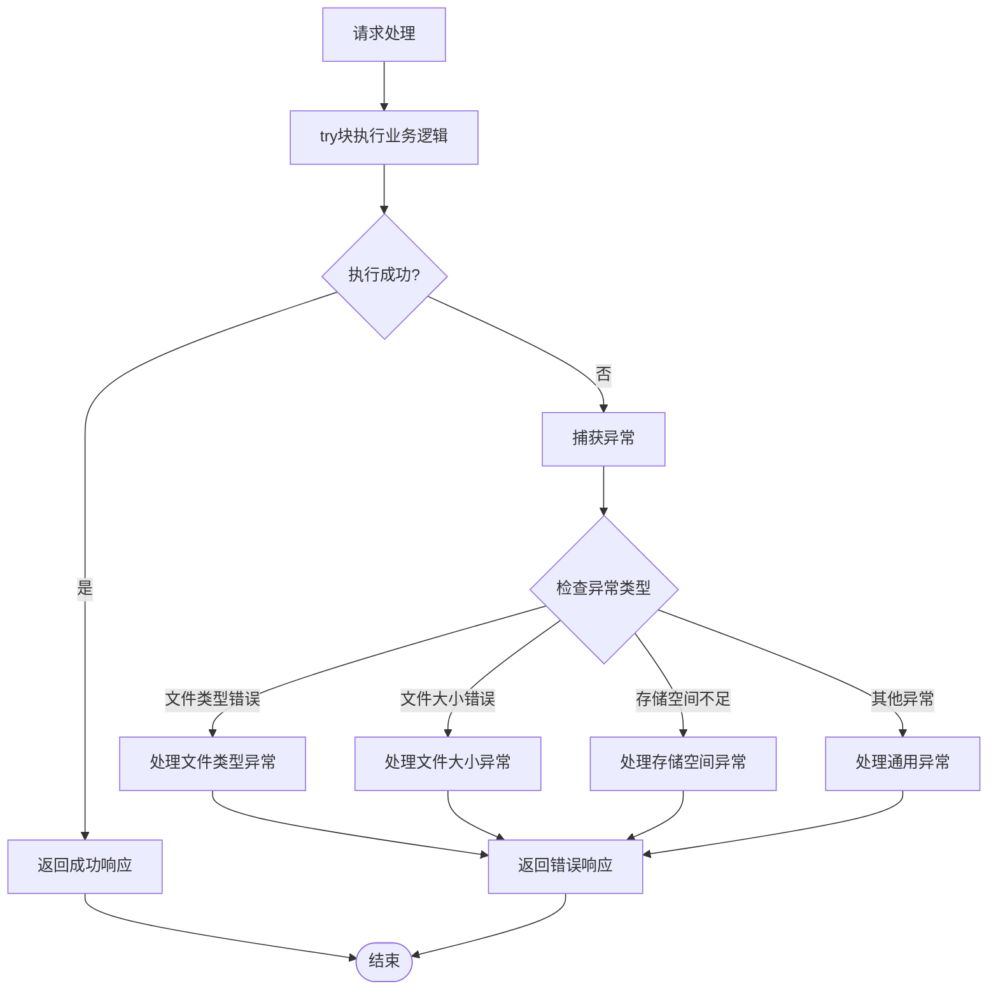

**图表来源**
- [GlobalExceptionHandler.java](file://src/main/java/com/photo/exception/GlobalExceptionHandler.java#L26-L138)

**章节来源**
- [GlobalExceptionHandler.java](file://src/main/java/com/photo/exception/GlobalExceptionHandler.java#L1-L140)

## 结论

该Spring MVC控制器层设计体现了清晰的分层架构和职责分离原则。通过统一的响应封装机制和全局异常处理策略，确保了系统的稳定性和一致性。各控制器模块职责明确，参数绑定规范，业务逻辑清晰，为后续的功能扩展和维护提供了良好的基础。

系统在安全性、性能优化、错误处理等方面都采用了最佳实践，是一个成熟可靠的Web应用控制器层实现方案。