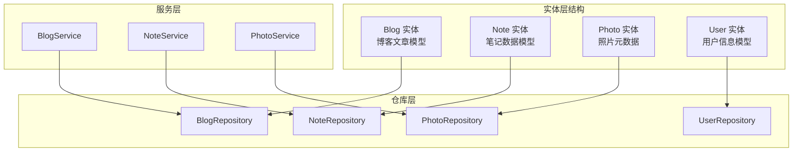
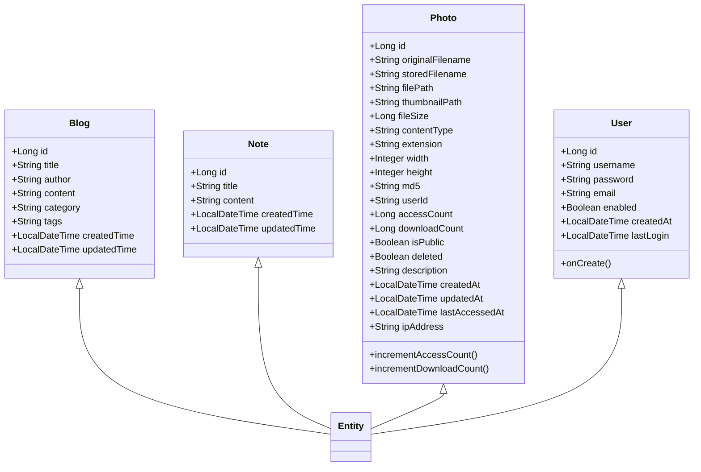
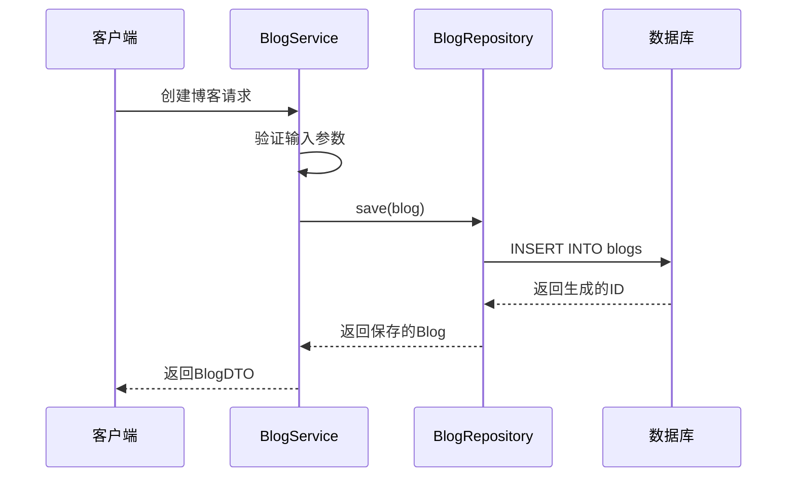
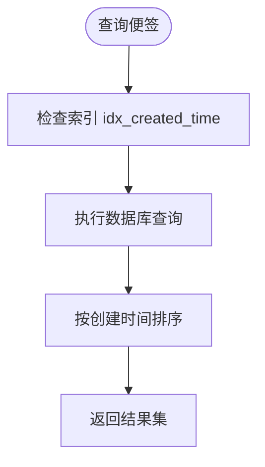
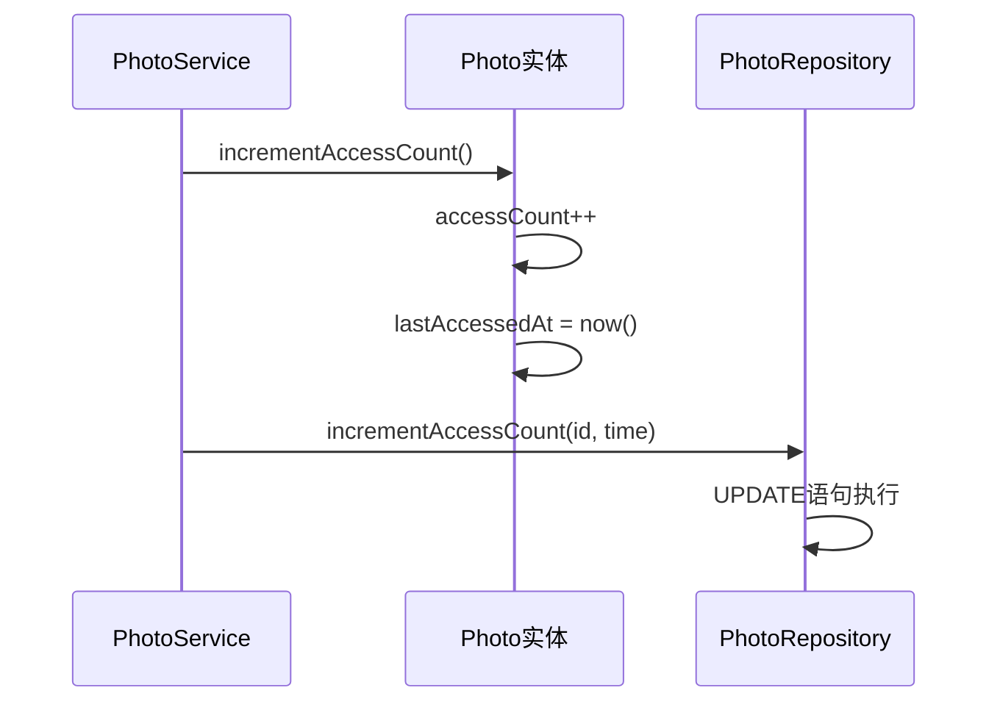
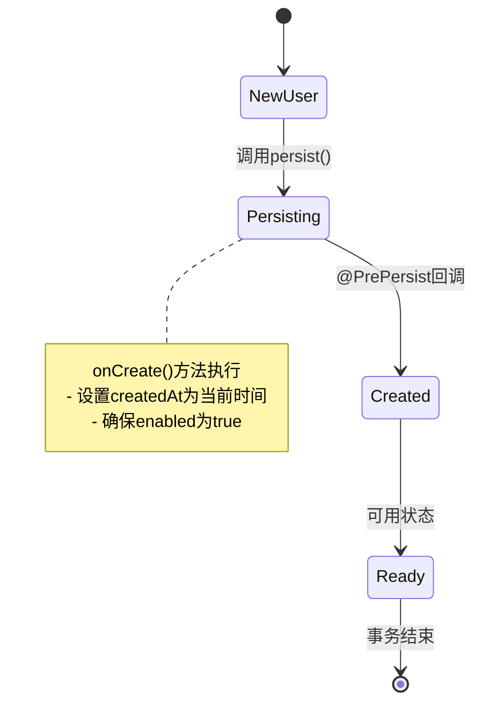
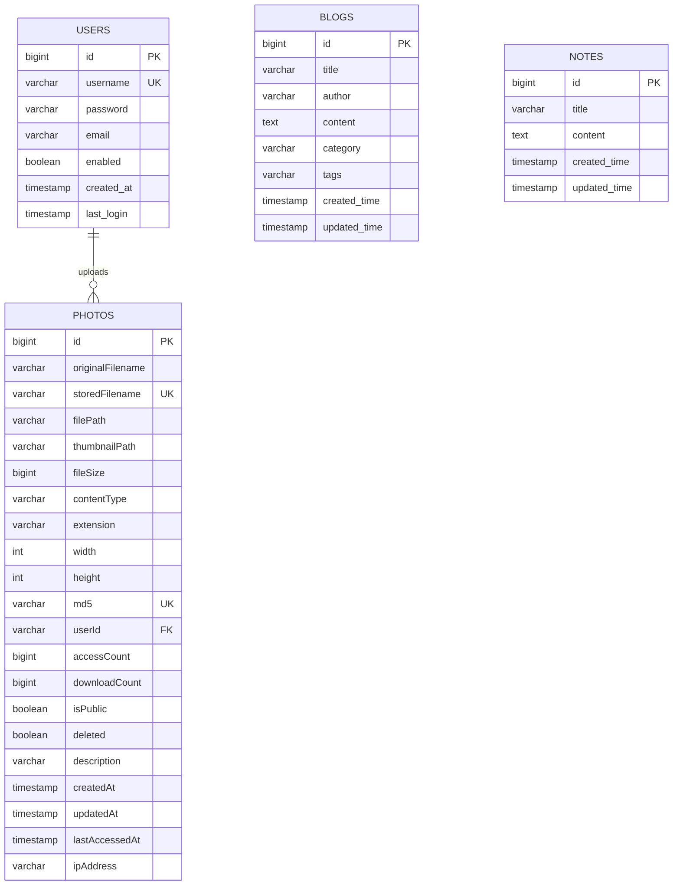
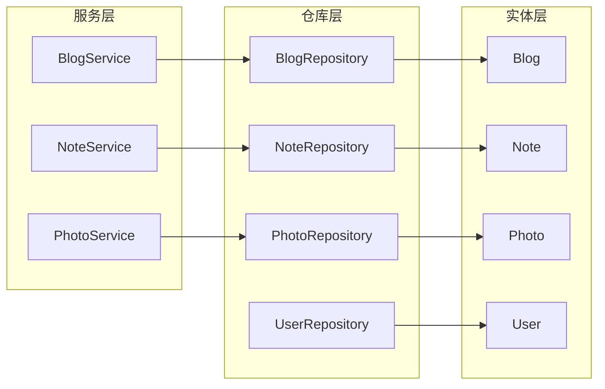
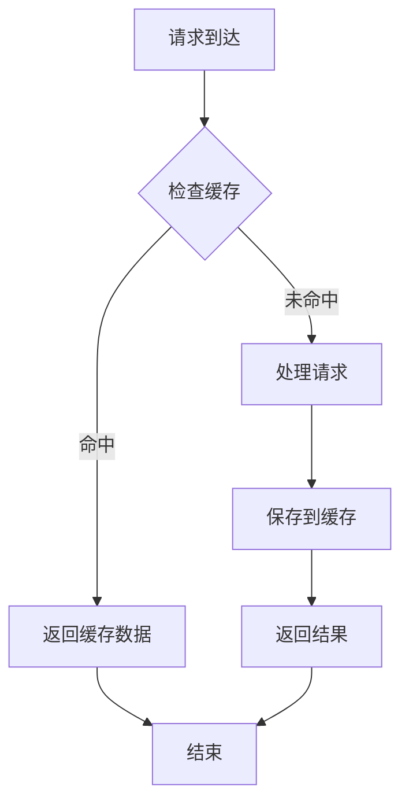

# Entity层设计

<cite>
**本文档引用的文件**
- [Blog.java](file://src/main/java/com/photo/entity/Blog.java)
- [Note.java](file://src/main/java/com/photo/entity/Note.java)
- [Photo.java](file://src/main/java/com/photo/entity/Photo.java)
- [User.java](file://src/main/java/com/photo/entity/User.java)
- [BlogRepository.java](file://src/main/java/com/photo/repository/BlogRepository.java)
- [NoteRepository.java](file://src/main/java/com/photo/repository/NoteRepository.java)
- [PhotoRepository.java](file://src/main/java/com/photo/repository/PhotoRepository.java)
- [UserRepository.java](file://src/main/java/com/photo/repository/UserRepository.java)
- [BlogService.java](file://src/main/java/com/photo/service/BlogService.java)
- [NoteService.java](file://src/main/java/com/photo/service/NoteService.java)
- [PhotoService.java](file://src/main/java/com/photo/service/PhotoService.java)
- [application.yml](file://src/main/resources/application.yml)
- [schema.sql](file://src/main/resources/schema.sql)
- [pom.xml](file://pom.xml)
</cite>

## 目录
1. [简介](#简介)
2. [项目结构](#项目结构)
3. [核心组件](#核心组件)
4. [架构概览](#架构概览)
5. [详细组件分析](#详细组件分析)
6. [依赖关系分析](#依赖关系分析)
7. [性能考虑](#性能考虑)
8. [故障排除指南](#故障排除指南)
9. [结论](#结论)

## 简介

本文档全面阐述了基于Spring Boot的实体层设计，重点分析了四个核心实体类的领域模型设计和JPA映射配置。该系统采用现代化的Web技术栈，实现了博客管理、便签管理和照片上传管理的综合功能。实体层通过标准的JPA注解实现了完整的数据持久化映射，支持复杂的数据关系和业务逻辑封装。

## 项目结构

该项目采用标准的Spring Boot项目结构，实体层位于`src/main/java/com/photo/entity/`目录下，包含四个主要实体类：

**图表来源**
- [Blog.java](file://src/main/java/com/photo/entity/Blog.java#L1-L77)
- [Note.java](file://src/main/java/com/photo/entity/Note.java#L1-L58)
- [Photo.java](file://src/main/java/com/photo/entity/Photo.java#L1-L174)
- [User.java](file://src/main/java/com/photo/entity/User.java#L1-L100)

**章节来源**
- [Blog.java](file://src/main/java/com/photo/entity/Blog.java#L1-L77)
- [Note.java](file://src/main/java/com/photo/entity/Note.java#L1-L58)
- [Photo.java](file://src/main/java/com/photo/entity/Photo.java#L1-L174)
- [User.java](file://src/main/java/com/photo/entity/User.java#L1-L100)

## 核心组件

### 实体层架构设计

系统采用分层架构设计，实体层作为数据持久化的基础层，承担着以下职责：

1. **数据模型定义**：通过JPA注解定义实体与数据库表的映射关系
2. **业务规则封装**：在实体中封装特定的业务逻辑和数据验证规则
3. **生命周期管理**：通过JPA回调机制管理实体的生命周期事件
4. **关系映射**：定义实体间的一对一、一对多、多对多关系

### JPA注解使用规范

系统统一采用了标准的JPA注解来实现数据映射：

- **@Entity**：标识实体类
- **@Table**：定义表名和索引配置
- **@Id**：设置主键字段
- **@GeneratedValue**：配置主键生成策略
- **@Column**：定义字段映射属性
- **@Index**：配置数据库索引

**章节来源**
- [Blog.java](file://src/main/java/com/photo/entity/Blog.java#L16-L23)
- [Note.java](file://src/main/java/com/photo/entity/Note.java#L16-L22)
- [Photo.java](file://src/main/java/com/photo/entity/Photo.java#L17-L26)
- [User.java](file://src/main/java/com/photo/entity/User.java#L9-L11)

## 架构概览

**图表来源**
- [Blog.java](file://src/main/java/com/photo/entity/Blog.java#L24-L76)
- [Note.java](file://src/main/java/com/photo/entity/Note.java#L23-L57)
- [Photo.java](file://src/main/java/com/photo/entity/Photo.java#L27-L173)
- [User.java](file://src/main/java/com/photo/entity/User.java#L11-L99)

## 详细组件分析

### Blog实体设计

Blog实体代表博客文章的核心数据模型，采用完整的JPA注解配置：

#### 字段设计分析

| 字段 | 类型 | 注解 | 说明 |
|------|------|------|------|
| id | Long | @Id, @GeneratedValue | 主键，自增策略 |
| title | String | @Column(length=300, nullable=false) | 标题，最大长度300字符 |
| author | String | @Column(length=100, nullable=false) | 作者，最大长度100字符 |
| content | String | @Column(columnDefinition="TEXT") | 内容，支持Markdown格式 |
| category | String | @Column(length=50) | 分类标签 |
| tags | String | @Column(length=200) | 多个标签，逗号分隔 |
| createdTime | LocalDateTime | @CreationTimestamp, @Column | 创建时间戳 |
| updatedTime | LocalDateTime | @UpdateTimestamp, @Column | 更新时间戳 |

#### JPA配置详解

**图表来源**
- [BlogService.java](file://src/main/java/com/photo/service/BlogService.java#L90-L105)
- [BlogRepository.java](file://src/main/java/com/photo/repository/BlogRepository.java#L14-L35)

**章节来源**
- [Blog.java](file://src/main/java/com/photo/entity/Blog.java#L16-L76)
- [BlogService.java](file://src/main/java/com/photo/service/BlogService.java#L90-L105)
- [BlogRepository.java](file://src/main/java/com/photo/repository/BlogRepository.java#L14-L35)

### Note实体设计

Note实体专注于便签管理功能，设计简洁高效：

#### 核心字段配置

| 字段 | 注解 | 属性 | 用途 |
|------|------|------|------|
| id | @Id, @GeneratedValue | 自增主键 | 便签唯一标识 |
| title | @Column(length=200, nullable=false) | 非空，长度200 | 便签标题 |
| content | @Column(columnDefinition="TEXT") | TEXT类型 | 便签内容 |
| createdTime | @CreationTimestamp, @Column | 时间戳 | 创建时间 |
| updatedTime | @UpdateTimestamp, @Column | 时间戳 | 更新时间 |

#### 性能优化特性

系统为Note实体配置了专门的索引以优化查询性能：

**图表来源**
- [Note.java](file://src/main/java/com/photo/entity/Note.java#L17-L19)
- [schema.sql](file://src/main/resources/schema.sql#L30-L31)

**章节来源**
- [Note.java](file://src/main/java/com/photo/entity/Note.java#L16-L57)
- [NoteService.java](file://src/main/java/com/photo/service/NoteService.java#L36-L42)

### Photo实体设计

Photo实体是最复杂的实体，承载了完整的照片管理系统功能：

#### 复杂字段设计

| 字段类别 | 字段名 | 注解 | 特殊属性 |
|----------|--------|------|----------|
| 基础信息 | id | @Id, @GeneratedValue | 主键 |
| 文件元数据 | originalFilename | @Column(length=500, nullable=false) | 原始文件名 |
| 存储信息 | storedFilename | @Column(unique=true, length=100) | 存储文件名 |
| 文件路径 | filePath | @Column(length=1000) | 完整文件路径 |
| 缩略图 | thumbnailPath | @Column(length=1000) | 缩略图路径 |
| 文件属性 | fileSize, contentType, extension | 数值/字符串 | 文件基本信息 |
| 图像属性 | width, height | Integer | 图片尺寸 |
| 去重机制 | md5 | @Column(unique=true, length=32) | MD5校验码 |
| 用户关联 | userId | @Column(nullable=false) | 上传用户ID |
| 统计信息 | accessCount, downloadCount | @Column(default=0) | 访问统计 |
| 状态控制 | isPublic, deleted | @Column(default=true/false) | 公开状态/删除状态 |
| 时间戳 | createdAt, updatedAt, lastAccessedAt | 时间戳 | 生命周期管理 |

#### 业务方法封装

Photo实体封装了重要的业务方法：

**图表来源**
- [Photo.java](file://src/main/java/com/photo/entity/Photo.java#L162-L165)
- [PhotoRepository.java](file://src/main/java/com/photo/repository/PhotoRepository.java#L89-L91)

**章节来源**
- [Photo.java](file://src/main/java/com/photo/entity/Photo.java#L27-L173)
- [PhotoService.java](file://src/main/java/com/photo/service/PhotoService.java#L238-L250)

### User实体设计

User实体负责用户认证和授权功能：

#### 核心字段配置

| 字段 | 注解 | 默认值 | 说明 |
|------|------|--------|------|
| id | @Id, @GeneratedValue | 自增 | 用户主键 |
| username | @Column(unique=true, length=50) | 唯一约束 | 用户名 |
| password | @Column(length=255) | 密码字段 | 用户密码 |
| email | @Column(length=100) | 可选 | 邮箱地址 |
| enabled | @Column(default=true) | true | 账户启用状态 |
| createdAt | @Column(name="created_at") | 自动设置 | 创建时间 |
| lastLogin | @Column(name="last_login") | 可选 | 最后登录时间 |

#### 生命周期回调

User实体实现了`@PrePersist`回调机制，在数据持久化前自动设置必要的字段值：

**图表来源**
- [User.java](file://src/main/java/com/photo/entity/User.java#L35-L41)

**章节来源**
- [User.java](file://src/main/java/com/photo/entity/User.java#L11-L99)
- [UserRepository.java](file://src/main/java/com/photo/repository/UserRepository.java#L13-L24)

## 依赖关系分析

### 实体间关系映射

系统中的实体关系相对简单，主要体现为用户与照片的关联关系：

**图表来源**
- [schema.sql](file://src/main/resources/schema.sql#L5-L13)
- [schema.sql](file://src/main/resources/schema.sql#L77-L86)
- [schema.sql](file://src/main/resources/schema.sql#L22-L28)

### 仓库层依赖关系

**图表来源**
- [BlogService.java](file://src/main/java/com/photo/service/BlogService.java#L27)
- [NoteService.java](file://src/main/java/com/photo/service/NoteService.java#L27)
- [PhotoService.java](file://src/main/java/com/photo/service/PhotoService.java#L39)

**章节来源**
- [BlogRepository.java](file://src/main/java/com/photo/repository/BlogRepository.java#L14)
- [NoteRepository.java](file://src/main/java/com/photo/repository/NoteRepository.java#L14)
- [PhotoRepository.java](file://src/main/java/com/photo/repository/PhotoRepository.java#L20)
- [UserRepository.java](file://src/main/java/com/photo/repository/UserRepository.java#L13)

## 性能考虑

### 数据库索引优化

系统为关键查询字段建立了专门的索引以提升查询性能：

1. **Blog实体索引**：
   - `idx_blog_created_time`：按创建时间排序查询
   - `idx_blog_author`：按作者过滤查询

2. **Note实体索引**：
   - `idx_created_time`：便签列表查询优化

3. **Photo实体索引**：
   - `idx_original_filename`：文件名搜索
   - `idx_created_at`：时间排序查询
   - `idx_user_id`：用户照片查询

### 缓存策略

系统实现了多层次的缓存机制：

**图表来源**
- [PhotoService.java](file://src/main/java/com/photo/service/PhotoService.java#L141-L151)

### 性能优化建议

1. **批量操作**：对于大量数据操作，建议使用批量处理机制
2. **懒加载**：对于大型对象，考虑使用懒加载策略
3. **连接池配置**：合理配置数据库连接池参数
4. **查询优化**：使用合适的查询方法避免N+1查询问题

## 故障排除指南

### 常见问题及解决方案

#### 实体映射问题

**问题**：实体字段与数据库表不匹配
**解决方案**：
1. 检查`@Column`注解的字段名配置
2. 验证数据库表结构与实体定义
3. 确认DDL自动更新配置

#### 索引性能问题

**问题**：查询性能不佳
**解决方案**：
1. 检查相关索引是否存在
2. 分析SQL执行计划
3. 考虑添加复合索引

#### 缓存一致性问题

**问题**：缓存数据与数据库不一致
**解决方案**：
1. 检查缓存失效策略
2. 验证`@CacheEvict`注解使用
3. 确认缓存配置正确性

**章节来源**
- [application.yml](file://src/main/resources/application.yml#L20-L29)
- [schema.sql](file://src/main/resources/schema.sql#L1-L144)

## 结论

该实体层设计展现了现代Java企业应用的最佳实践：

### 设计优势

1. **清晰的职责分离**：每个实体专注于特定的业务领域
2. **完善的JPA映射**：标准的注解使用确保了良好的数据持久化
3. **性能优化考虑**：合理的索引设计和缓存策略
4. **扩展性强**：模块化的设计便于功能扩展

### 技术亮点

1. **生命周期回调**：通过`@PrePersist`等注解实现自动化管理
2. **业务方法封装**：在实体中封装特定的业务逻辑
3. **类型安全**：使用泛型和枚举类型提升代码质量
4. **异常处理**：完善的异常处理机制保证系统稳定性

### 改进建议

1. **版本控制**：可以考虑添加乐观锁支持
2. **审计日志**：增强数据变更的审计能力
3. **数据验证**：集成Bean Validation进行字段验证
4. **软删除**：统一使用软删除策略管理数据生命周期

该实体层设计为整个系统的稳定运行奠定了坚实的基础，体现了良好的软件工程实践和架构设计原则。