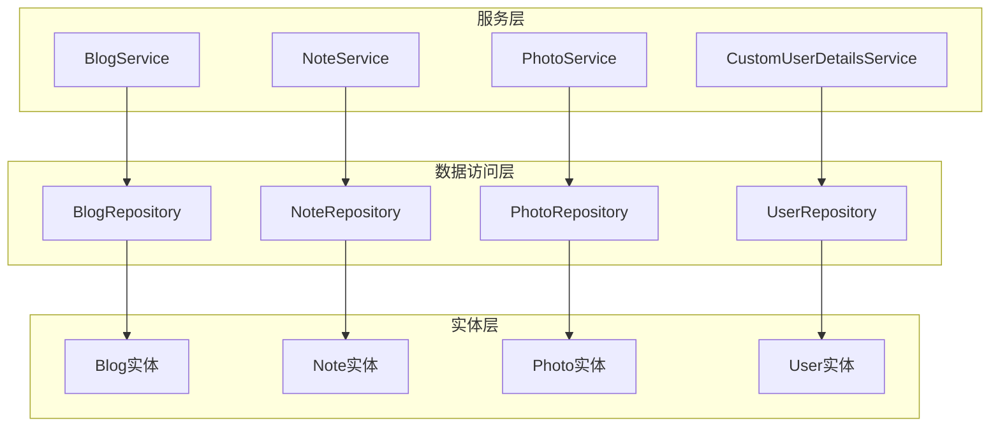
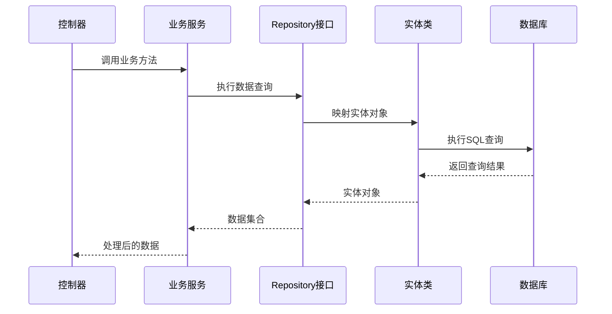
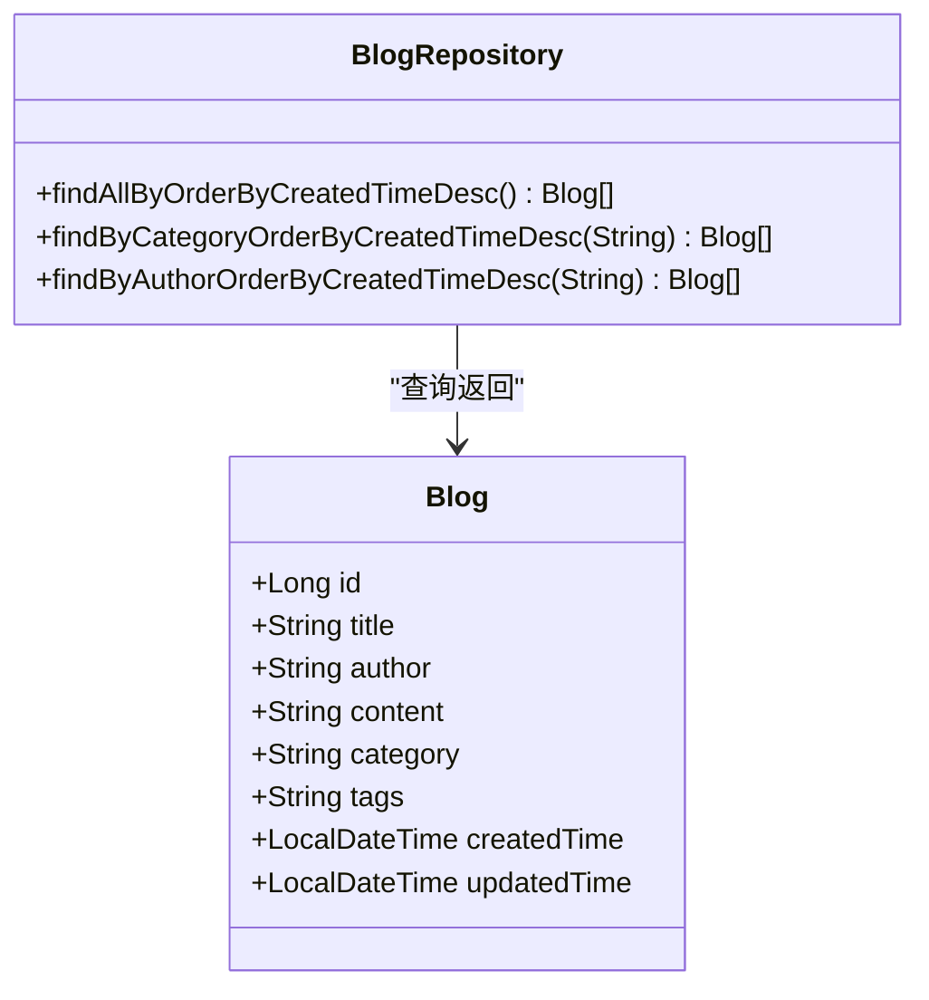
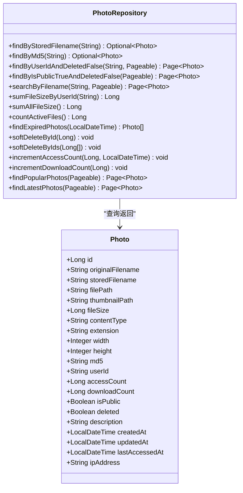
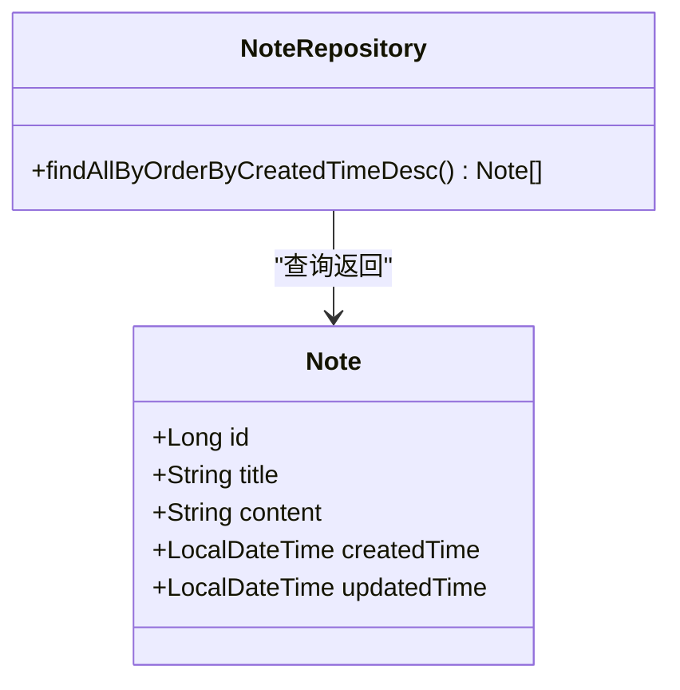
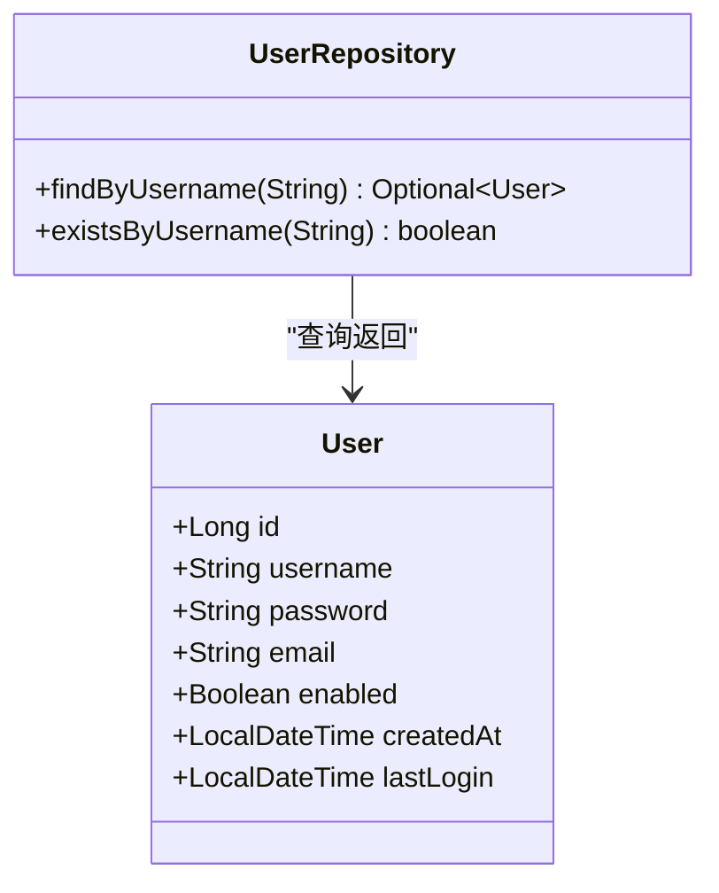
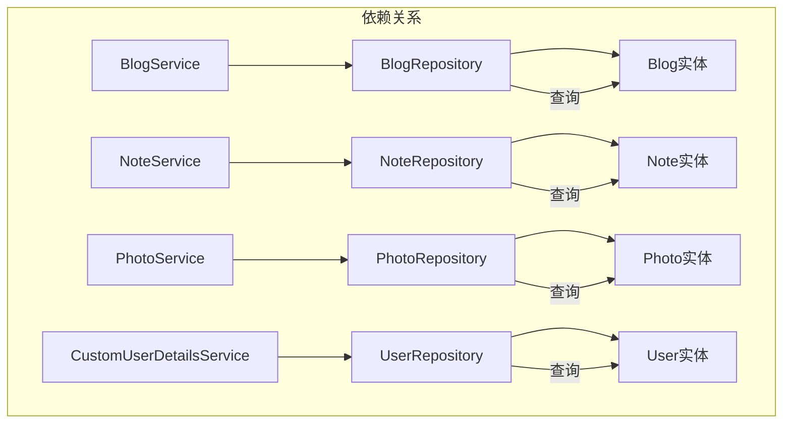

# Repository层设计

<cite>
**本文档引用的文件**
- [BlogRepository.java](file://src/main/java/com/photo/repository/BlogRepository.java)
- [NoteRepository.java](file://src/main/java/com/photo/repository/NoteRepository.java)
- [PhotoRepository.java](file://src/main/java/com/photo/repository/PhotoRepository.java)
- [UserRepository.java](file://src/main/java/com/photo/repository/UserRepository.java)
- [Blog.java](file://src/main/java/com/photo/entity/Blog.java)
- [Note.java](file://src/main/java/com/photo/entity/Note.java)
- [Photo.java](file://src/main/java/com/photo/entity/Photo.java)
- [User.java](file://src/main/java/com/photo/entity/User.java)
- [BlogService.java](file://src/main/java/com/photo/service/BlogService.java)
- [NoteService.java](file://src/main/java/com/photo/service/NoteService.java)
- [PhotoService.java](file://src/main/java/com/photo/service/PhotoService.java)
- [CustomUserDetailsService.java](file://src/main/java/com/photo/service/CustomUserDetailsService.java)
- [application.yml](file://src/main/resources/application.yml)
- [pom.xml](file://pom.xml)
</cite>

## 目录
1. [简介](#简介)
2. [项目结构](#项目结构)
3. [核心组件](#核心组件)
4. [架构概览](#架构概览)
5. [详细组件分析](#详细组件分析)
6. [依赖关系分析](#依赖关系分析)
7. [性能考虑](#性能考虑)
8. [故障排除指南](#故障排除指南)
9. [结论](#结论)

## 简介

本设计文档深入分析了基于Spring Data JPA的数据访问层实现，重点阐述四个核心Repository接口的设计理念和实现细节：BlogRepository、NoteRepository、PhotoRepository和UserRepository。这些Repository接口分别对应不同的实体数据访问需求，体现了Spring Data JPA的自动实现机制、自定义查询方法以及复杂查询的实现方式。

Repository层采用分层架构设计，通过JPA注解实现数据持久化，结合Spring Data JPA的查询方法命名约定和@Query注解实现复杂的数据库操作。每个Repository接口都针对特定的业务场景进行了优化，提供了高效的数据访问能力。

## 项目结构

该项目采用标准的Spring Boot项目结构，Repository层位于`src/main/java/com/photo/repository/`目录下，与实体类、服务层和控制器层形成清晰的分层架构。

**图表来源**
- [BlogRepository.java](file://src/main/java/com/photo/repository/BlogRepository.java#L1-L36)
- [NoteRepository.java](file://src/main/java/com/photo/repository/NoteRepository.java#L1-L22)
- [PhotoRepository.java](file://src/main/java/com/photo/repository/PhotoRepository.java#L1-L112)
- [UserRepository.java](file://src/main/java/com/photo/repository/UserRepository.java#L1-L25)

**章节来源**
- [BlogRepository.java](file://src/main/java/com/photo/repository/BlogRepository.java#L1-L36)
- [NoteRepository.java](file://src/main/java/com/photo/repository/NoteRepository.java#L1-L22)
- [PhotoRepository.java](file://src/main/java/com/photo/repository/PhotoRepository.java#L1-L112)
- [UserRepository.java](file://src/main/java/com/photo/repository/UserRepository.java#L1-L25)

## 核心组件

### BlogRepository - 博客数据访问接口

BlogRepository继承JpaRepository，提供博客文章的完整CRUD操作和特定查询功能。该接口展示了Spring Data JPA查询方法命名约定的最佳实践。

**主要特性：**
- 继承JpaRepository获得基础CRUD操作
- 自定义查询方法实现按创建时间倒序排列
- 支持按分类和作者进行条件查询
- 集成@OrderBy注解实现排序功能

### NoteRepository - 便签数据访问接口

NoteRepository专注于便签管理的简化实现，提供基本的CRUD操作和时间排序功能。

**主要特性：**
- 简化的Repository接口设计
- 按创建时间倒序查询功能
- 与NoteService的紧密集成

### PhotoRepository - 照片数据访问接口

PhotoRepository是Repository层中最复杂的接口，实现了完整的照片管理系统所需的所有数据访问功能。

**主要特性：**
- 分页查询支持
- 复杂条件查询（用户ID、公开状态、删除状态）
- JPQL自定义查询实现
- 软删除功能
- 统计查询（文件大小统计、数量统计）
- 文件清理和访问统计功能

### UserRepository - 用户数据访问接口

UserRepository提供用户管理的基础数据访问功能，支持用户认证和授权操作。

**主要特性：**
- 用户名查询功能
- 用户存在性检查
- 与Spring Security的集成

**章节来源**
- [BlogRepository.java](file://src/main/java/com/photo/repository/BlogRepository.java#L9-L35)
- [NoteRepository.java](file://src/main/java/com/photo/repository/NoteRepository.java#L9-L21)
- [PhotoRepository.java](file://src/main/java/com/photo/repository/PhotoRepository.java#L16-L111)
- [UserRepository.java](file://src/main/java/com/photo/repository/UserRepository.java#L9-L24)

## 架构概览

Repository层采用Spring Data JPA框架，通过注解驱动的方式实现数据持久化。整个架构遵循分层设计原则，Repository层负责数据访问，Service层处理业务逻辑，Controller层处理HTTP请求。

**图表来源**
- [BlogService.java](file://src/main/java/com/photo/service/BlogService.java#L36-L42)
- [PhotoService.java](file://src/main/java/com/photo/service/PhotoService.java#L165-L169)
- [NoteService.java](file://src/main/java/com/photo/service/NoteService.java#L36-L42)

**章节来源**
- [BlogService.java](file://src/main/java/com/photo/service/BlogService.java#L22-L25)
- [PhotoService.java](file://src/main/java/com/photo/service/PhotoService.java#L34-L36)
- [NoteService.java](file://src/main/java/com/photo/service/NoteService.java#L22-L25)

## 详细组件分析

### BlogRepository 详细分析

BlogRepository展示了Spring Data JPA查询方法命名约定的典型应用。通过方法名中的关键字（By、OrderBy）自动推断查询逻辑。

**图表来源**
- [BlogRepository.java](file://src/main/java/com/photo/repository/BlogRepository.java#L14-L35)
- [Blog.java](file://src/main/java/com/photo/entity/Blog.java#L24-L77)

**实现要点：**
- 使用`findAllByOrderByCreatedTimeDesc()`实现按创建时间倒序的全量查询
- 通过`findByCategoryOrderByCreatedTimeDesc()`实现分类过滤和排序
- 通过`findByAuthorOrderByCreatedTimeDesc()`实现作者过滤和排序

**章节来源**
- [BlogRepository.java](file://src/main/java/com/photo/repository/BlogRepository.java#L16-L34)
- [Blog.java](file://src/main/java/com/photo/entity/Blog.java#L16-L77)

### PhotoRepository 详细分析

PhotoRepository是最复杂的Repository实现，包含了多种查询模式和高级功能。

**图表来源**
- [PhotoRepository.java](file://src/main/java/com/photo/repository/PhotoRepository.java#L20-L111)
- [Photo.java](file://src/main/java/com/photo/entity/Photo.java#L27-L174)

**关键功能实现：**

1. **去重查询**：通过MD5值实现文件去重
2. **分页查询**：支持用户照片和公开照片的分页显示
3. **模糊搜索**：支持按原始文件名进行模糊匹配
4. **统计查询**：提供存储空间使用情况和文件数量统计
5. **软删除**：实现逻辑删除而非物理删除
6. **访问统计**：跟踪照片的访问和下载次数
7. **定时清理**：支持过期文件的自动清理

**章节来源**
- [PhotoRepository.java](file://src/main/java/com/photo/repository/PhotoRepository.java#L22-L111)
- [Photo.java](file://src/main/java/com/photo/entity/Photo.java#L17-L174)

### NoteRepository 详细分析

NoteRepository提供了便签管理的简化实现，专注于基本的CRUD操作和时间排序。

**图表来源**
- [NoteRepository.java](file://src/main/java/com/photo/repository/NoteRepository.java#L14-L21)
- [Note.java](file://src/main/java/com/photo/entity/Note.java#L23-L58)

**实现特点：**
- 简洁的接口设计，专注于核心功能
- 按创建时间倒序排列确保最新的便签优先显示
- 与NoteService的紧密集成，提供完整的便签管理功能

**章节来源**
- [NoteRepository.java](file://src/main/java/com/photo/repository/NoteRepository.java#L16-L21)
- [Note.java](file://src/main/java/com/photo/entity/Note.java#L16-L58)

### UserRepository 详细分析

UserRepository为用户管理提供基础的数据访问功能，支持用户认证和授权操作。

**图表来源**
- [UserRepository.java](file://src/main/java/com/photo/repository/UserRepository.java#L13-L24)
- [User.java](file://src/main/java/com/photo/entity/User.java#L11-L100)

**集成应用：**
- 与CustomUserDetailsService集成，支持Spring Security用户认证
- 提供用户存在性检查，防止重复注册
- 支持用户状态验证（启用/禁用）

**章节来源**
- [UserRepository.java](file://src/main/java/com/photo/repository/UserRepository.java#L18-L24)
- [User.java](file://src/main/java/com/photo/entity/User.java#L9-L100)

## 依赖关系分析

Repository层与实体层、服务层之间形成了清晰的依赖关系，体现了良好的分层架构设计。

**图表来源**
- [BlogRepository.java](file://src/main/java/com/photo/repository/BlogRepository.java#L3-L5)
- [NoteRepository.java](file://src/main/java/com/photo/repository/NoteRepository.java#L3-L5)
- [PhotoRepository.java](file://src/main/java/com/photo/repository/PhotoRepository.java#L3-L10)
- [UserRepository.java](file://src/main/java/com/photo/repository/UserRepository.java#L3-L5)

**关键依赖特性：**
- Repository接口直接依赖对应的实体类
- Service层依赖相应的Repository接口
- 采用接口依赖注入，便于单元测试和扩展
- 遵循单一职责原则，每个Repository专注于特定实体

**章节来源**
- [BlogService.java](file://src/main/java/com/photo/service/BlogService.java#L27)
- [NoteService.java](file://src/main/java/com/photo/service/NoteService.java#L27)
- [PhotoService.java](file://src/main/java/com/photo/service/PhotoService.java#L39)
- [CustomUserDetailsService.java](file://src/main/java/com/photo/service/CustomUserDetailsService.java#L22)

## 性能考虑

Repository层在设计时充分考虑了性能优化，采用了多种策略来提升查询效率和系统性能。

### 查询优化策略

1. **索引设计**：实体类中使用@Index注解为常用查询字段建立索引
2. **分页查询**：PhotoRepository支持分页查询，避免一次性加载大量数据
3. **懒加载**：合理使用实体关系映射，避免不必要的关联查询
4. **缓存策略**：PhotoService使用@Cacheable和@CacheEvict注解实现缓存

### 数据库连接池配置

项目使用H2数据库作为开发环境，默认配置满足大多数应用场景的需求。生产环境中可以轻松切换到MySQL等更强大的数据库。

**章节来源**
- [Blog.java](file://src/main/java/com/photo/entity/Blog.java#L17-L20)
- [Note.java](file://src/main/java/com/photo/entity/Note.java#L17-L19)
- [Photo.java](file://src/main/java/com/photo/entity/Photo.java#L18-L22)

## 故障排除指南

### 常见问题及解决方案

1. **查询结果为空**
   - 检查实体类注解配置是否正确
   - 验证数据库表结构与实体类定义是否一致
   - 确认查询条件是否符合预期

2. **分页查询异常**
   - 检查Pageable参数配置
   - 验证数据库中数据量是否足够支持分页
   - 确认排序字段是否存在且有索引

3. **JPQL查询错误**
   - 检查实体类名和属性名是否正确
   - 验证JPQL语法格式
   - 确认参数绑定是否正确

### 调试建议

1. **启用SQL日志**：在application.yml中设置`show-sql: true`
2. **检查实体映射**：确认@ManyToOne、@OneToMany等关系映射正确
3. **验证事务配置**：确保需要事务的方法上标注@Transactional

**章节来源**
- [application.yml](file://src/main/resources/application.yml#L20-L28)

## 结论

Repository层设计充分体现了Spring Data JPA的优势，通过简洁的接口定义和强大的查询能力，为上层服务层提供了稳定可靠的数据访问基础。四个Repository接口各有特色，既保持了统一的设计模式，又针对不同业务场景进行了专门优化。

**设计亮点：**
- 清晰的分层架构，职责分离明确
- 灵活的查询机制，支持简单和复杂查询
- 良好的扩展性，易于添加新的查询方法
- 完善的错误处理和异常管理
- 与Spring Security的无缝集成

该设计为后续的功能扩展和维护奠定了坚实的基础，是一个值得参考的Repository层实现范例。