# Service层设计

<cite>
**本文档引用的文件**
- [BlogService.java](file://src/main/java/com/photo/service/BlogService.java)
- [CustomUserDetailsService.java](file://src/main/java/com/photo/service/CustomUserDetailsService.java)
- [FileStorageService.java](file://src/main/java/com/photo/service/FileStorageService.java)
- [NoteService.java](file://src/main/java/com/photo/service/NoteService.java)
- [PhotoService.java](file://src/main/java/com/photo/service/PhotoService.java)
- [Blog.java](file://src/main/java/com/photo/entity/Blog.java)
- [Note.java](file://src/main/java/com/photo/entity/Note.java)
- [Photo.java](file://src/main/java/com/photo/entity/Photo.java)
- [BlogRepository.java](file://src/main/java/com/photo/repository/BlogRepository.java)
- [NoteRepository.java](file://src/main/java/com/photo/repository/NoteRepository.java)
- [PhotoRepository.java](file://src/main/java/com/photo/repository/PhotoRepository.java)
- [FileStorageProperties.java](file://src/main/java/com/photo/config/FileStorageProperties.java)
- [FileUtils.java](file://src/main/java/com/photo/util/FileUtils.java)
- [GlobalExceptionHandler.java](file://src/main/java/com/photo/exception/GlobalExceptionHandler.java)
- [application.yml](file://src/main/resources/application.yml)
</cite>

## 目录
1. [简介](#简介)
2. [项目结构](#项目结构)
3. [核心组件](#核心组件)
4. [架构概览](#架构概览)
5. [详细组件分析](#详细组件分析)
6. [依赖关系分析](#依赖关系分析)
7. [性能考虑](#性能考虑)
8. [故障排除指南](#故障排除指南)
9. [结论](#结论)

## 简介

本文档全面阐述了PhotoUpload应用程序的Service层设计，这是一个基于Spring Boot的企业级照片管理系统。Service层作为业务逻辑的核心，负责协调各个业务领域的操作，包括博客管理、笔记管理、照片上传与存储、用户认证等核心功能。

该系统采用分层架构设计，Service层位于Controller层和Repository层之间，承担着业务规则实现、事务管理、数据转换和异常处理的重要职责。通过精心设计的服务类，系统实现了高内聚、低耦合的业务逻辑组织，为上层控制器提供了清晰的业务接口。

## 项目结构

Service层位于`src/main/java/com/photo/service/`目录下，包含以下核心服务类：

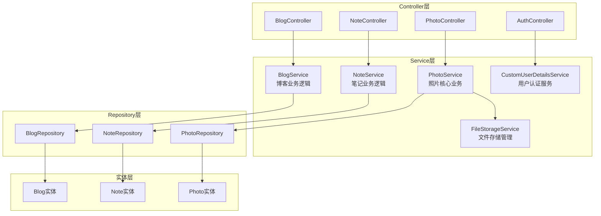

**图表来源**
- [BlogService.java](file://src/main/java/com/photo/service/BlogService.java#L22-L25)
- [NoteService.java](file://src/main/java/com/photo/service/NoteService.java#L22-L25)
- [PhotoService.java](file://src/main/java/com/photo/service/PhotoService.java#L34-L45)
- [CustomUserDetailsService.java](file://src/main/java/com/photo/service/CustomUserDetailsService.java#L18-L25)

**章节来源**
- [BlogService.java](file://src/main/java/com/photo/service/BlogService.java#L1-L212)
- [NoteService.java](file://src/main/java/com/photo/service/NoteService.java#L1-L171)
- [PhotoService.java](file://src/main/java/com/photo/service/PhotoService.java#L1-L385)

## 核心组件

### 博客服务 (BlogService)

BlogService是博客业务逻辑的核心实现，负责博客文章的完整生命周期管理。该服务采用Lombok的`@RequiredArgsConstructor`注解，通过构造函数注入BlogRepository，确保依赖关系的明确性和不可变性。

**核心职责**：
- 博客文章的CRUD操作
- Markdown内容渲染为HTML
- 内容摘要生成
- 分类和作者过滤查询

**关键特性**：
- 使用`@Transactional`注解确保数据库操作的原子性
- 集成CommonMark库进行Markdown解析和渲染
- 实现内容预览生成功能，移除Markdown标记符号
- 支持按分类和作者的多维度查询

**章节来源**
- [BlogService.java](file://src/main/java/com/photo/service/BlogService.java#L18-L212)

### 笔记服务 (NoteService)

NoteService提供便签功能的完整业务逻辑，与博客服务类似但更加简洁。该服务专注于便签的快速创建、编辑和管理。

**核心职责**：
- 便签的创建、更新、删除和查询
- Markdown内容处理
- 内容摘要生成
- 时间戳格式化

**设计特点**：
- 简化的业务逻辑，专注于便签功能
- 与BlogService相同的Markdown处理机制
- 统一的时间格式化处理

**章节来源**
- [NoteService.java](file://src/main/java/com/photo/service/NoteService.java#L18-L171)

### 照片服务 (PhotoService)

PhotoService是整个系统的核心业务服务，负责照片上传、存储、管理和检索的完整流程。该服务展现了复杂业务逻辑的典型实现模式。

**核心职责**：
- 照片上传和去重处理
- 文件验证和存储空间检查
- 缩略图生成和图片压缩
- 照片检索和分页查询
- 软删除和物理删除
- 存储空间统计和清理

**关键特性**：
- 集成多种外部服务（FileStorageService、ImageUtils、FileUtils）
- 实现缓存机制（@Cacheable、@CacheEvict）
- 支持定时任务清理过期文件
- 完善的异常处理和业务规则验证

**章节来源**
- [PhotoService.java](file://src/main/java/com/photo/service/PhotoService.java#L31-L385)

### 文件存储服务 (FileStorageService)

FileStorageService专门负责文件系统的操作，为PhotoService提供底层的文件存储能力。

**核心职责**：
- 文件的存储、读取、删除
- 缩略图创建和管理
- 图片压缩处理
- 断点续传支持
- 存储空间监控

**设计亮点**：
- 使用`@PostConstruct`初始化存储目录
- 实现安全的文件路径解析，防止路径遍历攻击
- 支持随机访问文件读取（断点续传）
- 完善的异常处理机制

**章节来源**
- [FileStorageService.java](file://src/main/java/com/photo/service/FileStorageService.java#L19-L300)

### 用户认证服务 (CustomUserDetailsService)

CustomUserDetailsService实现了Spring Security的UserDetailsService接口，提供用户认证和授权功能。

**核心职责**：
- 用户登录认证
- 用户注册和密码加密
- 用户状态验证
- 最后登录时间更新

**安全特性**：
- 使用PasswordEncoder进行密码加密
- 用户状态检查（启用/禁用）
- 完整的用户信息封装

**章节来源**
- [CustomUserDetailsService.java](file://src/main/java/com/photo/service/CustomUserDetailsService.java#L15-L70)

## 架构概览

Service层采用了典型的分层架构设计，通过清晰的职责分离实现了高内聚、低耦合的系统结构。

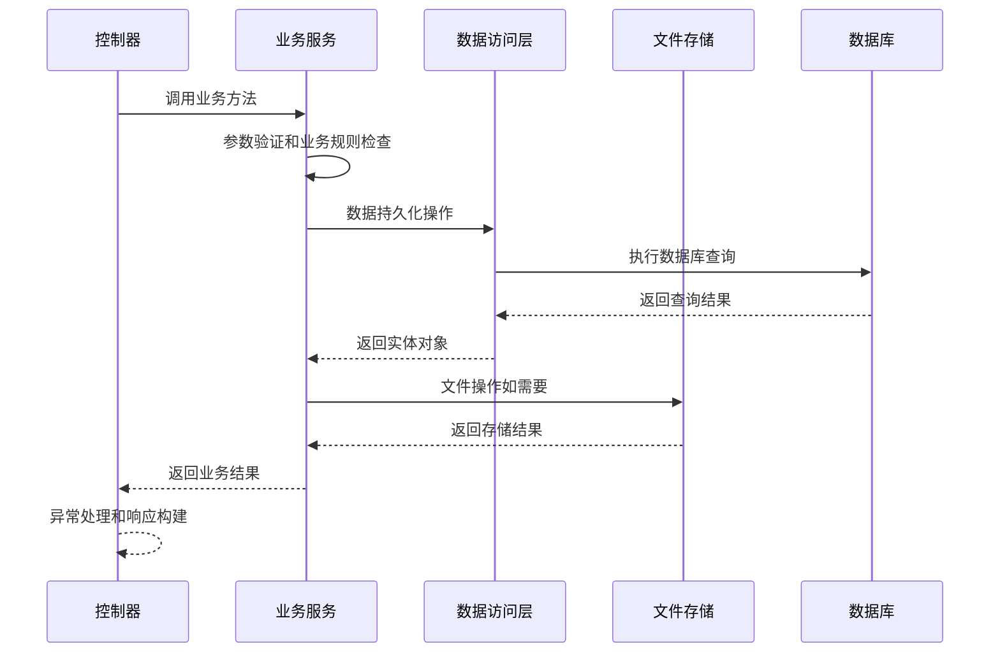

**图表来源**
- [BlogService.java](file://src/main/java/com/photo/service/BlogService.java#L90-L105)
- [PhotoService.java](file://src/main/java/com/photo/service/PhotoService.java#L50-L111)
- [FileStorageService.java](file://src/main/java/com/photo/service/FileStorageService.java#L59-L95)

### 事务管理策略

Service层统一采用声明式事务管理，确保业务操作的原子性和一致性：

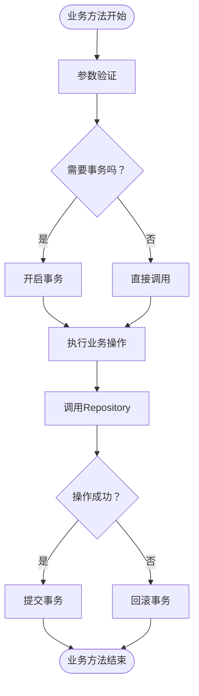

**图表来源**
- [BlogService.java](file://src/main/java/com/photo/service/BlogService.java#L90-L151)
- [NoteService.java](file://src/main/java/com/photo/service/NoteService.java#L61-L113)
- [PhotoService.java](file://src/main/java/com/photo/service/PhotoService.java#L192-L234)

## 详细组件分析

### 博客服务详细分析

BlogService展现了完整的CRUD操作模式，同时集成了内容处理功能：

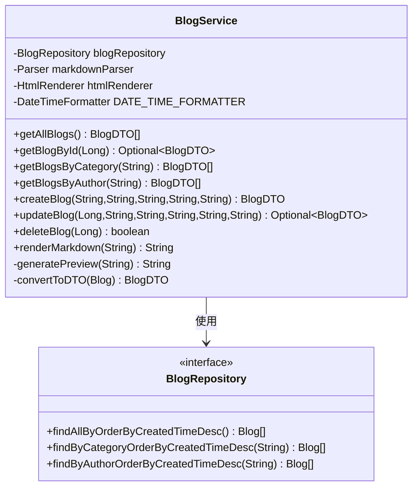

**图表来源**
- [BlogService.java](file://src/main/java/com/photo/service/BlogService.java#L22-L30)
- [BlogRepository.java](file://src/main/java/com/photo/repository/BlogRepository.java#L13-L35)

**核心业务逻辑**：
1. **内容处理**：集成CommonMark库进行Markdown到HTML的转换
2. **数据转换**：实体对象与DTO之间的双向转换
3. **查询优化**：针对不同查询场景提供专门的Repository方法
4. **日志记录**：完整的操作日志追踪

**章节来源**
- [BlogService.java](file://src/main/java/com/photo/service/BlogService.java#L32-L210)

### 照片服务详细分析

PhotoService是最复杂的业务服务，展示了企业级应用的典型特征：

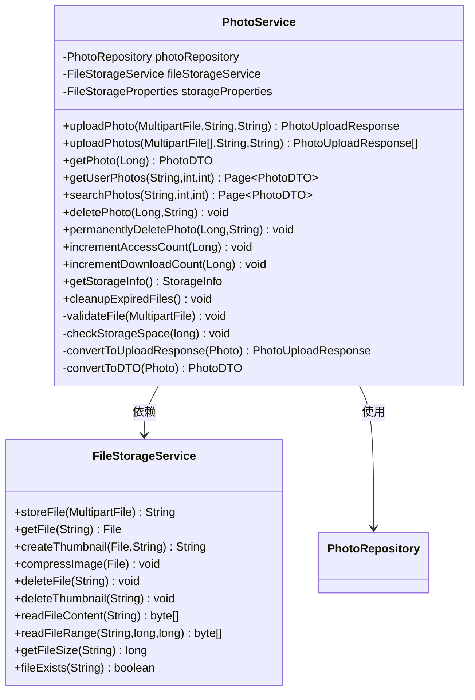

**图表来源**
- [PhotoService.java](file://src/main/java/com/photo/service/PhotoService.java#L34-L45)
- [FileStorageService.java](file://src/main/java/com/photo/service/FileStorageService.java#L22-L24)

**关键业务流程**：

1. **文件上传流程**：
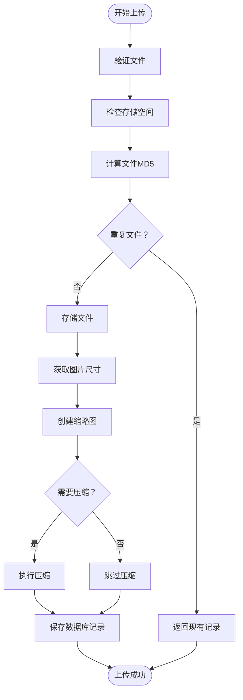

**图表来源**
- [PhotoService.java](file://src/main/java/com/photo/service/PhotoService.java#L50-L111)

2. **存储空间管理**：
- 实时存储空间监控
- 存储配额检查
- 自动清理过期文件

3. **缓存策略**：
- 使用`@Cacheable`缓存照片信息
- 使用`@CacheEvict`失效缓存
- 支持缓存键的灵活配置

**章节来源**
- [PhotoService.java](file://src/main/java/com/photo/service/PhotoService.java#L48-L382)

### 文件存储服务详细分析

FileStorageService提供了完整的文件系统抽象：

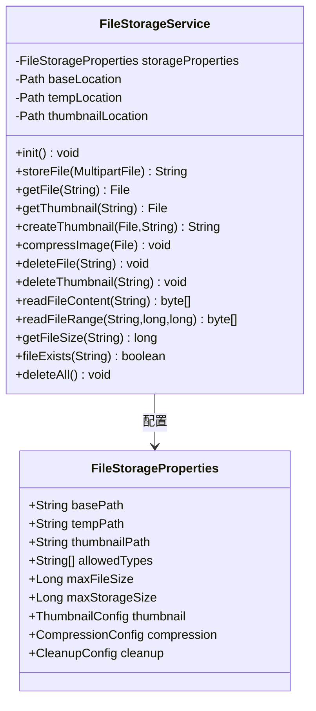

**图表来源**
- [FileStorageService.java](file://src/main/java/com/photo/service/FileStorageService.java#L22-L54)
- [FileStorageProperties.java](file://src/main/java/com/photo/config/FileStorageProperties.java#L12-L93)

**安全特性**：
- 路径规范化防止路径遍历攻击
- 文件名安全验证
- MIME类型检测
- 文件大小限制

**章节来源**
- [FileStorageService.java](file://src/main/java/com/photo/service/FileStorageService.java#L33-L298)

### 用户认证服务详细分析

CustomUserDetailsService实现了Spring Security的标准认证接口：

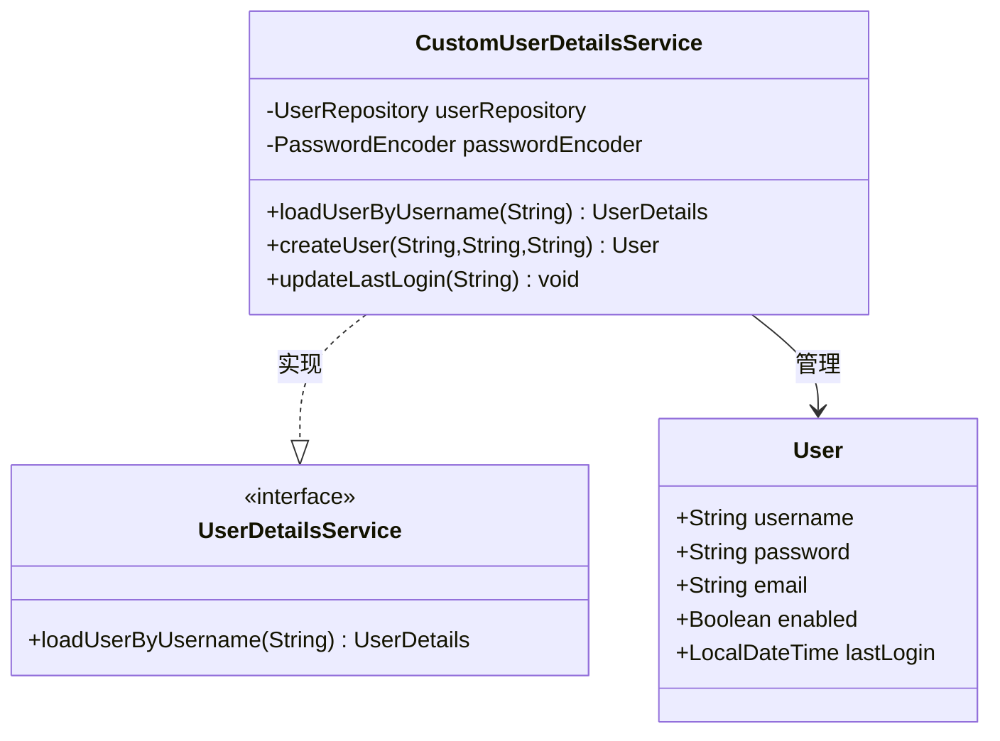

**图表来源**
- [CustomUserDetailsService.java](file://src/main/java/com/photo/service/CustomUserDetailsService.java#L18-L25)

**认证流程**：
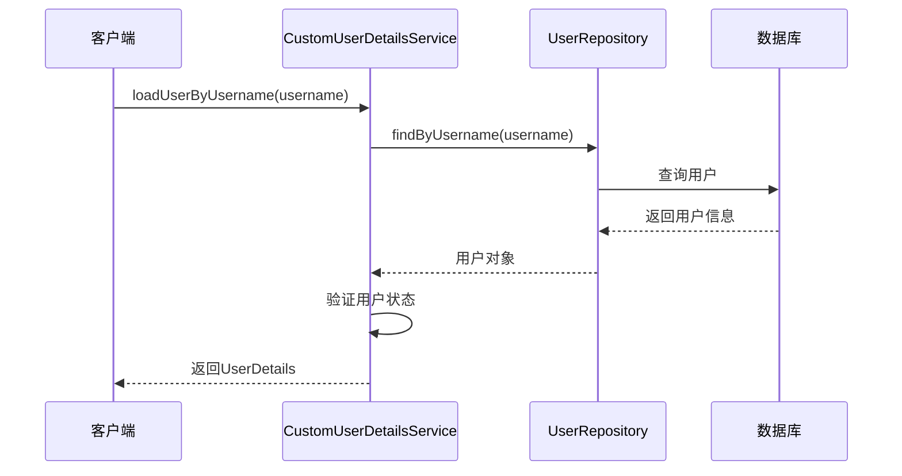

**图表来源**
- [CustomUserDetailsService.java](file://src/main/java/com/photo/service/CustomUserDetailsService.java#L27-L41)

**章节来源**
- [CustomUserDetailsService.java](file://src/main/java/com/photo/service/CustomUserDetailsService.java#L27-L68)

## 依赖关系分析

Service层的依赖关系展现了清晰的层次化架构：

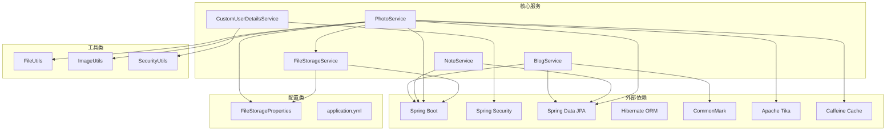

**图表来源**
- [BlogService.java](file://src/main/java/com/photo/service/BlogService.java#L1-L16)
- [PhotoService.java](file://src/main/java/com/photo/service/PhotoService.java#L1-L30)
- [FileStorageService.java](file://src/main/java/com/photo/service/FileStorageService.java#L1-L18)

### 依赖注入模式

系统采用了多种依赖注入模式：

1. **构造函数注入**：BlogService、NoteService、PhotoService
2. **字段注入**：CustomUserDetailsService
3. **方法注入**：部分配置类

**依赖注入优势**：
- 确保对象的不可变性
- 提供清晰的依赖关系
- 支持测试模拟
- 避免循环依赖

**章节来源**
- [BlogService.java](file://src/main/java/com/photo/service/BlogService.java#L27-L28)
- [NoteService.java](file://src/main/java/com/photo/service/NoteService.java#L27-L28)
- [PhotoService.java](file://src/main/java/com/photo/service/PhotoService.java#L38-L45)

## 性能考虑

Service层在设计时充分考虑了性能优化：

### 缓存策略
- 使用Caffeine本地缓存存储照片信息
- 缓存键采用ID和文件名双重策略
- 自动缓存失效机制

### 数据库优化
- Repository层提供专门的查询方法
- 实体类配置合适的索引
- 分页查询避免大数据量加载

### 文件处理优化
- 异步文件压缩处理
- 缩略图生成延迟执行
- 存储空间监控定期执行

### 并发处理
- 线程安全的文件操作
- 原子性的数据库事务
- 合理的锁机制

## 故障排除指南

### 常见异常类型

系统定义了完善的异常处理机制：

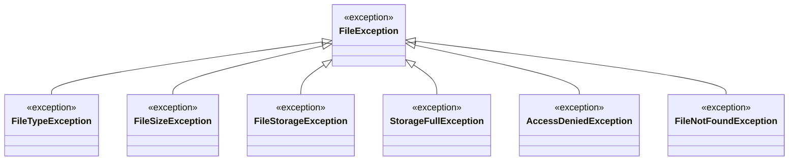

**图表来源**
- [GlobalExceptionHandler.java](file://src/main/java/com/photo/exception/GlobalExceptionHandler.java#L24-L127)

### 异常处理策略

1. **全局异常处理**：统一的REST API响应格式
2. **业务异常处理**：针对特定业务场景的异常
3. **文件异常处理**：文件操作相关的异常处理
4. **参数验证异常**：Spring Validation异常处理

**章节来源**
- [GlobalExceptionHandler.java](file://src/main/java/com/photo/exception/GlobalExceptionHandler.java#L23-L138)

### 调试和监控

- 详细的日志记录
- Spring Boot Actuator监控
- 自定义健康检查
- 性能指标收集

## 结论

PhotoUpload系统的Service层设计展现了现代企业级应用的最佳实践：

### 设计优势
1. **清晰的职责分离**：每个Service类都有明确的业务边界
2. **完善的异常处理**：从全局到局部的多层次异常处理
3. **高效的性能设计**：缓存、异步处理、数据库优化
4. **强大的扩展性**：模块化设计便于功能扩展

### 技术亮点
- 基于Spring Boot的现代化框架
- 完整的文件处理生态系统
- 企业级的安全和认证机制
- 友好的用户体验设计

### 改进建议
1. **微服务架构演进**：可考虑将PhotoService拆分为独立服务
2. **消息队列集成**：异步处理耗时操作
3. **分布式缓存**：支持多实例部署
4. **监控告警**：完善运维监控体系

该Service层设计为整个应用程序奠定了坚实的技术基础，为后续的功能扩展和性能优化提供了良好的架构支撑。