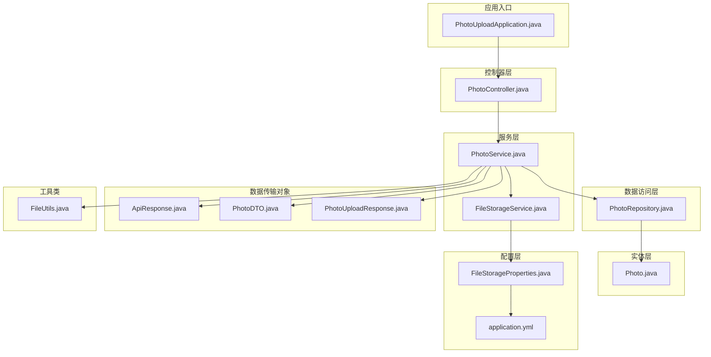
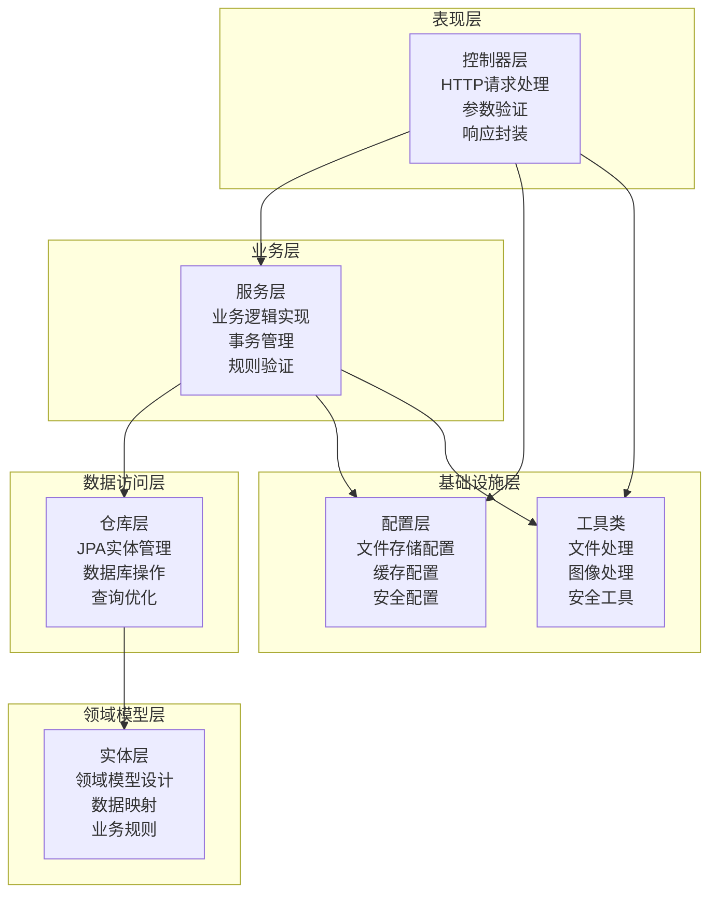
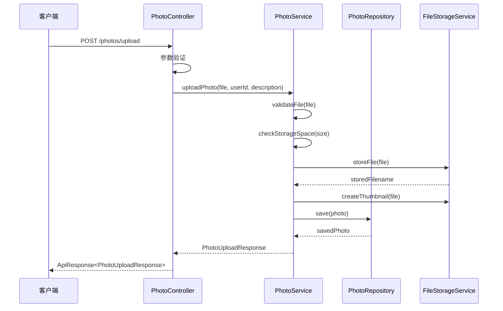
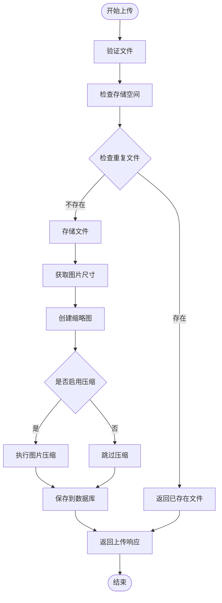
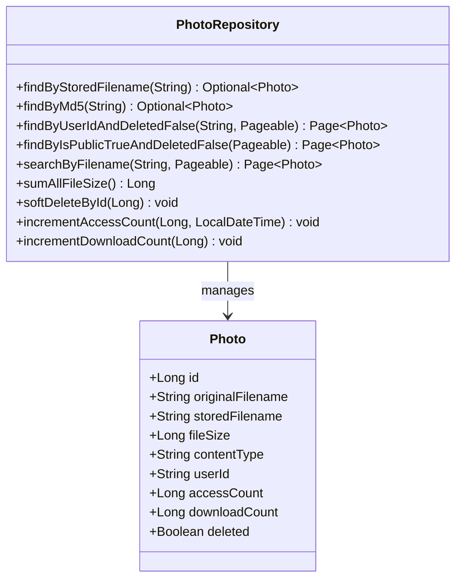
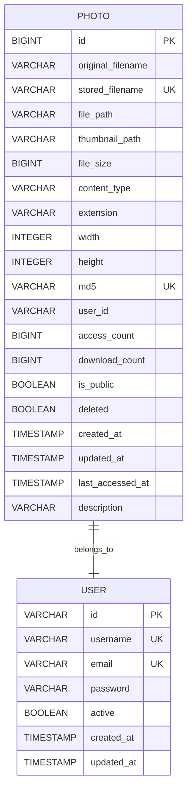
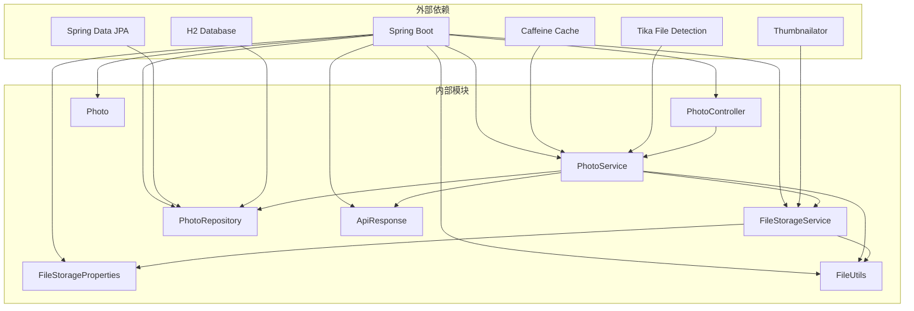

# 分层架构设计

<cite>
**本文档引用的文件**
- [PhotoUploadApplication.java](file://src/main/java/com/photo/PhotoUploadApplication.java)
- [PhotoController.java](file://src/main/java/com/photo/controller/PhotoController.java)
- [PhotoService.java](file://src/main/java/com/photo/service/PhotoService.java)
- [PhotoRepository.java](file://src/main/java/com/photo/repository/PhotoRepository.java)
- [Photo.java](file://src/main/java/com/photo/entity/Photo.java)
- [FileStorageService.java](file://src/main/java/com/photo/service/FileStorageService.java)
- [FileStorageProperties.java](file://src/main/java/com/photo/config/FileStorageProperties.java)
- [ApiResponse.java](file://src/main/java/com/photo/dto/ApiResponse.java)
- [FileUtils.java](file://src/main/java/com/photo/util/FileUtils.java)
- [application.yml](file://src/main/resources/application.yml)
- [pom.xml](file://pom.xml)
- [README.md](file://README.md)
</cite>

## 目录
1. [引言](#引言)
2. [项目结构](#项目结构)
3. [核心组件](#核心组件)
4. [架构概览](#架构概览)
5. [详细组件分析](#详细组件分析)
6. [依赖关系分析](#依赖关系分析)
7. [性能考虑](#性能考虑)
8. [故障排除指南](#故障排除指南)
9. [结论](#结论)

## 引言

本项目是一个基于Spring Boot的企业级照片上传下载系统，采用经典的四层架构设计模式。该系统提供了完整的文件管理功能，包括上传、下载、在线预览、断点续传等特性，同时具备安全防护、性能优化和存储管理能力。

四层架构模式将系统分为Controller层、Service层、Repository层和Entity层，每一层都有明确的职责分工和边界，确保了系统的可维护性、可扩展性和可测试性。

## 项目结构

项目采用标准的Maven多模块结构，按照功能域进行组织：

**图表来源**
- [PhotoUploadApplication.java](file://src/main/java/com/photo/PhotoUploadApplication.java#L1-L20)
- [PhotoController.java](file://src/main/java/com/photo/controller/PhotoController.java#L1-L316)
- [PhotoService.java](file://src/main/java/com/photo/service/PhotoService.java#L1-L385)

**章节来源**
- [PhotoUploadApplication.java](file://src/main/java/com/photo/PhotoUploadApplication.java#L1-L20)
- [pom.xml](file://pom.xml#L1-L169)
- [README.md](file://README.md#L214-L252)

## 核心组件

### 应用启动类
应用启动类位于`com.photo`包下，负责Spring Boot应用的初始化和配置。

### 控制器组件
控制器层负责HTTP请求处理、参数验证和响应封装，提供RESTful API接口。

### 服务组件
服务层实现核心业务逻辑，包括事务管理、业务规则验证和与外部服务的协调。

### 数据访问组件
数据访问层提供数据持久化能力，使用Spring Data JPA简化数据库操作。

### 实体组件
实体层定义领域模型，封装业务规则和数据映射关系。

**章节来源**
- [PhotoUploadApplication.java](file://src/main/java/com/photo/PhotoUploadApplication.java#L1-L20)
- [PhotoController.java](file://src/main/java/com/photo/controller/PhotoController.java#L1-L316)
- [PhotoService.java](file://src/main/java/com/photo/service/PhotoService.java#L1-L385)
- [PhotoRepository.java](file://src/main/java/com/photo/repository/PhotoRepository.java#L1-L112)
- [Photo.java](file://src/main/java/com/photo/entity/Photo.java#L1-L174)

## 架构概览

系统采用经典的四层架构设计，各层之间遵循依赖倒置原则，形成清晰的层次结构：

**图表来源**
- [PhotoController.java](file://src/main/java/com/photo/controller/PhotoController.java#L27-L34)
- [PhotoService.java](file://src/main/java/com/photo/service/PhotoService.java#L31-L36)
- [PhotoRepository.java](file://src/main/java/com/photo/repository/PhotoRepository.java#L16-L20)
- [Photo.java](file://src/main/java/com/photo/entity/Photo.java#L13-L17)

## 详细组件分析

### Controller层详细分析

Controller层作为系统的入口点，负责处理HTTP请求并返回标准化的响应格式。

#### 核心职责
- HTTP请求路由和参数提取
- 请求参数验证和数据绑定
- 响应结果封装和状态码设置
- 异常处理和错误响应

#### 关键实现模式

**图表来源**
- [PhotoController.java](file://src/main/java/com/photo/controller/PhotoController.java#L48-L61)
- [PhotoService.java](file://src/main/java/com/photo/service/PhotoService.java#L50-L111)

#### API接口设计

系统提供丰富的RESTful API接口：

| 接口类型 | URL模式 | 功能描述 |
|---------|---------|----------|
| 上传接口 | POST `/photos/upload` | 单文件上传 |
| 批量上传 | POST `/photos/upload/batch` | 多文件批量上传 |
| 在线预览 | GET `/photos/view/{filename}` | 图片在线预览 |
| 缩略图查看 | GET `/photos/thumbnail/{filename}` | 缩略图获取 |
| 文件下载 | GET `/photos/download/{filename}` | 文件下载 |
| 断点续传 | GET `/photos/download/range/{filename}` | 支持Range请求的下载 |
| 照片查询 | GET `/photos/{id}` | 获取照片详情 |
| 用户照片 | GET `/photos/user/{userId}` | 用户照片列表 |
| 公开照片 | GET `/photos/public` | 公开照片列表 |
| 搜索功能 | GET `/photos/search` | 照片搜索 |

**章节来源**
- [PhotoController.java](file://src/main/java/com/photo/controller/PhotoController.java#L1-L316)

### Service层详细分析

Service层是系统的核心业务逻辑实现层，负责复杂的业务规则处理和事务管理。

#### 核心职责
- 业务逻辑实现和规则验证
- 事务管理和一致性保证
- 与外部服务的协调和集成
- 缓存策略和性能优化

#### 业务流程分析

**图表来源**
- [PhotoService.java](file://src/main/java/com/photo/service/PhotoService.java#L50-L111)

#### 关键业务特性

1. **文件去重机制**：通过MD5算法检测重复文件，避免重复存储
2. **存储空间管理**：实时监控存储使用情况，防止超限
3. **图片处理**：自动创建缩略图和压缩图片
4. **权限控制**：基于用户ID的访问权限验证
5. **定时清理**：自动清理过期文件

**章节来源**
- [PhotoService.java](file://src/main/java/com/photo/service/PhotoService.java#L1-L385)

### Repository层详细分析

Repository层提供数据访问抽象，使用Spring Data JPA简化数据库操作。

#### 核心职责
- 数据库操作接口定义
- 复杂查询方法实现
- 事务边界管理
- 数据访问优化

#### 数据访问模式

**图表来源**
- [PhotoRepository.java](file://src/main/java/com/photo/repository/PhotoRepository.java#L19-L112)
- [Photo.java](file://src/main/java/com/photo/entity/Photo.java#L27-L174)

#### 查询优化策略

- **索引设计**：为常用查询字段建立数据库索引
- **分页查询**：支持大数据量的分页浏览
- **懒加载**：避免不必要的关联查询
- **批量操作**：支持批量更新和删除操作

**章节来源**
- [PhotoRepository.java](file://src/main/java/com/photo/repository/PhotoRepository.java#L1-L112)

### Entity层详细分析

Entity层定义领域模型，封装业务规则和数据映射关系。

#### 核心职责
- 领域模型设计和数据封装
- JPA注解配置和映射关系
- 业务规则和约束定义
- 数据验证和转换逻辑

#### 实体关系设计

**图表来源**
- [Photo.java](file://src/main/java/com/photo/entity/Photo.java#L17-L174)

#### 业务规则封装

1. **软删除机制**：通过deleted字段实现逻辑删除
2. **访问统计**：自动记录访问次数和最后访问时间
3. **文件去重**：通过MD5字段确保文件唯一性
4. **权限控制**：基于userId实现用户隔离

**章节来源**
- [Photo.java](file://src/main/java/com/photo/entity/Photo.java#L1-L174)

## 依赖关系分析

系统采用依赖注入和面向接口的设计原则，形成清晰的依赖关系：

**图表来源**
- [pom.xml](file://pom.xml#L30-L149)
- [PhotoController.java](file://src/main/java/com/photo/controller/PhotoController.java#L3-L20)
- [PhotoService.java](file://src/main/java/com/photo/service/PhotoService.java#L3-L21)

**章节来源**
- [pom.xml](file://pom.xml#L1-L169)
- [application.yml](file://src/main/resources/application.yml#L1-L190)

## 性能考虑

### 缓存策略
系统采用Caffeine本地缓存机制，通过`@Cacheable`和`@CacheEvict`注解实现智能缓存：

- **照片信息缓存**：缓存热点照片数据，减少数据库查询
- **配置信息缓存**：缓存文件存储配置，提高配置读取效率
- **访问控制缓存**：缓存用户权限信息，提升鉴权性能

### 文件处理优化
- **异步处理**：缩略图生成和图片压缩采用异步处理
- **流式传输**：大文件下载采用流式传输，避免内存溢出
- **断点续传**：支持Range请求，实现断点续传功能

### 数据库优化
- **索引优化**：为常用查询字段建立复合索引
- **分页查询**：大数据量场景下使用分页查询
- **批量操作**：支持批量插入和更新操作

## 故障排除指南

### 常见问题诊断

#### 文件上传失败
**症状**：上传接口返回500错误
**可能原因**：
1. 存储空间不足
2. 文件类型不被允许
3. 文件大小超过限制
4. 存储目录权限问题

**解决方案**：
1. 检查存储空间使用情况
2. 验证文件类型配置
3. 调整文件大小限制
4. 确认存储目录权限

#### 下载失败
**症状**：下载接口返回404或500错误
**可能原因**：
1. 文件不存在
2. 权限验证失败
3. 文件路径错误
4. 缓存问题

**解决方案**：
1. 确认文件ID正确性
2. 检查用户权限
3. 验证文件路径配置
4. 清理缓存数据

#### 性能问题
**症状**：系统响应缓慢
**可能原因**：
1. 数据库查询性能问题
2. 缓存配置不当
3. 并发访问过高
4. 存储I/O瓶颈

**解决方案**：
1. 优化数据库索引
2. 调整缓存配置
3. 增加服务器资源
4. 使用分布式存储

**章节来源**
- [PhotoService.java](file://src/main/java/com/photo/service/PhotoService.java#L304-L336)
- [FileStorageService.java](file://src/main/java/com/photo/service/FileStorageService.java#L59-L95)

## 结论

本照片上传下载系统采用成熟的四层架构设计，实现了清晰的职责分离和良好的可维护性。通过合理的分层设计，系统具备了以下优势：

### 架构优势
1. **职责清晰**：每层都有明确的职责边界
2. **可测试性强**：便于单元测试和集成测试
3. **可扩展性好**：支持功能扩展和性能优化
4. **可维护性高**：代码结构清晰，易于理解和修改

### 最佳实践总结
1. **分层设计原则**：严格遵循分层架构原则，避免跨层调用
2. **依赖注入**：充分利用Spring的依赖注入机制
3. **异常处理**：统一的异常处理和错误响应机制
4. **配置管理**：集中化的配置管理，支持多环境部署
5. **性能优化**：缓存、索引、异步处理等性能优化策略

### 技术选型建议
1. **开发环境**：使用H2数据库，便于快速开发和测试
2. **生产环境**：建议使用MySQL等企业级数据库
3. **存储方案**：对于大规模应用，建议使用云存储服务
4. **监控体系**：建议集成APM监控和日志分析系统

该架构设计为后续的功能扩展和性能优化奠定了坚实的基础，能够满足企业级应用的需求。