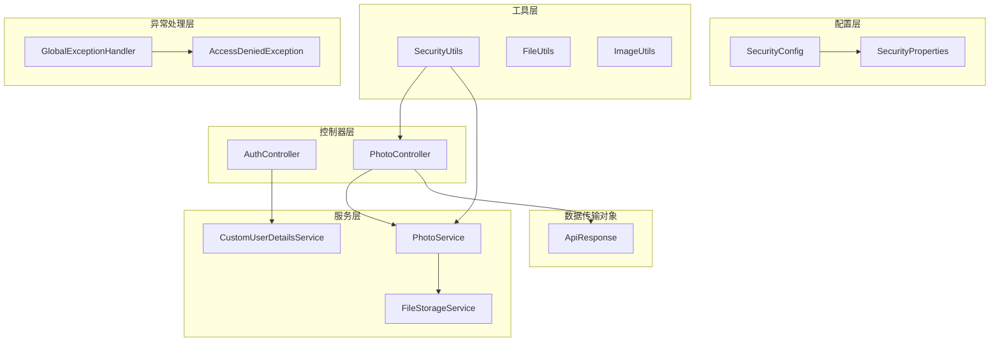
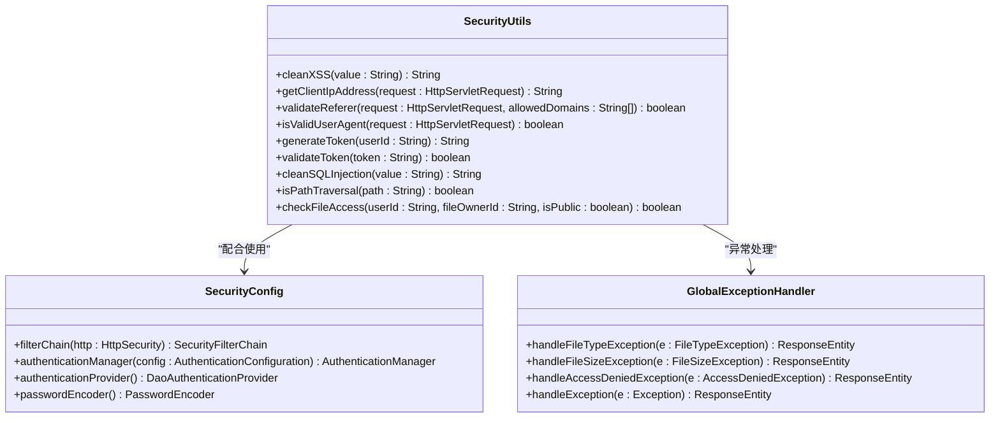
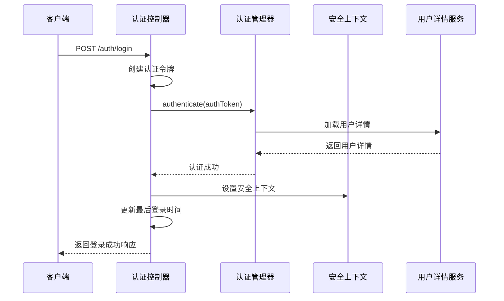
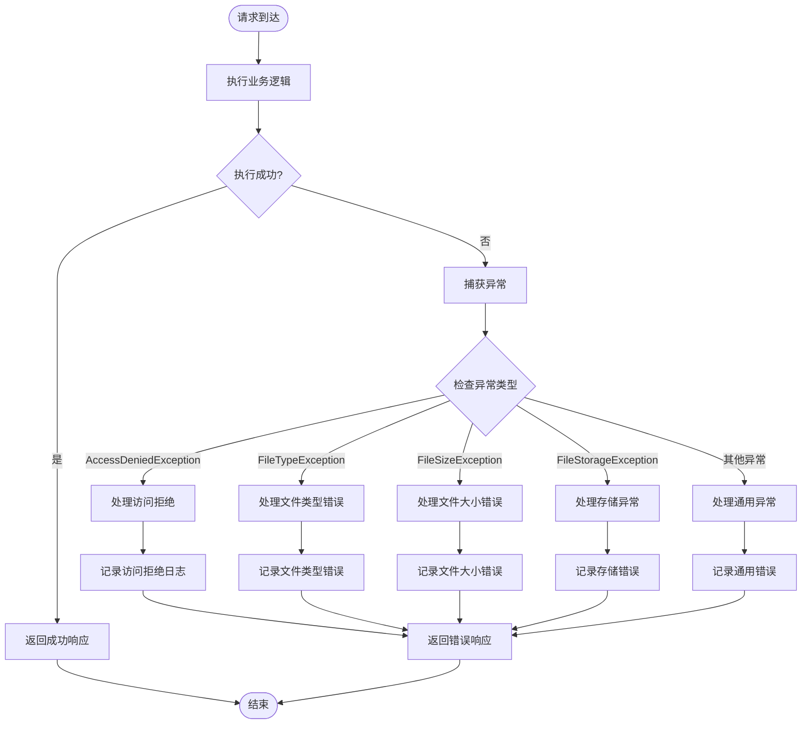
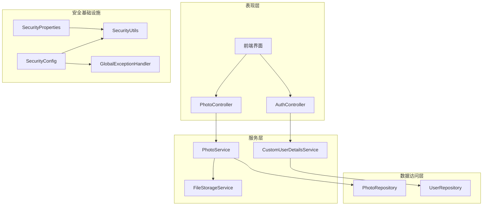
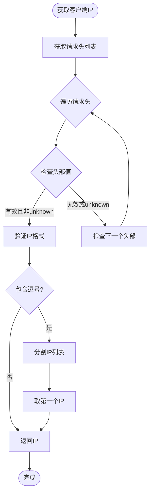
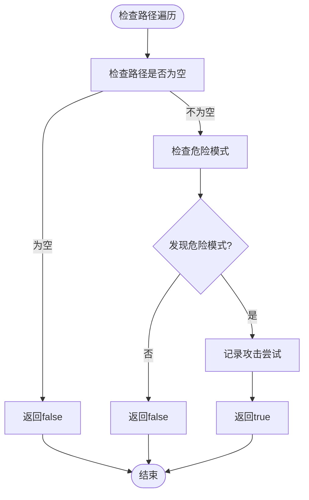
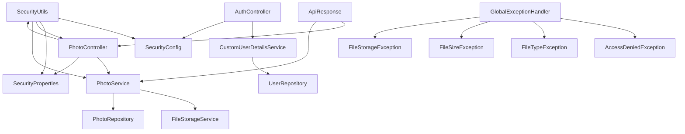

# 安全工具类

<cite>
**本文档引用的文件**
- [SecurityUtils.java](file://src/main/java/com/photo/util/SecurityUtils.java)
- [SecurityConfig.java](file://src/main/java/com/photo/config/SecurityConfig.java)
- [GlobalExceptionHandler.java](file://src/main/java/com/photo/exception/GlobalExceptionHandler.java)
- [AccessDeniedException.java](file://src/main/java/com/photo/exception/AccessDeniedException.java)
- [CustomUserDetailsService.java](file://src/main/java/com/photo/service/CustomUserDetailsService.java)
- [AuthController.java](file://src/main/java/com/photo/controller/AuthController.java)
- [PhotoController.java](file://src/main/java/com/photo/controller/PhotoController.java)
- [PhotoService.java](file://src/main/java/com/photo/service/PhotoService.java)
- [FileStorageService.java](file://src/main/java/com/photo/service/FileStorageService.java)
- [SecurityProperties.java](file://src/main/java/com/photo/config/SecurityProperties.java)
- [application.yml](file://src/main/resources/application.yml)
- [ApiResponse.java](file://src/main/java/com/photo/dto/ApiResponse.java)
- [FileUtils.java](file://src/main/java/com/photo/util/FileUtils.java)
- [ImageUtils.java](file://src/main/java/com/photo/util/ImageUtils.java)
- [SecurityUtilsTest.java](file://src/test/java/com/photo/util/SecurityUtilsTest.java)
</cite>

## 目录
1. [简介](#简介)
2. [项目结构](#项目结构)
3. [核心组件](#核心组件)
4. [架构概览](#架构概览)
5. [详细组件分析](#详细组件分析)
6. [依赖关系分析](#依赖关系分析)
7. [性能考虑](#性能考虑)
8. [故障排除指南](#故障排除指南)
9. [结论](#结论)
10. [附录](#附录)

## 简介

本文件详细介绍了项目中的安全工具类及其在整个系统中的应用。SecurityUtils工具类提供了多种安全防护功能，包括XSS过滤、IP地址获取、Referer防盗链验证、User-Agent验证、Token生成与验证、SQL注入防护、路径遍历攻击防护以及文件访问权限检查等。同时，文档还阐述了Spring Security的集成方式、全局异常处理器的安全相关异常处理机制，以及安全工具类在系统各层的使用方式。

## 项目结构

该项目采用标准的Spring Boot项目结构，安全相关的代码主要分布在以下模块：



**图表来源**
- [SecurityConfig.java](file://src/main/java/com/photo/config/SecurityConfig.java#L26-L58)
- [SecurityUtils.java](file://src/main/java/com/photo/util/SecurityUtils.java#L11-L167)
- [AuthController.java](file://src/main/java/com/photo/controller/AuthController.java#L23-L111)
- [PhotoController.java](file://src/main/java/com/photo/controller/PhotoController.java#L30-L316)

**章节来源**
- [SecurityConfig.java](file://src/main/java/com/photo/config/SecurityConfig.java#L26-L98)
- [SecurityUtils.java](file://src/main/java/com/photo/util/SecurityUtils.java#L11-L167)
- [application.yml](file://src/main/resources/application.yml#L119-L145)

## 核心组件

### SecurityUtils工具类

SecurityUtils是项目的核心安全工具类，提供了全面的安全防护功能：

#### 主要功能模块

1. **XSS防护** - 使用HTML转义机制防止跨站脚本攻击
2. **IP地址获取** - 支持多级代理环境下的真实IP获取
3. **Referer防盗链** - 防止外部站点直接访问资源
4. **User-Agent验证** - 检测和验证客户端标识
5. **Token管理** - 生成和验证安全令牌
6. **SQL注入防护** - 过滤危险字符和SQL关键字
7. **路径遍历攻击防护** - 检测和阻止路径遍历攻击
8. **文件访问权限检查** - 控制文件的访问权限

#### 关键方法分析



**图表来源**
- [SecurityUtils.java](file://src/main/java/com/photo/util/SecurityUtils.java#L14-L167)
- [SecurityConfig.java](file://src/main/java/com/photo/config/SecurityConfig.java#L36-L58)
- [GlobalExceptionHandler.java](file://src/main/java/com/photo/exception/GlobalExceptionHandler.java#L21-L139)

**章节来源**
- [SecurityUtils.java](file://src/main/java/com/photo/util/SecurityUtils.java#L14-L167)

### Spring Security集成

系统采用Spring Security进行身份认证和授权管理：

#### 安全配置要点

1. **表单登录** - 支持传统的用户名密码登录
2. **URL权限控制** - 对不同路径设置不同的访问权限
3. **CORS配置** - 支持跨域资源共享
4. **会话管理** - 使用HTTP Session进行会话管理

#### 认证流程



**图表来源**
- [AuthController.java](file://src/main/java/com/photo/controller/AuthController.java#L47-L80)
- [CustomUserDetailsService.java](file://src/main/java/com/photo/service/CustomUserDetailsService.java#L27-L41)

**章节来源**
- [SecurityConfig.java](file://src/main/java/com/photo/config/SecurityConfig.java#L36-L58)
- [AuthController.java](file://src/main/java/com/photo/controller/AuthController.java#L23-L111)

### 全局异常处理器

全局异常处理器提供了统一的安全相关异常处理机制：

#### 异常处理策略

| 异常类型 | HTTP状态码 | 处理策略 |
|---------|-----------|----------|
| AccessDeniedException | 403 Forbidden | 访问被拒绝，记录安全日志 |
| FileTypeException | 400 Bad Request | 文件类型错误，返回具体错误信息 |
| FileSizeException | 400 Bad Request | 文件大小超限，返回限制信息 |
| FileStorageException | 500 Internal Server Error | 文件存储失败，记录详细错误 |
| StorageFullException | 507 Insufficient Storage | 存储空间不足，提示扩容 |

#### 异常处理流程



**图表来源**
- [GlobalExceptionHandler.java](file://src/main/java/com/photo/exception/GlobalExceptionHandler.java#L21-L139)

**章节来源**
- [GlobalExceptionHandler.java](file://src/main/java/com/photo/exception/GlobalExceptionHandler.java#L21-L139)

## 架构概览

系统采用分层架构设计，安全功能贯穿各个层次：



**图表来源**
- [SecurityConfig.java](file://src/main/java/com/photo/config/SecurityConfig.java#L26-L98)
- [SecurityUtils.java](file://src/main/java/com/photo/util/SecurityUtils.java#L14-L167)
- [GlobalExceptionHandler.java](file://src/main/java/com/photo/exception/GlobalExceptionHandler.java#L21-L139)

## 详细组件分析

### SecurityUtils工具类深度分析

#### XSS防护机制

SecurityUtils实现了多层次的XSS防护：

1. **输入验证** - 检查输入字符串的有效性
2. **HTML转义** - 使用`HtmlUtils.htmlEscape()`进行安全转义
3. **字符过滤** - 移除潜在的危险字符

#### IP地址获取算法



**图表来源**
- [SecurityUtils.java](file://src/main/java/com/photo/util/SecurityUtils.java#L30-L57)

#### Referer防盗链验证

Referer验证机制确保只有来自允许域名的请求才能访问受保护资源：

1. **配置管理** - 通过`SecurityProperties`配置允许的域名列表
2. **动态验证** - 运行时检查Referer头部
3. **日志记录** - 记录非法访问尝试

#### 路径遍历攻击防护

路径遍历防护通过检测特定模式来防止目录遍历攻击：



**图表来源**
- [SecurityUtils.java](file://src/main/java/com/photo/util/SecurityUtils.java#L133-L147)

**章节来源**
- [SecurityUtils.java](file://src/main/java/com/photo/util/SecurityUtils.java#L14-L167)

### 安全工具类在各层的应用

#### 控制器层应用

在控制器层，SecurityUtils主要用于：

1. **日志记录** - 记录客户端IP地址
2. **防盗链检查** - 在文件访问前验证Referer
3. **安全上下文** - 获取当前用户的认证信息

#### 服务层应用

在服务层，SecurityUtils主要用于：

1. **文件访问控制** - 验证文件访问权限
2. **输入验证** - 清理用户输入数据
3. **安全审计** - 记录安全相关的操作

#### 数据访问层应用

在数据访问层，SecurityUtils主要用于：

1. **文件路径验证** - 确保文件操作的安全性
2. **SQL注入防护** - 清理SQL查询参数

**章节来源**
- [PhotoController.java](file://src/main/java/com/photo/controller/PhotoController.java#L84-L117)
- [PhotoService.java](file://src/main/java/com/photo/service/PhotoService.java#L192-L234)

### 自定义安全功能扩展

系统提供了多种扩展点来实现自定义安全功能：

#### 扩展点1：自定义认证提供程序

```java
@Bean
public DaoAuthenticationProvider customAuthenticationProvider() {
    DaoAuthenticationProvider provider = new DaoAuthenticationProvider();
    provider.setUserDetailsService(customUserDetailsService);
    provider.setPasswordEncoder(customPasswordEncoder());
    provider.setHideUserNotFoundExceptions(false);
    return provider;
}
```

#### 扩展点2：自定义安全过滤器

```java
@Bean
public SecurityFilterChain customFilterChain(HttpSecurity http) throws Exception {
    http.addFilterBefore(customAuthenticationFilter(), UsernamePasswordAuthenticationFilter.class);
    return http.build();
}
```

#### 扩展点3：自定义权限评估器

```java
@Bean
public PermissionEvaluator customPermissionEvaluator() {
    return new CustomPermissionEvaluator();
}
```

**章节来源**
- [SecurityConfig.java](file://src/main/java/com/photo/config/SecurityConfig.java#L65-L71)

## 依赖关系分析

### 组件依赖图



**图表来源**
- [SecurityUtils.java](file://src/main/java/com/photo/util/SecurityUtils.java#L14-L167)
- [SecurityConfig.java](file://src/main/java/com/photo/config/SecurityConfig.java#L30-L35)
- [PhotoController.java](file://src/main/java/com/photo/controller/PhotoController.java#L36-L43)

### 关键依赖关系

1. **SecurityUtils与SecurityConfig** - 提供基础安全功能支持
2. **AuthController与CustomUserDetailsService** - 实现用户认证流程
3. **PhotoController与SecurityUtils** - 实现防盗链和访问控制
4. **GlobalExceptionHandler与各种异常类** - 提供统一异常处理

**章节来源**
- [SecurityUtils.java](file://src/main/java/com/photo/util/SecurityUtils.java#L14-L167)
- [AuthController.java](file://src/main/java/com/photo/controller/AuthController.java#L27-L34)

## 性能考虑

### 安全操作的性能影响

1. **XSS过滤** - 对每个用户输入进行HTML转义，性能开销较小
2. **IP地址获取** - 需要遍历多个请求头，但通常只有几个头部
3. **Referer验证** - 字符串匹配操作，性能影响很小
4. **文件访问权限检查** - 简单的字符串比较操作

### 优化建议

1. **缓存安全配置** - 将SecurityProperties配置缓存到内存中
2. **异步日志记录** - 对安全日志使用异步记录机制
3. **批量验证** - 对于大量文件操作，考虑批量权限验证

## 故障排除指南

### 常见安全问题及解决方案

#### 1. 访问被拒绝问题

**症状**：用户收到403错误
**原因**：权限不足或防盗链验证失败
**解决方案**：
- 检查用户权限配置
- 验证Referer域名设置
- 查看安全日志获取详细信息

#### 2. 文件访问失败

**症状**：文件无法下载或预览
**原因**：文件权限检查失败或路径遍历攻击
**解决方案**：
- 检查文件所有者信息
- 验证文件路径安全性
- 确认文件存在性

#### 3. 认证失败

**症状**：登录失败
**原因**：用户名密码错误或用户被禁用
**解决方案**：
- 验证用户凭据
- 检查用户状态
- 查看认证日志

**章节来源**
- [GlobalExceptionHandler.java](file://src/main/java/com/photo/exception/GlobalExceptionHandler.java#L81-L87)
- [PhotoService.java](file://src/main/java/com/photo/service/PhotoService.java#L198-L201)

## 结论

SecurityUtils工具类为整个系统提供了全面的安全防护机制，涵盖了从输入验证到访问控制的各个方面。通过与Spring Security的深度集成，系统实现了多层次的安全保障。全局异常处理器确保了安全相关异常的一致处理，而完善的日志记录机制则为安全审计提供了有力支持。

系统的安全架构设计合理，既保证了功能的完整性，又兼顾了性能和可维护性。通过本文档的详细分析，开发者可以更好地理解和使用这些安全功能，并在此基础上进行进一步的扩展和定制。

## 附录

### 安全配置参考

#### application.yml中的安全配置

```yaml
security:
  referer:
    enabled: true
    allowed-domains:
      - localhost
      - 127.0.0.1
  token:
    secret: your-secret-key-change-this-in-production
    expiration: 86400
  cors:
    enabled: true
    allowed-origins:
      - http://localhost:3000
      - http://localhost:8080
    allowed-methods:
      - GET
      - POST
      - PUT
      - DELETE
    allowed-headers: "*"
    allow-credentials: true
```

### 安全最佳实践

1. **定期更新安全配置** - 生产环境中及时更新密钥和配置
2. **实施最小权限原则** - 为用户分配必要的最小权限
3. **启用安全日志** - 记录所有安全相关的操作
4. **定期安全审计** - 检查系统的安全状态
5. **及时更新依赖** - 保持Spring Security等依赖的最新版本