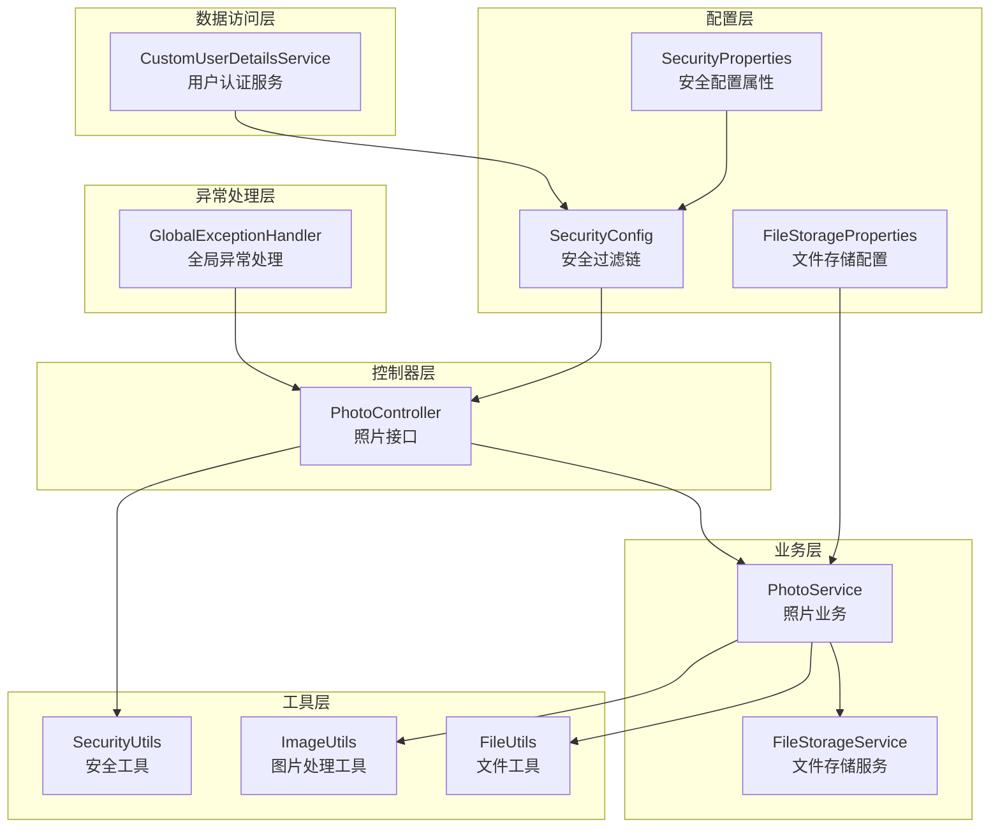
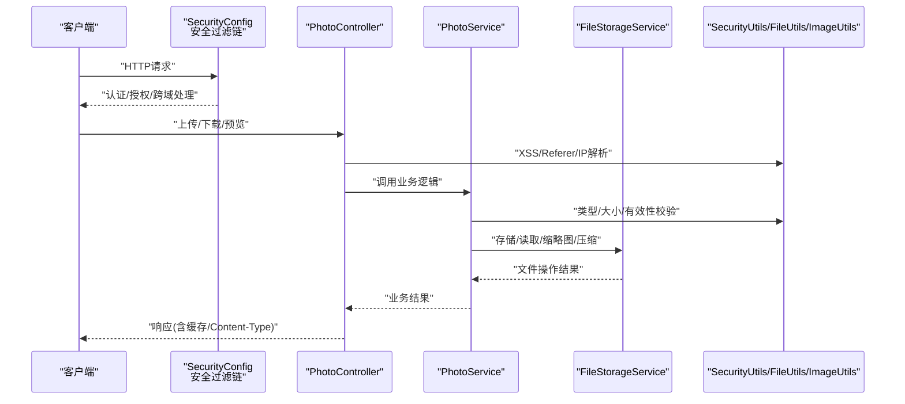
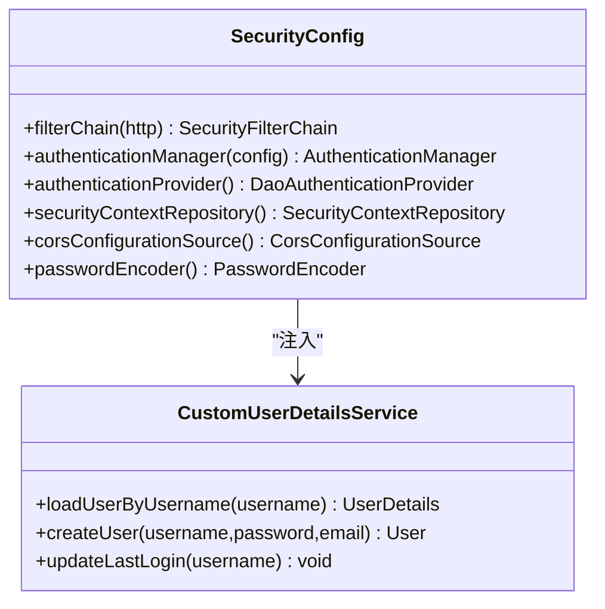
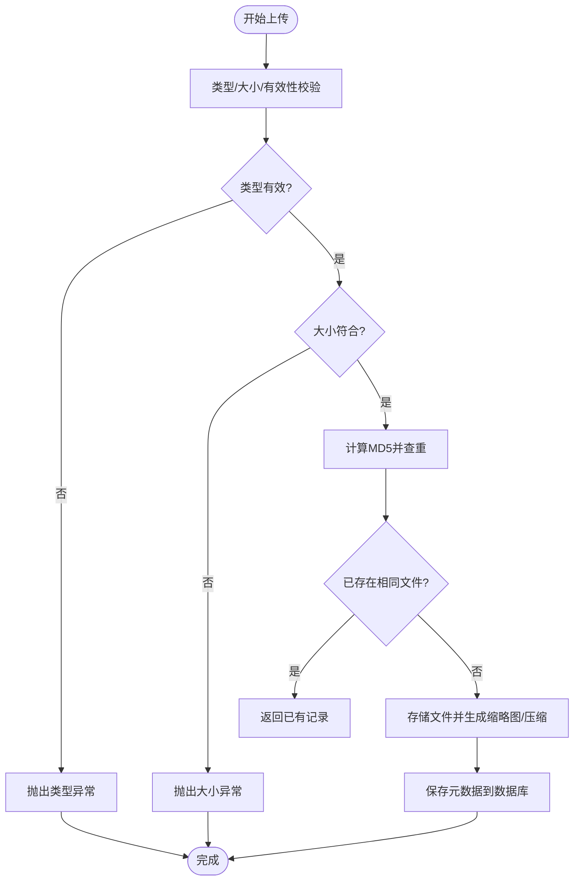
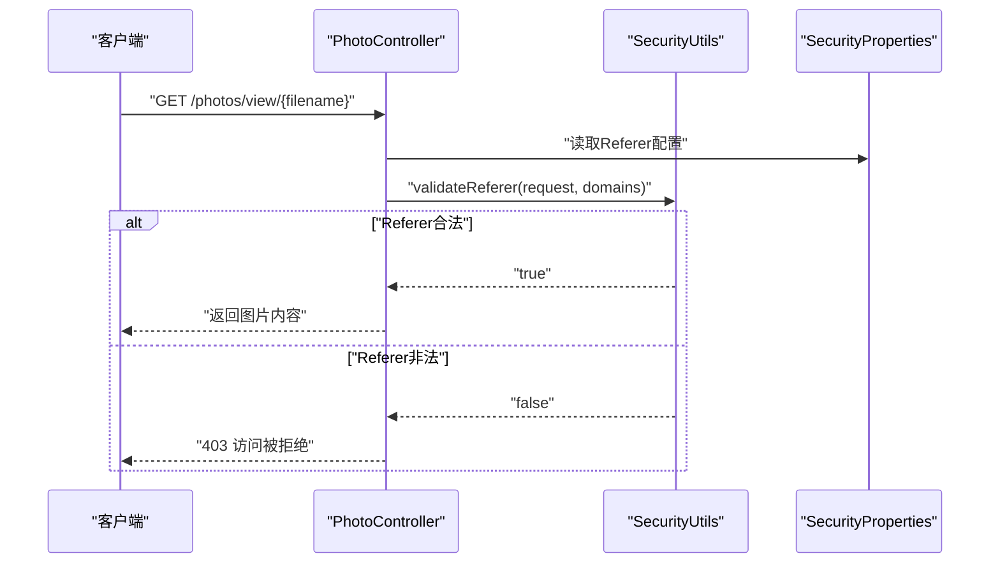
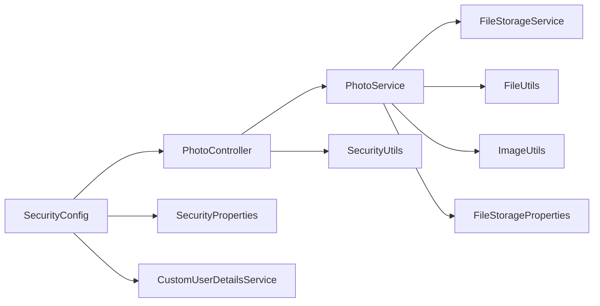

# 安全架构设计

<cite>
**本文引用的文件**
- [SecurityConfig.java](file://src/main/java/com/photo/config/SecurityConfig.java)
- [SecurityProperties.java](file://src/main/java/com/photo/config/SecurityProperties.java)
- [FileStorageProperties.java](file://src/main/java/com/photo/config/FileStorageProperties.java)
- [SecurityUtils.java](file://src/main/java/com/photo/util/SecurityUtils.java)
- [FileUtils.java](file://src/main/java/com/photo/util/FileUtils.java)
- [ImageUtils.java](file://src/main/java/com/photo/util/ImageUtils.java)
- [FileStorageService.java](file://src/main/java/com/photo/service/FileStorageService.java)
- [PhotoService.java](file://src/main/java/com/photo/service/PhotoService.java)
- [PhotoController.java](file://src/main/java/com/photo/controller/PhotoController.java)
- [CustomUserDetailsService.java](file://src/main/java/com/photo/service/CustomUserDetailsService.java)
- [GlobalExceptionHandler.java](file://src/main/java/com/photo/exception/GlobalExceptionHandler.java)
- [application.yml](file://src/main/resources/application.yml)
- [pom.xml](file://pom.xml)
</cite>

## 目录
1. [引言](#引言)
2. [项目结构](#项目结构)
3. [核心组件](#核心组件)
4. [架构总览](#架构总览)
5. [详细组件分析](#详细组件分析)
6. [依赖关系分析](#依赖关系分析)
7. [性能考量](#性能考量)
8. [故障排查指南](#故障排查指南)
9. [结论](#结论)
10. [附录](#附录)

## 引言
本文件面向照片上传下载系统的安全架构设计，系统基于Spring Boot构建，重点围绕以下安全主题展开：
- Spring Security的配置与集成：认证机制、授权策略、会话管理、CORS与CSRF策略
- 文件上传安全：类型验证、大小限制、路径遍历防护、XSS防护
- 防盗链机制：Referer校验与配置
- 数据传输安全、API访问控制与敏感信息保护
- 安全配置最佳实践与常见漏洞防范
- 安全审计与日志记录设计

## 项目结构
系统采用分层架构，主要模块包括：
- 配置层：安全配置、文件存储配置、应用配置
- 控制器层：对外暴露REST接口，负责请求接入与响应封装
- 业务层：照片上传、下载、缩略图、存储空间管理等核心逻辑
- 工具层：文件工具、图片处理、安全工具
- 异常处理层：统一异常映射与错误响应
- 数据访问层：JPA仓库（当前使用H2，可切换MySQL）

图表来源
- [SecurityConfig.java](file://src/main/java/com/photo/config/SecurityConfig.java#L36-L58)
- [SecurityProperties.java](file://src/main/java/com/photo/config/SecurityProperties.java#L15-L52)
- [FileStorageProperties.java](file://src/main/java/com/photo/config/FileStorageProperties.java#L14-L93)
- [PhotoController.java](file://src/main/java/com/photo/controller/PhotoController.java#L34-L315)
- [PhotoService.java](file://src/main/java/com/photo/service/PhotoService.java#L36-L384)
- [FileStorageService.java](file://src/main/java/com/photo/service/FileStorageService.java#L24-L299)
- [SecurityUtils.java](file://src/main/java/com/photo/util/SecurityUtils.java#L15-L166)
- [FileUtils.java](file://src/main/java/com/photo/util/FileUtils.java#L19-L177)
- [ImageUtils.java](file://src/main/java/com/photo/util/ImageUtils.java#L15-L181)
- [GlobalExceptionHandler.java](file://src/main/java/com/photo/exception/GlobalExceptionHandler.java#L21-L139)
- [CustomUserDetailsService.java](file://src/main/java/com/photo/service/CustomUserDetailsService.java#L18-L69)

章节来源
- [SecurityConfig.java](file://src/main/java/com/photo/config/SecurityConfig.java#L26-L98)
- [application.yml](file://src/main/resources/application.yml#L1-L190)

## 核心组件
- 安全过滤链与认证授权：通过SecurityConfig定义HTTP安全策略、表单登录、登出、CORS与CSRF配置，并注入自定义UserDetailsService实现
- 文件存储与安全校验：FileStorageService负责目录初始化、文件读写、缩略图与压缩；PhotoService在上传前进行类型、大小、有效性校验，并检查存储空间
- 防盗链与XSS防护：PhotoController在预览接口启用Referer校验；SecurityUtils提供XSS过滤、路径遍历检测、IP解析等
- 统一异常处理：GlobalExceptionHandler对各类业务异常进行标准化响应
- 配置中心：application.yml集中管理数据库、文件存储、安全、日志、服务器等配置

章节来源
- [SecurityConfig.java](file://src/main/java/com/photo/config/SecurityConfig.java#L36-L98)
- [PhotoService.java](file://src/main/java/com/photo/service/PhotoService.java#L50-L336)
- [FileStorageService.java](file://src/main/java/com/photo/service/FileStorageService.java#L36-L299)
- [PhotoController.java](file://src/main/java/com/photo/controller/PhotoController.java#L92-L117)
- [SecurityUtils.java](file://src/main/java/com/photo/util/SecurityUtils.java#L20-L166)
- [GlobalExceptionHandler.java](file://src/main/java/com/photo/exception/GlobalExceptionHandler.java#L21-L139)
- [application.yml](file://src/main/resources/application.yml#L69-L190)

## 架构总览
系统安全架构围绕“入口防护—业务校验—资源访问—异常处理”闭环设计，关键节点如下：
- 入口防护：SecurityConfig禁用CSRF，开放静态资源与公开接口，其余请求需认证；CORS由SecurityProperties动态配置
- 业务校验：PhotoService在上传阶段执行类型、大小、有效性、存储空间检查；FileStorageService在存储阶段进行路径规范化与合法性校验
- 资源访问：PhotoController在预览接口执行Referer校验；下载接口设置合适的Content-Type与缓存策略
- 异常处理：统一捕获并返回标准错误响应，避免敏感信息泄露

图表来源
- [SecurityConfig.java](file://src/main/java/com/photo/config/SecurityConfig.java#L36-L58)
- [PhotoController.java](file://src/main/java/com/photo/controller/PhotoController.java#L48-L179)
- [PhotoService.java](file://src/main/java/com/photo/service/PhotoService.java#L50-L136)
- [FileStorageService.java](file://src/main/java/com/photo/service/FileStorageService.java#L59-L95)
- [SecurityUtils.java](file://src/main/java/com/photo/util/SecurityUtils.java#L62-L79)
- [FileUtils.java](file://src/main/java/com/photo/util/FileUtils.java#L56-L102)
- [ImageUtils.java](file://src/main/java/com/photo/util/ImageUtils.java#L128-L147)

## 详细组件分析

### Spring Security配置与集成
- 过滤链策略：禁用CSRF，开启CORS，对静态资源与公开接口放行，其余请求必须认证
- 表单登录与登出：指定登录页面与成功跳转URL，登出URL与成功跳转
- 自定义UserDetailsService：从数据库加载用户，校验账户状态
- 密码编码：BCryptPasswordEncoder
- 安全上下文：基于HttpSession的SecurityContextRepository

图表来源
- [SecurityConfig.java](file://src/main/java/com/photo/config/SecurityConfig.java#L36-L98)
- [CustomUserDetailsService.java](file://src/main/java/com/photo/service/CustomUserDetailsService.java#L18-L69)

章节来源
- [SecurityConfig.java](file://src/main/java/com/photo/config/SecurityConfig.java#L36-L98)
- [CustomUserDetailsService.java](file://src/main/java/com/photo/service/CustomUserDetailsService.java#L27-L41)

### 文件上传安全防护
- 类型验证：FileUtils使用Tika检测MIME类型与扩展名，仅允许白名单类型
- 大小限制：PhotoService在上传前校验文件大小，FileStorageProperties与Spring Servlet配置共同约束
- 路径遍历防护：FileUtils对文件名进行清理与合法性校验；FileStorageService在存储时使用normalize()确保路径在目标目录内
- 有效性校验：ImageUtils对图片进行有效性检测
- 去重与重复文件处理：基于MD5判断是否已存在相同文件
- 存储空间检查：PhotoService汇总已用空间与最大容量比较

图表来源
- [PhotoService.java](file://src/main/java/com/photo/service/PhotoService.java#L50-L136)
- [FileUtils.java](file://src/main/java/com/photo/util/FileUtils.java#L56-L102)
- [ImageUtils.java](file://src/main/java/com/photo/util/ImageUtils.java#L128-L147)
- [FileStorageService.java](file://src/main/java/com/photo/service/FileStorageService.java#L59-L95)

章节来源
- [PhotoService.java](file://src/main/java/com/photo/service/PhotoService.java#L304-L336)
- [FileUtils.java](file://src/main/java/com/photo/util/FileUtils.java#L56-L102)
- [ImageUtils.java](file://src/main/java/com/photo/util/ImageUtils.java#L128-L147)
- [FileStorageService.java](file://src/main/java/com/photo/service/FileStorageService.java#L59-L95)

### 防盗链机制
- 实现原理：在预览接口中读取Referer头，若启用则检查是否包含允许域名列表
- 配置方法：通过SecurityProperties.referer.enabled与allowedDomains配置
- 默认策略：允许未携带Referer的直接访问（可根据需要调整）

图表来源
- [PhotoController.java](file://src/main/java/com/photo/controller/PhotoController.java#L92-L97)
- [SecurityUtils.java](file://src/main/java/com/photo/util/SecurityUtils.java#L62-L79)
- [SecurityProperties.java](file://src/main/java/com/photo/config/SecurityProperties.java#L32-L36)

章节来源
- [PhotoController.java](file://src/main/java/com/photo/controller/PhotoController.java#L92-L97)
- [SecurityUtils.java](file://src/main/java/com/photo/util/SecurityUtils.java#L62-L79)
- [SecurityProperties.java](file://src/main/java/com/photo/config/SecurityProperties.java#L32-L36)

### XSS防护与输入净化
- XSS过滤：SecurityUtils对输入字符串进行HTML转义
- 路径遍历检测：SecurityUtils检测路径中的危险模式
- 文件名清理：FileUtils对文件名进行清洗，移除路径分隔符与特殊字符
- 授权访问：SecurityUtils.checkFileAccess根据用户身份与文件公开状态决定访问权限

章节来源
- [SecurityUtils.java](file://src/main/java/com/photo/util/SecurityUtils.java#L20-L166)
- [FileUtils.java](file://src/main/java/com/photo/util/FileUtils.java#L157-L176)

### 数据传输安全与API访问控制
- CORS策略：由SecurityProperties动态配置，支持允许的Origin、Method、Header与Credentials
- CSRF策略：当前禁用（开发环境），生产环境建议启用并配合令牌机制
- 会话管理：基于HttpSession，结合SecurityContextRepository
- API访问控制：通过SecurityConfig对公开路径与受保护路径进行区分

章节来源
- [SecurityConfig.java](file://src/main/java/com/photo/config/SecurityConfig.java#L36-L98)
- [SecurityProperties.java](file://src/main/java/com/photo/config/SecurityProperties.java#L44-L51)

### 敏感信息保护策略
- 密码存储：使用BCryptPasswordEncoder进行不可逆加密
- 日志脱敏：统一异常处理返回标准化错误信息，避免堆栈与敏感字段泄露
- 配置项管理：敏感配置如Token密钥、数据库凭据在application.yml中集中管理，建议在生产环境使用环境变量或密钥管理服务

章节来源
- [SecurityConfig.java](file://src/main/java/com/photo/config/SecurityConfig.java#L94-L97)
- [GlobalExceptionHandler.java](file://src/main/java/com/photo/exception/GlobalExceptionHandler.java#L21-L139)
- [application.yml](file://src/main/resources/application.yml#L127-L131)

### 安全审计与日志记录
- 日志级别：按包设置DEBUG/INFO级别，便于定位问题
- 日志文件：输出到固定路径，支持滚动与保留策略
- 关键事件：上传、下载、预览、删除、存储清理等操作均记录INFO级别日志
- 异常日志：统一异常处理器记录错误详情与HTTP状态码

章节来源
- [application.yml](file://src/main/resources/application.yml#L146-L159)
- [PhotoController.java](file://src/main/java/com/photo/controller/PhotoController.java#L56-L116)
- [PhotoService.java](file://src/main/java/com/photo/service/PhotoService.java#L275-L299)

## 依赖关系分析
- 外部依赖：Spring Security、Spring Data JPA、Thymeleaf、Caffeine、Apache Tika、Thumbnailator等
- 内部耦合：PhotoController依赖PhotoService与FileStorageService；PhotoService依赖FileUtils、ImageUtils与FileStorageProperties；SecurityConfig依赖SecurityProperties与CustomUserDetailsService

图表来源
- [PhotoController.java](file://src/main/java/com/photo/controller/PhotoController.java#L34-L315)
- [PhotoService.java](file://src/main/java/com/photo/service/PhotoService.java#L36-L384)
- [FileStorageService.java](file://src/main/java/com/photo/service/FileStorageService.java#L24-L299)
- [SecurityConfig.java](file://src/main/java/com/photo/config/SecurityConfig.java#L26-L98)
- [SecurityProperties.java](file://src/main/java/com/photo/config/SecurityProperties.java#L15-L52)
- [FileStorageProperties.java](file://src/main/java/com/photo/config/FileStorageProperties.java#L14-L93)
- [SecurityUtils.java](file://src/main/java/com/photo/util/SecurityUtils.java#L15-L166)
- [FileUtils.java](file://src/main/java/com/photo/util/FileUtils.java#L19-L177)
- [ImageUtils.java](file://src/main/java/com/photo/util/ImageUtils.java#L15-L181)
- [CustomUserDetailsService.java](file://src/main/java/com/photo/service/CustomUserDetailsService.java#L18-L69)

章节来源
- [pom.xml](file://pom.xml#L30-L149)

## 性能考量
- 缓存：启用Caffeine缓存，提升照片元数据查询性能
- 压缩与缩略图：默认启用图片压缩与缩略图生成，降低带宽与存储压力
- 分页查询：列表查询使用分页与排序，避免一次性加载大量数据
- 断点续传：Range请求支持，优化大文件下载体验
- 线程池与连接数：Tomcat线程与最大连接数配置，满足高并发场景

章节来源
- [application.yml](file://src/main/resources/application.yml#L50-L54)
- [application.yml](file://src/main/resources/application.yml#L162-L172)
- [PhotoService.java](file://src/main/java/com/photo/service/PhotoService.java#L165-L178)
- [PhotoController.java](file://src/main/java/com/photo/controller/PhotoController.java#L184-L225)

## 故障排查指南
- 上传失败：检查文件类型、大小限制与存储空间；查看全局异常处理器返回的错误码与消息
- 预览失败：确认Referer配置与allowedDomains；检查文件是否存在与可读
- 下载失败：确认文件存在与Content-Disposition设置；检查Range头解析
- 认证失败：确认UserDetailsService加载用户状态与密码编码一致
- 日志定位：根据日志级别与文件路径快速定位问题

章节来源
- [GlobalExceptionHandler.java](file://src/main/java/com/photo/exception/GlobalExceptionHandler.java#L21-L139)
- [PhotoController.java](file://src/main/java/com/photo/controller/PhotoController.java#L92-L117)
- [PhotoService.java](file://src/main/java/com/photo/service/PhotoService.java#L304-L336)
- [CustomUserDetailsService.java](file://src/main/java/com/photo/service/CustomUserDetailsService.java#L27-L41)
- [application.yml](file://src/main/resources/application.yml#L146-L159)

## 结论
本系统在Spring Security框架下实现了基础的认证授权与CORS策略，结合文件工具与图片处理工具构建了完整的上传安全链路，并通过防盗链、XSS防护与统一异常处理形成闭环。建议在生产环境中进一步强化：
- 启用CSRF保护并引入JWT令牌机制
- 使用HTTPS与安全头部（HSTS、CSP等）
- 对上传文件进行病毒扫描与内容审核
- 加强日志审计与告警联动
- 定期更新依赖与安全补丁

## 附录
- 配置项参考：文件存储、安全、日志、服务器等配置集中在application.yml中
- 依赖清单：Spring Boot生态与第三方库在pom.xml中声明

章节来源
- [application.yml](file://src/main/resources/application.yml#L69-L190)
- [pom.xml](file://pom.xml#L30-L149)