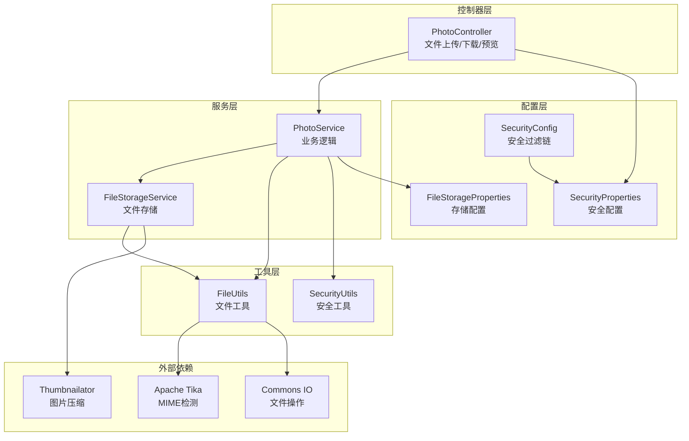
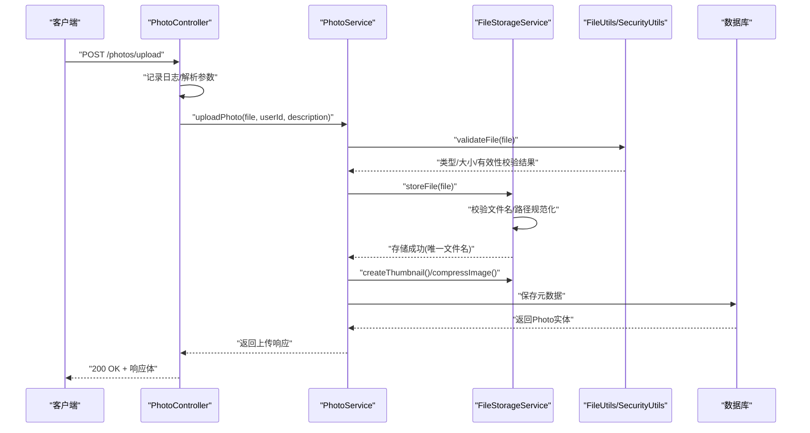
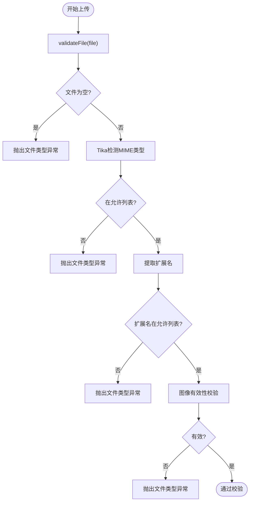
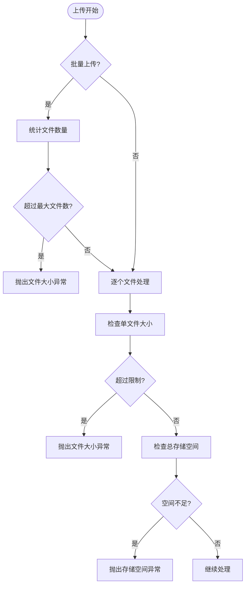
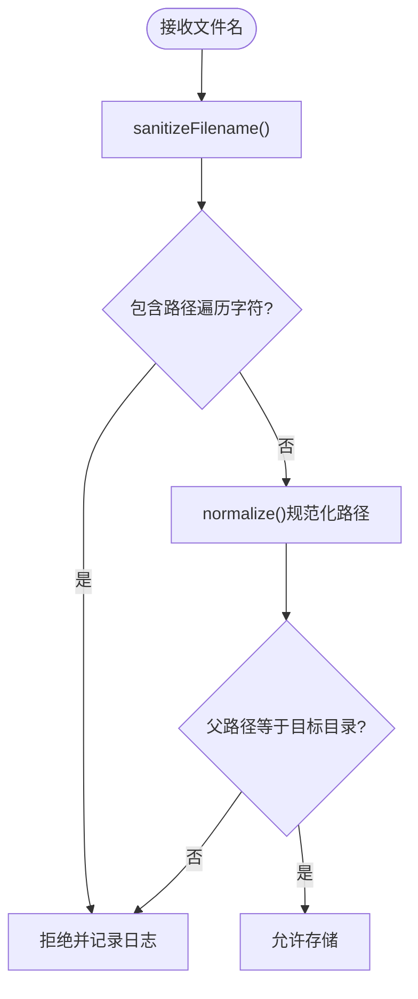
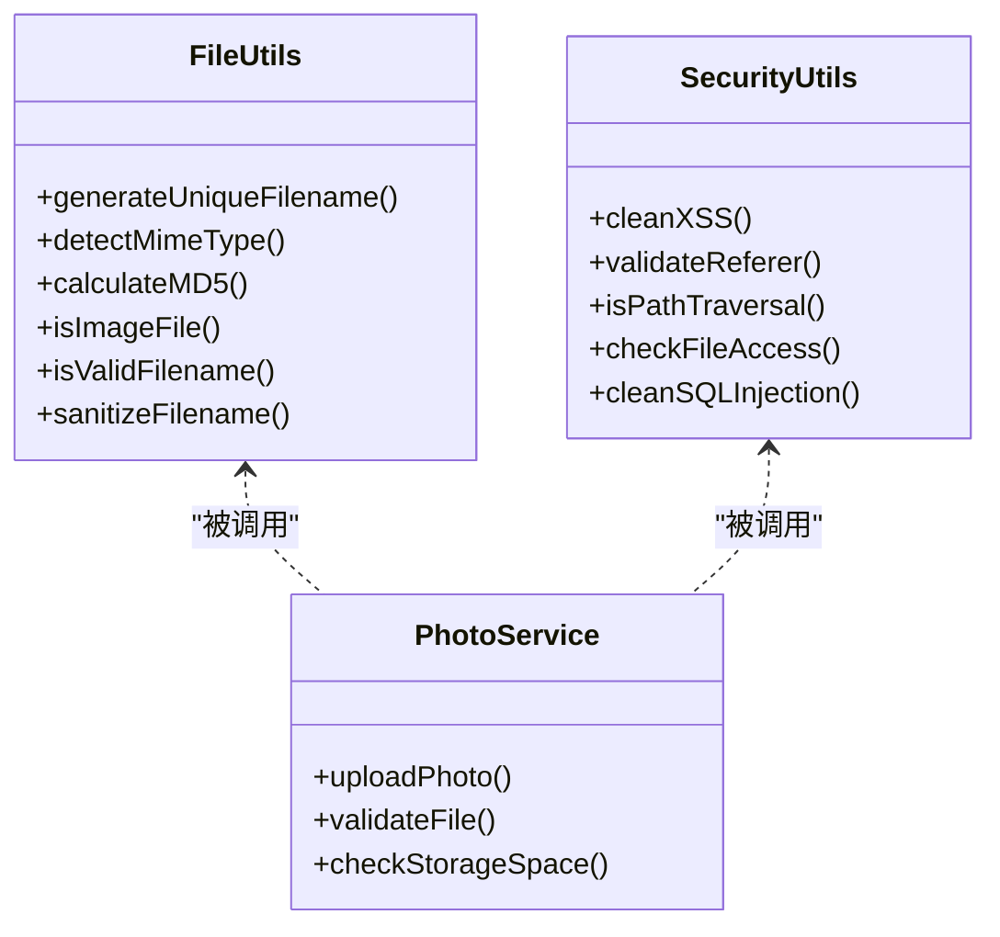
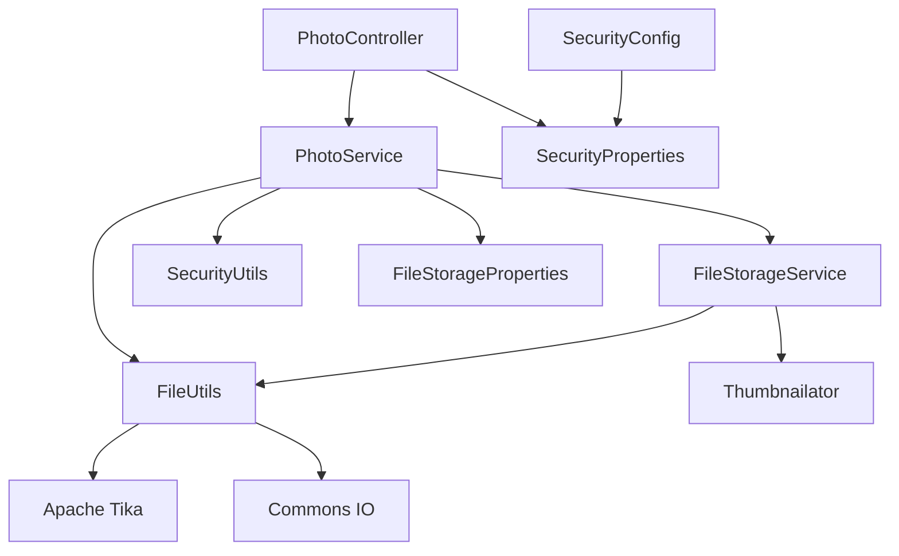

# 文件安全防护

<cite>
**本文档引用的文件**
- [SecurityConfig.java](file://src/main/java/com/photo/config/SecurityConfig.java)
- [FileStorageProperties.java](file://src/main/java/com/photo/config/FileStorageProperties.java)
- [SecurityProperties.java](file://src/main/java/com/photo/config/SecurityProperties.java)
- [FileStorageService.java](file://src/main/java/com/photo/service/FileStorageService.java)
- [PhotoService.java](file://src/main/java/com/photo/service/PhotoService.java)
- [PhotoController.java](file://src/main/java/com/photo/controller/PhotoController.java)
- [FileUtils.java](file://src/main/java/com/photo/util/FileUtils.java)
- [SecurityUtils.java](file://src/main/java/com/photo/util/SecurityUtils.java)
- [application.yml](file://src/main/resources/application.yml)
- [pom.xml](file://pom.xml)
- [FileUtilsTest.java](file://src/test/java/com/photo/util/FileUtilsTest.java)
- [SecurityUtilsTest.java](file://src/test/java/com/photo/util/SecurityUtilsTest.java)
</cite>

## 目录
1. [简介](#简介)
2. [项目结构](#项目结构)
3. [核心组件](#核心组件)
4. [架构总览](#架构总览)
5. [详细组件分析](#详细组件分析)
6. [依赖关系分析](#依赖关系分析)
7. [性能考量](#性能考量)
8. [故障排除指南](#故障排除指南)
9. [结论](#结论)
10. [附录](#附录)

## 简介
本文件安全防护文档围绕文件上传系统的关键安全机制进行深入剖析，涵盖文件类型验证、文件大小限制、路径遍历攻击防护、恶意文件检测、文件名处理策略、XSS防护、文件存储安全、以及基于Apache Tika的文件类型检测与威胁识别。文档同时提供实现示例、最佳实践与常见漏洞防范建议，帮助开发者构建健壮的文件安全体系。

## 项目结构
该项目采用Spring Boot标准分层架构：
- 配置层：负责安全、存储、应用配置
- 控制器层：暴露REST接口，处理上传、下载、预览等业务
- 服务层：封装业务逻辑，执行文件校验、存储、缩略图生成与压缩
- 工具层：提供文件工具、安全工具、图像处理工具
- 异常层：定义统一的文件相关异常类型
- 测试层：覆盖文件工具与安全工具的核心功能

**图表来源**
- [SecurityConfig.java](file://src/main/java/com/photo/config/SecurityConfig.java#L36-L58)
- [SecurityProperties.java](file://src/main/java/com/photo/config/SecurityProperties.java#L12-L31)
- [FileStorageProperties.java](file://src/main/java/com/photo/config/FileStorageProperties.java#L14-L71)
- [PhotoController.java](file://src/main/java/com/photo/controller/PhotoController.java#L30-L34)
- [PhotoService.java](file://src/main/java/com/photo/service/PhotoService.java#L34-L46)
- [FileStorageService.java](file://src/main/java/com/photo/service/FileStorageService.java#L22-L32)
- [FileUtils.java](file://src/main/java/com/photo/util/FileUtils.java#L19-L29)
- [SecurityUtils.java](file://src/main/java/com/photo/util/SecurityUtils.java#L14-L15)

**章节来源**
- [SecurityConfig.java](file://src/main/java/com/photo/config/SecurityConfig.java#L26-L58)
- [FileStorageProperties.java](file://src/main/java/com/photo/config/FileStorageProperties.java#L14-L93)
- [PhotoController.java](file://src/main/java/com/photo/controller/PhotoController.java#L30-L34)

## 核心组件
- 安全配置与过滤链：禁用CSRF，启用CORS，配置登录登出路径，关闭frameOptions以满足特定前端需求。
- 文件存储配置：集中管理存储根目录、临时目录、缩略图目录、允许的MIME类型与扩展名、最大文件大小、最大上传文件数、存储容量上限、定期清理策略。
- 文件工具：基于Apache Tika进行MIME类型检测，结合扩展名白名单；提供文件MD5计算、文件名清理与合法性校验、文件大小格式化。
- 安全工具：XSS过滤（HTML转义）、客户端IP解析、Referer防盗链、User-Agent校验、SQL注入清洗、路径遍历检测、文件访问权限校验。
- 业务服务：上传前严格校验文件类型与大小，生成唯一文件名，去重（MD5），创建缩略图，按需压缩，记录访问/下载统计，定期清理过期文件。
- 存储服务：初始化目录、安全路径解析、文件读写、断点续传、缩略图与原图管理、删除与清理。

**章节来源**
- [SecurityConfig.java](file://src/main/java/com/photo/config/SecurityConfig.java#L36-L58)
- [FileStorageProperties.java](file://src/main/java/com/photo/config/FileStorageProperties.java#L14-L93)
- [FileUtils.java](file://src/main/java/com/photo/util/FileUtils.java#L19-L102)
- [SecurityUtils.java](file://src/main/java/com/photo/util/SecurityUtils.java#L14-L167)
- [PhotoService.java](file://src/main/java/com/photo/service/PhotoService.java#L50-L136)
- [FileStorageService.java](file://src/main/java/com/photo/service/FileStorageService.java#L36-L95)

## 架构总览
文件上传流程从控制器接收请求，经过安全校验与业务校验，调用存储服务完成文件落地，并生成缩略图与可选压缩。下载与预览接口同样受安全策略保护，支持断点续传与缓存控制。

**图表来源**
- [PhotoController.java](file://src/main/java/com/photo/controller/PhotoController.java#L48-L61)
- [PhotoService.java](file://src/main/java/com/photo/service/PhotoService.java#L50-L111)
- [FileStorageService.java](file://src/main/java/com/photo/service/FileStorageService.java#L59-L95)
- [FileUtils.java](file://src/main/java/com/photo/util/FileUtils.java#L84-L102)

## 详细组件分析

### 文件类型验证机制
- MIME类型检测：使用Apache Tika对上传文件流进行检测，确保与白名单一致。
- 扩展名验证：结合原始文件扩展名进行二次校验，双重保障。
- 图片有效性校验：通过图像工具验证文件是否为有效图片，避免伪装成图片的恶意文件。
- 允许类型与扩展名：集中配置于存储属性，便于统一管理与动态调整。

**图表来源**
- [PhotoService.java](file://src/main/java/com/photo/service/PhotoService.java#L304-L324)
- [FileUtils.java](file://src/main/java/com/photo/util/FileUtils.java#L84-L102)

**章节来源**
- [PhotoService.java](file://src/main/java/com/photo/service/PhotoService.java#L304-L324)
- [FileUtils.java](file://src/main/java/com/photo/util/FileUtils.java#L21-L102)
- [FileStorageProperties.java](file://src/main/java/com/photo/config/FileStorageProperties.java#L34-L40)

### 文件大小限制与存储容量控制
- 单文件大小限制：基于配置属性与工具方法格式化显示。
- 单次上传文件数限制：防止滥用与资源耗尽。
- 总存储容量限制：实时统计已用空间，超过阈值拒绝上传。
- 断点续传：支持Range请求，提升大文件体验。

**图表来源**
- [PhotoService.java](file://src/main/java/com/photo/service/PhotoService.java#L116-L136)
- [PhotoService.java](file://src/main/java/com/photo/service/PhotoService.java#L314-L336)
- [application.yml](file://src/main/resources/application.yml#L94-L97)
- [application.yml](file://src/main/resources/application.yml#L110-L117)

**章节来源**
- [PhotoService.java](file://src/main/java/com/photo/service/PhotoService.java#L116-L136)
- [PhotoService.java](file://src/main/java/com/photo/service/PhotoService.java#L314-L336)
- [application.yml](file://src/main/resources/application.yml#L94-L117)

### 路径遍历攻击防护
- 文件名合法性校验：禁止包含路径遍历字符（如..、/、\）。
- 路径规范化：使用NIO路径规范化，确保最终路径位于目标目录内。
- 文件名清理：移除危险字符，替换为安全字符。
- 安全工具：提供路径遍历检测与文件访问权限校验。

**图表来源**
- [FileUtils.java](file://src/main/java/com/photo/util/FileUtils.java#L157-L176)
- [FileStorageService.java](file://src/main/java/com/photo/service/FileStorageService.java#L75-L82)
- [SecurityUtils.java](file://src/main/java/com/photo/util/SecurityUtils.java#L133-L147)

**章节来源**
- [FileUtils.java](file://src/main/java/com/photo/util/FileUtils.java#L157-L176)
- [FileStorageService.java](file://src/main/java/com/photo/service/FileStorageService.java#L75-L82)
- [SecurityUtils.java](file://src/main/java/com/photo/util/SecurityUtils.java#L133-L147)

### 恶意文件检测与威胁识别
- Apache Tika：基于文件内容的MIME类型检测，避免扩展名欺骗。
- 文件MD5：用于重复文件检测与威胁关联。
- 图像有效性：确保文件为有效图片，降低脚本类文件风险。
- 安全工具：提供SQL注入清洗、XSS过滤、Referer防盗链等辅助防护。

**图表来源**
- [FileUtils.java](file://src/main/java/com/photo/util/FileUtils.java#L19-L137)
- [SecurityUtils.java](file://src/main/java/com/photo/util/SecurityUtils.java#L14-L167)
- [PhotoService.java](file://src/main/java/com/photo/service/PhotoService.java#L50-L136)

**章节来源**
- [FileUtils.java](file://src/main/java/com/photo/util/FileUtils.java#L21-L137)
- [SecurityUtils.java](file://src/main/java/com/photo/util/SecurityUtils.java#L18-L167)
- [PhotoService.java](file://src/main/java/com/photo/service/PhotoService.java#L304-L336)

### 文件名处理安全策略
- 特殊字符过滤：移除或替换危险字符，避免路径注入与命令注入。
- 文件扩展名验证：严格匹配白名单扩展名，防止伪装。
- 唯一文件名生成：使用UUID生成唯一存储名，隐藏原始文件名。
- 文件大小格式化：便于用户界面展示与审计。

**章节来源**
- [FileUtils.java](file://src/main/java/com/photo/util/FileUtils.java#L41-L51)
- [FileUtils.java](file://src/main/java/com/photo/util/FileUtils.java#L157-L176)
- [FileUtils.java](file://src/main/java/com/photo/util/FileUtils.java#L142-L152)

### XSS防护实现
- 输入验证：对用户输入进行HTML转义，防止脚本注入。
- 输出编码：在模板渲染与API响应中确保输出编码正确。
- 内容安全策略：结合前端CSP策略，限制脚本执行域与来源。

**章节来源**
- [SecurityUtils.java](file://src/main/java/com/photo/util/SecurityUtils.java#L20-L25)

### 文件存储安全考虑
- 文件权限设置：建议在部署环境中为存储目录设置最小权限（仅应用进程可写）。
- 存储路径隔离：使用独立的存储根目录与子目录（原图、缩略图、临时），避免跨目录访问。
- 临时文件清理：配置定期清理策略，防止磁盘膨胀。
- 临时文件目录：独立的temp目录用于中间态文件，上传完成后及时清理。

**章节来源**
- [FileStorageProperties.java](file://src/main/java/com/photo/config/FileStorageProperties.java#L18-L30)
- [FileStorageProperties.java](file://src/main/java/com/photo/config/FileStorageProperties.java#L88-L92)
- [PhotoService.java](file://src/main/java/com/photo/service/PhotoService.java#L276-L299)

### 文件安全扫描实现示例
- 基于Apache Tika的文件类型检测：在工具类中集成Tika，对上传文件流进行MIME检测。
- 文件内容分析：结合MD5与文件元数据建立指纹库，支持重复文件检测与威胁关联。
- 威胁识别：结合黑白名单与行为特征（如异常大小、扩展名与MIME不匹配）进行识别。

**章节来源**
- [FileUtils.java](file://src/main/java/com/photo/util/FileUtils.java#L75-L79)
- [FileUtils.java](file://src/main/java/com/photo/util/FileUtils.java#L107-L137)
- [pom.xml](file://pom.xml#L102-L107)

## 依赖关系分析

**图表来源**
- [PhotoController.java](file://src/main/java/com/photo/controller/PhotoController.java#L36-L43)
- [PhotoService.java](file://src/main/java/com/photo/service/PhotoService.java#L38-L45)
- [FileStorageService.java](file://src/main/java/com/photo/service/FileStorageService.java#L26-L27)
- [FileUtils.java](file://src/main/java/com/photo/util/FileUtils.java#L21)
- [SecurityConfig.java](file://src/main/java/com/photo/config/SecurityConfig.java#L30-L31)

**章节来源**
- [PhotoController.java](file://src/main/java/com/photo/controller/PhotoController.java#L36-L43)
- [PhotoService.java](file://src/main/java/com/photo/service/PhotoService.java#L38-L45)
- [FileStorageService.java](file://src/main/java/com/photo/service/FileStorageService.java#L26-L27)
- [FileUtils.java](file://src/main/java/com/photo/util/FileUtils.java#L21)
- [SecurityConfig.java](file://src/main/java/com/photo/config/SecurityConfig.java#L30-L31)

## 性能考量
- 缓存：使用Caffeine缓存照片元数据，减少数据库压力。
- 压缩：按需压缩图片，平衡画质与体积。
- 分页与排序：列表查询使用分页与排序，避免一次性加载过多数据。
- 断点续传：支持Range请求，提升大文件下载效率。
- 定时清理：定期清理过期文件，保持磁盘空间健康。

**章节来源**
- [application.yml](file://src/main/resources/application.yml#L50-L54)
- [application.yml](file://src/main/resources/application.yml#L164-L171)
- [PhotoService.java](file://src/main/java/com/photo/service/PhotoService.java#L276-L299)
- [PhotoController.java](file://src/main/java/com/photo/controller/PhotoController.java#L183-L225)

## 故障排除指南
- 文件类型异常：检查MIME类型与扩展名是否匹配，确认Tika依赖是否正确引入。
- 文件大小异常：确认单文件与总存储空间限制，检查批量上传数量。
- 路径遍历异常：检查文件名是否包含危险字符，确认路径规范化逻辑。
- 存储目录创建失败：检查存储根目录权限与磁盘空间。
- 下载/预览失败：确认文件存在性、缩略图生成状态与缓存控制头设置。

**章节来源**
- [FileUtilsTest.java](file://src/test/java/com/photo/util/FileUtilsTest.java#L55-L78)
- [SecurityUtilsTest.java](file://src/test/java/com/photo/util/SecurityUtilsTest.java#L99-L107)
- [FileStorageService.java](file://src/main/java/com/photo/service/FileStorageService.java#L50-L54)
- [PhotoController.java](file://src/main/java/com/photo/controller/PhotoController.java#L102-L117)

## 结论
本系统通过多层安全防护与严格的文件处理策略，实现了从上传到存储、从访问到清理的全链路安全控制。结合Apache Tika的MIME检测、路径规范化与文件名清理、XSS过滤与防盗链、以及定时清理与容量控制，有效降低了文件上传场景下的安全风险。建议在生产环境中进一步完善权限模型、引入更严格的威胁情报与沙箱检测，并持续优化性能与可观测性。

## 附录
- 配置项参考：文件存储根目录、允许类型、最大文件大小、存储容量上限、CORS与Referer配置、定时清理策略等。
- 依赖版本：Spring Boot、Spring Security、Spring Data JPA、Apache Tika、Thumbnailator、Commons IO、Caffeine等。

**章节来源**
- [application.yml](file://src/main/resources/application.yml#L69-L145)
- [pom.xml](file://pom.xml#L21-L149)