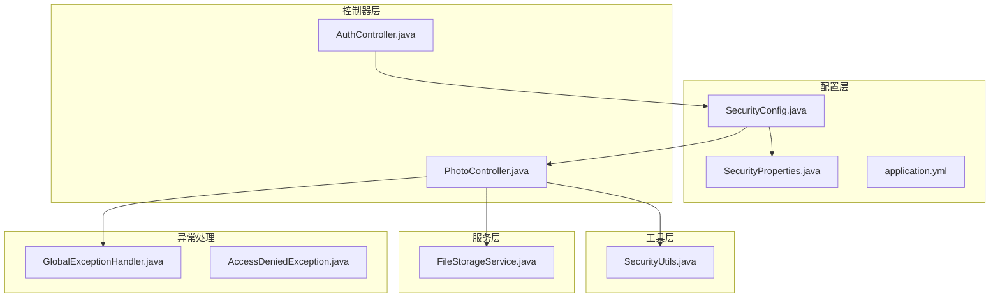
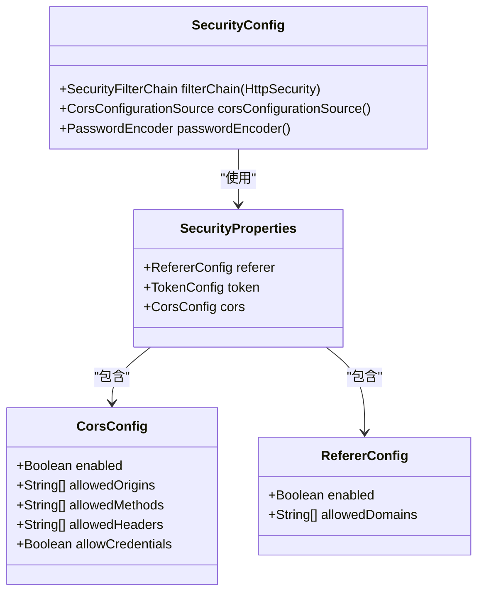
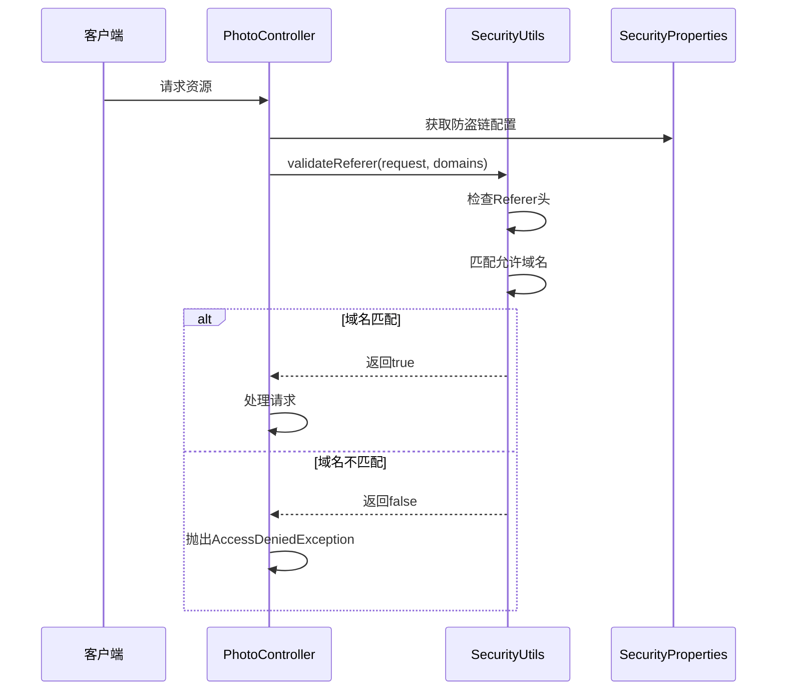
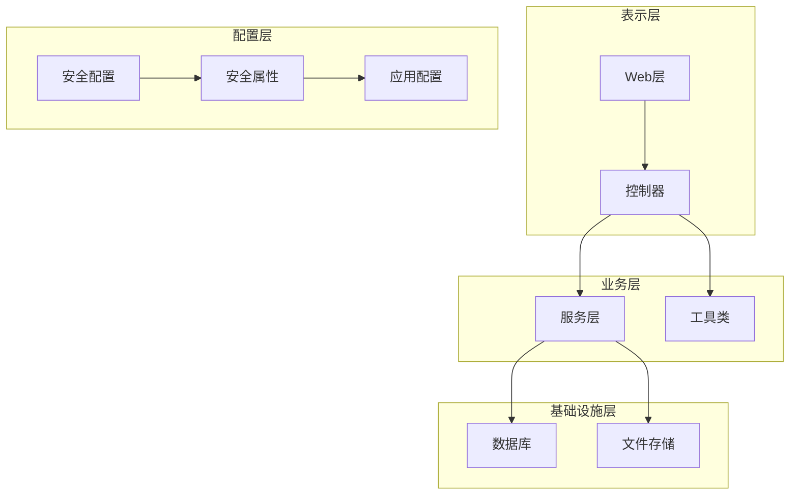
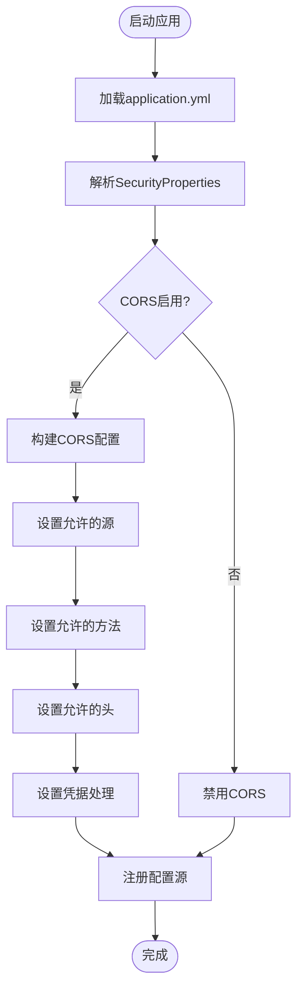
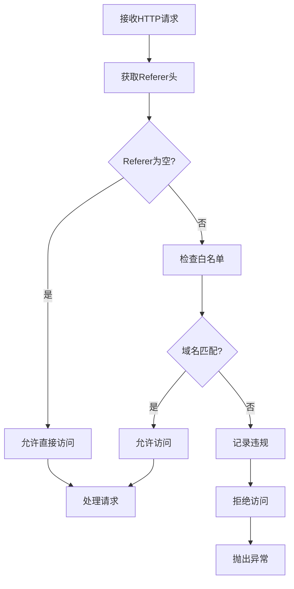
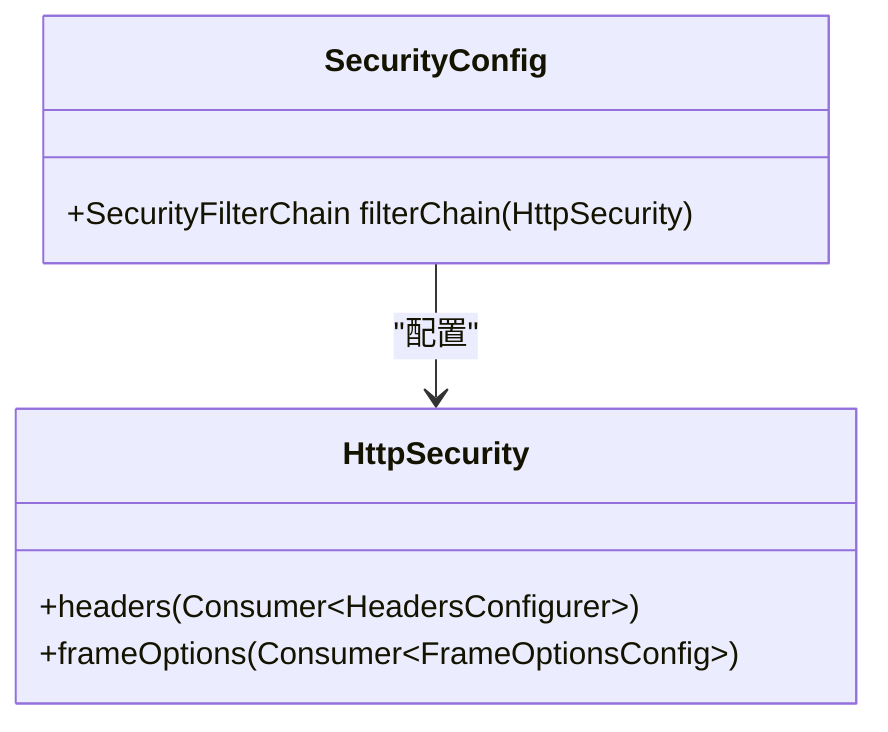
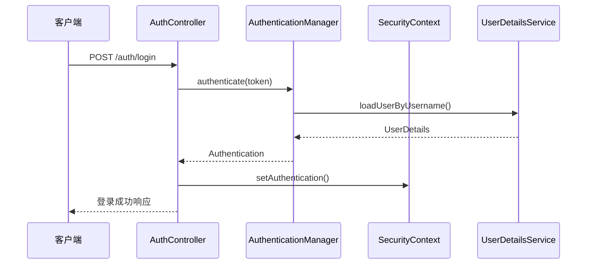
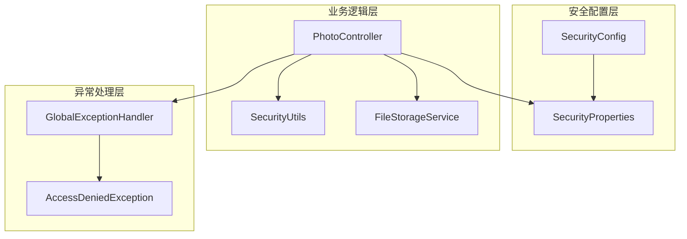

# 网络安全配置

<cite>
**本文档引用的文件**
- [SecurityConfig.java](file://src/main/java/com/photo/config/SecurityConfig.java)
- [SecurityProperties.java](file://src/main/java/com/photo/config/SecurityProperties.java)
- [application.yml](file://src/main/resources/application.yml)
- [SecurityUtils.java](file://src/main/java/com/photo/util/SecurityUtils.java)
- [PhotoController.java](file://src/main/java/com/photo/controller/PhotoController.java)
- [GlobalExceptionHandler.java](file://src/main/java/com/photo/exception/GlobalExceptionHandler.java)
- [AccessDeniedException.java](file://src/main/java/com/photo/exception/AccessDeniedException.java)
- [FileStorageService.java](file://src/main/java/com/photo/service/FileStorageService.java)
- [AuthController.java](file://src/main/java/com/photo/controller/AuthController.java)
- [LOGIN_GUIDE.md](file://LOGIN_GUIDE.md)
</cite>

## 目录
1. [简介](#简介)
2. [项目结构](#项目结构)
3. [核心组件](#核心组件)
4. [架构概览](#架构概览)
5. [详细组件分析](#详细组件分析)
6. [依赖关系分析](#依赖关系分析)
7. [性能考虑](#性能考虑)
8. [故障排除指南](#故障排除指南)
9. [结论](#结论)
10. [附录](#附录)

## 简介

本文件详细阐述了该照片上传系统的网络安全配置，重点关注以下方面：
- 跨域资源共享（CORS）的配置与管理
- 防盗链机制的实现原理与配置方法
- HTTP安全头部的配置
- API访问控制的实现
- 网络安全配置的最佳实践
- 常见网络攻击的防护策略

该系统基于Spring Boot构建，采用Spring Security进行安全控制，并提供了完整的安全配置示例。

## 项目结构

该项目采用标准的Spring Boot项目结构，安全相关的核心文件分布如下：

**图表来源**
- [SecurityConfig.java](file://src/main/java/com/photo/config/SecurityConfig.java#L1-L99)
- [SecurityProperties.java](file://src/main/java/com/photo/config/SecurityProperties.java#L1-L53)
- [application.yml](file://src/main/resources/application.yml#L119-L145)

**章节来源**
- [SecurityConfig.java](file://src/main/java/com/photo/config/SecurityConfig.java#L1-L99)
- [SecurityProperties.java](file://src/main/java/com/photo/config/SecurityProperties.java#L1-L53)
- [application.yml](file://src/main/resources/application.yml#L119-L145)

## 核心组件

### CORS配置组件

系统实现了灵活的CORS配置，支持动态配置和运行时调整：

**图表来源**
- [SecurityConfig.java](file://src/main/java/com/photo/config/SecurityConfig.java#L78-L92)
- [SecurityProperties.java](file://src/main/java/com/photo/config/SecurityProperties.java#L44-L51)

### 防盗链组件

防盗链机制通过Referer头验证和白名单管理实现：

**图表来源**
- [PhotoController.java](file://src/main/java/com/photo/controller/PhotoController.java#L92-L97)
- [SecurityUtils.java](file://src/main/java/com/photo/util/SecurityUtils.java#L62-L79)

**章节来源**
- [SecurityConfig.java](file://src/main/java/com/photo/config/SecurityConfig.java#L78-L92)
- [SecurityProperties.java](file://src/main/java/com/photo/config/SecurityProperties.java#L32-L51)
- [PhotoController.java](file://src/main/java/com/photo/controller/PhotoController.java#L92-L97)
- [SecurityUtils.java](file://src/main/java/com/photo/util/SecurityUtils.java#L62-L79)

## 架构概览

系统采用分层架构，安全控制贯穿各个层次：

**图表来源**
- [SecurityConfig.java](file://src/main/java/com/photo/config/SecurityConfig.java#L36-L58)
- [application.yml](file://src/main/resources/application.yml#L119-L145)

## 详细组件分析

### CORS配置详解

#### 配置结构

CORS配置采用嵌套配置类设计，支持细粒度控制：

| 配置项 | 类型 | 默认值 | 描述 |
|--------|------|--------|------|
| security.cors.enabled | Boolean | true | 是否启用CORS |
| security.cors.allowed-origins | List<String> | [] | 允许的源列表 |
| security.cors.allowed-methods | List<String> | GET,POST,PUT,DELETE | 允许的HTTP方法 |
| security.cors.allowed-headers | List<String> | "*" | 允许的请求头 |
| security.cors.allow-credentials | Boolean | true | 是否允许携带凭据 |

#### 运行时配置机制

**图表来源**
- [SecurityConfig.java](file://src/main/java/com/photo/config/SecurityConfig.java#L78-L92)
- [SecurityProperties.java](file://src/main/java/com/photo/config/SecurityProperties.java#L44-L51)

#### 配置最佳实践

1. **最小权限原则**：仅允许必要的源和方法
2. **动态配置**：通过配置文件实现运行时调整
3. **凭据处理**：谨慎使用`allowCredentials`
4. **安全头**：结合其他安全措施使用

**章节来源**
- [SecurityConfig.java](file://src/main/java/com/photo/config/SecurityConfig.java#L78-L92)
- [SecurityProperties.java](file://src/main/java/com/photo/config/SecurityProperties.java#L44-L51)
- [application.yml](file://src/main/resources/application.yml#L131-L144)

### 防盗链机制实现

#### Referer验证算法

防盗链机制通过以下步骤实现：

**图表来源**
- [SecurityUtils.java](file://src/main/java/com/photo/util/SecurityUtils.java#L62-L79)
- [PhotoController.java](file://src/main/java/com/photo/controller/PhotoController.java#L92-L97)

#### 白名单管理策略

| 配置项 | 类型 | 示例 | 用途 |
|--------|------|------|------|
| security.referer.enabled | Boolean | true/false | 启用/禁用防盗链 |
| security.referer.allowed-domains | List<String> | ["localhost","127.0.0.1"] | 允许的域名列表 |

#### 动态防盗链策略

系统支持多种防盗链策略：

1. **严格模式**：仅允许指定域名访问
2. **宽松模式**：允许Referer为空的访问
3. **混合模式**：结合多种验证规则

**章节来源**
- [SecurityUtils.java](file://src/main/java/com/photo/util/SecurityUtils.java#L62-L79)
- [PhotoController.java](file://src/main/java/com/photo/controller/PhotoController.java#L92-L97)
- [SecurityProperties.java](file://src/main/java/com/photo/config/SecurityProperties.java#L32-L36)
- [application.yml](file://src/main/resources/application.yml#L121-L126)

### HTTP安全头部配置

#### 当前实现状态

系统在安全配置中包含了基本的安全头部设置：

**图表来源**
- [SecurityConfig.java](file://src/main/java/com/photo/config/SecurityConfig.java#L55)

#### 建议的安全头部配置

| 头部名称 | 建议值 | 作用 |
|----------|--------|------|
| X-Frame-Options | DENY/SAMEORIGIN | 防止点击劫持 |
| X-Content-Type-Options | nosniff | 防止MIME类型嗅探 |
| X-XSS-Protection | 1; mode=block | 启用XSS过滤器 |
| Content-Security-Policy | default-src 'self' | 限制资源来源 |
| Strict-Transport-Security | max-age=31536000 | 强制HTTPS |

**章节来源**
- [SecurityConfig.java](file://src/main/java/com/photo/config/SecurityConfig.java#L55)

### API访问控制实现

#### 认证与授权机制

系统采用Spring Security实现完整的认证授权体系：

**图表来源**
- [AuthController.java](file://src/main/java/com/photo/controller/AuthController.java#L47-L80)

#### 当前访问控制策略

| 路径模式 | 权限要求 | 说明 |
|----------|----------|------|
| /auth/** | 允许匿名访问 | 登录、注册、注销接口 |
| /css/** | 允许匿名访问 | 静态资源 |
| /js/** | 允许匿名访问 | 静态资源 |
| /images/** | 允许匿名访问 | 静态资源 |
| /blog/public/** | 允许匿名访问 | 公开博客内容 |
| / | 允许匿名访问 | 首页 |
| /dashboard | 允许匿名访问 | 仪表板 |
| 其他所有请求 | 需要认证 | 受保护的API |

**章节来源**
- [SecurityConfig.java](file://src/main/java/com/photo/config/SecurityConfig.java#L41-L43)
- [AuthController.java](file://src/main/java/com/photo/controller/AuthController.java#L47-L80)

## 依赖关系分析

### 安全配置依赖图

**图表来源**
- [SecurityConfig.java](file://src/main/java/com/photo/config/SecurityConfig.java#L30-L34)
- [PhotoController.java](file://src/main/java/com/photo/controller/PhotoController.java#L3-L43)

### 关键依赖关系

1. **配置依赖**：SecurityConfig依赖SecurityProperties进行运行时配置
2. **业务依赖**：PhotoController依赖SecurityUtils进行安全验证
3. **异常依赖**：全局异常处理器统一处理各种安全异常

**章节来源**
- [SecurityConfig.java](file://src/main/java/com/photo/config/SecurityConfig.java#L30-L34)
- [PhotoController.java](file://src/main/java/com/photo/controller/PhotoController.java#L3-L43)
- [GlobalExceptionHandler.java](file://src/main/java/com/photo/exception/GlobalExceptionHandler.java#L80-L87)

## 性能考虑

### CORS性能优化

1. **配置缓存**：CORS配置在应用启动时加载，避免运行时重复计算
2. **最小化配置**：仅配置必要的源和方法，减少跨域检查开销
3. **静态配置**：生产环境建议使用静态CORS配置而非动态更新

### 防盗链性能影响

1. **轻量级检查**：Referer验证仅涉及字符串匹配，性能开销很小
2. **缓存策略**：可考虑缓存白名单列表以提高匹配效率
3. **条件检查**：仅对需要防盗链的资源执行验证

### 安全中间件性能

1. **按需加载**：安全配置按需加载，避免不必要的安全检查
2. **异步处理**：对于耗时的安全操作可考虑异步处理
3. **连接池优化**：合理配置Tomcat连接池参数

## 故障排除指南

### 常见安全配置问题

#### CORS相关问题

**问题1：浏览器报CORS错误**
- 检查allowed-origins配置是否包含客户端域名
- 确认allowCredentials设置是否正确
- 验证预检请求是否被正确处理

**问题2：凭据传递失败**
- 确认客户端设置了withCredentials
- 检查allowed-origins是否使用具体域名而非通配符
- 验证CORS配置的allowCredentials设置

#### 防盗链相关问题

**问题3：合法访问被拒绝**
- 检查Referer头是否正确传递
- 验证allowed-domains配置是否包含当前域名
- 确认防盗链功能是否正确启用

**问题4：直接访问被允许**
- 检查Referer头是否为空
- 验证防盗链配置的默认行为
- 确认业务逻辑中的防盗链检查是否执行

#### 认证授权问题

**问题5：登录失败**
- 检查用户名密码是否正确
- 验证UserDetailsService实现
- 确认BCrypt密码编码器配置

**问题6：权限不足**
- 检查用户角色和权限配置
- 验证URL模式匹配规则
- 确认SecurityContext是否正确设置

### 调试技巧

1. **启用详细日志**：在application.yml中调整日志级别
2. **使用调试工具**：利用浏览器开发者工具检查请求头
3. **单元测试**：编写针对安全功能的单元测试

**章节来源**
- [GlobalExceptionHandler.java](file://src/main/java/com/photo/exception/GlobalExceptionHandler.java#L80-L87)
- [SecurityUtils.java](file://src/main/java/com/photo/util/SecurityUtils.java#L77-L78)

## 结论

该照片上传系统实现了较为完善的网络安全配置，主要特点包括：

1. **灵活的CORS配置**：支持动态配置和运行时调整
2. **有效的防盗链机制**：通过Referer头验证和白名单管理
3. **基础的认证授权**：基于Spring Security的完整认证体系
4. **统一的异常处理**：集中处理各类安全相关的异常

**建议改进方向**：
1. 实现更完善的安全头部配置
2. 添加IP白名单和速率限制功能
3. 增强日志审计和监控能力
4. 考虑引入更高级的安全防护措施

## 附录

### 安全配置最佳实践清单

#### 生产环境加固建议

1. **CORS配置**
   - 使用具体域名而非通配符
   - 禁用不必要的HTTP方法
   - 谨慎使用allowCredentials

2. **防盗链配置**
   - 启用严格的域名白名单
   - 记录所有非法访问尝试
   - 定期审查访问日志

3. **认证安全**
   - 使用强密码策略
   - 实施账户锁定机制
   - 启用双因素认证

4. **日志审计**
   - 记录所有安全相关事件
   - 定期审查安全日志
   - 实施日志轮转和保留策略

#### SSL/TLS配置建议

1. **证书管理**
   - 使用受信任的CA签发证书
   - 定期更新证书
   - 实施证书自动续期

2. **协议版本**
   - 禁用过时的TLS版本
   - 使用最新的加密套件
   - 启用HSTS头

#### 安全审计日志

1. **日志内容**
   - 认证和授权事件
   - 安全配置变更
   - 异常和错误事件
   - 用户操作审计

2. **日志管理**
   - 实施日志轮转
   - 设置适当的保留期限
   - 建立日志分析机制