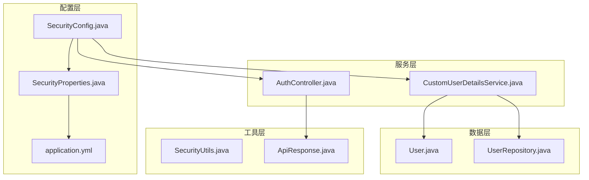
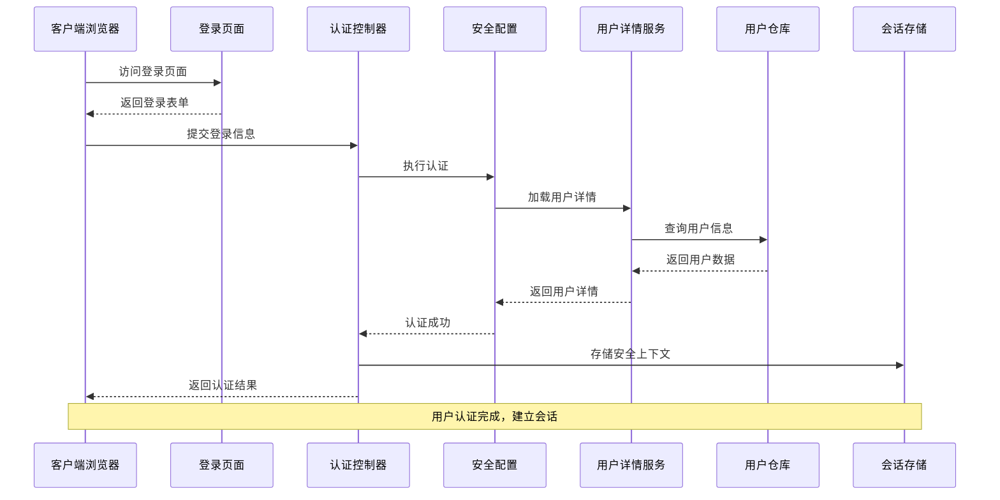
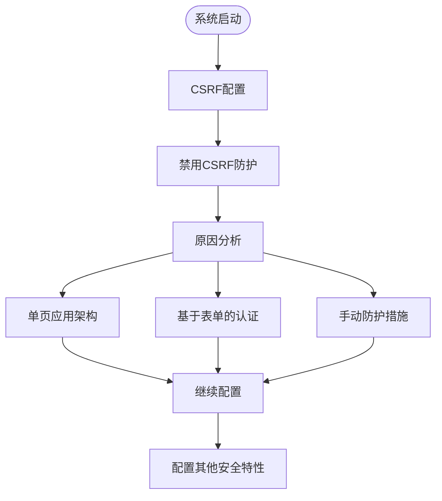
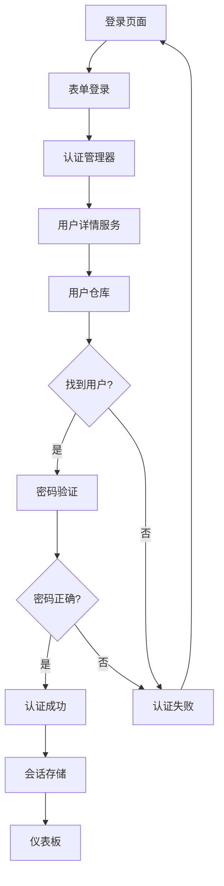
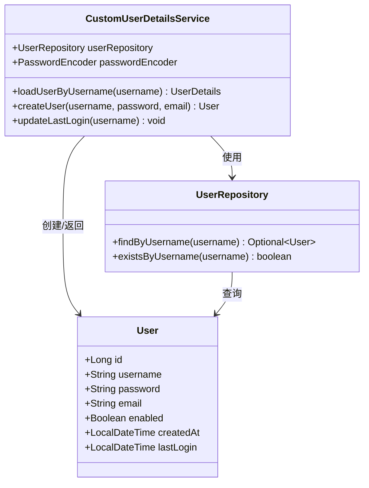
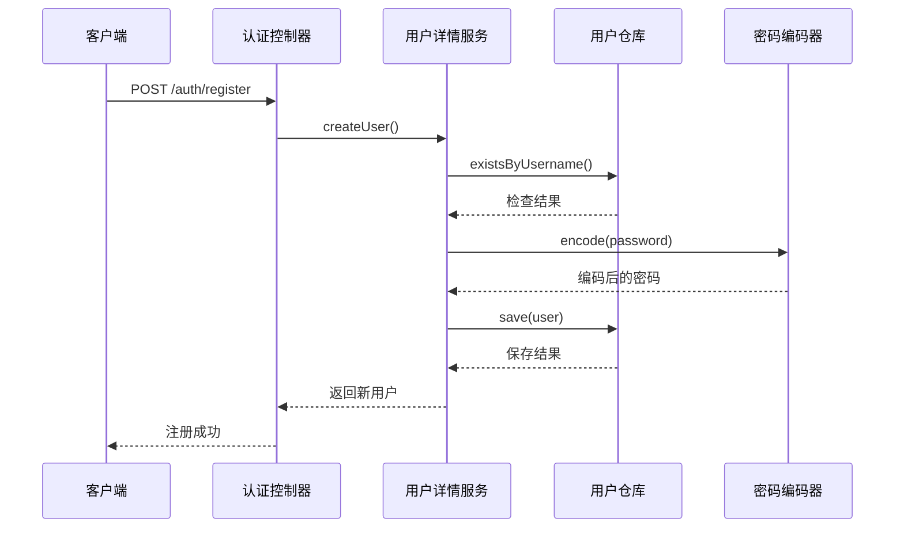
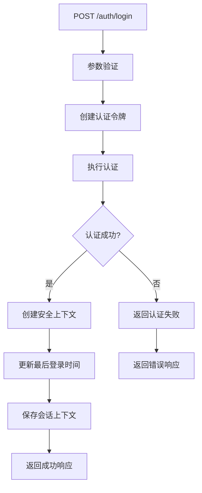
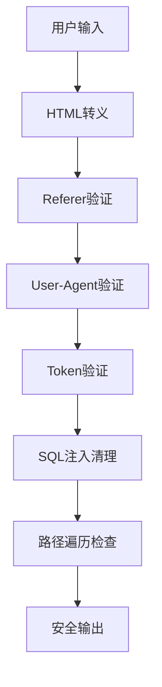
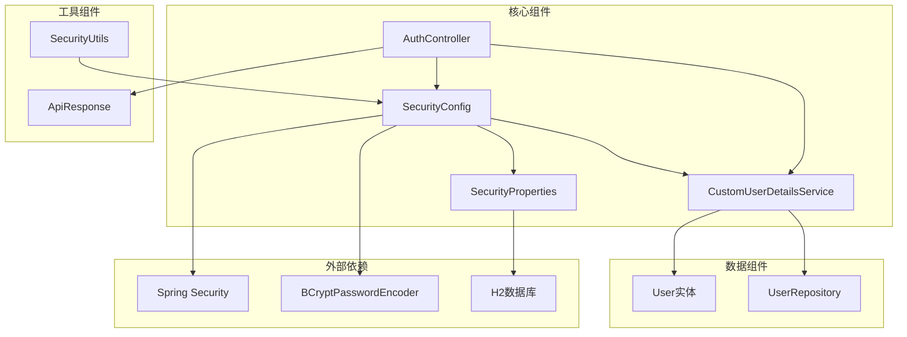

# 认证与授权机制

<cite>
**本文档引用的文件**
- [SecurityConfig.java](file://src/main/java/com/photo/config/SecurityConfig.java)
- [CustomUserDetailsService.java](file://src/main/java/com/photo/service/CustomUserDetailsService.java)
- [AuthController.java](file://src/main/java/com/photo/controller/AuthController.java)
- [application.yml](file://src/main/resources/application.yml)
- [SecurityProperties.java](file://src/main/java/com/photo/config/SecurityProperties.java)
- [User.java](file://src/main/java/com/photo/entity/User.java)
- [login.html](file://src/main/resources/templates/login.html)
- [UserRepository.java](file://src/main/java/com/photo/repository/UserRepository.java)
- [SecurityUtils.java](file://src/main/java/com/photo/util/SecurityUtils.java)
- [ApiResponse.java](file://src/main/java/com/photo/dto/ApiResponse.java)
- [PhotoUploadApplication.java](file://src/main/java/com/photo/PhotoUploadApplication.java)
</cite>

## 目录
1. [简介](#简介)
2. [项目结构](#项目结构)
3. [核心组件](#核心组件)
4. [架构概览](#架构概览)
5. [详细组件分析](#详细组件分析)
6. [依赖关系分析](#依赖关系分析)
7. [性能考虑](#性能考虑)
8. [故障排除指南](#故障排除指南)
9. [结论](#结论)

## 简介

本系统采用Spring Security实现完整的认证与授权机制，为照片上传系统提供安全保护。系统实现了基于表单的登录认证、自定义用户详情服务、密码编码器配置、URL级别访问控制、会话管理和跨域资源共享(CORS)等功能。

## 项目结构

系统采用标准的Spring Boot分层架构，安全相关的核心文件分布如下：

**图表来源**
- [SecurityConfig.java](file://src/main/java/com/photo/config/SecurityConfig.java#L26-L98)
- [CustomUserDetailsService.java](file://src/main/java/com/photo/service/CustomUserDetailsService.java#L18-L70)
- [application.yml](file://src/main/resources/application.yml#L119-L145)

**章节来源**
- [SecurityConfig.java](file://src/main/java/com/photo/config/SecurityConfig.java#L1-L99)
- [application.yml](file://src/main/resources/application.yml#L1-L190)

## 核心组件

### 安全配置核心组件

系统通过以下核心组件实现完整的安全机制：

1. **SecurityConfig**: 主要的安全配置类，负责HTTP安全策略、认证提供者、密码编码器等
2. **CustomUserDetailsService**: 自定义用户详情服务，实现用户认证逻辑
3. **AuthController**: 认证控制器，处理登录、注册、注销请求
4. **SecurityProperties**: 安全配置属性类，支持YAML配置文件
5. **SecurityUtils**: 安全工具类，提供XSS防护、CSRF防护等安全功能

**章节来源**
- [SecurityConfig.java](file://src/main/java/com/photo/config/SecurityConfig.java#L26-L98)
- [CustomUserDetailsService.java](file://src/main/java/com/photo/service/CustomUserDetailsService.java#L18-L70)
- [AuthController.java](file://src/main/java/com/photo/controller/AuthController.java#L23-L111)

## 架构概览

系统采用基于Session的认证架构，结合Spring Security的声明式安全控制：

**图表来源**
- [AuthController.java](file://src/main/java/com/photo/controller/AuthController.java#L47-L80)
- [SecurityConfig.java](file://src/main/java/com/photo/config/SecurityConfig.java#L37-L58)
- [CustomUserDetailsService.java](file://src/main/java/com/photo/service/CustomUserDetailsService.java#L27-L41)

## 详细组件分析

### 安全配置类分析

SecurityConfig是系统安全机制的核心配置类，实现了完整的Spring Security配置：

#### CSRF防护配置

系统采用禁用CSRF防护的策略：

**图表来源**
- [SecurityConfig.java](file://src/main/java/com/photo/config/SecurityConfig.java#L39-L39)

#### URL访问控制策略

系统实现了精细的URL级别访问控制：

| URL模式 | 权限要求 | 描述 |
|---------|----------|------|
| `/auth/**` | 无限制 | 认证相关接口 |
| `/css/**` | 无限制 | 静态资源 |
| `/js/**` | 无限制 | JavaScript文件 |
| `/images/**` | 无限制 | 图片资源 |
| `/blog/public/**` | 无限制 | 博客公开内容 |
| `/` | 无限制 | 首页 |
| `/dashboard` | 无限制 | 仪表板 |
| 其他所有请求 | 已认证用户 | 需要登录 |

#### 认证流程配置

**图表来源**
- [SecurityConfig.java](file://src/main/java/com/photo/config/SecurityConfig.java#L41-L54)
- [AuthController.java](file://src/main/java/com/photo/controller/AuthController.java#L47-L80)

**章节来源**
- [SecurityConfig.java](file://src/main/java/com/photo/config/SecurityConfig.java#L36-L58)

### 自定义用户详情服务

CustomUserDetailsService实现了Spring Security的UserDetailsService接口，提供了完整的用户认证逻辑：

#### 用户加载机制

**图表来源**
- [CustomUserDetailsService.java](file://src/main/java/com/photo/service/CustomUserDetailsService.java#L18-L70)
- [UserRepository.java](file://src/main/java/com/photo/repository/UserRepository.java#L12-L25)

#### 用户创建流程

**图表来源**
- [AuthController.java](file://src/main/java/com/photo/controller/AuthController.java#L95-L109)
- [CustomUserDetailsService.java](file://src/main/java/com/photo/service/CustomUserDetailsService.java#L46-L58)

**章节来源**
- [CustomUserDetailsService.java](file://src/main/java/com/photo/service/CustomUserDetailsService.java#L18-L70)

### 认证控制器

AuthController处理所有认证相关的HTTP请求，实现了完整的认证生命周期管理：

#### 登录处理流程

**图表来源**
- [AuthController.java](file://src/main/java/com/photo/controller/AuthController.java#L47-L80)

#### 登录成功后的处理

系统在用户登录成功后执行以下操作：
1. 创建新的安全上下文
2. 设置认证信息
3. 将上下文保存到会话存储
4. 更新用户的最后登录时间
5. 返回JSON格式的成功响应

**章节来源**
- [AuthController.java](file://src/main/java/com/photo/controller/AuthController.java#L23-L111)

### 安全配置属性

SecurityProperties类提供了灵活的安全配置选项，支持从YAML配置文件动态加载：

#### 配置项说明

| 配置项 | 类型 | 默认值 | 描述 |
|--------|------|--------|------|
| security.cors.enabled | Boolean | true | 是否启用CORS |
| security.cors.allowed-origins | List<String> | [localhost:3000, localhost:8080] | 允许的域名 |
| security.cors.allowed-methods | List<String> | [GET, POST, PUT, DELETE] | 允许的HTTP方法 |
| security.cors.allowed-headers | List<String> | ["*"] | 允许的请求头 |
| security.cors.allow-credentials | Boolean | true | 是否允许携带凭证 |

**章节来源**
- [SecurityProperties.java](file://src/main/java/com/photo/config/SecurityProperties.java#L14-L52)
- [application.yml](file://src/main/resources/application.yml#L132-L144)

### 安全工具类

SecurityUtils提供了多种安全防护功能，增强了系统的整体安全性：

#### XSS防护机制

系统实现了多层次的XSS防护：

**图表来源**
- [SecurityUtils.java](file://src/main/java/com/photo/util/SecurityUtils.java#L18-L147)

**章节来源**
- [SecurityUtils.java](file://src/main/java/com/photo/util/SecurityUtils.java#L14-L167)

## 依赖关系分析

系统各组件之间的依赖关系如下：

**图表来源**
- [SecurityConfig.java](file://src/main/java/com/photo/config/SecurityConfig.java#L3-L34)
- [CustomUserDetailsService.java](file://src/main/java/com/photo/service/CustomUserDetailsService.java#L3-L25)

**章节来源**
- [SecurityConfig.java](file://src/main/java/com/photo/config/SecurityConfig.java#L1-L99)
- [CustomUserDetailsService.java](file://src/main/java/com/photo/service/CustomUserDetailsService.java#L1-L70)

## 性能考虑

### 密码编码器性能

系统使用BCryptPasswordEncoder进行密码编码，具有以下特点：
- **安全性高**: 采用BCrypt算法，抗彩虹表攻击
- **性能平衡**: 编码成本适中，既保证安全又不影响用户体验
- **不可逆性**: 密码无法被解码，只能通过比较验证

### 会话管理优化

系统采用HttpSessionSecurityContextRepository进行会话管理：
- **内存存储**: 使用HTTP会话存储安全上下文
- **自动过期**: 依赖Tomcat会话超时机制
- **轻量级**: 不引入额外的数据库依赖

### CORS配置优化

CORS配置支持动态启用/禁用，可根据部署环境调整：
- **开发环境**: 允许本地开发服务器访问
- **生产环境**: 可以限制到特定域名
- **灵活性**: 支持自定义允许的方法和头部

## 故障排除指南

### 常见认证问题

#### 用户名或密码错误

**症状**: 登录请求返回401状态码
**原因**: 用户名不存在或密码不匹配
**解决方案**: 
1. 检查用户名拼写
2. 确认密码正确性
3. 验证用户是否被禁用

#### 用户被禁用

**症状**: 认证时抛出UsernameNotFoundException
**原因**: 用户的enabled字段为false
**解决方案**: 
1. 检查用户状态
2. 联系管理员启用账户

#### 会话丢失

**症状**: 登录后页面跳转但未保持登录状态
**原因**: 会话存储配置问题
**解决方案**: 
1. 检查Cookie设置
2. 验证CORS配置
3. 确认浏览器Cookie设置

### CSRF相关问题

**注意**: 系统当前禁用了CSRF防护，这在某些场景下可能带来安全风险。

**替代方案建议**:
1. **JWT令牌**: 实现无状态认证
2. **手动CSRF令牌**: 在表单中添加CSRF令牌
3. **SameSite Cookie**: 配置Cookie SameSite属性

**章节来源**
- [AuthController.java](file://src/main/java/com/photo/controller/AuthController.java#L77-L79)
- [CustomUserDetailsService.java](file://src/main/java/com/photo/service/CustomUserDetailsService.java#L32-L34)

## 结论

本系统实现了完整的认证与授权机制，具有以下特点：

### 安全特性
- **多层防护**: 包含XSS、SQL注入、路径遍历等多种防护
- **密码安全**: 使用BCrypt进行密码编码
- **会话管理**: 基于HTTP Session的安全上下文存储
- **CORS配置**: 灵活的跨域资源共享策略

### 架构优势
- **模块化设计**: 安全配置清晰分离
- **可扩展性**: 支持自定义用户详情服务
- **配置灵活**: 支持YAML配置文件动态调整
- **前端友好**: 提供现代化的登录界面

### 改进建议
1. **增强权限管理**: 实现基于角色的细粒度权限控制
2. **添加审计日志**: 记录重要的安全事件
3. **实施速率限制**: 防止暴力破解攻击
4. **集成JWT**: 提供无状态认证选项
5. **添加验证码**: 防止自动化攻击

系统为照片上传业务提供了坚实的安全基础，可以根据具体需求进一步增强安全防护能力。