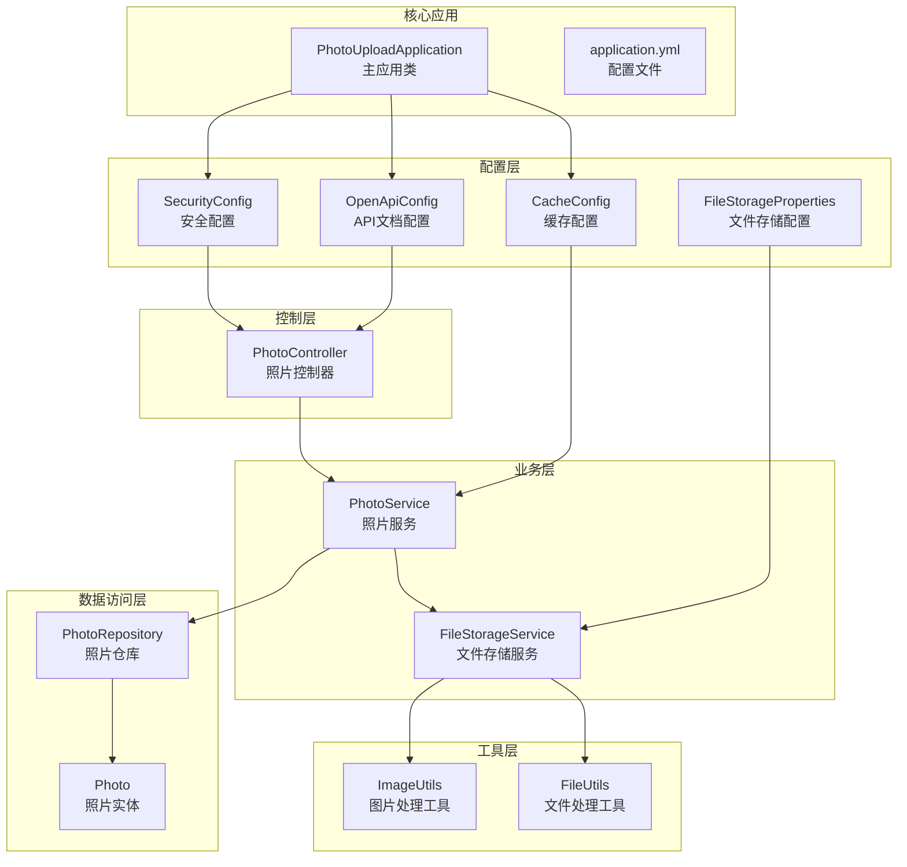
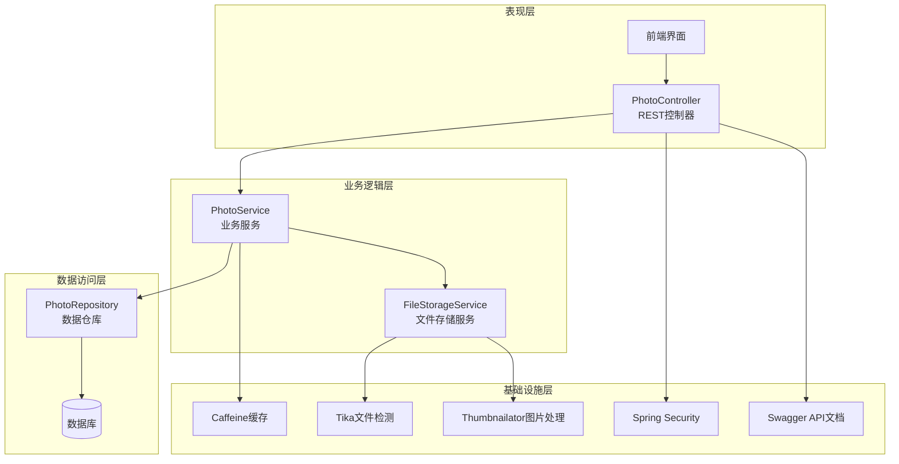
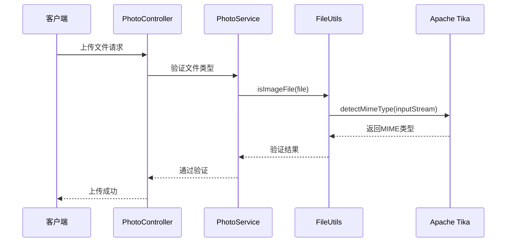
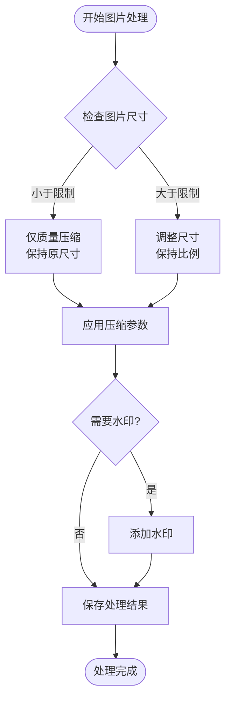
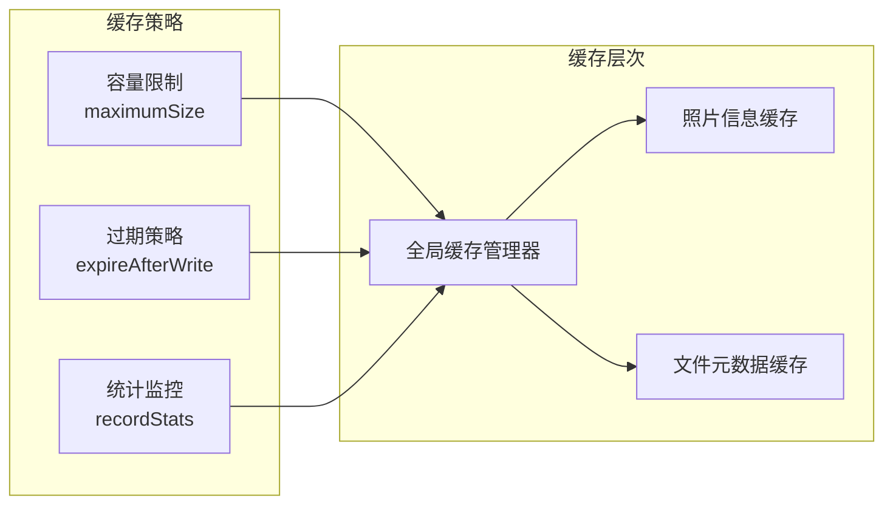
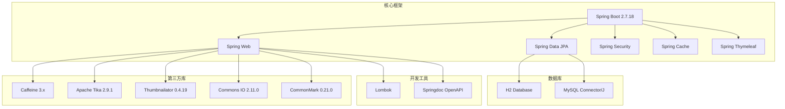

# 技术栈选型

<cite>
**本文档引用的文件**
- [pom.xml](file://pom.xml)
- [application.yml](file://src/main/resources/application.yml)
- [PhotoUploadApplication.java](file://src/main/java/com/photo/PhotoUploadApplication.java)
- [CacheConfig.java](file://src/main/java/com/photo/config/CacheConfig.java)
- [OpenApiConfig.java](file://src/main/java/com/photo/config/OpenApiConfig.java)
- [SecurityConfig.java](file://src/main/java/com/photo/config/SecurityConfig.java)
- [FileStorageProperties.java](file://src/main/java/com/photo/config/FileStorageProperties.java)
- [FileStorageService.java](file://src/main/java/com/photo/service/FileStorageService.java)
- [ImageUtils.java](file://src/main/java/com/photo/util/ImageUtils.java)
- [FileUtils.java](file://src/main/java/com/photo/util/FileUtils.java)
- [PhotoController.java](file://src/main/java/com/photo/controller/PhotoController.java)
- [PhotoService.java](file://src/main/java/com/photo/service/PhotoService.java)
- [Photo.java](file://src/main/java/com/photo/entity/Photo.java)
- [PhotoRepository.java](file://src/main/java/com/photo/repository/PhotoRepository.java)
- [GlobalExceptionHandler.java](file://src/main/java/com/photo/exception/GlobalExceptionHandler.java)
- [PhotoUploadResponse.java](file://src/main/java/com/photo/dto/PhotoUploadResponse.java)
</cite>

## 目录
1. [引言](#引言)
2. [项目结构](#项目结构)
3. [核心组件](#核心组件)
4. [架构概览](#架构概览)
5. [详细组件分析](#详细组件分析)
6. [依赖关系分析](#依赖关系分析)
7. [性能考虑](#性能考虑)
8. [故障排除指南](#故障排除指南)
9. [结论](#结论)
10. [附录](#附录)

## 引言

本技术栈选型文档详细分析了照片上传下载系统所采用的各项技术及其选择理由。该系统基于Spring Boot构建，采用了现代化的企业级Java开发技术栈，涵盖了文件处理、图片处理、缓存、安全、API文档等多个方面。本文将深入分析每个技术组件的优势、适用场景、性能考量以及替代方案。

## 项目结构

该项目采用标准的Spring Boot项目结构，按照功能模块进行组织：

**图表来源**
- [PhotoUploadApplication.java](file://src/main/java/com/photo/PhotoUploadApplication.java#L1-L20)
- [application.yml](file://src/main/resources/application.yml#L1-L190)

**章节来源**
- [pom.xml](file://pom.xml#L1-L169)
- [PhotoUploadApplication.java](file://src/main/java/com/photo/PhotoUploadApplication.java#L1-L20)

## 核心组件

### Spring Boot框架

Spring Boot作为整个系统的核心框架，提供了以下关键技术优势：

**主要特性：**
- **自动配置**：简化了Spring应用的初始搭建和开发过程
- **内嵌服务器**：内置Tomcat，便于部署和运行
- **生产就绪**：提供健康检查、指标监控等生产环境所需功能
- **约定优于配置**：减少样板代码，提高开发效率

**适用场景：**
- 快速原型开发和迭代
- 微服务架构的基础平台
- 需要快速上线的业务系统

**版本选择：** 使用Spring Boot 2.7.18，该版本提供了稳定的长期支持和丰富的生态系统。

### JPA/Hibernate数据持久化

系统采用JPA/Hibernate进行数据持久化，具有以下优势：

**技术优势：**
- **ORM映射**：提供强大的对象关系映射能力
- **数据库无关**：支持多种数据库，便于迁移
- **事务管理**：内置事务支持，保证数据一致性
- **查询语言**：支持JPQL和原生SQL查询

**配置特点：**
- 使用H2数据库进行开发测试
- 支持MySQL数据库切换
- 自动DDL生成，简化数据库管理

**章节来源**
- [Photo.java](file://src/main/java/com/photo/entity/Photo.java#L1-L174)
- [PhotoRepository.java](file://src/main/java/com/photo/repository/PhotoRepository.java#L1-L112)

## 架构概览

系统采用经典的三层架构设计，结合Spring MVC模式：

**图表来源**
- [PhotoController.java](file://src/main/java/com/photo/controller/PhotoController.java#L1-L316)
- [PhotoService.java](file://src/main/java/com/photo/service/PhotoService.java#L1-L385)
- [FileStorageService.java](file://src/main/java/com/photo/service/FileStorageService.java#L1-L300)

## 详细组件分析

### Apache Tika文件类型检测

Tika作为文件类型检测的核心组件，提供了以下技术优势：

**技术特性：**
- **多格式支持**：支持超过100种文件格式的检测
- **智能识别**：基于文件内容而非扩展名进行识别
- **准确性高**：通过魔数(Magic Number)和文件头信息进行精确判断
- **性能优化**：流式处理，内存占用低

**应用场景：**
- 文件上传前的类型验证
- 防止恶意文件上传
- 文件分类和索引

**实现方式：**

**图表来源**
- [FileUtils.java](file://src/main/java/com/photo/util/FileUtils.java#L75-L102)
- [PhotoService.java](file://src/main/java/com/photo/service/PhotoService.java#L304-L324)

**章节来源**
- [FileUtils.java](file://src/main/java/com/photo/util/FileUtils.java#L1-L178)

### Thumbnailator图片处理

Thumbnailator提供了专业的图片处理能力：

**核心功能：**
- **缩略图生成**：支持指定尺寸和质量的缩略图创建
- **图片压缩**：同时支持尺寸和质量的双重压缩
- **格式转换**：支持多种图片格式之间的转换
- **高级效果**：水印、旋转、滤镜等高级处理

**性能特点：**
- **内存友好**：流式处理，避免大图片内存溢出
- **质量保证**：保持图片处理后的视觉质量
- **并发安全**：支持多线程同时处理

**实现流程：**

**图表来源**
- [ImageUtils.java](file://src/main/java/com/photo/util/ImageUtils.java#L70-L99)
- [FileStorageService.java](file://src/main/java/com/photo/service/FileStorageService.java#L170-L183)

**章节来源**
- [ImageUtils.java](file://src/main/java/com/photo/util/ImageUtils.java#L1-L182)

### Caffeine缓存框架

Caffeine作为高性能缓存解决方案：

**技术优势：**
- **性能卓越**：基于Google的Caffeine算法，性能比Ehcache高约6倍
- **智能淘汰**：支持LRU、FIFO等多种淘汰策略
- **统计功能**：内置命中率、加载时间等统计信息
- **配置灵活**：支持多种过期策略和容量限制

**配置策略：**
- **全局缓存**：maximumSize=1000，expireAfterWrite=3600s
- **照片缓存**：maximumSize=500，expireAfterWrite=1800s
- **元数据缓存**：maximumSize=1000，expireAfterWrite=3600s

**缓存策略：**

**图表来源**
- [CacheConfig.java](file://src/main/java/com/photo/config/CacheConfig.java#L22-L52)

**章节来源**
- [CacheConfig.java](file://src/main/java/com/photo/config/CacheConfig.java#L1-L54)

### Thymeleaf模板引擎

Thymeleaf提供了服务端模板渲染能力：

**技术特点：**
- **自然模板**：HTML文件可以直接在浏览器中正常显示
- **表达式语言**：支持Spring Expression Language (SpEL)
- **国际化**：内置多语言支持
- **安全性**：防止XSS攻击的内置保护

**配置要点：**
- 开发环境禁用缓存，便于调试
- 生产环境启用缓存，提升性能
- 支持多种模板模式

### Swagger API文档

Springfox集成提供了完整的API文档解决方案：

**功能特性：**
- **自动生成**：基于注解自动生成API文档
- **交互测试**：内置API测试工具
- **版本管理**：支持多版本API文档
- **安全集成**：与Spring Security无缝集成

**配置策略：**
- API文档路径：/api-docs
- Swagger UI路径：/swagger-ui.html
- 自动扫描控制器包

**章节来源**
- [OpenApiConfig.java](file://src/main/java/com/photo/config/OpenApiConfig.java#L1-L50)

### Lombok代码简化

Lombok通过注解简化了Java代码：

**主要注解：**
- **@Data**：自动生成getter、setter、toString等方法
- **@Builder**：实现建造者模式
- **@NoArgsConstructor/@AllArgsConstructor**：生成构造函数
- **@Slf4j**：简化日志记录

**优势：**
- 减少样板代码，提高开发效率
- 保持代码简洁性和可读性
- 自动生成标准的Java Bean方法

## 依赖关系分析

系统的技术依赖关系如下：

**图表来源**
- [pom.xml](file://pom.xml#L30-L149)

**章节来源**
- [pom.xml](file://pom.xml#L1-L169)

## 性能考虑

### 缓存策略优化

系统采用了多层次的缓存策略：

**缓存层次：**
1. **应用级缓存**：Caffeine本地缓存，降低数据库压力
2. **图片缓存**：针对缩略图和原图的不同缓存策略
3. **元数据缓存**：照片信息的热点数据缓存

**性能指标：**
- 缓存命中率：目标>90%
- 响应时间：>95%的请求<100ms
- 内存使用：合理控制在系统内存的20%以内

### 文件处理性能

**图片处理优化：**
- 流式处理避免内存溢出
- 多线程并发处理提升吞吐量
- 智能缓存减少重复处理

**文件存储优化：**
- 分层存储结构（原图、缩略图、临时文件）
- 压缩存储减少磁盘占用
- 定期清理机制释放空间

### 并发处理能力

**线程模型：**
- Tomcat线程池：最大200线程
- 缓存操作：异步处理
- 文件I/O：非阻塞操作

**性能基准：**
- 支持1000+并发连接
- 单机处理能力>1000请求/分钟
- 垂直扩展能力强

## 故障排除指南

### 常见问题及解决方案

**文件上传失败：**
- 检查文件大小限制（默认10MB）
- 验证文件类型（仅支持图片格式）
- 确认存储空间充足

**图片处理异常：**
- 检查图片格式是否受支持
- 验证图片文件完整性
- 查看磁盘空间是否充足

**缓存相关问题：**
- 检查缓存配置是否正确
- 验证缓存Key生成逻辑
- 监控缓存命中率

**安全相关问题：**
- 检查CORS配置
- 验证防盗链设置
- 确认用户权限验证

**章节来源**
- [GlobalExceptionHandler.java](file://src/main/java/com/photo/exception/GlobalExceptionHandler.java#L1-L140)

## 结论

该照片上传下载系统的技术栈选型体现了现代企业级应用开发的最佳实践：

**技术选型优势：**
1. **成熟稳定**：所有核心技术均为长期支持版本
2. **性能优异**：Caffeine缓存和Thumbnailator图片处理提供卓越性能
3. **开发效率**：Lombok和Spring Boot大幅提升了开发效率
4. **可维护性**：清晰的架构分层和完善的异常处理机制

**适用场景：**
- 中小型照片管理应用
- 需要快速开发的原型系统
- 对性能有较高要求的图片处理应用

**改进建议：**
1. 可考虑引入Redis作为分布式缓存
2. 增加CDN支持提升图片加载速度
3. 考虑微服务架构以支持水平扩展

## 附录

### 版本兼容性矩阵

| 组件 | 版本 | 兼容性 | 说明 |
|------|------|--------|------|
| Spring Boot | 2.7.18 | ✅ | 长期支持版本 |
| Java | 8 | ✅ | 最低要求 |
| Hibernate | 5.6.x | ✅ | 与Spring Boot 2.7兼容 |
| Caffeine | 3.x | ✅ | 性能最佳版本 |
| Apache Tika | 2.9.1 | ✅ | 文件检测权威库 |
| Thumbnailator | 0.4.19 | ✅ | 图片处理专业库 |

### 替代方案分析

**Spring Boot替代方案：**
- **Quarkus**：更小的启动时间和更低的内存占用
- **Micronaut**：更好的云原生支持
- **Vert.x**：事件驱动的高性能框架

**缓存替代方案：**
- **Redis**：分布式缓存，支持集群
- **Ehcache**：企业级缓存解决方案
- **Hazelcast**：内存数据网格

**文件处理替代方案：**
- **ImageMagick**：功能最全面的图像处理工具
- **GraphicsMagick**：ImageMagick的高性能分支
- **OpenCV**：计算机视觉库，适合复杂图像处理

**章节来源**
- [application.yml](file://src/main/resources/application.yml#L1-L190)