# 整体架构概览

<cite>
**本文档引用的文件**
- [PhotoUploadApplication.java](file://src/main/java/com/photo/PhotoUploadApplication.java)
- [pom.xml](file://pom.xml)
- [application.yml](file://src/main/resources/application.yml)
- [README.md](file://README.md)
- [SecurityConfig.java](file://src/main/java/com/photo/config/SecurityConfig.java)
- [FileStorageProperties.java](file://src/main/java/com/photo/config/FileStorageProperties.java)
- [CacheConfig.java](file://src/main/java/com/photo/config/CacheConfig.java)
- [OpenApiConfig.java](file://src/main/java/com/photo/config/OpenApiConfig.java)
- [FileStorageService.java](file://src/main/java/com/photo/service/FileStorageService.java)
- [PhotoController.java](file://src/main/java/com/photo/controller/PhotoController.java)
- [Photo.java](file://src/main/java/com/photo/entity/Photo.java)
- [PhotoRepository.java](file://src/main/java/com/photo/repository/PhotoRepository.java)
- [PhotoService.java](file://src/main/java/com/photo/service/PhotoService.java)
- [FileUtils.java](file://src/main/java/com/photo/util/FileUtils.java)
- [ImageUtils.java](file://src/main/java/com/photo/util/ImageUtils.java)
- [GlobalExceptionHandler.java](file://src/main/java/com/photo/exception/GlobalExceptionHandler.java)
- [SecurityProperties.java](file://src/main/java/com/photo/config/SecurityProperties.java)
- [SecurityUtils.java](file://src/main/java/com/photo/util/SecurityUtils.java)
</cite>

## 目录
1. [引言](#引言)
2. [项目结构](#项目结构)
3. [核心组件](#核心组件)
4. [架构总览](#架构总览)
5. [详细组件分析](#详细组件分析)
6. [依赖关系分析](#依赖关系分析)
7. [性能考量](#性能考量)
8. [故障排除指南](#故障排除指南)
9. [结论](#结论)

## 引言
本项目是一个基于Spring Boot的企业级照片上传下载系统，提供完整的文件管理能力，包括上传、下载、在线预览、断点续传、缩略图生成、图片压缩、缓存、安全防护等特性。系统采用分层架构设计，结合Spring Data JPA进行数据持久化，使用Caffeine缓存提升性能，并通过Spring Security提供安全控制。

## 项目结构
系统采用标准的Spring Boot项目结构，按照功能模块进行组织：

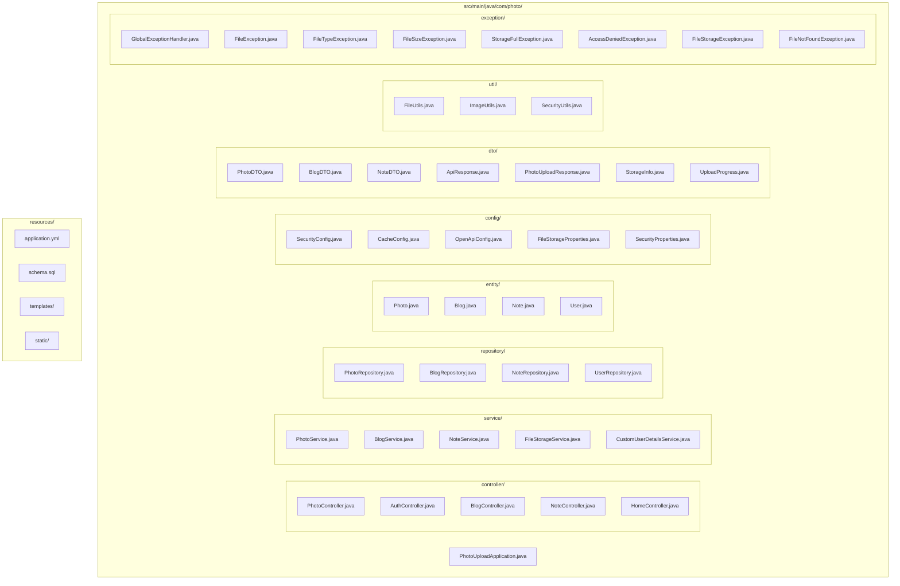

**图表来源**
- [PhotoUploadApplication.java](file://src/main/java/com/photo/PhotoUploadApplication.java#L1-L20)
- [PhotoController.java](file://src/main/java/com/photo/controller/PhotoController.java#L1-L316)
- [PhotoService.java](file://src/main/java/com/photo/service/PhotoService.java#L1-L385)
- [FileStorageService.java](file://src/main/java/com/photo/service/FileStorageService.java#L1-L300)

**章节来源**
- [README.md](file://README.md#L214-L252)
- [PhotoUploadApplication.java](file://src/main/java/com/photo/PhotoUploadApplication.java#L1-L20)

## 核心组件
系统的核心组件包括主应用类、控制器层、服务层、数据访问层、配置层和工具类层。每个层次都有明确的职责分工：

### 主应用类
主应用类作为系统的入口点，负责启动Spring Boot应用并启用相关功能特性。

### 控制器层
控制器层处理HTTP请求，提供RESTful API接口，包括文件上传、下载、预览、搜索等功能。

### 服务层
服务层实现业务逻辑，包括文件验证、存储管理、缓存操作、定时任务等。

### 数据访问层
数据访问层使用Spring Data JPA进行数据库操作，提供照片信息的增删改查功能。

### 配置层
配置层包含各种配置类，如安全配置、缓存配置、文件存储配置等。

### 工具类层
工具类层提供文件处理、图片处理、安全工具等辅助功能。

**章节来源**
- [PhotoUploadApplication.java](file://src/main/java/com/photo/PhotoUploadApplication.java#L11-L18)
- [PhotoController.java](file://src/main/java/com/photo/controller/PhotoController.java#L30-L34)
- [PhotoService.java](file://src/main/java/com/photo/service/PhotoService.java#L34-L36)
- [PhotoRepository.java](file://src/main/java/com/photo/repository/PhotoRepository.java#L19-L20)

## 架构总览
系统采用经典的三层架构模式，结合微服务设计理念，实现了高内聚、低耦合的模块化设计。

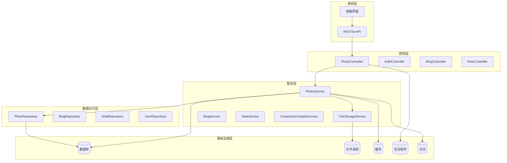

**图表来源**
- [PhotoController.java](file://src/main/java/com/photo/controller/PhotoController.java#L30-L34)
- [PhotoService.java](file://src/main/java/com/photo/service/PhotoService.java#L34-L46)
- [FileStorageService.java](file://src/main/java/com/photo/service/FileStorageService.java#L22-L24)

### 启动流程
系统启动流程遵循Spring Boot的标准启动序列：

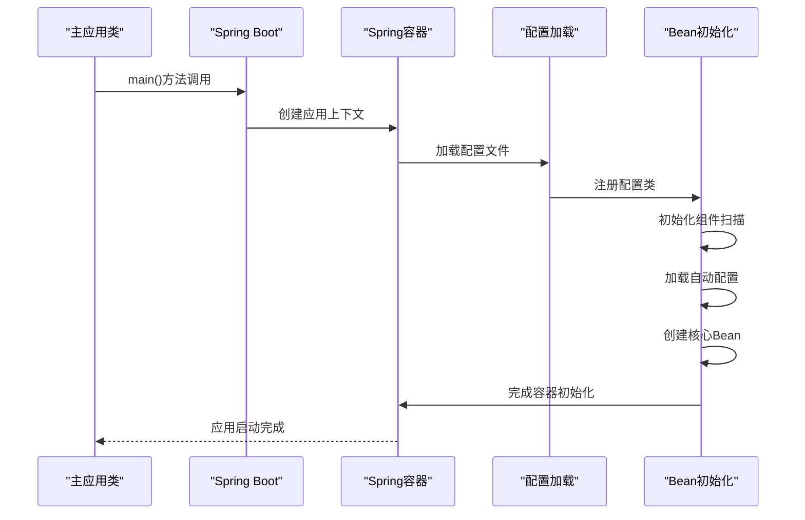

**图表来源**
- [PhotoUploadApplication.java](file://src/main/java/com/photo/PhotoUploadApplication.java#L16-L18)
- [application.yml](file://src/main/resources/application.yml#L1-L20)

### 请求处理流程
用户请求的处理流程如下：

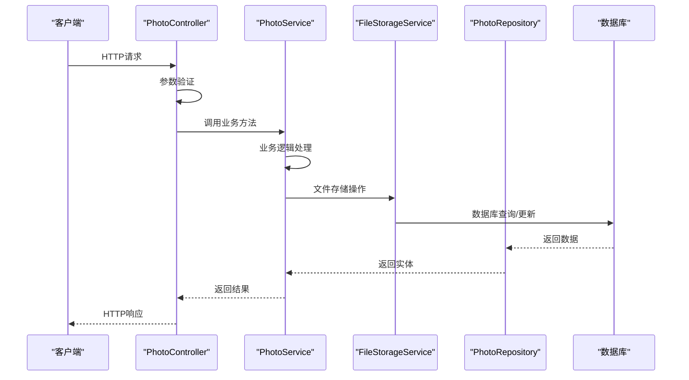

**图表来源**
- [PhotoController.java](file://src/main/java/com/photo/controller/PhotoController.java#L48-L61)
- [PhotoService.java](file://src/main/java/com/photo/service/PhotoService.java#L50-L111)
- [FileStorageService.java](file://src/main/java/com/photo/service/FileStorageService.java#L59-L95)

## 详细组件分析

### 主应用类分析
主应用类是整个系统的启动入口，采用了Spring Boot的注解驱动方式：

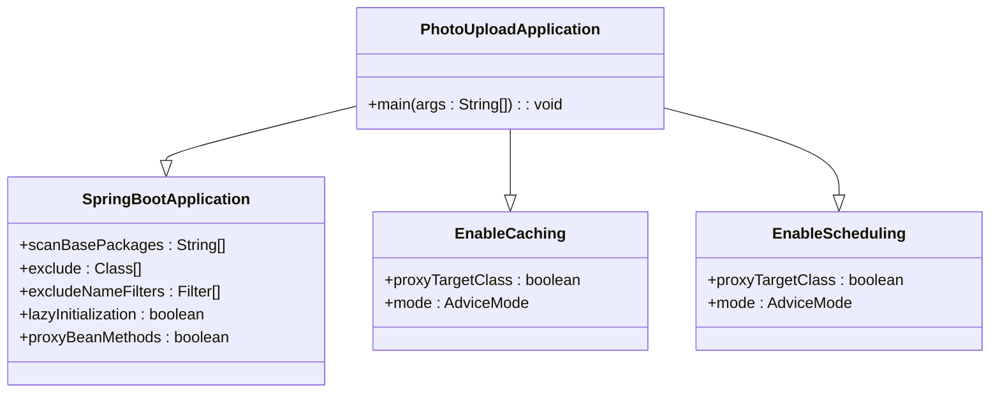

**图表来源**
- [PhotoUploadApplication.java](file://src/main/java/com/photo/PhotoUploadApplication.java#L11-L18)

主应用类的主要特点：
- 使用`@SpringBootApplication`注解启用自动配置
- 使用`@EnableCaching`启用缓存功能
- 使用`@EnableScheduling`启用定时任务功能

**章节来源**
- [PhotoUploadApplication.java](file://src/main/java/com/photo/PhotoUploadApplication.java#L1-L20)

### 安全配置分析
系统采用Spring Security提供全面的安全防护：

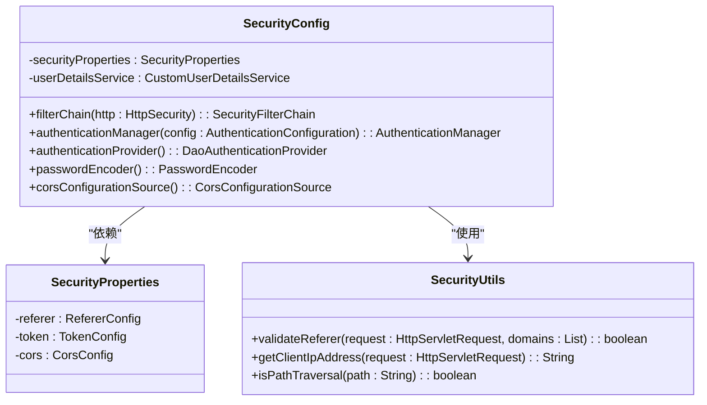

**图表来源**
- [SecurityConfig.java](file://src/main/java/com/photo/config/SecurityConfig.java#L26-L98)
- [SecurityProperties.java](file://src/main/java/com/photo/config/SecurityProperties.java#L12-L52)

安全配置的关键特性：
- CSRF防护禁用（适用于API场景）
- CORS跨域资源共享配置
- 用户认证和授权
- 防盗链机制
- XSS防护

**章节来源**
- [SecurityConfig.java](file://src/main/java/com/photo/config/SecurityConfig.java#L36-L58)
- [SecurityProperties.java](file://src/main/java/com/photo/config/SecurityProperties.java#L14-L31)

### 文件存储配置分析
文件存储配置提供了灵活的存储管理能力：

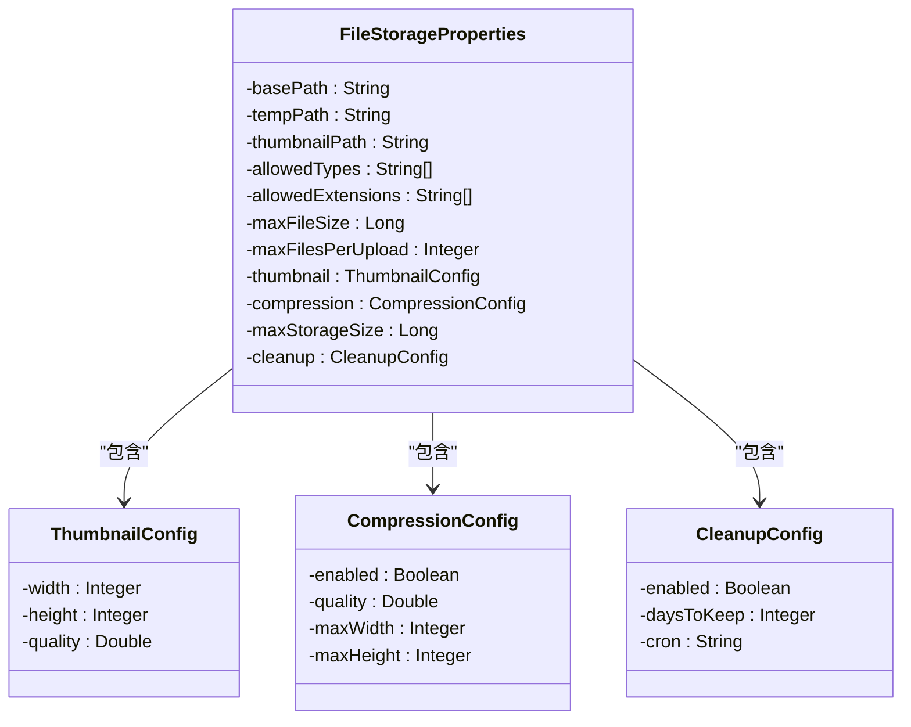

**图表来源**
- [FileStorageProperties.java](file://src/main/java/com/photo/config/FileStorageProperties.java#L14-L93)

存储配置的关键特性：
- 多级目录结构管理
- 文件类型和大小限制
- 缩略图生成配置
- 图片压缩设置
- 定期清理策略

**章节来源**
- [FileStorageProperties.java](file://src/main/java/com/photo/config/FileStorageProperties.java#L14-L93)

### 缓存配置分析
系统采用Caffeine作为缓存解决方案：

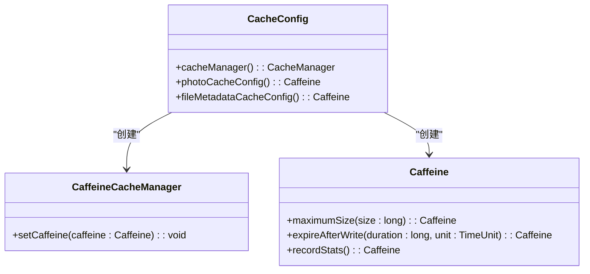

**图表来源**
- [CacheConfig.java](file://src/main/java/com/photo/config/CacheConfig.java#L15-L53)

缓存配置的关键特性：
- 多级缓存策略
- 自定义缓存大小和过期时间
- 缓存统计功能
- 针对不同数据类型的优化配置

**章节来源**
- [CacheConfig.java](file://src/main/java/com/photo/config/CacheConfig.java#L15-L53)

### API文档配置分析
系统集成了SpringDoc OpenAPI提供API文档：

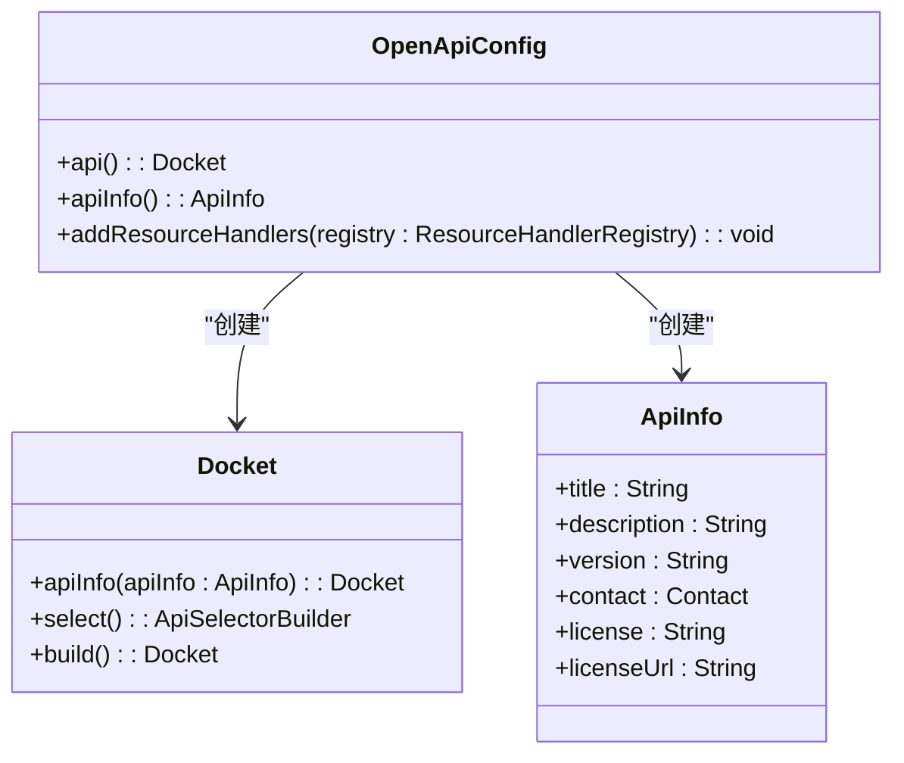

**图表来源**
- [OpenApiConfig.java](file://src/main/java/com/photo/config/OpenApiConfig.java#L19-L49)

API文档配置的关键特性：
- 自动扫描控制器类
- API信息配置
- Swagger UI集成
- 资源处理器配置

**章节来源**
- [OpenApiConfig.java](file://src/main/java/com/photo/config/OpenApiConfig.java#L19-L49)

### 控制器层分析
控制器层提供RESTful API接口：

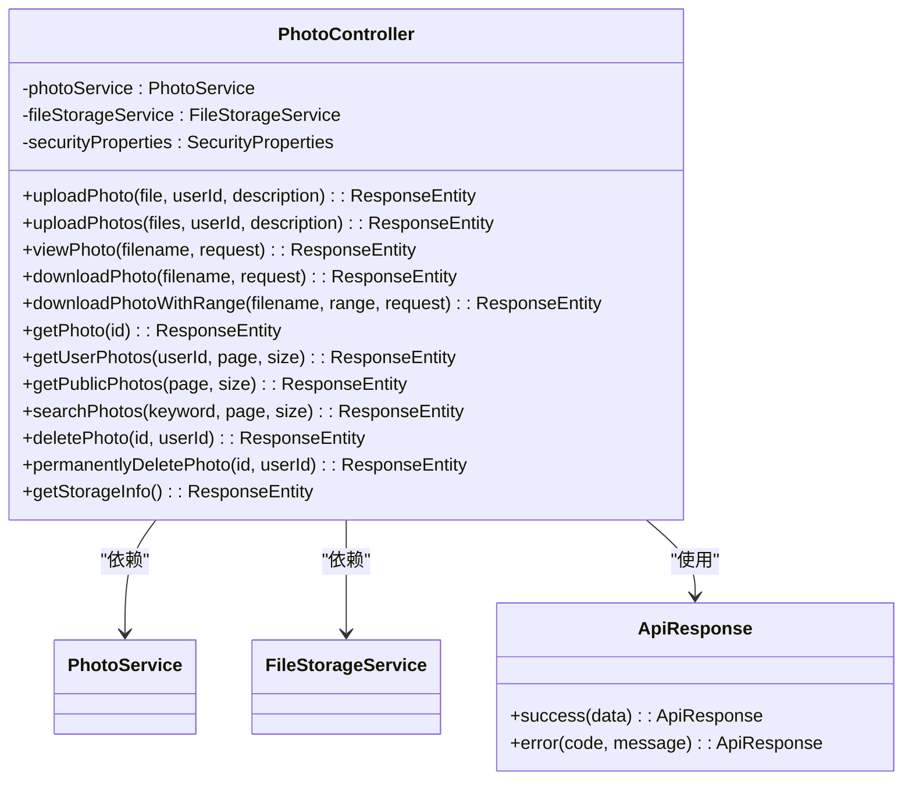

**图表来源**
- [PhotoController.java](file://src/main/java/com/photo/controller/PhotoController.java#L30-L315)

控制器层的关键特性：
- 完整的文件管理API
- 参数验证和异常处理
- 响应格式标准化
- 安全控制集成

**章节来源**
- [PhotoController.java](file://src/main/java/com/photo/controller/PhotoController.java#L30-L315)

### 服务层分析
服务层实现核心业务逻辑：

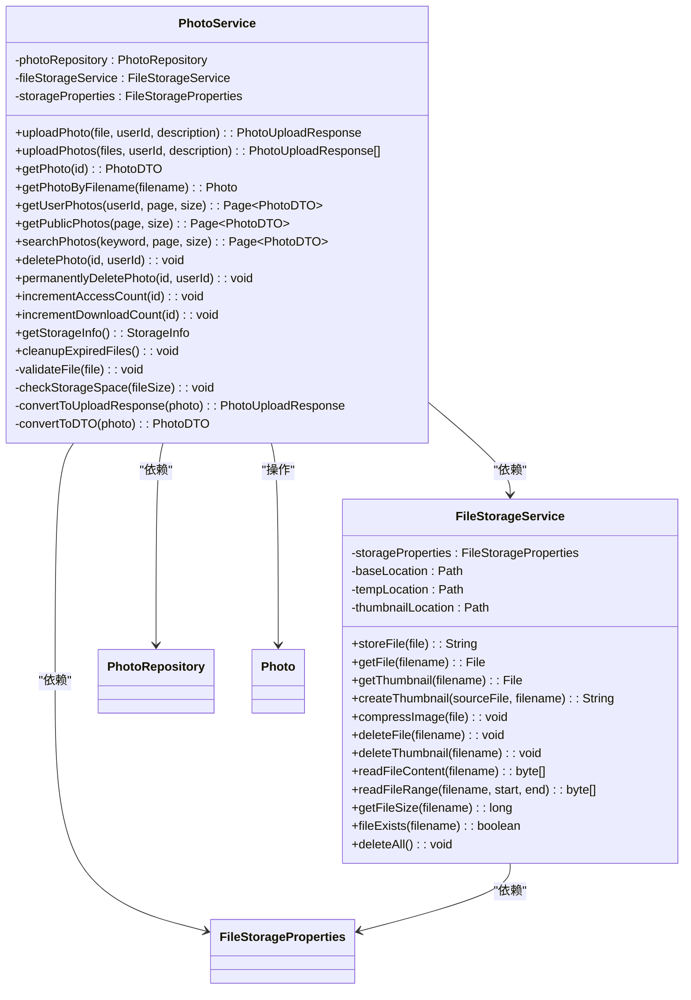

**图表来源**
- [PhotoService.java](file://src/main/java/com/photo/service/PhotoService.java#L34-L384)
- [FileStorageService.java](file://src/main/java/com/photo/service/FileStorageService.java#L22-L299)

服务层的关键特性：
- 事务管理
- 缓存策略
- 文件验证和处理
- 定时任务
- 错误处理

**章节来源**
- [PhotoService.java](file://src/main/java/com/photo/service/PhotoService.java#L34-L384)
- [FileStorageService.java](file://src/main/java/com/photo/service/FileStorageService.java#L22-L299)

### 数据模型分析
系统使用JPA实体模型进行数据持久化：

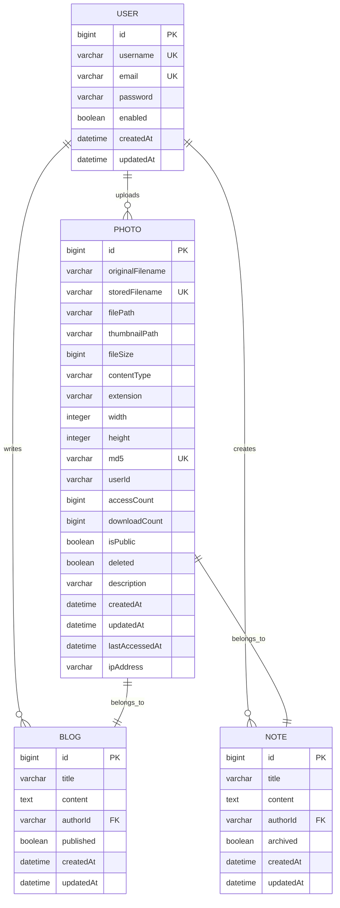

**图表来源**
- [Photo.java](file://src/main/java/com/photo/entity/Photo.java#L27-L173)

数据模型的关键特性：
- 完整的索引设计
- 时间戳字段
- 软删除支持
- 关系映射

**章节来源**
- [Photo.java](file://src/main/java/com/photo/entity/Photo.java#L17-L173)

### 工具类分析
工具类提供辅助功能：

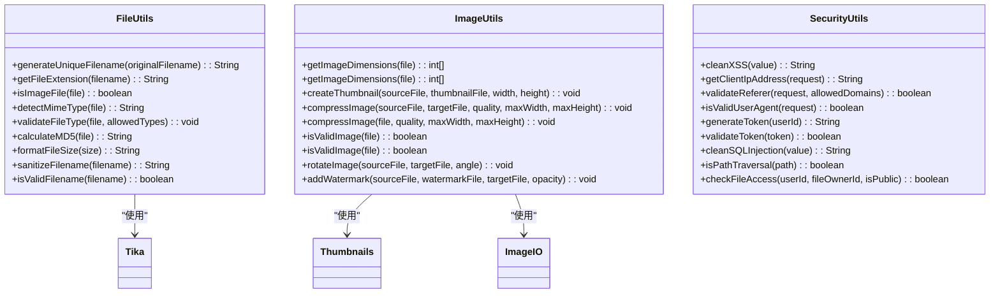

**图表来源**
- [FileUtils.java](file://src/main/java/com/photo/util/FileUtils.java#L19-L177)
- [ImageUtils.java](file://src/main/java/com/photo/util/ImageUtils.java#L15-L181)
- [SecurityUtils.java](file://src/main/java/com/photo/util/SecurityUtils.java#L14-L166)

工具类的关键特性：
- 文件处理功能
- 图片处理功能
- 安全防护功能
- 格式化工具

**章节来源**
- [FileUtils.java](file://src/main/java/com/photo/util/FileUtils.java#L19-L177)
- [ImageUtils.java](file://src/main/java/com/photo/util/ImageUtils.java#L15-L181)
- [SecurityUtils.java](file://src/main/java/com/photo/util/SecurityUtils.java#L14-L166)

## 依赖关系分析

### Maven依赖分析
系统使用Maven进行依赖管理，主要依赖包括：

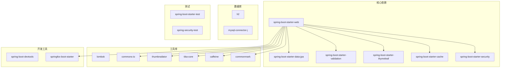

**图表来源**
- [pom.xml](file://pom.xml#L30-L149)

### 组件依赖关系
系统组件之间的依赖关系如下：

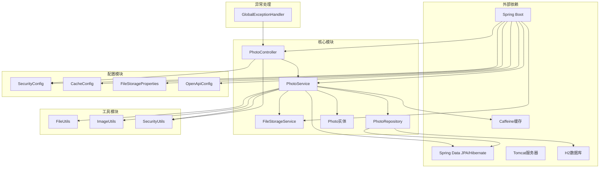

**图表来源**
- [PhotoController.java](file://src/main/java/com/photo/controller/PhotoController.java#L36-L43)
- [PhotoService.java](file://src/main/java/com/photo/service/PhotoService.java#L38-L45)
- [FileStorageService.java](file://src/main/java/com/photo/service/FileStorageService.java#L26-L27)

**章节来源**
- [pom.xml](file://pom.xml#L30-L149)

## 性能考量
系统在设计时充分考虑了性能优化：

### 缓存策略
- 使用Caffeine本地缓存减少数据库查询
- 针对不同类型的数据设置不同的缓存策略
- 缓存统计功能便于性能监控

### 文件处理优化
- 图片压缩和缩略图生成
- 分块读取支持断点续传
- 文件大小限制防止内存溢出

### 数据库优化
- 合理的索引设计
- 分页查询支持大数据量
- 软删除避免表膨胀

### 并发处理
- 线程池配置
- 连接池管理
- 异步处理支持

## 故障排除指南
系统提供了完善的异常处理机制：

### 常见异常类型
- 文件类型异常：文件格式不被支持
- 文件大小异常：文件超过限制
- 存储空间不足：磁盘空间不足
- 访问拒绝：权限不足
- 文件未找到：文件不存在

### 异常处理流程
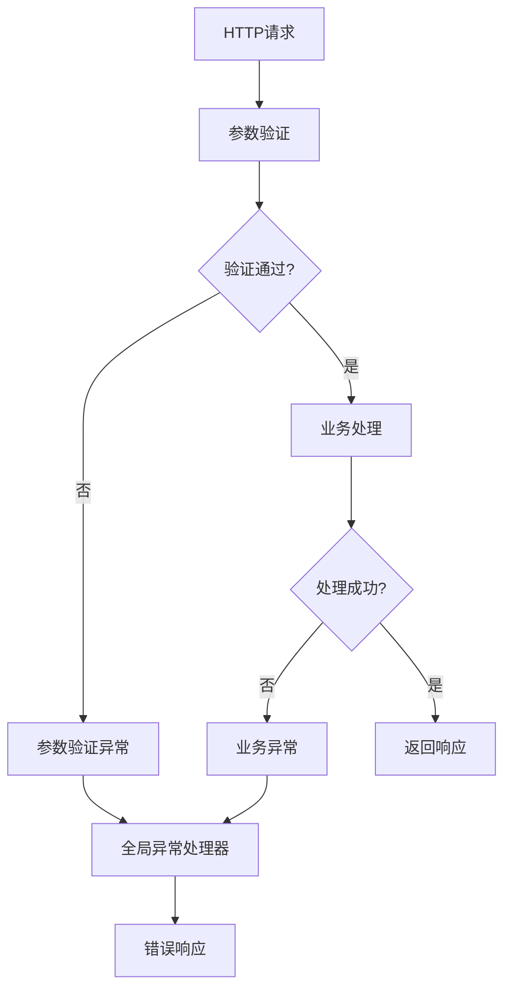

**图表来源**
- [GlobalExceptionHandler.java](file://src/main/java/com/photo/exception/GlobalExceptionHandler.java#L21-L139)

**章节来源**
- [GlobalExceptionHandler.java](file://src/main/java/com/photo/exception/GlobalExceptionHandler.java#L21-L139)

## 结论
本照片上传下载系统采用现代化的Spring Boot技术栈，实现了完整的文件管理功能。系统具有以下特点：

### 技术优势
- **模块化设计**：清晰的分层架构，职责分离明确
- **高性能**：缓存、异步处理、数据库优化
- **安全性强**：多层次安全防护，包括CSRF、XSS、防盗链等
- **可扩展性**：插件化配置，易于扩展新功能

### 架构决策
- 选择Spring Boot作为基础框架，简化配置和部署
- 使用JPA进行数据持久化，提供ORM抽象
- 采用Caffeine缓存提升性能
- 集成Spring Security提供安全控制
- 使用SpringDoc OpenAPI提供API文档

### 改进建议
- 生产环境建议使用专业对象存储服务
- 可以考虑引入消息队列处理大文件上传
- 建议增加监控和告警机制
- 可以考虑微服务化架构以支持更大规模

该系统为企业级应用提供了坚实的技术基础，具备良好的可维护性和扩展性。