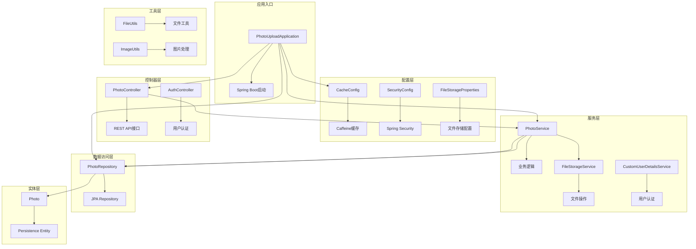
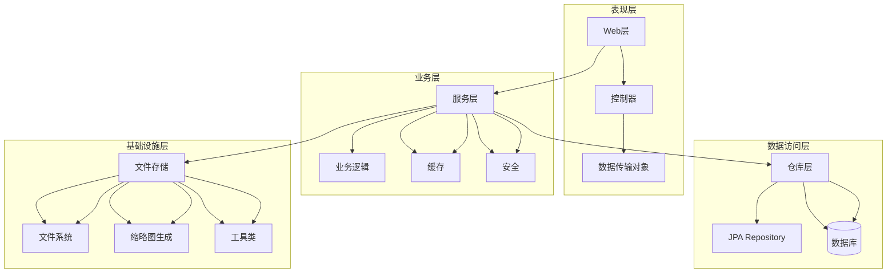
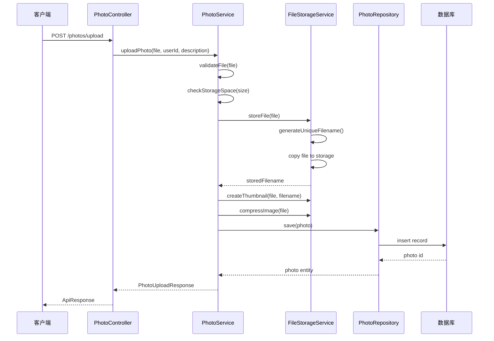
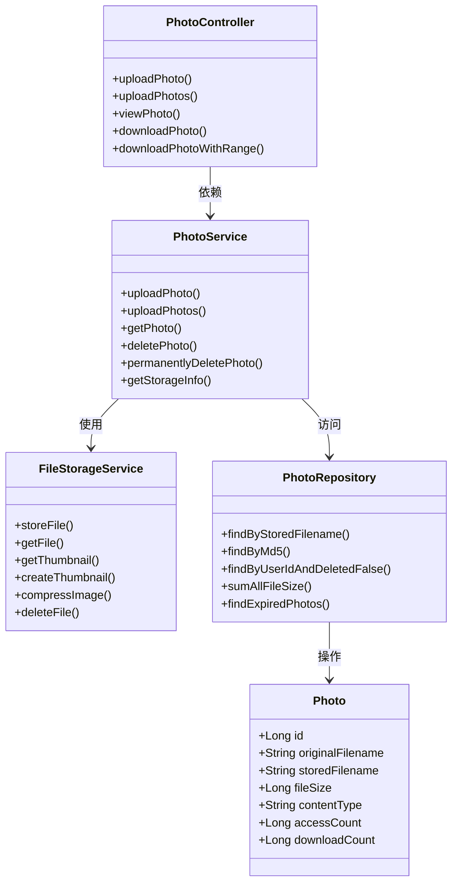
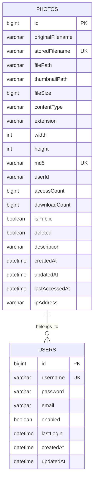
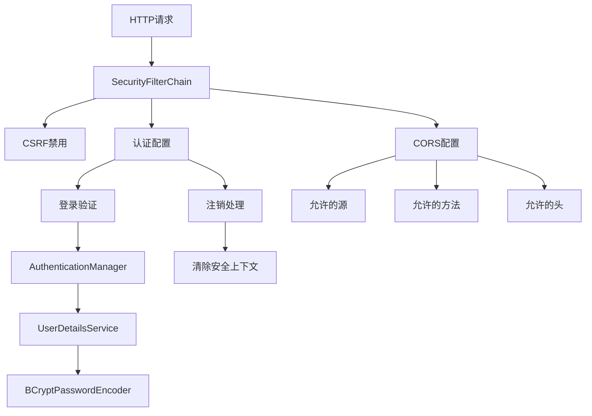
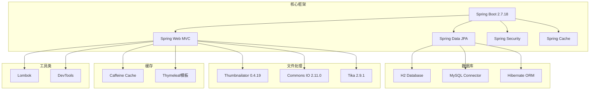

# 系统架构设计

<cite>
**本文档引用的文件**
- [PhotoUploadApplication.java](file://src/main/java/com/photo/PhotoUploadApplication.java)
- [PhotoController.java](file://src/main/java/com/photo/controller/PhotoController.java)
- [PhotoService.java](file://src/main/java/com/photo/service/PhotoService.java)
- [PhotoRepository.java](file://src/main/java/com/photo/repository/PhotoRepository.java)
- [Photo.java](file://src/main/java/com/photo/entity/Photo.java)
- [FileStorageService.java](file://src/main/java/com/photo/service/FileStorageService.java)
- [FileStorageProperties.java](file://src/main/java/com/photo/config/FileStorageProperties.java)
- [CacheConfig.java](file://src/main/java/com/photo/config/CacheConfig.java)
- [SecurityConfig.java](file://src/main/java/com/photo/config/SecurityConfig.java)
- [application.yml](file://src/main/resources/application.yml)
- [FileUtils.java](file://src/main/java/com/photo/util/FileUtils.java)
- [ImageUtils.java](file://src/main/java/com/photo/util/ImageUtils.java)
- [GlobalExceptionHandler.java](file://src/main/java/com/photo/exception/GlobalExceptionHandler.java)
- [PhotoDTO.java](file://src/main/java/com/photo/dto/PhotoDTO.java)
- [PhotoUploadResponse.java](file://src/main/java/com/photo/dto/PhotoUploadResponse.java)
- [AuthController.java](file://src/main/java/com/photo/controller/AuthController.java)
- [CustomUserDetailsService.java](file://src/main/java/com/photo/service/CustomUserDetailsService.java)
- [pom.xml](file://pom.xml)
</cite>

## 目录
1. [简介](#简介)
2. [项目结构](#项目结构)
3. [核心组件](#核心组件)
4. [架构概览](#架构概览)
5. [详细组件分析](#详细组件分析)
6. [依赖关系分析](#依赖关系分析)
7. [性能考量](#性能考量)
8. [故障排除指南](#故障排除指南)
9. [结论](#结论)
10. [附录](#附录)

## 简介
本系统是一个基于Spring Boot构建的照片上传下载平台，采用经典的分层架构模式（Controller-Service-Repository-Entity），实现了完整的照片管理功能，包括上传、存储、缩略图生成、权限控制、缓存优化等特性。系统支持断点续传、防盗链保护、定时清理等功能，为用户提供高效稳定的照片管理体验。

## 项目结构
系统采用标准的Spring Boot项目结构，按照功能模块进行组织：

**图表来源**
- [PhotoUploadApplication.java](file://src/main/java/com/photo/PhotoUploadApplication.java#L1-L20)
- [CacheConfig.java](file://src/main/java/com/photo/config/CacheConfig.java#L1-L54)
- [SecurityConfig.java](file://src/main/java/com/photo/config/SecurityConfig.java#L1-L99)
- [PhotoController.java](file://src/main/java/com/photo/controller/PhotoController.java#L1-L316)
- [PhotoService.java](file://src/main/java/com/photo/service/PhotoService.java#L1-L385)

**章节来源**
- [PhotoUploadApplication.java](file://src/main/java/com/photo/PhotoUploadApplication.java#L1-L20)
- [application.yml](file://src/main/resources/application.yml#L1-L190)

## 核心组件
系统采用四层架构模式，每层都有明确的职责分工：

### 控制器层（Controller Layer）
- **PhotoController**: 提供REST API接口，处理HTTP请求和响应
- **AuthController**: 处理用户认证和授权相关请求
- **职责**: 接收客户端请求，验证参数，调用服务层，返回标准化响应

### 服务层（Service Layer）
- **PhotoService**: 核心业务逻辑实现，包括文件上传、存储管理、缓存控制
- **FileStorageService**: 文件存储和读写操作
- **CustomUserDetailsService**: 用户认证和授权服务
- **职责**: 实现业务规则，协调数据访问，处理事务管理

### 数据访问层（Repository Layer）
- **PhotoRepository**: JPA Repository接口，提供数据访问方法
- **职责**: 封装数据库操作，提供查询方法

### 实体层（Entity Layer）
- **Photo**: 照片实体类，映射数据库表结构
- **职责**: 定义数据模型，提供业务对象

**章节来源**
- [PhotoController.java](file://src/main/java/com/photo/controller/PhotoController.java#L27-L316)
- [PhotoService.java](file://src/main/java/com/photo/service/PhotoService.java#L31-L385)
- [PhotoRepository.java](file://src/main/java/com/photo/repository/PhotoRepository.java#L16-L112)
- [Photo.java](file://src/main/java/com/photo/entity/Photo.java#L13-L174)

## 架构概览
系统采用分层架构设计，结合多种设计模式：

**图表来源**
- [PhotoController.java](file://src/main/java/com/photo/controller/PhotoController.java#L1-L316)
- [PhotoService.java](file://src/main/java/com/photo/service/PhotoService.java#L1-L385)
- [FileStorageService.java](file://src/main/java/com/photo/service/FileStorageService.java#L1-L300)

### 核心设计模式应用

#### 1. 依赖注入（Dependency Injection）
系统广泛使用Spring的依赖注入机制：
- 使用`@Autowired`注解自动注入服务依赖
- 使用`@Service`、`@Repository`、`@Controller`标识组件
- 支持构造函数注入和字段注入

#### 2. 缓存模式（Caching Pattern）
- 使用Caffeine本地缓存提高性能
- 应用`@Cacheable`和`@CacheEvict`注解
- 配置不同类型的缓存策略

#### 3. 事务管理（Transaction Management）
- 使用`@Transactional`注解确保数据一致性
- 支持分布式事务配置

#### 4. 异常处理模式（Exception Handling）
- 使用`@RestControllerAdvice`统一异常处理
- 提供结构化的错误响应

**章节来源**
- [CacheConfig.java](file://src/main/java/com/photo/config/CacheConfig.java#L15-L54)
- [GlobalExceptionHandler.java](file://src/main/java/com/photo/exception/GlobalExceptionHandler.java#L16-L140)

## 详细组件分析

### 照片上传流程

**图表来源**
- [PhotoController.java](file://src/main/java/com/photo/controller/PhotoController.java#L48-L61)
- [PhotoService.java](file://src/main/java/com/photo/service/PhotoService.java#L50-L111)
- [FileStorageService.java](file://src/main/java/com/photo/service/FileStorageService.java#L59-L95)

### 文件存储架构

**图表来源**
- [PhotoController.java](file://src/main/java/com/photo/controller/PhotoController.java#L1-L316)
- [PhotoService.java](file://src/main/java/com/photo/service/PhotoService.java#L1-L385)
- [FileStorageService.java](file://src/main/java/com/photo/service/FileStorageService.java#L1-L300)
- [PhotoRepository.java](file://src/main/java/com/photo/repository/PhotoRepository.java#L1-L112)
- [Photo.java](file://src/main/java/com/photo/entity/Photo.java#L1-L174)

**章节来源**
- [PhotoController.java](file://src/main/java/com/photo/controller/PhotoController.java#L27-L316)
- [PhotoService.java](file://src/main/java/com/photo/service/PhotoService.java#L31-L385)

### 数据模型设计

**图表来源**
- [Photo.java](file://src/main/java/com/photo/entity/Photo.java#L17-L174)

### 安全架构

**图表来源**
- [SecurityConfig.java](file://src/main/java/com/photo/config/SecurityConfig.java#L36-L98)
- [AuthController.java](file://src/main/java/com/photo/controller/AuthController.java#L47-L90)

**章节来源**
- [SecurityConfig.java](file://src/main/java/com/photo/config/SecurityConfig.java#L22-L99)
- [AuthController.java](file://src/main/java/com/photo/controller/AuthController.java#L20-L111)

## 依赖关系分析

### 技术栈依赖

**图表来源**
- [pom.xml](file://pom.xml#L30-L169)

### 关键配置分析

系统采用YAML配置文件集中管理各项设置：

#### 文件存储配置
- **基础路径**: `./uploads` - 默认存储根目录
- **最大文件大小**: 10MB - 单文件限制
- **最大上传数量**: 10个 - 单次请求限制
- **缩略图尺寸**: 200x200像素
- **压缩质量**: 85%
- **存储上限**: 10GB

#### 缓存配置
- **全局缓存**: 1000条，60分钟过期
- **照片缓存**: 500条，30分钟过期
- **元数据缓存**: 1000条，60分钟过期

#### 安全配置
- **防盗链**: 启用，允许localhost和127.0.0.1
- **CORS**: 允许3000和8080端口
- **认证**: 表单登录，会话管理

**章节来源**
- [application.yml](file://src/main/resources/application.yml#L69-L190)
- [FileStorageProperties.java](file://src/main/java/com/photo/config/FileStorageProperties.java#L12-L94)

## 性能考量

### 缓存策略
系统采用多级缓存优化：

1. **应用级缓存**: 使用Caffeine本地缓存
2. **热点数据缓存**: 针对频繁访问的照片信息
3. **元数据缓存**: 缓存文件元数据减少数据库查询

### 文件处理优化
- **异步处理**: 大文件压缩和缩略图生成
- **流式读取**: 支持断点续传和大文件下载
- **内存管理**: 合理的缓冲区大小控制

### 数据库优化
- **索引设计**: 为常用查询字段建立索引
- **分页查询**: 支持大数据量的分页浏览
- **连接池**: 配置合理的数据库连接数

### 网络优化
- **CDN集成**: 缩略图和静态资源可接入CDN
- **压缩传输**: 启用Gzip压缩
- **并发控制**: Tomcat线程池配置

## 故障排除指南

### 常见问题诊断

#### 文件上传失败
**可能原因**:
- 文件类型不被允许
- 文件大小超过限制
- 存储空间不足
- 文件名包含非法字符

**解决方案**:
1. 检查文件类型白名单
2. 验证文件大小配置
3. 监控存储使用情况
4. 使用文件名清理工具

#### 下载性能问题
**可能原因**:
- 缓存未命中
- 数据库查询慢
- 网络带宽限制

**解决方案**:
1. 优化缓存配置
2. 添加数据库索引
3. 启用CDN加速

#### 认证问题
**可能原因**:
- 用户名密码错误
- 用户被禁用
- 会话过期

**解决方案**:
1. 检查用户状态
2. 验证密码加密
3. 调整会话配置

**章节来源**
- [GlobalExceptionHandler.java](file://src/main/java/com/photo/exception/GlobalExceptionHandler.java#L16-L140)
- [FileUtils.java](file://src/main/java/com/photo/util/FileUtils.java#L155-L177)

## 结论
本照片上传下载系统采用成熟的Spring Boot技术栈，实现了清晰的分层架构和完善的业务功能。系统具备良好的扩展性、性能优化和安全保障机制。通过合理的缓存策略、文件处理优化和安全配置，能够满足中等规模应用的需求。建议在生产环境中进一步完善监控告警、日志分析和性能测试体系。

## 附录

### API接口规范

#### 照片管理接口
- `POST /photos/upload` - 单文件上传
- `POST /photos/upload/batch` - 批量上传
- `GET /photos/view/{filename}` - 在线预览
- `GET /photos/download/{filename}` - 文件下载
- `GET /photos/download/range/{filename}` - 断点续传
- `GET /photos/user/{userId}` - 用户照片列表
- `GET /photos/public` - 公开照片列表
- `DELETE /photos/{id}` - 软删除
- `DELETE /photos/{id}/permanent` - 物理删除

#### 认证接口
- `GET /auth/login` - 登录页面
- `POST /auth/login` - 用户登录
- `POST /auth/logout` - 用户注销
- `POST /auth/register` - 用户注册

### 部署建议
- **硬件要求**: 至少4GB内存，10GB磁盘空间
- **数据库**: 生产环境推荐MySQL 8.0+
- **缓存**: Redis集群（可选）
- **CDN**: 静态资源CDN加速
- **监控**: Prometheus + Grafana监控