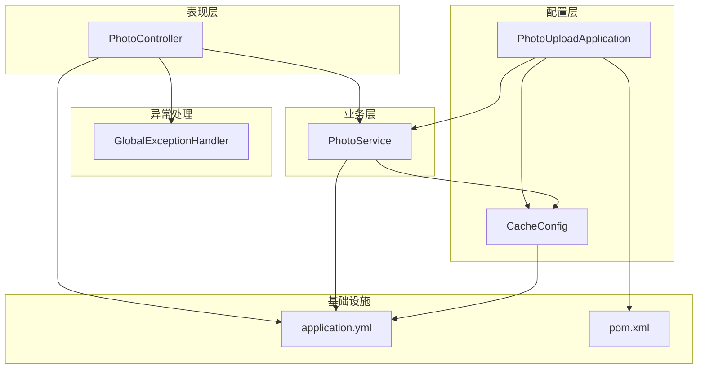
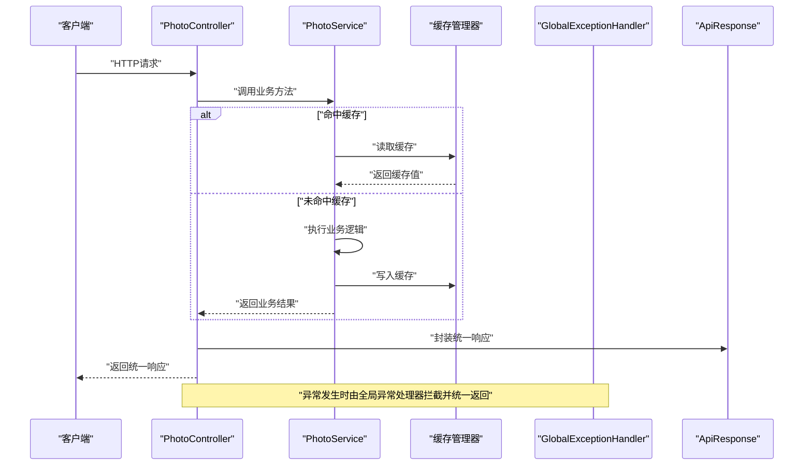
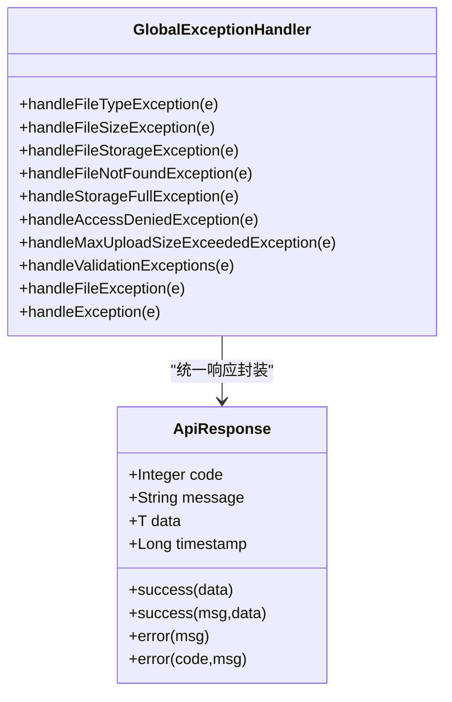
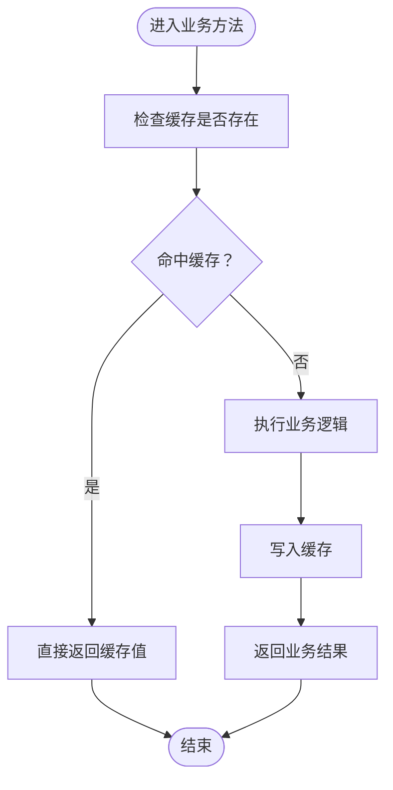
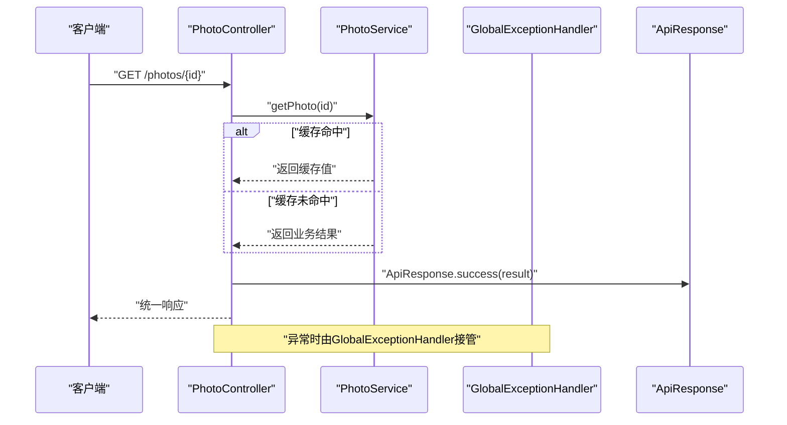
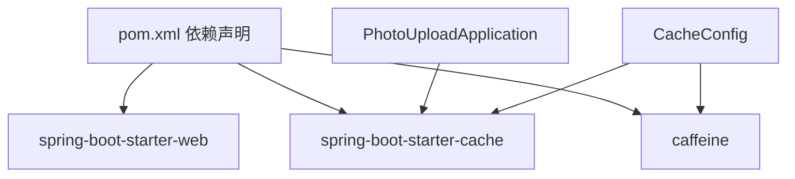

# AOP编程模式

<cite>
**本文引用的文件**
- [GlobalExceptionHandler.java](file://src/main/java/com/photo/exception/GlobalExceptionHandler.java)
- [CacheConfig.java](file://src/main/java/com/photo/config/CacheConfig.java)
- [PhotoService.java](file://src/main/java/com/photo/service/PhotoService.java)
- [PhotoController.java](file://src/main/java/com/photo/controller/PhotoController.java)
- [ApiResponse.java](file://src/main/java/com/photo/dto/ApiResponse.java)
- [PhotoUploadApplication.java](file://src/main/java/com/photo/PhotoUploadApplication.java)
- [application.yml](file://src/main/resources/application.yml)
- [pom.xml](file://pom.xml)
</cite>

## 目录
1. [简介](#简介)
2. [项目结构](#项目结构)
3. [核心组件](#核心组件)
4. [架构总览](#架构总览)
5. [详细组件分析](#详细组件分析)
6. [依赖关系分析](#依赖关系分析)
7. [性能考量](#性能考量)
8. [故障排查指南](#故障排查指南)
9. [结论](#结论)
10. [附录](#附录)

## 简介
本文件聚焦于面向切面编程（AOP）在异常处理与缓存管理中的应用实践，结合项目现有实现，系统阐述以下要点：
- 全局异常处理：通过@RestControllerAdvice与@ExceptionHandler实现横切异常拦截、日志记录与统一响应格式输出。
- 缓存管理：通过@EnableCaching与Spring Cache注解（如@Cacheable、@CacheEvict）实现缓存的自动应用与失效策略。
- 统一响应模型：通过ApiResponse统一封装响应结构，提升接口一致性与可维护性。
- 代码复用与模块化：利用AOP将横切关注点（异常处理、缓存）从业务逻辑中剥离，实现关注点分离与代码复用。

## 项目结构
项目采用标准Spring Boot分层架构，AOP相关能力主要分布在以下层次：
- 控制层：PhotoController对外暴露REST接口，调用服务层方法。
- 服务层：PhotoService承载核心业务逻辑，并通过Spring Cache注解声明缓存策略。
- 异常处理层：GlobalExceptionHandler集中处理各类异常，统一返回ApiResponse。
- 配置层：CacheConfig定义缓存管理器与缓存规格；PhotoUploadApplication启用缓存与定时任务。

图表来源
- [PhotoController.java](file://src/main/java/com/photo/controller/PhotoController.java#L1-L316)
- [PhotoService.java](file://src/main/java/com/photo/service/PhotoService.java#L1-L385)
- [GlobalExceptionHandler.java](file://src/main/java/com/photo/exception/GlobalExceptionHandler.java#L1-L140)
- [CacheConfig.java](file://src/main/java/com/photo/config/CacheConfig.java#L1-L54)
- [PhotoUploadApplication.java](file://src/main/java/com/photo/PhotoUploadApplication.java#L1-L20)
- [application.yml](file://src/main/resources/application.yml#L1-L190)
- [pom.xml](file://pom.xml#L1-L169)

章节来源
- [PhotoController.java](file://src/main/java/com/photo/controller/PhotoController.java#L1-L316)
- [PhotoService.java](file://src/main/java/com/photo/service/PhotoService.java#L1-L385)
- [GlobalExceptionHandler.java](file://src/main/java/com/photo/exception/GlobalExceptionHandler.java#L1-L140)
- [CacheConfig.java](file://src/main/java/com/photo/config/CacheConfig.java#L1-L54)
- [PhotoUploadApplication.java](file://src/main/java/com/photo/PhotoUploadApplication.java#L1-L20)
- [application.yml](file://src/main/resources/application.yml#L1-L190)
- [pom.xml](file://pom.xml#L1-L169)

## 核心组件
- 全局异常处理器：集中捕获业务异常与框架异常，统一记录日志并返回标准化响应。
- 缓存配置：启用Spring Cache并配置Caffeine缓存管理器，定义缓存规格与统计。
- 服务层缓存注解：在PhotoService中使用@Cacheable与@CacheEvict声明缓存策略。
- 统一响应模型：ApiResponse提供成功/失败响应的静态工厂方法，确保响应格式一致。

章节来源
- [GlobalExceptionHandler.java](file://src/main/java/com/photo/exception/GlobalExceptionHandler.java#L16-L139)
- [CacheConfig.java](file://src/main/java/com/photo/config/CacheConfig.java#L15-L53)
- [PhotoService.java](file://src/main/java/com/photo/service/PhotoService.java#L141-L234)
- [ApiResponse.java](file://src/main/java/com/photo/dto/ApiResponse.java#L10-L62)

## 架构总览
下图展示了AOP在异常处理与缓存管理中的交互流程，体现横切关注点如何在不侵入业务代码的前提下生效。

图表来源
- [PhotoController.java](file://src/main/java/com/photo/controller/PhotoController.java#L230-L237)
- [PhotoService.java](file://src/main/java/com/photo/service/PhotoService.java#L141-L151)
- [GlobalExceptionHandler.java](file://src/main/java/com/photo/exception/GlobalExceptionHandler.java#L132-L138)
- [ApiResponse.java](file://src/main/java/com/photo/dto/ApiResponse.java#L38-L61)

## 详细组件分析

### 全局异常处理（AOP横切异常拦截）
- 注解与作用域
  - @RestControllerAdvice：定义全局控制器增强，使异常处理器对所有@RestController生效。
  - @ExceptionHandler：按异常类型精确匹配并处理，覆盖特定异常与通用异常。
- 拦截范围
  - 文件类型异常、文件大小异常、文件存储异常、文件未找到、存储空间不足、访问拒绝、上传大小超限、参数校验异常、通用异常等。
- 日志与响应
  - 使用SLF4J记录异常日志，包含异常堆栈信息。
  - 返回统一的ApiResponse结构，包含状态码、消息与时间戳。
- 统一响应模型
  - ApiResponse提供success/error静态工厂方法，确保响应格式一致。

图表来源
- [GlobalExceptionHandler.java](file://src/main/java/com/photo/exception/GlobalExceptionHandler.java#L19-L139)
- [ApiResponse.java](file://src/main/java/com/photo/dto/ApiResponse.java#L10-L62)

章节来源
- [GlobalExceptionHandler.java](file://src/main/java/com/photo/exception/GlobalExceptionHandler.java#L16-L139)
- [ApiResponse.java](file://src/main/java/com/photo/dto/ApiResponse.java#L10-L62)

### 缓存配置与注解应用（AOP横切缓存）
- 启用与配置
  - @EnableCaching：开启Spring缓存支持。
  - CacheConfig：定义Caffeine缓存管理器与缓存规格，支持统计与过期策略。
  - application.yml：指定缓存类型与Caffeine规格。
- 注解使用
  - @Cacheable：在PhotoService中对查询方法进行缓存读取与写入。
  - @CacheEvict：在删除或变更操作后清除对应缓存键，保证缓存一致性。
- 缓存策略
  - 以photos为缓存名，键为方法参数（如id或filename），实现热点数据快速访问与一致性保障。

图表来源
- [PhotoService.java](file://src/main/java/com/photo/service/PhotoService.java#L141-L151)
- [PhotoService.java](file://src/main/java/com/photo/service/PhotoService.java#L193-L205)
- [CacheConfig.java](file://src/main/java/com/photo/config/CacheConfig.java#L22-L30)

章节来源
- [CacheConfig.java](file://src/main/java/com/photo/config/CacheConfig.java#L15-L53)
- [PhotoService.java](file://src/main/java/com/photo/service/PhotoService.java#L141-L234)
- [application.yml](file://src/main/resources/application.yml#L50-L55)

### 控制层与统一响应
- 控制层通过PhotoController将业务结果封装为ApiResponse，确保接口响应的一致性。
- 控制层在异常发生时交由GlobalExceptionHandler统一处理，避免分散的异常处理逻辑。

图表来源
- [PhotoController.java](file://src/main/java/com/photo/controller/PhotoController.java#L230-L237)
- [PhotoService.java](file://src/main/java/com/photo/service/PhotoService.java#L141-L151)
- [GlobalExceptionHandler.java](file://src/main/java/com/photo/exception/GlobalExceptionHandler.java#L132-L138)
- [ApiResponse.java](file://src/main/java/com/photo/dto/ApiResponse.java#L38-L47)

章节来源
- [PhotoController.java](file://src/main/java/com/photo/controller/PhotoController.java#L230-L237)
- [ApiResponse.java](file://src/main/java/com/photo/dto/ApiResponse.java#L38-L47)

## 依赖关系分析
- 运行时依赖
  - spring-boot-starter-cache：提供Spring Cache抽象与注解支持。
  - caffeine：高性能本地缓存实现。
  - spring-boot-starter-web：提供Web MVC与异常处理基础能力。
- 配置依赖
  - application.yml中启用缓存类型与Caffeine规格，确保缓存行为与性能可控。
- 启用注解
  - PhotoUploadApplication与CacheConfig分别通过@EnableCaching与@Cacheable/@CacheEvict启用缓存功能。

图表来源
- [pom.xml](file://pom.xml#L55-L113)
- [PhotoUploadApplication.java](file://src/main/java/com/photo/PhotoUploadApplication.java#L5-L13)
- [CacheConfig.java](file://src/main/java/com/photo/config/CacheConfig.java#L5-L8)

章节来源
- [pom.xml](file://pom.xml#L55-L113)
- [PhotoUploadApplication.java](file://src/main/java/com/photo/PhotoUploadApplication.java#L5-L13)
- [CacheConfig.java](file://src/main/java/com/photo/config/CacheConfig.java#L5-L8)

## 性能考量
- 缓存命中率
  - 通过@Cacheable对热点查询（如按ID或文件名获取照片）进行缓存，减少数据库与IO压力。
- 缓存失效策略
  - 通过@CacheEvict在删除或变更操作后主动清理缓存键，避免脏读。
- 缓存规格
  - CacheConfig设置maximumSize与expireAfterWrite，平衡内存占用与访问延迟。
- 统一响应开销
  - ApiResponse为轻量封装，统一响应格式带来的序列化成本极低。

## 故障排查指南
- 异常处理未生效
  - 确认PhotoUploadApplication与CacheConfig是否启用@EnableCaching。
  - 检查@RestControllerAdvice是否扫描到目标包路径。
- 缓存未命中
  - 确认@Cacheable/@CacheEvict注解所在方法是否被代理调用（避免同类内自调用绕过代理）。
  - 检查缓存键是否正确（如方法参数是否稳定且可序列化）。
- 响应格式不一致
  - 确保控制器方法统一通过ApiResponse封装响应，避免直接返回业务对象。

章节来源
- [PhotoUploadApplication.java](file://src/main/java/com/photo/PhotoUploadApplication.java#L5-L13)
- [CacheConfig.java](file://src/main/java/com/photo/config/CacheConfig.java#L15-L30)
- [PhotoController.java](file://src/main/java/com/photo/controller/PhotoController.java#L230-L237)

## 结论
本项目通过@RestControllerAdvice与Spring Cache注解，成功将异常处理与缓存管理两大横切关注点模块化、标准化：
- 全局异常处理：集中拦截并统一响应，提升系统可观测性与用户体验。
- 缓存管理：以注解方式声明缓存策略，简化业务代码，提高性能与一致性。
- 统一响应模型：确保接口风格一致，便于前端消费与测试。

## 附录
- 关键注解速览
  - @RestControllerAdvice：全局控制器增强，配合@ExceptionHandler实现异常拦截。
  - @EnableCaching：启用Spring缓存支持。
  - @Cacheable：声明缓存读取与写入。
  - @CacheEvict：声明缓存失效。
- 参考实现位置
  - 全局异常处理：[GlobalExceptionHandler.java](file://src/main/java/com/photo/exception/GlobalExceptionHandler.java#L19-L139)
  - 缓存配置：[CacheConfig.java](file://src/main/java/com/photo/config/CacheConfig.java#L15-L53)
  - 服务层缓存注解：[PhotoService.java](file://src/main/java/com/photo/service/PhotoService.java#L141-L234)
  - 统一响应模型：[ApiResponse.java](file://src/main/java/com/photo/dto/ApiResponse.java#L10-L62)
  - 应用启动与缓存启用：[PhotoUploadApplication.java](file://src/main/java/com/photo/PhotoUploadApplication.java#L5-L13)
  - 缓存规格与运行配置：[application.yml](file://src/main/resources/application.yml#L50-L55)