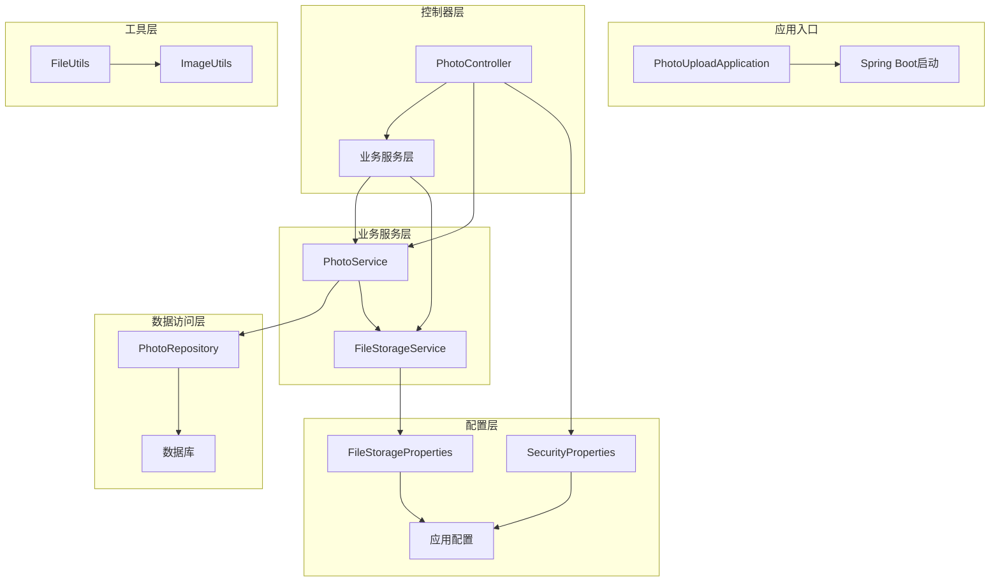
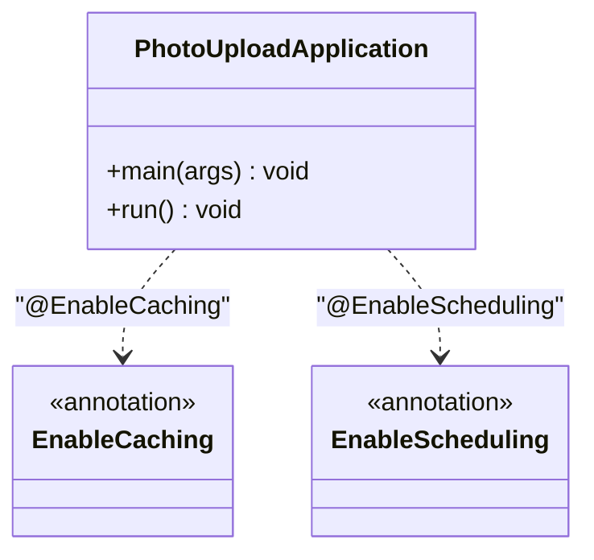
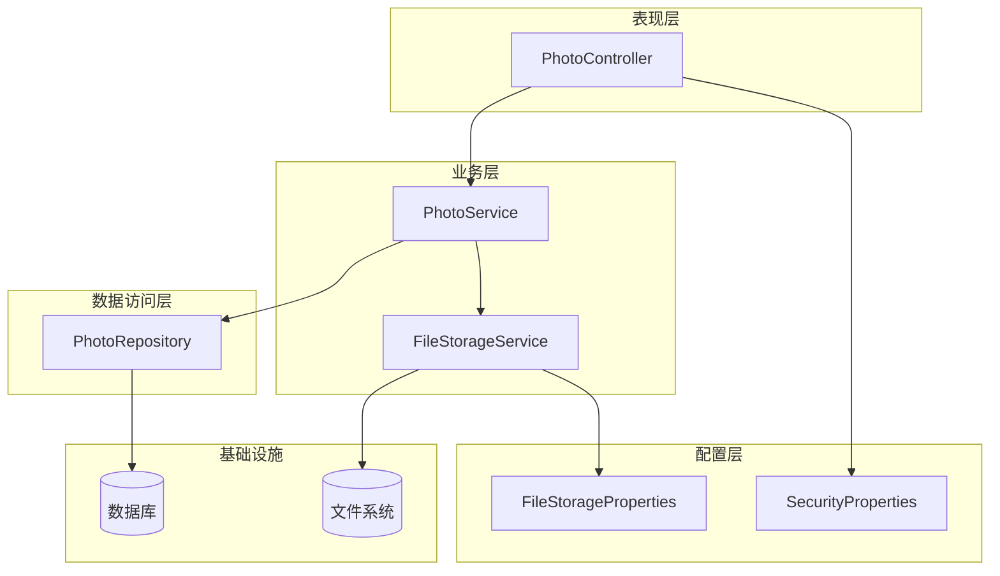
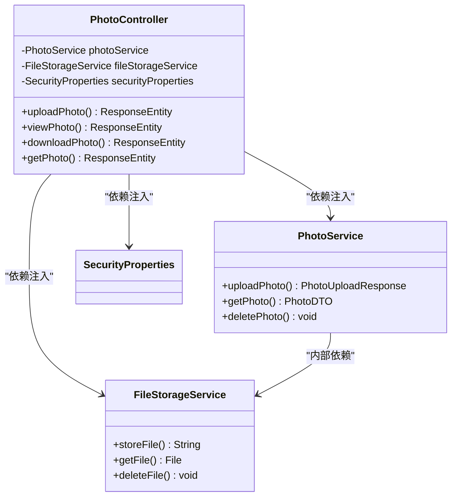
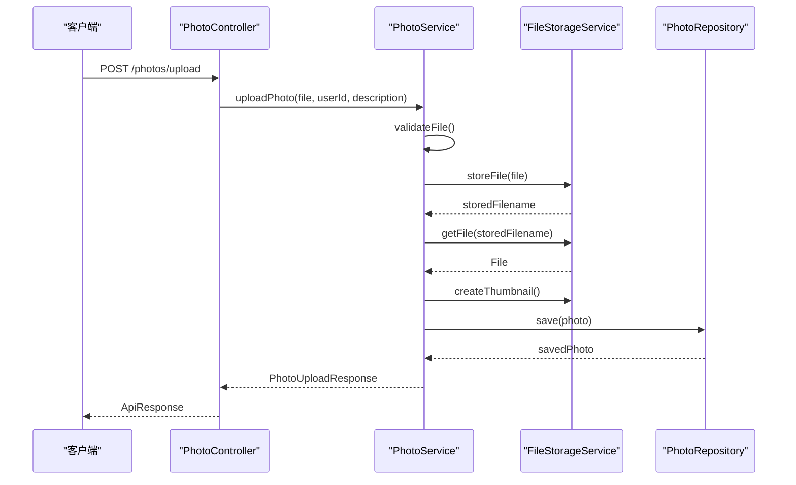
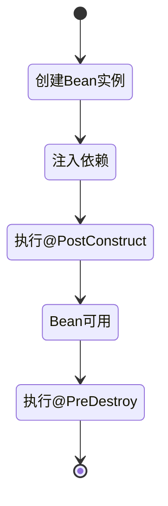
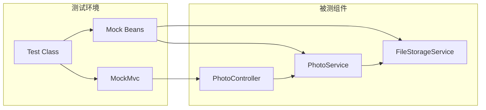

# 依赖注入模式

<cite>
**本文档引用的文件**
- [PhotoUploadApplication.java](file://src/main/java/com/photo/PhotoUploadApplication.java)
- [FileStorageService.java](file://src/main/java/com/photo/service/FileStorageService.java)
- [PhotoService.java](file://src/main/java/com/photo/service/PhotoService.java)
- [PhotoController.java](file://src/main/java/com/photo/controller/PhotoController.java)
- [FileStorageProperties.java](file://src/main/java/com/photo/config/FileStorageProperties.java)
- [SecurityProperties.java](file://src/main/java/com/photo/config/SecurityProperties.java)
- [application.yml](file://src/main/resources/application.yml)
- [PhotoControllerTest.java](file://src/test/java/com/photo/controller/PhotoControllerTest.java)
- [PhotoServiceTest.java](file://src/test/java/com/photo/service/PhotoServiceTest.java)
- [pom.xml](file://pom.xml)
</cite>

## 目录
1. [简介](#简介)
2. [项目结构](#项目结构)
3. [核心组件](#核心组件)
4. [架构概览](#架构概览)
5. [详细组件分析](#详细组件分析)
6. [依赖注入模式详解](#依赖注入模式详解)
7. [Bean生命周期管理](#bean生命周期管理)
8. [单元测试与模拟](#单元测试与模拟)
9. [性能考虑](#性能考虑)
10. [故障排除指南](#故障排除指南)
11. [结论](#结论)

## 简介

本项目展示了Spring框架中依赖注入模式的完整实现。通过@Autowired注解，系统实现了松耦合的设计架构，将业务逻辑层、数据访问层和表现层有效分离。本文档深入分析了FileStorageService、PhotoService、PhotoController等核心组件如何通过依赖注入实现模块间的解耦，以及Spring容器如何管理Bean的生命周期和依赖关系。

## 项目结构

项目采用标准的Spring Boot项目结构，按照功能层次组织代码：



**图表来源**
- [PhotoUploadApplication.java](file://src/main/java/com/photo/PhotoUploadApplication.java#L11-L19)
- [PhotoController.java](file://src/main/java/com/photo/controller/PhotoController.java#L35-L44)
- [PhotoService.java](file://src/main/java/com/photo/service/PhotoService.java#L36-L46)

**章节来源**
- [PhotoUploadApplication.java](file://src/main/java/com/photo/PhotoUploadApplication.java#L1-L20)
- [pom.xml](file://pom.xml#L30-L150)

## 核心组件

### 应用入口类

PhotoUploadApplication作为Spring Boot应用的入口点，启用了缓存和定时任务功能：



**图表来源**
- [PhotoUploadApplication.java](file://src/main/java/com/photo/PhotoUploadApplication.java#L11-L19)

### 控制器层

PhotoController作为REST API的入口，负责HTTP请求的接收和响应：

**章节来源**
- [PhotoController.java](file://src/main/java/com/photo/controller/PhotoController.java#L35-L44)

### 业务服务层

PhotoService和FileStorageService构成了核心业务逻辑层，实现了照片上传、存储管理和业务规则处理。

**章节来源**
- [PhotoService.java](file://src/main/java/com/photo/service/PhotoService.java#L36-L46)
- [FileStorageService.java](file://src/main/java/com/photo/service/FileStorageService.java#L24-L28)

## 架构概览

系统采用经典的三层架构模式，通过依赖注入实现模块间的松耦合：



**图表来源**
- [PhotoController.java](file://src/main/java/com/photo/controller/PhotoController.java#L35-L44)
- [PhotoService.java](file://src/main/java/com/photo/service/PhotoService.java#L36-L46)
- [FileStorageService.java](file://src/main/java/com/photo/service/FileStorageService.java#L24-L28)

## 详细组件分析

### PhotoController 分析

PhotoController展示了依赖注入在控制器层的应用：



**图表来源**
- [PhotoController.java](file://src/main/java/com/photo/controller/PhotoController.java#L35-L44)
- [PhotoService.java](file://src/main/java/com/photo/service/PhotoService.java#L36-L46)
- [FileStorageService.java](file://src/main/java/com/photo/service/FileStorageService.java#L24-L28)

**章节来源**
- [PhotoController.java](file://src/main/java/com/photo/controller/PhotoController.java#L50-L61)
- [PhotoController.java](file://src/main/java/com/photo/controller/PhotoController.java#L84-L117)

### PhotoService 分析

PhotoService是业务逻辑的核心，展示了复杂的依赖注入关系：



**图表来源**
- [PhotoController.java](file://src/main/java/com/photo/controller/PhotoController.java#L50-L61)
- [PhotoService.java](file://src/main/java/com/photo/service/PhotoService.java#L50-L111)
- [FileStorageService.java](file://src/main/java/com/photo/service/FileStorageService.java#L59-L95)

**章节来源**
- [PhotoService.java](file://src/main/java/com/photo/service/PhotoService.java#L50-L111)

### FileStorageService 分析

FileStorageService展示了文件存储的完整流程：

**章节来源**
- [FileStorageService.java](file://src/main/java/com/photo/service/FileStorageService.java#L36-L54)
- [FileStorageService.java](file://src/main/java/com/photo/service/FileStorageService.java#L59-L95)

## 依赖注入模式详解

### 字段注入模式

这是项目中最常用的注入方式，通过@Autowired注解直接注入到类的字段上：

```mermaid
flowchart TD
A[类声明] --> B[@Service/@Controller/@Repository]
B --> C[字段定义]
C --> D[@Autowired]
D --> E[Spring容器]
E --> F[自动装配]
F --> G[依赖注入]
style A fill:#e1f5fe
style B fill:#f3e5f5
style D fill:#fff3e0
style G fill:#e8f5e8
```

**图表来源**
- [FileStorageService.java](file://src/main/java/com/photo/service/FileStorageService.java#L26-L28)
- [PhotoService.java](file://src/main/java/com/photo/service/PhotoService.java#L38-L45)
- [PhotoController.java](file://src/main/java/com/photo/controller/PhotoController.java#L36-L43)

### 构造函数注入模式

虽然项目中主要使用字段注入，但Spring也支持构造函数注入方式：

**章节来源**
- [PhotoService.java](file://src/main/java/com/photo/service/PhotoService.java#L36-L46)

### Setter注入模式

项目中较少使用Setter注入，但Spring框架同样支持这种方式：

**章节来源**
- [FileStorageProperties.java](file://src/main/java/com/photo/config/FileStorageProperties.java#L14-L15)

### 注入方式对比

| 注入方式 | 优点 | 缺点 | 适用场景 |
|---------|------|------|----------|
| 字段注入 | 简单直观，代码量少 | 可测试性差，难以进行单元测试 | 快速原型开发 |
| 构造函数注入 | 不可变性好，易于测试 | 代码冗长，需要大量构造函数重载 | 生产环境核心组件 |
| Setter注入 | 灵活的依赖配置 | 生命周期管理复杂 | 可选依赖或动态配置 |

## Bean生命周期管理

Spring容器负责管理Bean的完整生命周期：



**图表来源**
- [FileStorageService.java](file://src/main/java/com/photo/service/FileStorageService.java#L36-L54)

### 初始化过程

FileStorageService展示了典型的Bean初始化流程：

**章节来源**
- [FileStorageService.java](file://src/main/java/com/photo/service/FileStorageService.java#L36-L54)

### 配置属性绑定

FileStorageProperties和SecurityProperties展示了配置属性的自动绑定机制：

**章节来源**
- [FileStorageProperties.java](file://src/main/java/com/photo/config/FileStorageProperties.java#L14-L15)
- [SecurityProperties.java](file://src/main/java/com/photo/config/SecurityProperties.java#L14-L15)

## 单元测试与模拟

依赖注入使得单元测试变得简单而强大：



**图表来源**
- [PhotoControllerTest.java](file://src/test/java/com/photo/controller/PhotoControllerTest.java#L34-L47)
- [PhotoServiceTest.java](file://src/test/java/com/photo/service/PhotoServiceTest.java#L28-L41)

### 测试策略

项目中的单元测试展示了依赖注入在测试中的优势：

**章节来源**
- [PhotoControllerTest.java](file://src/test/java/com/photo/controller/PhotoControllerTest.java#L37-L47)
- [PhotoServiceTest.java](file://src/test/java/com/photo/service/PhotoServiceTest.java#L31-L41)

### Mock Bean的使用

通过@MockBean注解，测试框架可以轻松替换真实的依赖：

**章节来源**
- [PhotoControllerTest.java](file://src/test/java/com/photo/controller/PhotoControllerTest.java#L40-L47)

## 性能考虑

依赖注入模式在性能方面的优势：

### 延迟初始化

Spring支持Bean的延迟初始化，只有在首次使用时才创建实例：

### 缓存机制

项目启用了Caffeine缓存，通过@EnableCaching注解启用：

**章节来源**
- [PhotoUploadApplication.java](file://src/main/java/com/photo/PhotoUploadApplication.java#L12-L13)

### 连接池优化

数据库连接池配置优化了资源使用效率：

**章节来源**
- [application.yml](file://src/main/resources/application.yml#L167-L172)

## 故障排除指南

### 常见依赖注入问题

1. **循环依赖问题**
   - Spring支持部分循环依赖，但应避免设计缺陷
   - 使用构造函数注入可以及早发现循环依赖

2. **作用域问题**
   - 单例Bean中的原型Bean注入问题
   - 使用ApplicationContextAware获取原型Bean

3. **条件注入问题**
   - @Conditional注解的使用
   - Profile相关的条件配置

### 调试技巧

1. **启用调试日志**
   ```yaml
   logging:
     level:
       org.springframework: DEBUG
   ```

2. **Bean定义检查**
   - 使用@PostConstruct验证Bean初始化
   - 检查@PreDestroy方法的执行

**章节来源**
- [application.yml](file://src/main/resources/application.yml#L147-L160)

## 结论

本项目完整展示了Spring框架中依赖注入模式的最佳实践。通过@Autowired注解，系统实现了：

1. **松耦合设计**：各层组件通过接口而非具体实现进行交互
2. **可测试性**：依赖注入使得单元测试和集成测试变得简单
3. **可维护性**：清晰的依赖关系便于代码维护和扩展
4. **灵活性**：Bean的作用域和生命周期管理提供了强大的配置能力

依赖注入模式不仅简化了对象创建和管理，更重要的是它改变了软件设计的思维方式，从"硬编码的依赖关系"转向"可配置的依赖关系"，为构建高质量的企业级应用奠定了坚实基础。