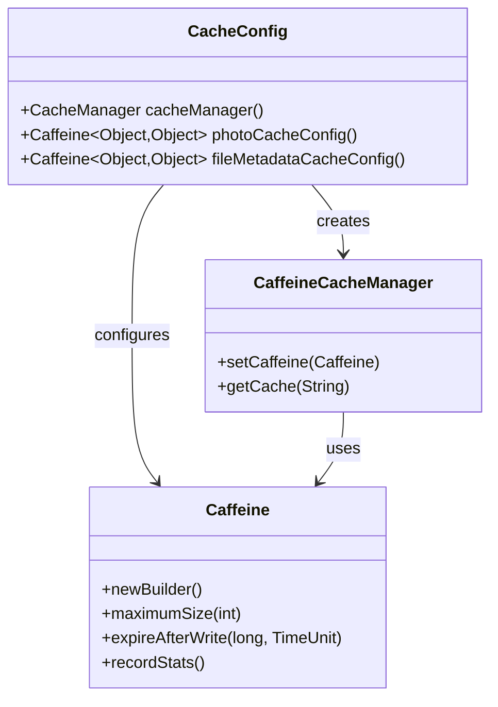
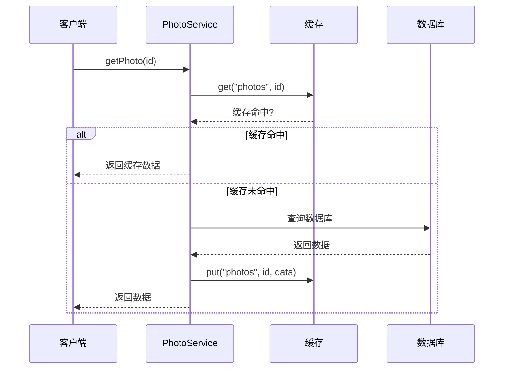
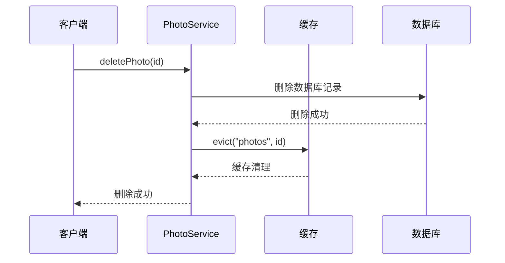
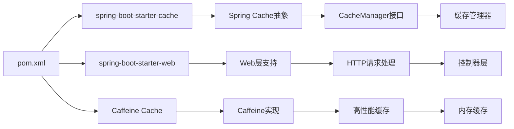

# 单例模式应用

<cite>
**本文档引用的文件**
- [CacheConfig.java](file://src/main/java/com/photo/config/CacheConfig.java)
- [PhotoUploadApplication.java](file://src/main/java/com/photo/PhotoUploadApplication.java)
- [application.yml](file://src/main/resources/application.yml)
- [PhotoService.java](file://src/main/java/com/photo/service/PhotoService.java)
- [pom.xml](file://pom.xml)
</cite>

## 目录
1. [简介](#简介)
2. [项目结构](#项目结构)
3. [核心组件](#核心组件)
4. [架构概览](#架构概览)
5. [详细组件分析](#详细组件分析)
6. [依赖关系分析](#依赖关系分析)
7. [性能考虑](#性能考虑)
8. [故障排除指南](#故障排除指南)
9. [结论](#结论)

## 简介

本文档深入探讨了Spring Boot应用中单例模式在缓存配置中的实现和应用。通过分析项目中的CacheConfig类，我们将详细解释如何利用Spring容器实现单例模式，确保缓存配置在整个应用生命周期内只有一个实例，从而实现内存优化、资源共享和配置一致性保证。

单例模式是软件设计中最常用的设计模式之一，它确保某个类仅有一个实例，并提供一个全局访问点。在Spring框架中，单例模式是默认的作用域，这使得缓存配置能够被整个应用程序共享使用。

## 项目结构

该项目采用标准的Spring Boot项目结构，其中缓存配置位于config包中，通过专门的配置类实现缓存管理功能。

```mermaid
graph TB
subgraph "应用启动"
A[PhotoUploadApplication] --> B[Spring Boot启动]
B --> C[组件扫描]
end
subgraph "配置层"
D[CacheConfig] --> E[缓存管理器]
D --> F[Caffeine配置]
G[application.yml] --> H[缓存属性]
end
subgraph "服务层"
I[PhotoService] --> J[缓存注解]
J --> K[@Cacheable]
J --> L[@CacheEvict]
end
A --> D
D --> I
G --> D
```

**图表来源**
- [PhotoUploadApplication.java](file://src/main/java/com/photo/PhotoUploadApplication.java#L11-L19)
- [CacheConfig.java](file://src/main/java/com/photo/config/CacheConfig.java#L15-L53)
- [application.yml](file://src/main/resources/application.yml#L50-L55)

**章节来源**
- [PhotoUploadApplication.java](file://src/main/java/com/photo/PhotoUploadApplication.java#L1-L20)
- [CacheConfig.java](file://src/main/java/com/photo/config/CacheConfig.java#L1-L54)
- [application.yml](file://src/main/resources/application.yml#L1-L190)

## 核心组件

### CacheConfig类分析

CacheConfig类是整个缓存系统的核心配置类，它通过Spring的@Configuration注解声明为配置类，并使用@EnableCaching启用缓存功能。

#### 主要特性

1. **单例模式实现**：作为@Configuration类，Spring会将其作为单例bean管理
2. **缓存管理器配置**：提供统一的缓存管理器实例
3. **Caffeine配置**：定义不同类型的缓存策略
4. **全局共享**：所有服务层组件都可以访问相同的缓存配置

#### 缓存配置策略

项目实现了多层次的缓存配置：

- **全局缓存管理器**：设置通用的缓存参数
- **照片信息缓存**：针对照片数据的专用缓存
- **文件元数据缓存**：针对文件元数据的专用缓存

**章节来源**
- [CacheConfig.java](file://src/main/java/com/photo/config/CacheConfig.java#L12-L53)

## 架构概览

```mermaid
graph TB
subgraph "Spring容器"
A[CacheConfig单例] --> B[CacheManager]
A --> C[Caffeine配置]
end
subgraph "应用层"
D[PhotoService] --> E[缓存注解]
E --> F[@Cacheable]
E --> G[@CacheEvict]
end
subgraph "缓存层"
H[内存缓存]
I[统计信息]
J[过期策略]
end
B --> H
C --> I
F --> H
G --> H
H --> J
```

**图表来源**
- [CacheConfig.java](file://src/main/java/com/photo/config/CacheConfig.java#L22-L52)
- [PhotoService.java](file://src/main/java/com/photo/service/PhotoService.java#L12-L13)

## 详细组件分析

### CacheConfig类详细分析

CacheConfig类通过以下机制实现单例模式：

#### 类结构设计



**图表来源**
- [CacheConfig.java](file://src/main/java/com/photo/config/CacheConfig.java#L15-L53)

#### 缓存配置实现

CacheConfig类提供了三种不同的缓存配置：

1. **全局缓存管理器**：设置通用的缓存参数
2. **照片信息缓存**：针对照片数据的专用缓存
3. **文件元数据缓存**：针对文件元数据的专用缓存

每个配置都包含：
- **容量限制**：防止内存无限增长
- **过期策略**：自动清理过期数据
- **统计信息**：监控缓存性能

**章节来源**
- [CacheConfig.java](file://src/main/java/com/photo/config/CacheConfig.java#L22-L52)

### 缓存注解使用分析

PhotoService类展示了如何在实际业务中使用缓存注解：

#### @Cacheable注解使用



**图表来源**
- [PhotoService.java](file://src/main/java/com/photo/service/PhotoService.java#L141-L151)

#### @CacheEvict注解使用



**图表来源**
- [PhotoService.java](file://src/main/java/com/photo/service/PhotoService.java#L193-L205)

**章节来源**
- [PhotoService.java](file://src/main/java/com/photo/service/PhotoService.java#L141-L205)

### Spring容器中的单例管理

```mermaid
flowchart TD
A[应用启动] --> B[Spring容器初始化]
B --> C[扫描@Configuration类]
C --> D[创建CacheConfig实例]
D --> E[注册为单例bean]
E --> F[创建缓存管理器]
F --> G[配置Caffeine参数]
G --> H[缓存系统就绪]
I[服务层请求] --> J[获取缓存管理器]
J --> K[检查缓存]
K --> L[返回缓存数据]
M[数据更新] --> N[清理缓存]
N --> O[保持数据一致性]
```

**图表来源**
- [PhotoUploadApplication.java](file://src/main/java/com/photo/PhotoUploadApplication.java#L11-L19)
- [CacheConfig.java](file://src/main/java/com/photo/config/CacheConfig.java#L22-L30)

**章节来源**
- [PhotoUploadApplication.java](file://src/main/java/com/photo/PhotoUploadApplication.java#L11-L19)

## 依赖关系分析

### Maven依赖配置

项目通过Maven依赖管理缓存相关的组件：



**图表来源**
- [pom.xml](file://pom.xml#L55-L113)

### 缓存配置依赖

项目中的缓存配置依赖于多个组件的协同工作：

1. **Spring Boot自动配置**：提供基础的缓存支持
2. **Caffeine实现**：提供高性能的内存缓存
3. **应用配置**：通过application.yml定义缓存参数

**章节来源**
- [pom.xml](file://pom.xml#L55-L113)
- [application.yml](file://src/main/resources/application.yml#L50-L55)

## 性能考虑

### 内存优化策略

单例模式在缓存管理中的性能优势主要体现在：

1. **内存共享**：所有组件共享同一个缓存实例，避免重复占用内存
2. **资源复用**：缓存管理器和Caffeine配置只创建一次
3. **配置一致性**：确保所有缓存操作使用相同的配置参数

### 缓存性能监控

项目通过以下方式监控缓存性能：

- **统计信息记录**：使用recordStats()方法收集缓存统计数据
- **容量限制**：通过maximumSize()防止内存溢出
- **过期策略**：通过expireAfterWrite()自动清理过期数据

### 缓存命中率优化

为了提高缓存命中率，项目采用了以下策略：

- **合理的缓存键设计**：使用业务标识符作为缓存键
- **适当的过期时间**：根据数据变化频率设置合适的过期时间
- **分层缓存策略**：针对不同类型的数据使用不同的缓存配置

## 故障排除指南

### 常见问题及解决方案

#### 缓存不生效

**问题描述**：使用@Cacheable注解但缓存没有生效

**可能原因**：
1. 缓存注解未正确配置
2. 缓存管理器未正确初始化
3. 方法不是public修饰符

**解决方案**：
- 确保方法是public修饰符
- 检查@EnableCaching注解是否正确配置
- 验证缓存键的唯一性

#### 缓存数据不一致

**问题描述**：更新数据后缓存仍然返回旧数据

**可能原因**：
- 缓存清理注解未正确配置
- 缓存键设计不当
- 多线程环境下缓存竞争

**解决方案**：
- 检查@CacheEvict注解的配置
- 确保缓存键包含足够的区分信息
- 使用适当的同步机制

#### 内存泄漏

**问题描述**：应用运行一段时间后内存使用持续增长

**可能原因**：
- 缓存容量设置过大
- 缓存过期策略不当
- 缓存键过多导致内存占用

**解决方案**：
- 调整maximumSize()参数
- 优化expireAfterWrite()策略
- 定期清理无用的缓存键

**章节来源**
- [CacheConfig.java](file://src/main/java/com/photo/config/CacheConfig.java#L25-L28)
- [PhotoService.java](file://src/main/java/com/photo/service/PhotoService.java#L193-L205)

## 结论

通过分析项目中的CacheConfig类，我们可以看到Spring Boot应用中单例模式在缓存配置中的完美应用。CacheConfig类作为@Configuration类，天然具备单例特性，确保了缓存配置在整个应用生命周期内的唯一性和一致性。

### 主要优势总结

1. **内存优化**：单例模式避免了重复的缓存实例创建，节省内存资源
2. **资源共享**：所有服务层组件共享同一个缓存管理器，提高了资源利用率
3. **配置一致性**：统一的缓存配置确保了所有缓存操作的一致性
4. **性能提升**：减少了对象创建和销毁的开销，提升了整体性能

### 最佳实践建议

1. **合理设计缓存层次**：根据数据特点设计不同的缓存策略
2. **监控缓存性能**：定期检查缓存命中率和内存使用情况
3. **优化缓存配置**：根据实际需求调整缓存容量和过期时间
4. **错误处理机制**：建立完善的缓存异常处理和恢复机制

通过这种单例模式的应用，项目实现了高效的缓存管理，为后续的功能扩展奠定了良好的基础。