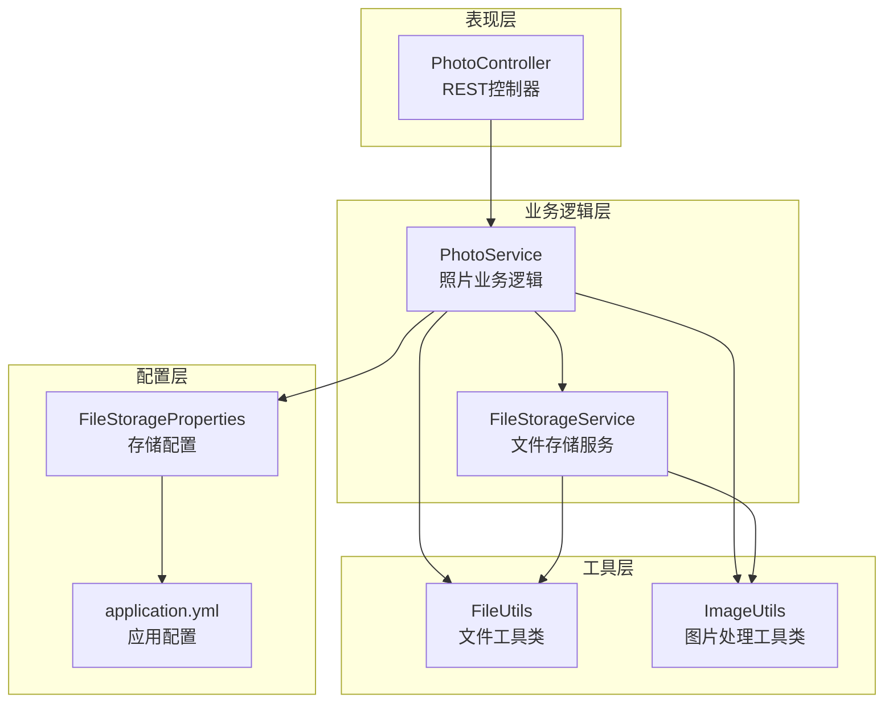
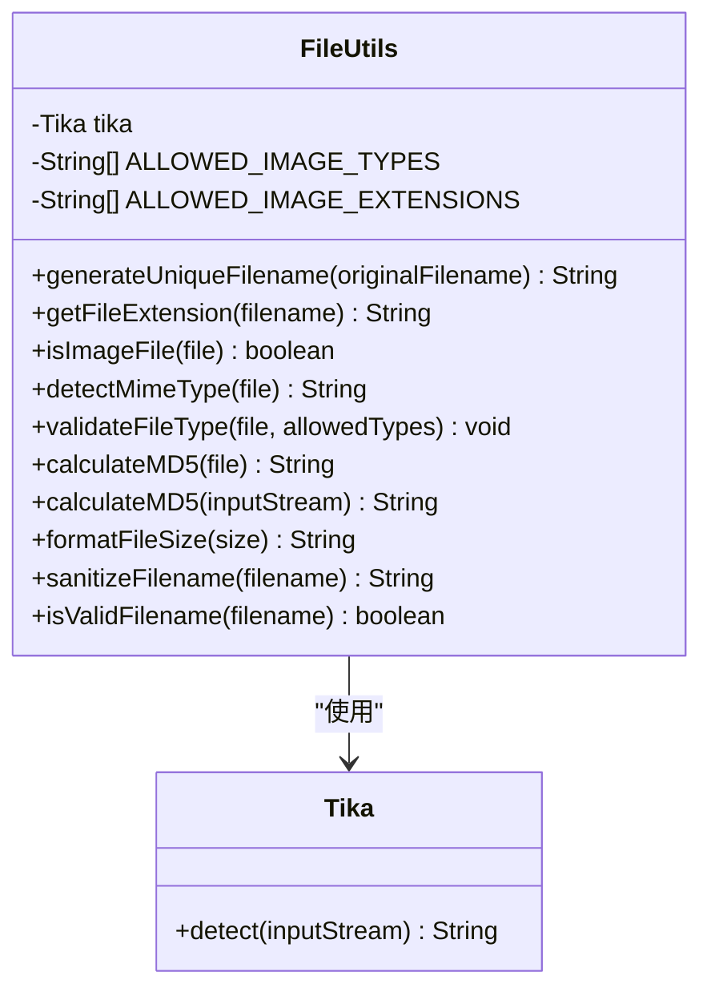
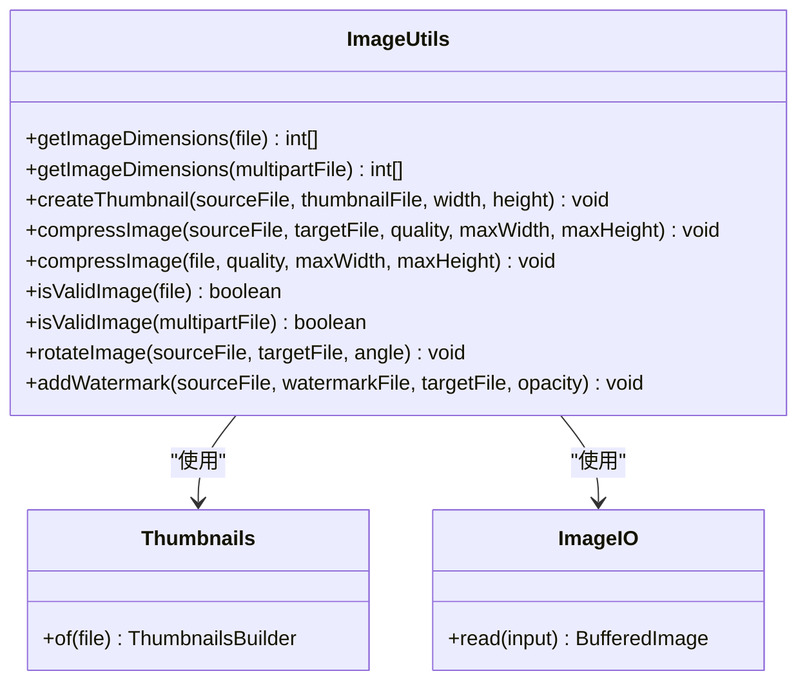
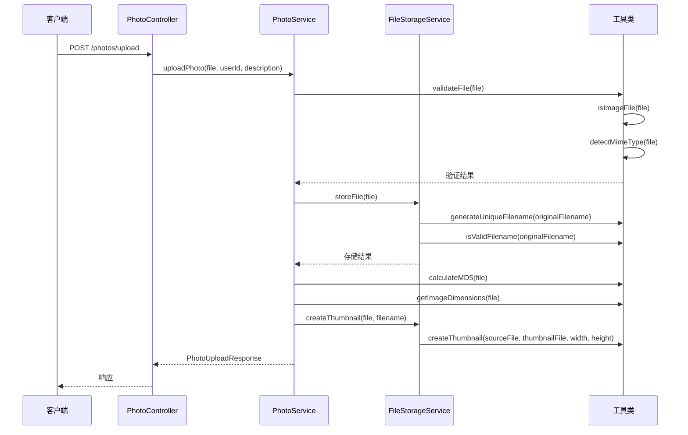
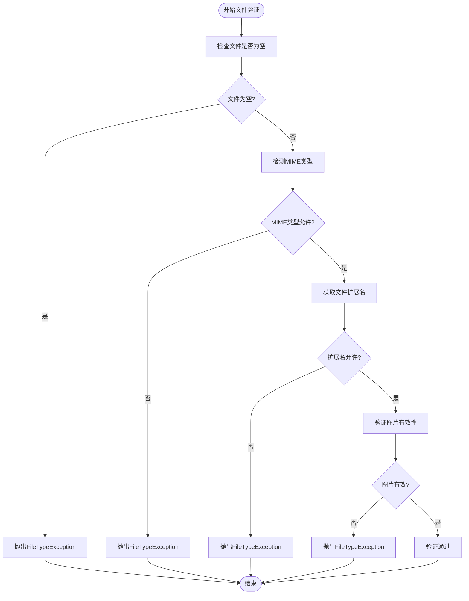
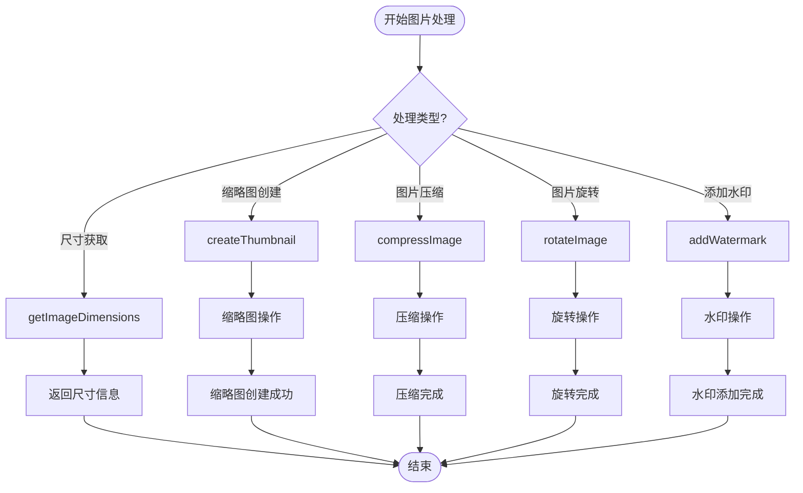
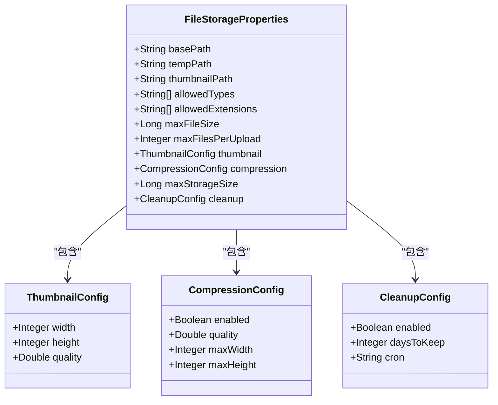
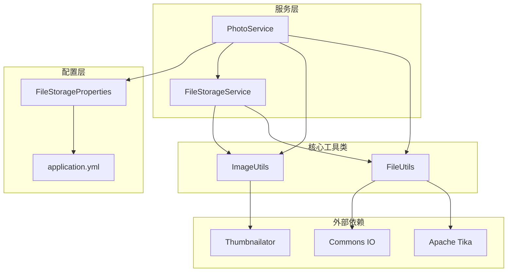

# 工厂模式应用

<cite>
**本文档引用的文件**
- [FileUtils.java](file://src/main/java/com/photo/util/FileUtils.java)
- [ImageUtils.java](file://src/main/java/com/photo/util/ImageUtils.java)
- [FileStorageService.java](file://src/main/java/com/photo/service/FileStorageService.java)
- [PhotoService.java](file://src/main/java/com/photo/service/PhotoService.java)
- [application.yml](file://src/main/resources/application.yml)
- [FileStorageProperties.java](file://src/main/java/com/photo/config/FileStorageProperties.java)
- [FileUtilsTest.java](file://src/test/java/com/photo/util/FileUtilsTest.java)
</cite>

## 目录
1. [简介](#简介)
2. [项目结构](#项目结构)
3. [核心组件](#核心组件)
4. [架构概览](#架构概览)
5. [详细组件分析](#详细组件分析)
6. [依赖关系分析](#依赖关系分析)
7. [性能考虑](#性能考虑)
8. [故障排除指南](#故障排除指南)
9. [结论](#结论)

## 简介

本文档深入分析了照片上传系统中文件处理工具的工厂模式应用。虽然项目没有实现传统的工厂模式（如工厂方法或抽象工厂），但FileUtils和ImageUtils提供了静态工厂方法来创建和管理文件处理工具，实现了对象创建的封装和统一接口。

该系统通过工厂模式实现了以下目标：
- 封装文件类型识别的复杂性
- 提供统一的图片处理接口
- 实现灵活的对象创建和管理
- 支持多种文件格式的处理

## 项目结构

项目采用标准的Spring Boot三层架构，重点关注文件处理和图片管理功能：



**图表来源**
- [PhotoController.java](file://src/main/java/com/photo/controller/PhotoController.java#L1-L200)
- [PhotoService.java](file://src/main/java/com/photo/service/PhotoService.java#L1-L385)
- [FileStorageService.java](file://src/main/java/com/photo/service/FileStorageService.java#L1-L300)

**章节来源**
- [PhotoController.java](file://src/main/java/com/photo/controller/PhotoController.java#L1-L200)
- [PhotoService.java](file://src/main/java/com/photo/service/PhotoService.java#L1-L385)
- [FileStorageService.java](file://src/main/java/com/photo/service/FileStorageService.java#L1-L300)

## 核心组件

### 文件工具类 (FileUtils)

FileUtils是一个静态工具类，提供了文件处理的核心功能：



**图表来源**
- [FileUtils.java](file://src/main/java/com/photo/util/FileUtils.java#L19-L178)

### 图片处理工具类 (ImageUtils)

ImageUtils提供了图片处理的静态方法：



**图表来源**
- [ImageUtils.java](file://src/main/java/com/photo/util/ImageUtils.java#L16-L182)

**章节来源**
- [FileUtils.java](file://src/main/java/com/photo/util/FileUtils.java#L1-L178)
- [ImageUtils.java](file://src/main/java/com/photo/util/ImageUtils.java#L1-L182)

## 架构概览

系统采用分层架构，通过工厂模式实现松耦合的设计：



**图表来源**
- [PhotoController.java](file://src/main/java/com/photo/controller/PhotoController.java#L48-L61)
- [PhotoService.java](file://src/main/java/com/photo/service/PhotoService.java#L50-L111)
- [FileStorageService.java](file://src/main/java/com/photo/service/FileStorageService.java#L59-L95)

## 详细组件分析

### 文件类型识别工厂

FileUtils实现了文件类型识别的工厂模式：



**图表来源**
- [FileUtils.java](file://src/main/java/com/photo/util/FileUtils.java#L56-L102)
- [PhotoService.java](file://src/main/java/com/photo/service/PhotoService.java#L304-L324)

### 图片处理工厂

ImageUtils提供了多种图片处理操作的工厂方法：



**图表来源**
- [ImageUtils.java](file://src/main/java/com/photo/util/ImageUtils.java#L21-L180)

### 存储配置工厂

FileStorageProperties提供了存储配置的工厂方法：



**图表来源**
- [FileStorageProperties.java](file://src/main/java/com/photo/config/FileStorageProperties.java#L15-L93)

**章节来源**
- [FileUtils.java](file://src/main/java/com/photo/util/FileUtils.java#L56-L102)
- [ImageUtils.java](file://src/main/java/com/photo/util/ImageUtils.java#L53-L180)
- [FileStorageProperties.java](file://src/main/java/com/photo/config/FileStorageProperties.java#L15-L93)

## 依赖关系分析

系统中的依赖关系体现了工厂模式的应用：



**图表来源**
- [PhotoService.java](file://src/main/java/com/photo/service/PhotoService.java#L1-L385)
- [FileStorageService.java](file://src/main/java/com/photo/service/FileStorageService.java#L1-L300)
- [FileUtils.java](file://src/main/java/com/photo/util/FileUtils.java#L1-L178)
- [ImageUtils.java](file://src/main/java/com/photo/util/ImageUtils.java#L1-L182)

**章节来源**
- [PhotoService.java](file://src/main/java/com/photo/service/PhotoService.java#L1-L385)
- [FileStorageService.java](file://src/main/java/com/photo/service/FileStorageService.java#L1-L300)

## 性能考虑

### 工厂方法的性能特征

1. **静态方法优势**：
   - 无需实例化即可使用
   - 减少内存分配开销
   - 提高方法调用效率

2. **缓存策略**：
   - Tika实例在类级别缓存
   - 避免重复创建昂贵的对象

3. **流式处理**：
   - MD5计算支持InputStream流式处理
   - 支持大文件的高效处理

### 优化建议

1. **异步处理**：
   ```java
   // 可以考虑将耗时操作异步化
   CompletableFuture.runAsync(() -> {
       createThumbnail(sourceFile, thumbnailFile, width, height);
   });
   ```

2. **连接池管理**：
   - 对于数据库连接，使用连接池
   - 对于文件系统操作，考虑缓存策略

3. **资源管理**：
   - 确保InputStream正确关闭
   - 使用try-with-resources语句

## 故障排除指南

### 常见问题及解决方案

1. **文件类型验证失败**：
   - 检查MIME类型检测
   - 验证文件扩展名匹配
   - 确认allowedTypes配置

2. **图片处理异常**：
   - 检查图片格式支持
   - 验证文件完整性
   - 确认磁盘空间充足

3. **存储路径问题**：
   - 验证basePath配置
   - 检查目录权限
   - 确认路径规范化

**章节来源**
- [FileUtils.java](file://src/main/java/com/photo/util/FileUtils.java#L84-L102)
- [ImageUtils.java](file://src/main/java/com/photo/util/ImageUtils.java#L53-L99)
- [FileStorageService.java](file://src/main/java/com/photo/service/FileStorageService.java#L146-L183)

## 结论

该照片上传系统通过FileUtils和ImageUtils实现了广义的工厂模式应用，主要体现在：

1. **封装复杂性**：将文件类型识别、图片处理等复杂逻辑封装在静态工厂方法中
2. **统一接口**：提供一致的API接口，简化客户端使用
3. **灵活扩展**：通过配置文件实现参数化配置，支持灵活的对象创建
4. **性能优化**：使用静态方法减少实例化开销，提高执行效率

虽然项目没有实现传统的工厂方法模式，但通过静态工具类的形式，同样达到了工厂模式的核心目标——封装对象创建的复杂性并提供统一的创建接口。这种设计使得系统具有良好的可维护性和扩展性，为后续的功能扩展奠定了坚实的基础。