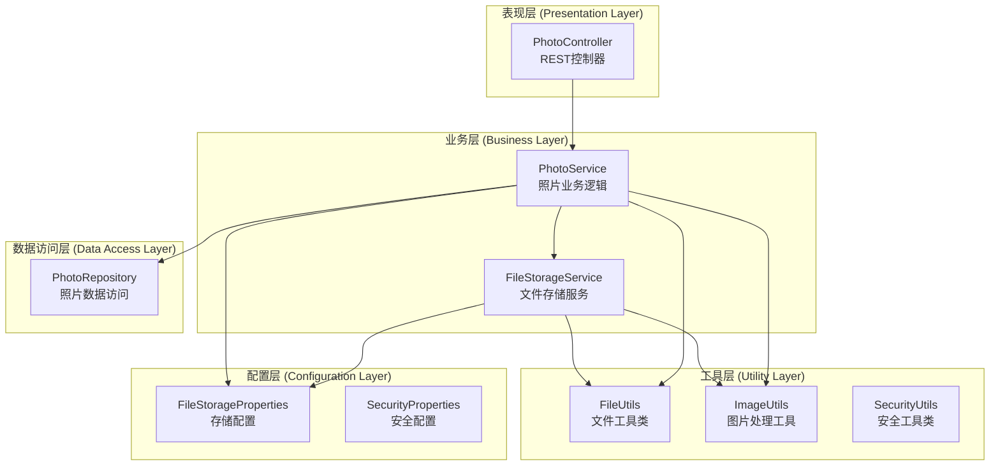
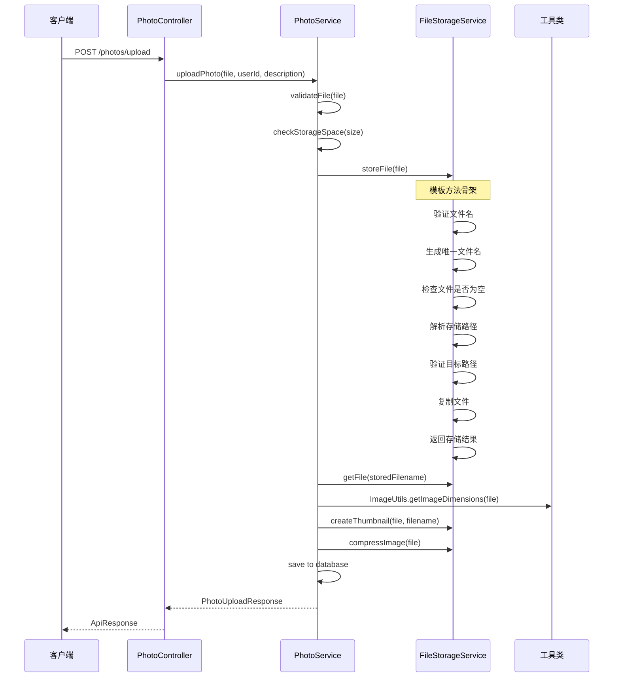
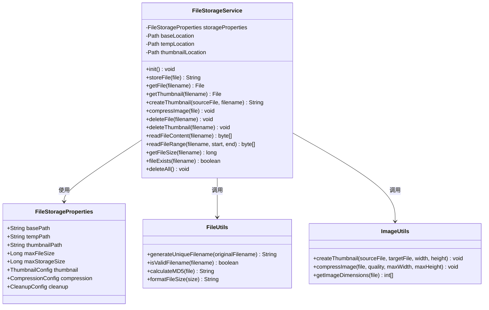
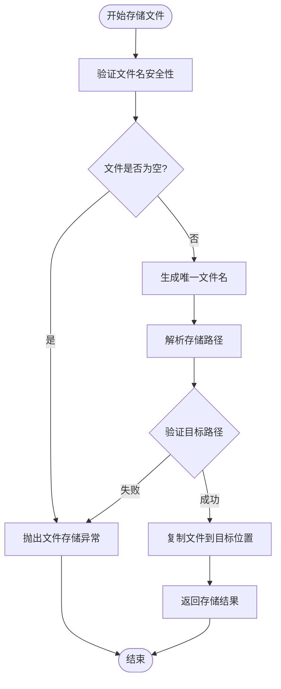
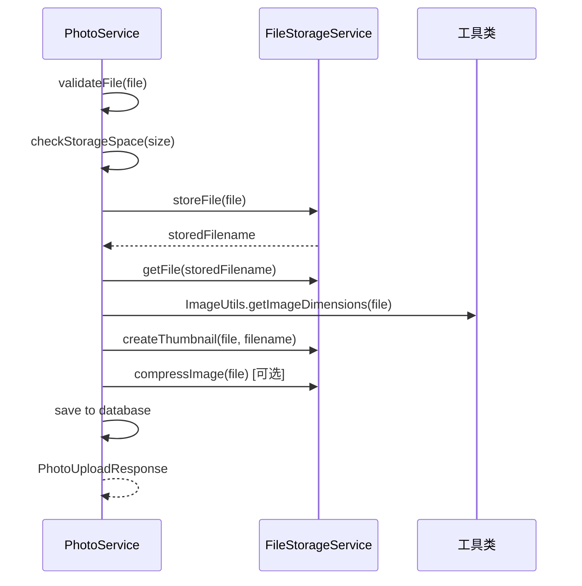
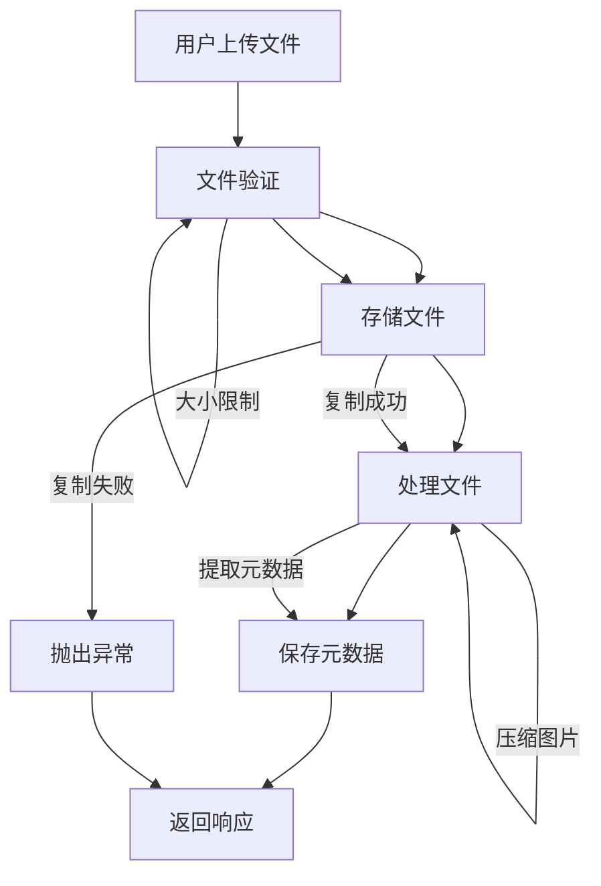
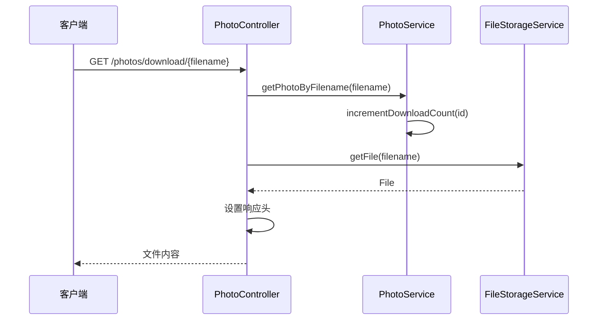
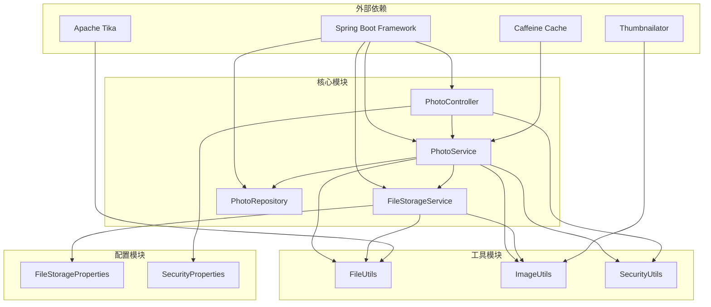

# 模板方法模式

<cite>
**本文档引用的文件**
- [FileStorageService.java](file://src/main/java/com/photo/service/FileStorageService.java)
- [PhotoService.java](file://src/main/java/com/photo/service/PhotoService.java)
- [FileUtils.java](file://src/main/java/com/photo/util/FileUtils.java)
- [ImageUtils.java](file://src/main/java/com/photo/util/ImageUtils.java)
- [FileStorageProperties.java](file://src/main/java/com/photo/config/FileStorageProperties.java)
- [PhotoController.java](file://src/main/java/com/photo/controller/PhotoController.java)
- [GlobalExceptionHandler.java](file://src/main/java/com/photo/exception/GlobalExceptionHandler.java)
</cite>

## 目录
1. [简介](#简介)
2. [项目结构](#项目结构)
3. [核心组件](#核心组件)
4. [架构概览](#架构概览)
5. [详细组件分析](#详细组件分析)
6. [模板方法模式实现](#模板方法模式实现)
7. [依赖关系分析](#依赖关系分析)
8. [性能考虑](#性能考虑)
9. [故障排除指南](#故障排除指南)
10. [结论](#结论)

## 简介

模板方法模式是一种行为型设计模式，它定义了一个算法的骨架，允许子类重写特定步骤而不改变算法的整体结构。在本项目中，文件存储服务通过模板方法模式实现了统一的文件处理流程，确保所有文件操作都遵循相同的验证、处理和清理步骤。

该项目是一个基于Spring Boot的企业级照片上传下载系统，提供了完整的文件管理功能，包括上传、下载、在线预览、断点续传等。系统采用分层架构设计，通过模板方法模式实现了文件处理流程的标准化和可扩展性。

## 项目结构

项目采用标准的Spring Boot分层架构，主要包含以下层次：

**图表来源**
- [PhotoController.java](file://src/main/java/com/photo/controller/PhotoController.java#L1-L200)
- [PhotoService.java](file://src/main/java/com/photo/service/PhotoService.java#L1-L200)
- [FileStorageService.java](file://src/main/java/com/photo/service/FileStorageService.java#L1-L300)

**章节来源**
- [PhotoController.java](file://src/main/java/com/photo/controller/PhotoController.java#L1-L200)
- [PhotoService.java](file://src/main/java/com/photo/service/PhotoService.java#L1-L200)
- [FileStorageService.java](file://src/main/java/com/photo/service/FileStorageService.java#L1-L300)

## 核心组件

### 文件存储服务 (FileStorageService)

FileStorageService是模板方法模式的核心实现，负责统一管理文件的存储、检索、处理和清理。该服务提供了完整的文件生命周期管理能力：

- **文件验证**: 验证文件名安全性、文件类型和文件大小
- **路径解析**: 解析和验证存储路径，防止路径遍历攻击
- **文件复制**: 安全地复制文件到指定位置
- **文件操作**: 提供文件读取、删除、重命名等基础操作
- **图片处理**: 支持缩略图生成、图片压缩等功能

### 照片服务 (PhotoService)

PhotoService作为业务层的核心，使用FileStorageService提供的模板方法来实现照片上传的完整流程。它包含了业务逻辑的验证和处理步骤。

### 工具类 (FileUtils, ImageUtils)

工具类提供了文件处理和图片处理的具体实现，这些方法在模板方法模式中作为可变步骤被调用。

**章节来源**
- [FileStorageService.java](file://src/main/java/com/photo/service/FileStorageService.java#L1-L300)
- [PhotoService.java](file://src/main/java/com/photo/service/PhotoService.java#L1-L200)
- [FileUtils.java](file://src/main/java/com/photo/util/FileUtils.java#L1-L178)
- [ImageUtils.java](file://src/main/java/com/photo/util/ImageUtils.java#L1-L200)

## 架构概览

系统采用经典的三层架构模式，通过模板方法模式实现了文件处理流程的标准化：

**图表来源**
- [PhotoController.java](file://src/main/java/com/photo/controller/PhotoController.java#L48-L61)
- [PhotoService.java](file://src/main/java/com/photo/service/PhotoService.java#L50-L111)
- [FileStorageService.java](file://src/main/java/com/photo/service/FileStorageService.java#L59-L95)

## 详细组件分析

### FileStorageService 类分析

FileStorageService实现了完整的文件存储模板方法，定义了文件处理的标准流程：

**图表来源**
- [FileStorageService.java](file://src/main/java/com/photo/service/FileStorageService.java#L24-L300)
- [FileStorageProperties.java](file://src/main/java/com/photo/config/FileStorageProperties.java#L15-L93)
- [FileUtils.java](file://src/main/java/com/photo/util/FileUtils.java#L19-L178)
- [ImageUtils.java](file://src/main/java/com/photo/util/ImageUtils.java#L1-L200)

### 模板方法骨架分析

FileStorageService中的storeFile方法展示了模板方法模式的核心实现：

**图表来源**
- [FileStorageService.java](file://src/main/java/com/photo/service/FileStorageService.java#L59-L95)

### PhotoService 业务流程

PhotoService作为业务层，使用FileStorageService的模板方法来实现照片上传的完整流程：

**图表来源**
- [PhotoService.java](file://src/main/java/com/photo/service/PhotoService.java#L50-L111)

**章节来源**
- [FileStorageService.java](file://src/main/java/com/photo/service/FileStorageService.java#L1-L300)
- [PhotoService.java](file://src/main/java/com/photo/service/PhotoService.java#L1-L200)

## 模板方法模式实现

### 定义算法骨架

模板方法模式在本项目中的实现体现在FileStorageService中，它定义了文件处理的标准流程：

**公共步骤（固定不变）**:
1. 文件名验证和清理
2. 唯一文件名生成
3. 文件大小和类型检查
4. 路径解析和验证
5. 文件复制操作
6. 错误处理和日志记录

**可变步骤（可重写）**:
1. 文件类型验证策略
2. 图片处理算法（缩略图生成、压缩）
3. 存储策略配置

### 具体实现示例

#### 文件上传流程

**图表来源**
- [PhotoService.java](file://src/main/java/com/photo/service/PhotoService.java#L50-L111)
- [FileStorageService.java](file://src/main/java/com/photo/service/FileStorageService.java#L59-L95)

#### 文件下载流程

**图表来源**
- [PhotoController.java](file://src/main/java/com/photo/controller/PhotoController.java#L149-L179)

### 模板方法模式的优势

1. **代码复用**: 通过定义标准的文件处理流程，避免重复代码
2. **扩展性**: 允许在不改变整体流程的情况下添加新的处理步骤
3. **一致性**: 确保所有文件操作都遵循相同的安全和验证规则
4. **维护性**: 集中管理文件处理逻辑，便于维护和调试

**章节来源**
- [FileStorageService.java](file://src/main/java/com/photo/service/FileStorageService.java#L1-L300)
- [PhotoService.java](file://src/main/java/com/photo/service/PhotoService.java#L1-L200)

## 依赖关系分析

系统各组件之间的依赖关系体现了清晰的分层架构：

**图表来源**
- [PhotoController.java](file://src/main/java/com/photo/controller/PhotoController.java#L1-L200)
- [PhotoService.java](file://src/main/java/com/photo/service/PhotoService.java#L1-L200)
- [FileStorageService.java](file://src/main/java/com/photo/service/FileStorageService.java#L1-L300)

**章节来源**
- [PhotoController.java](file://src/main/java/com/photo/controller/PhotoController.java#L1-L200)
- [PhotoService.java](file://src/main/java/com/photo/service/PhotoService.java#L1-L200)
- [FileStorageService.java](file://src/main/java/com/photo/service/FileStorageService.java#L1-L300)

## 性能考虑

### 缓存策略

系统采用了多层缓存机制来提升性能：

1. **Caffeine缓存**: 使用Caffeine作为本地缓存，缓存照片元数据
2. **HTTP缓存**: 通过Cache-Control头设置浏览器缓存策略
3. **数据库索引**: 对常用查询字段建立索引优化查询性能

### 异步处理

对于耗时的操作，系统采用了异步处理机制：

1. **图片压缩**: 在后台异步执行，不影响主流程
2. **缩略图生成**: 异步生成，提高用户体验
3. **定期清理**: 使用定时任务定期清理过期文件

### 资源管理

系统实现了完善的资源管理机制：

1. **文件流管理**: 使用try-with-resources确保文件流正确关闭
2. **内存管理**: 对于大文件采用流式处理，避免内存溢出
3. **连接池**: 数据库连接使用连接池管理

## 故障排除指南

### 常见问题及解决方案

#### 文件存储异常

**问题**: 文件存储失败
**原因**: 权限不足、磁盘空间不足、路径不存在
**解决方案**: 
1. 检查存储目录权限
2. 确认磁盘空间充足
3. 验证存储路径配置

#### 文件类型验证失败

**问题**: 文件类型检测失败
**原因**: 文件损坏、MIME类型不匹配
**解决方案**:
1. 检查文件完整性
2. 验证允许的文件类型配置
3. 更新Apache Tika依赖

#### 图片处理异常

**问题**: 缩略图生成失败
**原因**: 图片格式不支持、内存不足
**解决方案**:
1. 检查图片格式兼容性
2. 增加JVM内存配置
3. 优化图片处理参数

**章节来源**
- [GlobalExceptionHandler.java](file://src/main/java/com/photo/exception/GlobalExceptionHandler.java#L16-L92)
- [FileStorageService.java](file://src/main/java/com/photo/service/FileStorageService.java#L1-L300)

## 结论

本项目成功地将模板方法模式应用于文件处理流程中，通过定义标准的算法骨架和允许可变步骤的重写，实现了代码的高度复用和良好的扩展性。

### 主要成果

1. **标准化流程**: 通过模板方法模式定义了统一的文件处理流程
2. **安全保证**: 实现了多层次的安全防护机制
3. **性能优化**: 采用缓存、异步处理等技术提升系统性能
4. **可维护性**: 清晰的分层架构和完善的异常处理机制

### 设计优势

- **模板方法模式**: 确保文件处理流程的一致性和安全性
- **分层架构**: 清晰的职责分离，便于维护和扩展
- **工具类复用**: FileUtils和ImageUtils提供了通用的功能实现
- **配置驱动**: 通过配置文件灵活调整系统行为

该实现为类似的企业级文件管理系统提供了优秀的参考模板，展示了如何通过设计模式解决实际的工程问题。