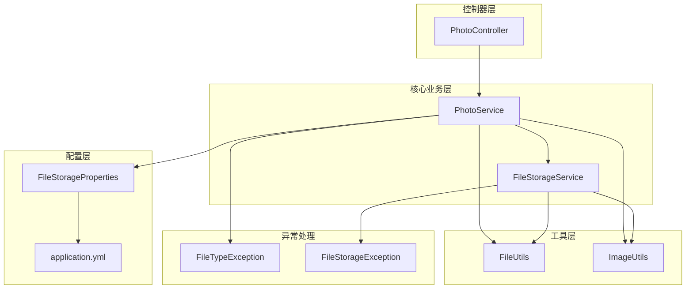
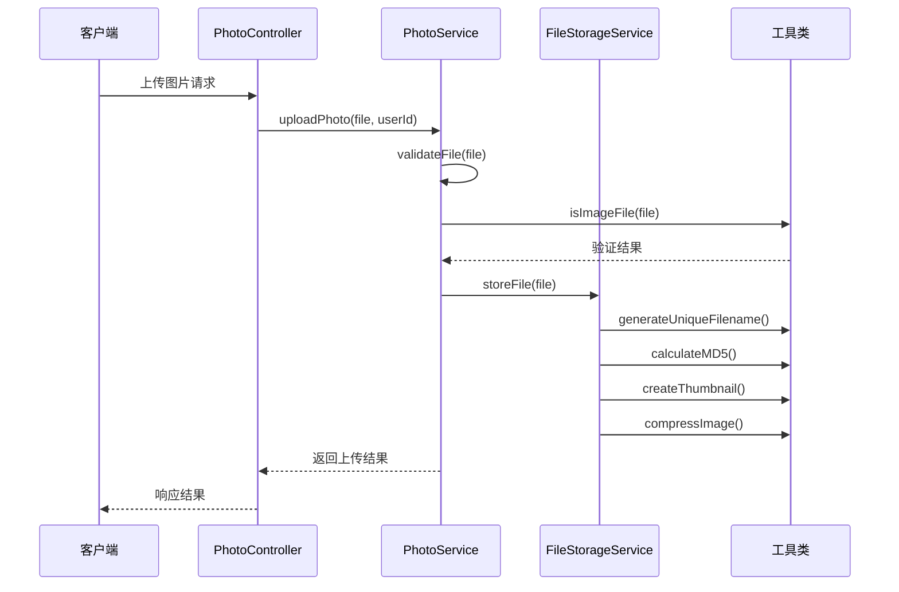
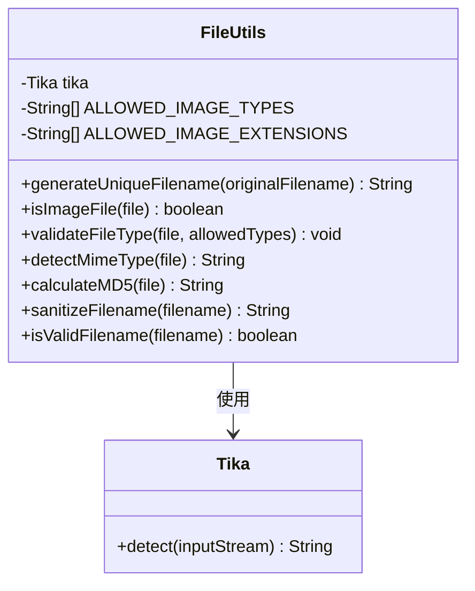
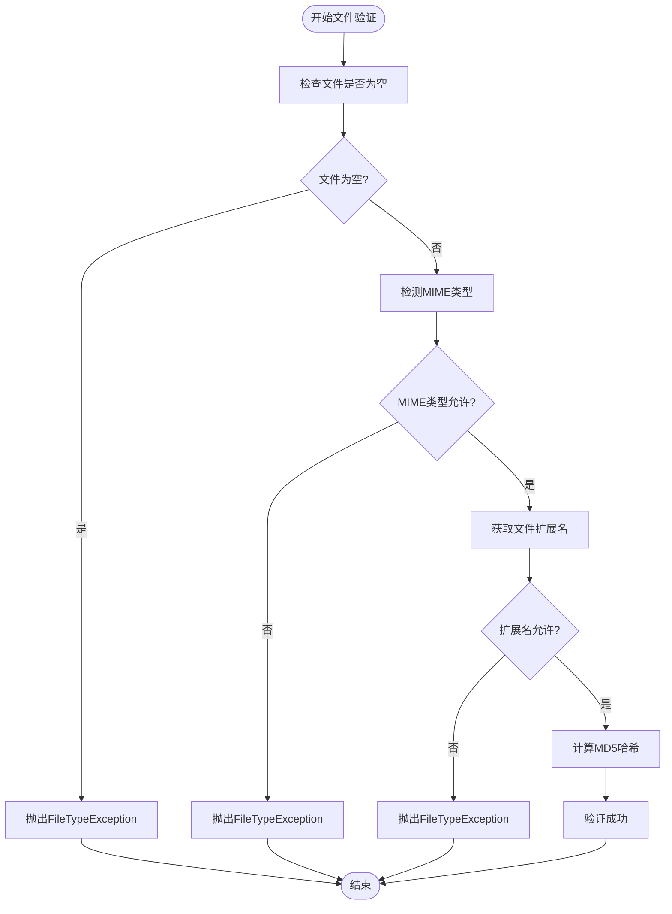
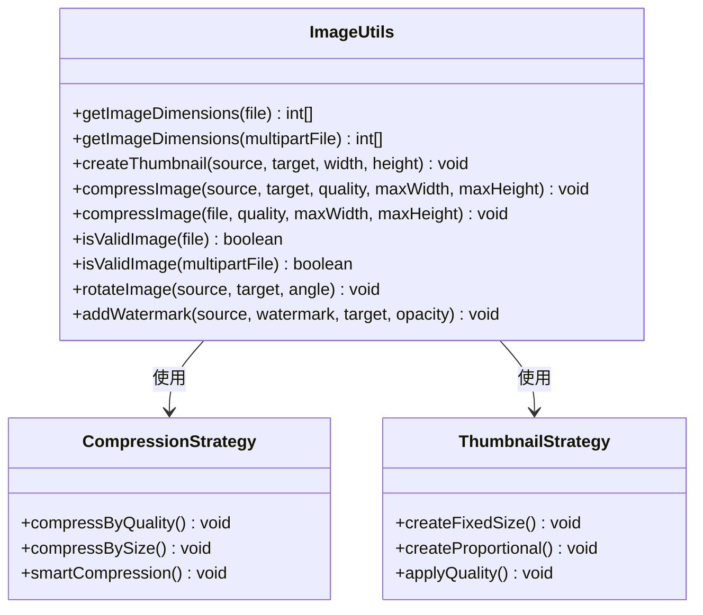
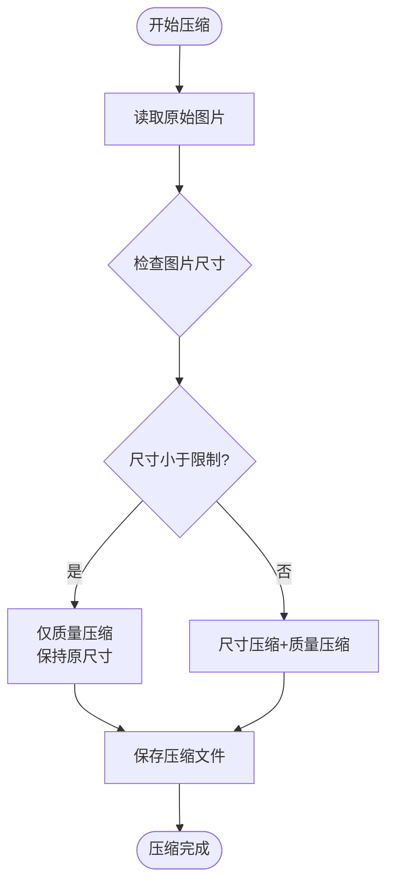
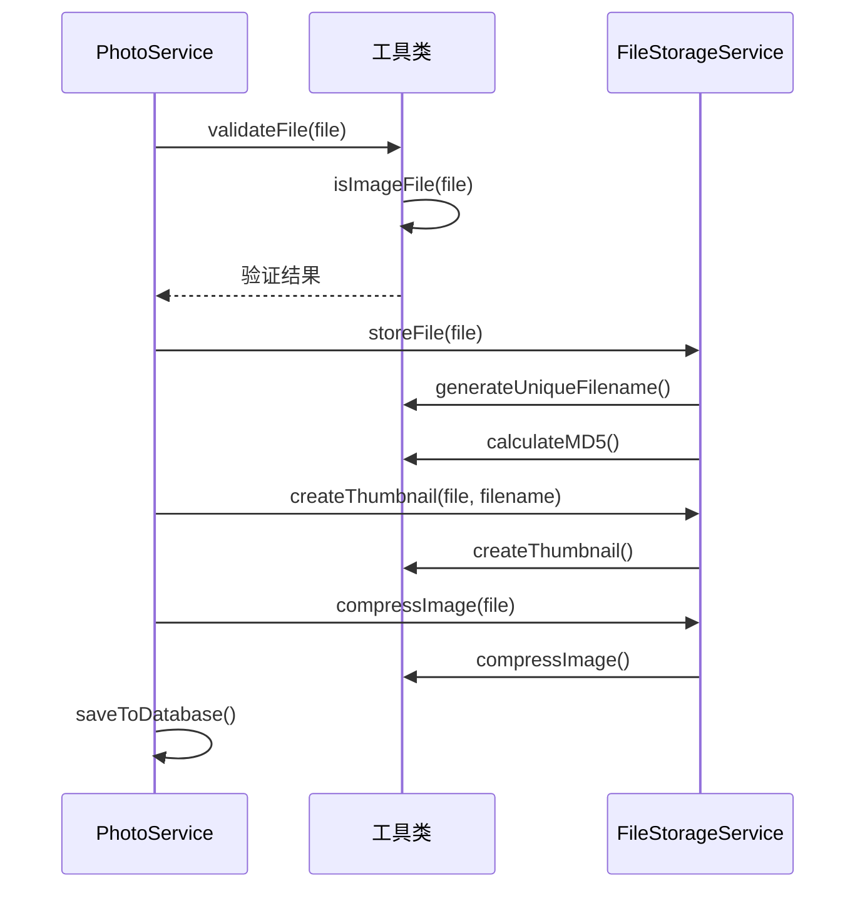
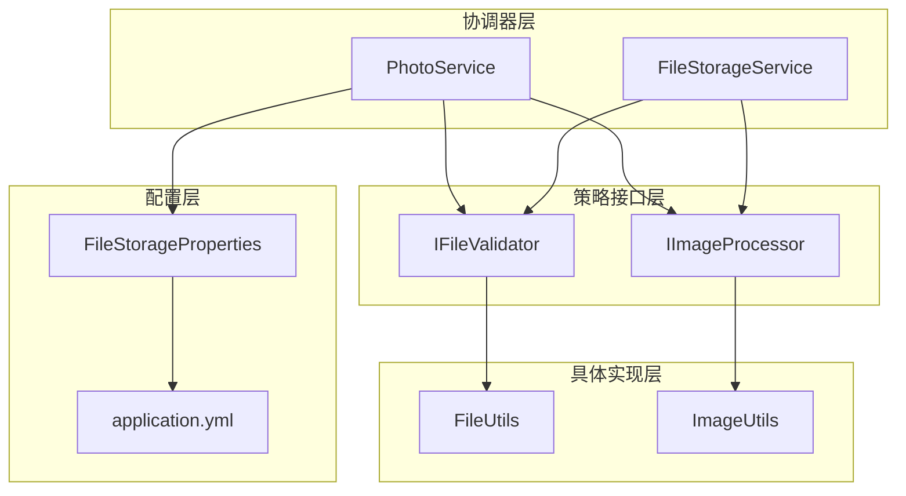

# 策略模式应用

<cite>
**本文档引用的文件**
- [FileUtils.java](file://src/main/java/com/photo/util/FileUtils.java)
- [ImageUtils.java](file://src/main/java/com/photo/util/ImageUtils.java)
- [FileStorageService.java](file://src/main/java/com/photo/service/FileStorageService.java)
- [PhotoService.java](file://src/main/java/com/photo/service/PhotoService.java)
- [PhotoController.java](file://src/main/java/com/photo/controller/PhotoController.java)
- [FileStorageProperties.java](file://src/main/java/com/photo/config/FileStorageProperties.java)
- [application.yml](file://src/main/resources/application.yml)
- [FileUtilsTest.java](file://src/test/java/com/photo/util/FileUtilsTest.java)
- [FileTypeException.java](file://src/main/java/com/photo/exception/FileTypeException.java)
- [FileStorageException.java](file://src/main/java/com/photo/exception/FileStorageException.java)
</cite>

## 目录
1. [引言](#引言)
2. [项目结构](#项目结构)
3. [核心组件](#核心组件)
4. [架构概览](#架构概览)
5. [详细组件分析](#详细组件分析)
6. [依赖关系分析](#依赖关系分析)
7. [性能考虑](#性能考虑)
8. [故障排除指南](#故障排除指南)
9. [结论](#结论)

## 引言

本项目展示了策略模式在文件类型检测和图片处理中的实际应用。通过策略模式，系统能够灵活地处理不同类型的文件，并根据配置动态选择相应的处理策略。本文档将深入分析FileUtils和ImageUtils中策略模式的具体实现，解释如何根据不同文件扩展名选择相应的验证策略，以及如何通过策略模式轻松扩展新的文件类型支持和图片处理功能。

## 项目结构

该项目采用标准的Spring Boot项目结构，主要包含以下模块：

**图表来源**
- [PhotoService.java](file://src/main/java/com/photo/service/PhotoService.java#L36-L385)
- [FileStorageService.java](file://src/main/java/com/photo/service/FileStorageService.java#L24-L300)
- [FileUtils.java](file://src/main/java/com/photo/util/FileUtils.java#L19-L178)
- [ImageUtils.java](file://src/main/java/com/photo/util/ImageUtils.java#L16-L182)

**章节来源**
- [PhotoService.java](file://src/main/java/com/photo/service/PhotoService.java#L36-L385)
- [FileStorageService.java](file://src/main/java/com/photo/service/FileStorageService.java#L24-L300)
- [FileUtils.java](file://src/main/java/com/photo/util/FileUtils.java#L19-L178)
- [ImageUtils.java](file://src/main/java/com/photo/util/ImageUtils.java#L16-L182)

## 核心组件

### 文件工具类 (FileUtils)

FileUtils实现了文件类型验证策略的核心逻辑，提供了多种文件处理功能：

- **文件类型验证策略**：通过MIME类型检测和扩展名验证双重保障
- **文件安全处理**：文件名清理、路径遍历防护
- **文件元数据处理**：MD5计算、文件大小格式化

### 图片处理工具类 (ImageUtils)

ImageUtils提供了完整的图片处理策略体系：

- **图片尺寸获取**：支持File和MultipartFile两种输入方式
- **图片压缩策略**：智能压缩算法，支持质量压缩和尺寸压缩
- **图片变换策略**：缩略图生成、旋转、水印添加

### 存储服务 (FileStorageService)

FileStorageService作为策略协调者，负责：

- **策略执行**：根据配置调用相应的处理策略
- **资源管理**：文件存储、缩略图生成、临时文件处理
- **错误处理**：统一的异常处理和日志记录

**章节来源**
- [FileUtils.java](file://src/main/java/com/photo/util/FileUtils.java#L19-L178)
- [ImageUtils.java](file://src/main/java/com/photo/util/ImageUtils.java#L16-L182)
- [FileStorageService.java](file://src/main/java/com/photo/service/FileStorageService.java#L24-L300)

## 架构概览

系统采用分层架构设计，策略模式贯穿整个文件处理流程：

**图表来源**
- [PhotoController.java](file://src/main/java/com/photo/controller/PhotoController.java#L50-L61)
- [PhotoService.java](file://src/main/java/com/photo/service/PhotoService.java#L50-L111)
- [FileStorageService.java](file://src/main/java/com/photo/service/FileStorageService.java#L59-L95)

## 详细组件分析

### 文件类型验证策略 (FileUtils)

FileUtils实现了基于配置的文件类型验证策略：

#### 核心策略组件

**图表来源**
- [FileUtils.java](file://src/main/java/com/photo/util/FileUtils.java#L19-L178)

#### 策略执行流程

**图表来源**
- [FileUtils.java](file://src/main/java/com/photo/util/FileUtils.java#L84-L102)

#### 配置驱动的策略选择

系统通过配置文件实现策略的动态配置：

| 配置项 | 默认值 | 描述 |
|--------|--------|------|
| file.storage.allowed-types | [image/jpeg, image/png, image/gif] | 允许的MIME类型列表 |
| file.storage.allowed-extensions | [jpg, png, gif] | 允许的文件扩展名列表 |
| file.storage.max-file-size | 10MB | 单个文件最大大小 |
| file.storage.compression.enabled | true | 是否启用图片压缩 |

**章节来源**
- [FileUtils.java](file://src/main/java/com/photo/util/FileUtils.java#L26-L36)
- [application.yml](file://src/main/resources/application.yml#L78-L97)

### 图片处理策略 (ImageUtils)

ImageUtils实现了多种图片处理策略，每种策略都有明确的职责边界：

#### 策略分类

**图表来源**
- [ImageUtils.java](file://src/main/java/com/photo/util/ImageUtils.java#L16-L182)

#### 智能压缩策略

ImageUtils实现了智能压缩策略，根据图片尺寸自动选择压缩方式：

**图表来源**
- [ImageUtils.java](file://src/main/java/com/photo/util/ImageUtils.java#L70-L99)

#### 策略配置参数

| 参数 | 默认值 | 描述 |
|------|--------|------|
| quality | 0.85 | 压缩质量 (0.0-1.0) |
| max-width | 1920 | 最大宽度像素 |
| max-height | 1080 | 最大高度像素 |
| thumbnail.width | 200 | 缩略图宽度 |
| thumbnail.height | 200 | 缩略图高度 |
| thumbnail.quality | 0.8 | 缩略图质量 |

**章节来源**
- [ImageUtils.java](file://src/main/java/com/photo/util/ImageUtils.java#L70-L99)
- [FileStorageProperties.java](file://src/main/java/com/photo/config/FileStorageProperties.java#L80-L85)

### 策略协调器 (PhotoService)

PhotoService作为策略协调者，负责协调各个策略的执行：

#### 策略执行流程

**图表来源**
- [PhotoService.java](file://src/main/java/com/photo/service/PhotoService.java#L50-L111)

**章节来源**
- [PhotoService.java](file://src/main/java/com/photo/service/PhotoService.java#L50-L111)

## 依赖关系分析

系统中的策略模式依赖关系清晰，体现了高内聚低耦合的设计原则：

**图表来源**
- [PhotoService.java](file://src/main/java/com/photo/service/PhotoService.java#L36-L385)
- [FileStorageService.java](file://src/main/java/com/photo/service/FileStorageService.java#L24-L300)
- [FileStorageProperties.java](file://src/main/java/com/photo/config/FileStorageProperties.java#L15-L94)

### 关键依赖关系

1. **PhotoService依赖FileUtils和ImageUtils**：通过静态方法调用实现策略执行
2. **FileStorageService协调策略执行**：根据配置调用相应工具类
3. **配置驱动策略变化**：通过application.yml实现策略参数的动态调整

**章节来源**
- [PhotoService.java](file://src/main/java/com/photo/service/PhotoService.java#L8-L9)
- [FileStorageService.java](file://src/main/java/com/photo/service/FileStorageService.java#L5-L6)

## 性能考虑

策略模式在本项目中的性能优化体现在以下几个方面：

### 缓存策略
- **Tika实例缓存**：FileUtils中复用Tika实例，避免重复创建
- **文件MD5缓存**：利用MD5值进行文件去重，减少重复处理
- **图片尺寸缓存**：通过数据库存储图片尺寸信息

### 异步处理
- **定时清理任务**：使用@Scheduled注解定期清理过期文件
- **异步压缩处理**：图片压缩可能耗时较长，建议异步执行

### 内存优化
- **流式处理**：使用InputStream进行流式文件处理
- **临时文件管理**：压缩后及时清理临时文件

## 故障排除指南

### 常见问题及解决方案

#### 文件类型验证失败
**问题**：文件被拒绝上传
**原因**：
- MIME类型不在允许列表中
- 文件扩展名不在允许列表中
- 文件损坏或格式不支持

**解决方案**：
1. 检查application.yml中的allowed-types配置
2. 验证文件的实际格式是否正确
3. 使用FileUtils.validateFileType()进行详细诊断

#### 图片压缩失败
**问题**：图片压缩过程中出现异常
**原因**：
- 图片格式不受支持
- 内存不足
- 文件权限问题

**解决方案**：
1. 检查ImageIO支持的图片格式
2. 增加JVM内存配置
3. 验证存储目录权限

#### 策略扩展问题
**问题**：需要添加新的文件类型支持
**解决方案**：
1. 在application.yml中添加新的MIME类型和扩展名
2. 更新FileUtils中的ALLOWED_IMAGE_TYPES和ALLOWED_IMAGE_EXTENSIONS
3. 测试新类型的文件处理流程

**章节来源**
- [FileTypeException.java](file://src/main/java/com/photo/exception/FileTypeException.java#L6-L15)
- [FileStorageException.java](file://src/main/java/com/photo/exception/FileStorageException.java#L6-L15)

## 结论

本项目成功应用了策略模式来实现文件类型检测和图片处理功能。通过策略模式，系统实现了以下优势：

### 主要优势

1. **高扩展性**：通过配置文件即可添加新的文件类型支持
2. **高可维护性**：策略逻辑分离，便于维护和测试
3. **灵活性**：支持动态配置和运行时策略切换
4. **可测试性**：每个策略都是独立的单元，便于单元测试

### 最佳实践

1. **配置驱动**：将策略参数通过配置文件管理
2. **异常处理**：为每个策略提供完善的异常处理机制
3. **日志记录**：详细的日志记录便于问题排查
4. **性能优化**：合理使用缓存和异步处理提升性能

### 未来改进方向

1. **插件化架构**：进一步抽象策略接口，支持动态加载
2. **监控指标**：添加策略执行的性能监控
3. **容错机制**：增强策略失败时的降级处理
4. **并发优化**：优化多线程环境下的策略执行

通过策略模式的应用，本项目不仅实现了功能需求，更重要的是建立了一个具有良好扩展性和可维护性的架构基础，为后续的功能扩展和技术演进奠定了坚实的基础。