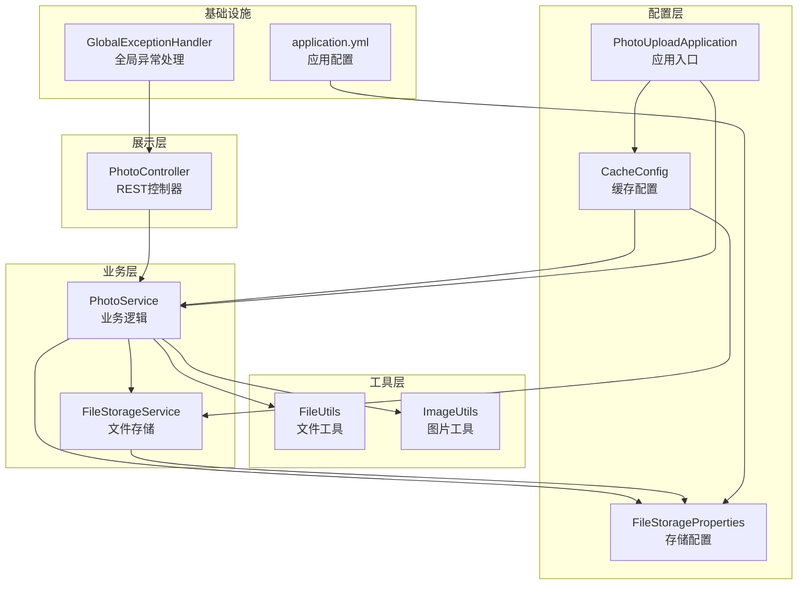
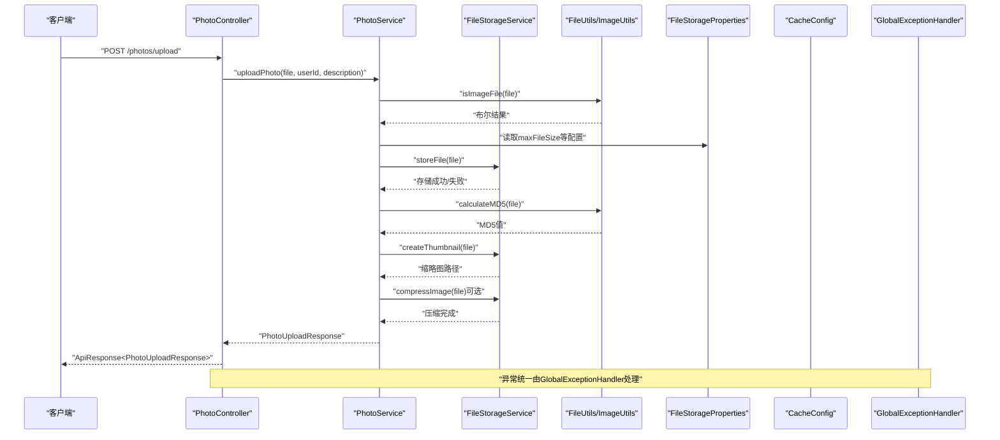
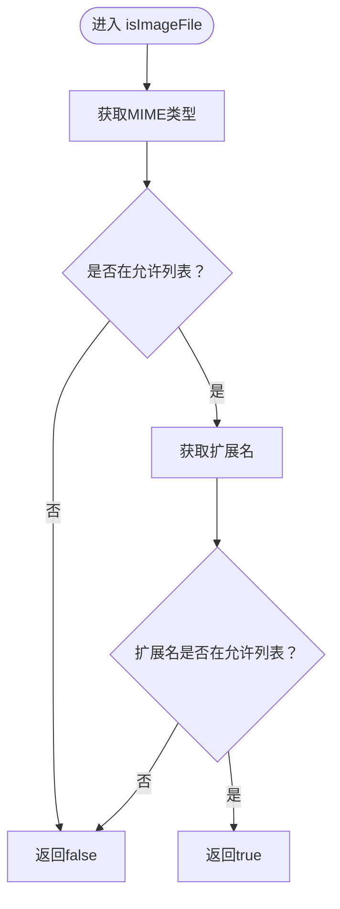
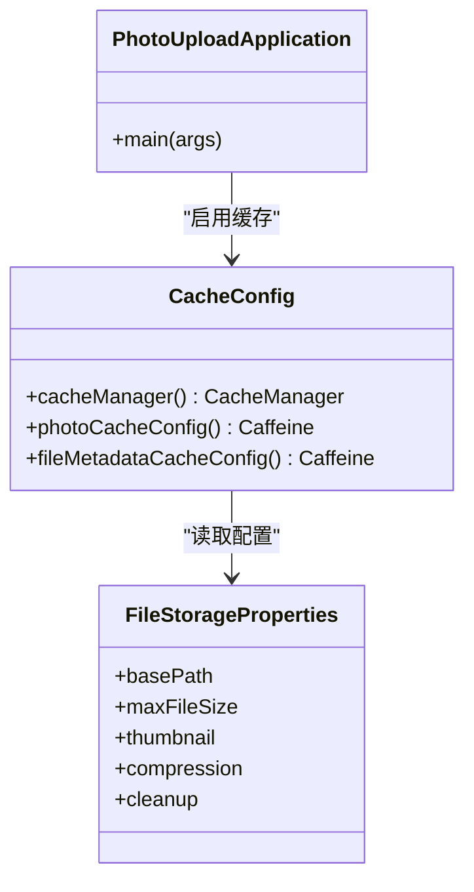
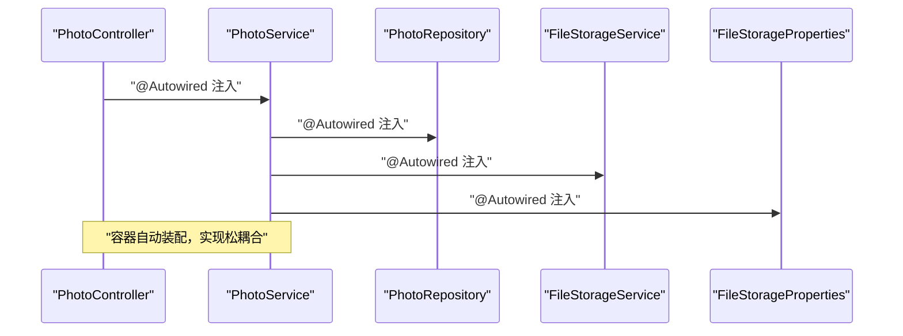
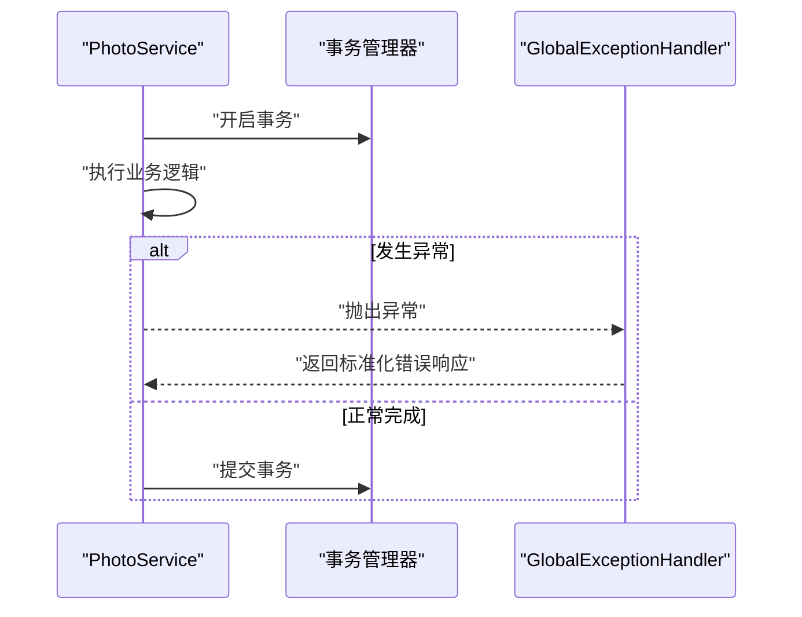
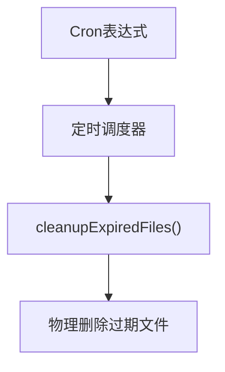
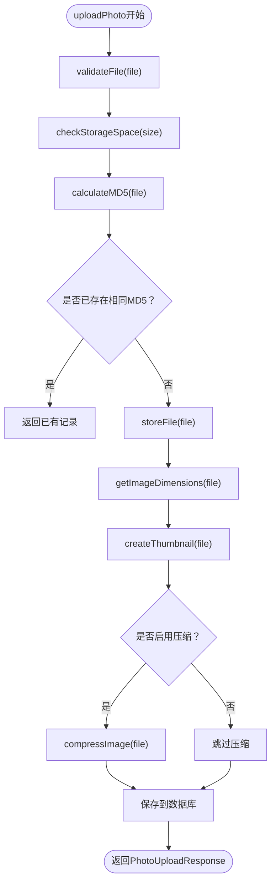
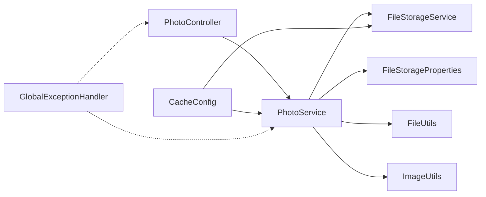

# 设计模式应用

<cite>
**本文档引用的文件**
- [PhotoUploadApplication.java](file://src/main/java/com/photo/PhotoUploadApplication.java)
- [PhotoController.java](file://src/main/java/com/photo/controller/PhotoController.java)
- [PhotoService.java](file://src/main/java/com/photo/service/PhotoService.java)
- [FileStorageService.java](file://src/main/java/com/photo/service/FileStorageService.java)
- [FileUtils.java](file://src/main/java/com/photo/util/FileUtils.java)
- [ImageUtils.java](file://src/main/java/com/photo/util/ImageUtils.java)
- [CacheConfig.java](file://src/main/java/com/photo/config/CacheConfig.java)
- [FileStorageProperties.java](file://src/main/java/com/photo/config/FileStorageProperties.java)
- [GlobalExceptionHandler.java](file://src/main/java/com/photo/exception/GlobalExceptionHandler.java)
- [application.yml](file://src/main/resources/application.yml)
</cite>

## 目录
1. [简介](#简介)
2. [项目结构](#项目结构)
3. [核心组件](#核心组件)
4. [架构总览](#架构总览)
5. [详细组件分析](#详细组件分析)
6. [依赖关系分析](#依赖关系分析)
7. [性能考虑](#性能考虑)
8. [故障排除指南](#故障排除指南)
9. [结论](#结论)

## 简介
本文件聚焦于照片上传下载系统中设计模式的应用实践，围绕以下主题展开：
- 策略模式在文件类型检测中的应用
- 工厂模式在服务创建中的使用
- 单例模式在缓存配置中的实现
- 依赖注入模式通过Spring框架实现松耦合设计
- AOP编程模式在事务管理和异常处理中的应用
- 观察者模式在事件驱动架构中的使用
- 模板方法模式在文件处理流程中的体现

通过对代码的逐层剖析，结合序列图、类图与流程图，帮助读者理解各设计模式在真实业务场景中的落地方式与带来的收益。

## 项目结构
系统采用经典的分层架构：展示层（Controller）、业务层（Service）、数据访问层（Repository）、工具层（Util）、配置层（Config）。Spring Boot负责依赖注入与自动配置，配合Caffeine实现缓存，全局异常处理器统一处理各类异常。

图表来源
- [PhotoController.java](file://src/main/java/com/photo/controller/PhotoController.java#L30-L316)
- [PhotoService.java](file://src/main/java/com/photo/service/PhotoService.java#L34-L385)
- [FileStorageService.java](file://src/main/java/com/photo/service/FileStorageService.java#L22-L300)
- [FileUtils.java](file://src/main/java/com/photo/util/FileUtils.java#L19-L178)
- [ImageUtils.java](file://src/main/java/com/photo/util/ImageUtils.java#L15-L182)
- [CacheConfig.java](file://src/main/java/com/photo/config/CacheConfig.java#L15-L54)
- [FileStorageProperties.java](file://src/main/java/com/photo/config/FileStorageProperties.java#L12-L94)
- [GlobalExceptionHandler.java](file://src/main/java/com/photo/exception/GlobalExceptionHandler.java#L19-L140)
- [application.yml](file://src/main/resources/application.yml#L69-L118)

章节来源
- [PhotoUploadApplication.java](file://src/main/java/com/photo/PhotoUploadApplication.java#L11-L19)
- [application.yml](file://src/main/resources/application.yml#L69-L118)

## 核心组件
- PhotoController：对外暴露REST接口，负责请求接入、参数校验与响应封装。
- PhotoService：核心业务编排，协调存储、缓存、事务与定时任务。
- FileStorageService：文件读写、缩略图生成、压缩、范围读取等存储能力。
- FileUtils：文件类型检测、文件名清洗、MD5计算、大小格式化等工具。
- ImageUtils：图片维度获取、缩略图生成、压缩、旋转、水印等图像处理。
- CacheConfig：基于Caffeine的缓存管理器与多级缓存配置。
- FileStorageProperties：集中式存储配置，支持缩略图、压缩、清理等策略参数。
- GlobalExceptionHandler：统一异常处理，面向不同异常类型返回标准化响应。

章节来源
- [PhotoController.java](file://src/main/java/com/photo/controller/PhotoController.java#L30-L316)
- [PhotoService.java](file://src/main/java/com/photo/service/PhotoService.java#L34-L385)
- [FileStorageService.java](file://src/main/java/com/photo/service/FileStorageService.java#L22-L300)
- [FileUtils.java](file://src/main/java/com/photo/util/FileUtils.java#L19-L178)
- [ImageUtils.java](file://src/main/java/com/photo/util/ImageUtils.java#L15-L182)
- [CacheConfig.java](file://src/main/java/com/photo/config/CacheConfig.java#L15-L54)
- [FileStorageProperties.java](file://src/main/java/com/photo/config/FileStorageProperties.java#L12-L94)
- [GlobalExceptionHandler.java](file://src/main/java/com/photo/exception/GlobalExceptionHandler.java#L19-L140)

## 架构总览
系统通过Spring容器实现依赖注入，Controller持有Service，Service持有Repository与工具类；配置层通过@EnableCaching与@EnableScheduling启用缓存与定时任务；全局异常处理器统一拦截异常，保证接口稳定性。

图表来源
- [PhotoController.java](file://src/main/java/com/photo/controller/PhotoController.java#L48-L61)
- [PhotoService.java](file://src/main/java/com/photo/service/PhotoService.java#L50-L111)
- [FileStorageService.java](file://src/main/java/com/photo/service/FileStorageService.java#L59-L95)
- [FileUtils.java](file://src/main/java/com/photo/util/FileUtils.java#L56-L102)
- [ImageUtils.java](file://src/main/java/com/photo/util/ImageUtils.java#L104-L123)
- [FileStorageProperties.java](file://src/main/java/com/photo/config/FileStorageProperties.java#L44-L65)
- [GlobalExceptionHandler.java](file://src/main/java/com/photo/exception/GlobalExceptionHandler.java#L26-L54)

## 详细组件分析

### 策略模式：文件类型检测
策略模式通过在工具类中维护允许的类型集合与检测方法，将“如何判断文件类型”的算法抽象出来，便于扩展与替换。

- 允许类型集合：静态常量维护允许的MIME类型与扩展名列表。
- 检测流程：先通过MIME类型检测，再校验扩展名，最后抛出FileTypeException。
- 优势：当新增或移除文件类型时，只需修改工具类中的允许列表，无需改动调用方。

图表来源
- [FileUtils.java](file://src/main/java/com/photo/util/FileUtils.java#L56-L102)

章节来源
- [FileUtils.java](file://src/main/java/com/photo/util/FileUtils.java#L21-L102)

### 工厂模式：服务创建与配置
工厂模式体现在Spring容器对Bean的创建与装配上。例如：
- CacheConfig通过@Bean方法创建CaffeineCacheManager与多个缓存配置实例，形成“缓存工厂”。
- PhotoUploadApplication通过@EnableCaching与@EnableScheduling启用缓存与定时任务，形成“启动工厂”。

图表来源
- [CacheConfig.java](file://src/main/java/com/photo/config/CacheConfig.java#L22-L52)
- [PhotoUploadApplication.java](file://src/main/java/com/photo/PhotoUploadApplication.java#L11-L19)
- [FileStorageProperties.java](file://src/main/java/com/photo/config/FileStorageProperties.java#L14-L94)

章节来源
- [CacheConfig.java](file://src/main/java/com/photo/config/CacheConfig.java#L15-L54)
- [PhotoUploadApplication.java](file://src/main/java/com/photo/PhotoUploadApplication.java#L11-L19)
- [FileStorageProperties.java](file://src/main/java/com/photo/config/FileStorageProperties.java#L12-L94)

### 单例模式：缓存配置
单例模式在Spring中通过容器级别的Bean实现，CacheConfig中定义的CacheManager与多个Caffeine实例在整个应用生命周期内仅存在一份，确保缓存配置的一致性与高效复用。

- CacheManager作为单例，统一管理缓存策略。
- 多个Caffeine实例按用途划分（如照片信息缓存、文件元数据缓存），提升缓存命中率与隔离性。

章节来源
- [CacheConfig.java](file://src/main/java/com/photo/config/CacheConfig.java#L22-L52)

### 依赖注入：Spring框架实现松耦合
- PhotoController通过@Autowired注入PhotoService与FileStorageService，避免硬编码依赖。
- PhotoService通过@Autowired注入PhotoRepository、FileStorageService与FileStorageProperties，实现跨层解耦。
- 配置类通过@Component与@Bean参与容器管理，统一由Spring调度。

图表来源
- [PhotoController.java](file://src/main/java/com/photo/controller/PhotoController.java#L36-L43)
- [PhotoService.java](file://src/main/java/com/photo/service/PhotoService.java#L38-L45)

章节来源
- [PhotoController.java](file://src/main/java/com/photo/controller/PhotoController.java#L36-L43)
- [PhotoService.java](file://src/main/java/com/photo/service/PhotoService.java#L38-L45)

### AOP：事务管理与异常处理
- 事务管理：PhotoService在上传、删除、清理等关键操作上使用@Transactional注解，确保数据库一致性。
- 异常处理：GlobalExceptionHandler通过@RestControllerAdvice统一捕获各类异常，返回标准化响应，避免异常穿透到客户端。

图表来源
- [PhotoService.java](file://src/main/java/com/photo/service/PhotoService.java#L50-L111)
- [GlobalExceptionHandler.java](file://src/main/java/com/photo/exception/GlobalExceptionHandler.java#L26-L54)

章节来源
- [PhotoService.java](file://src/main/java/com/photo/service/PhotoService.java#L50-L111)
- [GlobalExceptionHandler.java](file://src/main/java/com/photo/exception/GlobalExceptionHandler.java#L19-L140)

### 观察者模式：事件驱动架构
系统通过@EnableScheduling与@Scheduled实现定时任务，可视为一种事件驱动机制：
- 定时触发清理过期文件的任务，监听时间事件。
- 通过配置文件中的cron表达式控制触发频率，实现“发布-订阅”式的事件处理。

图表来源
- [PhotoService.java](file://src/main/java/com/photo/service/PhotoService.java#L276-L299)
- [application.yml](file://src/main/resources/application.yml#L117-L117)

章节来源
- [PhotoService.java](file://src/main/java/com/photo/service/PhotoService.java#L276-L299)
- [application.yml](file://src/main/resources/application.yml#L112-L117)

### 模板方法模式：文件处理流程
模板方法模式体现在PhotoService的上传流程中：定义了“上传照片”的基本骨架（校验、存储、生成缩略图、压缩、入库），具体步骤由子步骤实现，便于扩展与复用。

图表来源
- [PhotoService.java](file://src/main/java/com/photo/service/PhotoService.java#L50-L111)
- [FileStorageService.java](file://src/main/java/com/photo/service/FileStorageService.java#L59-L183)
- [ImageUtils.java](file://src/main/java/com/photo/util/ImageUtils.java#L21-L48)

章节来源
- [PhotoService.java](file://src/main/java/com/photo/service/PhotoService.java#L50-L111)

## 依赖关系分析
- 控制器依赖服务：PhotoController依赖PhotoService与FileStorageService。
- 服务依赖工具与配置：PhotoService依赖FileUtils、ImageUtils、FileStorageProperties与FileStorageService。
- 配置依赖存储：CacheConfig依赖FileStorageProperties以实现缓存策略与存储策略联动。
- 异常处理贯穿全链路：GlobalExceptionHandler统一拦截异常，保障接口稳定性。

图表来源
- [PhotoController.java](file://src/main/java/com/photo/controller/PhotoController.java#L36-L43)
- [PhotoService.java](file://src/main/java/com/photo/service/PhotoService.java#L38-L45)
- [FileStorageService.java](file://src/main/java/com/photo/service/FileStorageService.java#L26-L29)
- [FileUtils.java](file://src/main/java/com/photo/util/FileUtils.java#L21-L21)
- [ImageUtils.java](file://src/main/java/com/photo/util/ImageUtils.java#L16-L16)
- [CacheConfig.java](file://src/main/java/com/photo/config/CacheConfig.java#L22-L52)
- [GlobalExceptionHandler.java](file://src/main/java/com/photo/exception/GlobalExceptionHandler.java#L26-L54)

章节来源
- [PhotoController.java](file://src/main/java/com/photo/controller/PhotoController.java#L36-L43)
- [PhotoService.java](file://src/main/java/com/photo/service/PhotoService.java#L38-L45)
- [FileStorageService.java](file://src/main/java/com/photo/service/FileStorageService.java#L26-L29)
- [FileUtils.java](file://src/main/java/com/photo/util/FileUtils.java#L21-L21)
- [ImageUtils.java](file://src/main/java/com/photo/util/ImageUtils.java#L16-L16)
- [CacheConfig.java](file://src/main/java/com/photo/config/CacheConfig.java#L22-L52)
- [GlobalExceptionHandler.java](file://src/main/java/com/photo/exception/GlobalExceptionHandler.java#L26-L54)

## 性能考虑
- 缓存策略：通过Caffeine实现多级缓存，减少数据库与文件系统访问压力。
- 图片处理：支持缩略图与压缩，降低带宽与存储成本。
- 断点续传：FileStorageService支持范围读取，提升大文件下载体验。
- 定时清理：定期清理过期文件，维持系统健康运行。

## 故障排除指南
- 文件类型异常：检查FileUtils中允许的MIME类型与扩展名列表，确认前端上传类型是否匹配。
- 存储空间不足：检查FileStorageProperties中的maxStorageSize与当前使用量，必要时扩容或清理。
- 缩略图/压缩失败：查看ImageUtils的日志与异常堆栈，确认输入文件有效性与磁盘权限。
- 全局异常处理：通过GlobalExceptionHandler统一返回错误码与消息，便于定位问题。

章节来源
- [FileUtils.java](file://src/main/java/com/photo/util/FileUtils.java#L56-L102)
- [FileStorageProperties.java](file://src/main/java/com/photo/config/FileStorageProperties.java#L64-L65)
- [ImageUtils.java](file://src/main/java/com/photo/util/ImageUtils.java#L53-L99)
- [GlobalExceptionHandler.java](file://src/main/java/com/photo/exception/GlobalExceptionHandler.java#L26-L54)

## 结论
本系统通过多种设计模式的有机结合，实现了高内聚、低耦合、可扩展且稳定的文件上传下载能力：
- 策略模式使文件类型检测灵活可扩展；
- 工厂模式与Spring依赖注入实现松耦合；
- 单例缓存配置提升性能与一致性；
- AOP事务与异常处理保障业务正确性与用户体验；
- 观察者模式（定时任务）实现事件驱动；
- 模板方法模式固化上传流程，便于维护与演进。