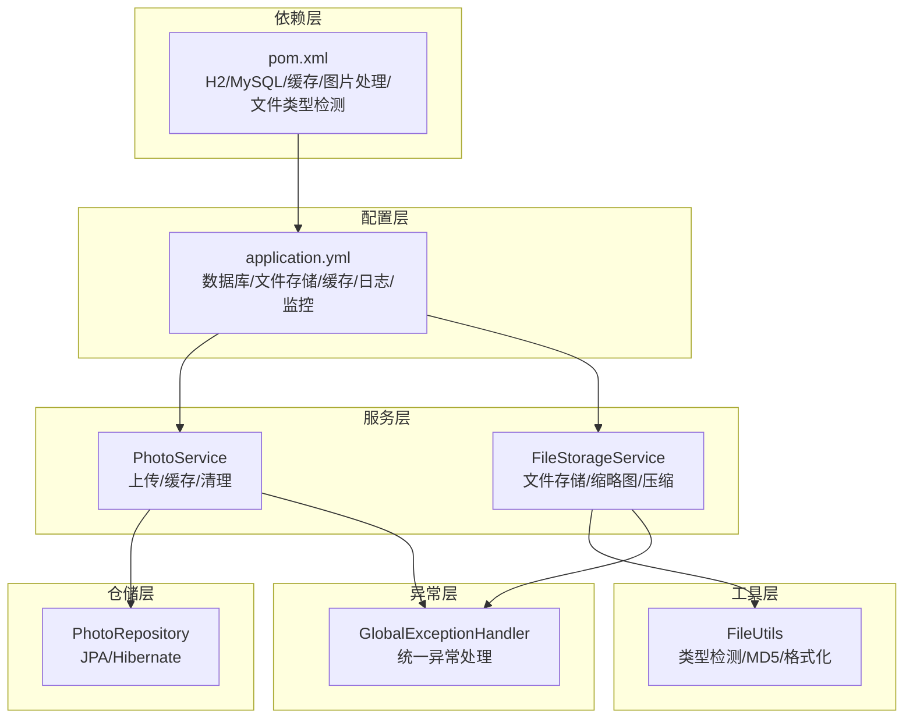
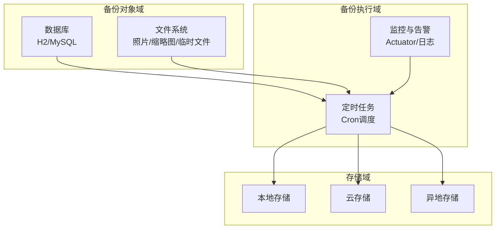
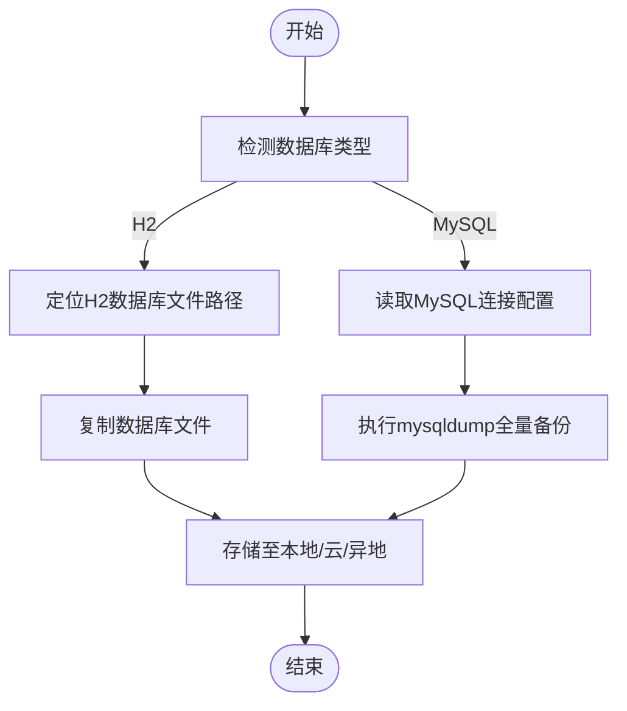
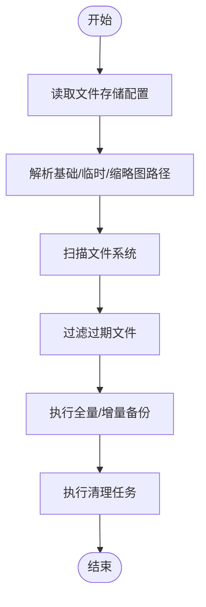
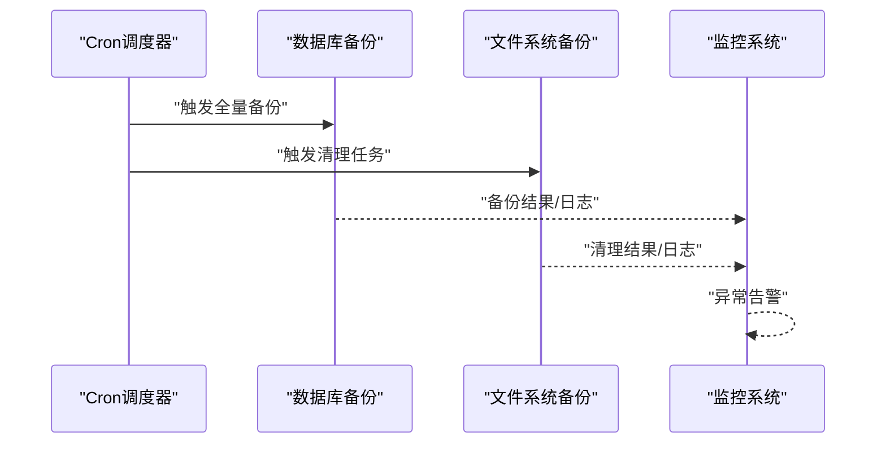
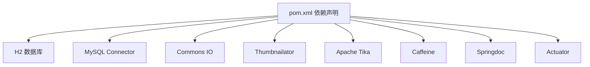

# 备份恢复

<cite>
**本文引用的文件**
- [application.yml](file://src/main/resources/application.yml)
- [schema.sql](file://src/main/resources/schema.sql)
- [FileStorageProperties.java](file://src/main/java/com/photo/config/FileStorageProperties.java)
- [FileStorageService.java](file://src/main/java/com/photo/service/FileStorageService.java)
- [FileUtils.java](file://src/main/java/com/photo/util/FileUtils.java)
- [PhotoService.java](file://src/main/java/com/photo/service/PhotoService.java)
- [PhotoRepository.java](file://src/main/java/com/photo/repository/PhotoRepository.java)
- [SecurityConfig.java](file://src/main/java/com/photo/config/SecurityConfig.java)
- [GlobalExceptionHandler.java](file://src/main/java/com/photo/exception/GlobalExceptionHandler.java)
- [pom.xml](file://pom.xml)
- [NOTE_SYSTEM_README.md](file://NOTE_SYSTEM_README.md)
- [PROJECT_DELIVERY.md](file://PROJECT_DELIVERY.md)
</cite>

## 目录
1. [简介](#简介)
2. [项目结构](#项目结构)
3. [核心组件](#核心组件)
4. [架构总览](#架构总览)
5. [详细组件分析](#详细组件分析)
6. [依赖关系分析](#依赖关系分析)
7. [性能考虑](#性能考虑)
8. [故障排查指南](#故障排查指南)
9. [结论](#结论)
10. [附录](#附录)

## 简介
本文件面向系统运维与平台工程团队，提供一份系统化的备份与灾难恢复策略文档。结合当前代码库现状，重点覆盖以下方面：
- 数据库备份方案：针对H2与MySQL两种后端的备份策略、全量与增量备份配置思路
- 文件存储备份策略：照片文件、缩略图与临时文件的备份与清理机制
- 加密与安全存储：本地、云存储与异地备份的安全配置要点
- 自动化备份与监控：基于定时任务的备份调度与监控告警
- 备份验证与测试：完整性与可恢复性验证流程
- 灾难恢复流程与演练：RTO/RPO指标设定与演练计划
- 数据恢复操作指南：部分恢复与全量恢复步骤
- 性能优化与成本控制：备份性能与成本优化策略

## 项目结构
本项目采用Spring Boot标准分层架构，核心与备份恢复相关的模块包括：
- 配置层：application.yml集中管理数据库、文件存储、缓存、日志、监控等配置
- 仓储层：JPA/Hibernate负责数据库访问；H2为默认嵌入式数据库，MySQL为可选生产数据库
- 服务层：PhotoService负责照片上传、存储、缓存与清理；FileStorageService负责文件系统存储与缩略图生成
- 工具层：FileUtils负责文件类型检测、MD5计算、文件大小格式化等
- 异常层：统一异常处理，便于备份监控与告警
- 依赖层：pom.xml声明H2与MySQL驱动、缓存、图片处理、文件类型检测等依赖

图表来源
- [application.yml](file://src/main/resources/application.yml#L1-L190)
- [PhotoService.java](file://src/main/java/com/photo/service/PhotoService.java#L1-L200)
- [FileStorageService.java](file://src/main/java/com/photo/service/FileStorageService.java#L1-L300)
- [FileUtils.java](file://src/main/java/com/photo/util/FileUtils.java#L1-L178)
- [GlobalExceptionHandler.java](file://src/main/java/com/photo/exception/GlobalExceptionHandler.java#L1-L140)
- [pom.xml](file://pom.xml#L1-L169)

章节来源
- [application.yml](file://src/main/resources/application.yml#L1-L190)
- [pom.xml](file://pom.xml#L1-L169)

## 核心组件
- 数据库配置与切换：H2嵌入式数据库默认启用，MySQL为生产可选配置；通过application.yml切换数据库方言与连接参数
- 文件存储配置：集中于file.storage节点，包含基础路径、临时目录、缩略图目录、允许类型、最大文件大小、压缩与清理策略
- 定时清理任务：基于Cron表达式的定期清理过期文件，避免存储空间膨胀
- 统一异常处理：便于备份监控与告警，异常响应标准化
- 安全配置：CORS、CSRF、会话与密码编码器配置，保障备份传输与访问安全

章节来源
- [application.yml](file://src/main/resources/application.yml#L6-L28)
- [FileStorageProperties.java](file://src/main/java/com/photo/config/FileStorageProperties.java#L1-L94)
- [PhotoService.java](file://src/main/java/com/photo/service/PhotoService.java#L276-L289)
- [GlobalExceptionHandler.java](file://src/main/java/com/photo/exception/GlobalExceptionHandler.java#L1-L140)
- [SecurityConfig.java](file://src/main/java/com/photo/config/SecurityConfig.java#L1-L99)

## 架构总览
备份与恢复涉及“数据层（数据库）+ 文件层（照片/缩略图/临时文件）”两大对象域。系统当前默认使用H2数据库，生产环境可切换至MySQL。文件存储位于本地文件系统，支持缩略图与压缩，具备定期清理能力。

图表来源
- [application.yml](file://src/main/resources/application.yml#L6-L28)
- [application.yml](file://src/main/resources/application.yml#L69-L117)
- [PhotoService.java](file://src/main/java/com/photo/service/PhotoService.java#L276-L289)
- [pom.xml](file://pom.xml#L144-L149)

## 详细组件分析

### 数据库备份策略（H2与MySQL）
- H2数据库
  - 默认路径：文件型H2数据库位于项目根目录的数据库文件
  - 备份方式：直接复制数据库文件进行全量备份
  - 增量备份：H2不提供内置增量备份，建议通过文件级差异复制或外部工具实现
  - 生产切换：通过application.yml切换至MySQL，设置连接URL、驱动与方言
- MySQL数据库
  - 连接参数：在application.yml中取消注释并填写连接信息
  - 备份方式：推荐使用mysqldump进行全量备份，结合binlog实现近似增量
  - 增量备份：开启binlog并定期归档，结合全量+增量恢复策略

图表来源
- [application.yml](file://src/main/resources/application.yml#L6-L28)
- [schema.sql](file://src/main/resources/schema.sql#L1-L144)
- [NOTE_SYSTEM_README.md](file://NOTE_SYSTEM_README.md#L184-L247)

章节来源
- [application.yml](file://src/main/resources/application.yml#L6-L28)
- [schema.sql](file://src/main/resources/schema.sql#L1-L144)
- [NOTE_SYSTEM_README.md](file://NOTE_SYSTEM_README.md#L184-L247)

### 文件存储备份策略（照片/缩略图/临时文件）
- 存储结构
  - 基础路径：由file.storage.base-path指定
  - 临时文件：file.storage.temp-path
  - 缩略图：file.storage.thumbnail-path
- 备份范围
  - 照片文件：实际存储于基础路径
  - 缩略图：独立目录，建议与原图一同备份
  - 临时文件：周期性清理，备份可选
- 备份方式
  - 全量备份：对基础路径进行文件级全量复制
  - 增量备份：基于文件变更时间或MD5差异的差异复制
- 清理策略
  - 定时清理：通过Cron表达式定期清理过期文件，默认每天凌晨2点执行
  - 清理阈值：days-to-keep配置决定保留天数

图表来源
- [application.yml](file://src/main/resources/application.yml#L69-L117)
- [FileStorageProperties.java](file://src/main/java/com/photo/config/FileStorageProperties.java#L1-L94)
- [PhotoService.java](file://src/main/java/com/photo/service/PhotoService.java#L276-L289)

章节来源
- [application.yml](file://src/main/resources/application.yml#L69-L117)
- [FileStorageProperties.java](file://src/main/java/com/photo/config/FileStorageProperties.java#L1-L94)
- [PhotoService.java](file://src/main/java/com/photo/service/PhotoService.java#L276-L289)

### 备份数据的加密与安全存储
- 本地备份
  - 建议对备份文件进行压缩与加密，结合操作系统级加密（如磁盘加密）
- 云存储
  - 使用云厂商提供的加密服务（如SSE-KMS），确保静态与传输加密
- 异地备份
  - 选择跨地域/跨可用区的存储，确保地理隔离
- 访问控制
  - 严格限制备份文件访问权限，结合最小权限原则与审计日志

（本小节为通用实践指导，不直接分析具体文件）

### 自动备份任务调度与监控
- 定时任务
  - 数据库：H2文件复制或MySQL mysqldump任务，建议每日执行
  - 文件系统：基于Cron的定期清理任务，当前配置为每天凌晨2点
- 监控与告警
  - 使用Actuator暴露健康、指标端点，结合日志轮转与告警系统
  - 统一异常处理返回标准化错误码，便于监控系统识别异常

图表来源
- [application.yml](file://src/main/resources/application.yml#L173-L182)
- [PhotoService.java](file://src/main/java/com/photo/service/PhotoService.java#L276-L289)
- [GlobalExceptionHandler.java](file://src/main/java/com/photo/exception/GlobalExceptionHandler.java#L1-L140)

章节来源
- [application.yml](file://src/main/resources/application.yml#L173-L182)
- [PhotoService.java](file://src/main/java/com/photo/service/PhotoService.java#L276-L289)
- [GlobalExceptionHandler.java](file://src/main/java/com/photo/exception/GlobalExceptionHandler.java#L1-L140)

### 备份数据验证与测试
- 数据库
  - H2：复制数据库文件后，先在测试环境启动应用验证数据库文件可读性
  - MySQL：通过mysqldump还原到测试库，执行基础查询验证完整性
- 文件系统
  - 校验缩略图与原图数量一致性，随机抽样MD5校验
  - 验证访问接口可用性与性能
- 回归测试
  - 建议在测试环境中执行一次完整的恢复流程，记录耗时与成功率

（本小节为通用实践指导，不直接分析具体文件）

### 灾难恢复流程与演练计划
- RTO/RPO指标
  - RPO：根据业务容忍度设定，如15分钟（结合binlog归档与增量备份）
  - RTO：根据SLA设定，如4小时内恢复核心业务
- 恢复流程
  - 快速评估：确认故障类型（数据库/文件系统/网络）
  - 数据库恢复：优先恢复最近一次全量备份，再应用增量备份
  - 文件系统恢复：从最近备份恢复文件系统，重建缩略图
  - 验证与切换：在测试环境验证后，逐步切换流量
- 演练计划
  - 每季度至少一次全量演练，半年一次跨区域演练
  - 记录演练过程与改进项，持续优化流程

（本小节为通用实践指导，不直接分析具体文件）

### 数据恢复操作指南
- 全量恢复
  - 数据库：停止应用，恢复数据库文件或导入SQL，启动应用验证
  - 文件系统：停止应用，恢复文件系统，重建缩略图，启动应用验证
- 部分恢复
  - 仅恢复特定用户或特定时间段的数据，结合数据库查询与文件系统筛选
- 恢复验证
  - 核对数量与完整性，执行关键路径回归测试

（本小节为通用实践指导，不直接分析具体文件）

## 依赖关系分析
- 数据库依赖
  - H2：默认嵌入式数据库，适合开发与测试
  - MySQL：生产可选，需在pom.xml中启用MySQL Connector
- 文件处理依赖
  - Commons IO：文件IO操作
  - Thumbnailator：缩略图生成
  - Apache Tika：文件类型检测
- 缓存与监控
  - Caffeine：本地缓存
  - Springdoc：OpenAPI文档
  - Actuator：健康与指标监控

图表来源
- [pom.xml](file://pom.xml#L67-L149)

章节来源
- [pom.xml](file://pom.xml#L67-L149)

## 性能考虑
- 备份性能
  - 数据库：H2适合小规模数据；MySQL建议使用mysqldump并行参数与压缩
  - 文件系统：使用rsync或差异复制减少带宽占用
- 存储成本
  - 采用分层存储策略：热数据在线，温数据归档，冷数据离线
  - 启用压缩与去重，降低存储与传输成本
- 监控与告警
  - 使用Actuator与日志轮转，及时发现备份失败与性能瓶颈

（本小节为通用实践指导，不直接分析具体文件）

## 故障排查指南
- 数据库相关
  - H2：确认数据库文件可读写，检查路径与权限
  - MySQL：检查连接参数、网络连通性与权限
- 文件系统相关
  - 确认存储路径存在且可写，检查磁盘空间与权限
  - 定期清理任务失败：检查Cron表达式与日志
- 异常处理
  - 统一异常响应便于监控系统识别与告警

章节来源
- [GlobalExceptionHandler.java](file://src/main/java/com/photo/exception/GlobalExceptionHandler.java#L1-L140)
- [PROJECT_DELIVERY.md](file://PROJECT_DELIVERY.md#L448-L473)

## 结论
本项目当前以H2数据库与本地文件系统为主，具备清晰的配置与清理机制。建议尽快完善以下能力以满足生产级备份与恢复需求：
- 明确生产数据库（MySQL）的备份策略与增量备份方案
- 建立自动化备份任务与监控告警体系
- 制定备份验证与灾难恢复演练计划
- 强化备份数据的加密与安全存储
- 优化备份性能与成本控制

## 附录
- 数据库初始化脚本：schema.sql用于初始化数据库结构与示例数据
- 部署与维护建议：参考交付文档中的维护建议与问题排查

章节来源
- [schema.sql](file://src/main/resources/schema.sql#L1-L144)
- [PROJECT_DELIVERY.md](file://PROJECT_DELIVERY.md#L441-L473)