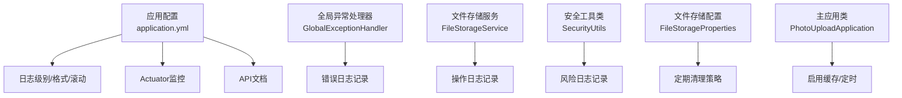
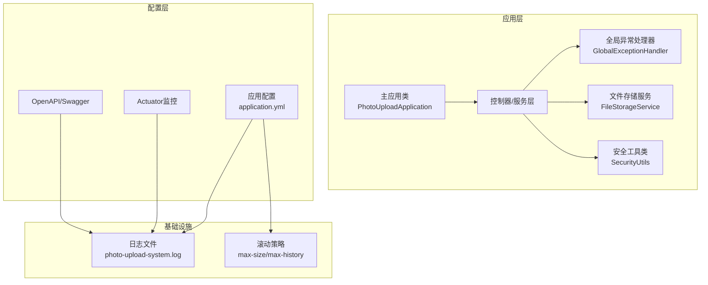
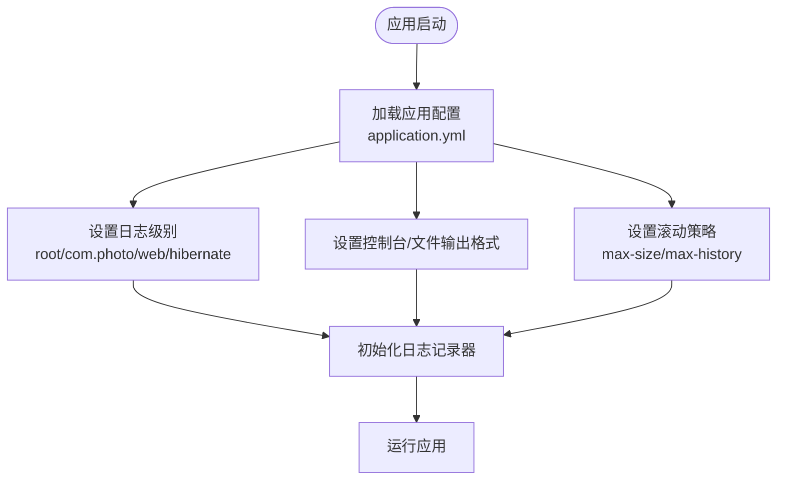
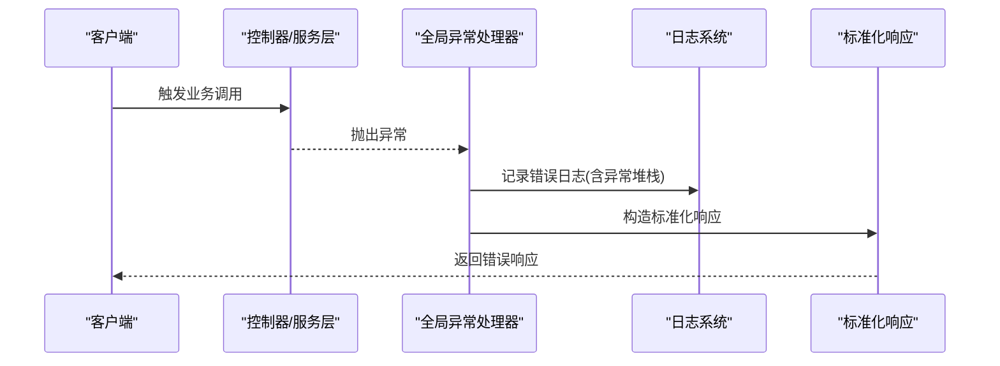
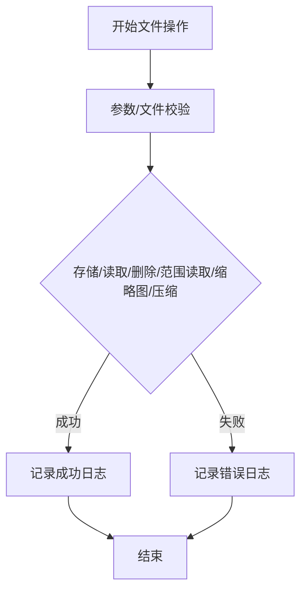
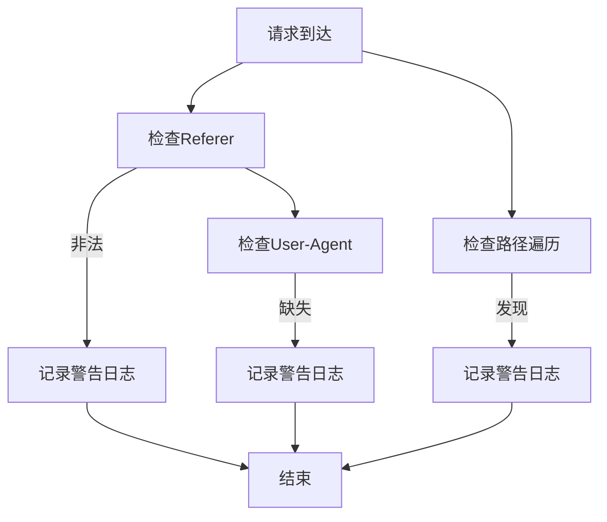
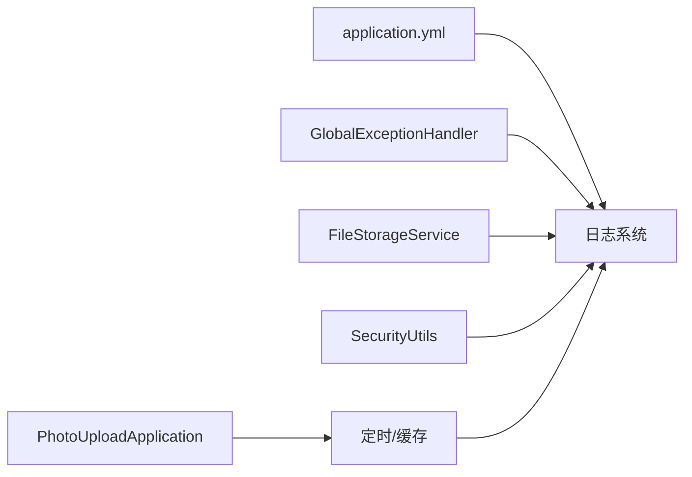

# 日志管理

<cite>
**本文引用的文件**
- [application.yml](file://src/main/resources/application.yml)
- [pom.xml](file://pom.xml)
- [PhotoUploadApplication.java](file://src/main/java/com/photo/PhotoUploadApplication.java)
- [GlobalExceptionHandler.java](file://src/main/java/com/photo/exception/GlobalExceptionHandler.java)
- [FileStorageService.java](file://src/main/java/com/photo/service/FileStorageService.java)
- [SecurityUtils.java](file://src/main/java/com/photo/util/SecurityUtils.java)
- [FileStorageProperties.java](file://src/main/java/com/photo/config/FileStorageProperties.java)
- [ApiResponse.java](file://src/main/java/com/photo/dto/ApiResponse.java)
- [OpenApiConfig.java](file://src/main/java/com/photo/config/OpenApiConfig.java)
- [PhotoControllerTest.java](file://src/test/java/com/photo/controller/PhotoControllerTest.java)
</cite>

## 目录
1. [简介](#简介)
2. [项目结构](#项目结构)
3. [核心组件](#核心组件)
4. [架构总览](#架构总览)
5. [详细组件分析](#详细组件分析)
6. [依赖关系分析](#依赖关系分析)
7. [性能考虑](#性能考虑)
8. [故障排查指南](#故障排查指南)
9. [结论](#结论)
10. [附录](#附录)

## 简介
本文件面向日志管理与运维场景，结合现有代码库现状，系统梳理日志配置与管理策略，覆盖日志级别、输出格式、文件滚动策略；说明异常日志的捕获与处理机制；给出结构化日志（JSON）与字段化日志的落地建议；提供日志审计与合规（敏感信息脱敏、操作日志）的实现思路；并给出日志聚合与分析工具（ELK/Splunk）的集成建议、日志查询与检索最佳实践、性能优化（异步、批量）以及日志清理与归档策略。

## 项目结构
围绕日志相关的配置与实现主要分布在以下位置：
- 应用配置：日志级别、输出格式、文件滚动策略均在应用配置文件中集中定义
- 异常处理：全局异常处理器统一记录错误日志并返回标准化响应
- 文件存储：文件存储服务在关键路径中记录成功/失败日志，便于追踪文件操作
- 安全工具：安全工具类在发现非法访问、路径遍历等风险时记录警告日志
- 配置属性：文件存储配置包含定期清理策略，便于日志与文件的协同管理
- API文档：OpenAPI/Swagger配置便于日志与接口行为的关联审计

图表来源
- [application.yml](file://src/main/resources/application.yml#L146-L160)
- [GlobalExceptionHandler.java](file://src/main/java/com/photo/exception/GlobalExceptionHandler.java#L19-L139)
- [FileStorageService.java](file://src/main/java/com/photo/service/FileStorageService.java#L22-L299)
- [SecurityUtils.java](file://src/main/java/com/photo/util/SecurityUtils.java#L14-L167)
- [FileStorageProperties.java](file://src/main/java/com/photo/config/FileStorageProperties.java#L12-L94)
- [PhotoUploadApplication.java](file://src/main/java/com/photo/PhotoUploadApplication.java#L11-L19)

章节来源
- [application.yml](file://src/main/resources/application.yml#L146-L160)
- [PhotoUploadApplication.java](file://src/main/java/com/photo/PhotoUploadApplication.java#L11-L19)

## 核心组件
- 日志配置中心：通过应用配置文件集中定义日志级别、控制台与文件输出格式、文件滚动策略
- 全局异常处理器：统一捕获各类异常并记录错误日志，同时返回标准化响应
- 文件存储服务：在文件上传、下载、删除、压缩、缩略图生成等关键路径记录日志
- 安全工具类：对非法Referer、路径遍历、缺少User-Agent等风险行为记录警告日志
- 文件存储配置：提供定期清理策略，便于与日志轮转协同管理
- 主应用类：启用缓存与定时任务，为日志清理与审计提供基础能力

章节来源
- [application.yml](file://src/main/resources/application.yml#L146-L160)
- [GlobalExceptionHandler.java](file://src/main/java/com/photo/exception/GlobalExceptionHandler.java#L19-L139)
- [FileStorageService.java](file://src/main/java/com/photo/service/FileStorageService.java#L22-L299)
- [SecurityUtils.java](file://src/main/java/com/photo/util/SecurityUtils.java#L14-L167)
- [FileStorageProperties.java](file://src/main/java/com/photo/config/FileStorageProperties.java#L12-L94)
- [PhotoUploadApplication.java](file://src/main/java/com/photo/PhotoUploadApplication.java#L11-L19)

## 架构总览
下图展示日志在系统中的产生、记录与滚动策略的整体关系。

图表来源
- [application.yml](file://src/main/resources/application.yml#L146-L160)
- [PhotoUploadApplication.java](file://src/main/java/com/photo/PhotoUploadApplication.java#L11-L19)
- [GlobalExceptionHandler.java](file://src/main/java/com/photo/exception/GlobalExceptionHandler.java#L19-L139)
- [SecurityUtils.java](file://src/main/java/com/photo/util/SecurityUtils.java#L14-L167)
- [FileStorageService.java](file://src/main/java/com/photo/service/FileStorageService.java#L22-L299)

## 详细组件分析

### 日志配置与策略
- 日志级别
  - 根级别：INFO
  - 包级别：com.photo DEBUG、org.springframework.web DEBUG、org.hibernate INFO
- 输出格式
  - 控制台与文件格式一致，包含时间、线程、级别、Logger与消息
- 文件滚动
  - 日志文件名：./logs/photo-upload-system.log
  - 单文件最大大小：10MB
  - 保留历史：30天

图表来源
- [application.yml](file://src/main/resources/application.yml#L146-L160)

章节来源
- [application.yml](file://src/main/resources/application.yml#L146-L160)

### 异常日志捕获与处理
- 全局异常处理器统一捕获文件类型、大小、存储、未找到、存储空间不足、访问拒绝、上传超限、参数校验、通用异常等，并记录错误日志
- 返回标准化响应对象，便于前端与监控系统消费

图表来源
- [GlobalExceptionHandler.java](file://src/main/java/com/photo/exception/GlobalExceptionHandler.java#L19-L139)
- [ApiResponse.java](file://src/main/java/com/photo/dto/ApiResponse.java#L10-L62)

章节来源
- [GlobalExceptionHandler.java](file://src/main/java/com/photo/exception/GlobalExceptionHandler.java#L19-L139)
- [ApiResponse.java](file://src/main/java/com/photo/dto/ApiResponse.java#L10-L62)

### 文件存储操作日志
- 在文件存储、读取、删除、范围读取、缩略图生成、图片压缩等关键路径记录成功/失败日志
- 有助于定位文件操作异常、容量问题与性能瓶颈

图表来源
- [FileStorageService.java](file://src/main/java/com/photo/service/FileStorageService.java#L22-L299)

章节来源
- [FileStorageService.java](file://src/main/java/com/photo/service/FileStorageService.java#L22-L299)

### 安全风险日志
- 对非法Referer、路径遍历、缺少User-Agent等风险行为记录警告日志
- 为安全审计与入侵检测提供线索

图表来源
- [SecurityUtils.java](file://src/main/java/com/photo/util/SecurityUtils.java#L14-L167)

章节来源
- [SecurityUtils.java](file://src/main/java/com/photo/util/SecurityUtils.java#L14-L167)

### 结构化日志（JSON）与字段化日志
- 现状：应用配置采用控制台/文件统一格式，未启用JSON输出
- 建议：
  - 使用结构化日志格式（如JSON），在日志中固定字段（时间戳、级别、模块、线程、消息、上下文键值对等）
  - 将请求ID、用户ID、资源标识、操作类型、耗时、状态码等作为结构化字段，便于检索与分析
  - 与分布式追踪（如TraceId）结合，形成端到端日志链路
- 实施要点：
  - 选择合适的日志框架（如Logback或Log4j2）并配置结构化输出
  - 在全局异常处理器、文件存储服务、安全工具类中统一注入结构化字段
  - 与日志收集器（Fluentd/Flume/Logstash）配合，将JSON日志发送至ELK/Splunk

章节来源
- [application.yml](file://src/main/resources/application.yml#L146-L160)

### 日志审计与合规
- 敏感信息脱敏：
  - 在日志中避免输出明文密码、Token、手机号、身份证等敏感字段
  - 对URL参数、请求体、响应体进行脱敏处理，仅保留必要字段
- 操作日志：
  - 记录关键操作（登录、上传、删除、权限变更、配置修改等）的主体、客体、动作、结果、时间、IP等
  - 与用户会话、请求ID关联，满足审计可追溯性
- 合规要求：
  - 明确日志保留期限与销毁策略
  - 提供日志导出与查询接口，满足监管检查

章节来源
- [SecurityUtils.java](file://src/main/java/com/photo/util/SecurityUtils.java#L14-L167)
- [FileStorageService.java](file://src/main/java/com/photo/service/FileStorageService.java#L22-L299)
- [GlobalExceptionHandler.java](file://src/main/java/com/photo/exception/GlobalExceptionHandler.java#L19-L139)

### 日志聚合与分析（ELK/Splunk）
- ELK集成建议：
  - 使用Logstash或Beats收集结构化日志，解析字段并索引到Elasticsearch
  - 在Kibana中构建仪表板，按模块、级别、用户、操作类型等维度分析
- Splunk集成建议：
  - 通过Splunk Universal Forwarder采集日志，建立搜索与告警规则
  - 使用字段提取与事件类型，提升查询效率与准确性
- 关键指标：
  - 错误率、异常分布、慢请求、文件操作成功率、安全事件数量等

章节来源
- [application.yml](file://src/main/resources/application.yml#L146-L160)

### 日志查询与检索最佳实践
- 搜索语法：
  - 使用通配符与字段限定（如level=ERROR、module=com.photo、operation=storeFile）
  - 结合时间范围、请求ID、用户ID进行精准检索
- 常用查询模式：
  - 近N小时错误趋势与Top异常类型
  - 特定用户的操作轨迹与失败原因
  - 文件操作成功率与失败原因分布
- 性能优化：
  - 合理使用索引字段，避免全量扫描
  - 对高频字段建立物化视图或聚合表

章节来源
- [application.yml](file://src/main/resources/application.yml#L146-L160)

### 日志性能优化
- 异步日志：
  - 将日志输出切换为异步Appender，降低I/O阻塞
- 批量写入：
  - 合并短时间内的日志批次，减少磁盘写入次数
- 日志级别控制：
  - 生产环境避免DEBUG级别，仅在问题定位时临时开启
- 滚动策略：
  - 合理设置max-size与max-history，平衡磁盘占用与查询便利性

章节来源
- [application.yml](file://src/main/resources/application.yml#L146-L160)

### 日志清理与归档策略
- 文件滚动：
  - 单文件最大10MB，保留30天历史，避免磁盘被占满
- 定期清理：
  - 文件存储配置包含定期清理策略，可与日志滚动策略协同
  - 建议将旧日志归档至冷存储，保留必要的审计期日志
- 归档与保留：
  - 按月/季度归档，设置保留期限（如1年），到期自动删除

章节来源
- [application.yml](file://src/main/resources/application.yml#L146-L160)
- [FileStorageProperties.java](file://src/main/java/com/photo/config/FileStorageProperties.java#L88-L92)

## 依赖关系分析
- 应用配置与日志系统强耦合：日志级别、格式、滚动策略集中于配置文件
- 全局异常处理器与日志系统弱耦合：通过SLF4J记录错误，不直接依赖具体实现
- 文件存储服务与日志系统弱耦合：在关键路径记录日志，便于审计
- 安全工具类与日志系统弱耦合：在发现风险时记录警告日志
- 主应用类启用缓存与定时，为日志清理与审计提供基础能力

图表来源
- [application.yml](file://src/main/resources/application.yml#L146-L160)
- [GlobalExceptionHandler.java](file://src/main/java/com/photo/exception/GlobalExceptionHandler.java#L19-L139)
- [FileStorageService.java](file://src/main/java/com/photo/service/FileStorageService.java#L22-L299)
- [SecurityUtils.java](file://src/main/java/com/photo/util/SecurityUtils.java#L14-L167)
- [PhotoUploadApplication.java](file://src/main/java/com/photo/PhotoUploadApplication.java#L11-L19)

章节来源
- [application.yml](file://src/main/resources/application.yml#L146-L160)
- [PhotoUploadApplication.java](file://src/main/java/com/photo/PhotoUploadApplication.java#L11-L19)

## 性能考虑
- 生产环境建议：
  - 使用异步日志Appender
  - 合理设置滚动大小与历史天数
  - 仅记录必要字段，避免过长消息
  - 对高频日志进行采样或降噪
- 监控与告警：
  - 建立日志写入延迟、磁盘使用率、滚动失败等告警

章节来源
- [application.yml](file://src/main/resources/application.yml#L146-L160)

## 故障排查指南
- 常见问题与定位步骤：
  - 文件存储失败：查看文件存储服务日志，确认路径、权限、容量
  - 参数校验失败：查看全局异常处理器日志，定位具体字段
  - 非法访问：查看安全工具类日志，核对Referer与User-Agent
  - 日志文件过大：检查滚动配置与磁盘空间
- 排查工具：
  - 使用Actuator暴露的健康与指标端点辅助诊断
  - 使用OpenAPI/Swagger验证接口行为与日志关联

章节来源
- [GlobalExceptionHandler.java](file://src/main/java/com/photo/exception/GlobalExceptionHandler.java#L19-L139)
- [FileStorageService.java](file://src/main/java/com/photo/service/FileStorageService.java#L22-L299)
- [SecurityUtils.java](file://src/main/java/com/photo/util/SecurityUtils.java#L14-L167)
- [application.yml](file://src/main/resources/application.yml#L173-L182)
- [OpenApiConfig.java](file://src/main/java/com/photo/config/OpenApiConfig.java#L19-L49)

## 结论
本项目已具备完善的日志配置与基础日志记录能力，建议在此基础上推进结构化日志（JSON）、字段化日志与审计合规建设，结合ELK/Splunk实现日志聚合与分析，并通过异步、批量与合理的滚动策略提升日志性能与稳定性。同时，完善异常日志与安全风险日志的标准化字段，为问题定位与审计留痕提供坚实支撑。

## 附录
- 测试参考：单元测试中对控制器行为的验证可与日志审计结合，确保关键操作均有日志记录与可追溯性

章节来源
- [PhotoControllerTest.java](file://src/test/java/com/photo/controller/PhotoControllerTest.java#L34-L174)