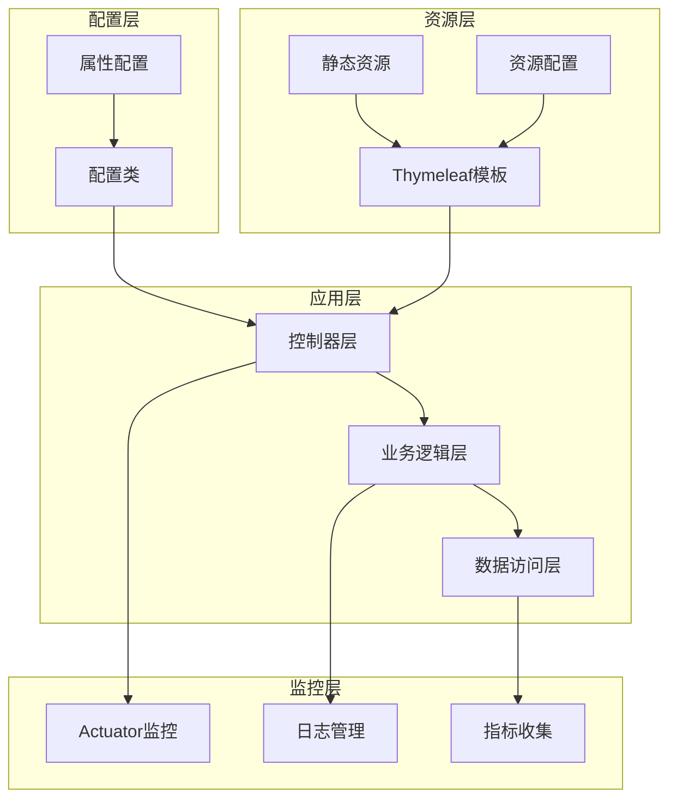
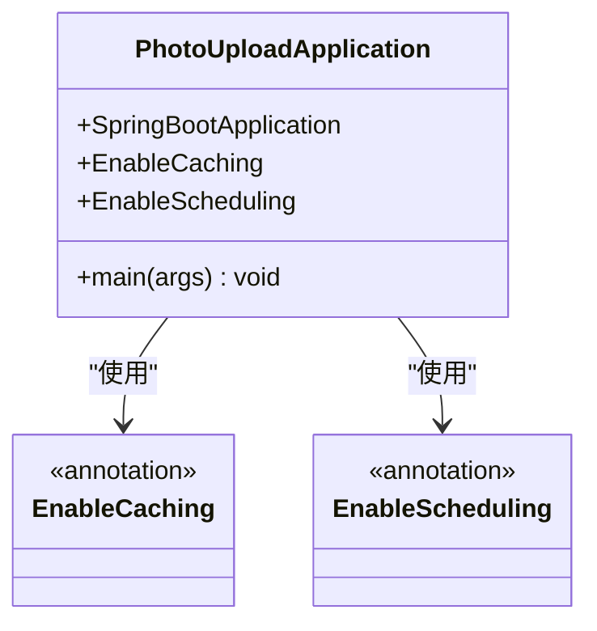
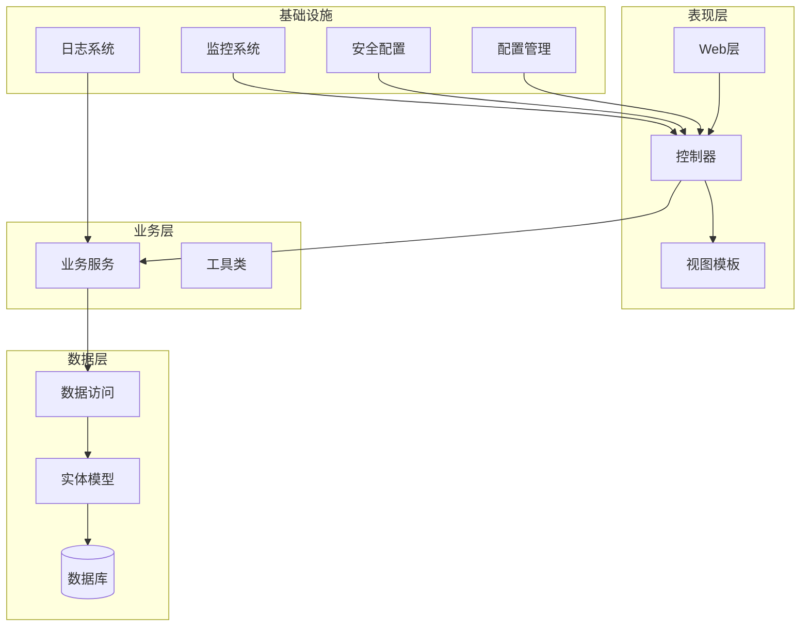
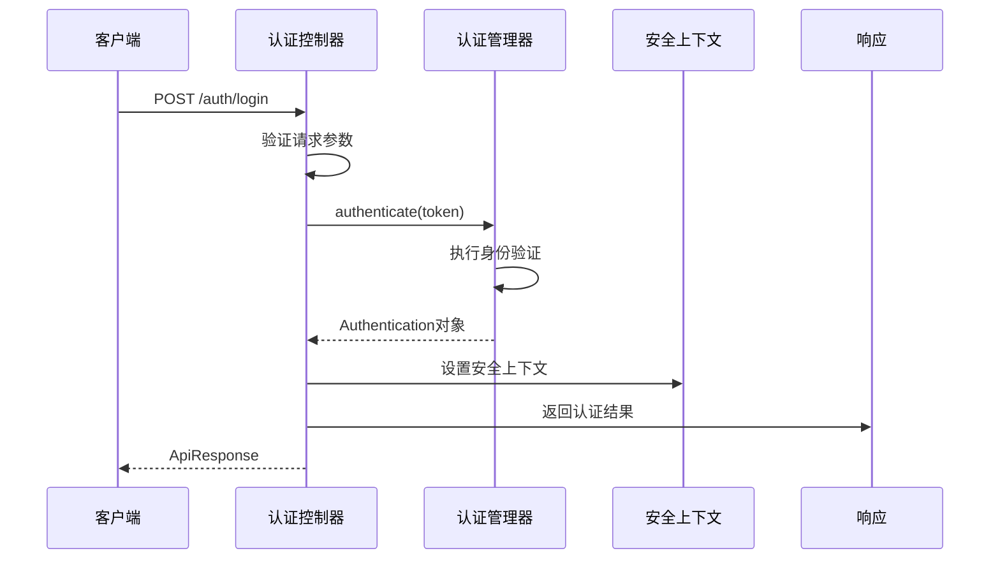
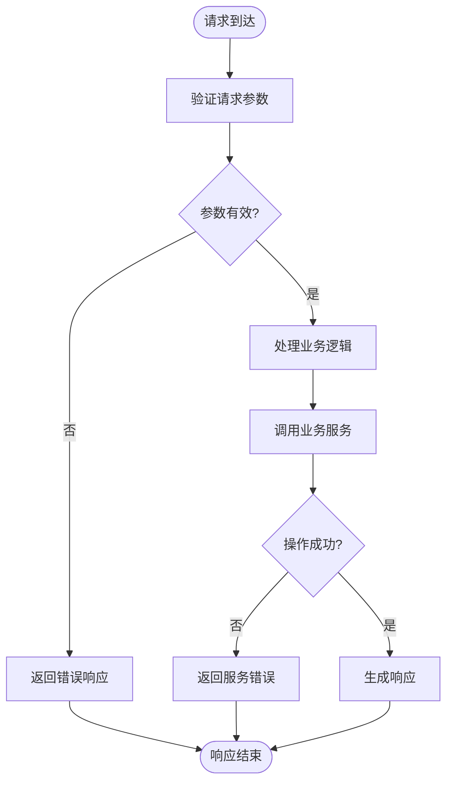
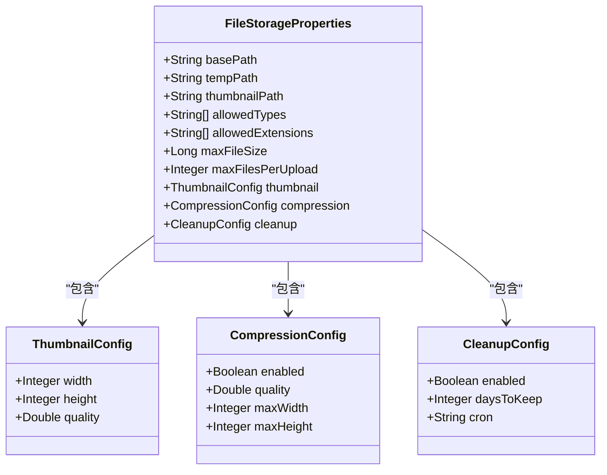
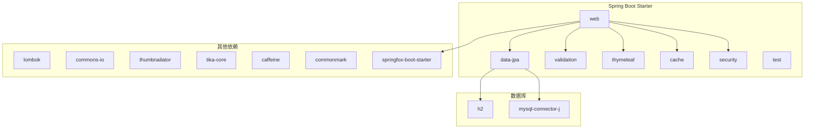

# 监控管理

<cite>
**本文档引用的文件**
- [pom.xml](file://pom.xml)
- [application.yml](file://src/main/resources/application.yml)
- [application-test.yml](file://src/test/resources/application-test.yml)
- [PhotoUploadApplication.java](file://src/main/java/com/photo/PhotoUploadApplication.java)
- [AuthController.java](file://src/main/java/com/photo/controller/AuthController.java)
- [NoteController.java](file://src/main/java/com/photo/controller/NoteController.java)
- [FileStorageProperties.java](file://src/main/java/com/photo/config/FileStorageProperties.java)
- [dashboard.html](file://src/main/resources/templates/dashboard.html)
- [README.md](file://README.md)
- [PROJECT_DELIVERY.md](file://PROJECT_DELIVERY.md)
- [NOTE_SYSTEM_README.md](file://NOTE_SYSTEM_README.md)
</cite>

## 目录
1. [简介](#简介)
2. [项目结构](#项目结构)
3. [核心组件](#核心组件)
4. [架构概览](#架构概览)
5. [详细组件分析](#详细组件分析)
6. [依赖关系分析](#依赖关系分析)
7. [性能考虑](#性能考虑)
8. [故障排除指南](#故障排除指南)
9. [结论](#结论)
10. [附录](#附录)

## 简介

本项目是一个基于Spring Boot的便签管理系统，采用赛博朋克视觉风格设计。虽然项目已经具备基本的监控能力，但为了满足生产环境的需求，需要进一步完善监控体系，包括Actuator端点配置、Prometheus集成、Grafana可视化、日志管理、性能监控、告警机制和分布式追踪等。

## 项目结构

该项目采用标准的Spring Boot项目结构，包含以下关键组件：



**图表来源**
- [PhotoUploadApplication.java](file://src/main/java/com/photo/PhotoUploadApplication.java#L1-L20)
- [application.yml](file://src/main/resources/application.yml#L1-L190)

**章节来源**
- [PhotoUploadApplication.java](file://src/main/java/com/photo/PhotoUploadApplication.java#L1-L20)
- [application.yml](file://src/main/resources/application.yml#L1-L190)

## 核心组件

### 应用程序入口
应用程序通过`PhotoUploadApplication`类启动，启用了缓存和定时调度功能：



**图表来源**
- [PhotoUploadApplication.java](file://src/main/java/com/photo/PhotoUploadApplication.java#L1-L20)

### 配置管理
应用使用YAML配置文件进行统一配置管理，包含数据库、缓存、日志、服务器等配置：

**章节来源**
- [application.yml](file://src/main/resources/application.yml#L1-L190)
- [application-test.yml](file://src/test/resources/application-test.yml#L1-L75)

## 架构概览

项目采用经典的三层架构模式，结合Spring Boot的自动配置特性：



**图表来源**
- [AuthController.java](file://src/main/java/com/photo/controller/AuthController.java#L1-L100)
- [NoteController.java](file://src/main/java/com/photo/controller/NoteController.java#L1-L200)

## 详细组件分析

### Actuator监控配置

当前项目已具备基础的Actuator监控配置，但需要进一步完善：

#### 当前配置分析
- **暴露端点**: health, info, metrics
- **健康检查**: when-authorized显示详细信息
- **端口**: 默认8080

#### 建议的完整配置
```yaml
# Actuator监控配置
management:
  endpoints:
    web:
      exposure:
        include: health,info,metrics,env,beans,httptrace,threaddump
      exclude: loggers
  endpoint:
    health:
      show-details: when-authorized
      probes:
        liveness: enabled
        readiness: enabled
    threaddump:
      enabled: true
  server:
    port: 8081
  security:
    enabled: true
    basic:
      enabled: true
```

**章节来源**
- [application.yml](file://src/main/resources/application.yml#L173-L182)

### 日志管理系统

#### 当前日志配置
- **日志级别**: root/INFO, com.photo/DEBUG, org.springframework.web/DEBUG
- **文件配置**: ./logs/photo-upload-system.log
- **轮转**: 最大10MB，保留30天历史

#### 建议的日志配置
```yaml
# 日志配置
logging:
  level:
    root: INFO
    com.photo: DEBUG
    org.springframework.web: DEBUG
    org.hibernate: INFO
    org.springframework.security: DEBUG
  pattern:
    console: "%d{yyyy-MM-dd HH:mm:ss} [%thread] %-5level %logger{36} - %msg%n"
    file: "%d{yyyy-MM-dd HH:mm:ss} [%thread] %-5level %logger{36} - %msg%n"
  file:
    name: ./logs/photo-upload-system.log
    max-size: 10MB
    max-history: 30
    total-size-cap: 1GB
  roll:
    - pattern: "yyyy-MM-dd"
    - size: 10MB
```

**章节来源**
- [application.yml](file://src/main/resources/application.yml#L146-L160)
- [application-test.yml](file://src/test/resources/application-test.yml#L71-L75)

### 性能监控指标

#### 当前服务器配置
- **端口**: 8080
- **压缩**: 启用，支持多种MIME类型
- **Tomcat连接器**: 最大10000连接，200线程

#### 建议的性能配置
```yaml
# 服务器配置
server:
  port: 8080
  compression:
    enabled: true
    mime-types: text/html,text/xml,text/plain,text/css,application/javascript,application/json,image/svg+xml
  tomcat:
    max-connections: 10000
    threads:
      max: 200
      min-spare: 10
    connection-timeout: 20000
    accept-count: 100
    max-connections: 10000
```

**章节来源**
- [application.yml](file://src/main/resources/application.yml#L161-L172)

### 控制器层监控

#### 认证控制器监控


**图表来源**
- [AuthController.java](file://src/main/java/com/photo/controller/AuthController.java#L47-L65)

#### 便签控制器监控


**图表来源**
- [NoteController.java](file://src/main/java/com/photo/controller/NoteController.java#L61-L161)

**章节来源**
- [AuthController.java](file://src/main/java/com/photo/controller/AuthController.java#L1-L100)
- [NoteController.java](file://src/main/java/com/photo/controller/NoteController.java#L1-L200)

### 文件存储监控

#### 文件存储配置


**图表来源**
- [FileStorageProperties.java](file://src/main/java/com/photo/config/FileStorageProperties.java#L71-L93)

**章节来源**
- [FileStorageProperties.java](file://src/main/java/com/photo/config/FileStorageProperties.java#L1-L120)

## 依赖关系分析

### Maven依赖分析



**图表来源**
- [pom.xml](file://pom.xml#L30-L150)

**章节来源**
- [pom.xml](file://pom.xml#L1-L169)

## 性能考虑

### 当前性能配置
- **缓存**: Caffeine缓存，最大1000个条目，过期时间3600秒
- **文件上传**: 最大10MB文件，50MB请求大小
- **数据库**: H2嵌入式数据库，DDL自动更新

### 性能优化建议
1. **连接池配置**: 配置数据库连接池参数
2. **缓存策略**: 优化缓存命中率
3. **异步处理**: 对耗时操作使用异步处理
4. **资源压缩**: 启用Gzip压缩

**章节来源**
- [application.yml](file://src/main/resources/application.yml#L50-L55)
- [application.yml](file://src/main/resources/application.yml#L42-L49)

## 故障排除指南

### 常见问题诊断

#### 启动问题
1. **端口占用**: 检查8080端口是否被占用
2. **JDK版本**: 确保使用Java 8或更高版本
3. **依赖缺失**: 运行`mvn clean install`重新构建

#### 运行时问题
1. **数据库连接**: 检查H2数据库文件权限
2. **文件存储**: 确认上传目录写入权限
3. **日志文件**: 检查日志目录空间

#### 监控问题
1. **Actuator端点**: 确认端点已正确暴露
2. **健康检查**: 检查依赖服务可用性
3. **指标收集**: 验证Micrometer配置

**章节来源**
- [PROJECT_DELIVERY.md](file://PROJECT_DELIVERY.md#L448-L453)

## 结论

本项目具备了基本的监控能力，但需要进一步完善以满足生产环境需求。建议按照以下优先级进行改进：

1. **立即实施**: 完善Actuator配置，启用更多监控端点
2. **短期目标**: 集成Prometheus和Grafana，建立可视化监控
3. **中期规划**: 实现分布式追踪和告警机制
4. **长期发展**: 建立完整的监控运维体系

通过这些改进，项目将具备企业级的监控和运维能力，能够更好地支持业务发展和用户需求。

## 附录

### 监控配置最佳实践

#### 安全配置
- 限制Actuator端点访问权限
- 使用HTTPS保护监控数据
- 配置适当的认证机制

#### 性能监控
- 监控关键业务指标
- 设置合理的阈值和告警
- 定期审查监控数据

#### 日志管理
- 统一日志格式
- 实施日志轮转策略
- 建立日志分析流程

**章节来源**
- [NOTE_SYSTEM_README.md](file://NOTE_SYSTEM_README.md#L232-L245)
- [README.md](file://README.md#L170-L212)