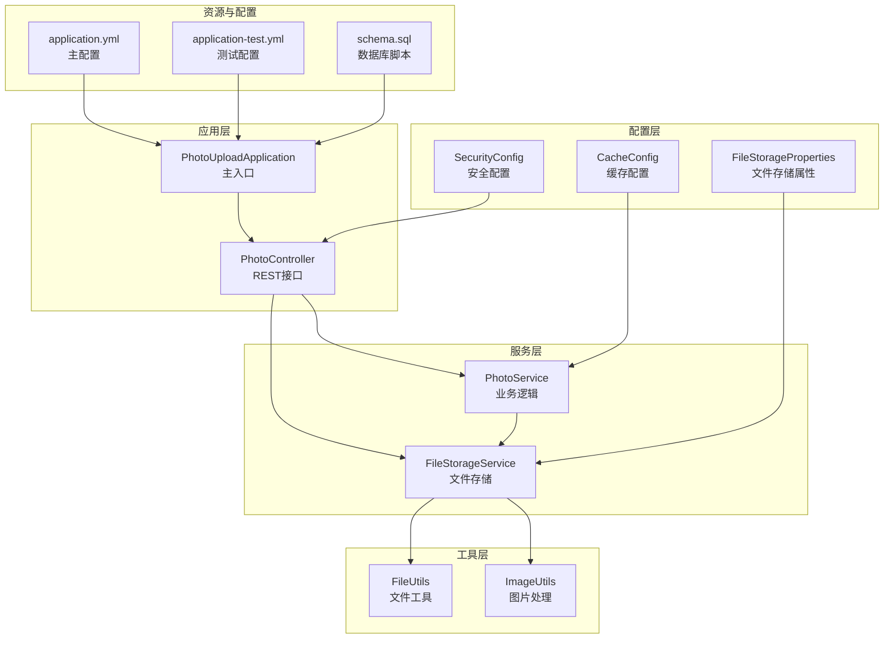
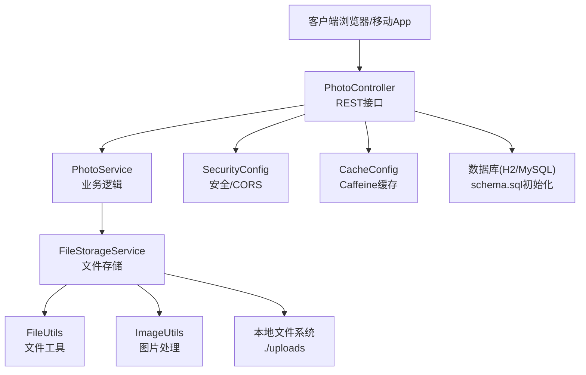
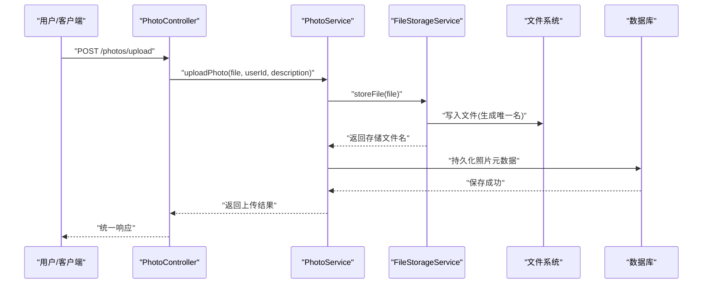
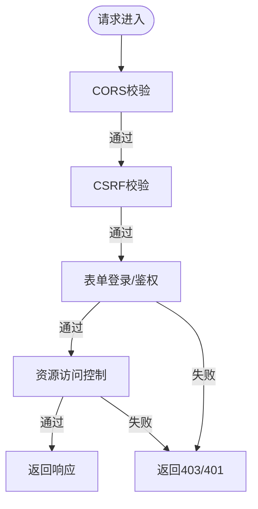
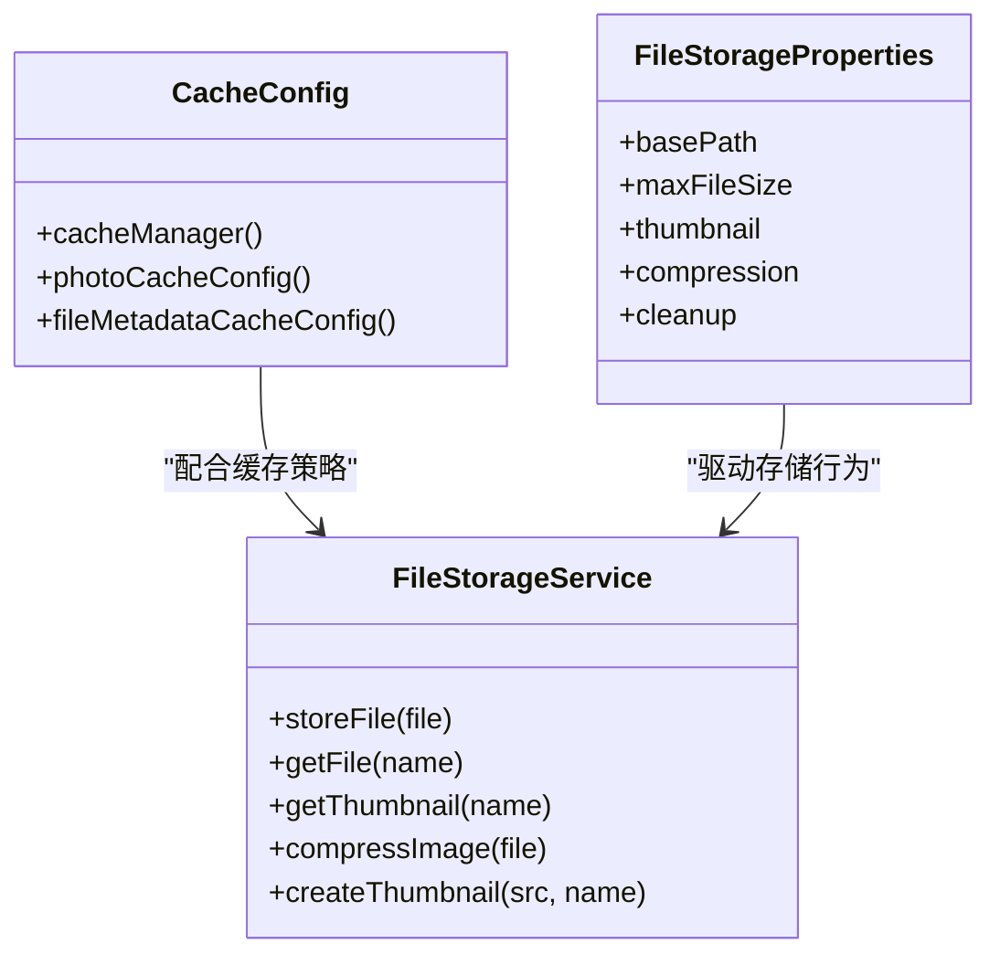
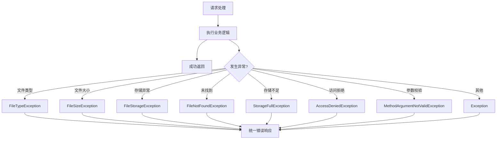
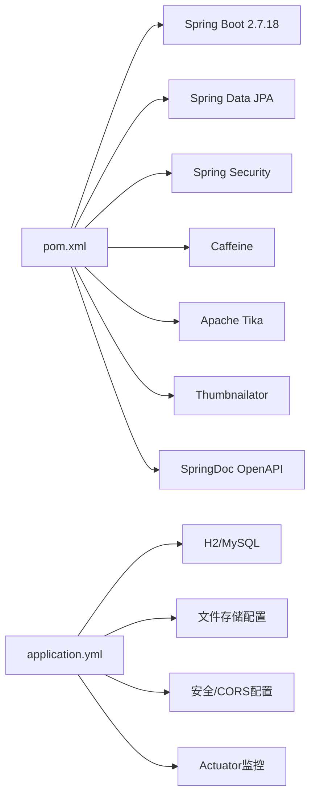

# 部署和运维

<cite>
**本文引用的文件**
- [pom.xml](file://pom.xml)
- [application.yml](file://src/main/resources/application.yml)
- [application-test.yml](file://src/test/resources/application-test.yml)
- [PhotoUploadApplication.java](file://src/main/java/com/photo/PhotoUploadApplication.java)
- [start.sh](file://start.sh)
- [SecurityConfig.java](file://src/main/java/com/photo/config/SecurityConfig.java)
- [FileStorageProperties.java](file://src/main/java/com/photo/config/FileStorageProperties.java)
- [FileStorageService.java](file://src/main/java/com/photo/service/FileStorageService.java)
- [PhotoController.java](file://src/main/java/com/photo/controller/PhotoController.java)
- [CacheConfig.java](file://src/main/java/com/photo/config/CacheConfig.java)
- [FileUtils.java](file://src/main/java/com/photo/util/FileUtils.java)
- [ImageUtils.java](file://src/main/java/com/photo/util/ImageUtils.java)
- [GlobalExceptionHandler.java](file://src/main/java/com/photo/exception/GlobalExceptionHandler.java)
- [schema.sql](file://src/main/resources/schema.sql)
- [README.md](file://README.md)
- [PROJECT_SUMMARY.md](file://PROJECT_SUMMARY.md)
- [API_DOCUMENTATION.md](file://API_DOCUMENTATION.md)
</cite>

## 目录
1. [简介](#简介)
2. [项目结构](#项目结构)
3. [核心组件](#核心组件)
4. [架构总览](#架构总览)
5. [详细组件分析](#详细组件分析)
6. [依赖关系分析](#依赖关系分析)
7. [性能考虑](#性能考虑)
8. [故障排查指南](#故障排查指南)
9. [结论](#结论)
10. [附录](#附录)

## 简介
本指南面向运维工程师，提供照片上传下载系统的完整部署与运维手册。内容涵盖多环境部署（开发、测试、生产）、容器化与Kubernetes部署策略、监控与告警、日志与性能管理、备份恢复、安全加固、版本升级、高可用与灾难恢复等。文档同时给出基于仓库现有配置的落地步骤与最佳实践。

## 项目结构
系统采用Spring Boot标准分层架构，核心模块包括配置、控制器、服务、工具、异常处理与资源文件。关键配置集中在YAML文件中，便于多环境差异化管理。

图表来源
- [PhotoUploadApplication.java](file://src/main/java/com/photo/PhotoUploadApplication.java#L1-L20)
- [PhotoController.java](file://src/main/java/com/photo/controller/PhotoController.java#L1-L316)
- [FileStorageService.java](file://src/main/java/com/photo/service/FileStorageService.java#L1-L300)
- [SecurityConfig.java](file://src/main/java/com/photo/config/SecurityConfig.java#L1-L99)
- [CacheConfig.java](file://src/main/java/com/photo/config/CacheConfig.java#L1-L54)
- [FileStorageProperties.java](file://src/main/java/com/photo/config/FileStorageProperties.java#L1-L94)
- [FileUtils.java](file://src/main/java/com/photo/util/FileUtils.java#L1-L178)
- [ImageUtils.java](file://src/main/java/com/photo/util/ImageUtils.java#L1-L182)
- [application.yml](file://src/main/resources/application.yml#L1-L190)
- [application-test.yml](file://src/test/resources/application-test.yml#L1-L75)
- [schema.sql](file://src/main/resources/schema.sql#L1-L144)

章节来源
- [pom.xml](file://pom.xml#L1-L169)
- [application.yml](file://src/main/resources/application.yml#L1-L190)
- [application-test.yml](file://src/test/resources/application-test.yml#L1-L75)
- [PhotoUploadApplication.java](file://src/main/java/com/photo/PhotoUploadApplication.java#L1-L20)

## 核心组件
- 应用入口与启动：主应用类启用缓存与调度能力，便于后续定时清理等任务。
- 控制器层：提供13个REST接口，覆盖上传、下载、预览、断点续传、搜索、统计等。
- 服务层：文件存储服务负责目录初始化、文件读写、缩略图与压缩、范围读取等；业务服务负责照片元数据与访问统计。
- 配置层：安全配置启用CORS与表单登录；缓存配置使用Caffeine；文件存储属性集中管理存储路径、类型、大小、压缩与清理策略。
- 工具层：文件工具与图片工具分别负责类型检测、文件名清洗、MD5计算、图片尺寸与压缩等。
- 异常处理：全局异常处理器对各类业务异常进行标准化响应。
- 资源与配置：YAML配置文件集中管理数据库、文件存储、安全、日志、服务器、Actuator监控等。

章节来源
- [PhotoUploadApplication.java](file://src/main/java/com/photo/PhotoUploadApplication.java#L1-L20)
- [PhotoController.java](file://src/main/java/com/photo/controller/PhotoController.java#L1-L316)
- [FileStorageService.java](file://src/main/java/com/photo/service/FileStorageService.java#L1-L300)
- [SecurityConfig.java](file://src/main/java/com/photo/config/SecurityConfig.java#L1-L99)
- [CacheConfig.java](file://src/main/java/com/photo/config/CacheConfig.java#L1-L54)
- [FileStorageProperties.java](file://src/main/java/com/photo/config/FileStorageProperties.java#L1-L94)
- [FileUtils.java](file://src/main/java/com/photo/util/FileUtils.java#L1-L178)
- [ImageUtils.java](file://src/main/java/com/photo/util/ImageUtils.java#L1-L182)
- [GlobalExceptionHandler.java](file://src/main/java/com/photo/exception/GlobalExceptionHandler.java#L1-L140)
- [application.yml](file://src/main/resources/application.yml#L1-L190)

## 架构总览
系统采用前后端分离模式，后端提供REST接口与静态资源，前端通过HTTP调用后端接口实现上传、下载、预览等功能。安全方面通过Spring Security与CORS配置实现跨域与访问控制，文件存储采用本地磁盘，支持缩略图与压缩。

图表来源
- [PhotoController.java](file://src/main/java/com/photo/controller/PhotoController.java#L1-L316)
- [FileStorageService.java](file://src/main/java/com/photo/service/FileStorageService.java#L1-L300)
- [FileUtils.java](file://src/main/java/com/photo/util/FileUtils.java#L1-L178)
- [ImageUtils.java](file://src/main/java/com/photo/util/ImageUtils.java#L1-L182)
- [SecurityConfig.java](file://src/main/java/com/photo/config/SecurityConfig.java#L1-L99)
- [CacheConfig.java](file://src/main/java/com/photo/config/CacheConfig.java#L1-L54)
- [schema.sql](file://src/main/resources/schema.sql#L1-L144)

## 详细组件分析

### 文件存储与上传下载流程
- 上传：控制器接收multipart请求，调用服务层进行类型与大小校验、生成唯一文件名、复制到目标目录、生成缩略图与压缩、记录元数据。
- 下载：支持普通下载与断点续传（Range），返回正确的Content-Type与缓存头；预览与缩略图接口分别返回图片流与固定尺寸缩略图。
- 存储清理：通过定时任务按配置清理过期文件，避免磁盘占用增长。

图表来源
- [PhotoController.java](file://src/main/java/com/photo/controller/PhotoController.java#L48-L61)
- [FileStorageService.java](file://src/main/java/com/photo/service/FileStorageService.java#L59-L95)
- [schema.sql](file://src/main/resources/schema.sql#L1-L144)

章节来源
- [PhotoController.java](file://src/main/java/com/photo/controller/PhotoController.java#L48-L61)
- [FileStorageService.java](file://src/main/java/com/photo/service/FileStorageService.java#L59-L95)
- [FileUtils.java](file://src/main/java/com/photo/util/FileUtils.java#L41-L44)

### 安全与访问控制
- CORS：允许配置的来源、方法、头与凭据。
- CSRF禁用：简化前端直连场景；生产环境建议启用并配合CSRF令牌。
- 表单登录：提供登录页与登出URL，登录成功跳转仪表板。
- 防盗链：可配置允许域名列表，校验Referer头。
- 密码加密：BCryptPasswordEncoder用于密码编码。

图表来源
- [SecurityConfig.java](file://src/main/java/com/photo/config/SecurityConfig.java#L37-L58)
- [application.yml](file://src/main/resources/application.yml#L120-L145)

章节来源
- [SecurityConfig.java](file://src/main/java/com/photo/config/SecurityConfig.java#L37-L58)
- [application.yml](file://src/main/resources/application.yml#L120-L145)

### 缓存与性能优化
- Caffeine缓存：配置最大条目与过期时间，照片信息与文件元数据分别缓存。
- 图片压缩与缩略图：自动压缩超限图片，生成固定尺寸缩略图，提升加载速度。
- HTTP缓存：预览与缩略图设置Cache-Control头，减少重复请求。

图表来源
- [CacheConfig.java](file://src/main/java/com/photo/config/CacheConfig.java#L1-L54)
- [FileStorageProperties.java](file://src/main/java/com/photo/config/FileStorageProperties.java#L1-L94)
- [FileStorageService.java](file://src/main/java/com/photo/service/FileStorageService.java#L1-L300)

章节来源
- [CacheConfig.java](file://src/main/java/com/photo/config/CacheConfig.java#L22-L52)
- [FileStorageProperties.java](file://src/main/java/com/photo/config/FileStorageProperties.java#L55-L92)
- [FileStorageService.java](file://src/main/java/com/photo/service/FileStorageService.java#L146-L183)

### 异常处理与日志
- 全局异常处理器：对文件类型、大小、存储、未找到、存储不足、访问拒绝、参数校验等异常进行统一响应。
- 日志级别与输出：root/INFO，应用包DEBUG，文件滚动与历史保留配置。

图表来源
- [GlobalExceptionHandler.java](file://src/main/java/com/photo/exception/GlobalExceptionHandler.java#L26-L138)
- [application.yml](file://src/main/resources/application.yml#L146-L160)

章节来源
- [GlobalExceptionHandler.java](file://src/main/java/com/photo/exception/GlobalExceptionHandler.java#L26-L138)
- [application.yml](file://src/main/resources/application.yml#L146-L160)

## 依赖关系分析
- 构建与运行：Maven管理依赖，Spring Boot插件打包，DevTools便于开发调试。
- 数据库：默认H2嵌入式数据库，生产环境可切换为MySQL；SQL初始化脚本可选。
- 文件存储：本地文件系统，支持路径、类型、大小、压缩、清理等配置。
- 安全与监控：Spring Security、CORS、Actuator健康与指标暴露。

图表来源
- [pom.xml](file://pom.xml#L30-L149)
- [application.yml](file://src/main/resources/application.yml#L1-L190)

章节来源
- [pom.xml](file://pom.xml#L30-L149)
- [application.yml](file://src/main/resources/application.yml#L1-L190)

## 性能考虑
- 上传/下载优化：断点续传支持Range请求，减少网络波动影响；预览与缩略图设置缓存头。
- 图片处理：自动压缩与缩略图生成，降低带宽与加载时间。
- 缓存策略：Caffeine缓存热点数据，降低数据库压力。
- Tomcat线程池：合理配置最大连接与线程数，满足并发访问需求。

章节来源
- [PhotoController.java](file://src/main/java/com/photo/controller/PhotoController.java#L184-L225)
- [FileStorageService.java](file://src/main/java/com/photo/service/FileStorageService.java#L170-L183)
- [CacheConfig.java](file://src/main/java/com/photo/config/CacheConfig.java#L22-L52)
- [application.yml](file://src/main/resources/application.yml#L162-L172)

## 故障排查指南
- 上传失败：检查文件类型与大小限制、存储目录权限、磁盘空间；查看全局异常响应与日志。
- 下载/预览异常：确认防盗链配置、文件存在性、缓存头设置；检查文件系统权限。
- 数据库问题：确认H2/MySQL连接配置、初始化脚本执行、索引是否存在。
- 安全相关：核对CORS与Referer配置，确保生产环境开启CSRF保护与HTTPS。
- 性能问题：观察缓存命中率、CPU/内存使用、磁盘IO与网络带宽。

章节来源
- [GlobalExceptionHandler.java](file://src/main/java/com/photo/exception/GlobalExceptionHandler.java#L26-L138)
- [application.yml](file://src/main/resources/application.yml#L146-L160)
- [schema.sql](file://src/main/resources/schema.sql#L1-L144)

## 结论
本系统提供了完整的照片上传下载能力，具备良好的扩展性与运维友好性。通过合理的多环境配置、安全加固、监控与日志、备份与清理策略，可满足从开发到生产的全生命周期运维需求。建议在生产环境进一步引入对象存储、反向代理、负载均衡与Kubernetes编排，以实现高可用与弹性伸缩。

## 附录

### 多环境部署方案与配置差异
- 开发环境
  - 数据库：H2文件数据库，SQL初始化模式为always。
  - 文件存储：本地目录./uploads，允许的文件类型与大小限制。
  - 安全：CORS启用，防盗链可配置，Token密钥为开发默认值。
  - 日志：DEBUG级别，文件滚动与历史保留。
- 测试环境
  - 数据库：H2内存数据库，DDL策略为create-drop。
  - 文件存储：./test-uploads，关闭压缩与清理。
  - 安全：CORS启用，防盗链关闭。
- 生产环境
  - 数据库：MySQL，使用真实连接信息与连接池。
  - 文件存储：建议使用对象存储（OSS/S3）替代本地磁盘，或挂载持久化卷。
  - 安全：启用HTTPS、CSRF保护、严格的CORS与Referer白名单、强Token密钥。
  - 监控：启用Actuator指标，配置Prometheus/Grafana监控与告警。

章节来源
- [application.yml](file://src/main/resources/application.yml#L1-L190)
- [application-test.yml](file://src/test/resources/application-test.yml#L1-L75)

### 容器化与Kubernetes部署策略
- Docker镜像构建
  - 基于官方JRE镜像，复制编译产物，暴露端口8080，设置健康检查。
  - 将application.yml映射为环境变量或挂载配置卷，区分环境。
- Kubernetes部署
  - Deployment：副本数、资源限制与请求、滚动更新策略。
  - Service：ClusterIP/LoadBalancer暴露服务。
  - ConfigMap：存放application.yml与schema.sql。
  - Secret：数据库连接、Token密钥、证书等敏感信息。
  - PersistentVolume：为上传目录提供持久化存储。
  - HPA：基于CPU/内存或自定义指标进行自动扩缩容。
  - Ingress：反向代理与TLS终止，配置限流与WAF。
- 健康检查
  - livenessProbe/readinessProbe：基于Actuator健康端点。

章节来源
- [pom.xml](file://pom.xml#L152-L167)
- [application.yml](file://src/main/resources/application.yml#L173-L189)

### 监控指标与告警配置
- 指标采集
  - Actuator暴露：health、info、metrics等端点。
  - JVM与应用指标：堆内存、GC、线程、HTTP请求速率与延迟。
  - 自定义指标：上传/下载次数、存储使用率、异常率。
- 告警规则
  - 存储使用率超过阈值（如80%）触发告警。
  - HTTP错误率（4xx/5xx）异常升高触发告警。
  - 响应时间P95/P99超过阈值触发告警。
  - 健康探针失败持续一定时间触发告警。
- 可视化
  - Grafana仪表盘展示关键指标与趋势。

章节来源
- [application.yml](file://src/main/resources/application.yml#L173-L189)

### 日志管理与性能监控
- 日志级别与输出：root/INFO，应用包DEBUG；控制台与文件输出格式一致。
- 日志轮转：按大小与历史天数轮转，避免磁盘占满。
- 性能监控：结合JVM指标与应用指标，定位瓶颈（CPU、内存、IO、网络）。

章节来源
- [application.yml](file://src/main/resources/application.yml#L146-L160)

### 备份恢复与安全加固
- 备份
  - 数据库：定期快照与增量备份，测试恢复流程。
  - 文件：对象存储或NAS备份，校验完整性与可用性。
- 恢复
  - RTO/RPO明确，演练恢复流程，验证数据一致性。
- 安全加固
  - HTTPS强制，CSRF保护，严格的CORS与Referer白名单。
  - 最小权限原则，Secret管理，定期轮换密钥。
  - WAF/DDoS防护，入侵检测与审计日志。

章节来源
- [SecurityConfig.java](file://src/main/java/com/photo/config/SecurityConfig.java#L37-L58)
- [application.yml](file://src/main/resources/application.yml#L120-L145)

### 版本升级与变更管理
- 升级策略
  - 小步快跑，灰度发布，回滚预案。
  - 升级前备份数据库与文件，升级后验证功能与性能。
- 变更管理
  - 配置变更通过Git管理，CI/CD自动化部署。
  - 变更窗口与影响评估，变更后监控与告警。

章节来源
- [README.md](file://README.md#L254-L261)

### 负载均衡、高可用与灾难恢复
- 负载均衡：Nginx/HAProxy/云负载均衡，会话粘性或无状态设计。
- 高可用：多副本部署，健康检查与自动故障转移。
- 灾难恢复：异地多活，RPO/RTO目标明确，定期演练。

章节来源
- [application.yml](file://src/main/resources/application.yml#L162-L172)

### 运维操作清单
- 启动与停止：使用start.sh或直接运行JAR包。
- 配置更新：通过环境变量或配置卷热更新（谨慎）。
- 日志巡检：关注异常与错误日志，定期归档。
- 存储清理：按配置执行定时任务，监控磁盘使用率。
- 安全巡检：检查密钥轮换、CORS与Referer配置、访问日志。

章节来源
- [start.sh](file://start.sh#L1-L59)
- [application.yml](file://src/main/resources/application.yml#L112-L118)